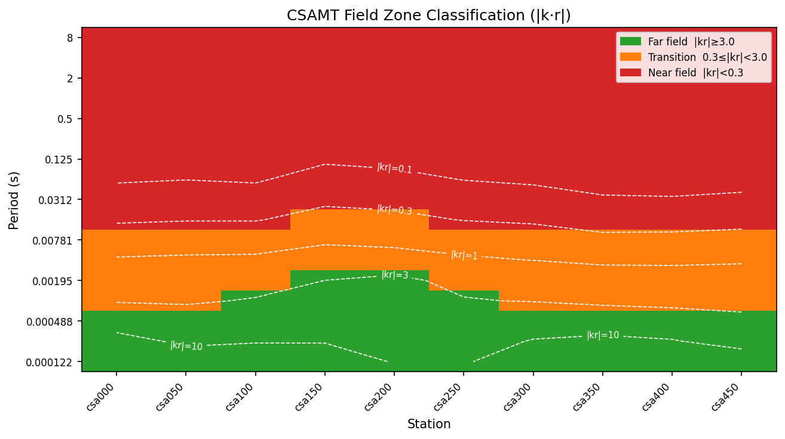

.. _tutorial_run_pipeline_from_config:

Run a Pipeline From Config
==========================

This tutorial shows how to run a reproducible pyCSAMT processing pipeline from
a configuration file. The workflow is designed for survey processing that must
be repeated, reviewed, shared, or used as evidence before inversion.

The central idea is:

*put the processing chain in a small config file, run that config from Python
or the CLI, and let pyCSAMT write the processed EDIs, plots, reports, and a
copy of the pipeline that was actually executed.*

What You Will Learn
-------------------

After this tutorial you should be able to:

- create a YAML pipeline configuration file
- understand the ``name``, ``output_dir``, ``preset``, and ``steps`` keys
- load a pipeline with :meth:`pycsamt.pipeline.Pipeline.from_yaml`
- inspect the resolved processing chain before running it
- run the pipeline on an EDI survey
- control processed EDI, plot, and report outputs
- debug a pipeline with ``--dry-run``, ``--n-steps``, ``--from-step``, and
  ``--until-step``
- read the returned ``PipelineResult``
- use the equivalent ``pycsamt pipe`` CLI commands
- pick a method-aware preset (``mt_qc``, ``amt_qc``, ``csamt_qc``,
  ``csumt_qc``) instead of hand-writing frequency-band overrides
- resume an interrupted run with the step :term:`step cache`
- watch live per-step progress and query the :term:`run history log`
- generate the branded :term:`dashboard report` alongside the plain one

Why Use a Config File?
----------------------

Interactive notebooks are useful for exploration, but production survey
processing needs a stronger record. A config file makes the processing chain
explicit:

- the ordered step list is visible;
- every parameter override is written down;
- the same file can be used from Python and the CLI;
- a colleague can review the workflow before it is run;
- output reports can point back to the exact pipeline file;
- the same workflow can be applied to several lines or surveys.

For quick experiments, a preset such as ``Pipeline.from_preset("basic_qc")`` is
fine. For project work, write the workflow to YAML.

Input Assumptions
-----------------

The examples below assume:

- EDI files are stored in ``data/AMT/WILLY_DATA/L18PLT``;
- the pipeline config will be stored at ``config/l18_first_qc.yaml``;
- output will be written to ``results/l18_first_qc``.

The bundled ``L18PLT`` line is a flat EDI folder:

.. code-block:: text

   data/
     AMT/
       WILLY_DATA/
         L18PLT/
           18-001A.edi
           18-002U.edi
           ...
           18-025A.edi

If your survey has several independent lines, start by running the workflow on
one line. After the parameters are stable, apply the same config to the other
lines.

Create a Minimal YAML Config
----------------------------

This is a complete first-pass QC pipeline:

.. code-block:: yaml
   :linenos:

   name: l18_first_qc
   output_dir: results/l18_first_qc

   steps:
     - name: notch
       code: NR001
       params:
         mains_hz: 50.0
         n_harm: 30
         tol_hz: 0.08

     - name: drop_duplicates
       code: FREQ002

     - name: select_band
       code: FREQ001
       params:
         band_hz: [1.0, 10000.0]

     - name: align_grid
       code: FREQ004

     - name: qc_snapshot
       code: QC001

Save it as ``config/l18_first_qc.yaml``.

The keys mean:

``name``
    Human-readable label used in summaries and reports.

``output_dir``
    Default output directory when ``Pipeline.run`` is called without an
    explicit ``outdir``.

``steps``
    Ordered processing operations. Each item is converted to a
    :class:`pycsamt.pipeline.Step`.

``name`` inside a step
    User label for that occurrence of the step. This label appears in output
    folders and can be used for partial runs.

``code``
    Registry code, such as ``NR001`` or ``FREQ001``. Registry names such as
    ``notch_powerline`` can also be used, but codes are easier to audit.

``params``
    Keyword arguments forwarded to the underlying processing function. Values
    here override the step defaults. ``NR001``'s ``mains_hz`` also accepts
    the literal string ``"auto"`` to detect 50 vs 60 Hz from the survey's
    own frequency grid instead of assuming an exact value -- see
    :doc:`../user_guide/pipeline/steps`.

The configured chain is intentionally short: remove harmonic power-line noise,
normalise the frequency rows, keep the survey band used for this first QC pass,
align the station grids, and then write a diagnostic snapshot.

.. figure:: ../images/tutorials/run_pipeline_from_config/pipeline_configured_chain.png
   :alt: Configured pyCSAMT pipeline chain for the L18PLT tutorial
   :width: 100%

   Five explicit steps are easier to review than a long automatic workflow.

Load and Inspect the Pipeline
-----------------------------

Load the YAML file with :meth:`pycsamt.pipeline.Pipeline.from_yaml`:

.. code-block:: pycon
   :linenos:

   >>> from pycsamt.pipeline import Pipeline
   >>> pipe = Pipeline.from_yaml("config/l18_first_qc.yaml")
   >>> print(pipe)
   Pipeline  'l18_first_qc'  ───────────────────────────────────────────────  5 steps
     ( 1) notch            [NR001]    Power-line Harmonic Notch   mains_hz=50.0  n_harm=30  tol_hz=0.08
     ( 2) drop_duplicates  [FREQ002]  Drop Duplicate Frequencies
     ( 3) select_band      [FREQ001]  Frequency Band Select       band_hz=[1.0, 10000.0]
     ( 4) align_grid       [FREQ004]  Frequency Grid Alignment
     ( 5) qc_snapshot      [QC001]    QC Quick-Look Snapshot
   ────────────────────────────────────────────────────────────────────────────────

For a dataframe view of the resolved steps:

.. code-block:: pycon
   :linenos:

   >>> table = pipe.describe()
   >>> print(table[["label", "code", "category", "params"]])
                label     code       category                                            params
   #
   1            notch    NR001  noise_removal  {'mains_hz': 50.0, 'n_harm': 30, 'tol_hz': 0.08}
   2  drop_duplicates  FREQ002      frequency                                                {}
   3      select_band  FREQ001      frequency                       {'band_hz': [1.0, 10000.0]}
   4       align_grid  FREQ004      frequency                                                {}
   5      qc_snapshot    QC001             qc                                                {}

Before running a workflow for the first time, inspect the steps and check:

- the order matches the processing logic;
- labels are unique and readable;
- frequency limits match the survey type;
- power-line settings match the local electrical grid;
- diagnostic steps such as ``QC001`` appear where you want snapshots.

Read the Survey
---------------

Read the EDI survey through the public API:

.. code-block:: pycon
   :linenos:

   >>> from pycsamt.api import read_edis
   >>> survey = read_edis(
   ...     "data/AMT/WILLY_DATA/L18PLT",
   ...     recursive=False,
   ...     strict=False,
   ...     progress=False,
   ... )
   >>> sites = survey.collection
   >>> print(survey.summary())
   APIFrame: edi_survey_summary
   kind: edi.summary
   shape: 28 rows x 6 columns
   columns: station, path, n_freq, tipper, spectra, ts
   numeric: 1 columns
   missing: 0.0%
   source: data/AMT/WILLY_DATA/L18PLT

The pipeline runs on a site collection. ``survey.collection`` is the lower-level
object used by the pipeline and by the editing/QC tools. The bundled line loads
as 28 stations.

Run the Pipeline
----------------

Run the loaded pipeline:

.. code-block:: pycon
   :linenos:

   >>> result = pipe.run(sites)
   >>> print(result.summary())

Because the config defines ``output_dir``, this writes to
``results/l18_first_qc``. To override the output directory from Python:

.. code-block:: pycon
   :linenos:

   >>> result = pipe.run(
   ...     sites,
   ...     outdir="results/l18_first_qc_trial_02",
   ... )

To run fully in memory with no filesystem output:

.. code-block:: pycon
   :linenos:

   >>> result = pipe.run(
   ...     sites,
   ...     outdir=None,
   ...     save_plots=False,
   ...     save_edis=False,
   ...     save_report=False,
   ... )

Inspect the Result
------------------

``Pipeline.run`` returns a ``PipelineResult``:

.. code-block:: pycon
   :linenos:

   >>> print(result.ok)
   True
   >>> print(result.n_errors)
   0
   >>> print(result.outdir)
   results/l18_first_qc
   >>> processed_sites = result.sites_out

Each step also has a ``StepResult``:

.. code-block:: pycon
   :linenos:

   >>> for step_result in result.step_results:
   ...     print(step_result.summary_line())
   ...
   >>> failed = [sr for sr in result.step_results if not sr.ok]
   >>> for sr in failed:
   ...     print(sr.step_name, sr.step_code, sr.error)

By default, the pipeline continues after step errors according to the pipeline
runtime configuration. For strict production runs, configure the error policy
or use the CLI ``--on-error raise`` option.

For the bundled ``L18PLT`` line, the full run completes with all five steps OK:

.. code-block:: text

   PipelineResult  'l18_first_qc'
     Sites   : 28 in → 28 out
     Steps   : 5 (5 ok, 0 err)
     Time    : 23.94 s
     Plots   : 9
     Output  : results/l18_first_qc

   [ 1] notch                [NR001]  OK  3.60s  sites 28→28  plots=2
   [ 2] drop_duplicates      [FREQ002]  OK  1.12s  sites 28→28  plots=1
   [ 3] select_band          [FREQ001]  OK  8.67s  sites 28→28  plots=2
   [ 4] align_grid           [FREQ004]  OK  1.50s  sites 28→28  plots=1
   [ 5] qc_snapshot          [QC001]  OK  9.81s  sites 28→28  plots=3

Timings vary by machine, but the station count, step status, and artifact
counts are the values to check first.

.. figure:: ../images/tutorials/run_pipeline_from_config/pipeline_step_status.png
   :alt: Pipeline step status and plot counts for the L18PLT config run
   :width: 100%

Understand the Output Folder
----------------------------

A normal run writes a directory like this:

.. code-block:: text

   results/l18_first_qc/
     pipeline.yaml
     plots/
       01_notch/
         nr_qc_harmonic_waterfall.png
         nr_qc_snr_gain_profile.png
       02_drop_duplicates/
         plot_coverage_quality_heatmap.png
       03_select_band/
         plot_band_microstrips.png
         plot_coverage_quality_heatmap.png
       04_align_grid/
         plot_coverage_quality_heatmap.png
       05_qc_snapshot/
         plot_coverage_psection.png
         plot_qc_quicklook.png
         plot_station_confidence_dashboard.png
     processed/
       18-001A.edi
       18-002U.edi
       ...
     report.html
     summary.txt

The important files are:

``processed/``
    Final processed EDI files written after the last step.

``plots/``
    Per-step QC figures generated by the step registry.

``pipeline.yaml``
    Canonical copy of the pipeline that was run. Keep this with the output.

``summary.txt``
    Text run report for quick inspection.

``report.html``
    HTML run report for project records and review.

The output tree is intentionally stable so that scripts, reports, and later
inversion preparation can point to predictable paths.

The example run writes 28 processed EDI files, 9 QC figures, 2 reports, and
1 saved copy of the pipeline config:

.. figure:: ../images/tutorials/run_pipeline_from_config/pipeline_output_artifacts.png
   :alt: Artifact counts written by the L18PLT pipeline config run
   :width: 90%

``report.html`` and ``summary.txt`` are written by default. A third,
opt-in :term:`dashboard report` (``dashboard.html``) with KPI stat tiles
and charts is added alongside them when requested -- see `Beyond the
Basics`_ below.

Generate a Starter Config
-------------------------

The CLI can scaffold a valid config:

.. code-block:: bash
   :linenos:

   pycsamt pipe init \
       --preset basic_qc \
       --name l18_first_qc \
       --outdir results/l18_first_qc \
       --output config/l18_first_qc.yaml

Print a scaffold without writing it:

.. code-block:: bash
   :linenos:

   pycsamt pipe init --preset full_processing --print

Generate JSON or Python config files when needed:

.. code-block:: bash
   :linenos:

   pycsamt pipe init --format json --preset basic_qc -o config/l18_first_qc.json
   pycsamt pipe init --format py --preset basic_qc -o config/l18_first_qc.py

YAML is recommended for most survey projects. Python configs are useful for
trusted internal workflows that need constants or small local logic.

Seed a Config From a Preset
---------------------------

You can combine a preset with explicit steps. Preset steps run first, and the
steps listed in the file are appended afterward:

.. code-block:: yaml
   :linenos:

   name: publication_with_extra_qc
   output_dir: results/publication_with_extra_qc
   preset: publication_ready

   steps:
     - name: final_qc
       code: QC001

This is useful when a built-in preset is almost correct but you want one or two
additional operations. If you need to remove or reorder many preset steps, copy
the preset into an explicit ``steps`` list instead. Explicit files are easier
to review.

Discover Steps and Presets
--------------------------

From Python:

.. code-block:: pycon
   :linenos:

   >>> from pycsamt.pipeline import Pipeline, list_steps, preset_catalogue
   >>> for spec in list_steps("frequency"):
   ...     print(spec.code, spec.name, spec.defaults)
   ...
   FREQ001 select_band {'band_hz': (0.001, 10000.0)}
   FREQ002 drop_duplicates {}
   FREQ003 drop_low_confidence {}
   FREQ004 align_grid {}
   FREQ005 regrid_logspace {'n_per_decade': 6}
   FREQ006 decimate {'step': 2}
   FREQ007 smooth_freq {'window': 3}
   FREQ008 mask_low_confidence {'method': 'composite', 'threshold': 0.5}
   FREQ009 recover_low_confidence {'method': 'composite', 'ci_hi': 0.9, 'ci_lo': 0.5, 'interpolation': 'linear'}
   >>> print(Pipeline.step_info("NR001"))
   ────────────────────────────────────────────────────────────────────
     NR001  Power-line Harmonic Notch  [noise_removal]
   ────────────────────────────────────────────────────────────────────
     name     : notch_powerline
     function : pycsamt.emtools.remove_noise.notch_powerline
     defaults : mains_hz=50  n_harm=30  tol_hz=0.08
     qc plots : nr_qc_harmonic_waterfall, nr_qc_snr_gain_profile
     returns  : Sites (transform)
   ────────────────────────────────────────────────────────────────────

``preset_catalogue()`` prints every registered preset, including the four
method-aware ones, with its description and step sequence.

From the CLI:

.. code-block:: bash
   :linenos:

   pycsamt pipe presets
   pycsamt pipe steps
   pycsamt pipe steps --category frequency
   pycsamt pipe show --preset publication_ready

Use discovery before editing a config so you know the registered code, default
parameters, and category for each operation.

Run From the CLI
----------------

Run the same YAML file from the command line:

.. code-block:: bash
   :linenos:

   pycsamt pipe run \
       --config config/l18_first_qc.yaml \
       --survey data/AMT/WILLY_DATA/L18PLT \
       --out results/l18_first_qc

The positional source form is also accepted:

.. code-block:: bash
   :linenos:

   pycsamt pipe run data/AMT/WILLY_DATA/L18PLT --config config/l18_first_qc.yaml --out results/l18_first_qc

Use verbose mode to show progress:

.. code-block:: bash
   :linenos:

   pycsamt pipe run \
       --config config/l18_first_qc.yaml \
       --survey data/AMT/WILLY_DATA/L18PLT \
       --out results/l18_first_qc \
       -v

Useful output controls:

.. code-block:: bash
   :linenos:

   pycsamt pipe run --config config/l18_first_qc.yaml --survey data/AMT/WILLY_DATA/L18PLT --no-plots
   pycsamt pipe run --config config/l18_first_qc.yaml --survey data/AMT/WILLY_DATA/L18PLT --no-edi
   pycsamt pipe run --config config/l18_first_qc.yaml --survey data/AMT/WILLY_DATA/L18PLT --no-report
   pycsamt pipe run --config config/l18_first_qc.yaml --survey data/AMT/WILLY_DATA/L18PLT --plot-fmt pdf --dpi 300

Use machine-readable output for automation:

.. code-block:: bash
   :linenos:

   pycsamt pipe run \
       --config config/l18_first_qc.yaml \
       --survey data/AMT/WILLY_DATA/L18PLT \
       --format json

Debug Before Running
--------------------

Always dry-run a new config:

.. code-block:: bash
   :linenos:

   pycsamt pipe run \
       --config config/l18_first_qc.yaml \
       --survey data/AMT/WILLY_DATA/L18PLT \
       --dry-run

Preview the pipeline table:

.. code-block:: bash
   :linenos:

   pycsamt pipe show config/l18_first_qc.yaml
   pycsamt pipe show config/l18_first_qc.yaml --format json

Run only the first steps:

.. code-block:: bash
   :linenos:

   pycsamt pipe run \
       --config config/l18_first_qc.yaml \
       --survey data/AMT/WILLY_DATA/L18PLT \
       --n-steps 2 \
       --out results/debug_first_two

Start or stop at a named step:

.. code-block:: bash
   :linenos:

   pycsamt pipe run \
       --config config/l18_first_qc.yaml \
       --survey data/AMT/WILLY_DATA/L18PLT \
       --from-step select_band \
       --out results/debug_from_band

   pycsamt pipe run \
       --config config/l18_first_qc.yaml \
       --survey data/AMT/WILLY_DATA/L18PLT \
       --until-step align_grid \
       --out results/debug_until_align

The slicing options accept the user step label, the registry code, or the
registry name. For example, ``select_band``, ``FREQ001``, and the internal
step name can all identify the same operation when present in the pipeline.

Error Policy
------------

During exploratory work, it is often useful to continue after a step fails so
you can see how much of the pipeline still works. During production work, fail
fast.

CLI options:

.. code-block:: bash
   :linenos:

   pycsamt pipe run --config config/l18_first_qc.yaml --survey data/AMT/WILLY_DATA/L18PLT --on-error warn
   pycsamt pipe run --config config/l18_first_qc.yaml --survey data/AMT/WILLY_DATA/L18PLT --on-error skip
   pycsamt pipe run --config config/l18_first_qc.yaml --survey data/AMT/WILLY_DATA/L18PLT --on-error raise

Python configuration:

.. code-block:: pycon
   :linenos:

   >>> from pycsamt.pipeline import configure_pipe
   >>> configure_pipe(on_step_error="raise")
   >>> result = pipe.run(sites, outdir="results/strict_run")

Use ``raise`` for final processing before inversion or publication output.

Choose a Method-Aware Preset
----------------------------

The config above is intentionally generic -- it treats every survey the same
way. In reality MT, AMT, CSAMT, and CSUMT are not interchangeable: CSAMT and
CSUMT use a controlled source and can suffer near-field/transition-zone
contamination that MT and AMT never see, a single-component TE- or TM-only
CSAMT line cannot produce a meaningful phase-tensor ellipse, and tipper is
only sometimes recorded at all. ``mt_qc``, ``amt_qc``, ``csamt_qc``, and
``csumt_qc`` are four built-in presets that account for this: each still
denoises and cleans frequencies the way ``basic_qc`` does, but adds the
correction and diagnostics appropriate to its method, and every QC plot
checks the actual data before deciding whether to draw itself, instead of
always producing the same figures regardless of what the survey contains. See
:doc:`../user_guide/pipeline/presets`'s "Method-Aware Presets" section for the
full mechanism; this section shows the parts a user actually touches.

Pick a preset by method name rather than memorising which one is which:

.. code-block:: pycon
   :linenos:

   >>> from pycsamt.pipeline import get_preset_for_method
   >>> get_preset_for_method("AMT").name
   'amt_qc'
   >>> get_preset_for_method("CSAMT").name
   'csamt_qc'

Running ``amt_qc`` against the same ``L18PLT`` survey used throughout this
tutorial shows what it adds over the plain config above: a raw-data preview,
strike analysis, and data-driven phase-tensor/tipper QC, opening and closing
with a preview of the same randomly (but deterministically) chosen stations
before and after processing:

.. code-block:: pycon
   :linenos:

   >>> from pycsamt.pipeline import Pipeline
   >>> pipe = Pipeline.from_preset("amt_qc")
   >>> print(pipe)
   Pipeline  'amt_qc'  ────────────────────────────────────────────────────  11 steps
     ( 1) raw_preview        [PRE001]   Raw Data Preview (random stations)
     ( 2) notch              [NR001]    Power-line Harmonic Notch                 mains_hz=50  n_harm=30  tol_hz=0.08
     ( 3) drop_dup           [FREQ002]  Drop Duplicate Frequencies
     ( 4) select_band        [FREQ001]  Frequency Band Select                     band_hz=(10.0, 100000.0)
     ( 5) align_grid         [FREQ004]  Frequency Grid Alignment
     ( 6) rotate_strike      [TZ001]    Strike Rotation                           method='swift'
     ( 7) qc_snapshot        [QC001]    QC Quick-Look Snapshot
     ( 8) strike_qc          [QC007]    Strike Analysis & Rose QC
     ( 9) tensor_qc_smart    [QC005]    Phase Tensor QC (multi-component only)
     (10) tipper_qc_smart    [QC006]    Tipper QC (tipper-present only)
     (11) processed_preview  [PRE002]   Processed Data Preview (random stations)
   ────────────────────────────────────────────────────────────────────────────────
   >>> result = pipe.run(sites, outdir="results/l18_amt_qc", save_edis=False)
   >>> print(result.summary())
   PipelineResult  'amt_qc'
     Sites   : 28 in → 28 out
     Steps   : 11 (11 ok, 0 err)
     Time    : 72.37 s
     Plots   : 16

``QC005`` (phase-tensor QC) fires here because ``L18PLT`` is full-tensor data
-- ``phase_tensor_smart.png`` is among the 16 figures. ``QC006`` (tipper QC)
runs too, but produces nothing: ``L18PLT``, like most AMT lines, carries no
tipper channel, so all five tipper-dependent plots are silently skipped
rather than drawn empty. Nothing needed to be configured for either of these
outcomes -- the gating reads the data itself.

Near-field correction, by contrast, genuinely needs a controlled-source
survey to demonstrate -- AMT data has no source to correct for. Running
``csamt_qc`` against the real 10-station Tongkeng CSAMT line bundled at
``data/CSAMT`` (see ``[Kouadio2020]`` in :doc:`../references`) shows the
other half of what a method-aware preset adds:

.. code-block:: pycon
   :linenos:

   >>> survey = read_edis("data/CSAMT", recursive=False, strict=False, progress=False)
   >>> pipe = Pipeline.from_preset("csamt_qc")
   >>> result = pipe.run(survey.collection, outdir="results/csamt_qc")
   >>> print(result.summary())
   PipelineResult  'csamt_qc'
     Sites   : 10 in → 10 out
     Steps   : 14 (14 ok, 0 err)
     Time    : 50.12 s
     Plots   : 17

A ``UserWarning`` is raised once per station along the way:

.. code-block:: text

   correct_near_field: no source offset for 'csa000'; station skipped.
   correct_near_field: no source offset for 'csa050'; station skipped.
   correct_near_field: no source offset for 'csa100'; station skipped.
   ...

This is expected, not a bug: ``csamt_qc``'s near-field-correction step
(``SRC001``) runs with ``source_offset=None``, meaning "resolve the real
transmitter-receiver separation from each station's own metadata, and warn
instead of failing when nothing resolves." This particular bundled dataset's
EDI headers don't carry that offset, so every station passes through
uncorrected -- ``result.ok`` is still ``True``. When a survey's offset *is*
available (passed explicitly, or present as ``source_offset``/
``offset``/``dist`` on the site metadata), the correction is real: it divides
the impedance tensor by the complex near-field factor
:math:`F(p) = 1 - 3/p^2 + 3/p^3`, not a no-op.

``QC002`` (``field_zone_snapshot``) plots the near/transition/far-field
classification regardless of whether the correction itself could run, using
whatever offset is available. Supplying an illustrative 2000 m offset
directly to :func:`pycsamt.emtools.fieldzone.plot_field_zones` -- a stand-in
since this dataset's own headers don't carry the real transmitter geometry
-- shows the pattern a real corrected survey's pseudosection looks like:

   Red marks the :term:`near field` (``|k·r| < 0.3``), orange the transition
   zone, and green the far field where the plane-wave approximation holds.
   The near-field band widens toward the low-frequency (long-period) end of
   the sounding, which is the classic CSAMT symptom :term:`near-field
   correction` exists to address: at long periods the receiver sits too
   close to the source, relative to skin depth, for the plane-wave
   assumption behind standard MT/AMT processing to hold.

``csumt_qc`` follows the same pattern as ``csamt_qc`` -- near-field
correction, the same zone pseudosection -- trimmed to the real CSUMT
acquisition band (9.6 kHz - 614.4 kHz) and with an added Bostick
depth-section snapshot; see :doc:`../user_guide/pipeline/presets` for its
exact step sequence.

Beyond the Basics
-----------------

Four more opt-in capabilities matter once a config graduates from "quick
check" to "something a project relies on." None of them change how a
pipeline processes data or affect a run that doesn't ask for them; each is
covered in full depth on its own page, linked below. Combined on the same
``l18_first_qc.yaml`` config:

.. code-block:: bash
   :linenos:

   pycsamt pipe run \
       --config config/l18_first_qc.yaml \
       --survey data/AMT/WILLY_DATA/L18PLT \
       --out results/l18_first_qc \
       --cache --history --dashboard \
       -v

``--cache``
    Keys each step's output by the exact upstream data, step code, and
    parameters. A crashed or interrupted run resumes for free: rerunning the
    identical command replays every already-completed step from the
    :term:`step cache` instead of recomputing it. Full mechanism, what is
    and isn't safe to cache, and a measured before/after timing comparison
    (isolated from figure generation) in :doc:`../user_guide/pipeline/caching`.

``--live``
    Replaces the static progress bar with a live-updating status table
    (pending/running/OK/ERR/cached, one row per step, rewritten in place).
    Full rendering example in
    :doc:`../user_guide/pipeline/observability`.

``--history``
    Appends a one-line JSON summary of the run to a :term:`run history log`
    (default ``~/.pycsamt/pipeline_history.jsonl``), queryable afterward:

    .. code-block:: bash
       :linenos:

       pycsamt pipe history --last 2

    .. code-block:: text
       :linenos:

       Logged 2 pipeline run(s):
         2026-08-14T15:03:30Z  l18_first_qc         OK               20.38s  sites 28→28
         2026-08-14T15:04:44Z  l18_first_qc         OK               22.41s  sites 28→28

``--dashboard``
    Adds a richer, branded :term:`dashboard report` (``dashboard.html``)
    alongside the default ``report.html``/``summary.txt`` -- KPI stat tiles
    and inline-SVG charts (step status, per-step duration, site-count flow)
    built from the same per-step data. Full contents in
    :doc:`../user_guide/pipeline/outputs`'s "Dashboard Report" section.

Running the command above once, then again unchanged, replays every step
from cache -- the second run's ``--format json`` output shows
``"cached": true`` on all five steps. Total wall time does not collapse to
near-zero in this particular comparison, because QC-figure generation
(the same 9 plots feeding ``report.html`` and ``dashboard.html``) is not
itself cache-aware and still runs on every invocation -- only the step
*transform* is skipped. :doc:`../user_guide/pipeline/caching`'s own
captured example isolates this with ``--no-plots`` to show the real
transform-only speed-up; in ordinary use, the practical win is resuming a
long or interrupted run without recomputing what already succeeded, not a
faster wall clock on an already-fast five-step config.

Common Workflow Pattern
-----------------------

A robust project workflow usually looks like this:

1. Read the survey and build a station inventory.
2. Run a small config with ``notch``, ``drop_duplicates``, ``select_band``, and
   ``qc_snapshot``, or the method-aware ``*_qc`` preset that matches the
   survey (``mt_qc``/``amt_qc``/``csamt_qc``/``csumt_qc``).
3. Inspect the generated plots and ``summary.txt``.
4. Tighten the frequency band or noise parameters.
5. Add static-shift, tensor, skew, or dimensionality steps only after the first
   QC pass is understood.
6. Turn on ``--cache`` and ``--history`` once a config stabilises, so later
   iterations resume instead of recomputing and every run is logged.
7. Save the final config next to the processed output.
8. Use the processed EDI folder for inversion preparation.

This keeps the processing chain explainable. A short, reviewed config is often
better than a long automatic workflow that nobody can defend.

Troubleshooting
---------------

The config loads but has no steps
    Check that the top-level ``steps`` key is a list. If you used only
    ``preset``, verify the preset name with ``pycsamt pipe presets``.

The CLI says the pipeline cannot be loaded
    Confirm the file suffix is ``.yaml``, ``.yml``, ``.json``, or ``.py``.
    YAML loading also requires ``PyYAML``.

The run reports zero sites
    Check the ``--survey`` path or positional EDI path. If EDIs are inside
    nested line folders, verify that the survey resolver can find them, or load
    one line directory explicitly first.

The output directory is not the one expected
    ``--out`` and ``Pipeline.run(outdir=...)`` override ``output_dir`` in the
    config. When no explicit output is given, the config value is used, then the
    global pipeline default.

Processed EDI files are missing
    Check whether ``--no-edi`` or ``save_edis=False`` was used. Also review
    warnings from ``pycsamt.site.export.write_sites`` if the site objects cannot
    be exported.

Plots are missing
    Some steps do not define QC plot functions, and plot generation can be
    disabled with ``--no-plots`` or ``save_plots=False``. Plot failures should
    not stop a successful processing run.

A step fails but the pipeline continues
    This is controlled by the error policy. Use ``--on-error raise`` or
    ``configure_pipe(on_step_error="raise")`` for strict runs.

Near-field correction warns for every station
    Expected, not a bug, when a survey's EDI headers carry no resolvable
    ``source_offset``/``offset``/``dist``. ``csamt_qc``/``csumt_qc`` run
    ``correct_near_field`` with ``source_offset=None`` precisely so this
    warns and passes the station through uncorrected instead of failing the
    run. Pass a real offset (a float, or a ``{station: offset}`` dict)
    explicitly if you have one.

``dashboard.html`` is missing
    It is opt-in. Pass ``--dashboard`` on the CLI, or add ``"dashboard"`` to
    ``report_formats`` in Python -- see `Beyond the Basics`_.

Next Steps
----------

- Inspect and QC the input survey with :doc:`inspect_and_qc_survey`.
- Correct static shift with :doc:`correct_static_shift`.
- Prepare processed EDIs for Occam2D with :doc:`prepare_occam2d_inversion`.

See Also
--------

:doc:`../user_guide/pipeline/configuration_files`
    Full configuration-file schema.

:doc:`../user_guide/pipeline/steps`
    Registered pipeline steps and categories.

:doc:`../user_guide/pipeline/presets`
    Every built-in preset, including the method-aware ``mt_qc``/``amt_qc``/
    ``csamt_qc``/``csumt_qc`` group and the "smart" QC/preview steps behind
    them.

:doc:`../user_guide/pipeline/caching`
    The step cache in full: what is and isn't safe to cache, and how a
    crashed run resumes.

:doc:`../user_guide/pipeline/observability`
    Live progress, the ``on_step`` hook, notebook rendering, and the run
    history log in full.

:doc:`../user_guide/pipeline/outputs`
    Output directory structure and reports, including the dashboard report.

:doc:`../cli/pipe`
    Pipeline CLI reference.

:doc:`../api/pipeline`
    Pipeline API reference.
