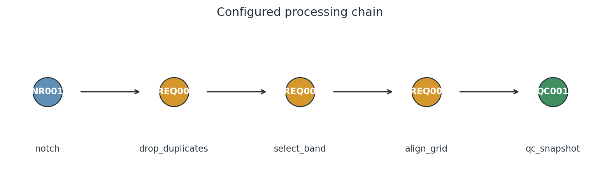
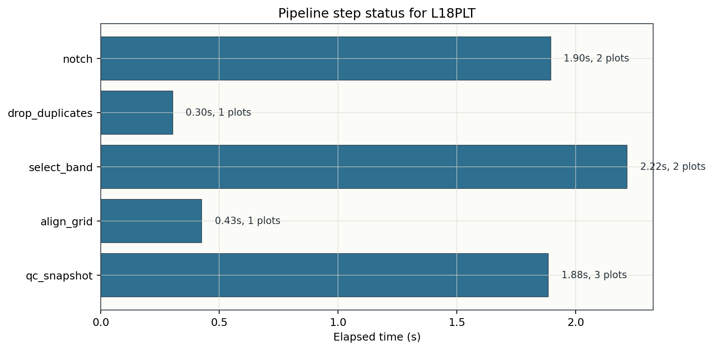
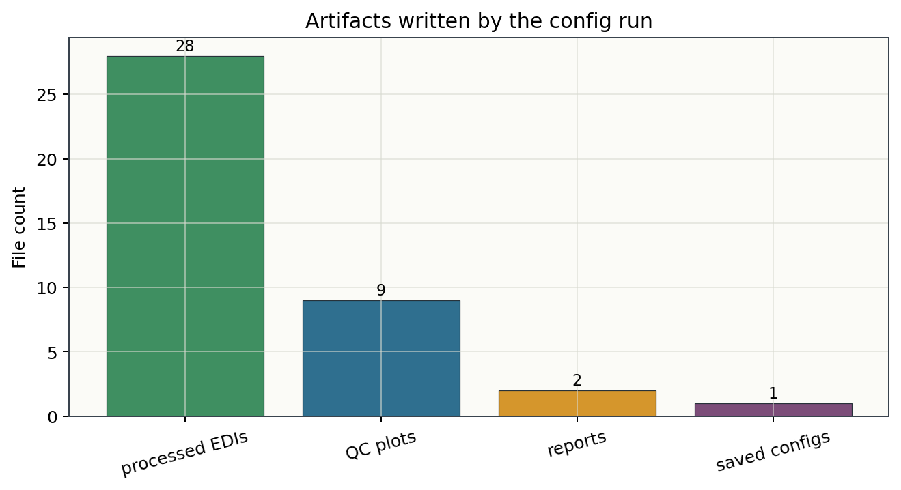

.. _tutorial_run_pipeline_from_config:

Run a Pipeline From Config
==========================

This tutorial shows how to run a reproducible pyCSAMT processing pipeline from
a configuration file. The workflow is designed for survey processing that must
be repeated, reviewed, shared, or used as evidence before inversion.

The central idea is:

*put the processing chain in a small config file, run that config from Python
or the CLI, and let pyCSAMT write the processed EDIs, plots, reports, and a
copy of the pipeline that was actually executed.*

What You Will Learn
-------------------

After this tutorial you should be able to:

- create a YAML pipeline configuration file
- understand the ``name``, ``output_dir``, ``preset``, and ``steps`` keys
- load a pipeline with :meth:`pycsamt.pipeline.Pipeline.from_yaml`
- inspect the resolved processing chain before running it
- run the pipeline on an EDI survey
- control processed EDI, plot, and report outputs
- debug a pipeline with ``--dry-run``, ``--n-steps``, ``--from-step``, and
  ``--until-step``
- read the returned ``PipelineResult``
- use the equivalent ``pycsamt pipe`` CLI commands

Why Use a Config File?
----------------------

Interactive notebooks are useful for exploration, but production survey
processing needs a stronger record. A config file makes the processing chain
explicit:

- the ordered step list is visible;
- every parameter override is written down;
- the same file can be used from Python and the CLI;
- a colleague can review the workflow before it is run;
- output reports can point back to the exact pipeline file;
- the same workflow can be applied to several lines or surveys.

For quick experiments, a preset such as ``Pipeline.from_preset("basic_qc")`` is
fine. For project work, write the workflow to YAML.

Input Assumptions
-----------------

The examples below assume:

- EDI files are stored in ``data/AMT/WILLY_DATA/L18PLT``;
- the pipeline config will be stored at ``config/l18_first_qc.yaml``;
- output will be written to ``results/l18_first_qc``.

The bundled ``L18PLT`` line is a flat EDI folder:

.. code-block:: text

   data/
     AMT/
       WILLY_DATA/
         L18PLT/
           18-001A.edi
           18-002U.edi
           ...
           18-025A.edi

If your survey has several independent lines, start by running the workflow on
one line. After the parameters are stable, apply the same config to the other
lines.

Create a Minimal YAML Config
----------------------------

This is a complete first-pass QC pipeline:

.. code-block:: yaml
   :linenos:

   name: l18_first_qc
   output_dir: results/l18_first_qc

   steps:
     - name: notch
       code: NR001
       params:
         mains_hz: 50.0
         n_harm: 30
         tol_hz: 0.08

     - name: drop_duplicates
       code: FREQ002

     - name: select_band
       code: FREQ001
       params:
         band_hz: [1.0, 10000.0]

     - name: align_grid
       code: FREQ004

     - name: qc_snapshot
       code: QC001

Save it as ``config/l18_first_qc.yaml``.

The keys mean:

``name``
    Human-readable label used in summaries and reports.

``output_dir``
    Default output directory when ``Pipeline.run`` is called without an
    explicit ``outdir``.

``steps``
    Ordered processing operations. Each item is converted to a
    :class:`pycsamt.pipeline.Step`.

``name`` inside a step
    User label for that occurrence of the step. This label appears in output
    folders and can be used for partial runs.

``code``
    Registry code, such as ``NR001`` or ``FREQ001``. Registry names such as
    ``notch_powerline`` can also be used, but codes are easier to audit.

``params``
    Keyword arguments forwarded to the underlying processing function. Values
    here override the step defaults.

The configured chain is intentionally short: remove harmonic power-line noise,
normalise the frequency rows, keep the survey band used for this first QC pass,
align the station grids, and then write a diagnostic snapshot.

   Five explicit steps are easier to review than a long automatic workflow.

Load and Inspect the Pipeline
-----------------------------

Load the YAML file with :meth:`pycsamt.pipeline.Pipeline.from_yaml`:

.. code-block:: python
   :linenos:

   from pycsamt.pipeline import Pipeline

   pipe = Pipeline.from_yaml("config/l18_first_qc.yaml")
   print(pipe)

For a dataframe view of the resolved steps:

.. code-block:: python
   :linenos:

   table = pipe.describe()
   print(table[["label", "code", "category", "params"]])

Example output:

.. code-block:: text

                label     code       category                                            params
   #
   1            notch    NR001  noise_removal  {'mains_hz': 50.0, 'n_harm': 30, 'tol_hz': 0.08}
   2  drop_duplicates  FREQ002      frequency                                                {}
   3      select_band  FREQ001      frequency                       {'band_hz': [1.0, 10000.0]}
   4       align_grid  FREQ004      frequency                                                {}
   5      qc_snapshot    QC001             qc                                                {}

Before running a workflow for the first time, inspect the steps and check:

- the order matches the processing logic;
- labels are unique and readable;
- frequency limits match the survey type;
- power-line settings match the local electrical grid;
- diagnostic steps such as ``QC001`` appear where you want snapshots.

Read the Survey
---------------

Read the EDI survey through the public API:

.. code-block:: python
   :linenos:

   from pycsamt.api import read_edis

   survey = read_edis(
       "data/AMT/WILLY_DATA/L18PLT",
       recursive=False,
       strict=False,
       progress=False,
   )

   sites = survey.collection
   print(survey.summary())

The pipeline runs on a site collection. ``survey.collection`` is the lower-level
object used by the pipeline and by the editing/QC tools.

The bundled line loads as 28 stations:

.. code-block:: text

   APIFrame: edi_survey_summary
   kind: edi.summary
   shape: 28 rows x 6 columns
   columns: station, path, n_freq, tipper, spectra, ts
   numeric: 1 columns
   missing: 0.0%
   source: data/AMT/WILLY_DATA/L18PLT

Run the Pipeline
----------------

Run the loaded pipeline:

.. code-block:: python
   :linenos:

   result = pipe.run(sites)
   print(result.summary())

Because the config defines ``output_dir``, this writes to
``results/l18_first_qc``. To override the output directory from Python:

.. code-block:: python
   :linenos:

   result = pipe.run(
       sites,
       outdir="results/l18_first_qc_trial_02",
   )

To run fully in memory with no filesystem output:

.. code-block:: python
   :linenos:

   result = pipe.run(
       sites,
       outdir=None,
       save_plots=False,
       save_edis=False,
       save_report=False,
   )

Inspect the Result
------------------

``Pipeline.run`` returns a ``PipelineResult``:

.. code-block:: python
   :linenos:

   print(result.ok)
   print(result.n_errors)
   print(result.outdir)
   print(result.processed_paths[:3])
   print(result.plots[:3])

   processed_sites = result.sites_out

Each step also has a ``StepResult``:

.. code-block:: python
   :linenos:

   for step_result in result.step_results:
       print(step_result.summary_line())

   failed = [sr for sr in result.step_results if not sr.ok]
   for sr in failed:
       print(sr.step_name, sr.step_code, sr.error)

By default, the pipeline continues after step errors according to the pipeline
runtime configuration. For strict production runs, configure the error policy
or use the CLI ``--on-error raise`` option.

For the bundled ``L18PLT`` line, the full run completes with all five steps OK:

.. code-block:: text

   PipelineResult  'l18_first_qc'
     Sites   : 28 in -> 28 out
     Steps   : 5 (5 ok, 0 err)
     Time    : 6.72 s
     Plots   : 9
     Output  : results/l18_first_qc

   [ 1] notch                [NR001]  OK  1.97s  sites 28->28  plots=2
   [ 2] drop_duplicates      [FREQ002]  OK  0.25s  sites 28->28  plots=1
   [ 3] select_band          [FREQ001]  OK  2.16s  sites 28->28  plots=2
   [ 4] align_grid           [FREQ004]  OK  0.41s  sites 28->28  plots=1
   [ 5] qc_snapshot          [QC001]  OK  1.93s  sites 28->28  plots=3

Timings vary by machine, but the station count, step status, and artifact
counts are the values to check first.

Understand the Output Folder
----------------------------

A normal run writes a directory like this:

.. code-block:: text

   results/l18_first_qc/
     pipeline.yaml
     plots/
       01_notch/
         nr_qc_harmonic_waterfall.png
         nr_qc_snr_gain_profile.png
       02_drop_duplicates/
         plot_coverage_quality_heatmap.png
       03_select_band/
         plot_band_microstrips.png
         plot_coverage_quality_heatmap.png
       04_align_grid/
         plot_coverage_quality_heatmap.png
       05_qc_snapshot/
         plot_coverage_psection.png
         plot_qc_quicklook.png
         plot_station_confidence_dashboard.png
     processed/
       18-001A.edi
       18-002U.edi
       ...
     report.html
     summary.txt

The important files are:

``processed/``
    Final processed EDI files written after the last step.

``plots/``
    Per-step QC figures generated by the step registry.

``pipeline.yaml``
    Canonical copy of the pipeline that was run. Keep this with the output.

``summary.txt``
    Text run report for quick inspection.

``report.html``
    HTML run report for project records and review.

The output tree is intentionally stable so that scripts, reports, and later
inversion preparation can point to predictable paths.

The example run writes 28 processed EDI files, 9 QC figures, 2 reports, and
1 saved copy of the pipeline config:

Generate a Starter Config
-------------------------

The CLI can scaffold a valid config:

.. code-block:: bash
   :linenos:

   pycsamt pipe init \
       --preset basic_qc \
       --name l18_first_qc \
       --outdir results/l18_first_qc \
       --output config/l18_first_qc.yaml

Print a scaffold without writing it:

.. code-block:: bash
   :linenos:

   pycsamt pipe init --preset full_processing --print

Generate JSON or Python config files when needed:

.. code-block:: bash
   :linenos:

   pycsamt pipe init --format json --preset basic_qc -o config/l18_first_qc.json
   pycsamt pipe init --format py --preset basic_qc -o config/l18_first_qc.py

YAML is recommended for most survey projects. Python configs are useful for
trusted internal workflows that need constants or small local logic.

Seed a Config From a Preset
---------------------------

You can combine a preset with explicit steps. Preset steps run first, and the
steps listed in the file are appended afterward:

.. code-block:: yaml
   :linenos:

   name: publication_with_extra_qc
   output_dir: results/publication_with_extra_qc
   preset: publication_ready

   steps:
     - name: final_qc
       code: QC001

This is useful when a built-in preset is almost correct but you want one or two
additional operations. If you need to remove or reorder many preset steps, copy
the preset into an explicit ``steps`` list instead. Explicit files are easier
to review.

Discover Steps and Presets
--------------------------

From Python:

.. code-block:: python
   :linenos:

   from pycsamt.pipeline import Pipeline, list_steps, preset_catalogue

   print(preset_catalogue())

   for spec in list_steps("frequency"):
       print(spec.code, spec.name, spec.defaults)

   print(Pipeline.step_info("NR001"))

From the CLI:

.. code-block:: bash
   :linenos:

   pycsamt pipe presets
   pycsamt pipe steps
   pycsamt pipe steps --category frequency
   pycsamt pipe show --preset publication_ready

Use discovery before editing a config so you know the registered code, default
parameters, and category for each operation.

Run From the CLI
----------------

Run the same YAML file from the command line:

.. code-block:: bash
   :linenos:

   pycsamt pipe run \
       --config config/l18_first_qc.yaml \
       --survey data/AMT/WILLY_DATA/L18PLT \
       --out results/l18_first_qc

The positional source form is also accepted:

.. code-block:: bash
   :linenos:

   pycsamt pipe run data/AMT/WILLY_DATA/L18PLT --config config/l18_first_qc.yaml --out results/l18_first_qc

Use verbose mode to show progress:

.. code-block:: bash
   :linenos:

   pycsamt pipe run \
       --config config/l18_first_qc.yaml \
       --survey data/AMT/WILLY_DATA/L18PLT \
       --out results/l18_first_qc \
       -v

Useful output controls:

.. code-block:: bash
   :linenos:

   pycsamt pipe run --config config/l18_first_qc.yaml --survey data/AMT/WILLY_DATA/L18PLT --no-plots
   pycsamt pipe run --config config/l18_first_qc.yaml --survey data/AMT/WILLY_DATA/L18PLT --no-edi
   pycsamt pipe run --config config/l18_first_qc.yaml --survey data/AMT/WILLY_DATA/L18PLT --no-report
   pycsamt pipe run --config config/l18_first_qc.yaml --survey data/AMT/WILLY_DATA/L18PLT --plot-fmt pdf --dpi 300

Use machine-readable output for automation:

.. code-block:: bash
   :linenos:

   pycsamt pipe run \
       --config config/l18_first_qc.yaml \
       --survey data/AMT/WILLY_DATA/L18PLT \
       --format json

Debug Before Running
--------------------

Always dry-run a new config:

.. code-block:: bash
   :linenos:

   pycsamt pipe run \
       --config config/l18_first_qc.yaml \
       --survey data/AMT/WILLY_DATA/L18PLT \
       --dry-run

Preview the pipeline table:

.. code-block:: bash
   :linenos:

   pycsamt pipe show config/l18_first_qc.yaml
   pycsamt pipe show config/l18_first_qc.yaml --format json

Run only the first steps:

.. code-block:: bash
   :linenos:

   pycsamt pipe run \
       --config config/l18_first_qc.yaml \
       --survey data/AMT/WILLY_DATA/L18PLT \
       --n-steps 2 \
       --out results/debug_first_two

Start or stop at a named step:

.. code-block:: bash
   :linenos:

   pycsamt pipe run \
       --config config/l18_first_qc.yaml \
       --survey data/AMT/WILLY_DATA/L18PLT \
       --from-step select_band \
       --out results/debug_from_band

   pycsamt pipe run \
       --config config/l18_first_qc.yaml \
       --survey data/AMT/WILLY_DATA/L18PLT \
       --until-step align_grid \
       --out results/debug_until_align

The slicing options accept the user step label, the registry code, or the
registry name. For example, ``select_band``, ``FREQ001``, and the internal
step name can all identify the same operation when present in the pipeline.

Error Policy
------------

During exploratory work, it is often useful to continue after a step fails so
you can see how much of the pipeline still works. During production work, fail
fast.

CLI options:

.. code-block:: bash
   :linenos:

   pycsamt pipe run --config config/l18_first_qc.yaml --survey data/AMT/WILLY_DATA/L18PLT --on-error warn
   pycsamt pipe run --config config/l18_first_qc.yaml --survey data/AMT/WILLY_DATA/L18PLT --on-error skip
   pycsamt pipe run --config config/l18_first_qc.yaml --survey data/AMT/WILLY_DATA/L18PLT --on-error raise

Python configuration:

.. code-block:: python
   :linenos:

   from pycsamt.pipeline import configure_pipe

   configure_pipe(on_step_error="raise")
   result = pipe.run(sites, outdir="results/strict_run")

Use ``raise`` for final processing before inversion or publication output.

Adapting the Example to AMT and CSAMT
------------------------------------

The most common parameter to adjust is the frequency band. For AMT surveys, a
typical first-pass band may be:

.. code-block:: yaml
   :linenos:

   - name: select_amt_band
     code: FREQ001
     params:
       band_hz: [10.0, 100000.0]

For broadband MT, a wider low-frequency range may be appropriate:

.. code-block:: yaml
   :linenos:

   - name: select_mt_band
     code: FREQ001
     params:
       band_hz: [0.001, 10000.0]

For controlled-source surveys, keep only the frequency range supported by the
transmitter, receiver, and processing export. Avoid carrying empty or unstable
frequency rows into inversion preparation just because they exist in the file.

Common Workflow Pattern
-----------------------

A robust project workflow usually looks like this:

1. Read the survey and build a station inventory.
2. Run a small config with ``notch``, ``drop_duplicates``, ``select_band``, and
   ``qc_snapshot``.
3. Inspect the generated plots and ``summary.txt``.
4. Tighten the frequency band or noise parameters.
5. Add static-shift, tensor, skew, or dimensionality steps only after the first
   QC pass is understood.
6. Save the final config next to the processed output.
7. Use the processed EDI folder for inversion preparation.

This keeps the processing chain explainable. A short, reviewed config is often
better than a long automatic workflow that nobody can defend.

Troubleshooting
---------------

The config loads but has no steps
    Check that the top-level ``steps`` key is a list. If you used only
    ``preset``, verify the preset name with ``pycsamt pipe presets``.

The CLI says the pipeline cannot be loaded
    Confirm the file suffix is ``.yaml``, ``.yml``, ``.json``, or ``.py``.
    YAML loading also requires ``PyYAML``.

The run reports zero sites
    Check the ``--survey`` path or positional EDI path. If EDIs are inside
    nested line folders, verify that the survey resolver can find them, or load
    one line directory explicitly first.

The output directory is not the one expected
    ``--out`` and ``Pipeline.run(outdir=...)`` override ``output_dir`` in the
    config. When no explicit output is given, the config value is used, then the
    global pipeline default.

Processed EDI files are missing
    Check whether ``--no-edi`` or ``save_edis=False`` was used. Also review
    warnings from ``pycsamt.site.export.write_sites`` if the site objects cannot
    be exported.

Plots are missing
    Some steps do not define QC plot functions, and plot generation can be
    disabled with ``--no-plots`` or ``save_plots=False``. Plot failures should
    not stop a successful processing run.

A step fails but the pipeline continues
    This is controlled by the error policy. Use ``--on-error raise`` or
    ``configure_pipe(on_step_error="raise")`` for strict runs.

Next Steps
----------

- Inspect and QC the input survey with :doc:`inspect_and_qc_survey`.
- Correct static shift with :doc:`correct_static_shift`.
- Prepare processed EDIs for Occam2D with :doc:`prepare_occam2d_inversion`.

See Also
--------

:doc:`../user_guide/pipeline/configuration_files`
    Full configuration-file schema.

:doc:`../user_guide/pipeline/steps`
    Registered pipeline steps and categories.

:doc:`../user_guide/pipeline/outputs`
    Output directory structure and reports.

:doc:`../cli/pipe`
    Pipeline CLI reference.

:doc:`../api/pipeline`
    Pipeline API reference.
