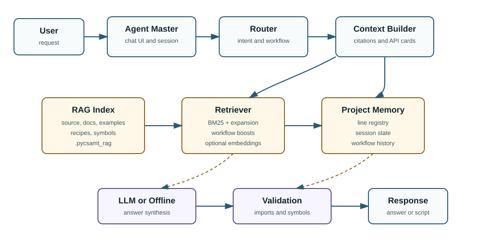

.. _agents-assistant-rag:

Assistant And RAG
=================

``pycsamt.assistant`` is the retrieval-augmented assistant layer used by
Agent Master.  It gives the conversational interface a technical memory of
the pyCSAMT codebase, documentation, recipes, project registry, and workflow
history, so that answers and generated scripts can be grounded in real
symbols instead of plausible-looking package names.

The Assistant layer is deliberately separate from :mod:`pycsamt.agents`.
The agent package performs geophysical workflow actions: loading surveys,
quality control, static-shift correction, phase analysis, inversion
preparation, reporting, and orchestration.  The Assistant package supports
those actions by retrieving relevant implementation context, assembling cited
context for an answering model, validating generated code, and evaluating
retrieval quality.

For reviewers and reproducibility, the most important design point is that
the default RAG path is local and deterministic.  A persisted BM25 index can
be built without an API key, without a vector database, and without contacting
an external LLM provider.  Dense embeddings are optional and are added only
when explicitly requested.

What The Assistant Solves
-------------------------

Agent Master must answer questions across several layers of pyCSAMT:

* public geophysical APIs, such as ``pycsamt.emtools`` and
  ``pycsamt.models``;
* workflow agents in :mod:`pycsamt.agents`;
* user documentation and examples;
* assistant recipes for common workflows;
* project-specific survey-line metadata;
* recent session and workflow state.

Without retrieval, a chat model can easily hallucinate imports, arguments, or
workflow names.  The Assistant reduces that risk by making the answerer look
up the relevant package evidence first.  The same retrieved chunks are also
used by offline answers, code-generation helpers, and evaluation suites.

High-Level Architecture
-----------------------

The Assistant flow is:

   Agent Master uses the Assistant package as a grounding layer: requests are
   routed, matched against the RAG index and project memory, assembled into a
   cited context, synthesized by an LLM or offline answer path, and checked by
   deterministic validation before the response is shown.

In text form, the same flow is:

.. code-block:: text

   user request
     -> intent / workflow routing
     -> RAG retrieval over source, docs, examples, and recipes
     -> project registry and memory lookup
     -> cited context assembly
     -> answer, generated code, or workflow plan
     -> optional deterministic validation
     -> user-facing Agent Master response

The core packages are:

.. list-table::
   :header-rows: 1
   :widths: 28 72

   * - Package
     - Responsibility
   * - ``pycsamt.assistant.rag``
     - Index construction, persistence, retrieval, query expansion, optional
       dense embeddings, reranking, feedback, and context assembly.
   * - ``pycsamt.assistant.tools``
     - Executable helper functions used by the assistant, including workflow
       helpers, project lookup, plotting helpers, and generated-code
       validation.
   * - ``pycsamt.assistant.memory``
     - Project state, session state, and workflow-history records.
   * - ``pycsamt.assistant.evals``
     - JSONL evaluation suites and a scoring harness for retrieval,
       workflow recognition, line resolution, and hallucination guards.

Agent Master is the user-facing chat application.  See
:doc:`/applications/agent_master/index` for the application guide and
:doc:`orchestrator` for the workflow dispatcher used by
:class:`pycsamt.agents.WorkflowOrchestratorAgent`.

Corpus Policy
-------------

The RAG corpus is built from a selected subset of the repository.  The policy
lives in ``pycsamt.assistant.rag.config`` so reviewers can inspect exactly
what is indexed and what is excluded.

Indexed roots include:

.. list-table::
   :header-rows: 1
   :widths: 30 70

   * - Source
     - Why it is indexed
   * - ``pycsamt/``
     - Package implementation, public APIs, workflow agents, models, EM
       tools, inversion helpers, and domain logic.
   * - ``docs/source/``
     - User guide, application guide, tutorials, CLI guide, API guide, and
       theory documentation.
   * - ``examples/``
     - Runnable usage examples and workflow demonstrations.
   * - ``assistant_recipes/``
     - Assistant-facing recipes for common user requests.
   * - ``README.md`` and ``AGENTS.md``
     - Root-level project orientation and assistant guidance when present.

The indexer accepts Python, reStructuredText, and Markdown files.  It excludes
files that are likely to pollute retrieval or dominate scoring with irrelevant
content, including bytecode caches, build outputs, generated distributions,
large data/result folders, static web assets, most UI glue, unit tests, and
the RAG implementation internals themselves.  Tests are intentionally excluded
because they often contain artificial calls, negative examples, fixtures, and
mock objects that are useful for development but poor reference material for
end-user answers.

This policy gives reviewers a concrete answer to the question "what evidence
can the assistant use?"  It is not the whole repository; it is a curated
technical corpus focused on APIs, documentation, and workflow guidance.

Chunk Types And Metadata
------------------------

Each retrievable unit is represented by
:class:`pycsamt.assistant.rag.schemas.RAGChunk`.  A chunk carries both text
and metadata so retrieval results can be ranked, filtered, cited, and used for
code generation.

Important fields include:

.. list-table::
   :header-rows: 1
   :widths: 24 76

   * - Field
     - Meaning
   * - ``id``
     - Stable chunk identifier, usually derived from source path and line
       range.
   * - ``text``
     - Searchable text, such as a docstring plus symbol header, or a
       documentation section.
   * - ``source_path``
     - Repository-relative source file path.
   * - ``kind``
     - Chunk category, such as ``python_symbol``, ``python_method``,
       ``module_doc``, ``doc_section``, or ``recipe``.
   * - ``symbol``
     - Fully qualified Python symbol when the chunk represents code.
   * - ``workflow``
     - Optional workflow tag, such as ``static_shift``, ``qc``,
       ``phase_analysis``, ``ai_inversion``, ``pre_inversion``, or
       ``forward``.
   * - ``priority``
     - Static importance score used as a ranking boost.
   * - ``metadata``
     - Extra structured information such as signatures, parameters, returns,
       headings, or line spans.

Python files are indexed with an AST-based indexer so functions, classes,
methods, signatures, and docstrings can be retrieved as code-aware chunks.
Documentation and recipes are split into section-level chunks so answers can
cite a focused documentation passage rather than an entire page.

Index Building And Persistence
------------------------------

Build the local index with:

.. code-block:: bash
   :linenos:

   python -m pycsamt.assistant.rag build

By default, this creates:

.. code-block:: text

   .pycsamt_rag/
     manifest.json
     chunks.jsonl

``chunks.jsonl`` stores one serialized ``RAGChunk`` per line.  The manifest
stores the index version, creation time, corpus counts, per-kind and
per-workflow statistics, output directory, and a source fingerprint.

The fingerprint is content-based: it hashes the indexed files and their
repository-relative paths.  This avoids false stale-index warnings when tools
touch file modification times without changing content.  If indexed source,
documentation, examples, or recipes change, the fingerprint changes and the
index can be rebuilt.

Useful inspection commands:

.. code-block:: bash
   :linenos:

   python -m pycsamt.assistant.rag stats
   python -m pycsamt.assistant.rag query "static shift"
   python -m pycsamt.assistant.rag query "how far down can I trust my model"

The ``stats`` command reports corpus counts.  The ``query`` command prints
the top retrieved chunks, including chunk kind, workflow tag, label, and
source path.  These commands are useful for paper reviewers because they
expose the retrieval layer directly, before any LLM-generated answer.

Current Corpus Statistics
-------------------------

The following statistics were generated from a clean local rebuild with:

.. code-block:: bash
   :linenos:

   python -m pycsamt.assistant.rag build

Build metadata:

.. list-table::
   :header-rows: 1
   :widths: 36 64

   * - Field
     - Value
   * - Index version
     - ``2``
   * - Created
     - ``2026-07-17T19:24:15``
   * - Persisted path
     - ``.pycsamt_rag/``
   * - Source fingerprint
     - ``1ef2a5e4334e1e82ecd7348a55fbe87c82ab2bfa8277308e3ca69767e436c99f``
   * - Embeddings
     - ``false``; BM25 plus deterministic expansion only
   * - Total chunks
     - ``10145``

Chunk counts by kind:

.. list-table::
   :header-rows: 1
   :widths: 40 20 40

   * - Kind
     - Count
     - Interpretation
   * - ``doc_section``
     - ``4367``
     - User guide, application guide, tutorial, theory, CLI, and API prose
       sections.
   * - ``python_method``
     - ``2674``
     - Class methods extracted from Python source.
   * - ``python_symbol``
     - ``2402``
     - Top-level functions, classes, and other Python symbols.
   * - ``module_doc``
     - ``667``
     - Module-level docstrings and module descriptions.
   * - ``recipe``
     - ``35``
     - Assistant recipes for recurring workflow requests.

Chunk counts by workflow tag:

.. list-table::
   :header-rows: 1
   :widths: 34 18 48

   * - Workflow
     - Count
     - Typical evidence
   * - ``phase_analysis``
     - ``468``
     - Phase tensor, strike, skew, anisotropy, dimensionality, and related
       diagnostics.
   * - ``pre_inversion``
     - ``418``
     - Occam2D preparation, mesh/startup files, and inversion setup.
   * - ``static_shift``
     - ``286``
     - AMA correction, galvanic shift detection, correction plots, and
       static-shift agents.
   * - ``tipper``
     - ``285``
     - Tipper and induction-arrow functionality.
   * - ``forward``
     - ``249``
     - Forward modelling helpers and examples.
   * - ``ai_inversion``
     - ``241``
     - Neural inversion, model-zoo, PINN, and AI-assisted inversion paths.
   * - ``modem``
     - ``221``
     - ModEM input/output and backend support.
   * - ``qc``
     - ``200``
     - Data quality control, flags, SNR, and frequency checks.
   * - ``mare2dem``
     - ``188``
     - MARE2DEM preparation and export workflows.
   * - ``sensitivity``
     - ``80``
     - Depth of investigation, Bostick-style sensitivity, and reliability
       checks.
   * - ``denoise``
     - ``65``
     - Noise removal and outlier handling.
   * - ``rotation``
     - ``61``
     - Tensor rotation and orientation workflows.
   * - ``inv3d``
     - ``52``
     - 3-D inversion agent and backend material.
   * - ``inv2d``
     - ``33``
     - 2-D AI/profile inversion material.
   * - ``report``
     - ``11``
     - Report generation and output synthesis.
   * - ``code_gen``
     - ``8``
     - Code-generation agent and script-writing workflows.

These numbers should be regenerated for each release artifact because the
corpus changes whenever source files, recipes, or documentation change.

Retrieval Model
---------------

The default retriever is a hybrid lexical retriever implemented in pure
Python.  It does not require FAISS, sentence-transformers, a hosted vector
store, or network access.

The ranking components are:

.. list-table::
   :header-rows: 1
   :widths: 32 68

   * - Component
     - Role
   * - Identifier-aware tokenization
     - Splits names such as ``StaticShiftAgent`` and ``estimate_ss_ama`` into
       searchable whole-token and sub-token terms.
   * - BM25 scoring
     - Ranks chunks using Okapi BM25 over tokenized chunk text.
   * - Deterministic query expansion
     - Maps domain phrasing to corpus vocabulary.  For example, "vertical
       offset" can add static-shift and galvanic-distortion terms.
   * - Workflow inference
     - Infers workflow tags from the query and applies a boost to matching
       chunks.
   * - Static priority
     - Boosts high-value implementation areas such as ``pycsamt.agents``,
       ``pycsamt.emtools``, ``pycsamt.models``, ``pycsamt.api``,
       ``pycsamt.forward``, ``pycsamt.inversion``, and recipes.
   * - Recipe boost
     - Gives workflow recipes additional weight when they match the query.
   * - Exact symbol boost
     - Promotes chunks whose symbol is explicitly named by the user.
   * - Optional feedback adjustment
     - Can demote or promote symbols from user feedback without deleting
       possible correct answers.

Query expansion is intentionally conservative.  It only fires on specific
phrases and its terms are scored at lower weight than the user's own words.
This lets natural geophysical language find code vocabulary while keeping
off-topic questions from drifting into unrelated areas.

Optional Dense Retrieval
------------------------

Dense retrieval is optional.  It is enabled only when the index is built with
embeddings and a compatible embedding backend is available.

Example:

.. code-block:: bash
   :linenos:

   python -m pycsamt.assistant.rag build --embed

When embeddings are active, the index stores ``embeddings.npz`` alongside the
manifest and chunk file.  The default embedding backend is OpenAI embeddings
when an API key is supplied.  The interface is backend-agnostic, so a local
embedding backend can be added without changing the retrieval callers.

The dense path is fused with the lexical ranking using Reciprocal Rank Fusion
rather than raw score fusion.  This matters because BM25 scores and cosine
similarities live on different numeric scales.  If vectors or an embedding
backend are absent, the retriever degrades to the deterministic BM25 path.

Context Assembly
----------------

Retrieval returns a :class:`pycsamt.assistant.rag.schemas.RetrievedContext`.
The context builder then prepares an
:class:`pycsamt.assistant.rag.context_builder.AssembledContext` for the
answering layer.

The assembled context contains:

* the user query;
* the ranked chunks used as evidence;
* citation metadata for source paths and labels;
* project context resolved from the project registry;
* related symbols;
* API cards extracted from code chunks;
* a confidence proxy based on top retrieval score or project-line matches.

API cards are important for generated code.  They expose the real signature,
parameters, defaults, and return information of retrieved functions or
classes.  This makes code generation less dependent on prose and reduces the
chance of invented argument names.

When no LLM key is configured, the context builder can compose a deterministic
offline answer from the top retrieved chunks.  With an LLM key, the model is
expected to synthesize a fluent response from the same cited context.

Generated-Code Validation
-------------------------

The Assistant includes deterministic checks for generated scripts.  The
validator parses generated Python code with ``ast`` and inspects imports from
``pycsamt``.  For each import it can verify, it checks whether the referenced
module, attribute, or submodule actually exists.

This catches common hallucinations such as:

.. code-block:: python

   from pycsamt import static_shift

when no such public symbol exists.  The validator reports syntax errors,
missing symbols, warnings for imports that cannot be verified because of
optional dependencies, and the list of checked symbols.

The validation layer does not prove that a script is scientifically correct.
It provides a narrower but valuable guarantee: generated code should not rely
on pyCSAMT APIs that are known to be absent.

Memory And Project Context
--------------------------

The Assistant has a small memory layer for project and session continuity.
This layer is separate from retrieval over static source files.

Current responsibilities include:

* project state, such as the active survey or output locations;
* session state, such as recent user choices;
* workflow history, such as previously run operations and their outputs;
* project registry lookup, such as resolving survey-line names to paths and
  defaults.

This distinction is important.  The RAG index answers "what does pyCSAMT
know how to do?"  Memory and project registry answer "what is the current
project context?"

Evaluation Suites
-----------------

The Assistant includes JSONL evaluation suites under
``pycsamt.assistant.evals.suites``.  Each record can define a query and
expected behavior, including:

* expected intent;
* expected workflow;
* expected survey line;
* expected retrieved symbols;
* strings that must not appear in generated or retrieved outputs.

Run the default retrieval evaluation with:

.. code-block:: bash
   :linenos:

   python -m pycsamt.assistant.rag eval

The evaluation harness reports metrics such as intent accuracy, workflow
accuracy, line accuracy, mean symbol recall, retrieval workflow coverage,
non-empty retrieval rate, hallucination-guard violations, and test-file
pollution.  Test-file pollution is tracked because unit tests are excluded
from the intended retrieval corpus; retrieving them would indicate a corpus
policy problem.

Bundled suites:

.. list-table::
   :header-rows: 1
   :widths: 28 14 58

   * - Suite
     - Records
     - Purpose
   * - ``adversarial.jsonl``
     - ``13``
     - Paraphrases, synonyms, and negations that avoid direct API vocabulary;
       exercises query expansion, workflow tagging, and test-pollution guards.
   * - ``rag_questions.jsonl``
     - ``10``
     - Broad package-QA and retrieval questions covering static shift,
       loading, phase analysis, inversion, and hallucination guards.
   * - ``package_qa.jsonl``
     - ``6``
     - General pyCSAMT package questions and expected retrieved symbols.
   * - ``static_shift.jsonl``
     - ``5``
     - Static-shift questions, workflow requests, code requests, and line
       resolution.
   * - ``inversion.jsonl``
     - ``5``
     - AI inversion, Occam2D preparation, U-Net 2-D inversion, GCN 3-D
       inversion, and ModEM routing.
   * - ``loading.jsonl``
     - ``4``
     - EDI loading, ``Sites`` construction, line lookup, and ``ensure_sites``
       retrieval.
   * - ``phase.jsonl``
     - ``4``
     - Phase tensor, dimensionality, skew, geoelectric strike, and related
       code-generation routing.

For paper reproduction, record the command, pyCSAMT version, git commit,
manifest statistics, and whether embeddings were enabled.

Representative Retrieval Examples
----------------------------------

The examples below were produced with the rebuilt offline index and default
BM25 retrieval.  They are intentionally shown before any LLM synthesis so
reviewers can inspect the evidence exposed to the assistant.

Static-shift query:

.. code-block:: bash
   :linenos:

   python -m pycsamt.assistant.rag query "static shift correction"

Representative top results:

.. list-table::
   :header-rows: 1
   :widths: 8 20 22 50

   * - Rank
     - Kind
     - Workflow
     - Label and source
   * - 1
     - ``recipe``
     - ``static_shift``
     - ``User intent phrases`` in ``assistant_recipes/static_shift.md``.
   * - 2
     - ``python_symbol``
     - ``static_shift``
     - ``pycsamt.cli.commands.avg.correct.correct`` in
       ``pycsamt/cli/commands/avg/correct.py``.
   * - 3
     - ``recipe``
     - ``static_shift``
     - ``Static-shift correction recipe`` in
       ``assistant_recipes/static_shift.md``.
   * - 5
     - ``python_symbol``
     - ``static_shift``
     - ``pycsamt.agents.static_shift.StaticShiftAgent`` in
       ``pycsamt/agents/static_shift.py``.

Phase-analysis query:

.. code-block:: bash
   :linenos:

   python -m pycsamt.assistant.rag query "phase tensor strike direction"

Representative top results:

.. list-table::
   :header-rows: 1
   :widths: 8 20 22 50

   * - Rank
     - Kind
     - Workflow
     - Label and source
   * - 1
     - ``doc_section``
     - ``phase_analysis``
     - ``Geoelectric Strike`` in
       ``docs/source/user_guide/emtools/strike.rst``.
   * - 5
     - ``doc_section``
     - ``phase_analysis``
     - ``Geoelectric strike director field`` in
       ``docs/source/examples/survey_diagnostics/plot_strike_director_field.rst``.
   * - 6
     - ``doc_section``
     - ``phase_analysis``
     - ``Combined Strike Analysis`` in
       ``docs/source/user_guide/emtools/strike.rst``.
   * - 8
     - ``module_doc``
     - ``phase_analysis``
     - ``docs.source.examples.emtools.plot_strike`` in
       ``docs/source/examples/emtools/plot_strike.py``.

Occam2D preparation query:

.. code-block:: bash
   :linenos:

   python -m pycsamt.assistant.rag query "prepare Occam2D input files"

Representative top results:

.. list-table::
   :header-rows: 1
   :widths: 8 20 22 50

   * - Rank
     - Kind
     - Workflow
     - Label and source
   * - 1
     - ``module_doc``
     - ``pre_inversion``
     - ``pycsamt.inversion.backends.occam2d`` in
       ``pycsamt/inversion/backends/occam2d.py``.
   * - 2
     - ``module_doc``
     - ``pre_inversion``
     - ``pycsamt.models.occam2d`` in
       ``pycsamt/models/occam2d/__init__.py``.
   * - 5
     - ``python_symbol``
     - ``pre_inversion``
     - ``pycsamt.agents.inversion_prep.InversionPrepAgent`` in
       ``pycsamt/agents/inversion_prep.py``.
   * - 6
     - ``doc_section``
     - ``pre_inversion``
     - ``Build Native Occam2D Files`` in
       ``docs/source/tutorials/prepare_occam2d_inversion.rst``.

BM25 And Dense Retrieval Comparison
-----------------------------------

The Assistant supports two retrieval modes:

.. list-table::
   :header-rows: 1
   :widths: 22 39 39

   * - Mode
     - Strengths
     - Tradeoffs
   * - Offline BM25
     - Deterministic, local, fast to inspect, reproducible without network
       access, and good for exact symbols, workflow vocabulary, CLI names,
       and documented terms.
     - Can miss paraphrases when the user's language and the code/docs share
       little vocabulary; conservative query expansion is used to reduce this
       gap.
   * - BM25 plus dense embeddings
     - Better semantic matching for paraphrases and broader conceptual
       questions when a suitable embedding model is available.
     - Requires an embedding backend and a vector cache; results may depend on
       the embedding model version and should therefore be recorded in paper
       reproduction notes.

Dense retrieval is opt-in:

.. code-block:: bash
   :linenos:

   python -m pycsamt.assistant.rag build --embed
   python -m pycsamt.assistant.rag query --dense "static shift correction"

In dense mode, lexical and vector rankings are combined by Reciprocal Rank
Fusion.  The paper should report both the embedding model and whether dense
retrieval was enabled, because the default release configuration is the
offline BM25 path.

Assistant Recipe Authoring And Review
-------------------------------------

Assistant recipes live under ``assistant_recipes/`` and are indexed as
``recipe`` chunks.  They are concise workflow guides for recurring requests:
how users phrase the task, which pyCSAMT agents or tools are relevant, what
inputs are required, what outputs to expect, and what safety checks should be
applied.

A recipe should:

* name the workflow it supports;
* list common user-intent phrases;
* point to real public symbols or documented commands;
* describe required inputs and expected outputs;
* include validation or review checks when generated code or file-writing
  operations are involved;
* avoid inventing convenience APIs that are not implemented in pyCSAMT.

Review should check that every mentioned symbol imports, every CLI command is
implemented, examples match the current package behavior, and the recipe does
not bypass scientific caveats documented elsewhere.  After recipe changes,
rebuild the RAG index and run the relevant evaluation suite.

Reproducible Reviewer Workflow
------------------------------

The following sequence gives reviewers a direct way to inspect the Assistant
without running Agent Master:

.. code-block:: bash
   :linenos:

   python -m pycsamt.assistant.rag build
   python -m pycsamt.assistant.rag stats
   python -m pycsamt.assistant.rag query "static shift correction"
   python -m pycsamt.assistant.rag query "phase tensor strike direction"
   python -m pycsamt.assistant.rag query "prepare Occam2D input files"
   python -m pycsamt.assistant.rag eval

For each query, reviewers should inspect:

* whether the top results come from relevant source files or documentation;
* whether workflow tags match the task;
* whether retrieved code symbols are real package symbols;
* whether documentation chunks are specific enough to support a cited answer;
* whether evaluation reports hallucination or test-pollution violations.

Paper Supplement Checklist
--------------------------

For paper or supplementary-material reproduction, record:

* pyCSAMT version and git commit;
* Python version and operating system;
* exact RAG build command;
* index manifest, including ``version``, ``created``, ``n_chunks``,
  ``source_fingerprint``, and ``embedded``;
* chunk counts by kind and workflow;
* whether dense retrieval was enabled;
* embedding provider and model when dense retrieval was enabled;
* evaluation command and suite path;
* evaluation metrics and any hallucination/test-pollution violations;
* representative query outputs used in the manuscript;
* any local project registry used to resolve survey-line names;
* any API keys or external services used, described by provider and model
  name only, not by secret value.

Limitations
-----------

The Assistant is a grounding and validation layer, not a scientific authority
by itself.

Known limitations:

* retrieval quality depends on the indexed documentation, docstrings, and
  recipes;
* BM25 can miss paraphrases unless query expansion or embeddings bridge the
  vocabulary gap;
* optional dense embeddings may improve semantic matching but introduce an
  external model dependency;
* generated-code validation checks symbol existence, not scientific validity;
* memory improves continuity but must not replace explicit user confirmation
  for destructive or expensive workflows;
* stale indexes should be rebuilt after source, documentation, example, or
  recipe changes.
