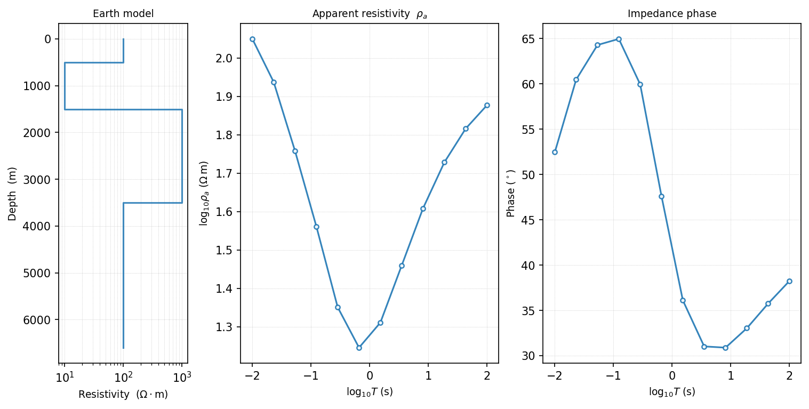
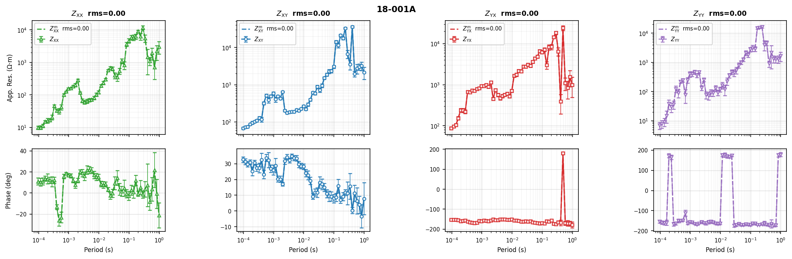
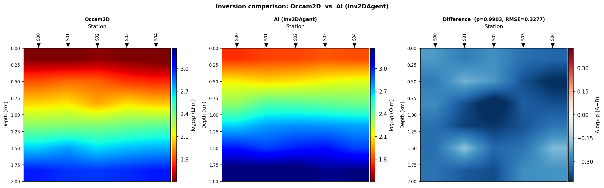

Forward And Inversion Workflow Agents
=====================================

These agents prepare, run, evaluate, or compare physics-based modelling and
inversion workflows.  They split cleanly into three roles: ``ForwardModelAgent``
applies the :term:`forward operator` in the direction model → data;
``InversionPrepAgent``, ``Occam2DAgent``, ``ModEmAgent``, and
``Mare2DEMAgent`` write native input files for the inverse direction without
necessarily running a solver; and ``InversionBackendAgent``,
``InversionEvaluationAgent``, and ``InversionComparisonAgent`` run, evaluate,
or compare the recovered model.  Every runnable example below uses the same
28-station WILLY ``L18PLT`` profile as the rest of this guide
(``data/AMT/WILLY_DATA/L18PLT``), loaded once with
:ref:`MTLoaderAgent <agent-mt-loader>`.

.. _agent-forward-model:

ForwardModelAgent
-----------------

``ForwardModelAgent`` applies the :term:`forward operator` from
:mod:`pycsamt.forward` -- 1-D, 2-D (finite-difference TE+TM), or quasi-3-D,
selected by ``dim`` -- to a resistivity model.  Use it for synthetic checks,
sensitivity experiments, or validating how a proposed model should appear in
impedance or apparent-resistivity space before it is ever compared against
field data.  The input dictionary takes ``freqs`` (Hz), not ``periods`` --
passing ``periods`` is silently ignored and the agent falls back to its
default 40-point log-spaced band, so double-check the key name if a run
uses fewer frequencies than requested.

.. code-block:: pycon

   >>> import numpy as np
   >>> from pycsamt.agents import ForwardModelAgent

   >>> result = ForwardModelAgent(dim=1).execute({
   ...     "model": {
   ...         "resistivities": [100.0, 10.0, 1000.0, 100.0],
   ...         "thicknesses": [500.0, 1000.0, 2000.0],
   ...     },
   ...     "freqs": list(np.logspace(-2, 2, 12)),
   ...     "output_dir": "outputs/forward",
   ... })
   >>> print(result.summary)
   1-D forward: 4 layers. no observed data. 1 figure(s).
   >>> result["rho_a"][:3]
   array([75.39399946, 65.4962356 , 53.51079821])

   The three panels ``plot_response_and_model_1d`` combines: the layered
   earth model, its synthetic :math:`\rho_a`, and its synthetic phase --
   the same round trip used as a sanity check throughout
   :doc:`../inversion/overview`.

Pass observed ``sites`` alongside a 1-D ``model`` and the agent also scores
the mismatch, using a simpler statistic than the glossary's general
:term:`RMS misfit`: an unweighted log-apparent-resistivity RMS,

.. math::

   \mathrm{RMS}_{\log\rho_a} = \sqrt{\frac{1}{N}\sum_{i=1}^{N}
   \bigl(\log_{10}\rho_{a,i}^{\mathrm{obs}} -
         \log_{10}\rho_{a,i}^{\mathrm{fwd}}\bigr)^2},

interpolated onto the observed period grid and computed with no per-datum
error weighting -- useful as a coarse "does this model look plausible at
all" check, but not interchangeable with the normalised, uncertainty-aware
:term:`RMS misfit` an actual inversion reports.  Comparing the arbitrary
four-layer model above against the real WILLY profile (unrelated survey, so
a large value is expected) gives exactly that kind of number:

.. code-block:: pycon

   >>> from pycsamt.agents import MTLoaderAgent

   >>> loaded = MTLoaderAgent().execute({"path": "data/AMT/WILLY_DATA/L18PLT"})
   >>> checked = ForwardModelAgent(dim=1).execute({
   ...     "model": {
   ...         "resistivities": [100.0, 10.0, 1000.0, 100.0],
   ...         "thicknesses": [500.0, 1000.0, 2000.0],
   ...     },
   ...     "freqs": list(np.logspace(-2, 2, 12)),
   ...     "sites": loaded["sites"],
   ... })
   >>> print(checked.summary)
   1-D forward: 4 layers. RMS 1.151. 1 figure(s).

An RMS of 1.15 here says only that this arbitrary model is roughly the right
order of magnitude for the WILLY profile, not that it is a fitted result --
treat it exactly as :doc:`../inversion/overview` treats a noiseless
round-trip check: confirmation the forward path runs correctly, not evidence
about the earth.

.. _agent-inversion-prep:

InversionPrepAgent
------------------

``InversionPrepAgent`` is meant as the general, backend-agnostic
pre-inversion interface -- its own module docstring calls it a "Phase 2
stub."  It always validates the ``Sites`` object and counts stations and
periods; whether it actually writes a file depends entirely on ``code``.
Run against the real WILLY profile to see the current state honestly:

.. code-block:: pycon

   >>> from pycsamt.agents import MTLoaderAgent, InversionPrepAgent

   >>> loaded = MTLoaderAgent().execute({"path": "data/AMT/WILLY_DATA/L18PLT"})
   >>> prep = InversionPrepAgent().execute({
   ...     "sites": loaded["sites"],
   ...     "output_dir": "outputs/inversion_prep",
   ...     "period_range": [0.001, 1.0],
   ... })
   >>> print(prep.status)
   needs_review
   >>> print(prep.summary)
   Inversion prep (occam2d): 28 stations, ~39 periods. No data file written.
   >>> print(prep.warnings)
   ['pycsamt.models.occam2d not available. Data file was not written.']

``code="occam2d"`` (the default) currently cannot write a file at all: the
writer function it calls, ``write_occam2d_data``, does not exist in the
installed :mod:`pycsamt.models.occam2d`, so every call falls through to the
``ImportError`` branch above regardless of input.  ``code="modem"`` is
explicitly stubbed the same way, with its own warning that the ModEM writer
is planned for a future phase.  ``n_stations`` and ``n_periods`` in the
result are still real and useful for a quick survey-scope check, but for
actually writing inversion-ready files today, use
:ref:`Occam2DAgent <agent-occam2d>`, :ref:`ModEmAgent <agent-modem>`, or
:ref:`Mare2DEMAgent <agent-mare2dem>` directly -- each verified working
below.

.. _agent-occam2d:

Occam2DAgent
------------

``Occam2DAgent`` is the specialized :term:`Occam2D` preparation agent.  It
writes the data, mesh, model, and startup files described in
:doc:`../models/occam2d` -- the same four-file set, regardless of whether
the request goes through this agent or the lower-level writers directly.

Use it after QC, correction, optional rotation, and frequency selection:

.. code-block:: pycon

   >>> from pycsamt.agents import MTLoaderAgent, Occam2DAgent

   >>> loaded = MTLoaderAgent().execute({"path": "data/AMT/WILLY_DATA/L18PLT"})
   >>> occam = Occam2DAgent().execute({
   ...     "sites": loaded["sites"],
   ...     "output_dir": "outputs/willy_occam2d",
   ...     "run_external": False,
   ... })
   >>> print(occam.summary)
   Occam2D prep: 28 stations × 53 periods. 4/4 files written to outputs/willy_occam2d.
   >>> sorted(occam.data)
   ['data_path', 'mesh_path', 'model_path', 'n_data', 'n_periods', 'n_stations', 'output_dir', 'startup_path']

``run_external=False`` stops after writing the four files, so no Occam2D
binary is required to reach this ``success`` status; set it to ``True`` only
once that binary is installed and the run should actually execute.  This is
the same agent, run the same way, already documented in
:doc:`agent_catalogue`; it is repeated here because forward and inversion
preparation belong to one physics-based chain, and every reader of that
chain should see the exact same numbers in both places.

.. _agent-modem:

ModEmAgent
----------

``ModEmAgent`` prepares :term:`ModEM` 3-D impedance data files.  Use it when
the survey and interpretation target require 3-D inversion products rather
than a 2-D profile.  Unlike ``InversionPrepAgent``'s ``code="modem"`` path
above, this specialized agent is fully implemented:

.. code-block:: pycon

   >>> from pycsamt.agents import MTLoaderAgent, ModEmAgent

   >>> loaded = MTLoaderAgent().execute({"path": "data/AMT/WILLY_DATA/L18PLT"})
   >>> modem = ModEmAgent().execute({
   ...     "sites": loaded["sites"],
   ...     "output_dir": "outputs/willy_modem",
   ... })
   >>> print(modem.summary)
   ModEM3D prep: 28 stations × 53 periods. 4 file(s) written to outputs/willy_modem.
   >>> modem["data_path"].name
   'ModEM_Data.dat'
   >>> modem["model_path"].name, modem["cov_path"].name, modem["ctrl_path"].name
   ('m0.ws', 'ModEM.cov', 'ModEM.inv')

The four files -- data, starting model, covariance, and control -- are
exactly the ones :doc:`../models/modem` documents; ``model_path``,
``cov_path``, and ``ctrl_path`` come from a separate ``InputBuilder`` step
run automatically after the data file, and only ever come back ``None`` if
that step warns rather than errors (check ``modem.warnings`` in that case,
since ``status`` still reads ``"success"`` off the data file alone).

.. _agent-mare2dem:

Mare2DEMAgent
-------------

``Mare2DEMAgent`` orchestrates MARE2DEM 2.5-D EM inversion preparation and,
when a compiled binary is available, execution.  It is the specialized agent
to use when the target workflow needs MARE2DEM ``.emdata``, ``.resistivity``,
``.settings``, and run-directory products rather than Occam2D or ModEM files.

The agent can work in three modes:

``"prepare"``
    Write input files only.  This is the safest default and is appropriate
    when the run will be launched manually on a workstation or cluster.

``"run"``
    Write inputs and launch the configured MARE2DEM binary.  Use this only
    after confirming the binary, MPI configuration, and source tree.

``"report"``
    Inspect an existing run directory and summarize result state without
    writing new inputs or launching the binary.

Typical input keys include ``emdata`` for an existing data file, ``mt`` or
``csem`` dictionaries for building survey data, optional ``topo``, optional
``resistivity``, ``output_dir``, ``source_dir``, ``n_procs``,
``max_iterations``, ``target_rms``, and ``initial_rho``.  Build from survey
parameters when there is no ``.emdata`` file yet, by passing the MARE2DEM
survey configuration through ``mt`` or ``csem``:

.. code-block:: pycon

   >>> import numpy as np
   >>> from pycsamt.agents import Mare2DEMAgent

   >>> agent = Mare2DEMAgent(n_procs=8)
   >>> prepared = agent.execute({
   ...     "mt": {
   ...         "frequencies": list(np.logspace(-3, 3, 20)),
   ...         "rx_y": list(np.linspace(-5000, 5000, 20)),
   ...         "rx_type": "land",
   ...         "lTE": True,
   ...         "lTM": True,
   ...     },
   ...     "topo": 0.0,
   ...     "output_dir": "outputs/mare2dem",
   ...     "mode": "prepare",
   ... })
   >>> print(prepared.summary)
   MARE2DEM prepare:. 20 MT receivers. 1600 data points. 3/3 files written. Output: outputs/mare2dem.
   >>> prepared["data_path"].name, prepared["settings_path"].name
   ('mare2dem.emdata', 'mare2dem.settings')
   >>> prepared["binary_found"]
   False
   >>> prepared.warnings
   ['MARE2DEM binary not found. Set download_source=True to auto-build, or run: SourceManager().download(); SourceManager().build()']

``binary_found`` is ``False`` and a warning explains why, but ``status`` is
still ``"success"`` -- ``mode="prepare"`` only needs to *write* the files,
which it did (``3/3``); reaching that same result with ``mode="run"``
instead would require the compiled MARE2DEM binary this environment does not
have.  Once a ``.emdata`` file exists, the second and later runs can reuse it
directly instead of rebuilding the survey configuration:

.. code-block:: pycon

   >>> reused = agent.execute({
   ...     "emdata": "outputs/mare2dem/mare2dem.emdata",
   ...     "output_dir": "outputs/mare2dem_rerun",
   ...     "initial_rho": 100.0,
   ...     "target_rms": 1.0,
   ... })
   >>> print(reused.summary)
   MARE2DEM prepare:. 20 MT receivers. 1600 data points. 3/3 files written. Output: outputs/mare2dem_rerun.

Use ``Mare2DEMAgent`` after QC, static-shift correction, tensor rotation, and
frequency selection.  Use ``InversionEvaluationAgent`` afterwards when a run
directory contains results that need RMS, convergence, or residual summaries.

.. _agent-inversion-backend:

InversionBackendAgent
---------------------

``InversionBackendAgent`` connects agent workflows to the backend-neutral
``pycsamt.inversion`` API documented in :doc:`../inversion/overview` --
``builtin``, ``simpeg``, ``pygimli``, ``occam2d``, or ``modem`` -- so a
workflow can select or execute a configured backend rather than only write
preparation files:

.. code-block:: python
   :linenos:

   backend = InversionBackendAgent().execute({
       "sites": processed_sites,
       "backend": "occam2d",
       "output_dir": "/out/backend_run",
   })

Passing a real, field-derived ``Sites`` object is the agent's documented
contract, but as of this writing that specific path does not complete for
ordinary field data with the ``builtin`` backend, on either ``dimension``:

.. code-block:: pycon

   >>> from pycsamt.agents import MTLoaderAgent, InversionBackendAgent

   >>> loaded = MTLoaderAgent().execute({"path": "data/AMT/WILLY_DATA/L18PLT"})
   >>> backend = InversionBackendAgent().execute({
   ...     "sites": loaded["sites"],
   ...     "backend": "builtin",
   ...     "dimension": "1d",
   ... })
   >>> print(backend.status)
   failed
   >>> print(backend.error)
   Inversion failed: frequencies must match data sample length.

The failure comes from the internal ``Sites`` → ``EMData`` adapter, not from
the solver itself: real field EDIs rarely share one common frequency grid
across every station, and that adapter currently expects one.  It is worth
knowing precisely because the symptom -- a shape-mismatch ``ValueError`` --
gives no hint that the fix lives upstream of anything this agent's own
parameters (``n_layers``, ``max_iter``, ``regularization``) can control.
Until that adapter is fixed, prefer one of two working paths: write native
input files with :ref:`Occam2DAgent <agent-occam2d>`,
:ref:`ModEmAgent <agent-modem>`, or
:ref:`Mare2DEMAgent <agent-mare2dem>` (all verified above) and run the
external solver directly; or call ``pycsamt.inversion`` yourself with an
explicit ``freqs``/``rho_a``/``phase`` dictionary the way
:doc:`../inversion/overview` does, bypassing the ``Sites`` adapter entirely.
``backend="occam2d"`` or ``"modem"`` inside this same agent additionally
require the corresponding external binary to be installed, independent of
this data-shape issue.

.. _agent-inversion-evaluation:

InversionEvaluationAgent
------------------------

``InversionEvaluationAgent`` compares two ``Sites``-shaped collections --
observed data against a model-predicted response -- to summarize per-station
RMS, a residual :term:`phase tensor` table, and a station-response figure.
Its input keys are ``sites_obs``/``path_obs`` and
``sites_mod``/``path_mod``, both accepting the same kinds of input as
:ref:`MTLoaderAgent <agent-mt-loader>`; it does not accept an inversion
*run directory* path directly, so a completed Occam2D or ModEM response
first needs loading into a ``Sites``-like object.  Its RMS statistic is the
same unweighted log-apparent-resistivity formula
:ref:`ForwardModelAgent <agent-forward-model>` uses above, applied
per-station instead of averaged over one model.

There is no fitted model response available in this environment to compare
against (see the ``InversionBackendAgent`` limitation just above), so the
run below compares the WILLY profile with itself -- a sanity check on the
mechanics, not a real evaluation, exactly as noted for
``ForwardModelAgent``'s self-comparison earlier:

.. code-block:: pycon

   >>> from pycsamt.agents import MTLoaderAgent, InversionEvaluationAgent

   >>> loaded = MTLoaderAgent().execute({"path": "data/AMT/WILLY_DATA/L18PLT"})
   >>> evaluation = InversionEvaluationAgent().execute({
   ...     "sites_obs": loaded["sites"],
   ...     "sites_mod": loaded["sites"],
   ...     "output_dir": "outputs/willy_eval",
   ... })
   >>> print(evaluation.summary)
   Inversion evaluation: global RMS = 0.000
   >>> list(evaluation["rms_per_station"].items())[:3]
   [('18-001A', 0.0), ('18-002U', 0.0), ('18-003A', 0.0)]

   ``plot_station_response`` plots one representative station -- here the
   first, ``18-001A`` -- across all four impedance components
   :math:`Z_{xx}, Z_{xy}, Z_{yx}, Z_{yy}`.  Observed and "model" curves
   overlap exactly because both inputs are the same ``Sites`` object; a real
   evaluation would show the two series diverging where the inversion fit
   is weakest.

In real use, build ``sites_mod`` from an actual inversion's predicted
response -- an Occam2D ``.resp`` file or a ModEM residual file loaded the
same way ``sites_obs`` was -- rather than reusing the observed data.

.. _agent-inversion-comparison:

InversionComparisonAgent
------------------------

``InversionComparisonAgent`` compares two resistivity sections directly, as
arrays -- not as file paths.  Its input keys are ``result_a`` and
``result_b``, each either an :class:`~pycsamt.agents.AgentResult` from an
inversion agent or a plain dict carrying a ``"pred_rho"`` array shaped
``(n_layers, n_stations)`` (or a ``"predictions"`` dict of
``{station: log10-resistivity array}``).  Use it for before/after studies,
backend comparisons, parameter sweeps, or checking whether correction
changed the interpreted structure -- for example AI-predicted versus
Occam2D, as its module docstring frames it.

Two synthetic sections stand in below for two real inversion results,
offset by a constant so the comparison has something to show:

.. code-block:: pycon

   >>> import numpy as np
   >>> from pycsamt.agents import InversionComparisonAgent

   >>> rng = np.random.default_rng(0)
   >>> n_layers, n_sta = 6, 5
   >>> base = np.linspace(1.5, 3.0, n_layers)[:, None] * np.ones((1, n_sta))
   >>> model_a = base + rng.normal(0, 0.05, size=(n_layers, n_sta))
   >>> model_b = base + 0.3 + rng.normal(0, 0.05, size=(n_layers, n_sta))

   >>> comparison = InversionComparisonAgent().execute({
   ...     "result_a": {
   ...         "pred_rho": model_a.tolist(),
   ...         "station_names": [f"S{i:02d}" for i in range(n_sta)],
   ...     },
   ...     "result_b": {"pred_rho": model_b.tolist()},
   ...     "label_a": "Occam2D",
   ...     "label_b": "AI (Inv2DAgent)",
   ...     "output_dir": "outputs/comparison",
   ... })
   >>> print(comparison["correlation"], comparison["rmse"])
   0.990313863436974 0.32773465450255923

The two statistics answer different questions.  Correlation --
:math:`\rho = \mathrm{corr}(\log_{10}\rho^{A}, \log_{10}\rho^{B})` over every
finite, co-located cell -- is high (0.99) because both sections share the
same layered *shape*; RMSE,

.. math::

   \mathrm{RMSE} = \sqrt{\frac{1}{N}\sum_{i=1}^{N}
   \bigl(\log_{10}\rho^{A}_i - \log_{10}\rho^{B}_i\bigr)^2},

is close to the 0.3 offset actually injected, because it is sensitive to a
systematic shift that a shape-only correlation would miss entirely -- two
sections can be nearly perfectly correlated and still disagree everywhere in
absolute resistivity.  Read both together, not either alone.

   Model A, Model B, and their difference :math:`A-B` in
   :math:`\log_{10}\rho`.  The difference panel is uniformly negative here
   because ``model_b`` was constructed as ``model_a`` plus a constant --
   exactly the systematic offset RMSE captured above and correlation alone
   would have hidden.

Typical Physics-Based Chain
---------------------------

Every agent on this page fits somewhere in one lifecycle, and this is that
lifecycle spelled out as a chain -- the same shape
:ref:`AgentCoordinator <agent-coordinator-class>` builds explicitly and
:ref:`WorkflowOrchestratorAgent <agent-workflow-orchestrator>` builds from a
natural-language request:

.. code-block:: text

   MTLoaderAgent -> DataQCAgent -> StaticShiftAgent
   -> PhaseAnalysisAgent -> FrequencyDecimationAgent
   -> Occam2DAgent or ModEmAgent or Mare2DEMAgent
   -> InversionEvaluationAgent

Use ``InversionComparisonAgent`` at the end, off to the side of this main
chain, when two or more of its outputs -- from different backends,
correction settings, or regularization choices -- need to be compared and
documented rather than only evaluated on their own.
