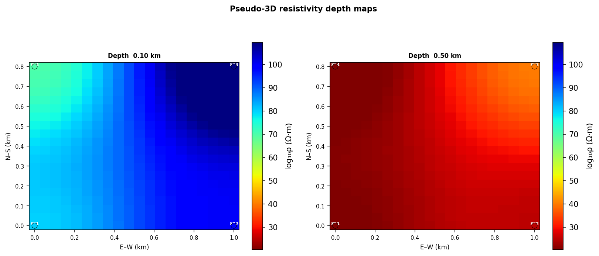

Orchestration, Pipeline, And Output Agents
==========================================

The agents in this group sit near the end of a pyCSAMT workflow.  Some of them
organize work across several processing agents; others convert completed
results into reports, maps, EDI files, or reproducible scripts.  They are often
used together: an orchestrator selects the workflow, a coordinator or pipeline
runs the processing, interpretation agents turn numerical products into
geophysical meaning, and output agents preserve the result in a form that can be
reviewed or re-run.

This family is important because reproducibility is not only a question of
using the same input files.  A complete run also needs a visible route, ordered
steps, parameters, generated figures, exported files, and enough provenance for
another user to understand how the product was obtained.  In compact notation,
if :math:`D` is the input survey, :math:`W` the selected workflow, and
:math:`\theta` the workflow parameters, the output layer should make the
mapping

.. math::

   (D, W, \theta) \longmapsto
   \{R_{\mathrm{steps}}, I, F, E, S\}

explicit, where :math:`R_{\mathrm{steps}}` are per-step
:term:`AgentResult`\ s, :math:`I` is the interpretation, :math:`F` are figures
and reports, :math:`E` are exported data products, and :math:`S` is a generated
script or structured execution trace.  The exact objects differ by agent, but
the design goal is the same: move from a transient workflow run to a product
that can be inspected, shared, and repeated.

.. list-table::
   :header-rows: 1
   :widths: 26 34 40

   * - Agent
     - Main role
     - Use it when
   * - ``WorkflowOrchestratorAgent``
     - Select and preview or execute a registered agent workflow.
     - The user gives a natural-language objective or an explicit workflow id.
   * - ``PipelineAgent``
     - Run :mod:`pycsamt.pipeline` presets or explicit pipeline step codes.
     - You want the deterministic pipeline API inside the agent result system.
   * - ``BatchSurveyAgent``
     - Apply one workflow to several profiles and summarize success/failure.
     - The same recipe must run across many lines or survey folders.
   * - ``InterpretationAgent``
     - Convert resistivity layers into lithological interpretation.
     - An inversion model needs geological meaning and a readable summary.
   * - ``ResistivityMapAgent``
     - Interpolate station predictions into horizontal depth-slice maps.
     - A 1-D or 3-D prediction should be reviewed spatially.
   * - ``SensitivityAgent``
     - Estimate depth of investigation and vertical resolution.
     - A model needs qualification by the depth range actually supported by
       the data.
   * - ``EDIExportAgent``
     - Write corrected or processed sites back to EDI files.
     - A downstream tool or collaborator needs standard EDI products.
   * - ``ReportAgent``
     - Assemble workflow results and figures into Markdown/HTML reports.
     - The run needs a human-readable survey deliverable.
   * - ``CodeGenerationAgent``
     - Generate a standalone Python script from the workflow configuration.
     - An interactive or LLM-assisted workflow must become repeatable code.

.. _agent-workflow-orchestrator:

WorkflowOrchestratorAgent
-------------------------

``WorkflowOrchestratorAgent`` is the high-level route selector.  It accepts a
natural-language request or ``config={"workflow": ...}``, selects a registered
workflow, builds an :term:`Agent coordinator`, and either previews the selected
chain or executes it.  It is the best entry point for interfaces where users
describe the work in survey language instead of naming every agent manually.

The orchestrator result has two layers.  The outer :term:`AgentResult` reports
the selected ``workflow_type``, reasoning, workflow plan, and step metadata.
The nested ``result`` is the coordinator result for the preview or execution.

.. code-block:: pycon

   >>> from contextlib import redirect_stdout
   >>> from io import StringIO
   >>> from pycsamt.agents import WorkflowOrchestratorAgent
   >>> from pycsamt.api.agents import AGENT_CONFIG
   >>> with AGENT_CONFIG.offline():
   ...     buffer = StringIO()
   ...     with redirect_stdout(buffer):
   ...         result = WorkflowOrchestratorAgent().execute({
   ...             "request": "compute phase tensor and strike analysis",
   ...             "data_path": "/data/WILLY_EDIs",
   ...             "output_dir": "/out/willy_phase",
   ...             "dry_run": True,
   ...         })
   >>> print(result["workflow_type"])
   phase_analysis
   >>> print([step["name"] for step in result["steps"]])
   ['load', 'qc', 'static_shift', 'phase_analysis', 'report']

Use ``dry_run=True`` as the confirmation boundary.  The selected workflow,
ordered agents, warnings, and output directory can be shown to the user before
the run reads survey data, writes files, or calls an LLM provider.  For the full
route-selection model, validation behavior, and provenance files, see
:doc:`orchestrator`.

.. _agent-pipeline:

PipelineAgent
-------------

``PipelineAgent`` bridges :mod:`pycsamt.pipeline` with the agent system.  The
pipeline API is useful when the work is a deterministic sequence of processing
steps rather than a routed multi-agent workflow.  ``PipelineAgent`` wraps that
pipeline in an :term:`AgentResult`, so it can be placed inside an
:class:`~pycsamt.agents.AgentCoordinator`, summarized by ``ReportAgent``, or
used before solver-preparation agents.

The agent has two operating modes.  In direct mode, pass a pipeline ``preset``
or an explicit list of ``steps``.  In guided mode, pass a ``request`` and, when
an API key is configured, the LLM can recommend a preset and parameter
overrides before the pipeline runs.  Explicit ``preset`` and ``steps`` values
are preferable for production scripts because they make the processing sequence
unambiguous.

.. list-table::
   :header-rows: 1
   :widths: 30 70

   * - Output key
     - Meaning
   * - ``sites_out``
     - Processed site collection ready for downstream agents.
   * - ``pipeline_result``
     - Native :class:`pycsamt.pipeline.PipelineResult` object.
   * - ``preset_used``
     - Preset name, or ``"custom"`` for an explicit step list.
   * - ``steps_run``
     - Ordered pipeline step codes that executed.
   * - ``n_sites_in`` / ``n_sites_out``
     - Station counts before and after processing.
   * - ``n_errors``
     - Number of pipeline steps that failed.

.. code-block:: pycon

   >>> from pycsamt.agents import PipelineAgent
   >>> result = PipelineAgent(preset="basic_qc").execute({
   ...     "path": "/data/WILLY_EDIs",
   ...     "output_dir": "/out/willy_pipeline",
   ... })
   >>> print(result["preset_used"])
   >>> print(result["steps_run"])
   >>> print(result["n_errors"])

For a full processing run, the pipeline output can be handed to solver or
reporting agents through a coordinator.  The important contract is that
``sites_out`` is the processed survey state: later agents should consume that
object, not the original raw sites.

.. _agent-batch-survey:

BatchSurveyAgent
----------------

``BatchSurveyAgent`` repeats an agent workflow over several profiles.  It is
designed for survey campaigns where the same QC, phase-analysis, sensitivity,
tipper, or AI-inversion recipe must be applied consistently across multiple
lines.  The input ``profiles`` can be a mapping from profile name to path, or a
list of paths that will be named automatically.

For each profile, the agent builds the selected chain and runs it independently.
The result is a survey-level :term:`AgentResult` containing per-profile results,
counts of successful and failed profiles, a summary table, and an optional
batch-summary figure.

.. code-block:: pycon

   >>> from pycsamt.agents import BatchSurveyAgent
   >>> result = BatchSurveyAgent(workflow="qc", n_jobs=1).execute({
   ...     "profiles": {
   ...         "L01": "/data/survey/L01",
   ...         "L02": "/data/survey/L02",
   ...         "L03": "/data/survey/L03",
   ...     },
   ...     "output_dir": "/out/batch_qc",
   ... })
   >>> print(result["workflow"])
   >>> print(result["n_success"], result["n_failed"])
   >>> print(result["summary_table"])

The summary table is intentionally shallow: it records status, elapsed time,
warning count, cost, and common metrics such as station count or RMS when those
keys are available from the profile result.  Detailed science remains inside
``profile_results[name]``.

.. _agent-interpretation:

InterpretationAgent
-------------------

``InterpretationAgent`` converts a resistivity model into a layer-by-layer
geological interpretation.  It accepts either a dictionary with
``resistivity``/``thickness`` arrays or a model object exposing comparable
attributes.  Without an API key, it uses pyCSAMT's rule-based
resistivity-to-lithology mapping; with an API key, it can turn that structured
interpretation into a narrative using the supplied geological context.

Mathematically, the agent starts from a layered model

.. math::

   m = \{(\rho_k, h_k)\}_{k=1}^{K},

where :math:`\rho_k` is layer resistivity and :math:`h_k` is layer thickness.
Layer boundaries are accumulated as

.. math::

   z_0 = 0, \qquad z_k = \sum_{i=1}^{k} h_i.

Each interval :math:`[z_{k-1}, z_k]` is assigned a lithological class using the
resistivity range represented by :math:`\rho_k`.  The output should be treated
as a geological hypothesis constrained by resistivity, not as direct lithology.

.. code-block:: pycon

   >>> from pycsamt.agents import InterpretationAgent
   >>> result = InterpretationAgent().execute({
   ...     "model": {
   ...         "resistivity": [80.0, 12.0, 650.0],
   ...         "thickness": [250.0, 900.0],
   ...     },
   ...     "context": "basement aquifer survey",
   ...     "rms": 1.18,
   ... })
   >>> print(result.status)
   success
   >>> print(result["dominant_lithology"])
   limestone / sandstone / crystalline basement
   >>> print(result["layer_interpretations"][1]["lithology"])
   weathered basement / clay-rich soil

Use the returned ``layer_interpretations`` table when you need traceability:
each row keeps layer number, resistivity, top and bottom depth, thickness, and
assigned lithology.

.. _agent-resistivity-map:

ResistivityMapAgent
-------------------

``ResistivityMapAgent`` turns station-wise resistivity predictions into
horizontal depth-slice maps.  It is most useful after AI inversion, ensemble
inversion, or 3-D inversion workflows, where each station has a predicted
resistivity vector and the interpreter needs map-view continuity.

Let :math:`\rho_i(z_k)` be the predicted resistivity at station :math:`i` and
depth index :math:`k`, with station coordinates
:math:`\mathbf{x}_i=(x_i,y_i)`.  For each selected depth, the map agent
interpolates scattered values onto a regular grid:

.. math::

   \hat{\rho}_k(\mathbf{x}) =
   \mathcal{I}\left(\{(\mathbf{x}_i, \rho_i(z_k))\}_{i=1}^{N}\right),

where :math:`\mathcal{I}` is linear, nearest-neighbor, or inverse-distance
weighting interpolation.  The map is a spatial interpolation of model
predictions; it should be interpreted together with station spacing and
uncertainty.

.. code-block:: pycon

   >>> from pycsamt.agents import ResistivityMapAgent
   >>> result = ResistivityMapAgent(
   ...     depth_indices=[0, 1],
   ...     grid_n=20,
   ...     interp_method="idw",
   ... ).execute({
   ...     "predictions": {
   ...         "S01": [80, 20, 600],
   ...         "S02": [100, 25, 550],
   ...         "S03": [120, 40, 500],
   ...         "S04": [70, 18, 700],
   ...     },
   ...     "station_coords": {
   ...         "S01": (0, 0),
   ...         "S02": (1000, 0),
   ...         "S03": (1000, 800),
   ...         "S04": (0, 800),
   ...     },
   ...     "depths_km": [0.1, 0.5, 1.0],
   ...     "output_dir": "outputs/willy_maps",
   ... })
   >>> print(result.status)
   success
   >>> print(result["depth_levels_km"])
   [0.1, 0.5]
   >>> print(result["figure_paths"]["depth_maps"])
   outputs/willy_maps/resistivity_depth_maps.png

   Synthetic resistivity depth slices at 0.10 km and 0.50 km.  The panels show
   how the same station predictions can be reviewed spatially at more than one
   depth without stacking separate single-panel figures.

.. _agent-sensitivity:

SensitivityAgent
----------------

``SensitivityAgent`` qualifies how deeply the data can support interpretation.
It computes a vertical-resolution table, estimates the depth of investigation
per station, and can create a sensitivity-depth section plus a DOI bar figure.
This agent is especially important after inversion because a visually smooth
model can still contain depths that are weakly constrained by the measured
period band.

The depth-of-investigation estimate is related to the skin-depth scaling

.. math::

   \delta(T, \rho) \approx 503 \sqrt{\rho T},

where :math:`T` is period in seconds, :math:`\rho` is apparent resistivity in
ohm-m, and :math:`\delta` is depth in metres.  pyCSAMT uses the site responses
and optional ``rho_override`` to summarize which depth intervals are credible.

.. code-block:: pycon

   >>> from pycsamt.agents import SensitivityAgent
   >>> result = SensitivityAgent(component="xy").execute({
   ...     "path": "/data/WILLY_EDIs",
   ...     "period_range": (0.001, 10.0),
   ...     "output_dir": "/out/sensitivity",
   ... })
   >>> print(result["component"])
   >>> print(result["mean_doi_km"])
   >>> print(result["figure_paths"].keys())

Treat shallow DOI or missing sensitivity sections as a warning on the
interpretation depth, not merely as a plotting issue.  In reports, sensitivity
products should be read beside inversion sections and depth maps.

.. _agent-edi-export:

EDIExportAgent
--------------

``EDIExportAgent`` writes processed sites back to standard EDI files.  It is
used after correction, filtering, tensor rotation, denoising, or export-focused
workflows where a collaborator or external inversion program needs EDI rather
than in-memory pyCSAMT objects.

.. code-block:: pycon

   >>> from pycsamt.agents import EDIExportAgent
   >>> result = EDIExportAgent(file_pattern="{station}_processed.edi").execute({
   ...     "sites": processed_sites,
   ...     "output_dir": "/out/processed_edis",
   ...     "overwrite": True,
   ... })
   >>> print(result["n_written"])
   >>> print(result["failed"])
   >>> print(result["written_paths"][:2])

The output ``written_paths`` is the auditable product list.  ``failed`` keeps
station-level export errors so a partial export can still be reviewed without
losing which stations need attention.

.. _agent-report:

ReportAgent
-----------

``ReportAgent`` assembles agent results into a survey report.  Markdown is
always attempted; HTML is produced when the ``markdown`` package is installed;
PDF support depends on optional rendering backends.  The report is structured
around common workflow sections such as loading, QC, static shift, phase
analysis, forward modelling, and recommendations.  When upstream agents provide
``figure_paths``, the report agent copies those figures into the report
directory and references them from the Markdown.

.. code-block:: pycon

   >>> from pycsamt.agents import ReportAgent
   >>> from pycsamt.agents._base import AgentResult
   >>> from pathlib import Path
   >>> qc_result = AgentResult(
   ...     status="success",
   ...     summary="QC finished: 3 stations, coverage 98%.",
   ...     data={"n_stations": 3, "n_flagged": 0},
   ... )
   >>> report = ReportAgent(formats=["md"]).execute({
   ...     "results": {"qc": qc_result},
   ...     "output_dir": "outputs/willy_report",
   ...     "title": "WILLY QC Report",
   ... })
   >>> print(report.status)
   success
   >>> print(Path(report["report_path_md"]).name)
   survey_report.md
   >>> print(sorted(report["sections"].keys())[:3])
   ['forward', 'loading', 'phase_analysis']

The ``sections`` dictionary is useful when an application needs to preview or
edit report text before writing a final deliverable.  The full Markdown text is
available as ``report["report_md"]``.

.. _agent-code-generation:

CodeGenerationAgent
-------------------

``CodeGenerationAgent`` converts a workflow configuration and any available
results into a standalone Python script.  It is the final reproducibility agent:
after an interactive request, LLM-assisted route, or notebook exploration, it
creates code that records the selected data path, output directory, workflow,
and processing blocks implied by the results.

.. code-block:: pycon

   >>> from pycsamt.agents import CodeGenerationAgent
   >>> from pathlib import Path
   >>> result = CodeGenerationAgent().execute({
   ...     "workflow_config": {
   ...         "workflow": "phase_analysis",
   ...         "data_path": "/data/WILLY_EDIs",
   ...         "output_dir": "/out/willy_phase",
   ...     },
   ...     "results": {},
   ...     "output_dir": "outputs/willy_script",
   ... })
   >>> print(result.status)
   success
   >>> print(Path(result["script_path"]).name)
   workflow_script.py
   >>> print(result["code"].splitlines()[0])
   #!/usr/bin/env python

The generated script is template-based in offline mode and may be refined by an
LLM when an API key is configured.  In both cases, review the script before
using it as a scientific record: generated code should preserve the workflow
logic, but field-specific thresholds, period bands, and solver assumptions still
belong to the analyst.

Output Workflow Pattern
-----------------------

The usual production flow is:

.. code-block:: text

   WorkflowOrchestratorAgent
   -> AgentCoordinator or PipelineAgent
   -> processing / inversion agents
   -> InterpretationAgent, ResistivityMapAgent, SensitivityAgent
   -> ReportAgent, EDIExportAgent, CodeGenerationAgent

Use the orchestrator when the route must be inferred or previewed.  Use the
pipeline agent when the processing step sequence is already a pipeline preset
or explicit pipeline step list.  Use batch survey processing when the same
workflow must be applied to many profiles.  Use report, export, and code
generation agents at the end so the scientific result does not remain only in
memory.
