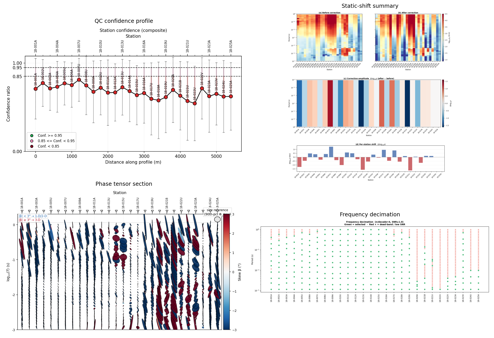

Processing And Diagnostics Agents
=================================

Processing agents transform loaded MT/AMT/CSAMT data into a cleaner, more
interpretable survey state before inversion or reporting.  They are the
scientific middle of an agent workflow: quality is measured, static-shift
effects are corrected, dimensionality is diagnosed, unstable periods are
removed, noisy responses are suppressed, and tensors can be rotated or exported
for downstream modelling.

The usual input is a ``Sites`` object produced by
:ref:`MTLoaderAgent <agent-mt-loader>`, although most agents also accept
``path`` and load the EDI files internally.  The usual output is an
:term:`AgentResult` containing processed sites, tables, metrics, warnings, and
figures.  This common return shape is important: the
:class:`~pycsamt.agents.AgentCoordinator` can pass one agent's output into the
next without losing the audit trail.

A typical diagnostic chain is:

.. code-block:: text

   MTLoaderAgent
   -> DataQCAgent
   -> StaticShiftAgent
   -> PhaseAnalysisAgent
   -> FrequencyDecimationAgent

Add ``DenoisingAgent`` before inversion when QC shows unstable bands.  Add
``TensorRotationAgent`` after strike estimation when the inversion code or
export product should use a consistent coordinate frame.  Add
``TipperAnalysisAgent`` when EDI files include vertical magnetic transfer
functions.

The processing stage can be summarized as

.. math::

   D_0 \xrightarrow{\mathrm{QC}} (D_0, Q)
   \xrightarrow{\mathrm{SS}} D_1
   \xrightarrow{\mathrm{PT}} (D_1, \Phi, \theta, \kappa)
   \xrightarrow{\mathrm{select}} D_2,

where :math:`D_0` is the loaded survey, :math:`Q` contains station and
frequency quality scores, :math:`D_1` is the static-shift-corrected survey,
:math:`\Phi` is the :term:`phase tensor`, :math:`\theta` is the estimated
strike, :math:`\kappa` represents dimensionality indicators, and :math:`D_2`
contains the selected periods used by inversion or final plots.

.. _agent-data-qc:

DataQCAgent
-----------

``DataQCAgent`` is the first diagnostic step after loading.  It evaluates
whether the survey is usable as a whole and whether individual stations or
frequency bands require attention before correction or inversion.  The agent
computes station-level quality tables, pass/fail flags, confidence scores, and
frequency-confidence products.  When ``output_dir`` is supplied, it also writes
figures such as a confidence pseudosection and a station confidence profile.

The QC result should be read as a decision surface, not as a single number.
Station confidence answers "which stations are weak?", while frequency
confidence answers "which periods are unstable across the line?".  This
distinction matters because a station can be acceptable overall while still
containing a narrow dead band that should not enter inversion.

For station :math:`i`, pyCSAMT combines indicators such as valid-frequency
coverage, SNR-like response strength, and skew into a confidence score
:math:`q_i \in [0, 1]`.  The thresholds
``min_frac_ok``, ``min_snr_med``, and ``max_skew_med`` determine whether a
station is flagged:

.. math::

   \mathrm{pass}_i =
   \left(f_i \ge f_{\min}\right)
   \land
   \left(\widetilde{\mathrm{SNR}}_i \ge s_{\min}\right)
   \land
   \left(\widetilde{|\beta|}_i \le \beta_{\max}\right).

Here :math:`f_i` is the fraction of usable periods, and medians are taken over
the station's period band.  A failed station is not automatically discarded; it
is marked for review so the analyst can decide whether to mask, correct, or
keep it.

.. code-block:: pycon

   >>> from pycsamt.agents import DataQCAgent
   >>> qc = DataQCAgent().execute({
   ...     "path": "data/AMT/WILLY_DATA/L18PLT",
   ...     "period_range": [0.001, 10.0],
   ...     "output_dir": "outputs/willy_processing/qc",
   ... })
   >>> print(qc.status)
   success
   >>> print(qc["n_flagged"])
   0
   >>> print(list(qc["figure_paths"].keys()))
   ['confidence_section', 'confidence_profile']

Important output keys are ``qc_table``, ``flags``, ``confidence_table``,
``freq_conf_table``, ``n_flagged``, ``flagged_stations``, ``sites``,
``figures``, and ``figure_paths``.  The ``sites`` object is included so later
agents can consume the same loaded survey state.

.. _agent-static-shift:

StaticShiftAgent
----------------

``StaticShiftAgent`` detects and corrects galvanic offsets in
:term:`apparent resistivity` curves.  A :term:`static shift` is
frequency-independent, so it moves an apparent-resistivity curve up or down
without carrying inductive depth information.  If left uncorrected, it can bias
inverted resistivities and layer depths even when phase curves look reasonable.

The agent should normally run after QC.  It accepts ``method="ama"``,
``"loess"``, ``"refmedian"``, ``"none"``, or compatible aliases.  It returns
``corrected_sites`` plus before/after log-resistivity matrices and correction
statistics.

In log space, a static-shift correction can be written as

.. math::

   \log_{10}\rho'_{a,i}(T)
   =
   \log_{10}\rho_{a,i}(T) - \Delta_i,

where :math:`\Delta_i` is the station correction estimated from spatial
neighbourhoods or a reference median over the chosen period band.  The output
``delta_stats`` summarizes the median absolute correction across stations; a
large ``n_shifted`` means the survey had many station curves offset relative to
their neighbours.

.. code-block:: pycon

   >>> from pycsamt.agents import DataQCAgent, StaticShiftAgent
   >>> qc = DataQCAgent().execute({"path": "data/AMT/WILLY_DATA/L18PLT"})
   >>> shifted = StaticShiftAgent(method="ama").execute({
   ...     "sites": qc["sites"],
   ...     "output_dir": "outputs/willy_processing/static_shift",
   ... })
   >>> print(shifted.status)
   success
   >>> print(round(shifted["delta_stats"]["mean"], 3))
   0.561
   >>> print(shifted["delta_stats"]["n_shifted"])
   26

The main downstream value is ``corrected_sites``.  Use it as the input to phase
analysis, decimation, inversion preparation, or denoising when the workflow is
intended to work from corrected responses.

.. _agent-phase-analysis:

PhaseAnalysisAgent
------------------

``PhaseAnalysisAgent`` runs phase-tensor, strike, and dimensionality analysis.
It is the agent that answers the modelling question: "Can this line be treated
as 1-D, 2-D, or does it show strong 3-D behavior?"  It returns a phase-tensor
table, a dimensionality table, counts of observations classified as 1-D, 2-D,
and 3-D, a consensus strike angle, strike spread, and several optional figures.

The :term:`phase tensor` is computed from the real and imaginary parts of the
:term:`impedance tensor`:

.. math::

   \boldsymbol{\Phi}
   =
   \mathbf{X}^{-1}\mathbf{Y},
   \qquad
   \mathbf{Z} = \mathbf{X} + i\mathbf{Y}.

Because the tensor is insensitive to frequency-independent galvanic scaling, it
is a strong diagnostic for dimensionality after static-shift correction.  The
agent uses skew :math:`|\beta|` and ellipticity :math:`e` to assign soft
dimensionality evidence.  With thresholds :math:`\beta_{\max}` and
:math:`e_{\max}`, a simplified decision rule is:

.. math::

   u_{3D} = \mathrm{clip}\left(|\beta|/\beta_{\max}, 0, 1\right),
   \qquad
   u_{1D} = (1-u_{3D})
   \mathrm{clip}\left(1-e/e_{\max}, 0, 1\right),

and the dominant class is chosen from the strongest evidence among 1-D, 2-D,
and 3-D.  The consensus strike is estimated with circular statistics, because
strike angles repeat every 180 degrees.

.. code-block:: pycon

   >>> from pycsamt.agents import (
   ...     DataQCAgent,
   ...     StaticShiftAgent,
   ...     PhaseAnalysisAgent,
   ... )
   >>> qc = DataQCAgent().execute({"path": "data/AMT/WILLY_DATA/L18PLT"})
   >>> shifted = StaticShiftAgent(method="ama").execute({"sites": qc["sites"]})
   >>> phase = PhaseAnalysisAgent().execute({
   ...     "sites": shifted["corrected_sites"],
   ...     "period_range": [0.001, 10.0],
   ...     "run_fingerprint": False,
   ...     "output_dir": "outputs/willy_processing/phase",
   ... })
   >>> print(phase.status)
   success
   >>> print(phase["n_1d"], phase["n_2d"], phase["n_3d"])
   0 29 1455
   >>> print(round(phase["strike_consensus"], 1))
   -38.5

In this WILLY example, the selected band is dominated by 3-D classifications.
That does not make the data unusable; it means a simple 1-D interpretation or a
single 2-D strike assumption should be treated cautiously.

   Key processing products from the WILLY L18PLT example: station confidence,
   static-shift correction, phase-tensor section, and period decimation.  The
   grid lets the QC, correction, dimensionality, and period-selection decisions
   be reviewed together.

Look closely at the static-shift panels and panel (b) reads as *less*
laterally smooth than panel (a) -- more station-to-station alternation, not
less.  That is not a mislabeled figure: :math:`\log_{10}\rho'_{a,i}(T) =
\log_{10}\rho_{a,i}(T) - \Delta_i` cannot change a column's shape with
period, only its level, so the identical vertical (period-to-period)
roughness of the two panels is the tell that they are a genuine
before/after pair rather than a swap.  Measuring lateral roughness (the mean
squared difference between adjacent stations at fixed period) on this line
gives :math:`\approx 0.34` before correction and :math:`\approx 1.21` after
it -- correction made the section rougher, not smoother.  The most
defensible reading is not a bug but a mismatch between method and data: AMA
correction assumes neighbouring stations share a similar *true* regional
trend, and this line's own phase-tensor evidence above (``n_3d = 1455``
against ``n_2d = 29`` and ``n_1d = 0``) says that assumption is a poor fit
here, so a ``half_window=3`` neighbourhood correction can end up removing
some real lateral structure along with the galvanic distortion.  A smooth
"before" panel is not by itself evidence of a correct one; check the
delta section (c) and the per-station bars (d) against independent geology
or a wider ``half_window`` before trusting either panel at face value.

.. _agent-tensor-rotation:

TensorRotationAgent
-------------------

``TensorRotationAgent`` rotates impedance tensors and tipper vectors by a fixed
strike angle and writes rotated EDI files.  It is normally used after
``PhaseAnalysisAgent`` has estimated a stable strike, or when the analyst has a
geological strike from mapping or previous modelling.

For a horizontal rotation angle :math:`\theta`, the impedance tensor transforms
as

.. math::

   \mathbf{Z}' = \mathbf{R}(\theta)\,
   \mathbf{Z}\,\mathbf{R}^{T}(\theta),
   \qquad
   \mathbf{R}(\theta)=
   \begin{bmatrix}
   \cos\theta & \sin\theta\\
   -\sin\theta & \cos\theta
   \end{bmatrix}.

The agent audits the rotation using a diagonal-suppression proxy:

.. math::

   \Delta_{\mathrm{diag}}
   =
   \left\langle |Z_{xx}/Z_{xy}| \right\rangle_{\mathrm{before}}
   -
   \left\langle |Z'_{xx}/Z'_{xy}| \right\rangle_{\mathrm{after}}.

A positive value means the rotation reduced diagonal energy relative to the
off-diagonal mode, which is often desirable for approximately 2-D responses.
A negative or unstable value suggests the selected angle may not represent the
data well.

.. code-block:: pycon

   >>> from pycsamt.agents import TensorRotationAgent
   >>> rotated = TensorRotationAgent(strike_deg=-38.5).execute({
   ...     "path": "data/AMT/WILLY_DATA/L18PLT",
   ...     "output_dir": "outputs/willy_processing/rotated_edis",
   ...     "overwrite": True,
   ... })
   >>> print(rotated["strike_deg"])
   -38.5
   >>> print(rotated["n_written"])
   28
   >>> print(rotated["z_diag_reduction"])
   0.0654

The essential outputs are ``written_paths``, ``failed_stations``,
``n_written``, ``z_diag_reduction``, and ``figure_paths``.  Use
``written_paths`` as the hand-off to external inversion software or to
``EDIExportAgent``-style delivery workflows.

.. _agent-tipper-analysis:

TipperAnalysisAgent
-------------------

``TipperAnalysisAgent`` analyzes vertical magnetic transfer functions when
tipper data are present.  Tipper vectors complement impedance diagnostics
because they are sensitive to lateral conductivity gradients and 3-D structure.
The agent produces a tipper table over station and period, an induction-arrow
table at a reference period, and figures for amplitude, arrows, and
pseudosections.

If :math:`T_x` and :math:`T_y` are the complex tipper components, the vertical
field relation is

.. math::

   H_z = T_x H_x + T_y H_y.

The induction-arrow components are derived from the real or imaginary tipper
parts depending on the requested convention.  ``convention="wiese"`` and
``"parkinson"`` differ in arrow orientation, so keep the convention explicit in
reports.

.. code-block:: pycon

   >>> from pycsamt.agents import TipperAnalysisAgent
   >>> tipper = TipperAnalysisAgent(convention="wiese").execute({
   ...     "path": "data/AMT/WILLY_DATA/L18PLT",
   ...     "output_dir": "outputs/willy_processing/tipper",
   ... })
   >>> print(tipper.status)
   failed
   >>> print(tipper.error)
   No tipper data found in any station.

This failure is informative rather than exceptional: many AMT/CSAMT EDI
collections contain impedance but no tipper section.  Run this agent only when
the acquisition includes vertical magnetic data.

.. _agent-frequency-decimation:

FrequencyDecimationAgent
------------------------

``FrequencyDecimationAgent`` selects a compact period set for inversion and
publication plots.  It removes periods outside a requested range, rejects
periods that fail an SNR threshold, and keeps a log-spaced subset controlled by
``n_per_decade``.  This is especially useful before Occam2D, ModEM, AI
inversion, or comparison plots where too many adjacent frequencies can
overweight a narrow part of the spectrum.

Let :math:`T_j = 1/f_j` be the period associated with frequency :math:`f_j`.
After the period-range and SNR masks are applied, selected target periods are
placed uniformly in :math:`\log_{10}T`:

.. math::

   \tau_m =
   \tau_{\min}
   +
   m\,
   \frac{\tau_{\max}-\tau_{\min}}{M-1},
   \qquad
   \tau=\log_{10}T.

For each target :math:`\tau_m`, the nearest valid observed period is retained.
The result preserves logarithmic depth coverage while avoiding unnecessary
frequency density.

.. code-block:: pycon

   >>> from pycsamt.agents import DataQCAgent, FrequencyDecimationAgent
   >>> qc = DataQCAgent().execute({"path": "data/AMT/WILLY_DATA/L18PLT"})
   >>> decimated = FrequencyDecimationAgent(
   ...     n_per_decade=4,
   ...     snr_threshold=1.0,
   ... ).execute({
   ...     "sites": qc["sites"],
   ...     "period_range": [0.001, 10.0],
   ...     "output_dir": "outputs/willy_processing/decimated",
   ... })
   >>> print(decimated.status)
   success
   >>> print(decimated["n_selected"], decimated["n_original"])
   258 1092
   >>> print(round(decimated["selection_ratio"], 3))
   0.236

Use ``selected_periods`` when preparing inversion inputs.  Use
``dead_band_mask`` to understand which stations and periods were rejected by
the SNR criterion.

.. _agent-denoising:

DenoisingAgent
--------------

``DenoisingAgent`` suppresses unstable impedance responses before analysis or
inversion.  Supported modes include ``"rpca"``, ``"hampel"``, ``"emap"``,
``"pipeline"``, and AI denoisers when the optional neural backend is available.
The agent reports a simple SNR-proxy improvement, the number of cells that
crossed the SNR threshold, and a before/after pseudosection figure.

For the RPCA mode, the conceptual model is

.. math::

   \mathbf{X} = \mathbf{L} + \mathbf{S} + \mathbf{E},

where :math:`\mathbf{X}` is the observed response matrix, :math:`\mathbf{L}` is
a low-rank coherent signal, :math:`\mathbf{S}` is sparse contamination, and
:math:`\mathbf{E}` is residual noise.  The goal is not to make the data smooth;
it is to preserve coherent electromagnetic structure while reducing isolated
outliers and unstable bands.

.. code-block:: pycon

   >>> from pycsamt.agents import DataQCAgent, DenoisingAgent
   >>> qc = DataQCAgent().execute({"path": "data/AMT/WILLY_DATA/L18PLT"})
   >>> denoised = DenoisingAgent(method="rpca").execute({
   ...     "sites": qc["sites"],
   ...     "output_dir": "outputs/willy_processing/denoised",
   ... })
   >>> print(denoised.status)
   success
   >>> print(round(denoised["snr_gain"], 3))
   0.06
   >>> print(denoised["n_recovered"])
   19

Use ``denoised_sites`` as the input to AI inversion or robust downstream
analysis.  Keep ``snr_gain`` in context: a small positive gain may still be
valuable if it recovers critical periods, while a large gain should be checked
against the before/after figure to avoid over-smoothing.

Putting The Agents Together
---------------------------

The safest production pattern is to preserve each processing state explicitly:

.. code-block:: text

   raw sites
   -> qc["sites"]
   -> shifted["corrected_sites"]
   -> phase diagnostics and strike estimate
   -> decimated["selected_periods"]
   -> denoised["denoised_sites"] when required
   -> rotated EDI files when a fixed strike frame is justified

For reproducibility, keep the output directory stable and inspect
``warnings`` after every agent.  A successful status means the agent produced a
usable result; it does not mean that every station, period, correction, or
geological assumption is scientifically resolved.
