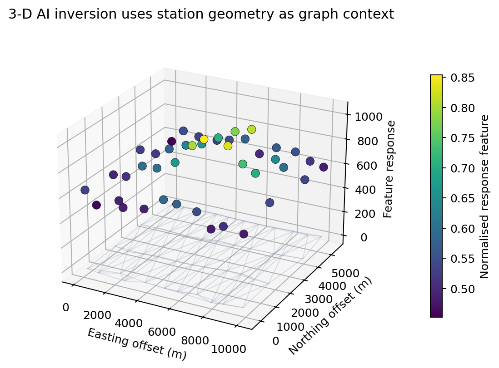

.. _user_guide_ai_inversion:

AI Inversion
============

AI inversion in pyCSAMT is a supervised surrogate-inversion workflow.  A
forward modeller generates synthetic electromagnetic responses from known
subsurface models, a neural network learns the inverse mapping, and the trained
inverter predicts resistivity structure from field observations.

The v2 API is not limited to station-wise 1-D inversion.  It exposes three
main inversion levels:

* :class:`pycsamt.ai.inversion.EMInverter1D` for independent MT, CSAMT, or TEM
  station inversions;
* :class:`pycsamt.ai.inversion.EMInverter2D` for profile sections represented
  as frequency-by-station panels;
* :class:`pycsamt.ai.inversion.GCNInverter3D` for multi-line surveys where
  station geometry is used as graph context.

.. important::

   AI inversion is a fast surrogate and screening tool, not a replacement for
   geophysical judgement or for classical inversion backends such as Occam2D,
   ModEM, or MARE2DEM.  Always check training coverage, residuals,
   uncertainty, depth of investigation, and geological plausibility before
   using the result in interpretation.

Workflow
--------

The AI workflow sits between forward modelling and interpretation.

.. figure:: ../images/user_guide/ai_inversion/workflow.png
   :alt: pyCSAMT AI inversion workflow diagram
   :align: center
   :width: 90%

   Clean survey data and synthetic forward responses are used to train an
   inverter.  Field prediction is accepted only after coverage, residual, and
   uncertainty checks.

The same logic applies to 1-D, 2-D, and 3-D inversion:

1. decide the dimensionality and target parameterisation;
2. define a training distribution that covers the expected geology and survey
   response range;
3. generate synthetic response/model pairs;
4. train and validate the inverter;
5. predict field data using the same feature convention used during training;
6. inspect residuals, uncertainty, and classical-inversion consistency.

Choose The Inversion Level
--------------------------

Start by choosing the inversion level from the survey geometry and the
interpretation question.

.. list-table::
   :header-rows: 1
   :widths: 16 28 28 28

   * - Level
     - Input shape
     - Output shape
     - Best use
   * - 1-D
     - ``(n_samples, n_features)``
     - ``(n_samples, 2*n_layers - 1)``
     - Fast station-by-station screening, TEM soundings, MT/CSAMT layered
       models, first-pass QC.
   * - 2-D
     - ``(n_profiles, n_components, n_freqs, n_stations)``
     - ``(n_profiles, n_depth, n_stations)``
     - Survey lines where lateral continuity matters and station order is
       meaningful.
   * - 3-D
     - ``(n_samples, n_stations, n_features)``
     - ``(n_samples, n_stations, 2*n_layers - 1)``
     - Multi-line surveys where neighbour stations should influence each
       other through graph message passing.

Use 1-D when you need rapid station models or when the survey is sparse.  Use
2-D when a line has enough station density to learn lateral continuity.  Use
3-D when the station layout is genuinely spatial, such as several parallel
lines or an areal AMT/MT survey.

Public Objects
--------------

The main AI inversion objects are:

.. list-table::
   :header-rows: 1
   :widths: 24 76

   * - Object
     - Role
   * - ``EMInverter1D``
     - Fully connected, CNN, or residual 1-D inverter for MT, CSAMT, and TEM
       response features.
   * - ``EMInverter2D``
     - U-Net style inverter that maps frequency-station panels to
       depth-station resistivity sections.
   * - ``GCNInverter3D``
     - Graph-convolutional inverter that uses station coordinates or an
       adjacency matrix to share information across neighbouring stations.
   * - ``JointInverter``
     - Interface for multi-observable inversion experiments.
   * - ``EnsembleInverter``
     - Combines several trained inverters and estimates predictive spread.
   * - ``InversionConfig``
     - Configuration for a single AI inverter.
   * - ``RunConfig``
     - Configuration that couples forward dataset generation and AI training.
   * - ``ConformalPredictor`` and ``PosteriorCalibrator``
     - Calibration and uncertainty helpers.

The optional :class:`pycsamt.agents.ai_inversion.AIInversionAgent` wraps the
same lower-level classes for orchestration, figure export, and optional
LLM-assisted summaries.

Training Distribution
---------------------

The training distribution is part of the inversion model.  A network trained
on smooth four-layer synthetic models should not be expected to recover sharp
conductors, basement steps, strong static shift, or source effects unless those
cases were represented during training.

Before generating data, define:

* method and solver: ``"mt1d"``, ``"csamt1d"``, ``"tem1d"``, ``"mt2d"``, or
  graph-based ``"mt3d"`` workflows;
* resistivity range in :math:`\Omega\cdot m`;
* layer thickness, depth, and structural variability;
* frequency or period grid;
* components included in the feature vector;
* noise and static-shift scenarios;
* expected station spacing and line geometry.

.. figure:: ../images/user_guide/ai_inversion/training_distribution.png
   :alt: AI inversion training distribution coverage diagnostic
   :align: center
   :width: 90%

   Training coverage should be checked before trusting a field prediction.
   Observed responses that sit outside the synthetic envelope are
   extrapolation, not ordinary prediction.

Configuration-First Runs
------------------------

For production work, prefer a configuration file over a long notebook cell.
This makes runs auditable and repeatable.

.. code-block:: python
   :linenos:

   from pycsamt.ai.inversion import RunConfig

   RunConfig.write_template("ai_inversion_run.yml")

   run = RunConfig.from_file("ai_inversion_run.yml")
   run.validate()
   print(run.summary())

``RunConfig`` keeps the forward and inversion sections consistent.  For
example, the solver, layer count, phase usage, and frequency grid must agree
between the synthetic dataset and the inverter.

1-D Station Inversion
---------------------

Use 1-D AI inversion when each station can be interpreted as a layered model
or when you need a fast first-pass result before 2-D or 3-D modelling.

The 1-D estimator supports ``"resnet"``, ``"cnn1d"``, and ``"fcn"``
architectures.

.. code-block:: python
   :linenos:

   from pycsamt.ai.inversion import RunConfig
   from pycsamt.forward.batch import generate_dataset

   run = RunConfig.from_file("ai_inversion_1d.yml")
   run.validate()

   dataset = generate_dataset(**run.to_dataset_kwargs())

   inverter = run.to_inverter()
   inverter.fit(dataset, **run.to_fit_kwargs())
   inverter.save(run.checkpoint_path())

The field prediction feature matrix must match the training feature
convention.  If training used :math:`\log_{10}(\rho_a)` plus phase at 32
frequencies, the field matrix must use the same order and frequency grid.

.. code-block:: python
   :linenos:

   from pycsamt.ai.inversion import EMInverter1D

   inverter = EMInverter1D.load("checkpoints/mt1d_resnet_5l.npz")
   y_pred = inverter.predict(X_obs)

.. figure:: ../images/user_guide/ai_inversion/training_convergence.png
   :alt: AI inverter training convergence figure
   :align: center
   :width: 80%

   Training and validation curves identify under-fitting, over-fitting, and
   the best checkpoint epoch.

2-D Profile Inversion
---------------------

Use :class:`pycsamt.ai.inversion.EMInverter2D` when a survey line should be
inverted as a profile instead of independent stations.  The input is a stack
of 2-D data panels:

.. code-block:: text
   :linenos:

   X.shape = (n_profiles, n_components, n_freqs, n_stations)
   y.shape = (n_profiles, n_depth, n_stations)

Typical components are apparent resistivity and phase for one or more tensor
modes.  The output is a :math:`\log_{10}(\rho)` section on a fixed depth grid.

.. code-block:: python
   :linenos:

   from pycsamt.ai.inversion import EMInverter2D

   inv2d = EMInverter2D(
       n_components=4,
       n_freqs=32,
       n_stations=48,
       n_depth=64,
       arch="unet",
       dropout=0.20,
   )

   inv2d.fit(
       X_train,
       y_train,
       epochs=80,
       batch_size=8,
       val_frac=0.15,
       seed=42,
   )

   log_section = inv2d.predict(X_field_profile)

.. figure:: ../images/user_guide/ai_inversion/predicted_section.png
   :alt: AI predicted resistivity section with misfit and diagnostics
   :align: center
   :width: 90%

   A 2-D AI inversion section should be inspected together with misfit,
   convergence, and per-station residuals.

The 2-D workflow is sensitive to station ordering.  Before prediction, sort
stations by profile distance and apply the same missing-data and interpolation
policy used during training.

3-D Graph Inversion
-------------------

Use :class:`pycsamt.ai.inversion.GCNInverter3D` when stations are distributed
over an area or across several lines.  The model sees each station as a graph
node.  Edges connect nearby stations, allowing graph-convolution layers to
share information across the survey.

   The 3-D GCN workflow uses station geometry or an explicit adjacency matrix
   so neighbouring stations contribute to each prediction.

The input convention is:

.. code-block:: text
   :linenos:

   X.shape      = (n_samples, n_stations, n_features)
   coords.shape = (n_stations, 2)
   y.shape      = (n_samples, n_stations, 2*n_layers - 1)

For one survey, ``X`` may also be supplied as ``(n_stations, n_features)``.
The target at each station is the same layered parameter vector used by the
1-D model: layer resistivities followed by interface thicknesses.

.. code-block:: python
   :linenos:

   from pycsamt.ai.inversion import GCNInverter3D

   inv3d = GCNInverter3D(
       n_features=64,
       n_layers=5,
       hidden=(256, 128, 64),
       dropout=0.10,
   )

   inv3d.fit(
       X_train,
       y_train,
       coords=station_xy,
       radius=3000.0,
       epochs=100,
       batch_size=8,
       val_frac=0.15,
       seed=42,
   )

   mean_model = inv3d.predict(X_field, coords=station_xy, radius=3000.0)
   mean_model, sigma_model = inv3d.predict_with_uncertainty(
       X_field,
       coords=station_xy,
       radius=3000.0,
       n_mc=30,
   )

When station spacing is irregular, inspect the adjacency matrix.  A radius
that is too small gives almost independent 1-D predictions; a radius that is
too large can over-smooth across geological boundaries.

Real-Data Smoke Tests
---------------------

The repository includes small field-data fixtures under ``data/``.  They are
useful for testing the loading, feature-extraction, plotting, and prediction
interfaces before running a large project.

For station-level tests, ``data/3edis`` contains three EDI files:

.. code-block:: python
   :linenos:

   from pathlib import Path

   from pycsamt.site import Sites
   from pycsamt.site.utils import as_edicollection

   sample_dir = Path("data/3edis")
   edis = as_edicollection(sample_dir)
   sites = Sites(edis)

   print(len(sites))
   print([site.name for site in sites])

Use this fixture to verify that your field feature builder returns the shape
expected by the selected inverter.

.. code-block:: python
   :linenos:

   # Example only: implement this helper with the same feature policy used
   # for training.
   X_obs, station_names, periods = build_ai_inversion_features(
       sites,
       n_freqs=32,
       include_phase=True,
       component="xy",
   )

   assert X_obs.shape[0] == len(station_names)

For 3-D or classical-comparison smoke tests, the repository also contains
ModEM files under ``data/ModEM_inversion_files``.  These are useful for
checking station coordinates, model grids, and comparison plots against a
classical inversion result.

.. code-block:: python
   :linenos:

   from pathlib import Path

   modem_dir = Path("data/ModEM_inversion_files")
   data_file = modem_dir / "RERUN-AMT-BHS-NEW-TEST08.dat"
   model_file = modem_dir / "RERUN-AMT-BHS-NEW-TEST08.rho"

   assert data_file.exists()
   assert model_file.exists()

.. note::

   These repository fixtures are for API and documentation smoke tests.  They
   are not a substitute for a release-quality training set.  A production AI
   inversion should use a documented synthetic distribution and a held-out
   validation set designed for the survey.

Inspect And Validate Results
----------------------------

AI inversion should be accepted only after visual and numerical checks:

* training and validation loss;
* synthetic coverage against observed responses;
* predicted model plausibility;
* observed versus reconstructed response residuals;
* station-wise residual maps or profiles;
* uncertainty intervals or ensemble spread;
* consistency with Bostick, Occam2D, ModEM, MARE2DEM, or geological controls.

For 2-D sections, use :func:`pycsamt.ai.plot.inversion.plot_inversion_result_2d`
when ground truth, training history, or per-station residuals are available:

.. code-block:: python
   :linenos:

   from pycsamt.ai.plot.inversion import plot_inversion_result_2d

   fig = plot_inversion_result_2d(
       log_pred,
       log_true=log_true,
       depths=depths,
       stations=station_offsets,
       train_loss=history["train_loss"],
       val_loss=history.get("val_loss"),
       suptitle="AI inversion result - L22PLT",
   )

   fig.savefig("figures/ai_2d_result.png", dpi=180, bbox_inches="tight")

Uncertainty
-----------

A single neural-network prediction can look precise even when the model is not
well constrained.  Use uncertainty tools when interpretation depends on
conductor continuity, depth estimates, or target boundaries.

Typical options are:

* train several models with different seeds or architectures and combine them
  with :class:`pycsamt.ai.inversion.EnsembleInverter`;
* calibrate intervals with :class:`pycsamt.ai.inversion.ConformalPredictor`;
* use :class:`pycsamt.ai.inversion.PosteriorCalibrator` to sample plausible
  model parameters;
* use Monte-Carlo dropout with ``GCNInverter3D.predict_with_uncertainty`` for
  graph-based surveys.

.. code-block:: python
   :linenos:

   from pycsamt.ai.inversion import EMInverter1D, EnsembleInverter

   ensemble = EnsembleInverter([
       EMInverter1D.load("checkpoints/resnet_seed1.npz"),
       EMInverter1D.load("checkpoints/resnet_seed2.npz"),
       EMInverter1D.load("checkpoints/cnn_seed3.npz"),
   ])

   mean, sigma = ensemble.predict_with_uncertainty(X_obs)

.. figure:: ../images/user_guide/ai_inversion/uncertainty_profile.png
   :alt: AI inversion uncertainty interval by depth
   :align: center
   :width: 82%

   Prediction intervals usually widen with depth and in regions weakly
   represented by the training distribution.

Agent Workflow
--------------

The lower-level API is preferred for reproducible scripts.  The agent is useful
when you want an orchestration layer that can train, predict, export figures,
and optionally summarize the result in plain language.

.. code-block:: python
   :linenos:

   from pycsamt.agents import AIInversionAgent

   agent = AIInversionAgent(
       arch="resnet",
       n_layers=5,
       n_train_samples=5000,
       epochs=50,
   )

   result = agent.execute({
       "path": "data/3edis",
       "output_dir": "outputs/ai_inversion/3edis",
   })

   print(result.success)
   print(result.summary)

When an LLM provider is configured through :mod:`pycsamt.api.agents`, the
summary can include a short geophysical interpretation and recommended next
steps.  The numerical result remains the trained inverter and predictions
stored in the agent output data.

Pretrained Checkpoints
----------------------

Pretrained checkpoints are useful only when their assumptions match the
survey.  Check the solver, frequency range, layer parameterisation,
resistivity bounds, phase usage, and noise assumptions before using one.

.. code-block:: python
   :linenos:

   from pycsamt.ai._zoo import list_pretrained
   from pycsamt.ai.inversion import EMInverter1D

   for name, description in list_pretrained().items():
       print(name, "-", description)

   inverter = EMInverter1D.from_pretrained("mt1d-resnet-5layer-v1")

Quality-Control Checklist
-------------------------

.. list-table::
   :header-rows: 1
   :widths: 30 70

   * - Check
     - Why it matters
   * - Dimensionality selected deliberately
     - A 1-D surrogate, 2-D profile model, and 3-D graph model answer
       different questions.
   * - Field features match training
     - Feature order, frequency grid, phase usage, and scaling must be
       identical.
   * - Synthetic envelope covers observations
     - Predictions outside the training distribution are extrapolations.
   * - Validation loss is stable
     - Divergent validation loss indicates over-fitting or inadequate
       training coverage.
   * - Residuals are spatially coherent
     - Clusters of high residuals can indicate dimensionality changes, source
       effects, or bad stations.
   * - Uncertainty is reported
     - Deep boundaries and conductor edges should not be treated as exact.
   * - Classical comparison performed
     - Compare with a conventional inversion or independent geological
       constraint before interpretation.

Common Failure Modes
--------------------

``ValueError`` about feature length
    The field feature matrix does not match the network input size.  Check
    ``include_phase``, ``n_freqs``, component order, and the frequency grid.

Flat or geologically unrealistic predictions
    The training distribution may be too narrow, or the network may have
    underfit.  Increase model variability and inspect validation loss.

Good training loss but poor field residuals
    The synthetic data do not represent the field survey.  Add noise, static
    shift, broader resistivity ranges, topography effects, or source-effect
    examples.

2-D output appears shifted along the line
    Station order or spacing differs between training and prediction.  Sort by
    profile distance and keep a stable station axis convention.

3-D graph over-smooths the survey
    The adjacency radius is too large, or the graph connects stations across a
    structural boundary.  Inspect the graph before training.

Large uncertainty at depth
    This is common and often correct.  Do not interpret deep boundaries beyond
    the supported period range as precise interfaces.

Reproducible Project Layout
---------------------------

.. code-block:: text
   :linenos:

   ai_inversion_project/
   ├── configs/
   │   ├── ai_inversion_1d.yml
   │   ├── ai_inversion_2d.yml
   │   └── ai_inversion_3d.yml
   ├── data/
   │   └── L22PLT/
   ├── datasets/
   │   ├── mt1d_training.npz
   │   ├── mt2d_profiles.npz
   │   └── mt3d_graph_training.npz
   ├── checkpoints/
   │   ├── mt1d_resnet_5l.npz
   │   ├── mt2d_unet_profile.npz
   │   └── mt3d_gcn.npz
   ├── figures/
   │   ├── training_distribution.png
   │   ├── training_convergence.png
   │   ├── prediction_section.png
   │   └── uncertainty.png
   └── reports/
       └── ai_inversion_summary.md

Keep the run configuration, dataset metadata, checkpoint, field feature
builder, and figures together.  The most important question during review is
simple: was the field prediction interpolation inside the training
distribution, or extrapolation beyond it?

Documentation Figures
---------------------

The figures in this page are generated by
``docs/scripts/generate_ai_inversion_figures.py``.  They are deterministic
documentation figures designed to show the validation logic without requiring
a long training run during the documentation build.
