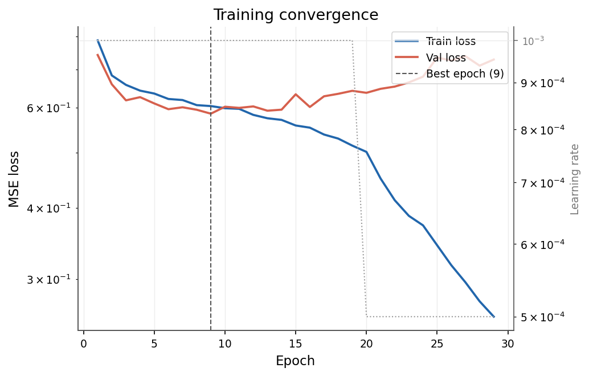
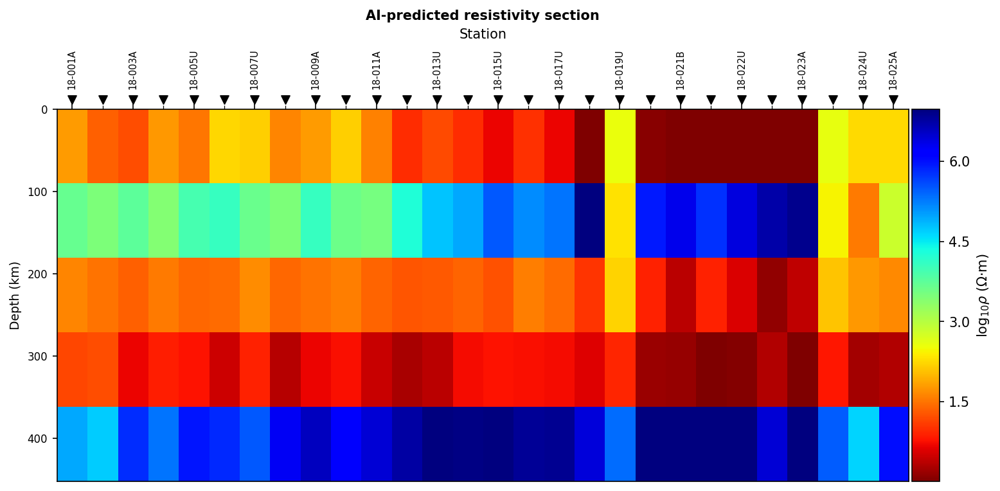
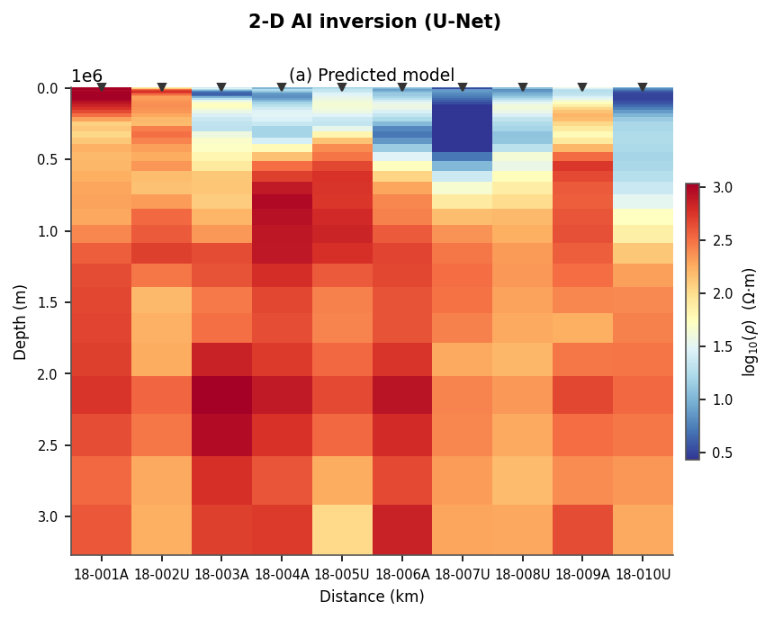
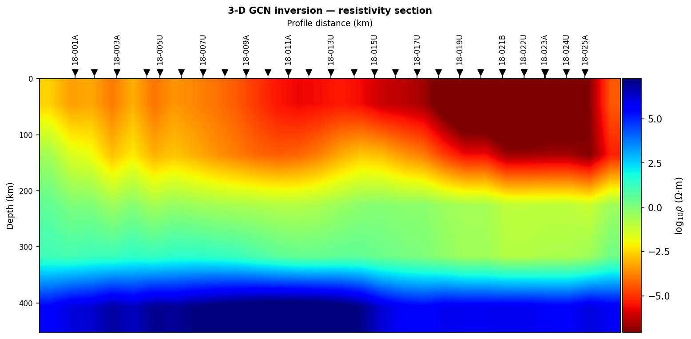
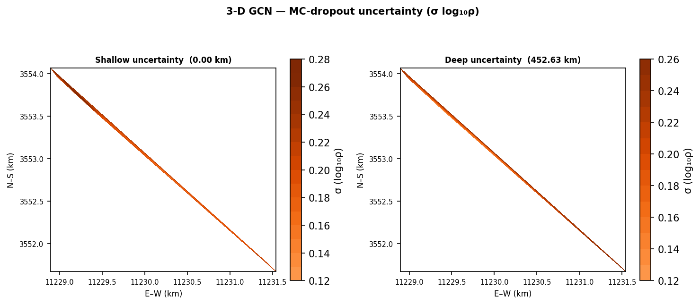
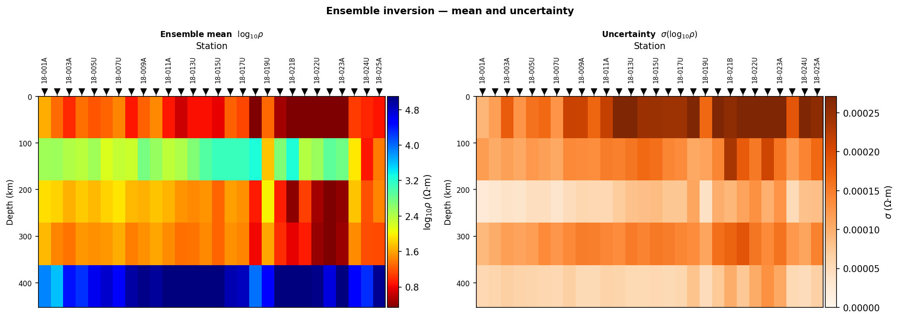
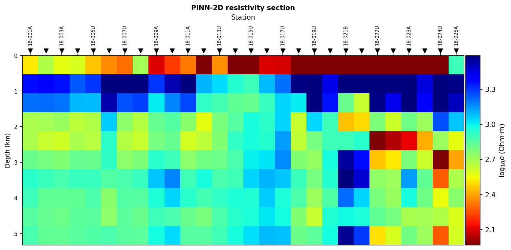
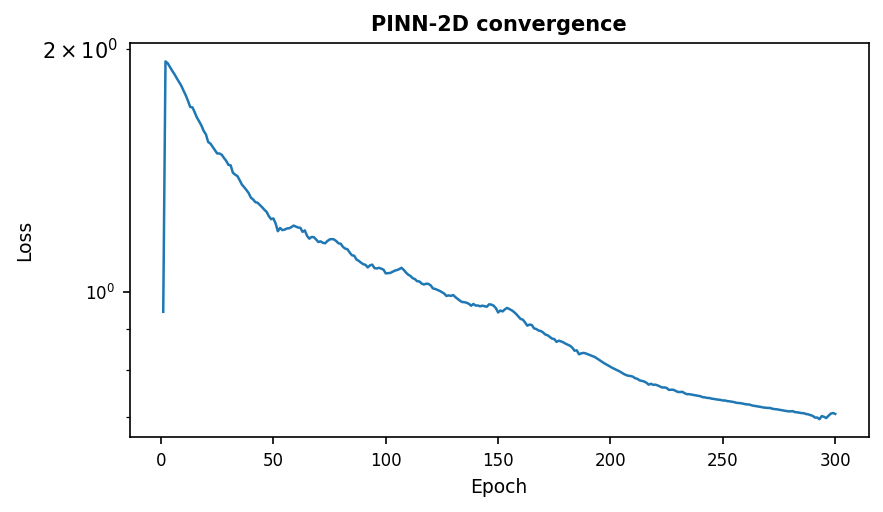

.. _ai_inversion_agents:

AI inversion agents
===================

The agents in :mod:`pycsamt.agents` provide task-oriented orchestration around
the :term:`AI inversion` classes in :mod:`pycsamt.ai.inversion`. Each :term:`agent`
can load EDI data, construct model inputs, train or load an inverter, predict
resistivity, compute selected diagnostics, create figures, save outputs, and
return a standard :term:`AgentResult`.

Agents do not replace the science API. Use the lower-level inverter classes
when you need complete control of datasets, network construction, training
loops, loss functions, checkpoints, or research experiments. Use agents when
the built-in workflow matches the task and a consistent result contract is
valuable.

.. admonition:: Human review remains required
   :class: important

   An agent can coordinate calculations but cannot establish that the
   training distribution represents the field site, that a predicted model is
   unique, or that geological interpretation is justified. :term:`Non-uniqueness`
   is a property of the inverse problem itself, not something a fast prediction
   removes. Review input data, training provenance, forward response fit,
   warnings, uncertainty, and independent evidence before using a result
   operationally.

Agent map
---------

.. list-table::
   :header-rows: 1
   :widths: 23 25 52

   * - Agent
     - Main engine
     - Intended use
   * - :class:`pycsamt.agents.AIInversionAgent`
     - :class:`pycsamt.ai.inversion.EMInverter1D`
     - Independent layered 1-D prediction at each station, trained from
       synthetic MT responses or loaded from a checkpoint.
   * - :class:`pycsamt.agents.Inv2DAgent`
     - :class:`pycsamt.ai.inversion.EMInverter2D`
     - U-Net profile inversion using the complete station–frequency panel to
       predict a laterally coherent section.
   * - :class:`pycsamt.agents.Inv3DAgent`
     - :class:`pycsamt.ai.inversion.GCNInverter3D`
     - Graph-based multi-station prediction using coordinates and spatial
       adjacency, with optional :term:`Monte Carlo dropout` spread.
   * - :class:`pycsamt.agents.EnsembleAgent`
     - :class:`pycsamt.ai.inversion.EnsembleInverter`
     - :term:`Ensemble inversion`, prediction intervals, and optional
       :term:`conformal prediction` calibration.
   * - :class:`pycsamt.agents.PINNInversionAgent`
     - PINN 1-D, 2-D, or 3-D inverter
     - :term:`Physics-informed inversion` without labelled training targets.
   * - :class:`pycsamt.agents.ModelZooAgent`
     - :term:`Model zoo` registry and ``EMInverter1D``
     - List model metadata, obtain a released :term:`checkpoint`, or run the
       zoo prediction shortcut.

Additional agents such as ``HybridInversionAgent`` (:term:`hybrid inversion`),
``JointInversionAgent``, ``AnomalyDetectionAgent``, ``SensitivityAgent``,
``InversionComparisonAgent``, and ``InversionEvaluationAgent`` support more
specialized review and combination workflows. Start with one primary agent and
add these only when the scientific question requires them.

Common execution contract
-------------------------

All primary agents use the same call shape:

.. code-block:: pycon

   >>> result = agent.execute({
   ...     "path": "data/AMT/WILLY_DATA/L18PLT",
   ...     "output_dir": "outputs/ai_inversion/L18",
   ... })

``path`` or ``sites``
   Required observed input. ``path`` is passed through the canonical
   :func:`pycsamt.emtools._core.ensure_sites` loader. ``sites`` accepts an
   already loaded :class:`pycsamt.site.Sites` object.

``output_dir``
   Optional output directory for supported checkpoints and figures. If it is
   omitted, in-memory results can still be returned.

Some agents accept additional execution overrides, such as ``period_range``,
``coords``, ``adjacency``, ``epochs``, or ``n_train_samples``. Constructor
parameters remain the clearest way to define a reproducible workflow; runtime
overrides should be recorded with the result. A key documented on an agent's
input contract is not automatically wired to internal behaviour — verify a
new override changes the result before relying on it operationally.

AgentResult
-----------

Every execution returns an :term:`AgentResult`, not a bare array:

.. code-block:: pycon

   >>> if result.status == "failed":
   ...     raise RuntimeError(
   ...         f"{result.error}\nSuggested fix: {result.error_fix_hint}"
   ...     )
   >>> print(result.status)
   >>> print(result.summary)
   >>> print(result.warnings)
   >>> print(result.elapsed_seconds)
   >>> rms = result.get("rms_global")

The standard fields are:

``status``
   ``"success"``, ``"failed"``, or ``"needs_review"``. A truth test is false
   only for ``"failed"``; therefore check the exact status when
   ``"needs_review"`` must stop a production workflow.

``summary``
   Short human-readable execution summary.

``data``
   Agent-specific arrays, inverter objects, figures, and paths. Dictionary-like
   access is available through ``result["key"]`` and ``result.get(...)``.

``warnings``
   Non-fatal issues. A successful status does not make these optional reading.

``error`` and ``error_fix_hint``
   Failure detail and suggested remediation.

``llm_interpretation``
   Optional generated narrative when an API key is configured. This text is
   commentary, not a validated scientific conclusion.

``elapsed_seconds`` and ``cost_estimate_usd``
   Execution duration and estimated LLM cost. Neural-network compute cost is
   not represented by the LLM cost field.

Prepare data before running an agent
------------------------------------

Load and inspect the same data independently before delegating inversion. The
survey used throughout this page is the bundled Willy AMT line:

.. code-block:: pycon

   >>> from pycsamt.emtools._core import ensure_sites
   >>> sites = ensure_sites(
   ...     "data/AMT/WILLY_DATA/L18PLT",
   ...     recursive=True,
   ...     verbose=0,
   ... )
   >>> print("Usable stations:", len(sites))
   Usable stations: 28

Review :term:`quality control`, impedance components, frequencies,
coordinates, :term:`dimensionality`, :term:`static shift`, and processing
provenance first. The 1-D agent includes an important fast-fail guard: it
verifies that at least one station can produce a finite impedance
:term:`feature vector` before spending time generating synthetic data and
training. This guard catches empty or corrupted inputs, but it is not a
complete QC assessment.

Deep-learning backend
---------------------

The inversion agents lazily require PyTorch or TensorFlow. If neither backend
is available, they return a failed :term:`AgentResult` with an installation
hint instead of failing package import:

.. code-block:: pycon

   >>> from pycsamt.backends import get_backend, list_backends
   >>> print(get_backend())
   torch
   >>> print(list_backends())
   {'torch': True, 'tensorflow': True}

Verify the project environment before a long run. Also record backend name,
version, hardware, random seeds where exposed, and numerical precision. Results
can differ across backends and devices even when high-level parameters match —
the runs captured on this page used a CPU-only PyTorch 2.5 build, so timings
will differ on GPU or TensorFlow.

AIInversionAgent: 1-D workflow
------------------------------

:class:`pycsamt.agents.AIInversionAgent` performs this built-in sequence:

#. load observed stations;
#. interpolate impedance-derived features onto a common frequency grid;
#. generate synthetic layered MT training examples unless a checkpoint loads;
#. fit :class:`~pycsamt.ai.inversion.EMInverter1D`;
#. predict layer resistivities and thicknesses for each usable station;
#. forward-model each prediction and calculate a log-resistivity RMS where
   possible;
#. create convergence and section figures;
#. optionally save the inverter and figures.

Train from synthetic data
~~~~~~~~~~~~~~~~~~~~~~~~~

.. code-block:: pycon

   >>> from pycsamt.agents import AIInversionAgent
   >>> agent = AIInversionAgent(
   ...     arch="resnet",
   ...     n_layers=5,
   ...     n_train_samples=10_000,
   ...     epochs=100,
   ... )
   >>> result = agent.execute({
   ...     "sites": sites,
   ...     "output_dir": "outputs/ai_inversion/L18_1d",
   ... })
   >>> print(result.status, result.summary)
   success AI inversion (resnet, 5 layers): 28 stations predicted. RMS 1.669. 2 figure(s).

Supported architecture names are ``"resnet"``, ``"cnn1d"``, and ``"fcn"``.
The default workflow uses 40 log-spaced frequencies from :math:`10^{-4}` to
:math:`10^3` Hz, 2,000 synthetic examples, five layers, and 30 epochs. Those
defaults are convenient workflow settings, not evidence of production
adequacy: running the same survey with the constructor defaults instead of the
values above still completes in about a minute, but the fitted network only
reaches RMS ≈ 3.9 — more than twice as bad as the 10,000-sample, 100-epoch run
captured above, which took about fourteen minutes on a single CPU core.
Sample count and epoch budget are part of the scientific configuration, not
incidental performance knobs.

   Requesting 100 epochs did not mean training ran for 100 epochs: validation
   loss stopped improving at epoch 9 and patience-based early stopping ended
   the run at epoch 29, after the learning-rate scheduler had already cut the
   rate once. Train loss kept falling past that point while validation loss
   drifted back up — a plain overfitting signature that the epoch count alone
   would not have shown.

   Each column is one station's independently predicted layered model; there
   is no lateral continuity constraint between neighbours here, which is the
   gap :class:`~pycsamt.agents.Inv2DAgent` and
   :class:`~pycsamt.agents.Inv3DAgent` are built to close.

The generated training set currently uses the MT 1-D solver, 3% noise, seed
42, and one generation job. If a project requires different priors, correlated
noise, missing-data patterns, other solvers, or explicit train/validation/test
control, use :class:`pycsamt.ai.inversion.EMInverter1D` directly as documented
in :doc:`data_preparation` and :doc:`training`.

Run from a local checkpoint
~~~~~~~~~~~~~~~~~~~~~~~~~~~

.. code-block:: pycon

   >>> agent = AIInversionAgent(
   ...     pretrained="outputs/ai_inversion/L18_1d_quick/ai_inverter_resnet.pkl.npz",
   ... )
   >>> result = agent.execute({"sites": sites})
   >>> print(result.status, result.summary, round(result.elapsed_seconds, 1))
   success AI inversion (resnet, 5 layers): 28 stations predicted. RMS 3.900. 1 figure(s). 7.1

Loading the earlier, faster checkpoint (2,000 samples, 30 epochs) reproduces
its RMS 3.9 fit in about seven seconds instead of retraining — the whole cost
of the workflow moves from training to a single forward pass per station. If
checkpoint loading fails, the agent adds a warning and falls back to fresh
training. Inspect warnings so an expensive fallback is not mistaken for use of
the approved checkpoint.

Inspect 1-D outputs
~~~~~~~~~~~~~~~~~~~

.. code-block:: pycon

   >>> predictions = result["predictions"]
   >>> rms_per_station = result["rms_per_station"]
   >>> rms_global = result["rms_global"]
   >>> first_model = result["best_model"]
   >>> len(predictions), list(predictions)[:3]
   (28, ['18-001A', '18-002U', '18-003A'])
   >>> predictions["18-001A"]
   array([0.75388265, 3.24265292, 2.29955796, 2.2847247 , 4.22003814])
   >>> first_model["station"], [round(r, 1) for r in first_model["resistivity"]]
   ('18-001A', [5.7, 1748.4, 199.3, 192.6, 16597.3])

``predictions`` maps station names to log10 resistivity arrays. The
``best_model`` label means the first successfully predicted station in the
current implementation; it is not selected as the statistically best station.
It contains linear resistivity and thickness arrays plus log resistivity.

The forward RMS compares each station's observed log10 apparent resistivity
against the forward response of its own predicted model, interpolated onto the
same periods:

.. math::

   \mathrm{RMS}_s = \sqrt{\frac{1}{N_s}\sum_{i=1}^{N_s}
       \Bigl(\log_{10}\rho_{a,i}^{\mathrm{obs}} -
             \log_{10}\rho_{a,i}^{\mathrm{pred}}\Bigr)^2}

with :math:`N_s` the number of finite, overlapping periods at station
:math:`s`, and ``rms_global`` the mean of :math:`\mathrm{RMS}_s` over stations.
It is useful as a response-fit diagnostic, matching the more general
:term:`RMS misfit` idea, but unlike a fully weighted misfit it is not
normalised by measurement error, so it is not a complete impedance likelihood,
phase fit, or proof of geological correctness.

Inv2DAgent: profile workflow
----------------------------

:class:`pycsamt.agents.Inv2DAgent` assembles a station–frequency input panel,
generates synthetic profile examples, trains a U-Net-style inverter, and
predicts the complete profile at once:

.. code-block:: pycon

   >>> from pycsamt.agents import Inv2DAgent
   >>> agent = Inv2DAgent(
   ...     n_depth=40,
   ...     n_freqs=32,
   ...     n_components=2,
   ...     arch="unet",
   ...     n_train_profiles=500,
   ...     n_stations_per_profile=10,
   ...     epochs=80,
   ... )
   >>> result = agent.execute({
   ...     "sites": sites,
   ...     "output_dir": "outputs/ai_inversion/L18_2d",
   ... })
   >>> print(result.status, result.summary)
   success 2-D AI inversion (U-Net): 10 stations x 40 depth cells. RMS=1.780. 1 figures.

``n_components`` is 2 by default — log10 apparent resistivity and phase for
the ``xy`` component, matching what :func:`~pycsamt.forward.batch.generate_dataset`
actually produces. It is not four Re/Im tensor channels; keep it at 2 unless a
custom data pipeline supplies a genuinely wider panel.

   Ten neighbouring stations share one U-Net input panel, so the predicted
   section is smooth along the profile by construction — that smoothness
   comes from the network architecture and training design, not from
   resolving lateral continuity the way a regularised classical 2-D inversion
   would.

Important outputs are ``pred_section`` with shape
``(n_depth, n_stations)``, ``depths_km``, ``station_names``, ``rms_global``,
the fitted ``inverter``, and figure dictionaries. The reported RMS is a
data-space check: the predicted section is mapped back to an apparent
resistivity curve at each station using the Bostick depth
:math:`d_B = 503\sqrt{\rho_a T}` (the same :term:`skin depth` relation used
elsewhere in pyCSAMT), and compared against the observed log10 apparent
resistivity at that station.

The learned lateral continuity comes from the training construction and network
architecture; it is not equivalent to a conventional 2-D EM forward operator
or proof that the field structure is two-dimensional. Validate the section
against dimensionality evidence and classical 2-D inversion where feasible.

Inv3DAgent: spatial graph workflow
----------------------------------

:class:`pycsamt.agents.Inv3DAgent` represents stations as graph nodes. Edges
connect stations within ``radius`` unless a normalized adjacency matrix is
supplied. When ``coords`` is omitted, the agent reads each station's EDI
header coordinates and projects them to local metres:

.. code-block:: pycon

   >>> from pycsamt.agents import Inv3DAgent
   >>> agent = Inv3DAgent(
   ...     n_layers=5,
   ...     n_freqs=32,
   ...     n_train_profiles=300,
   ...     epochs=80,
   ...     radius=250.0,
   ...     hidden=(256, 128, 64),
   ...     dropout=0.1,
   ...     n_mc=50,
   ... )
   >>> result = agent.execute({
   ...     "sites": sites,
   ...     "output_dir": "outputs/ai_inversion/survey_3d",
   ... })
   >>> print(result.status, result.summary)
   success 3-D GCN inversion: 28 stations × 5 layers. RMS 7.770, MC σ computed. 3 figures.

Pass projected coordinates in metres explicitly whenever a project's own
survey geometry or CRS is authoritative; only fall back to the auto-derived
layout for exploratory work. The projection is a simple equirectangular
approximation in absolute metres, not centred on a local origin, so expect
large-magnitude coordinate values — what the ``radius`` gate and the figures
below care about is the relative spacing between stations, not the absolute
numbers.

   Real station spacing lets adjacent stations exchange information through
   the graph, so the section varies smoothly along the line instead of the
   single flat column produced when every station lands at the same point.

Outputs include ``pred_rho`` in log10 resistivity, ``pred_thick`` in log10
metres, optional ``pred_uncertainty``, ``depths_km``, coordinates, adjacency,
edge count, global RMS, figures, and the inverter. Internally, the adjacency
matrix follows the same renormalisation used by Kipf & Welling (2017) for
spectral graph convolutions: with :math:`A` the raw within-``radius``
connectivity, self-loops are added and the result is symmetrically normalised,

.. math::

   \tilde{A} = A + I, \qquad
   \hat{A} = \tilde{D}^{-1/2}\,\tilde{A}\,\tilde{D}^{-1/2},

where :math:`\tilde D` is the diagonal degree matrix of :math:`\tilde A`. A
larger ``radius`` densifies :math:`\hat A` and lets the network average over
more distant, possibly unrelated, structure.

``pred_uncertainty`` is :term:`Monte Carlo dropout` standard deviation across
:math:`M` stochastic passes with dropout kept active at inference time,

.. math::

   \sigma_\ell = \sqrt{\frac{1}{M}\sum_{m=1}^{M}
       \bigl(\hat y_\ell^{(m)} - \bar y_\ell\bigr)^2},
   \qquad
   \bar y_\ell = \frac{1}{M}\sum_{m=1}^{M} \hat y_\ell^{(m)},

for layer index :math:`\ell`. It represents one model-based uncertainty
component — an :term:`epistemic uncertainty` estimate — and it does not
include training-prior misspecification, coordinate error, inversion
non-uniqueness, or field domain shift.

   Shallow and deep uncertainty are plotted as separate panels rather than
   stacked, since a single shared colour scale would otherwise hide whichever
   depth has the smaller spread.

Check graph connectivity explicitly:

.. code-block:: pycon

   >>> adjacency = result["adjacency"]
   >>> degree = (adjacency > 0).sum(axis=1) - 1
   >>> print("Graph degree by station:", degree)
   Graph degree by station: [1 2 2 3 2 3 2 2 2 2 2 2 2 2 2 2 2 2 2 3 4 4 5 5 4 4 3 1]

The two line endpoints have the lowest degree (1), most interior stations sit
at degree 2, and a cluster near stations 20–25 climbs to degree 4–5 —
evidence that the real survey line is not evenly spaced and bends or bunches
stations more closely together there. Compare this against the field station
layout before trusting the graph: disconnected or weakly connected stations
cannot receive the intended spatial context, and a very large radius can
oversmooth across unrelated structures.

EnsembleAgent: uncertainty-aware 1-D workflow
---------------------------------------------

:class:`pycsamt.agents.EnsembleAgent` trains independent 1-D estimators with
different seeds and returns prediction intervals:

.. code-block:: pycon

   >>> from pycsamt.agents import EnsembleAgent
   >>> agent = EnsembleAgent(
   ...     n_estimators=5,
   ...     arch="resnet",
   ...     n_layers=5,
   ...     n_train_samples=2_000,
   ...     epochs=30,
   ...     calibrate=True,
   ... )
   >>> result = agent.execute({
   ...     "sites": sites,
   ...     "output_dir": "outputs/ai_inversion/L18_ensemble",
   ... })
   >>> print(result.status, result.summary)
   success Ensemble inversion (5× resnet): 28 stations. RMS=2.042. 90% coverage=0.0%. 2 figures.

Inspect ``pred_mean``, ``pred_std``, ``pred_lo``, ``pred_hi``, ``coverage``,
and ``rms_global``. Calibration follows split conformal prediction (Vovk et
al. 2005): each ensemble member gives a mean :math:`f(\mathbf{x})_j` and a
per-parameter spread :math:`\sigma_j(\mathbf{x})`, and a held-out
:term:`calibration set` fixes one quantile of the normalised residuals,

.. math::

   s_i = \max_j \frac{\lvert y_{ij} - f(\mathbf{x}_i)_j\rvert}{\sigma_j(\mathbf{x}_i) + \varepsilon},
   \qquad
   \hat q = \operatorname{Quantile}_{1-\alpha+\frac{1}{n_{\mathrm{cal}}+1}}(s_1,\dots,s_{n_{\mathrm{cal}}}),

so that a new interval

.. math::

   \bigl[f(\mathbf{x})_j - \hat q\,\sigma_j(\mathbf{x}),\;
         f(\mathbf{x})_j + \hat q\,\sigma_j(\mathbf{x})\bigr]

carries a marginal coverage guarantee of :math:`1-\alpha` — but only under
:term:`exchangeability` between the calibration set and the inputs it is
applied to.

   The uncertainty panel's colour scale tops out at about
   :math:`\sigma \approx 2.5\times10^{-4}` — the five quick estimators barely
   disagree with each other at all.

That last point is not a footnote. This five-member, 30-epoch-per-member
ensemble reached 0% empirical coverage on its own calibration set: the members
converge to nearly identical predictions (hence the vanishing :math:`\sigma`
above), so the conformal quantile :math:`\hat q` stays small while the actual
errors do not. Bounds represent the agent's ensemble and optional calibration
procedure, conditional on its synthetic distribution — empirical coverage on
held-out synthetic examples is not automatically field coverage, and this run
is a direct demonstration of that gap rather than a hypothetical one. More
estimators, more training per estimator, and a larger calibration set are the
usual first response before trusting a reported coverage number.

PINNInversionAgent
------------------

:class:`pycsamt.agents.PINNInversionAgent` supports dimensions 1, 2, and 3 and
optimizes a :term:`physics-informed inversion` loss without labelled model
targets:

.. code-block:: pycon

   >>> from pycsamt.agents import PINNInversionAgent
   >>> agent = PINNInversionAgent(
   ...     dim=2,
   ...     n_layers=10,
   ...     depth_max=2000.0,
   ...     smoothness_weight=0.01,
   ...     lateral_weight=0.005,
   ...     epochs=300,
   ...     lr=1e-2,
   ...     solver="mt1d",
   ... )
   >>> result = agent.execute({
   ...     "sites": sites,
   ...     "output_dir": "outputs/ai_inversion/L18_pinn2d",
   ... })
   PINNInverter2D: optimising 28 stations x 10 layers (300 epochs) ...
     epoch    50/300  loss=1.23267
     epoch   100/300  loss=1.05405
     epoch   150/300  loss=0.94284
     epoch   200/300  loss=0.80728
     epoch   250/300  loss=0.73361
     epoch   300/300  loss=0.70606
   >>> print(result.status, result.summary)
   success PINN-2D: 28 stations, 10 layers. RMS 0.713. 2 figure(s).

Outputs include ``section``, optional layered ``models`` for 1-D,
``rms_per_station``, ``rms_global``, loss and residual dataframes when
available, figures, and the fitted inverter.

   No synthetic labelled dataset was generated for this run; every cell is
   fit directly against the physics-informed residual for that station.

   The loss trace above is the same descent printed to the console; reviewing
   both the numbers and the curve catches a run that stopped improving long
   before its epoch budget ran out.

Physics-informed does not mean assumption-free. Solver dimension,
regularization weights, depth parameterization, optimizer, learning rate, and
stopping behavior all condition the result. See :doc:`pinn_2d` for the full
scientific workflow.

ModelZooAgent
-------------

List :term:`Model zoo` registry metadata without downloading weights:

.. code-block:: pycon

   >>> from pycsamt.agents import ModelZooAgent
   >>> zoo = ModelZooAgent()
   >>> listed = zoo.execute({"action": "list"})
   >>> for item in listed["details"]:
   ...     print(item["name"], item["arch"], item["n_layers"])
   mt1d-resnet-5layer-v1 resnet 5
   mt1d-cnn-5layer-v1 cnn1d 5
   mt1d-resnet-7layer-v1 resnet 7
   csamt1d-resnet-5layer-v1 resnet 5
   tem1d-fcn-5layer-v1 fcn 5

Download and prediction actions require ``model_name``:

.. code-block:: pycon

   >>> downloaded = zoo.execute({
   ...     "action": "download",
   ...     "model_name": "mt1d-resnet-5layer-v1",
   ... })
   >>> print(downloaded.status)
   needs_review
   >>> print(downloaded.warnings[0])
   Failed to download '.../mt1d-resnet-5layer-v1.npz': HTTP Error 404: Not Found
   Pre-trained weights for pycsamt are scheduled for Phase 5 and may not yet be
   publicly available. Train your own model with EMInverter1D.fit() or check
   https://github.com/earthai-tech/pycsamt-models for updates.

Weights for this registry entry are not released yet, so ``download`` reports
``needs_review`` rather than a silent success. ``predict`` falls back to
on-the-fly training when that happens:

.. code-block:: pycon

   >>> predicted = zoo.execute({
   ...     "action": "predict",
   ...     "model_name": "mt1d-resnet-5layer-v1",
   ...     "sites": sites,
   ...     "output_dir": "outputs/ai_inversion/zoo_prediction",
   ... })
   >>> print(predicted.status, predicted.get("checkpoint_path"), round(predicted.get("rms_global"), 3))
   success None 1.29

Check exact status and ``checkpoint_path``. Here ``checkpoint_path`` is
``None`` and the RMS matches a fresh 2,000-sample, 30-epoch fit — confirming
in the result itself, not just in a warning, that no pretrained weights were
actually used. Confirm warnings and provenance before describing a result as
pretrained.

Checkpoint and output policy
----------------------------

An approved AI run should preserve:

* input survey and QC identifiers;
* exact agent class and constructor parameters;
* runtime payload and overrides;
* backend, dependency versions, hardware, and seeds;
* synthetic dataset configuration or checkpoint identity and checksum;
* training history and stopping behavior;
* prediction arrays in their documented units;
* station ordering, frequencies, coordinates, and adjacency where applicable;
* RMS definition and per-station diagnostics;
* ensemble or dropout uncertainty settings;
* all warnings and failures;
* figure paths and a serialized machine-readable result summary;
* reviewer, validation evidence, status, and date.

Most of these belong on a :term:`dataset card` and :term:`model card` rather
than in ad-hoc notes, so the same identifiers reappear across runs. Do not
rely only on the live ``inverter`` object stored in ``AgentResult.data``.
Save the supported :term:`checkpoint` plus a plain configuration and manifest
that can be inspected without unpickling arbitrary objects.

Optional LLM interpretation
---------------------------

Passing ``api_key``, ``model``, and ``llm_provider`` enables an optional text
interpretation. Without an API key, science execution still runs and
``llm_interpretation`` remains ``None`` — every run captured on this page used
no API key, and each one logged an "LLM query failed" line before continuing
normally, which is the intended degrade-gracefully behaviour rather than a
failure of the science step.

Treat generated text as a draft. Verify every station count, RMS, depth,
geological claim, and recommendation against structured outputs. Do not send
sensitive project data to an external provider unless authorized by project
policy.

Failure handling
----------------

Use a consistent guard:

.. code-block:: pycon

   >>> result = agent.execute(payload)
   >>> if result.status == "failed":
   ...     print("Failure:", result.error)
   ...     print("Remediation:", result.error_fix_hint)
   ... elif result.status == "needs_review":
   ...     print("Review required:", result.summary)
   ...     for warning in result.warnings:
   ...         print(" -", warning)
   ... else:
   ...     for warning in result.warnings:
   ...         print("Warning:", warning)
   ...     # Continue to scientific validation.

A missing input fails immediately rather than starting an expensive run:

.. code-block:: pycon

   >>> AIInversionAgent().execute({}).status
   'failed'
   >>> AIInversionAgent().execute({}).error
   "No 'sites' or 'path'."

Common failure causes include no installed deep-learning backend, no input
path or sites, unusable impedance, insufficient valid stations, incompatible
frequency coverage, disconnected graphs, checkpoint incompatibility, resource
exhaustion, and figure-save errors.

Agent success means the programmed workflow returned. It does not mean the
model passed scientific acceptance criteria — the ensemble run earlier in this
page reported ``"success"`` with 0% empirical coverage.

Choosing the right interface
----------------------------

Use an agent when:

* the built-in synthetic training assumptions match the project;
* standard EDI-to-result orchestration is desired;
* consistent figures and :term:`AgentResult` outputs are useful;
* a baseline or screening workflow is being established.

Use :mod:`pycsamt.ai.inversion` directly when:

* training priors or noise models must be customized;
* train, validation, calibration, and test splits require precise control;
* network or loss functions are being researched;
* checkpoint and optimizer behavior must be managed explicitly;
* custom metrics, callbacks, or distributed training are required;
* agent fallbacks are inappropriate for controlled production.

Use the workflow orchestrator only when multiple reviewed steps must be chained.
Understand each individual result contract before hiding it inside a larger
pipeline.

Review checklist
----------------

.. list-table::
   :header-rows: 1
   :widths: 31 69

   * - Check
     - Evidence
   * - Correct agent selected
     - Survey geometry, dimensionality, target, and architecture rationale.
   * - Input data reviewed
     - QC, components, frequency coverage, coordinates, processing, and usable
       station count.
   * - Training provenance retained
     - Priors, noise, solver, sample count, split, seed, epochs, and history.
   * - Checkpoint identity proven
     - Model name/path, metadata, checksum, compatibility, and no silent
       fallback.
   * - Result contract inspected
     - Exact status, warnings, units, shapes, station order, figures, and paths.
   * - Response fit reviewed
     - Per-station diagnostics, RMS definition, phase/component limitations,
       and structured residuals.
   * - Spatial assumptions checked
     - 2-D dimensionality or 3-D coordinates, radius, adjacency, and
       connectivity.
   * - Uncertainty interpreted conditionally
     - Ensemble/dropout method, calibration evidence, domain shift, and omitted
       sources.
   * - Independent validation completed
     - Classical baseline, synthetic holdout, field response, boreholes, and
       geological consistency.
   * - Release is auditable
     - Configuration, checkpoint, outputs, manifest, reviewer, status, and
       limitations.

Common mistakes
---------------

Avoid these errors:

* treating agent orchestration as a substitute for AI model validation;
* using default synthetic priors without checking field representativeness;
* ignoring a successful result's warnings;
* assuming ``best_model`` means lowest-error station;
* reporting the 1-D log-resistivity RMS as a full impedance RMS;
* calling U-Net lateral continuity proof of 2-D earth structure;
* accepting the auto-derived coordinate layout without checking it against
  known survey geometry, especially for CRS or projection assumptions the
  fallback does not know about;
* assuming ``period_range`` narrows the frequency grid on ``Inv2DAgent`` or
  ``Inv3DAgent`` — confirm which runtime overrides an agent actually reads
  before depending on one;
* treating MC dropout or ensemble spread as total uncertainty, especially
  when a calibration check has not been run against it;
* claiming pretrained inference after a fallback training run;
* trusting generated LLM interpretation without checking structured outputs;
* preserving figures but not the configuration, checkpoint, or data contract;
* continuing automatically after ``needs_review`` in a controlled workflow.

Next steps
----------

Continue with:

* :doc:`data_preparation` for representative training and field datasets;
* :doc:`training` for controlled lower-level model fitting;
* :doc:`inference` for checkpoint compatibility and field prediction;
* :doc:`validation` for acceptance tests and classical baselines;
* :doc:`uncertainty` for predictive calibration and domain shift;
* :doc:`reporting` for model cards and release packages;
* :doc:`../agents/index` for the complete pyCSAMT agent architecture.
