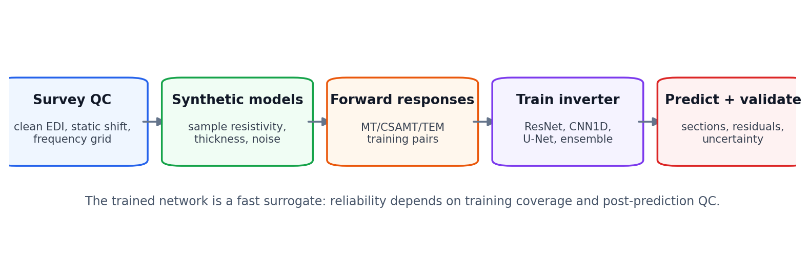
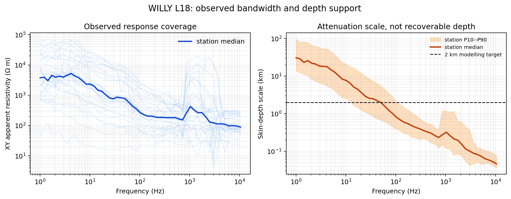
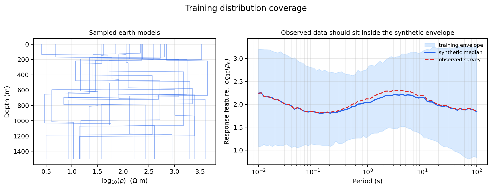
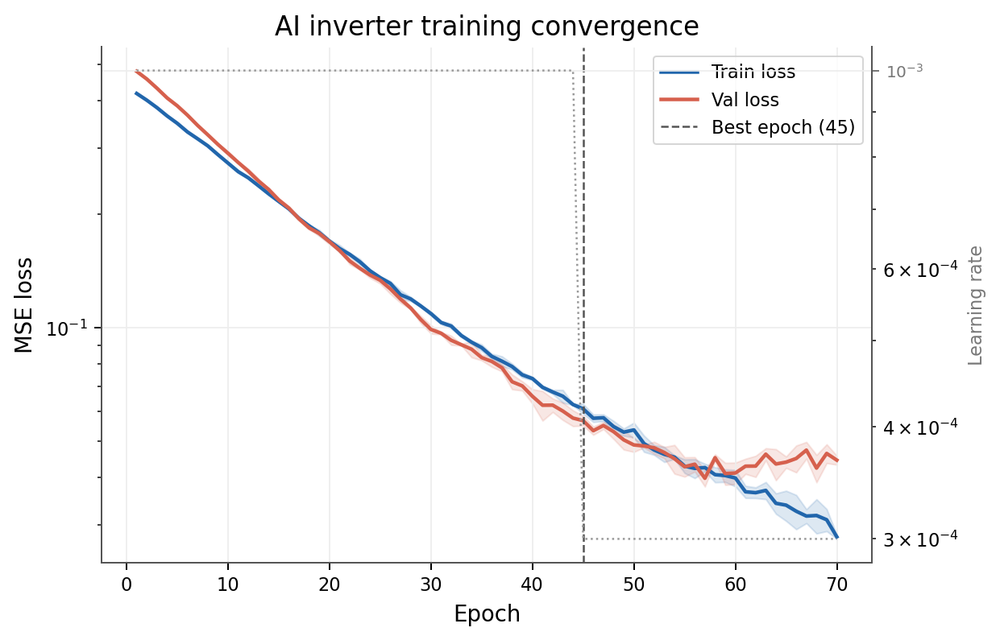
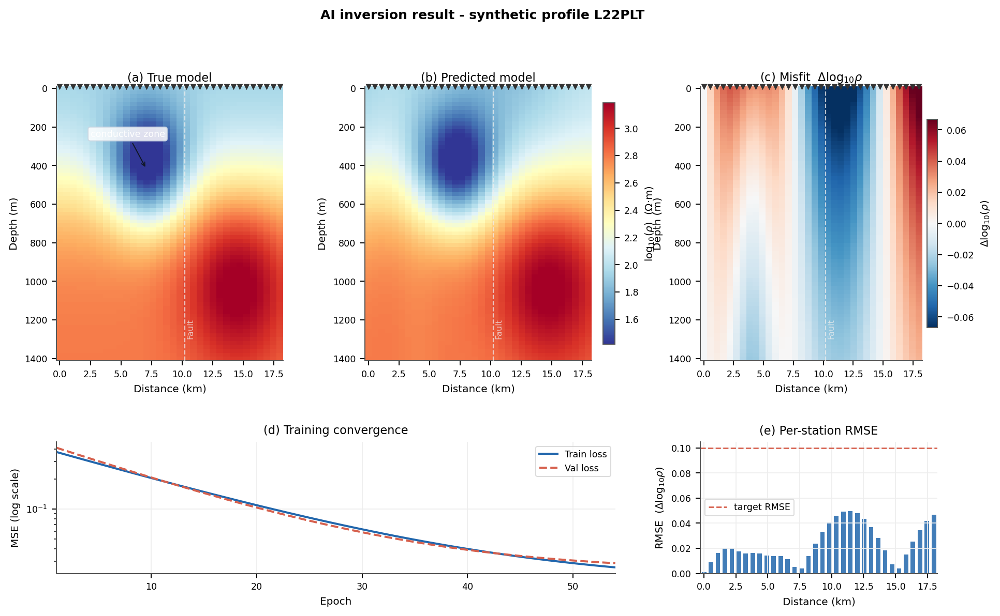
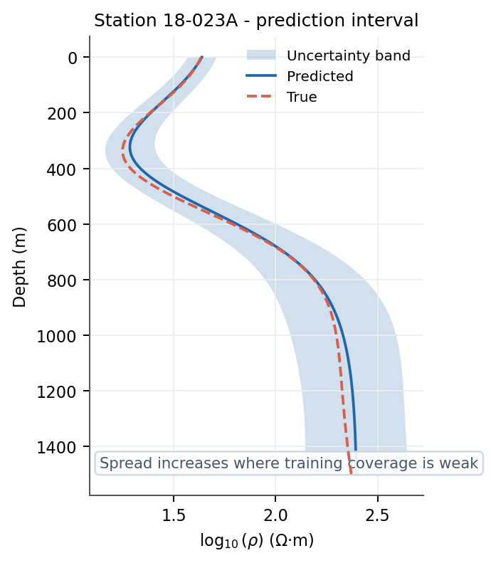

.. _ai_inversion_concepts:

AI inversion concepts
=====================

:term:`AI inversion` estimates an earth model from electromagnetic
observations with a learned or differentiable computational model. In pyCSAMT,
this includes three related approaches:

* :term:`supervised AI inversion`, which learns from synthetic
  response–model pairs;
* :term:`physics-informed inversion`, which optimizes model parameters through
  a differentiable forward-physics loss without labelled earth models;
* :term:`hybrid inversion`, which uses an AI estimate as a starting point or
  :term:`model prior` for subsequent physics-based refinement.

These approaches can make repeated inversion fast, provide useful screening
models, and support uncertainty experiments. They do not remove the
:term:`non-uniqueness` of electromagnetic inversion. Their results remain conditional
on data quality, parameterization, physics, training coverage, regularization,
and validation evidence.

.. admonition:: Core principle
   :class: important

   A neural network does not learn "the subsurface." It learns a relationship
   defined by its inputs, targets, forward simulator, parameter ranges, loss,
   architecture, and training examples. A field prediction is defensible only
   to the extent that this learned relationship represents the survey.

Where AI inversion fits
-----------------------

The principal EM workflow is:

   Forward modeling supplies controlled response–model relationships. AI
   inversion predicts candidate models. Response reconstruction, uncertainty,
   classical baselines, and independent evidence determine whether those
   candidates are suitable for interpretation.

The stages have distinct roles:

Forward modeling
   Predicts observations :math:`\mathbf d` from an earth model
   :math:`\mathbf m` through the :term:`forward operator`
   :math:`\mathbf d=F(\mathbf m)`.

Classical inversion
   Searches for a model by repeatedly evaluating physics and minimizing an
   objective such as data misfit plus regularization.

:term:`Supervised AI inversion`
   Learns an approximation :math:`G_\theta` to the inverse relationship from
   examples and predicts :math:`\hat{\mathbf m}=G_\theta(\mathbf d)`. Training
   pays the repeated optimization cost in advance, so applying the fitted map
   to another compatible observation is an :term:`amortized inversion`.

:term:`Physics-informed inversion`
   Uses differentiable physics during optimization, often minimizing
   :math:`\|F(\mathbf m_\theta)-\mathbf d_{\mathrm{obs}}\|` plus constraints.

Interpretation
   Connects the reviewed resistivity model to geology or hydrogeology. It is
   not part of network prediction and requires additional evidence.

Why EM inversion remains difficult
----------------------------------

Electromagnetic inversion is nonlinear and ill posed. Different resistivity
models can produce responses that are indistinguishable within measurement
error. Sensitivity changes with period, depth, component, geometry, and
conductivity structure. Finite bandwidth limits depth resolution, while noise,
distortion, source effects, and dimensionality violations introduce additional
ambiguity.

Classical inversion manages this with regularization, error models, starting
models, constraints, and model appraisal. Supervised AI manages it implicitly
through the :term:`training distribution`, target representation, loss,
architecture, and data augmentation. Those choices are forms of prior
information even when they are not called regularization.

Consequently:

* a single response need not have a single correct target model;
* a low supervised test error can coexist with field failure;
* a smooth prediction may reflect training targets rather than geology;
* network confidence can be high outside the supported domain;
* fast inference changes computational cost, not physical information content.

Three AI inversion families
---------------------------

Supervised surrogate inversion
~~~~~~~~~~~~~~~~~~~~~~~~~~~~~~

The supervised workflow samples earth models from a chosen
:term:`model prior`, calculates synthetic responses, and fits a network to
recover the sampled parameters. If :math:`p(\mathbf m)` is the model-sampling
law and :math:`p(\boldsymbol\epsilon\mid\mathbf m)` describes the
:term:`noise model`, each training pair is generated as

.. math::
   :label: eq-ai-training-pair

   \mathbf d_i = F(\mathbf m_i) + \boldsymbol\epsilon_i,
   \qquad
   \mathbf m_i \sim p(\mathbf m).

The learned map :math:`G_\theta` is therefore tied to the sampled
resistivities, thicknesses, geometry, frequency grid, components, and noise
that produced those pairs. pyCSAMT provides:

* :class:`pycsamt.ai.inversion.EMInverter1D`;
* :class:`pycsamt.ai.inversion.EMInverter2D`;
* :class:`pycsamt.ai.inversion.GCNInverter3D`;
* :class:`pycsamt.ai.inversion.JointInverter`;
* :class:`pycsamt.ai.inversion.EnsembleInverter`.

Advantages include rapid inference after training, consistent execution across
many stations, and direct access to synthetic ground truth during development.
The principal risk is the simulation-to-field domain gap.

Physics-informed inversion
~~~~~~~~~~~~~~~~~~~~~~~~~~

pyCSAMT exposes:

* :class:`pycsamt.ai.inversion.PINNInverter1D`;
* :class:`pycsamt.ai.inversion.PINNInverter2D`;
* :class:`pycsamt.ai.inversion.PINNInverter3D`.

These approaches optimize through a physics loss and do not require labelled
training models in the same way as supervised inversion. A network or
differentiable parameterization :math:`\mathbf m_\theta` is adjusted until its
forward response resembles the observation. They still depend on the selected
:term:`forward operator`, model parameterization, regularization weights,
boundary assumptions, optimizer, and stopping rule. "Physics-informed" does
not mean exact physics or unique recovery.

Hybrid inversion
~~~~~~~~~~~~~~~~

pyCSAMT provides:

* :class:`pycsamt.ai.inversion.HybridInverter1D`;
* :class:`pycsamt.ai.inversion.HybridInverter2D`;
* :class:`pycsamt.ai.inversion.HybridInverter3D`.

:term:`Hybrid inversion` combines learned speed with physics-based correction. For
example, an AI result can initialize an iterative refinement. This can reduce
runtime or starting-model sensitivity, but refinement cannot rescue an
incompatible parameterization or missing physics automatically.

Choosing 1-D, 2-D, or 3-D
-------------------------

Dimension describes the model and information-sharing assumption, not merely
the shape of an output array.

.. list-table::
   :header-rows: 1
   :widths: 15 27 27 31

   * - Level
     - Representation
     - Appropriate context
     - Principal risk
   * - 1-D
     - One layered model per sounding.
     - Locally layered earth, sparse surveys, rapid station screening, or a
       baseline before higher-dimensional analysis.
     - Lateral structure is mapped into misleading layer parameters.
   * - 2-D
     - A depth–station section predicted from an ordered profile panel.
     - A line survey whose strike and dimensionality evidence support a 2-D
       approximation.
     - A tiled 1-D training set, a genuine 2-D Maxwell training set, and a
       classical 2-D field inversion are treated as interchangeable.
   * - Graph 3-D
     - Layered station parameters share information through a spatial graph.
     - Multi-line or areal surveys with reviewed coordinates and meaningful
       neighborhood relationships.
     - Graph context, genuine 3-D training physics, and a classical 3-D field
       inversion are presented as though they were the same operation.

:class:`~pycsamt.ai.inversion.GCNInverter3D` is graph-context inversion. It
predicts layered parameters at spatial stations and shares information through
adjacency. With ``Inv3DAgent(physics="mt1d")``, its responses remain tiled
layered-earth simulations. With ``physics="mt3d"``, correlated 3-D volumes are
solved by :class:`~pycsamt.forward.maxwell.mt3d.MT3DAdapter` before training,
so lateral and vertical conductivity contrasts enter the same forward solve.
The inverse architecture remains a GCN in both cases; training with 3-D physics
does not turn it into an iterative ModEM field inversion or validate an
arbitrary field prediction.

Select dimension using :term:`strike`, :term:`dimensionality`,
:term:`tipper` behavior, :term:`survey geometry`, target geometry, station
spacing, and classical response evidence—not because a higher number sounds
more advanced.

Depth support is not the model depth
------------------------------------

An AMT frequency band does not define a sharp maximum depth. For a uniform
earth, the :term:`skin depth` gives the electromagnetic attenuation scale

.. math::
   :label: eq-ai-concepts-skin-depth

   \delta(f,\rho) = \sqrt{\frac{2\rho}{\mu_0\,2\pi f}}
   \simeq 503\sqrt{\frac{\rho}{f}}\ \mathrm{m},

where :math:`f` is frequency in hertz, :math:`\rho` is resistivity in ohm
metres, and :math:`\mu_0` is the free-space magnetic permeability. Equation
:eq:`eq-ai-concepts-skin-depth` describes attenuation in a homogeneous conductor. It is
not a :term:`depth of investigation`, a vertical-resolution estimate, or
permission to train an inverter to that depth. In a layered earth, conductive
cover can screen deeper structure, resistive material can inflate the scale,
and sensitivity decays gradually rather than stopping at :math:`\delta`.

The bundled WILLY L18 profile makes the difference concrete. The following
diagnostic reads all 28 stations and deliberately computes only a skin-depth
scale from the observed XY apparent resistivity. It does not invert the data.

.. code-block:: pycon

   >>> import numpy as np
   >>> from pycsamt.emtools._core import ensure_sites
   >>> from pycsamt.ai.inversion import sites_to_obs_1d

   >>> sites = ensure_sites(
   ...     "data/AMT/WILLY_data/L18PLT", recursive=True, verbose=0
   ... )
   >>> obs = sites_to_obs_1d(sites, comp="xy")
   >>> frequency_hz = np.asarray(obs[0].freq)
   >>> rho_a = np.vstack([item.rho_obs for item in obs])
   >>> rho_median = np.nanmedian(rho_a, axis=0)
   >>> delta_m = 503.0 * np.sqrt(rho_median / frequency_hz)
   >>> print(f"stations={len(obs)}, frequencies={frequency_hz.size}")
   stations=28, frequencies=53
   >>> print(f"frequency range={frequency_hz.min():.3f}--{frequency_hz.max():.0f} Hz")
   frequency range=1.008--10400 Hz
   >>> i = int(np.nanargmin(frequency_hz))
   >>> print(f"lowest-frequency skin-depth scale={delta_m[i] / 1000:.1f} km")
   lowest-frequency skin-depth scale=30.7 km

   The left panel shows the actual XY apparent-resistivity curves and their
   station median. The right panel translates them through equation
   :eq:`eq-ai-concepts-skin-depth`; the broad band is variation among stations, not an
   uncertainty interval. The 2 km line is a conservative modelling target,
   not a boundary inferred from the crossing.

The 30.7 km value is therefore a warning against equating penetration with
resolution. For an expected target shallower than 2 km, set the synthetic
model bottom somewhat below the target so boundary conditions do not control
it, but report interpretation only where response sensitivity, perturbation or
Jacobian tests, recovery experiments, error-aware forward reconstruction, and
independent evidence agree. Training labels below that supported interval
teach the network a prior; the field data do not turn those labels into
observations.

Model parameterization
----------------------

The network can only recover parameters represented in its output.

Layered 1-D target
~~~~~~~~~~~~~~~~~~

A common :term:`target vector` contains ``n_layers`` resistivities and
``n_layers - 1`` thicknesses:

.. code-block:: text

   y = [log10(rho_1), ..., log10(rho_L),
        log10(h_1), ..., log10(h_(L-1))]

Resistivity is commonly expressed in ohm metres and thickness in metres before
the base-10 logarithm is taken. With :math:`L` layers, the target dimension is
:math:`2L-1` because the bottom :term:`half-space` has no thickness. Inverting
the transformed output returns
:math:`\rho_\ell=10^{y_\ell}` and :math:`h_\ell=10^{y_{L+\ell}}`.
Increasing layer count increases flexibility but also ambiguity and training
difficulty.

Fixed-grid 2-D target
~~~~~~~~~~~~~~~~~~~~~

A profile inverter may predict ``log10(rho)`` on a fixed
``(n_depth, n_stations)`` grid. Depth discretization is then part of the model
prior. A visually sharp boundary cannot be more resolved than the information
in the responses and training examples. pyCSAMT's 2-D U-Net can be trained
either on a :term:`pseudo-2-D training model` made by tiling independent 1-D
responses or on :term:`2-D Maxwell training model` realizations containing
lateral TE coupling. Both produce the same target-array shape; the shape alone
does not disclose which physics generated it. Preserve ``physics``, solver
identity, mesh controls, components, and spatial correlation parameters with
the checkpoint.

Graph target
~~~~~~~~~~~~

Graph inversion commonly predicts the layered target at every station. A
later volume or depth slice interpolates these predictions spatially. Separate
network output, graph smoothing, and post-prediction gridding in reports.

For genuine MT3D training, the resistivity label at station :math:`s` is the
vertical column sampled from the same realization :math:`r` that generated its
response,

.. math::
   :label: eq-ai-concepts-graph-column-target

   y_{r,s,k}
   =\log_{10}\rho_r
     \left(x_{j(s)},y_{q(s)},z_{p(k)}\right),

where :math:`j(s)` and :math:`q(s)` select the nearest geology-grid column and
:math:`p(k)` maps the requested output layer to a geology-grid depth. Equation
:eq:`eq-ai-concepts-graph-column-target` is a nearest-cell sampling contract;
it does not create finer geological information when the output grid contains
more layers than the training geology grid.

Three grids in a 3-D AI workflow
~~~~~~~~~~~~~~~~~~~~~~~~~~~~~~~~

A robust 3-D workflow keeps three discretizations distinct:

Geology grid
   Stores the sampled true resistivity volume and defines the spatial support
   of interfaces, correlations, or bodies. In the built-in dataset generator,
   this is a comparatively coarse :class:`~pycsamt.ai.geology.GeologyGrid`.

Solver mesh
   Discretizes Maxwell's equations. It may add fine core cells and geometrically
   growing padding around the geology domain. The current research MT3D path
   supports a non-uniform tensor mesh, so physical extent and local resolution
   need not be forced into one uniform cell size.

Inverse-output grid
   Contains the station-layer values predicted by the GCN. It is fixed by
   station coordinates, ``n_layers``, and ``depth_max``; spatial interpolation
   into a display volume occurs only afterward.

Let :math:`P_{g\rightarrow s}` map geology-cell conductivity to the solver
mesh, :math:`F_s` denote the discrete Maxwell solve, and
:math:`P_{g\rightarrow o}` sample geology columns onto the inverse-output
layers. One supervised realization is therefore

.. math::
   :label: eq-ai-concepts-three-grid-chain

   \mathbf d_r
   =F_s\!\left(P_{g\rightarrow s}\boldsymbol\sigma_r\right),
   \qquad
   \mathbf y_r
   =P_{g\rightarrow o}\log_{10}\boldsymbol\rho_r.

The two mappings in equation :eq:`eq-ai-concepts-three-grid-chain` serve
different purposes and must be preserved in provenance. Treating a padded
solver mesh as though it were the geological truth changes labels; treating an
interpolated output volume as though it were directly solved invents spatial
resolution.

Topography adds another boundary decision. A terrain-draped section may use
measured elevation only to transform depth below ground into an absolute
vertical coordinate. Terrain affects physics only when earth, air, receivers,
and conductivity are mapped consistently onto a solver that supports that
topographic contract. The current ``Inv3DAgent`` records
``affects_forward_physics=False`` for its draped output.

Parameterization decisions include:

* linear versus logarithmic variables;
* bounds and probability distributions;
* number and thickness of layers or depth cells;
* fixed versus predicted interfaces;
* anisotropy or isotropy;
* components and modes represented;
* topography, source, and distortion parameters;
* whether properties vary independently or through geological rules.

Data representation
-------------------

The input representation determines what the network can use. In pyCSAMT this
is the :term:`feature vector` or matrix handed to the learned model.

Possible features include:

* log10 apparent resistivity;
* phase;
* real and imaginary impedance components;
* TE/TM or tensor-component combinations;
* TDEM decay values;
* frequency or period coordinates;
* masks, errors, and quality indicators;
* station coordinates or adjacency.

The same observed data can yield different learned problems depending on
feature choice. Apparent resistivity and phase are derived from impedance;
treating all of them as independent channels can duplicate information.

pyCSAMT provides public bridge utilities rather than requiring invented field
feature helpers:

* :class:`pycsamt.ai.inversion.SiteObs1D` and
  :class:`pycsamt.ai.inversion.SiteObs2D`;
* :func:`pycsamt.ai.inversion.sites_to_obs_1d`;
* :func:`pycsamt.ai.inversion.sites_to_obs_2d`;
* :func:`pycsamt.ai.inversion.sites_to_features_1d`;
* :func:`pycsamt.ai.inversion.sites_to_panel_2d`;
* :func:`pycsamt.ai.inversion.sites_to_coords_3d`;
* :func:`pycsamt.ai.inversion.obs_to_features_1d`.

These utilities help enforce the contract between :class:`pycsamt.site.Sites`
and AI arrays. Their outputs still need review for station order, component,
frequency coverage, masking, and finite values.

For the 1-D bridge, the common grid contains :math:`n_f` logarithmically
spaced frequencies between either the observed extrema or explicit
``freq_min`` and ``freq_max``. At each station, interpolation is linear in
log-frequency; log apparent resistivity and phase are interpolated separately,

.. math::
   :label: eq-ai-feature-interpolation

   x_{s,q} =
   \begin{cases}
   \mathcal I_{\log f}\!\left[\log_{10}\rho_{a,s}\right](f_q),
      &0\le q<n_f,\\
   \mathcal I_{\log f}\!\left[\phi_s\right](f_{q-n_f}),
      &n_f\le q<2n_f,
   \end{cases}

where :math:`s` identifies the station and :math:`\mathcal I_{\log f}` is
piecewise-linear interpolation on :math:`\log_{10}f`. Values outside a
station's own measured interval are ``NaN`` rather than extrapolated. Thus a
grid lying inside the survey-wide range can still contain missing values for
stations with narrower coverage. ``sites_to_features_1d`` preserves those
``NaN`` values, while ``obs_to_features_1d`` currently replaces missing log
resistivity by 2 and missing phase by 45 degrees. These two helpers are not
semantically interchangeable merely because their returned shapes match.

The feature contract
--------------------

The :term:`feature contract` is the reproducibility boundary between a
checkpoint and the data sent into it. Training and inference must use the same:

* feature names and order;
* units and transformations;
* frequency or period grid;
* component convention;
* interpolation method;
* missing-value and mask behavior;
* normalization statistics;
* station ordering and padding policy;
* coordinate units and adjacency rules.

A checkpoint without its feature contract is incomplete. A matrix with the
right shape but wrong channel order can produce plausible yet meaningless
predictions.

Training distribution as prior
------------------------------

The :term:`training distribution` defines which earth structures the network
expects. It therefore acts as an implicit prior.

   Field responses outside the synthetic envelope require extrapolation.
   Network behavior there is not validated by ordinary held-out synthetic
   performance.

Design choices include:

Geology
   Resistivity ranges, layer counts, thicknesses, correlations, interfaces,
   faults, lateral structures, anisotropy, and rare targets. The built-in 3-D
   Maxwell dataset currently samples correlated Gaussian volumes; explicit
   layers, lenses, contacts, and multiple-body families require an externally
   assembled geology corpus. More realizations of one family do not broaden
   that family.

Survey
   Frequency range, sampling density, station count, spacing, line layout,
   components, source geometry, and coordinate uncertainty.

Noise and nuisance effects
   Heteroscedastic errors, missing bands, outliers, static shift, source
   effects, cultural noise, distortion, and processing variability.

Physics
   Forward solver, dimensionality, boundary conditions, mesh accuracy, and
   approximations. Record the exact backend: the research-scale in-process
   ``MT3DAdapter`` and the compiled production ``ModEm3DAdapter`` solve the
   same governing physics under different numerical and capability contracts.

Class balance
   Frequency of common backgrounds versus rare conductive or resistive targets.

Sampling parameters independently from broad uniform ranges is convenient but
may create geologically impossible examples. Conversely, an overly narrow
geological generator can produce excellent test metrics and poor field
coverage.

Simulation-to-field domain gap
------------------------------

The :term:`domain gap` is the difference between synthetic training examples
and field observations. Sources include:

* incomplete forward physics;
* wrong dimensionality;
* underestimated noise and missing data;
* static shift and galvanic distortion;
* source and near-field effects;
* topography and anisotropy;
* coordinate and instrument errors;
* processing differences;
* geology outside sampled priors.

Good synthetic validation does not measure this gap. Diagnose it by comparing
feature distributions, response envelopes, residual patterns, classical
inversions, and independent field evidence. Fine-tuning on field labels can
help only when trustworthy labels exist and leakage is controlled.

Supervised learning objective
-----------------------------

A supervised inverter minimizes a :term:`model-space metric` over examples:

.. math::
   :label: eq-ai-model-loss

   \mathcal L_{\mathrm{model}}(\theta)
   = \frac{1}{N}\sum_i
   \ell\!\left(G_\theta(\mathbf d_i),\mathbf m_i\right).

Equation :eq:`eq-ai-model-loss` rewards resemblance to the selected synthetic
target, but does not guarantee that the predicted model reconstructs the field
response. A stronger workflow also evaluates a :term:`response-space metric`:

.. math::
   :label: eq-ai-data-loss

   \mathcal L_{\mathrm{data}}
   = \left\|\mathbf W_d
     \left(F(\hat{\mathbf m})-\mathbf d_{\mathrm{obs}}\right)\right\|_2^2.

In equation :eq:`eq-ai-data-loss`, :math:`\mathbf W_d` is usually built from
data standard deviations or
quality weights, so high-uncertainty observations carry less influence than
well-constrained ones. The forward operator, error weights, components, and
residual space must be stated. An unweighted :term:`RMS misfit` of log
:term:`apparent resistivity` is not equivalent to a full complex-impedance
likelihood.

Physics-informed objective
--------------------------

A PINN-style objective can combine data fit and regularization:

.. math::
   :label: eq-ai-concepts-pinn-objective

   \mathcal L(\theta)
   = \mathcal L_{\mathrm{data}}(\theta)
   + \lambda_v\mathcal R_v(\mathbf m_\theta)
   + \lambda_l\mathcal R_l(\mathbf m_\theta)
   + \lambda_g\mathcal R_g(\mathbf m_\theta),

In equation :eq:`eq-ai-concepts-pinn-objective`, vertical, lateral, or graph
regularizers apply according to dimension.
The weights determine the balance between fit and structure. They must be
treated as inversion parameters and tested, not hidden as neural-network
details.

Architectures encode assumptions
--------------------------------

Fully connected network
   Treats the feature vector globally. It is simple but does not explicitly
   encode local frequency structure.

1-D convolution
   Learns local patterns along an ordered feature or frequency axis. Channel
   arrangement and padding affect meaning.

Residual network
   Uses skip connections to train deeper transformations and often provides a
   strong station-level baseline.

U-Net
   Combines local convolution and multiscale skip connections for profile
   panels. Its receptive field encourages lateral continuity. The network is
   not itself a classical 2-D EM solver, although its synthetic training
   responses may now be generated with the 2-D Maxwell adapter rather than
   tiled 1-D columns.

Graph convolutional network
   Propagates information along an adjacency graph. Radius, coordinate system,
   normalization, and graph connectivity become inversion assumptions. The
   graph architecture determines information sharing; ``physics="mt1d"`` or
   ``physics="mt3d"`` determines how supervised responses were generated.

Architecture comparison is valid only when datasets, splits, preprocessing,
target scale, training budget, and selection procedure are controlled.

Training, validation, and test separation
-----------------------------------------

Use distinct roles:

Training set
   Updates network parameters.

Validation set
   Selects epochs, hyperparameters, and checkpoints.

Calibration set
   Fits conformal or posterior calibration without changing the base network.

Synthetic test set
   Estimates final performance on unseen synthetic cases.

Field validation set
   Tests transfer using observations or independent constraints not used in
   training, tuning, or calibration.

Random row splitting can leak nearly identical models or profiles across sets.
Prefer group splitting by geological scenario, profile family, random generator
seed, or survey realization. For spatial field data, nearby stations are not
independent test samples when the model shares spatial information.

   Training loss measures optimization on seen examples. Validation divergence
   can indicate overfitting, but parallel curves do not prove field transfer.

Evaluation hierarchy
--------------------

Evaluate at several levels:

:term:`Model-space metrics <Model-space metric>`
   Error in log resistivity, thickness, boundary depth, or complete sections on
   synthetic cases with known truth.

:term:`Response-space metrics <Response-space metric>`
   Difference between observed responses and responses recomputed from the
   prediction. The reconstruction must match the claimed dimensionality: an
   MT1D response computed independently at each station is a useful screen but
   is not a coupled 3-D response validation.

Structural metrics
   Boundary location, anomaly continuity, target detection, volume overlap, or
   graph consistency where scientifically relevant.

Calibration metrics
   Interval coverage, reliability, and sharpness on held-out calibration/test
   data.

:term:`Out-of-distribution diagnostics <Out-of-distribution diagnostic>`
   Distance or coverage relative to synthetic inputs and latent
   representations.

Field baselines
   Bostick-style transforms, classical 1-D/2-D/3-D inversion, boreholes,
   mapped geology, and other geophysics.

Decision metrics
   Whether target ranking, boundary depth, or classification remains correct
   under accepted uncertainty and scenarios.

No single metric is sufficient. A low model-space error can hide response
mismatch, and a low response residual can correspond to the wrong model because
the inverse problem is non-unique.

   Review predictions together with coverage, response reconstruction,
   residuals, uncertainty, and classical or geological evidence.

Uncertainty concepts
--------------------

Useful distinctions are:

:term:`Aleatoric uncertainty`
   Variation associated with observation noise or irreducible ambiguity.

:term:`Epistemic uncertainty`
   Uncertainty in learned parameters due to finite or incomplete training data.

:term:`Distributional uncertainty`
   Risk that the field input comes from a different distribution than training.

Inverse non-uniqueness
   Multiple earth models fit the observations. A deterministic network can
   collapse these possibilities into one conditional estimate.

:term:`Structural uncertainty`
   Wrong dimension, parameterization, forward physics, architecture, or
   geological assumptions.

pyCSAMT exposes :class:`pycsamt.ai.inversion.EnsembleInverter`,
:class:`pycsamt.ai.inversion.ConformalPredictor`,
:class:`pycsamt.ai.inversion.PosteriorCalibrator`, and MC-dropout prediction for
the graph inverter. Each covers only part of this taxonomy.

   Predictive spread should be interpreted conditionally on the ensemble,
   calibration set, or dropout model that produced it.

Conformal coverage applies under :term:`exchangeability` assumptions between
calibration and future examples. Synthetic calibration does not guarantee the
same coverage on shifted field data. Narrow intervals can be confidently
wrong when structural uncertainty is omitted.

Configuration objects
---------------------

:class:`pycsamt.ai.inversion.InversionConfig` describes an AI inverter, while
:class:`pycsamt.ai.inversion.RunConfig` coordinates dataset and training
configuration. Configuration-first work is preferable to undocumented notebook
state:

.. code-block:: pycon

   >>> from pycsamt.ai.inversion import RunConfig

   >>> _ = RunConfig.write_template("ai_inversion.py")
   >>> config = RunConfig.from_file("ai_inversion.py")
   >>> config.validate()
   >>> print(config.summary())
   RunConfig

     ForwardConfig
       solver               = 'mt1d'
       freq_min             = 0.0001 Hz
       freq_max             = 1e+04 Hz
       n_freqs              = 30
       n_layers             = 3–7
       rho_min              = 1 Ω·m
       rho_max              = 1e+04 Ω·m
       depth_max            = 2e+03 m
       n_samples            = 10,000
       noise_level          = 0.05  (gaussian)
       seed                 = None
       n_jobs               = 1
       output               = ./forward_dataset.npz

     InversionConfig
       ── Architecture ──
       arch                   = 'resnet'
       n_layers               = 5
       solver                 = 'mt1d'
       device                 = None  (None → auto)
       include_phase          = yes
       log_thickness          = yes
       augment_noise          = 0.02
       ── Training ──
       epochs                 = 100
       batch_size             = 256
       lr                     = 0.001
       weight_decay           = 1e-05
       patience               = 20  (min_delta=1e-05)
       val_frac               = 0.1
       grad_clip              = 1.0
       seed                   = None
       ── Checkpointing ──
       checkpoint             = checkpoints\em_inverter.npz
       save_best              = True

Validation checks internal configuration consistency. It cannot establish that
the selected ranges, noise, physics, or architecture represent a particular
field survey. Template files are written and read as UTF-8 so the scientific
units and comments above round-trip consistently across operating systems.

The Sites bridge
----------------

Use the canonical loader and public bridge utilities:

.. code-block:: pycon

   >>> from pycsamt.emtools._core import ensure_sites
   >>> from pycsamt.ai.inversion import (
   ...     sites_to_features_1d,
   ...     sites_to_obs_1d,
   ... )

   >>> sites = ensure_sites(
   ...     "data/AMT/WILLY_data/L18PLT",
   ...     recursive=True,
   ...     verbose=0,
   ... )

   >>> observations = sites_to_obs_1d(sites)
   >>> X, frequencies_hz, station_names = sites_to_features_1d(
   ...     sites,
   ...     comp="xy",
   ...     n_freqs=32,
   ... )
   >>> type(observations).__name__, len(observations)
   ('list', 28)
   >>> X.shape, frequencies_hz.shape, len(station_names)
   ((28, 64), (32,), 28)
   >>> station_names[:3]
   ['18-001A', '18-002U', '18-003A']

Before using these arrays, inspect their documented return type and shape in
the installed version, station names, frequency grid, components, and missing
data. Do not invent a feature helper whose transformation differs from the
checkpoint contract.

Agents and automation
---------------------

The agents described in :doc:`agents` orchestrate standard workflows around
the lower-level objects. They are useful for screening and repeatable task
execution, but their defaults encode specific synthetic-data and diagnostic
choices. A successful :class:`pycsamt.agents.AgentResult` means the programmed
workflow completed; it is not a scientific acceptance decision.

Optional LLM text is separate from numerical inversion. It may summarize
structured outputs, but it does not alter the recovered model and must be
reviewed before reporting.

Pretrained checkpoints
----------------------

A checkpoint is usable only with its full model contract:

* architecture and layer/depth parameterization;
* solver and method;
* feature order, units, frequency grid, and normalization;
* training priors and noise distribution;
* dataset split and performance metrics;
* software/backend version;
* checkpoint checksum and model-card limitations.

Registry metadata can be inspected through
:func:`pycsamt.ai._zoo.list_pretrained` or
:class:`pycsamt.agents.ModelZooAgent`. Checkpoint availability is separate
from registry availability. Never claim pretrained inference if execution
silently fell back to new training.

Reproducibility and provenance
------------------------------

A reproducible AI inversion record includes:

.. code-block:: text

   ai_inversion_run/
   ├── manifest.yml
   ├── environment/
   │   └── dependencies.txt
   ├── configuration/
   │   ├── dataset.yml
   │   ├── model.yml
   │   └── training.yml
   ├── datasets/
   │   ├── metadata.json
   │   └── split_indices.npz
   ├── checkpoints/
   │   ├── best_model.*
   │   └── checksums.sha256
   ├── predictions/
   │   ├── field_predictions.npz
   │   └── station_order.csv
   ├── diagnostics/
   │   ├── training_history.csv
   │   ├── response_residuals.csv
   │   └── coverage_report.csv
   ├── figures/
   └── review/
       └── model_card.md

Record random seeds, backend, hardware, precision, preprocessing code, dataset
generator version, station ordering, graph construction, model selection, and
all failed or excluded cases. A checkpoint alone is not reproducible.

Scientific acceptance framework
-------------------------------

Before field interpretation, confirm:

.. list-table::
   :header-rows: 1
   :widths: 30 70

   * - Question
     - Required evidence
   * - Is the dimension defensible?
     - Strike, tensor, tipper, survey geometry, and classical diagnostics.
   * - Is the parameterization adequate?
     - Target depth, expected structures, layer/grid resolution, and bounds.
   * - Is the feature contract exact?
     - Channel order, units, grid, masks, normalization, and station order.
   * - Does training cover the field?
     - Response envelopes, parameter support, nuisance effects, and explicit
       out-of-distribution tests.
   * - Was evaluation independent?
     - Leakage-resistant training, validation, calibration, synthetic test,
       and field-validation roles.
   * - Does the model reconstruct data?
     - Forward responses, error-aware residuals, station/frequency/component
       patterns, and failure cases.
   * - Is uncertainty calibrated?
     - Coverage and sharpness on appropriate held-out data plus distributional
       and structural limitations.
   * - Do baselines agree?
     - Classical inversion and independent geological or borehole evidence,
       with mismatches reported.
   * - Is the result reproducible?
     - Dataset, configuration, code, environment, checkpoint, checksum,
       predictions, and review record.

Common conceptual mistakes
--------------------------

Avoid these misunderstandings:

* assuming synthetic ground truth is the unique inverse solution;
* treating a neural network as free of regularization or prior assumptions;
* equating training interpolation with field generalization;
* selecting 2-D or 3-D solely for visual sophistication;
* inferring forward physics from the U-Net output shape instead of recording
  whether training used tiled 1-D or 2-D Maxwell responses;
* calling a graph-smoothed result genuine 3-D without recording whether its
  training physics was ``mt1d`` or ``mt3d``;
* treating geology-grid cells, padded Maxwell cells, and predicted output
  layers as one interchangeable grid;
* describing an MT1D station-column reconstruction as validation of a coupled
  3-D field response;
* assuming the current MT3D agent path automatically selects the compiled
  ModEM backend;
* checking array shape but not feature semantics;
* using random splits that leak related synthetic profiles;
* selecting a checkpoint on the test set;
* reporting model-space error without response reconstruction;
* interpreting dropout or ensemble spread as total uncertainty;
* assuming physics-informed optimization eliminates non-uniqueness;
* treating fast prediction as increased depth resolution;
* using an undocumented pretrained checkpoint;
* accepting an automated or LLM narrative as geological validation.

Next steps
----------

Continue in this order:

* :doc:`data_preparation` to define synthetic and field data contracts;
* :doc:`model_selection` to choose dimension and architecture;
* :doc:`training` to fit and preserve a model correctly;
* :doc:`validation` to establish acceptance evidence;
* :doc:`inference` to apply an approved checkpoint;
* :doc:`uncertainty` to assess predictive calibration and domain shift;
* :doc:`hybrid` for AI warm-start plus physics refinement;
* :doc:`pinn_2d` for physics-informed profile inversion;
* :doc:`agents` for standard orchestration;
* :doc:`reporting` for model cards and release packages.

For the numerical boundary behind the 3-D concepts, continue with
:doc:`../forward/solvers_and_grids`, :doc:`../../theory/maxwell_forward`, and
:doc:`../models/modem`.

Documentation figures
---------------------

The figures on this page are generated by
``docs/scripts/generate_ai_inversion_figures.py``. They illustrate validation
logic and do not represent a field result or a production training run.
