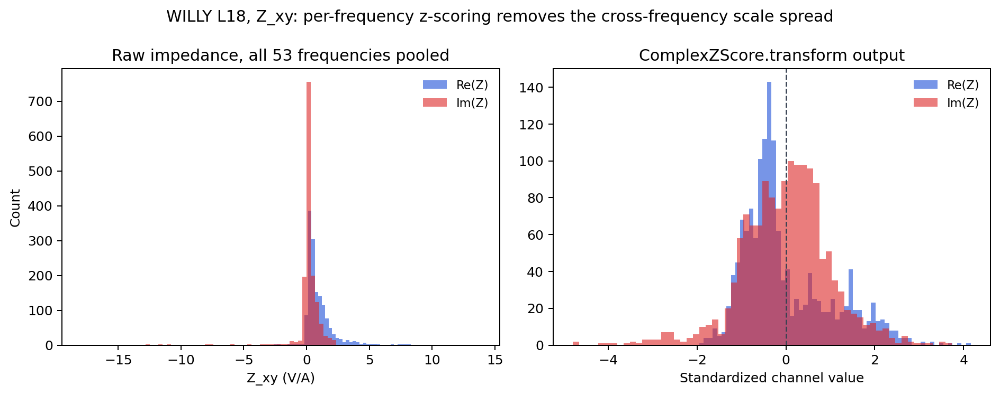

.. _ai_inversion_data_contracts:

Canonical data contracts
=========================

Every stage in :doc:`roadmap`'s package map — a geological prior, a
2-D Maxwell forward solve, an injected noise model, a training loss,
a validation report — needs to agree on what "the data" actually is:
which axis is the station, which is the frequency, whether an entry
is missing or merely zero, and which sign convention the complex
impedance uses. :mod:`pycsamt.ai.data` is where that agreement is
written down once, as code, rather than assumed silently in every
consumer. Its central object,
:class:`~pycsamt.ai.data.contracts.SurveyData` — the shared
vocabulary of :doc:`geology_priors`, :doc:`domain_gap`,
:doc:`dataset2d`, :doc:`dataset3d`, :doc:`losses`, and
:doc:`scientific_validation` —
stores the :term:`impedance tensor` in a fixed ``(station, frequency,
component)`` axis order. That sounds almost too small to matter, but
swapping two axes of the same rank is exactly the kind of error that
produces a runnable, plausible-looking result instead of a crash —
the actual failure mode this contract exists to close off.

Reach for :class:`SurveyData` any time survey observations cross a
function boundary in the AI-inversion stack: converting real EDI
data into training features, generating a synthetic response to
compare against a solver's prediction, or handing a batch of
stations to a loss function. It is not a replacement for
:class:`pycsamt.site.Sites` or the pandas-heavy diagnostics in
:mod:`pycsamt.emtools` — those remain the right tools for exploratory
QC. ``SurveyData`` is deliberately downstream of that: a
dependency-light, NumPy-only, validated array container that every
later numeric stage can trust without re-checking.

Building a survey
------------------

The constructor accepts plain arrays directly, which is the natural
way to build a survey by hand — in a test, in a small worked example,
or from an in-memory synthetic response:

.. code-block:: pycon

   >>> import numpy as np
   >>> from pycsamt.ai.data import SurveyData

   >>> z = np.ones((2, 3, 2), dtype=complex) * (1 + 2j)
   >>> survey = SurveyData(
   ...     impedance=z,
   ...     frequencies_hz=[100.0, 10.0, 1.0],
   ...     station_names=["S01", "S02"],
   ...     components=["xy", "yx"],
   ...     coordinates_m=[[0.0, 0.0], [100.0, 0.0]],
   ...     crs="EPSG:32630",
   ... )
   >>> survey.shape
   (2, 3, 2)
   >>> survey.frequency_order
   'descending'

A two-column ``coordinates_m`` is accepted and silently expanded with
an unknown (``NaN``) elevation column, so callers who genuinely have
no elevation are not forced to invent one.

Optional tipper data follow a separate but equally explicit contract:
``tipper``, ``tipper_error``, and ``tipper_valid`` have shape
``(station, frequency, 2)``, with the last axis ordered as :math:`T_x,T_y`.
Tipper errors or masks cannot be supplied without tipper values. As with
impedance, non-finite values and non-positive declared errors invalidate an
observation; they are never converted into zero induction arrows. Keeping
tipper outside the impedance component axis prevents a four-component tensor
from being confused with two magnetic transfer functions.

Real field data rarely arrives already shaped this way. The practical
entry point is
:func:`pycsamt.ai.domain_gap.survey_fit.survey_data_from_sites`,
which bridges anything :func:`pycsamt.emtools._core.ensure_sites`
already accepts — a directory of :term:`EDI` files, a loaded
``Sites`` collection, an ``APISurvey`` — into a canonical
``SurveyData``, using the full ``xx, xy, yx, yy`` component set:

.. code-block:: pycon

   >>> from pycsamt.emtools._core import ensure_sites
   >>> from pycsamt.ai.domain_gap import survey_data_from_sites

   >>> sites = ensure_sites(
   ...     "data/AMT/WILLY_data/L18PLT", recursive=True, verbose=0
   ... )
   >>> field = survey_data_from_sites(sites, recursive=False, verbose=0)
   >>> field.shape
   (28, 53, 4)
   >>> field.summary()["coverage"]
   1.0
   >>> field.summary()["frequency_range_hz"]
   [1.008, 10400.0]

This bridge performs no frequency interpolation across stations: if
two stations were sampled on different grids, construction raises
rather than quietly reconciling them, because a survey-matched
frequency selector is a scientific decision this package refuses to
make on a caller's behalf.

Invalid data are never invented
--------------------------------

A field survey always has gaps — a saturated channel, a frequency a
station never recorded, a value flagged during processing. The
:attr:`~pycsamt.ai.data.contracts.SurveyData.valid` mask exists so
that "missing" and "zero" are never confused, and construction
computes it rather than trusting a caller's word alone: an explicitly
supplied mask is combined with a finite-value check and, when errors
are declared, a positive-error check, so a ``NaN`` slipped into the
impedance array cannot silently pass validation:

.. code-block:: pycon

   >>> z = np.array([[[1 + 1j], [complex(np.nan, np.nan)]]])
   >>> s = SurveyData(z, [10, 1], ["S"], ["xy"], [[0, 0]])
   >>> s.n_valid
   1

One observation went in with a ``NaN``, and exactly one came out
valid — the second frequency is now authoritatively unusable rather
than a landmine waiting in a mean or a loss term.
:meth:`~pycsamt.ai.data.contracts.SurveyData.coverage` turns this
mask into a :class:`~pycsamt.ai.data.contracts.SurveyCoverage`
summary along every axis, which is the first thing worth checking
after loading any real survey:

.. math::
   :label: eq-ai-datacontracts-coverage

   C_{\mathrm{all}}=
   \frac{1}{N_sN_fN_c}\sum_{s=1}^{N_s}\sum_{q=1}^{N_f}
   \sum_{c=1}^{N_c}v_{sqc},
   \qquad
   C_s=\frac{1}{N_fN_c}\sum_{q,c}v_{sqc},

where :math:`v_{sqc}\in\{0,1\}` is the authoritative :term:`validity mask`,
and :math:`N_s`, :math:`N_f`, and :math:`N_c` are station, frequency, and
component counts. Frequency and component coverage are the analogous means
over their complementary axes. Equation :eq:`eq-ai-datacontracts-coverage`
counts declared observations, not independent information: four complete
tensor components can still be strongly correlated or physically unsuitable.

.. code-block:: pycon

   >>> coverage = field.coverage()
   >>> round(coverage.overall, 4)
   1.0
   >>> coverage.by_station.min(), coverage.by_station.max()
   (1.0, 1.0)

L18 happens to be unusually complete — every declared observation is
finite and error-bearing, so coverage is exactly ``1.0`` on every
axis. A survey with dropped stations or frequencies, such as the
corrupted ones produced by :doc:`domain_gap`, shows that immediately
in :attr:`~pycsamt.ai.data.contracts.SurveyCoverage.by_station` and
:attr:`~pycsamt.ai.data.contracts.SurveyCoverage.by_frequency` instead
of only in a suspiciously small final sample count.

Convention is part of the data
--------------------------------

An impedance value is meaningless without knowing its Fourier time
convention, physical units, and rotation state, so
:class:`~pycsamt.ai.data.contracts.ImpedanceConvention` records those
explicitly rather than assuming everyone agrees. This is not
decorative: :doc:`roadmap`'s governing 3-D equation
:eq:`eq-ai-roadmap-maxwell` and the 2-D adapter behind it each fix
*one* time convention per solve, and a predicted response built under
``exp(-iwt)`` compared directly against field data stored as
``exp(+iwt)`` produces a response residual that looks like a sign
error in the physics rather than what it actually is — a bookkeeping
mismatch.
:meth:`~pycsamt.ai.data.contracts.SurveyData.assert_compatible` is the
guard that catches this before it reaches a loss or a solver:

.. code-block:: pycon

   >>> from pycsamt.ai.data.contracts import ImpedanceConvention

   >>> a = field.select(stations=[0, 1])
   >>> b = field.select(stations=[2, 3])
   >>> rotated = SurveyData(
   ...     b.impedance, b.frequencies_hz, b.station_names,
   ...     b.components, b.coordinates_m,
   ...     convention=ImpedanceConvention(rotation_deg=15.0),
   ... )
   >>> a.assert_compatible(rotated)
   Traceback (most recent call last):
   ...
   ValueError: survey impedance conventions differ.

``rotated`` is otherwise a perfectly valid survey; the only thing
wrong with it is that its axes were rotated 15 degrees clockwise
without the other survey's axes moving too. Catching that with a
clear error is far preferable to :func:`~pycsamt.ai.data.contracts.merge_surveys`
or :meth:`~pycsamt.ai.data.normalization.ComplexZScore.fit` silently
pooling two surveys whose horizontal axes do not actually point the
same way.

Selecting, subsetting, and merging
------------------------------------

:meth:`~pycsamt.ai.data.contracts.SurveyData.select_names` is the
everyday way to narrow a survey by station name, component, or a
physical frequency band, independent of how frequencies happen to be
stored internally:

.. code-block:: pycon

   >>> subset = field.select_names(
   ...     stations=field.station_names[:4],
   ...     components=["xy", "yx"],
   ...     frequency_min_hz=10.0,
   ...     frequency_max_hz=1000.0,
   ... )
   >>> subset.shape
   (4, 26, 2)
   >>> round(float(subset.frequencies_hz.min()), 2), round(float(subset.frequencies_hz.max()), 2)
   (10.16, 863.9)

The lower-level :meth:`~pycsamt.ai.data.contracts.SurveyData.select`
takes integer positions instead, which matters when composing a
selection from indices computed elsewhere — a station-adjacency
graph's node order, for instance — rather than from names a person
would type.

Going the other way, :func:`~pycsamt.ai.data.contracts.merge_surveys`
concatenates compatible surveys along the station axis, refusing to
proceed unless every survey agrees on frequencies, components, CRS,
and convention first:

.. code-block:: pycon

   >>> from pycsamt.ai.data.contracts import merge_surveys

   >>> merged = merge_surveys([a, b])
   >>> merged.station_names
   ('18-001A', '18-002U', '18-003A', '18-004A')
   >>> merged.shape
   (4, 53, 4)

This is the operation behind combining several acquisition batches or
survey lines into one dataset for training or validation, and it
performs no interpolation, projection, or rotation of its own — those
remain explicit steps a caller must have already completed, precisely
so that a merge cannot quietly average away a real, meaningful
difference between two lines.

Fitting a normalizer once, reusing it everywhere
---------------------------------------------------

Neural networks train far better on standardized inputs, but *how*
that standardization is computed is a scientific choice, not a
mechanical one: fit it on the wrong data and every later prediction
inherits that mistake invisibly.
:class:`~pycsamt.ai.data.normalization.ComplexZScore` standardizes the
real and imaginary impedance channels independently, per frequency
and per component, from training data only, and then stores that
state so validation, test, and field data are transformed with the
exact same numbers rather than refit each time. For one channel
:math:`x_i` (a real or imaginary part) at a fixed frequency and
component, with fitting weight :math:`w_i` — uniformly one per valid
observation, or the inverse-variance :math:`1/\sigma_i^2` from a
declared :attr:`~pycsamt.ai.data.contracts.SurveyData.impedance_error`
when ``weighting="inverse_variance"`` — the fitted statistics and the
standardized value are

.. math::
   :label: eq-ai-datacontracts-zscore

   \bar x = \frac{\sum_i w_i x_i}{\sum_i w_i}, \qquad
   s = \max\!\left(\sqrt{\frac{\sum_i w_i (x_i-\bar x)^2}
       {\sum_i w_i - \mathrm{ddof}}},\ \varepsilon\right), \qquad
   z_i = \frac{x_i-\bar x}{s}.

The :math:`\varepsilon` floor in equation
:eq:`eq-ai-datacontracts-zscore` keeps a channel that happens to be
constant across the training set from producing a division by zero,
and ``ddof`` behaves like NumPy's usual delta-degrees-of-freedom
correction (it must be zero under inverse-variance weighting, where
the weighted second moment already plays that role). Fitting and
applying this to the real L18 survey shows the point of doing it
per frequency rather than once globally:

.. code-block:: pycon

   >>> from pycsamt.ai.data.normalization import ComplexZScore

   >>> state = ComplexZScore.fit(field)
   >>> state.feature_names[:2]
   ('10400Hz:xx:real', '10400Hz:xx:imag')
   >>> state.training_station_count
   28

   >>> features, mask = state.transform(field)
   >>> restored = state.inverse_transform(features, valid=mask)
   >>> observed = mask.all(axis=-1)
   >>> float(np.max(np.abs(restored[observed] - field.impedance[observed])))
   3.580361673049448e-15

   ``Z_xy`` pooled across all 53 frequencies spans about three orders
   of magnitude in the raw data (left) because low-frequency responses
   are physically much larger than high-frequency ones over the same
   layered earth — not because of any instrument fault. Standardizing
   per frequency (right) removes that purely spectral scale spread,
   leaving a distribution a network can actually learn from, while
   :meth:`~pycsamt.ai.data.normalization.ComplexZScore.inverse_transform`
   recovers the original complex values to within floating-point
   error, confirmed above rather than assumed.

That round trip is not a formality. A checkpoint saved without its
exact fitted :class:`ComplexZScore` state is not reproducible: the
same raw impedance would standardize to different numbers under a
normalizer refit on a different survey, silently changing what the
network was actually trained to see. This is one instance of the
broader :term:`Feature contract` this whole package exists to fix in
place.

For training code, keeping values and masks as unrelated arrays is still an
easy way to lose their alignment. ``transform_survey`` binds them in a
:class:`~pycsamt.ai.data.normalization.NormalizedSurvey`, carries propagated
errors when the source survey has them, labels every axis, and records the
:term:`normalization state` hash that produced the features:

.. code-block:: pycon

   >>> normalized = state.transform_survey(field)
   >>> normalized.shape
   (28, 53, 4, 2)
   >>> normalized.n_valid_observations
   5936
   >>> flat, flat_valid = normalized.flatten()
   >>> flat.shape, flat_valid.shape
   ((28, 424), (28, 424))
   >>> normalized.errors is not None
   True
   >>> normalized.state_hash == state.state_hash
   True

The final normalized axis is ``(real, imaginary)``, hence
:math:`424=53\times4\times2`; ``n_valid_observations`` counts complex
impedances once rather than counting both channels. Invalid entries receive a
finite fill value for numerical execution, but ``flat_valid`` remains the
authority for excluding them from a loss. A fill value of zero means “the
training mean after normalization,” not “measured zero impedance,” and must
never be used without its mask.

If :math:`\sigma_{Z,sqc}` is the declared absolute complex-impedance error and
:math:`a\in\{\Re,\Im\}` identifies the channel, error propagation uses

.. math::
   :label: eq-ai-datacontracts-normalized-error

   \sigma^{\prime}_{sqca}=
   \frac{\sigma_{Z,sqc}}{s_{qca}},

with :math:`s_{qca}` the fitted scale from
:eq:`eq-ai-datacontracts-zscore`. The same scalar source error is divided by
different real and imaginary scales; it is not a covariance model and does
not represent correlation between channels. Downstream likelihoods that need
a full complex covariance must preserve that richer error model separately.

The hash is useful only if the state itself is saved. The schema-versioned
dictionary is JSON serializable and round-trips to the identical digest:

.. code-block:: pycon

   >>> import json
   >>> from pathlib import Path
   >>> from tempfile import TemporaryDirectory

   >>> with TemporaryDirectory() as directory:
   ...     path = Path(directory) / "normalizer.json"
   ...     _ = path.write_text(
   ...         json.dumps(state.to_dict(), indent=2), encoding="utf-8"
   ...     )
   ...     restored_state = ComplexZScore.from_dict(
   ...         json.loads(path.read_text(encoding="utf-8"))
   ...     )
   ...     print(restored_state.state_hash == state.state_hash)
   True

Store this file beside the checkpoint and record it as an artifact in the
dataset or model manifest. A matching hash proves identity of the serialized
normalizer; it does not prove that the normalizer was fitted only on the
training partition, so split provenance remains necessary.

Splitting realizations without leaking
-----------------------------------------

:mod:`pycsamt.ai.data.splits` answers a narrower, related question:
once many geological realizations exist — as they do once
:doc:`dataset2d` or :doc:`dataset3d` starts generating them — which
ones may sit in training and which must be held out. The risk is the
same one :doc:`training` already states as equation
:eq:`eq-ai-training-group-split`: if two samples share a parent, a
split that separates them is not a genuine test of generalization.
:class:`~pycsamt.ai.data.splits.RealizationSplit`'s ``lineage``
argument is exactly that condition, made concrete and enforced in
code — every realization sharing a lineage label is required to land
in the same partition, checked automatically on construction by
:meth:`~pycsamt.ai.data.splits.RealizationSplit.assert_no_lineage_leakage`:

.. code-block:: pycon

   >>> from pycsamt.ai.data.splits import split_realizations

   >>> ids = [f"r{i}" for i in range(10)]
   >>> first = split_realizations(
   ...     ids, validation_fraction=0.2, test_fraction=0.2, seed=4
   ... )
   >>> second = split_realizations(
   ...     list(reversed(ids)),
   ...     validation_fraction=0.2,
   ...     test_fraction=0.2,
   ...     seed=4,
   ... )
   >>> first == second
   True
   >>> first.sizes
   {'train': 6, 'validation': 2, 'test': 2}

Splitting is deterministic for a fixed :term:`Random seed` and invariant to
input enumeration, which matters in practice: a dataset regenerated
in a different enumeration order — a different filesystem walk, a
reshuffled manifest — must still land every realization in the same
partition it did before, or a "held-out" test set silently stops
being held out across reruns. Grouping several noisy variants of one
clean realization under a shared lineage label keeps them together
the same way:

.. code-block:: pycon

   >>> lineage = {"a-clean": "a", "a-noisy": "a", "b": "b", "c": "c"}
   >>> split = split_realizations(
   ...     list(lineage),
   ...     validation_fraction=0.25,
   ...     test_fraction=0.25,
   ...     lineage=lineage,
   ... )
   >>> split.partition("a-clean") == split.partition("a-noisy")
   True

``a-clean`` and ``a-noisy`` are two different corruption draws over
the *same* underlying resistivity model from :doc:`domain_gap` — a
plain random split could easily put one in training and the other in
test, which would let the network partly memorize that one earth
model's response rather than generalize.

When model selection requires cross-validation rather than one holdout,
:func:`~pycsamt.ai.data.splits.realization_folds` applies the same lineage rule
to every test fold. Each independent lineage appears in test exactly once,
while related variants remain together:

.. code-block:: pycon

   >>> from pycsamt.ai.data.splits import realization_folds

   >>> lineage = {
   ...     "a-clean": "a", "a-noisy": "a", "b": "b", "c": "c", "d": "d"
   ... }
   >>> folds = realization_folds(
   ...     list(lineage), n_splits=3, seed=7, lineage=lineage
   ... )
   >>> [fold.sizes for fold in folds]
   [{'train': 3, 'validation': 0, 'test': 2}, {'train': 3, 'validation': 0, 'test': 2}, {'train': 4, 'validation': 0, 'test': 1}]
   >>> [fold.test for fold in folds]
   [('a-clean', 'a-noisy'), ('c', 'd'), ('b',)]
   >>> sorted(item for fold in folds for item in fold.test)
   ['a-clean', 'a-noisy', 'b', 'c', 'd']

Unequal fold sizes are expected when lineage groups have unequal membership;
splitting ``a-clean`` from ``a-noisy`` merely to balance row counts would
create :term:`lineage leakage`. These folds intentionally leave validation
empty. If early stopping or hyperparameter selection is performed inside each
fold, create a second lineage-safe split within its training members rather
than selecting on the outer test fold.

Recording what actually produced a dataset
---------------------------------------------

Everything above validates data in memory; none of it, by itself,
proves that a saved dataset was produced the way its documentation
claims. :mod:`pycsamt.ai.data.manifest` closes that gap.
:func:`~pycsamt.ai.data.manifest.canonical_hash` hashes any
JSON-serializable configuration deterministically — key order and
whitespace never affect the digest — and
:class:`~pycsamt.ai.data.manifest.DatasetManifest` bundles that
configuration hash together with the exact
:class:`~pycsamt.ai.data.splits.RealizationSplit` used and a SHA-256
:class:`~pycsamt.ai.data.manifest.ArtifactRecord` per output file, so
a manifest alone is enough to detect a silently regenerated dataset,
a swapped split file, or a corrupted archive:

.. math::
   :label: eq-ai-datacontracts-manifest-hash

   h_{\mathrm{cfg}}=
   \operatorname{SHA256}\!\left(
   \operatorname{UTF8}\left[J_{\mathrm{canonical}}(\mathcal C)\right]
   \right),

where :math:`\mathcal C` is the finite JSON-serializable configuration and
:math:`J_{\mathrm{canonical}}` recursively sorts mapping keys, removes
insignificant whitespace, retains Unicode, and rejects NaN and infinity. This
:term:`canonical hash` makes mapping insertion order irrelevant. It does not
make two scientifically equivalent configurations equal when they use
different units or parameterizations; canonicalization is syntactic, not
semantic.

.. code-block:: pycon

   >>> from pathlib import Path
   >>> from tempfile import TemporaryDirectory
   >>> from pycsamt.ai.data.manifest import DatasetManifest, ArtifactRecord
   >>> from pycsamt.ai.data.splits import RealizationSplit

   >>> with TemporaryDirectory() as directory:
   ...     root = Path(directory)
   ...     npz_path = field.to_npz(root / "willy_l18.npz")
   ...     record = ArtifactRecord.from_file(
   ...         npz_path, media_type="application/x-npz", role="survey"
   ...     )
   ...     manifest = DatasetManifest(
   ...         dataset_id="willy-l18-zscore-v1",
   ...         generator="pycsamt.ai.data.normalization.ComplexZScore",
   ...         generator_version="1.0",
   ...         configuration={"weighting": "uniform", "eps": 1e-8},
   ...         split=RealizationSplit(("willy-l18",), (), ()),
   ...         sample_count=field.n_stations,
   ...         artifacts={"willy_l18.npz": record},
   ...     )
   ...     json_path = manifest.write_json(root / "manifest.json")
   ...     reloaded = DatasetManifest.read_json(json_path)
   ...     print(reloaded.manifest_hash == manifest.manifest_hash)
   ...     print(manifest.verify_artifacts(root))
   True
   {'willy_l18.npz': True}

:meth:`~pycsamt.ai.data.manifest.DatasetManifest.verify_artifacts`
recomputes each recorded file's size and digest from disk rather than
trusting the manifest's own claim about them, which is precisely what
turns "a JSON file next to the dataset" into an actual integrity
check: swap in a different ``willy_l18.npz`` after the fact and this
call starts returning ``False`` for it, before that mismatch has any
chance to reach training silently.

.. _ai_inversion_data_contracts_audit:

Accounting for every station, not just the aggregate
--------------------------------------------------------

``coverage.overall`` being ``1.0`` on L18 is a fact about *this*
survey, not a guarantee about the next one. A survey with dropped
stations, an unstable strike, or a mismatched frequency grid needs
its problems named individually, station by station — an aggregate
percentage can look reassuring while hiding exactly which station is
the reason it is not ``1.0``.
:func:`~pycsamt.ai.domain_gap.audit.audit_survey` is that per-station
accounting, and it deliberately does not live in this package: strike
and dimensionality come from
:func:`~pycsamt.emtools.dimensionality.pre2d_inversion_assessment`,
and static-shift/distortion spread from
:func:`~pycsamt.ai.domain_gap.survey_fit.fit_distortion_priors_from_sites`,
both pandas-based diagnostics that :mod:`pycsamt.ai.data` excludes by
design. It is where those heavier diagnostics and this page's own
:class:`SurveyCoverage`/error-ratio numbers meet in one report.

It also does not share :func:`~pycsamt.ai.domain_gap.survey_fit.survey_data_from_sites`'s
fail-fast stance on a mismatched frequency grid. That bridge exists to
stop training from ever proceeding on inconsistent data, so it raises
immediately; an audit exists to be run *before* that decision is
made, so it never raises for the same reason — a mismatch becomes a
finding in the report, not a crash that stops the audit from covering
every other station:

.. code-block:: pycon

   >>> from pycsamt.ai.domain_gap import audit_survey

   >>> report = audit_survey(
   ...     "data/AMT/WILLY_data/L18PLT", recursive=True, verbose=0
   ... )
   >>> report.n_stations_input, report.n_stations_included
   (28, 28)
   >>> report.frequency_grid.matched
   True
   >>> round(report.error_ratio_p05, 4), round(report.error_ratio_p50, 4)
   (0.0297, 0.0843)
   >>> {k: round(v, 1) for k, v in report.station_spacing_m.items()}
   {'min': 1.6, 'median': 98.5, 'max': 139.2}

   >>> dim = report.dimensionality
   >>> dim.n_samples
   1484
   >>> round(dim.frac_1d, 3), round(dim.frac_2d, 3), round(dim.frac_3d, 3)
   (0.039, 0.104, 0.856)
   >>> round(dim.strike_consensus_deg, 1), round(dim.strike_consensus_iqr_deg, 1)
   (-37.6, 99.9)
   >>> len(dim.stations_recommending_3d_review)
   28

   >>> round(report.static_shift_log10_sigma, 4)
   0.2759
   >>> round(report.distortion_twist_deg_sigma, 2)
   26.76

L18's own numbers make the point better than a synthetic example
could: 85.6% of its 1,484 station-period samples classify as 3-D by
phase-tensor skew and ellipticity, every one of its 28 stations is
flagged for 3-D review, and the consensus strike carries a 99.9-degree
interquartile spread — a survey this unstable in strike is not a
quiet, well-behaved 1-D or 2-D line, and a training prior or a 2-D
inversion built on it should say so explicitly rather than average it
away. None of that is visible in :meth:`~pycsamt.ai.data.contracts.SurveyData.coverage`'s
100% figure earlier on this page;
:func:`~pycsamt.ai.domain_gap.audit.audit_survey` is what surfaces
it. Like :class:`~pycsamt.ai.data.manifest.DatasetManifest`,
a :class:`~pycsamt.ai.domain_gap.audit.SurveyAuditReport` supports
``to_dict``/``write_json``/``read_json``, so an audit can be saved and
diffed alongside the dataset it describes rather than only printed
once and discarded.
