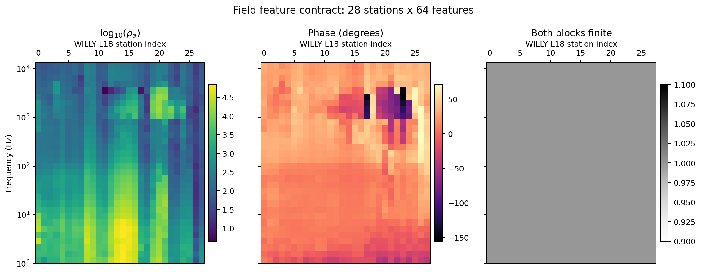
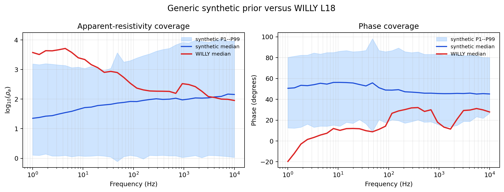

.. _ai_inversion_data_preparation:

AI inversion data preparation
=============================

Data preparation defines the inverse problem that an :term:`AI inversion`
model learns. It includes much more than converting :term:`EDI` files into
arrays: the workflow must define an earth-model distribution, generate
physically consistent synthetic responses, reproduce field noise and
missingness, preserve feature semantics, separate datasets without leakage,
and demonstrate that field observations are supported by the
:term:`training distribution`.

In pyCSAMT, two data paths meet at inference:

* :mod:`pycsamt.forward.batch` generates :term:`synthetic dataset`
  feature–target pairs;
* :mod:`pycsamt.ai.inversion` bridge utilities convert real
  :class:`pycsamt.site.Sites` into compatible observations, feature matrices,
  profile panels, or coordinates.

.. admonition:: The dataset is part of the model
   :class: important

   A checkpoint cannot be interpreted independently of its dataset.
   :term:`Model prior`\ s, :term:`forward operator`, :term:`frequency grid`,
   feature order, :term:`noise model`, preprocessing, target parameterization,
   and :term:`dataset split` policy all belong to the trained model's
   scientific definition.

Data preparation workflow
-------------------------

#. define the field question and required output parameterization;
#. inventory and quality-control the observed survey;
#. freeze the :term:`feature contract` and target contracts;
#. design a geologically defensible synthetic model distribution;
#. choose forward physics and acquisition geometry;
#. add realistic noise, gaps, distortions, and nuisance effects;
#. generate and audit synthetic samples;
#. split by independent groups rather than convenient rows;
#. fit preprocessing on training data only;
#. transform validation, test, calibration, and field data identically;
#. compare field observations with the synthetic coverage envelope;
#. version arrays, metadata, split indices, and :term:`provenance manifest`
   together.

1. Start from the decision and parameterization
-----------------------------------------------

Before generating data, state what the AI result must support. A five-layer
station model, a fixed-depth profile section, and graph-context station models
require different targets and different training examples.

Define:

* method: MT, AMT, CSAMT, or TEM;
* dimension: layered 1-D, profile 2-D, or spatial graph;
* target variables and their units;
* number of layers or depth cells;
* maximum supported depth;
* components and frequency/time range;
* expected survey geometry;
* required uncertainty and validation outputs;
* decision tolerance for boundary depth or resistivity.

Do not select layer count solely because a pretrained checkpoint uses it. The
parameterization must be capable of representing the target while remaining
identifiable at the available bandwidth.

2. Load field data canonically
------------------------------

Use :func:`pycsamt.emtools._core.ensure_sites` so :term:`EDI` files,
directories, and existing site containers follow the same validation path:

.. code-block:: pycon

   >>> from pycsamt.emtools._core import ensure_sites

   >>> sites = ensure_sites(
   ...     "data/AMT/WILLY_data/L18PLT",
   ...     recursive=True,
   ...     strict=False,
   ...     on_dup="replace",
   ...     verbose=0,
   ... )
   >>> print("Loaded stations:", len(sites))
   Loaded stations: 28

Files without valid impedance are skipped by the canonical loader. That is a
minimum structural check, not complete quality control.

Before building ML arrays, review:

* station names and duplicates;
* coordinates, :term:`CRS`, profile order, and elevations;
* :term:`frequency coverage` and sampling density;
* tensor-component availability;
* finite :term:`apparent resistivity` and :term:`phase`;
* error estimates and masks;
* :term:`static shift`, source effects, :term:`near field` behavior, and
  cultural noise;
* :term:`dimensionality`, :term:`strike`, skew, and :term:`tipper` evidence;
* every correction applied to the :term:`impedance tensor`;
* stations or frequency bands excluded from later interpretation.

Preserve the original EDI inventory and QC results. AI preparation should
create derived arrays rather than overwrite source impedance.

3. Use observation containers before features
----------------------------------------------

Observation containers retain scientific meaning and are useful for auditing
before interpolation.

1-D observations
~~~~~~~~~~~~~~~~

.. code-block:: pycon

   >>> from pycsamt.ai.inversion import sites_to_obs_1d

   >>> observations_1d = sites_to_obs_1d(
   ...     sites,
   ...     comp="xy",
   ...     verbose=0,
   ... )

   >>> first = observations_1d[0]
   >>> print(first.name)
   18-001A
   >>> print(first.freq.shape, first.rho_obs.shape, first.phase_obs.shape)
   (53,) (53,) (53,)

Each :class:`pycsamt.ai.inversion.SiteObs1D` contains frequency in hertz,
linear :term:`apparent resistivity` in ohm metres, and :term:`phase` in
degrees. Frequencies are sorted from high to low and invalid values are
removed.

Supported component names are ``"xy"``, ``"yx"``, ``"xx"``, and ``"yy"``.
Component choice is a scientific decision; it must match training and the
survey's mode convention.

2-D observations
~~~~~~~~~~~~~~~~

.. code-block:: pycon

   >>> from pycsamt.ai.inversion import sites_to_obs_2d

   >>> observations_2d = sites_to_obs_2d(
   ...     sites,
   ...     comp_te="xy",
   ...     comp_tm="yx",
   ...     verbose=0,
   ... )
   >>> type(observations_2d).__name__, len(observations_2d)
   ('list', 28)
   >>> first = observations_2d[0]
   >>> print(first.name)
   18-001A
   >>> print(
   ...     first.freq.shape,
   ...     first.rho_te.shape,
   ...     first.phase_te.shape,
   ...     first.rho_tm.shape,
   ...     first.phase_tm.shape,
   ... )
   (53,) (53,) (53,) (53,) (53,)

Each :class:`pycsamt.ai.inversion.SiteObs2D` stores TE and TM apparent
resistivity and :term:`phase`. The current bridge treats ``xy`` as
:term:`TE mode` and ``yx`` as :term:`TM mode` by default and stores the TM
phase magnitude. Confirm that this convention is
appropriate for the profile orientation and strike analysis.

When TM values are missing at samples retained by the TE mask, the bridge can
fall back to TE values. This keeps array construction possible but creates
synthetic channel agreement. Audit component completeness before accepting a
panel.

4. Freeze the 1-D feature contract
----------------------------------

:func:`pycsamt.ai.inversion.sites_to_features_1d` creates the public 1-D field
feature matrix:

.. code-block:: pycon

   >>> from pycsamt.ai.inversion import sites_to_features_1d

   >>> X_field, frequencies_hz, station_names = sites_to_features_1d(
   ...     sites,
   ...     comp="xy",
   ...     n_freqs=32,
   ...     freq_min=1.01,
   ...     freq_max=1e4,
   ... )

   >>> print(X_field.shape)
   (28, 64)
   >>> print(frequencies_hz.shape)
   (32,)

The block layout is:

.. code-block:: text

   [log10(rho_a at f_1 ... f_n),
    phase at f_1 ... f_n]

Equivalently, for station :math:`s` and a common frequency grid
:math:`\{f_j\}_{j=1}^{n_f}`, the row is

.. math::
   :label: eq-ai-data-feature-row

   \mathbf x_s =
   \left[
   \log_{10}\rho_a(s,f_1),\ldots,\log_{10}\rho_a(s,f_{n_f}),
   \phi(s,f_1),\ldots,\phi(s,f_{n_f})
   \right].

The common grid is logarithmically spaced. Interpolation occurs in
:math:`\log_{10}f`; :term:`apparent resistivity` is interpolated in
:math:`\log_{10}\rho_a` space and :term:`phase` in linear degrees.

For WILLY L18, ``1.01`` and ``10_000`` Hz lie just inside the measured
1.008--10,400 Hz endpoints. This small inward margin avoids treating floating
point endpoint comparisons as missing observations. It also keeps the field
and synthetic grids identical; widening the synthetic grid would not create
field information outside the acquired band.

   The two feature blocks in equation :eq:`eq-ai-data-feature-row` retain
   frequency structure across all 28 stations. Stations are columns labelled
   along the top, while frequency increases vertically on the logarithmic
   axis. The finite-value panel is a required audit: a correctly shaped matrix
   can still be unusable when its requested grid extends beyond measured
   support.

.. warning::

   ``sites_to_features_1d`` leaves values outside an individual station's
   measured frequency range as ``nan``. A neural network may reject or silently
   propagate these values. Choose a common range supported by the required
   stations, define a documented mask/imputation policy, and reproduce that
   policy in synthetic training data.

:func:`pycsamt.ai.inversion.obs_to_features_1d` accepts already extracted
observations. In the current implementation it fills missing log resistivity
with ``2.0`` and missing phase with ``45.0``. Those constants correspond to
100 ohm metres and 45 degrees, not a neutral missing-value representation.
Use this convenience only when that policy is part of the trained contract;
otherwise handle masks explicitly in a controlled preprocessing step.

Record the contract as machine-readable metadata:

.. code-block:: yaml

   representation: mt_rho_phase_1d
   component: xy
   frequency_unit: Hz
   frequency_order: low_to_high
   n_frequencies: 32
   frequency_min: 1.01
   frequency_max: 10000.0
   feature_layout: [log10_rho_block, phase_deg_block]
   missing_policy: explicit_mask_and_training_median

5. Build a 2-D field panel
--------------------------

:func:`pycsamt.ai.inversion.sites_to_panel_2d` produces a batch containing one
field profile:

.. code-block:: pycon

   >>> from pycsamt.ai.inversion import sites_to_panel_2d

   >>> X_profile, frequencies_hz, station_names = sites_to_panel_2d(
   ...     sites,
   ...     n_freqs=32,
   ...     n_components=4,
   ...     comp_te="xy",
   ...     comp_tm="yx",
   ...     freq_min=1.01,
   ...     freq_max=1e4,
   ... )

   >>> print(X_profile.shape)
   (1, 4, 32, 28)

For four channels, the order is:

.. code-block:: text

   [log10(rho_TE), phase_TE, log10(rho_TM), phase_TM]

For two channels, only TE log resistivity and phase are included. The returned
panel frequency axis is high to low.

The bridge preserves input station order; it does not infer profile order from
coordinates. Sort the source survey by reviewed chainage before panel creation,
and preserve a station-name-to-column table. If the network requires a fixed
station count, document padding, cropping, resampling, and masks.

Inspect missingness by channel and station:

.. code-block:: pycon

   >>> import numpy as np

   >>> missing_fraction = np.mean(~np.isfinite(X_profile), axis=(0, 1, 2))
   >>> print(missing_fraction.shape)
   (28,)
   >>> for name, fraction in list(zip(station_names, missing_fraction))[:4]:
   ...     print(name, round(float(fraction), 3))
   18-001A 0.0
   18-002U 0.0
   18-003A 0.0
   18-004A 0.0

Do not fill all missing values with a smooth interpolation unless training
contains the same pattern. Interpolation can manufacture lateral continuity.

6. Prepare coordinates for graph inversion
------------------------------------------

:func:`pycsamt.ai.inversion.sites_to_coords_3d` returns station coordinates in
metres:

.. code-block:: pycon

   >>> from pycsamt.ai.inversion import sites_to_coords_3d

   >>> coords_m = sites_to_coords_3d(
   ...     sites,
   ...     station_spacing=500.0,
   ... )
   >>> print(coords_m.shape)
   (28, 2)
   >>> print(coords_m[:3])
   [[    8.19238802 -1300.78745238]
    [   14.47695964 -1208.02078571]
    [    9.76353092 -1102.26678571]]

The helper attempts a local flat-earth conversion from site latitude and
longitude. When coordinates are absent or do not span a meaningful range, it
falls back to a uniformly spaced layout using ``station_spacing``.

For production graph inversion, prefer authoritative projected coordinates and
pass them explicitly to the inverter or agent. A fallback line can make an
areal survey look regular and change graph connectivity without an obvious
error. Verify:

* coordinate units are metres;
* axes have the intended orientation;
* order matches feature rows and station names;
* duplicate coordinates are resolved;
* inter-station distances are plausible;
* :term:`CRS` and projection are recorded;
* adjacency does not cross known structural barriers unintentionally.

7. Design synthetic earth models
--------------------------------

Synthetic models should cover plausible geology without becoming physically
meaningless. Define distributions for:

* number of layers;
* linear resistivity in ohm metres;
* layer thickness and total depth;
* correlations between lithology, resistivity, and thickness;
* conductive and resistive targets;
* weathering and basement structures;
* lateral correlation lengths for spatial surveys;
* rare but decision-critical cases;
* nuisance parameters not intended as prediction targets.

Broad independent uniform sampling is not automatically conservative. It can
overrepresent impossible combinations and underrepresent coherent geological
sequences. Use scenario-aware generators where justified, and preserve the
scenario label so performance can be reported by geology rather than only as
one aggregate metric.

Target transformations
~~~~~~~~~~~~~~~~~~~~~~

The 1-D generator uses ``LayeredModel.to_vector(log_rho=True)``. The target
contains log10 resistivities followed by interface thicknesses according to
the current model-vector contract. Inspect the generated target and inverter
configuration rather than assuming all target blocks use the same scaling.
For a fixed :math:`L`-layer target, a common supervised target is

.. math::
   :label: eq-ai-data-target-vector

   \mathbf y =
   \left[
   \log_{10}\rho_1,\ldots,\log_{10}\rho_L,
   h_1,\ldots,h_{L-1}
   \right],

In equation :eq:`eq-ai-data-target-vector`, :math:`\rho_\ell` is resistivity
in ohm metres and :math:`h_\ell` is the finite layer thickness in metres. If
``log_thickness=True`` is used later
by an inverter, record whether thickness was transformed during dataset
generation, target preprocessing, or model training; mixing those locations is
an easy way to make a checkpoint unreproducible.

Variable layer counts produce vectors of different length; the batch generator
pads shorter targets with ``nan`` to the largest parameter length. Not every
network or loss can train safely on NaN targets. Use a fixed layer count for a
fixed-output inverter, or implement and test an explicit mask-aware target
strategy.

8. Generate a 1-D synthetic dataset
-----------------------------------

:func:`pycsamt.forward.batch.generate_dataset` supports ``"mt1d"``,
``"csamt1d"``, and ``"tem1d"``:

.. code-block:: pycon

   >>> import numpy as np
   >>> from pycsamt.forward.batch import generate_dataset

   >>> frequencies_hz = np.logspace(np.log10(1.01), 4, 32)

   >>> dataset = generate_dataset(
   ...     solver="mt1d",
   ...     n_samples=40,
   ...     freqs=frequencies_hz,
   ...     n_layers=5,
   ...     rho_range=(1.0, 10_000.0),
   ...     depth_max=2000.0,
   ...     noise_level=0.05,
   ...     noise_type="field",
   ...     include_phase=True,
   ...     seed=42,
   ...     n_jobs=1,
   ...     output=None,
   ...     verbose=False,
   ... )

   >>> print(dataset)
   ForwardDataset(n=40, n_features=64, n_params=9, solver='mt1d')
   >>> print(dataset.X.shape)
   (40, 64)
   >>> print(dataset.y.shape)
   (40, 9)

For MT with phase, ``X`` contains a log10 apparent-resistivity block followed
by a phase block. For TEM, it contains log10 absolute decay values. Confirm the
feature size from the generated array rather than hard-coding it in downstream
code.

Generator parameters
~~~~~~~~~~~~~~~~~~~~

``solver``
   Forward method. It must match the field method and feature contract.

``n_samples``
   Number of synthetic examples. The small value above keeps the documentation
   example quick; adequacy in a real run depends on parameter dimension,
   distribution complexity, architecture, and rare-case coverage.

``n_layers``
   Fixed integer or inclusive ``(low, high)`` range. Fixed-output supervised
   models are simplest with a fixed value.

``rho_range``
   Linear resistivity bounds in ohm metres used by random model generation.

``depth_max``
   Maximum synthetic model depth in metres.

``noise_level`` and ``noise_type``
   Relative noise magnitude and one of ``"gaussian"``, ``"multiplicative"``,
   or ``"field"``.

``geology``
   Optional named scenario forwarded to ``LayeredModel.from_geology``.
   Validate available scenario names in the installed implementation.

``seed``
   Base seed from which deterministic worker seeds are drawn.

``n_jobs``
   Worker process count; ``-1`` uses available CPU cores. Parallel completion
   order can affect row order, so do not assume sample index maps directly to
   generation seed unless explicitly recorded and verified.

``output``
   Optional compressed NPZ destination.

TEM generation uses numerical integration and can be substantially slower.
Pilot the physics and storage requirements before launching a large dataset.

9. Understand ForwardDataset
----------------------------

:class:`pycsamt.forward.batch.ForwardDataset` stores:

``X``
   Feature matrix ``(n_samples, n_features)``.

``y``
   Target matrix ``(n_samples, n_parameters)``.

``freqs`` or ``times``
   Sampling grid used by the forward responses.

``meta``
   In-memory structured metadata containing layer count and noise level in the
   current generator.

``solver``
   Solver identifier.

Save and load without pickle:

.. code-block:: pycon

   >>> from pycsamt.forward.batch import ForwardDataset

   >>> dataset.save("datasets/mt1d_5layer.npz")
   >>> restored = ForwardDataset.load("datasets/mt1d_5layer.npz")
   >>> print(restored)
   ForwardDataset(n=40, n_features=64, n_params=9, solver='mt1d')

The current NPZ serialization preserves arrays, solver, frequency/time grids,
and metadata fields for layer count and noise level. It does not preserve the
complete generator configuration such as resistivity range, depth limit,
noise type, geology, job count, or base seed. Store those in a companion JSON
or YAML manifest.

10. Generate pseudo-3-D graph data
----------------------------------

:func:`pycsamt.forward.batch.generate_dataset_3d` creates spatially correlated
layered station models for :class:`pycsamt.ai.inversion.GCNInverter3D`:

.. code-block:: pycon

   >>> from pycsamt.forward.batch import generate_dataset_3d

   >>> surveys = generate_dataset_3d(
   ...     solver="mt1d",
   ...     n_surveys=20,
   ...     n_stations=25,
   ...     n_layers=5,
   ...     freqs=frequencies_hz,
   ...     extent=10_000.0,
   ...     corr_length=2000.0,
   ...     log_rho_mean=2.0,
   ...     log_rho_std=0.6,
   ...     thickness_range=(100.0, 1500.0),
   ...     station_layout="grid",
   ...     noise_level=0.03,
   ...     noise_type="field",
   ...     include_phase=True,
   ...     seed=42,
   ...     n_jobs=1,
   ...     output=None,
   ...     verbose=False,
   ... )

   >>> print(surveys.X.shape)
   (20, 25, 64)
   >>> print(surveys.y.shape)
   (20, 25, 9)
   >>> print(surveys.coords.shape)
   (25, 2)

The small ``n_surveys`` value above is for documentation speed; production
graph training usually needs many more survey realizations. The generator
currently uses the MT 1-D forward solver at every graph node.
Per-layer log resistivities are drawn from a spatially correlated Gaussian
random field. Layer thicknesses are log-uniform and spatially constant within
one synthetic survey. All surveys share one station layout.

This is a pseudo-3-D graph-training distribution, not a full 3-D EM forward
simulation. Its correlation length and flat-layer assumptions strongly affect
what spatial patterns the graph network learns.

:class:`pycsamt.forward.batch.SurveyDataset3D` saves, loads, and splits along
the survey axis. Its NPZ metadata retains correlation length and noise level,
but the full generator configuration still requires a companion manifest.

11. Prepare 2-D training profiles
---------------------------------

The public 1-D and pseudo-3-D batch generators do not by themselves create a
complete, physically simulated 2-D U-Net training corpus matching arbitrary
field geometry. A 2-D training dataset must define:

* input shape ``(n_profiles, n_components, n_freqs, n_stations)``;
* target shape ``(n_profiles, n_depth, n_stations)``;
* fixed station and depth axes;
* lateral structural generator;
* forward-physics fidelity;
* component convention;
* missing-station and missing-frequency policy;
* topography and profile-distance treatment.

Tiling or correlating independent 1-D responses can produce useful screening
examples, but it is not equivalent to 2-D forward physics. Label the dataset
accordingly and include classical or numerical 2-D simulations when the model
will be described as a 2-D EM inverter.

12. Add realistic observation effects
-------------------------------------

White Gaussian noise alone rarely represents field data. Consider controlled
augmentation for:

* frequency-dependent and component-dependent errors;
* multiplicative apparent-resistivity noise;
* phase noise;
* missing frequencies and bands;
* station dropout;
* outliers and spikes;
* static shifts;
* smooth calibration bias;
* source and near-field effects for controlled-source data;
* coordinate perturbations for graph workflows;
* preprocessing alternatives used by the field pipeline.

Separate effects the model should become robust to from effects that should
trigger rejection. If training always imputes a missing band, the model may
produce a confident prediction where the operational policy should instead
return ``needs_review``.

Do not augment validation and test sets by copying training examples with new
noise. That tests denoising around known models rather than generalization to
new earth structures.

13. Audit synthetic arrays
--------------------------

Run structural and numerical checks immediately after generation:

.. code-block:: pycon

   >>> import numpy as np

   >>> assert dataset.X.ndim == 2
   >>> assert dataset.y.ndim == 2
   >>> assert len(dataset.X) == len(dataset.y)
   >>> assert np.all(np.isfinite(dataset.X))

   >>> target_finite = np.isfinite(dataset.y)
   >>> print("Target finite fraction:", target_finite.mean())
   Target finite fraction: 1.0
   >>> print(
   ...     "Feature percentiles:",
   ...     np.round(np.nanpercentile(dataset.X, [0, 1, 50, 99, 100]), 3),
   ... )
   Feature percentiles: [-0.098  0.317 10.157 84.282 96.21 ]
   >>> print(
   ...     "Target percentiles:",
   ...     np.round(np.nanpercentile(dataset.y, [0, 1, 50, 99, 100]), 3),
   ... )
   Target percentiles: [4.700000e-02 1.370000e-01 3.660000e+00 1.364546e+03 1.710847e+03]

Also inspect:

* samples at parameter bounds;
* layer-count balance;
* depth and thickness distributions;
* response curves from randomly selected models;
* correlations among target parameters;
* frequency-wise means and spreads;
* phase wrapping or implausible values;
* effects of each noise model;
* duplicated examples;
* generator failures and rejected cases.

Plot distributions by split and scenario. Aggregate percentiles can hide a
missing rare target class.

14. Split without leakage
-------------------------

``ForwardDataset.split`` provides a random row split:

.. code-block:: pycon

   >>> train, validation, test = dataset.split(
   ...     val_frac=0.15,
   ...     test_frac=0.15,
   ...     seed=42,
   ... )
   >>> print(len(train), len(validation), len(test))
   28 6 6
   >>> print(train.X.shape, validation.X.shape, test.X.shape)
   (28, 64) (6, 64) (6, 64)

This is appropriate only when rows are independent and exchangeable. It does
not enforce grouping by geological scenario, parent model, augmentation
family, or generation batch.

Prefer group-based splitting when examples are related:

* keep all noise realizations of one earth model in one split;
* keep correlated profiles from one geological realization together;
* split graph data by survey, not station;
* hold out complete geology scenarios to test extrapolation;
* reserve a calibration set distinct from validation and test;
* freeze split indices before architecture selection.

``SurveyDataset3D.split`` correctly splits along the synthetic survey axis,
but scenario-aware grouping may still require custom indices.

Never choose hyperparameters on the test set. Once a test result changes model
or data preparation decisions, that set has become validation data.

15. Fit preprocessing on training only
--------------------------------------

If features or targets are standardized, compute statistics from the training
set only:

.. math::
   :label: eq-ai-data-standardization

   \mu_j = \frac{1}{N_{\mathrm{tr}}}\sum_{i\in\mathrm{train}}X_{ij},
   \qquad
   \sigma_j = \sqrt{\frac{1}{N_{\mathrm{tr}}}
      \sum_{i\in\mathrm{train}}(X_{ij}-\mu_j)^2},
   \qquad
   \widetilde X_{ij}=\frac{X_{ij}-\mu_j}{\sigma_j}.

The index :math:`j` identifies one fixed frequency-channel feature. Equation
:eq:`eq-ai-data-standardization` must use the same saved :math:`\mu_j` and
:math:`\sigma_j` for validation, test, calibration, and WILLY field rows;
estimating them again on any of those sets changes the transformation.

.. code-block:: pycon

   >>> x_mean = np.nanmean(train.X, axis=0)
   >>> x_std = np.nanstd(train.X, axis=0)
   >>> x_std = np.where(x_std > 0, x_std, 1.0)

   >>> X_train_scaled = (train.X - x_mean) / x_std
   >>> X_val_scaled = (validation.X - x_mean) / x_std
   >>> X_test_scaled = (test.X - x_mean) / x_std
   >>> X_field_scaled = (X_field - x_mean) / x_std
   >>> print(
   ...     X_train_scaled.shape,
   ...     X_val_scaled.shape,
   ...     X_test_scaled.shape,
   ...     X_field_scaled.shape,
   ... )
   (28, 64) (6, 64) (6, 64) (28, 64)

This example does not resolve NaNs; apply the documented mask or imputation
policy first or within a pipeline designed for missing values.

Save normalization arrays with the checkpoint. Recomputing them from field
data changes the model and leaks the deployment distribution into inference.

For target scaling, preserve inverse-transform code and units. Validate that a
round trip returns the original target within numerical tolerance.

16. Compare field and synthetic domains
---------------------------------------

Before training acceptance or field inference, compare ``X_field`` with
training data:

.. code-block:: pycon

   >>> train_low = np.nanpercentile(train.X, 1, axis=0)
   >>> train_high = np.nanpercentile(train.X, 99, axis=0)

   >>> outside = (X_field < train_low) | (X_field > train_high)
   >>> outside_fraction = np.nanmean(outside, axis=1)

   >>> for name, fraction in list(zip(station_names, outside_fraction))[:4]:
   ...     print(name, round(float(fraction), 3))
   18-001A 0.688
   18-002U 0.703
   18-003A 0.703
   18-004A 0.719

This per-feature envelope is only a basic diagnostic. It ignores feature
correlation and does not prove in-distribution status; with only 40 synthetic
examples it is intentionally a smoke test, not acceptance evidence. Add
multivariate or latent-distance diagnostics where appropriate.

   Much of the WILLY median response lies outside the central synthetic
   envelope generated by the deliberately small, generic model prior. The
   mismatch is evidence to redesign the prior and nuisance effects before
   training; it is not evidence that the field curve is erroneous.

Review domain coverage by:

* station and frequency;
* component and feature type;
* missingness pattern;
* response-curve shape;
* survey geometry and adjacency degree;
* known geology and nuisance effects;
* acquisition and processing version.

Define operational thresholds before reviewing target predictions. Stations
outside the supported domain should be flagged, withheld, or handled by a
separate validated model—not silently extrapolated.

17. Store datasets with provenance
----------------------------------

A useful dataset record is:

.. code-block:: text

   datasets/mt1d_5layer_v001/
   ├── dataset.npz
   ├── manifest.yml
   ├── generation_config.yml
   ├── feature_contract.yml
   ├── split_indices.npz
   ├── normalization.npz
   ├── checksums.sha256
   ├── audit/
   │   ├── distributions.csv
   │   ├── coverage_by_scenario.csv
   │   └── rejected_samples.csv
   └── figures/
       ├── parameter_distributions.png
       ├── response_envelopes.png
       └── field_coverage.png

The manifest should include:

* stable dataset ID and revision;
* generator code/version and configuration;
* solver and physics assumptions;
* feature and target schemas with units;
* sample count and rejection count;
* base and worker-seed policy;
* field/QC source identifiers;
* split method and exact indices;
* preprocessing and normalization values;
* file hashes;
* limitations and intended use;
* author, reviewer, status, and date.

Compressed NPZ is convenient for trusted numeric arrays. Do not enable pickle
for untrusted datasets. Treat checkpoints, datasets, and manifests as a linked
versioned set.

Complete 1-D preparation example
--------------------------------

.. code-block:: pycon

   >>> from pathlib import Path
   >>> import json
   >>> import numpy as np

   >>> from pycsamt.ai.inversion import sites_to_features_1d
   >>> from pycsamt.emtools._core import ensure_sites
   >>> from pycsamt.forward.batch import generate_dataset

   >>> root = Path("datasets/mt1d_5layer_v001")
   >>> root.mkdir(parents=True, exist_ok=True)

   >>> frequencies_hz = np.logspace(np.log10(1.01), 4, 32)

   >>> dataset = generate_dataset(
   ...     solver="mt1d",
   ...     n_samples=40,
   ...     freqs=frequencies_hz,
   ...     n_layers=5,
   ...     rho_range=(1.0, 10_000.0),
   ...     depth_max=2000.0,
   ...     noise_level=0.05,
   ...     noise_type="field",
   ...     include_phase=True,
   ...     seed=42,
   ...     n_jobs=1,
   ...     verbose=False,
   ... )
   >>> dataset.save(root / "dataset.npz")

   >>> train, validation, test = dataset.split(
   ...     val_frac=0.15,
   ...     test_frac=0.15,
   ...     seed=42,
   ... )
   >>> train.save(root / "train.npz")
   >>> validation.save(root / "validation.npz")
   >>> test.save(root / "test.npz")

   >>> sites = ensure_sites(
   ...     "data/AMT/WILLY_data/L18PLT",
   ...     recursive=True,
   ...     verbose=0,
   ... )
   >>> X_field, field_freqs, station_names = sites_to_features_1d(
   ...     sites,
   ...     comp="xy",
   ...     n_freqs=32,
   ...     freq_min=float(frequencies_hz.min()),
   ...     freq_max=float(frequencies_hz.max()),
   ... )

   >>> if not np.allclose(field_freqs, frequencies_hz):
   ...     raise ValueError("Synthetic and field frequency grids differ.")

   >>> np.savez_compressed(
   ...     root / "field_features.npz",
   ...     X=X_field,
   ...     freqs=field_freqs,
   ...     station_names=np.asarray(station_names),
   ... )

   >>> manifest = {
   ...     "dataset_id": "mt1d_5layer_v001",
   ...     "solver": "mt1d",
   ...     "n_samples": 40,
   ...     "n_layers": 5,
   ...     "rho_range_ohm_m": [1.0, 10_000.0],
   ...     "depth_max_m": 2000.0,
   ...     "noise_type": "field",
   ...     "noise_level": 0.05,
   ...     "seed": 42,
   ...     "component": "xy",
   ...     "feature_layout": "log10_rho_block_then_phase_deg_block",
   ... }
   >>> (root / "manifest.json").write_text(
   ...     json.dumps(manifest, indent=2),
   ...     encoding="utf-8",
   ... )
   339
   >>> print(dataset)
   ForwardDataset(n=40, n_features=64, n_params=9, solver='mt1d')
   >>> print(train.X.shape, validation.X.shape, test.X.shape)
   (28, 64) (6, 64) (6, 64)
   >>> print(X_field.shape, len(station_names))
   (28, 64) 28
   >>> print(sorted(p.name for p in root.iterdir()))
   ['dataset.npz', 'field_features.npz', 'manifest.json', 'test.npz', 'train.npz', 'validation.npz']

For a controlled project, save the exact split indices rather than only the
three subset files, use a production-scale sample count, and add checksums
plus field-coverage diagnostics.

Review checklist
----------------

.. list-table::
   :header-rows: 1
   :widths: 31 69

   * - Check
     - Required evidence
   * - Scientific target defined
     - Method, dimension, parameterization, depth, units, and decision need.
   * - Field inputs reviewed
     - Canonical load, QC, components, frequency coverage, coordinates,
       processing, exclusions, and station order.
   * - Feature contract frozen
     - Transformation, order, grid, units, masks, imputation, and normalization.
   * - Synthetic geology defensible
     - Parameter distributions, dependencies, scenarios, rare targets, and
       impossible-case controls.
   * - Forward physics documented
     - Solver, dimension, geometry, approximations, and numerical settings.
   * - Observation effects realistic
     - Noise, missingness, distortion, outliers, and rejection behavior.
   * - Targets train safely
     - Shape, units, transformation, bounds, NaN padding, and inverse transform.
   * - Splits resist leakage
     - Group definitions, frozen indices, calibration separation, and untouched
       final test set.
   * - Preprocessing is isolated
     - Statistics fitted on training only and saved with the checkpoint.
   * - Field coverage established
     - Per-feature, multivariate, missingness, geometry, and scenario checks.
   * - Dataset is reproducible
     - Arrays, generator configuration, metadata, seeds, checksums, splits,
       audit figures, author, and version.

Common mistakes
---------------

Avoid these errors:

* treating valid impedance loading as complete QC;
* using different frequency grids for synthetic and field features;
* confusing low-to-high 1-D grids with high-to-low 2-D panel axes;
* ignoring NaNs created outside station frequency ranges;
* accepting constant 100-ohm-m/45-degree imputation without documenting it;
* assuming the 2-D bridge sorts stations by profile distance;
* using coordinate fallback geometry as authoritative survey geometry;
* training fixed-output networks on NaN-padded variable-layer targets without
  a tested mask-aware loss;
* calling correlated 1-D graph examples full 3-D EM simulations;
* splitting noise realizations of the same earth model across train and test;
* fitting normalization on the complete dataset or field observations;
* relying on NPZ alone to preserve generator provenance;
* using marginal min/max coverage as proof that field inputs are in domain;
* discarding failed or rejected synthetic samples without recording them.

Next steps
----------

Continue with:

* :doc:`model_selection` to select architecture and dimension for the frozen
  data contract;
* :doc:`training` to fit preprocessing and model parameters correctly;
* :doc:`validation` to evaluate leakage, response reconstruction, and domain
  transfer;
* :doc:`inference` to apply the exact field transformation at deployment;
* :doc:`uncertainty` to assess calibration and distribution shift;
* :doc:`reporting` to publish dataset and model provenance.

The two diagnostic figures on this page are reproduced by
``docs/scripts/generate_ai_inversion_figures.py``. They use the bundled WILLY
L18 observations; the synthetic envelope is deterministic teaching data from
seed 42, not an accepted training distribution or inversion result.
