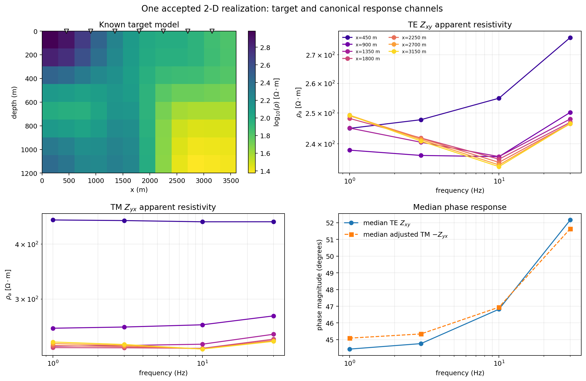

.. _ai_inversion_dataset2d:

2-D Maxwell training-data generation
=====================================

:doc:`forward_physics` solves one 2-D Maxwell problem at a time.
Training a network needs many, spanning a distribution of plausible
geology, converted into the same shape every later stage agrees on.
:func:`~pycsamt.ai.training.dataset2d.generate_2d_maxwell_dataset`
is that bridge: it draws a correlated resistivity field from
:mod:`~pycsamt.ai.geology` for each realization, solves it with
:class:`~pycsamt.forward.maxwell.mt2d.MT2DAdapter` through
:func:`~pycsamt.forward.maxwell.batch.solve_batch` (cached and
retried rather than resolved from scratch on every call), and
packages every realization that converges into a
:class:`~pycsamt.ai.training.dataset2d.Maxwell2DDataset` with a
realization-level train/validation/test split and a
:class:`~pycsamt.ai.data.manifest.DatasetManifest`. A realization
whose solve does not converge is recorded and excluded, never
silently included.

The generator is best understood as four linked contracts rather than one
large function call: a geological field defines the target, a solver mesh and
receiver layout define the forward problem, canonical
:class:`~pycsamt.ai.data.contracts.SurveyData` defines the response axes, and
the split plus manifest define which accepted realizations may be used for
each statistical role. A dataset is ready for training only when all four
contracts have been reviewed.

Configuring one coherent dataset
------------------------------------

A :class:`~pycsamt.ai.training.dataset2d.Maxwell2DDatasetConfig` fixes
everything that must stay identical across realizations for the
dataset to be one coherent, versioned thing: the shared ``(z, x)``
:class:`~pycsamt.ai.geology.GeologyGrid`, the horizontal and vertical
correlation-length ranges realizations are drawn from, the shared
frequency grid and receiver ``x`` positions, and a root
:term:`Random seed` from which every realization's field and solver
seeds are derived deterministically:

.. code-block:: pycon

   >>> from pycsamt.ai.geology import GeologyGrid
   >>> from pycsamt.ai.training.dataset2d import (
   ...     Maxwell2DDatasetConfig,
   ...     generate_2d_maxwell_dataset,
   ... )

   >>> grid = GeologyGrid.regular_2d(nx=6, nz=4, dx_m=300, dz_m=150)
   >>> config = Maxwell2DDatasetConfig(
   ...     dataset_id="demo-2d-v1",
   ...     grid=grid,
   ...     correlation_length_x_m=(600.0, 900.0),
   ...     correlation_length_z_m=(150.0, 300.0),
   ...     frequencies_hz=[10.0, 3.0],
   ...     station_x_m=[600.0, 900.0, 1200.0],
   ...     n_realizations=2,
   ...     seed=0,
   ...     validation_fraction=0.0,
   ...     test_fraction=0.0,
   ... )
   >>> config.components
   ('zxy', 'zyx')
   >>> config.grid.shape, config.station_x_m.shape
   ((4, 6), (3,))
   >>> config.to_dict()["schema_version"]
   1

   >>> dataset = generate_2d_maxwell_dataset(config)
   >>> len(dataset.samples), dataset.rejected
   (2, ())

Every accepted realization comes back as a
:class:`~pycsamt.ai.training.dataset2d.Maxwell2DSample` pairing the
true resistivity grid (the training target) with its simulated
:class:`~pycsamt.ai.data.contracts.SurveyData` response (the training
input) and the solver's own mesh size and residual, so a downstream
consumer never has to guess how well that one realization actually
converged:

.. code-block:: pycon

   >>> sample = dataset.samples[0]
   >>> sample.survey.shape
   (3, 2, 2)
   >>> sample.resistivity_ohm_m.shape
   (4, 6)
   >>> sample.mesh_cells, round(sample.relative_residual, 6)
   (8650, 0.0)
   >>> f"{sample.relative_residual:.3e}"
   '2.290e-17'

Two realizations, three stations, two frequencies, and both impedance
components finish quickly here because the mesh and realization count are
kept deliberately small for the documentation build; the mesh alone uses
8,650 padded cells even at this scale,
which is why :doc:`forward_physics`'s cache and batch runner, not a
plain loop, are what make a production-sized version of this call
tractable. Rounding the residual to six decimals hides its magnitude, which is
why the scientific-notation output is also captured. The
:math:`2.290\times10^{-17}` residual shows an accurate solution of the
discretized linear system; it does not prove that the mesh is sufficiently
refined or that its boundaries are far enough away. The empty ``rejected``
tuple shows that neither attempted realization was excluded.

.. figure:: ../../images/user_guide/ai_inversion/dataset2d_realization_gallery.png
   :alt: Three independent resistivity-field realizations from one Maxwell2DDatasetConfig
   :align: center
   :width: 96%

   Three realizations drawn from the same
   :class:`Maxwell2DDatasetConfig` — same correlation-length ranges,
   same station layout (white triangles), independent random fields.
   Each is a genuinely 2-D section with structure varying in both
   ``x`` and ``z``, not a set of independent 1-D columns tiled
   side by side; that lateral continuity is the entire reason this
   module exists rather than reusing :doc:`../forward/index`'s
   station-wise 1-D batch generator.

The gallery should be read horizontally. All panels share one color scale, so
the purple shallow resistor in the left realization is genuinely more
resistive than the green material in the right panel rather than an artifact
of independently stretched color limits. The correlation ranges impose broad
smooth bodies; they do not create discrete contacts or faults. A network
trained only on this family will therefore be biased toward smooth recovery
even if its architecture contains no explicit smoothness penalty.

From complex impedance to network channels
-------------------------------------------

The solver returns SI impedance in V/A with canonical shape
``(station, frequency, component)``. Apparent resistivity and phase are derived
without changing that provenance:

.. math::
   :label: eq-ai-dataset2d-response-transform

   \rho_a^{(c)}(s,f)=
   \frac{|Z_c(s,f)|^2}{\mu_0\,2\pi f},
   \qquad
   \phi^{(c)}(s,f)=\operatorname{atan2}
   \left(\Im Z_c,\Re Z_c\right).

Equation :eq:`eq-ai-dataset2d-response-transform` is the SI conversion. The
legacy :math:`0.2|Z|^2/f` factor belongs to impedance expressed in
mV/km/nT and must not be applied directly to the Maxwell adapter's V/A output.
For U-Net training, pyCSAMT uses
:math:`\log_{10}\rho_a^{xy}` and :math:`\phi^{xy}` as its current two-channel
layout, then transposes the arrays to
``(realization, channel, frequency, station)``.

         curves and adjusted phase responses at seven stations.
   :align: center
   :width: 98%

   One accepted deterministic realization. White triangles identify the seven
   receiver positions. The upper-right and lower-left panels use identical
   station colors, letting a reader trace how the same lateral location differs
   between TE and TM. The phase panel plots :math:`-Z_{yx}` for TM so its
   half-space reference is near :math:`+45^\circ`, consistent with the standard
   :math:`Z_{yx}=-Z_{xy}` convention.

The target contains a shallow resistive zone on the left and a deeper
conductive region toward the right. TE apparent resistivity varies moderately
among most stations but rises most strongly at the leftmost receiver, which is
consistent with its proximity to the shallow resistor. TM shows a larger
separation at the same receiver because lateral conductivity enters its
governing diffusion coefficient. This is a qualitative consistency check, not
an inversion: the plotted response is still influenced by the full model,
frequency-dependent sensitivity, mesh, and boundary conditions. Notice also
that four frequencies cannot resolve every one of the 96 target cells; the
target grid describes what was generated, not what those responses uniquely
identify.

Two impedance modes, and why one needed more care than the other
------------------------------------------------------------------------

A 2-D MT problem separates into two independent modes, and they are
not equally easy to discretize. With :math:`\mu=\mu_0` constant
everywhere, :term:`TE mode` solves for the electric field
:math:`E_y` under

.. math::
   :label: eq-ai-dataset2d-te

   \nabla^2 E_y = i\omega\mu_0\sigma\,E_y,

a *constant-coefficient* Laplacian: resistivity structure enters only
through the reaction term on the right, multiplying the field itself
rather than its derivatives. :term:`TM mode` solves for the magnetic
field :math:`H_y` under

.. math::
   :label: eq-ai-dataset2d-tm

   \nabla\cdot(\rho\,\nabla H_y) = i\omega\mu_0 H_y,

where resistivity sits *inside* the derivative — the diffusion
coefficient itself, not just a multiplier. Equation
:eq:`eq-ai-dataset2d-tm` is a genuinely harder numerical problem than
:eq:`eq-ai-dataset2d-te`: every bit of 2-D resistivity structure a
finite-difference scheme needs to resolve has to survive being
differentiated through, not just multiplied in afterward. In
practice this means TM mode needs finer *joint* horizontal and
vertical resolution than TE mode to reach comparable accuracy — and
that requirement, not a defect in the solver, was the real story
behind an earlier, mistaken finding that TM mode was unusable for
laterally fine structure. That investigation changed horizontal and
vertical resolution one at a time instead of together, and compared
independent random-field realizations across different
resolutions instead of refining one fixed field — both of which
produce exactly the appearance of a solver that never converges, even
when it does. Once resolution is refined in both directions together
on one fixed field, TM mode converges cleanly, changing by under 1-2%
between realistic production resolution and twice that.

A second, real but smaller issue was fixed alongside that finding:
:mod:`pycsamt.forward.em2d`'s TM-mode assembly combined resistivity
values at cell interfaces with a plain arithmetic mean, which is the
correct combination for two cells in series along the direction being
differentiated but not for the two cells actually involved here,
which act as parallel current paths. The physically correct
combination — a thickness-weighted harmonic mean of resistivity — is
what the surface-response extraction already used; the interior
assembly now matches it. Both impedance modes are therefore validated
and requested by default, and a near-uniform model confirms both
against the analytic half-space limit at once:

.. code-block:: pycon

   >>> import numpy as np
   >>> from pycsamt.forward.maxwell.benchmarks import half_space_impedance

   >>> grid = GeologyGrid.regular_2d(nx=4, nz=4, dx_m=200, dz_m=100)
   >>> config = Maxwell2DDatasetConfig(
   ...     dataset_id="halfspace-check",
   ...     grid=grid,
   ...     correlation_length_x_m=(1.0, 2.0),
   ...     correlation_length_z_m=(1.0, 2.0),
   ...     frequencies_hz=[10.0, 1.0],
   ...     station_x_m=[400.0],
   ...     n_realizations=1,
   ...     seed=0,
   ...     log_resistivity_mean=2.0,
   ...     log_resistivity_std=1e-6,
   ...     validation_fraction=0.0,
   ...     test_fraction=0.0,
   ... )
   >>> dataset = generate_2d_maxwell_dataset(config)
   >>> sample = dataset.samples[0]
   >>> analytic = half_space_impedance(100.0, config.frequencies_hz)
   >>> zxy = sample.survey.impedance[0, :, 0]
   >>> zyx = sample.survey.impedance[0, :, 1]
   >>> te_error = np.abs(zxy - analytic) / np.abs(analytic)
   >>> round(float(np.max(te_error)), 4)
   0.0424

   >>> # Zyx = -Zxy for an isotropic half-space (standard MT convention).
   >>> tm_error = np.abs(zyx - (-analytic)) / np.abs(analytic)
   >>> round(float(np.max(tm_error)), 4)
   0.0411

Both modes agree with the analytic reference to about 4%, using this
module's own default mesh construction rather than a specially tuned
one — the same order of accuracy for both, not TE working and TM
silently failing next to it.

.. figure:: ../../images/user_guide/ai_inversion/forward_physics_halfspace_benchmark.png
   :alt: Numerical 2-D TE apparent resistivity and phase compared with the
         analytic 100 ohm metre half-space response.
   :align: center
   :width: 88%

   The numerical curve remains close to the analytic 100 :math:`\Omega\,m`
   response and :math:`45^\circ` phase over frequency. This panel displays TE;
   the captured numbers above provide the corresponding TM error check. A
   half-space benchmark detects unit, sign, boundary, and gross discretization
   faults, but heterogeneous refinement tests are still required because a
   uniform earth cannot exercise interface averaging.

Fail fast before an impractical mesh
------------------------------------

The lateral mesh remains uniform because graded lateral cells were found to
damage TM accuracy. Consequently a low frequency, high resistivity, fine
``dx_m``, or large ``mesh_safety_factor`` can request too many cells. The
``max_mesh_cells`` guard reports the required domain instead of silently
coarsening the physics:

.. code-block:: pycon

   >>> guard_grid = GeologyGrid.regular_2d(
   ...     nx=6, nz=4, dx_m=300.0, dz_m=150.0
   ... )
   >>> guarded = Maxwell2DDatasetConfig(
   ...     dataset_id="guard-demo",
   ...     grid=guard_grid,
   ...     correlation_length_x_m=(600.0, 900.0),
   ...     correlation_length_z_m=(150.0, 300.0),
   ...     frequencies_hz=[10.0, 3.0],
   ...     station_x_m=[600.0, 900.0, 1200.0],
   ...     n_realizations=1,
   ...     seed=0,
   ...     max_mesh_cells=2,
   ...     validation_fraction=0.0,
   ...     test_fraction=0.0,
   ... )
   >>> try:
   ...     generate_2d_maxwell_dataset(guarded)
   ... except ValueError as exc:
   ...     print(str(exc).split(". ", 1)[0] + ".")
   requested configuration needs 312 uniform x-cells (lateral extent 93415 m at 300 m resolution), exceeding max_mesh_cells=2.

Do not respond automatically by raising the cap. First decide whether the
frequency band, resistivity prior, spatial resolution, and safety factor are
scientifically required. If they are, estimate memory and runtime explicitly;
if they are not, revise the configuration and record why. Coarsening ``dx_m``
changes both the geological target and the numerical approximation.

Handing this to noise, or to training
-----------------------------------------

This module deliberately stops at a clean, forward-consistent
response. Turning it into training data that resembles a specific
field survey — adding heteroscedastic noise, dropout, static shift,
and distortion fitted from that survey's own quality control — is
:doc:`domain_gap`'s job, kept separate so that a clean control dataset
always exists independently of whatever noise model is layered on
top of it. From there, a :class:`Maxwell2DDataset`'s ``train``/
``validation``/``test`` partitions and its
:class:`~pycsamt.ai.data.manifest.DatasetManifest` are exactly the
inputs :doc:`losses` trains against and :doc:`scientific_validation`
reports evidence from — the realization-level split guarding against
the same leakage :doc:`data_contracts` already enforces for any other
kind of split.

The two-realization example deliberately has no held-out samples. A training
corpus should make the partition sizes explicit before any solve budget is
committed:

.. code-block:: pycon

   >>> plan_grid = GeologyGrid.regular_2d(
   ...     nx=8, nz=8, dx_m=300.0, dz_m=150.0
   ... )
   >>> production_plan = Maxwell2DDatasetConfig(
   ...     dataset_id="profile-2d-v2",
   ...     grid=plan_grid,
   ...     correlation_length_x_m=(600.0, 1500.0),
   ...     correlation_length_z_m=(150.0, 450.0),
   ...     frequencies_hz=[30.0, 10.0, 3.0, 1.0],
   ...     station_x_m=[300.0, 600.0, 900.0, 1200.0],
   ...     n_realizations=100,
   ...     seed=42,
   ...     validation_fraction=0.15,
   ...     test_fraction=0.15,
   ... )
   >>> production_plan.n_realizations
   100
   >>> production_plan.validation_fraction, production_plan.test_fraction
   (0.15, 0.15)

This is a configuration example, not a claim that 100 realizations are
adequate. Adequacy depends on geological diversity, target dimension,
rejection rate, nuisance variants, and the precision required for scenario-
specific validation. After generation, inspect ``dataset.split.sizes`` rather
than inferring counts from fractions, because rejected solves are removed
before splitting. Persist ``dataset.manifest`` and link later noise variants
to each clean ``realization_id`` so no parent model crosses partitions.
