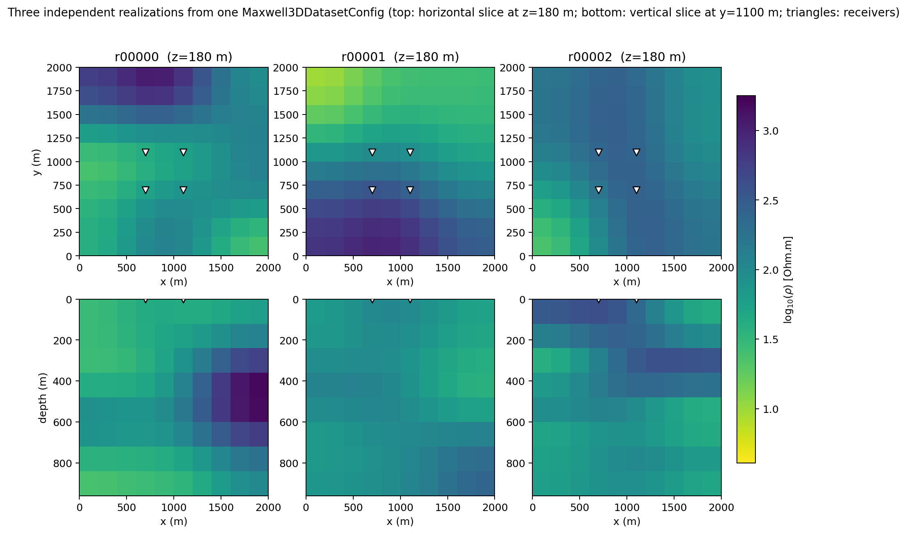
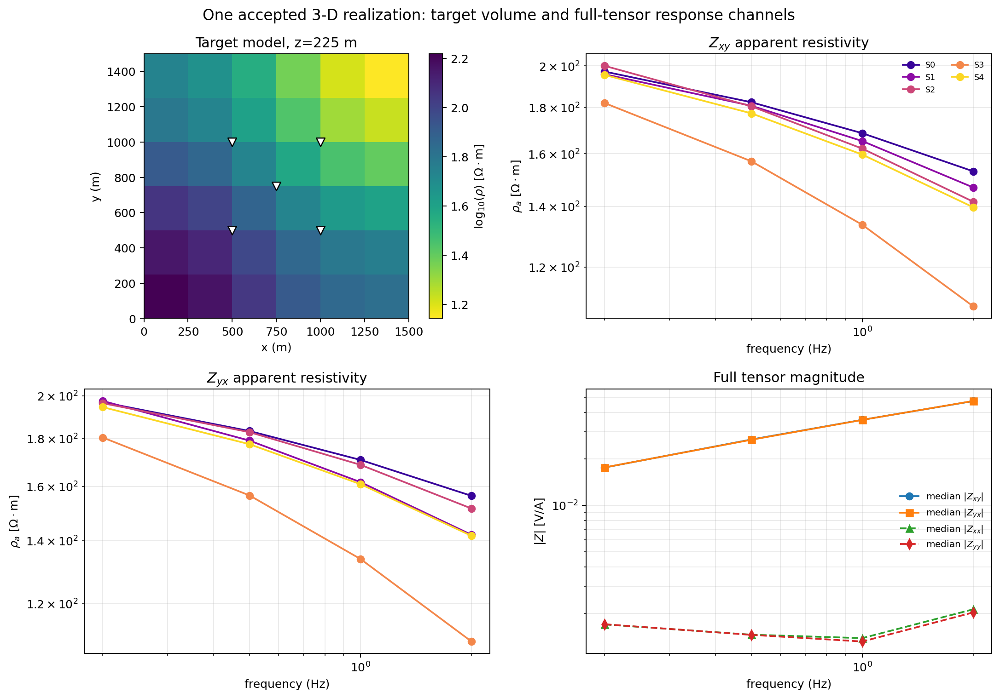

.. _ai_inversion_dataset3d:

3-D Maxwell training-data generation
====================================

:doc:`forward_physics` solves one Maxwell problem at a time, in whichever
dimension a backend supports. Training a network on genuinely 3-D structure
needs many such volumes, each converted into the same shape every later stage
agrees on. :func:`~pycsamt.ai.training.dataset3d.generate_3d_maxwell_dataset`
is that bridge for the third dimension: it draws a correlated 3-D resistivity
volume from :mod:`~pycsamt.ai.geology` for each realization, solves it with
the research-only, small-grid
:class:`~pycsamt.forward.maxwell.mt3d.MT3DAdapter` through
:func:`~pycsamt.forward.maxwell.batch.solve_batch`, and packages every
realization that converges into a
:class:`~pycsamt.ai.training.dataset3d.Maxwell3DDataset` with a
realization-level train/validation/test split and a
:class:`~pycsamt.ai.data.manifest.DatasetManifest`. A realization whose solve
does not converge is recorded and excluded, never silently included -- the
same contract :doc:`dataset2d` already enforces for two dimensions.

The module exists to give :class:`~pycsamt.agents.Inv3DAgent`'s
``physics="mt3d"`` mode (:doc:`agents`) something better than tiled
independent 1-D columns to train on. :term:`Genuine 3-D Maxwell training`
means every synthetic example is a spatially varying three-dimensional
conductivity volume whose response comes from one coupled solve, not from
stitching per-station 1-D results together and letting a graph network's
spatial smoothing paper over the seams afterward. :doc:`roadmap` tracks this
as M8's research slice -- wired end to end, but explicitly not yet the
milestone's production backend, which still targets the external, verified
:class:`~pycsamt.forward.maxwell.modem3d.ModEm3DAdapter` once its remaining
open items close.

As with the 2-D generator, this one is best read as four linked contracts
rather than one large function call: a geological volume defines the target,
a padded solver mesh and receiver layout define the forward problem, canonical
:class:`~pycsamt.ai.data.contracts.SurveyData` defines the response axes, and
the split plus manifest define which accepted realizations may be used for
each statistical role. The third dimension changes the middle two contracts
the most -- a uniform mesh that stays affordable at production scale in 2-D
is not affordable here, which is most of what makes this module more than a
coordinate relabeling of :doc:`dataset2d`.

Configuring a 3-D dataset
-------------------------

A :class:`~pycsamt.ai.training.dataset3d.Maxwell3DDatasetConfig` fixes
everything that must stay identical across realizations: the shared
``(z, y, x)`` :class:`~pycsamt.ai.geology.GeologyGrid`, three
correlation-length ranges instead of two -- horizontal in ``x``, horizontal in
``y``, and vertical in ``z`` -- the shared frequency grid, receiver
``(x, y)`` positions rather than a single ``x`` array, and a root
:term:`Random seed` from which every realization's correlation, field, and
solver seeds derive deterministically, following the same named-process
hierarchy :eq:`eq-ai-seed-hierarchy` describes for the geological prior:

.. code-block:: pycon

   >>> from pycsamt.ai.geology import GeologyGrid
   >>> from pycsamt.ai.training.dataset3d import (
   ...     Maxwell3DDatasetConfig,
   ...     generate_3d_maxwell_dataset,
   ... )

   >>> grid = GeologyGrid.regular_3d(
   ...     nx=4, ny=4, nz=6, dx_m=200, dy_m=200, dz_m=100
   ... )
   >>> config = Maxwell3DDatasetConfig(
   ...     dataset_id="demo-3d-v1",
   ...     grid=grid,
   ...     correlation_length_x_m=(400.0, 800.0),
   ...     correlation_length_y_m=(400.0, 800.0),
   ...     correlation_length_z_m=(100.0, 200.0),
   ...     frequencies_hz=[50.0, 20.0],
   ...     station_xy_m=[[400.0, 400.0], [600.0, 600.0]],
   ...     n_realizations=2,
   ...     seed=0,
   ...     validation_fraction=0.0,
   ...     test_fraction=0.0,
   ... )
   >>> config.components
   ('zxy', 'zyx')
   >>> config.grid.shape, config.station_xy_m.shape
   ((6, 4, 4), (2, 2))
   >>> config.to_dict()["schema_version"]
   1

   >>> dataset = generate_3d_maxwell_dataset(config)
   >>> len(dataset.samples), dataset.rejected
   (2, ())

``station_xy_m`` is an ``(n_stations, 2)`` array rather than
:doc:`dataset2d`'s single ``station_x_m`` axis, because a 3-D receiver no
longer sits on the one profile line a 2-D section implies -- it needs both
horizontal coordinates. Every accepted realization comes back as a
:class:`~pycsamt.ai.training.dataset3d.Maxwell3DSample` pairing the true
resistivity volume (the training target) with its simulated
:class:`~pycsamt.ai.data.contracts.SurveyData` response (the training input)
and the solver's own mesh size and residual:

.. code-block:: pycon

   >>> sample = dataset.samples[0]
   >>> sample.survey.shape
   (2, 2, 2)
   >>> sample.resistivity_ohm_m.shape
   (6, 4, 4)
   >>> sample.mesh_cells, round(sample.relative_residual, 6)
   (3584, 0.0)
   >>> f"{sample.relative_residual:.3e}"
   '2.004e-19'

The geological grid holds 96 cells (:math:`6\times4\times4`); the solver mesh
that produced this sample already needs 3,584, even at documentation scale
with two stations and two frequencies. That thirty-seven-fold gap is the
entire subject of the next section, not an incidental detail -- it is why a
2-D-style uniform mesh does not carry over to three dimensions.

         slice and a vertical slice per realization, from one shared
         Maxwell3DDatasetConfig.
   :align: center
   :width: 98%

   Three realizations from one :class:`Maxwell3DDatasetConfig`. Top row: a
   horizontal slice at fixed depth, one column per realization, with the four
   receivers (white triangles) at their shared ``(x, y)`` positions. Bottom
   row: a vertical slice through the same volume at fixed ``y``. All six
   panels share one color scale.

Reading a column top-to-bottom is the point of this figure. In the leftmost
realization the horizontal slice shows a resistive body in the upper-left
quadrant, and the vertical slice below it shows a *different* structure -- a
resistive zone appearing only below roughly 300 m near the right edge, not a
downward continuation of the shallow body above it. A field generated by
tiling independent 1-D columns could never produce this: every column would
be internally layered but identical in cross-section to its neighbours except
where the tiling itself changes. Here, resistivity genuinely depends on all
three coordinates at once, which is the property :term:`Genuine 3-D Maxwell
training` refers to and the reason the middle realization's shallow slice
(pale, resistive throughout) looks nothing like its own deeper slice
(uniformly mid-range) a few panels below.

A padded mesh, not a uniform one
--------------------------------

:doc:`dataset2d` affords a uniform lateral mesh because 2-D solver cell count
scales with the *square* of resolution. In three dimensions it scales with
the *cube*:

.. math::
   :label: eq-ai-dataset3d-cell-scaling

   N_{\text{cells}}\ \approx\
   \frac{L_x}{h_x}\cdot\frac{L_y}{h_y}\cdot\frac{L_z}{h_z},

where each :math:`L` is the mesh's padded extent along one axis and each
:math:`h` is its cell width there. A uniform mesh fine enough to resolve a
few-hundred-metre structure and extensive enough to reach several skin depths
in *three* independent directions at once is rarely affordable within
:attr:`Maxwell3DDatasetConfig.max_mesh_cells`. This module instead builds a
padded, non-uniform mesh: a core region at the geological grid's own native
resolution -- an exact, no-resample match to the model there -- surrounded by
cells that grow geometrically outward in ``x``/``y`` and downward in ``z``
until the padded extent reaches :attr:`~Maxwell3DDatasetConfig.mesh_safety_factor`
times the deepest relevant :term:`skin depth`. Far-field cells stay cheap
without ever coarsening the region that matters.

This is the same strategy :mod:`~pycsamt.forward.maxwell.mt3d`'s own
calibrated benchmark mesh uses, and for the same reason it was added there in
the first place: an earlier, uniform-only version of that solver failed its
layered-earth benchmark by 30-45%, which first looked like a boundary-condition
defect but turned out to be a mesh limitation -- a uniform mesh could not
reach several skin depths of padding *and* resolve a few-hundred-metre layer
interface within the same cell budget, because refining resolution on a small
uniform domain does not add padding, and adding padding on a coarse uniform
mesh does not add resolution. Generalizing the solver's discrete curl
operators to non-uniform cell widths broke that trade-off; see
:mod:`~pycsamt.forward.maxwell.mt3d`'s module docstring for the full
diagnosis. This module's own mesh construction exists so that fix has
somewhere to be used from training-data code, not just from a hand-built
benchmark.

Frequency-aware core resolution
-------------------------------

The core region's resolution defaults to the geological grid's own spacing.
That is affordable, but it is not free of a cost: :class:`MT3DAdapter`'s own
calibrated benchmark is validated at 1-2 Hz, and a fixed core resolution
sized for the grid rather than for the requested frequencies loses accuracy
as frequency rises and the true skin depth shrinks below what that
resolution can represent. ``cells_per_skin_depth`` decouples the two,
targeting a fixed number of core cells across the *shallowest* -- highest
frequency, lowest resistivity -- skin depth instead:

.. math::
   :label: eq-ai-dataset3d-core-resolution

   h_{\text{core}}=\min\!\left(h_{\text{grid}},\
   \frac{\delta_{\text{shallow}}}{n_{\delta}}\right),

where :math:`\delta_{\text{shallow}}` is :eq:`eq-ai-skin-depth` evaluated at
the highest requested frequency and the lowest resistivity present in that
realization's field, and :math:`n_{\delta}` is ``cells_per_skin_depth``. The
:math:`\min` matters as much as the ratio: refining below the grid's own
spacing would not add information the target volume actually contains, only
solver cost, so :eq:`eq-ai-dataset3d-core-resolution` never does that.

.. code-block:: pycon

   >>> import numpy as np
   >>> from pycsamt.forward.maxwell.benchmarks import half_space_impedance

   >>> def _high_frequency_error(cells_per_skin_depth):
   ...     grid4 = GeologyGrid.regular_3d(
   ...         nx=4, ny=4, nz=4, dx_m=200, dy_m=200, dz_m=100
   ...     )
   ...     config4 = Maxwell3DDatasetConfig(
   ...         dataset_id="hf-check",
   ...         grid=grid4,
   ...         correlation_length_x_m=(1.0, 2.0),
   ...         correlation_length_y_m=(1.0, 2.0),
   ...         correlation_length_z_m=(1.0, 2.0),
   ...         frequencies_hz=[50.0, 20.0],
   ...         station_xy_m=[[400.0, 400.0]],
   ...         n_realizations=1,
   ...         seed=0,
   ...         log_resistivity_mean=2.0,
   ...         log_resistivity_std=1e-6,
   ...         cells_per_skin_depth=cells_per_skin_depth,
   ...         validation_fraction=0.0,
   ...         test_fraction=0.0,
   ...     )
   ...     ds = generate_3d_maxwell_dataset(config4)
   ...     smp = ds.samples[0]
   ...     analytic4 = half_space_impedance(100.0, config4.frequencies_hz)
   ...     zxy4 = smp.survey.impedance[0, :, 0]
   ...     return np.abs(zxy4 - analytic4) / np.abs(analytic4), smp.mesh_cells

   >>> error_none, cells_none = _high_frequency_error(None)
   >>> np.round(error_none * 100, 2), cells_none
   (array([10.06,  5.94]), 1440)

   >>> error_coarse, cells_coarse = _high_frequency_error(4.0)
   >>> np.round(error_coarse * 100, 2), cells_coarse
   (array([10.06,  5.94]), 1440)

   >>> error_default, cells_default = _high_frequency_error(8.0)
   >>> np.round(error_default * 100, 2), cells_default
   (array([8.76, 5.25]), 3610)

``cells_per_skin_depth=4.0`` changes nothing here relative to the default
``None`` -- both give exactly 1,440 cells and identical error, because
:eq:`eq-ai-dataset3d-core-resolution`'s target resolution at that setting is
still coarser than the grid's own 200 m spacing, so the :math:`\min` selects
the grid spacing either way. Only ``8.0``, whose target resolution is finer
than 200 m, actually refines the core mesh, and it measurably helps: 50 Hz
error falls from 10.06% to 8.76%, 20 Hz from 5.94% to 5.25%, at roughly two
and a half times the cell count. It does not close the gap to the sub-2%
error this same benchmark achieves at 1-2 Hz on a mesh sized for that
frequency band. Raising ``cells_per_skin_depth`` further narrows the gap
again, paired with a larger ``max_mesh_cells`` budget to afford the finer
core it requests, but this is a genuine, bounded cost/accuracy trade-off of a
fixed, non-adaptive cell count -- not a bug awaiting a fix. A configuration
whose frequencies sit well above a couple of hertz should treat this section
as a checklist, not a formality: rerun a low-``log_resistivity_std``
realization like the one above against
:func:`~pycsamt.forward.maxwell.benchmarks.half_space_impedance` at the
actual requested frequencies before trusting labels generated there.

Fail fast before an impractical mesh
------------------------------------

Because the padded extent must reach several skin depths in three
directions rather than one or two, a low frequency, high resistivity, fine
grid spacing, or large ``mesh_safety_factor`` can request a mesh no
reasonable machine should build. ``max_mesh_cells`` reports the required
configuration instead of silently truncating the physics:

.. code-block:: pycon

   >>> guard_grid = GeologyGrid.regular_3d(
   ...     nx=4, ny=4, nz=6, dx_m=200, dy_m=200, dz_m=100
   ... )
   >>> guarded = Maxwell3DDatasetConfig(
   ...     dataset_id="guard-demo",
   ...     grid=guard_grid,
   ...     correlation_length_x_m=(400.0, 800.0),
   ...     correlation_length_y_m=(400.0, 800.0),
   ...     correlation_length_z_m=(100.0, 200.0),
   ...     frequencies_hz=[50.0, 20.0],
   ...     station_xy_m=[[400.0, 400.0], [600.0, 600.0]],
   ...     n_realizations=1,
   ...     seed=0,
   ...     max_mesh_cells=10,
   ...     validation_fraction=0.0,
   ...     test_fraction=0.0,
   ... )
   >>> try:
   ...     generate_3d_maxwell_dataset(guarded)
   ... except ValueError as exc:
   ...     print(str(exc).split(". ", 1)[0] + ".")
   requested configuration needs 2548 solver cells (padded extent 16906 x 16906 x 7492 m at 200x200x100 m native grid resolution), exceeding max_mesh_cells=10.

As with :doc:`dataset2d`'s equivalent guard, the right response is scientific
before it is computational: decide whether the frequency band, resistivity
prior, and safety factor are actually required, and only then decide whether
raising ``max_mesh_cells`` (with its runtime cost) or revising the
configuration is the honest fix. :class:`MT3DAdapter` remains a small-grid
research-only solver regardless of which choice is made -- see
:doc:`roadmap`'s M6 entry for why production 3-D work targets an external
backend instead of raising this cap indefinitely.

From impedance tensor to network channels
-----------------------------------------

A 2-D problem decouples into independent :term:`TE mode` and :term:`TM mode`
responses. A 3-D earth has no such decoupling: the solver returns the
:math:`2\times2` impedance tensor's requested components directly, and all
four -- :math:`Z_{xx}`, :math:`Z_{xy}`, :math:`Z_{yx}`, :math:`Z_{yy}` -- can
be nonzero at once. Apparent resistivity and phase are still derived
per component without changing the underlying SI provenance:

.. math::
   :label: eq-ai-dataset3d-response-transform

   \rho_a^{(c)}(s,f)=
   \frac{|Z_c(s,f)|^2}{\mu_0\,2\pi f},
   \qquad
   \phi^{(c)}(s,f)=\operatorname{atan2}
   \left(\Im Z_c,\Re Z_c\right),
   \qquad c\in\{xx,xy,yx,yy\}.

Equation :eq:`eq-ai-dataset3d-response-transform` is identical in form to
:doc:`dataset2d`'s :eq:`eq-ai-dataset2d-response-transform`; what changes is
that ``c`` now ranges over up to four tensor components instead of two modes,
and :attr:`Maxwell3DDatasetConfig.components` defaults to ``("zxy", "zyx")``
for the same reason ``mt3d_recovery`` in :doc:`agents` only trains on
``zxy`` -- it is the component the observed-feature pipeline already
consumes, so requesting the unused diagonal slots for synthetic data would
create a train/observation distribution mismatch rather than add
information.

An isotropic half-space earth *does* still decouple, which makes it a useful
check for the full tensor, not just for ``zxy``/``zyx``:

.. code-block:: pycon

   >>> hs_grid = GeologyGrid.regular_3d(
   ...     nx=4, ny=4, nz=4, dx_m=200, dy_m=200, dz_m=100
   ... )
   >>> hs_config = Maxwell3DDatasetConfig(
   ...     dataset_id="halfspace-check",
   ...     grid=hs_grid,
   ...     correlation_length_x_m=(1.0, 2.0),
   ...     correlation_length_y_m=(1.0, 2.0),
   ...     correlation_length_z_m=(1.0, 2.0),
   ...     frequencies_hz=[2.0, 1.0],
   ...     station_xy_m=[[400.0, 400.0]],
   ...     n_realizations=1,
   ...     seed=0,
   ...     log_resistivity_mean=2.0,
   ...     log_resistivity_std=1e-6,
   ...     validation_fraction=0.0,
   ...     test_fraction=0.0,
   ... )
   >>> hs_dataset = generate_3d_maxwell_dataset(hs_config)
   >>> hs_sample = hs_dataset.samples[0]
   >>> analytic = half_space_impedance(100.0, hs_config.frequencies_hz)
   >>> zxy = hs_sample.survey.impedance[0, :, 0]
   >>> zyx = hs_sample.survey.impedance[0, :, 1]
   >>> xy_error = np.abs(zxy - analytic) / np.abs(analytic)
   >>> round(float(np.max(xy_error)), 4)
   0.0151

   >>> # Zyx = -Zxy for an isotropic half-space (standard MT sign convention).
   >>> yx_error = np.abs(zyx - (-analytic)) / np.abs(analytic)
   >>> round(float(np.max(yx_error)), 4)
   0.0151

Both off-diagonal components agree with the analytic 100 :math:`\Omega\,`m
half-space to about 1.5% on this mesh, consistent with
:mod:`~pycsamt.forward.maxwell.mt3d`'s own measured ~1.9% normalized RMS on
its larger calibrated benchmark grid. The diagonal components are the more
telling check for a *3-D* solver specifically, since an isotropic half-space
predicts them to vanish exactly:

.. code-block:: pycon

   >>> hs_config_full = Maxwell3DDatasetConfig(
   ...     dataset_id="halfspace-check-full",
   ...     grid=hs_grid,
   ...     correlation_length_x_m=(1.0, 2.0),
   ...     correlation_length_y_m=(1.0, 2.0),
   ...     correlation_length_z_m=(1.0, 2.0),
   ...     frequencies_hz=[2.0, 1.0],
   ...     station_xy_m=[[400.0, 400.0]],
   ...     n_realizations=1,
   ...     seed=0,
   ...     log_resistivity_mean=2.0,
   ...     log_resistivity_std=1e-6,
   ...     components=("zxx", "zxy", "zyx", "zyy"),
   ...     validation_fraction=0.0,
   ...     test_fraction=0.0,
   ... )
   >>> full_sample = generate_3d_maxwell_dataset(hs_config_full).samples[0]
   >>> zxx = full_sample.survey.impedance[0, :, 0]
   >>> zyy = full_sample.survey.impedance[0, :, 3]
   >>> [f"{v:.1e}" for v in np.abs(zxx) / np.abs(analytic)]
   ['7.2e-11', '5.0e-10']
   >>> [f"{v:.1e}" for v in np.abs(zyy) / np.abs(analytic)]
   ['1.3e-10', '7.3e-10']

Both diagonal components are ten orders of magnitude below the off-diagonal
signal -- zero to numerical precision, not merely small. That gives a
genuinely 3-D solver a check a 2-D one cannot offer: a heterogeneous
realization that produces a *measurably* nonzero diagonal is showing real
lateral distortion, not solver noise.

         Zxy and Zyx at five stations, and full-tensor impedance magnitude
         including the diagonal components.
   :align: center
   :width: 96%

   One accepted, moderately heterogeneous realization. Upper-left: the
   target volume's shallowest slice, with five receivers (white triangles).
   Upper-right and lower-left: :math:`Z_{xy}` and :math:`Z_{yx}` apparent
   resistivity per station, colour-matched between panels. Lower-right:
   median impedance magnitude across all five stations for all four tensor
   components.

The lower-right panel is where the contrast with the half-space check above
lands. :math:`|Z_{xy}|` and :math:`|Z_{yx}|` are close enough here to overlap
almost completely, which is itself informative -- this particular
realization's correlated field is heterogeneous but not strongly
anisotropic in its overall response. :math:`|Z_{xx}|` and :math:`|Z_{yy}|`
sit roughly an order of magnitude lower, clearly separated from zero rather
than pinned at machine precision the way the half-space check's diagonal was.
That gap is the genuine 3-D distortion signal this module exists to expose to
training: a station near the resistive body in the upper-left panel sees a
different response than a station near the boundary at the lower-right, in a
way two independent 2-D cross-sections through the same volume would not
reproduce identically.

Handing this to noise, agents, or training
------------------------------------------

This module deliberately stops at a clean, forward-consistent response, the
same boundary :doc:`dataset2d` draws. Realistic field-like corruption --
heteroscedastic noise, dropout, static shift, and distortion fitted from a
real survey's own quality control -- is :doc:`domain_gap`'s job, kept
separate so a clean control volume always exists independently of whatever
noise model sits on top of it later.

:class:`~pycsamt.agents.Inv3DAgent`'s ``physics="mt3d"`` mode (:doc:`agents`)
is the nearest consumer: it builds a :class:`Maxwell3DDatasetConfig` from the
survey's own real station geometry, calls
:func:`generate_3d_maxwell_dataset` internally, and reports a genuine
held-out recovery check (:eq:`eq-agents-mt3d-recovery`) against known
synthetic truth rather than fabricating one. Its ``mesh_safety_factor``,
``max_mesh_cells``, ``cells_per_skin_depth``, ``geology_grid_nx_ny``, and
``geology_grid_nz`` constructor parameters map directly onto this module's
own configuration fields, so a mesh-guard message raised through the agent is
diagnosed with exactly the tools this page already covers.

Beyond a single agent, a :class:`Maxwell3DDataset`'s ``train``/
``validation``/``test`` partitions and its
:class:`~pycsamt.ai.data.manifest.DatasetManifest` are the same shape of
input :doc:`losses` trains against and :doc:`scientific_validation` reports
evidence from -- the realization-level split guards against the same leakage
:doc:`data_contracts` enforces for any other split. A training corpus should
still make its partition sizes explicit before committing a solve budget this
much larger per realization than :doc:`dataset2d`'s:

.. code-block:: pycon

   >>> plan_grid = GeologyGrid.regular_3d(
   ...     nx=8, ny=8, nz=8, dx_m=200.0, dy_m=200.0, dz_m=100.0
   ... )
   >>> station_xy = [
   ...     [x, y] for x in (400.0, 800.0, 1200.0) for y in (400.0, 800.0, 1200.0)
   ... ]
   >>> production_plan = Maxwell3DDatasetConfig(
   ...     dataset_id="volume-3d-v2",
   ...     grid=plan_grid,
   ...     correlation_length_x_m=(400.0, 1000.0),
   ...     correlation_length_y_m=(400.0, 1000.0),
   ...     correlation_length_z_m=(150.0, 400.0),
   ...     frequencies_hz=[20.0, 5.0, 1.0],
   ...     station_xy_m=station_xy,
   ...     n_realizations=200,
   ...     seed=42,
   ...     cells_per_skin_depth=8.0,
   ...     max_mesh_cells=20_000,
   ...     validation_fraction=0.15,
   ...     test_fraction=0.15,
   ... )
   >>> production_plan.n_realizations
   200
   >>> production_plan.validation_fraction, production_plan.test_fraction
   (0.15, 0.15)
   >>> production_plan.grid.shape
   (8, 8, 8)
   >>> production_plan.station_xy_m.shape
   (9, 2)

Two hundred realizations at up to 20,000 solver cells each is a configuration
to budget compute for deliberately, not a default to reach for. As with
:doc:`dataset2d`'s closing example, this is a shape check, not an adequacy
claim: whether 200 realizations, this correlation range, and this frequency
band are *sufficient* depends on the geological diversity and precision a
specific downstream evaluation needs, and that judgement belongs with
:doc:`scientific_validation`, not with this configuration object. After
generation, read partition sizes from ``dataset.split.sizes`` rather than
back-computing them from the requested fractions, since rejected solves are
removed before the split is applied, and persist ``dataset.manifest``
alongside every realization's clean ``realization_id`` so a later noise
variant from :doc:`domain_gap` never crosses a partition boundary.
