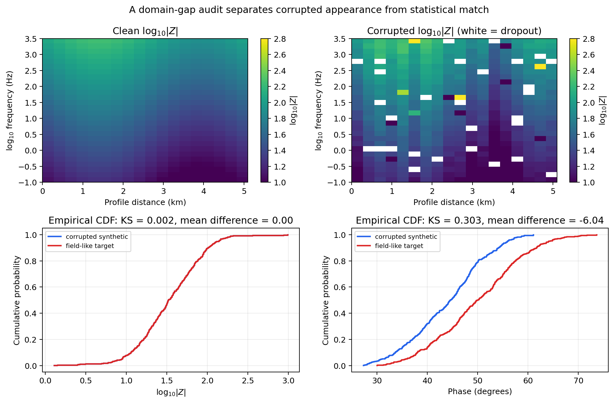

.. _ai_inversion_domain_gap:

Domain-gap and noise simulation
================================

A geological prior generator plus a verified forward solver, as
described in :doc:`geology_priors` and :doc:`dataset2d`, produces
clean, noiseless responses. Field data is never that well behaved.
:mod:`pycsamt.ai.domain_gap` exists to close some of that
:term:`domain gap` deliberately, by turning a clean
:class:`~pycsamt.ai.data.contracts.SurveyData` into one with realistic
:term:`error floor`, :term:`heteroscedastic noise`, :term:`static shift`,
:term:`galvanic distortion`, missing stations or frequencies, and
undetected outliers — instead of hoping that a generic noise term
covers what a real survey actually looks like.

Two families of corruption
------------------------------

:mod:`~pycsamt.ai.domain_gap.simulator` splits its corruption
functions into two families that behave differently on purpose.
Systematic effects multiply the true impedance by a per-station real
matrix and leave the shape of the declared error to scale with it.
:func:`~pycsamt.ai.domain_gap.simulator.apply_static_shift` draws a
station's shift factor log-normally,

.. math::
   :label: eq-ai-domaingap-static-shift

   c_s = 10^{\,X_s}, \qquad X_s \sim \mathcal N(0, \sigma_{\log_{10}}^2),

so that :math:`\sigma_{\log_{10}}` (``static_shift_log10_sigma``) is a
decade-scale spread rather than a linear one, matching how static
shift is normally reported:

.. code-block:: pycon

   >>> import numpy as np
   >>> from pycsamt.ai.data.contracts import SurveyData
   >>> from pycsamt.ai.domain_gap.simulator import apply_static_shift

   >>> z = np.ones((3, 2, 2), dtype=complex) * (100 + 100j)
   >>> survey = SurveyData(
   ...     z, [10.0, 1.0], ["A", "B", "C"], ["xy", "yx"],
   ...     [[0, 0], [1, 0], [2, 0]],
   ... )
   >>> shifted, info = apply_static_shift(
   ...     survey, log10_sigma=0.15, rng=np.random.default_rng(2),
   ...     return_info=True,
   ... )
   >>> np.round(info["static_shift_factor"], 4)
   array([1.0675, 0.8348, 0.867 ])

:func:`~pycsamt.ai.domain_gap.simulator.apply_galvanic_distortion`
follows the same idea with a full Groom-Bailey-style real 2x2 matrix
per station,

.. math::
   :label: eq-ai-domaingap-distortion-matrix

   D_s = g_s\,R(\theta_s)
   \begin{bmatrix} 1+e_s & s_s \\ s_s & 1-e_s \end{bmatrix},

combining a gain :math:`g_s` (log-normal, like the static-shift
factor), a rotation :math:`R(\theta_s)` by a twist angle
:math:`\theta_s`, a shear :math:`s_s`, and an anisotropy :math:`e_s` —
each independently normal with its own configured standard deviation
— and applies :math:`D_s` to every frequency of that station's
impedance at once. Systematic effects change the signal; they do not,
by themselves, say anything about how much to trust it.

Random effects are the opposite: they update
``impedance_error`` and the validity mask directly, so a corrupted
survey's declared uncertainty stays honest about what was actually
injected.
:func:`~pycsamt.ai.domain_gap.simulator.add_heteroscedastic_noise`
adds complex Gaussian noise per ``(station, frequency)`` pair scaled
by a relative level drawn uniformly from a configured range, and
combines it with any pre-existing declared error in quadrature rather
than overwriting it. For an observation :math:`Z_{sfc}`, the implemented
draw and propagated one-sigma error are

.. math::
   :label: eq-ai-domaingap-noise

   \begin{aligned}
   \widetilde Z_{sfc}
   &= Z_{sfc} + \alpha_{sf}|Z_{sfc}|
      \frac{\epsilon_R + i\epsilon_I}{\sqrt{2}},
      &\alpha_{sf} &\sim \mathcal U(\alpha_{\min},\alpha_{\max}),\\
   \epsilon_R,\epsilon_I &\sim \mathcal N(0,1),
      &\widetilde\sigma_{sfc}
      &= \sqrt{\sigma_{sfc}^2+(\alpha_{sf}|Z_{sfc}|)^2}.
   \end{aligned}

The :math:`1/\sqrt{2}` factor makes
:math:`\mathbb E[|\widetilde Z-Z|^2]=\alpha_{sf}^2|Z|^2`; without it,
the requested complex-noise variance would silently be doubled.
:func:`~pycsamt.ai.domain_gap.simulator.apply_error_floor`
clamps the declared error to a minimum fraction of :math:`|Z|`.

.. math::
   :label: eq-ai-domaingap-error-floor

   \sigma'_{sfc}=\max\!\left(\widetilde\sigma_{sfc},
      \eta|\widetilde Z_{sfc}|\right),

where :math:`\eta` is ``error_floor_fraction``. The floor changes the
*declared uncertainty*, not the impedance itself; it must therefore not be
interpreted as a mechanism that shifts the mean response.
:func:`~pycsamt.ai.domain_gap.simulator.apply_dropout` marks whole
stations, whole frequencies, or individual observations missing by
setting impedance to ``NaN``, which
:class:`~pycsamt.ai.data.contracts.SurveyData` construction then
turns into the authoritative validity mask automatically — no separate
bookkeeping needed. :func:`~pycsamt.ai.domain_gap.simulator.inject_outliers`
does the opposite of dropout: it perturbs a fraction of otherwise
*valid* observations by a large factor without invalidating them,
simulating a bad reading that quality control failed to flag — exactly
the case a robust downstream inverter has to tolerate, not just
detect.

The three dropout probabilities are independent draws before their masks
are combined. Consequently, a cell survives with probability

.. math::
   :label: eq-ai-domaingap-dropout

   P(\text{valid after dropout}) =
   (1-p_s)(1-p_f)(1-p_o),

provided it was valid on input. Here :math:`p_s`, :math:`p_f`, and
:math:`p_o` are station, frequency, and observation dropout rates. Their
sum is therefore not the expected missing fraction.

Composing one reproducible pass
------------------------------------

A real survey was not corrupted by one effect at a time, and neither
should a training example be.
:func:`~pycsamt.ai.domain_gap.simulator.apply_corruption_suite` runs
every step above in one fixed, physically motivated order — static
shift and distortion first, then noise, error floor, dropout, outliers,
and coordinate/elevation perturbation. A single seed spawns an independent child
generator per step, so adding a new step later does not change what
every earlier step draws. It returns both the corrupted survey and a
:class:`~pycsamt.ai.domain_gap.simulator.CorruptionRecord` of exactly
what was sampled, not just what was requested. Four named severities
in :data:`~pycsamt.ai.domain_gap.simulator.SEVERITY_PRESETS` turn a
whole parameter block into one word:

.. list-table::
   :header-rows: 1
   :widths: 22 20 16 21 21

   * - Preset
     - Noise level
     - Static shift :math:`\sigma_{\log_{10}}`
     - Station dropout
     - Outlier rate
   * - ``clean``
     - 0
     - 0
     - 0
     - 0
   * - ``in_distribution``
     - 1-3%
     - 0.05
     - 0
     - 0
   * - ``severe``
     - 5-15%
     - 0.15
     - 5%
     - 2%
   * - ``held_out_corruption``
     - 10-25%
     - 0.30
     - 15%
     - 8%

``clean`` is the required control set every :doc:`losses`/
:doc:`scientific_validation` comparison needs a baseline from;
``held_out_corruption`` is deliberately outside the range a model
should have been trained to expect, for out-of-distribution checks.

The record makes a generated sample auditable rather than merely
repeatable. It stores the complete configuration, its SHA-256 hash, the
parent seed, the preset name, and compact summaries of the concrete draws:

.. code-block:: pycon

   >>> import numpy as np
   >>> from pycsamt.ai.data.contracts import SurveyData
   >>> from pycsamt.ai.domain_gap import apply_corruption_suite

   >>> survey = SurveyData(
   ...     np.ones((8, 10, 1), dtype=complex) * (100 + 100j),
   ...     np.logspace(2, -1, 10),
   ...     [f"S{i}" for i in range(8)], ["xy"],
   ...     np.column_stack([np.arange(8) * 100, np.zeros(8)]),
   ... )
   >>> corrupted, record = apply_corruption_suite(
   ...     survey, severity="severe", seed=7
   ... )
   >>> corrupted.n_valid, survey.n_valid
   (70, 80)
   >>> record.severity
   'severe'
   >>> sorted(record.sampled)
   ['distortion_twist_deg_mean', 'dropped_fraction',
    'dropped_frequency_count', 'dropped_station_count', 'n_outliers',
    'static_shift_factor_mean']
   >>> record.to_dict()["config_hash"][:12]
   'c91ce027d0f0'

The seed reproduces the draw; the hash proves which parameter block was
used. Both belong in the run manifest described in :doc:`reproducibility`.

Fitting corruption from a real survey
-------------------------------------------

Guessed corruption ranges are still a guess. The more useful path is
fitting them from a real survey's own quality-control diagnostics.
:func:`~pycsamt.ai.domain_gap.survey_fit.survey_data_from_sites`
bridges anything :func:`~pycsamt.emtools._core.ensure_sites` accepts
into a canonical :class:`~pycsamt.ai.data.contracts.SurveyData`,
converting impedance from the EDI-native ``[mV/km]/[nT]`` convention
:class:`~pycsamt.site.base.Site.z` stores to the SI convention
:class:`SurveyData` declares — a real unit mismatch found and fixed
while building this bridge, confirmed against
:attr:`~pycsamt.site.base.Site.rho`'s own field-convention apparent
resistivity to floating-point precision. From there,
:func:`~pycsamt.ai.domain_gap.survey_fit.fit_corruption_config` reads
noise and dropout directly from the survey's declared
``impedance_error`` and coverage, while
:func:`~pycsamt.ai.domain_gap.survey_fit.fit_distortion_priors_from_sites`
calls the existing :func:`pycsamt.emtools.gb.groom_bailey_table` and
:func:`pycsamt.emtools.ss.estimate_ss_ama` diagnostics directly on the
sites to get an empirical static-shift and distortion spread — the
one part of this package that genuinely depends on a specific survey
rather than on literature defaults:

.. code-block:: pycon

   >>> from pycsamt.emtools._core import ensure_sites
   >>> from pycsamt.ai.domain_gap import (
   ...     survey_data_from_sites,
   ...     fit_corruption_config,
   ...     fit_distortion_priors_from_sites,
   ... )

   >>> sites = ensure_sites(
   ...     "data/AMT/WILLY_data/L18PLT", recursive=True, verbose=0
   ... )
   >>> field = survey_data_from_sites(sites, recursive=False, verbose=0)
   >>> field.shape
   (28, 53, 4)

   >>> config = fit_corruption_config(field)
   >>> tuple(round(v, 4) for v in config.noise_level_range)
   (0.0509, 0.1582)
   >>> round(config.error_floor_fraction, 4)
   0.0297

The fitted noise range (5-16% relative) and error floor (about 3% of
:math:`|Z|`) come entirely from L18's own declared errors, not from a
default — a survey with tighter QC would fit a narrower range without
anyone having to retune a preset by hand.

More precisely, the fitter uses the finite ratios
:math:`r=\sigma_Z/|Z|`: the 25th and 75th percentiles define the noise
range, while the 5th percentile defines the floor. Missing fractions by
station, frequency, and observation supply the corresponding dropout
rates. ``severity_scale`` multiplies those estimates before rates are
clipped to :math:`[0,1]`; it is a controlled stress multiplier, not a
statistically fitted confidence bound. Static shift and distortion priors
must still be fitted from sites separately because they require the
Groom--Bailey and AMA diagnostics, not only the canonical error tensor.

Comparing simulated and field distributions
--------------------------------------------------

Fitting a corruption config is not, by itself, evidence that it
closes the domain gap. :mod:`~pycsamt.ai.domain_gap.report` computes
that evidence directly: per-feature summary statistics and a
two-sample :term:`Kolmogorov--Smirnov statistic` between a simulated and a field
survey, on ``log_impedance_magnitude``, ``phase_deg``, and
``error_to_magnitude_ratio`` — features derived from the shared
:class:`SurveyData` contract so the comparison never depends on how
either survey was produced. The real M3 workflow applies a
field-fitted config to a *clean synthetic* survey, not back onto the
field survey itself, so the comparison actually tests whether a
generic geological prior looks like the target survey:

For empirical cumulative distribution functions :math:`F_n` and
:math:`G_m`, the reported statistic is

.. math::
   :label: eq-ai-domaingap-ks

   D_{n,m}=\sup_x |F_n(x)-G_m(x)|.

:math:`D=0` means the empirical distributions coincide; larger values
identify a stronger marginal mismatch. The accompanying p-value tests an
equal-distribution null hypothesis, but it is sample-size dependent and is
not an engineering acceptance threshold. Define tolerances for the KS
statistic, mean difference, and standard-deviation ratio before looking at
the result, and compare frequency bands and component sets that are
scientifically commensurate.

.. code-block:: pycon

   >>> from pycsamt.ai.geology import GeologyGrid
   >>> from pycsamt.ai.training.dataset2d import (
   ...     Maxwell2DDatasetConfig,
   ...     generate_2d_maxwell_dataset,
   ... )
   >>> from pycsamt.ai.domain_gap import (
   ...     apply_corruption_suite,
   ...     compare_survey_distributions,
   ... )

   >>> grid = GeologyGrid.regular_2d(nx=10, nz=8, dx_m=300, dz_m=150)
   >>> ds_config = Maxwell2DDatasetConfig(
   ...     dataset_id="willy-like-clean",
   ...     grid=grid,
   ...     correlation_length_x_m=(600.0, 1200.0),
   ...     correlation_length_z_m=(200.0, 400.0),
   ...     frequencies_hz=np.logspace(0, 4, 20),
   ...     station_x_m=list(np.linspace(500.0, 2500.0, 10)),
   ...     n_realizations=1,
   ...     seed=1,
   ...     log_resistivity_mean=2.0,
   ...     log_resistivity_std=0.4,
   ...     validation_fraction=0.0,
   ...     test_fraction=0.0,
   ... )
   >>> dataset = generate_2d_maxwell_dataset(ds_config)
   >>> clean_synthetic = dataset.samples[0].survey

   >>> corrupted, record = apply_corruption_suite(
   ...     clean_synthetic, config, seed=3
   ... )
   >>> report = compare_survey_distributions(corrupted, field)
   >>> magnitude = report.comparisons["log_impedance_magnitude"]
   >>> round(magnitude.ks_statistic, 4), round(magnitude.mean_difference, 4)
   (0.1376, 0.0445)
   >>> phase = report.comparisons["phase_deg"]
   >>> round(phase.ks_statistic, 4), round(phase.mean_difference, 2)
   (0.2908, -13.13)

The small magnitude mean difference says that these two examples happen to
share a similar central magnitude scale. It does *not* show that the fitted
noise or error floor caused the match: equation
:eq:`eq-ai-domaingap-error-floor` changes uncertainty only, and the noise in
equation :eq:`eq-ai-domaingap-noise` is zero-mean. The magnitude KS
statistic of 0.14 still exposes differences in distribution shape. The phase comparison
is the more honest result: a KS statistic of 0.29 and a 13-degree mean
offset show that a generic correlated-field prior with only
kilometre-scale correlation lengths does not reproduce L18's real
phase behaviour, which reflects genuine 2-D and 3-D structure this
small demonstration grid was never built to represent. That gap is
exactly what :doc:`geology_priors` and :doc:`../forward/index`'s
survey-specific tuning — not the noise model — would need to close;
:mod:`~pycsamt.ai.domain_gap.report` is what makes that distinction
visible instead of hiding it behind one aggregate "looks about right."

The same distinction is visible in a smaller deterministic diagnostic. The
upper panels below show how systematic shifts create station-wise vertical
bands, outliers form isolated extreme cells, and dropout cuts white holes
through an otherwise smooth response. In the empirical CDFs below them,
the magnitude curves nearly overlap (:math:`D=0.002`) while a six-degree
phase displacement produces :math:`D=0.303`. A survey can therefore look
suitably messy and still have the wrong physics in one feature.

   A reproducible domain-gap diagnostic generated with
   :func:`~pycsamt.ai.domain_gap.simulator.apply_corruption_suite` and
   :func:`~pycsamt.ai.domain_gap.report.compare_survey_distributions`.

Accounting for every station, not just corruption
--------------------------------------------------------

A different, related question — is *this* survey internally coherent
enough to trust at all, station by station — is
:func:`~pycsamt.ai.domain_gap.audit.audit_survey`'s job, covered in
full in :ref:`ai_inversion_data_contracts_audit`. It lives in this
package for the same reason the functions above do: it depends on the
pandas-based dimensionality and distortion diagnostics
:mod:`pycsamt.ai.data` deliberately excludes.
