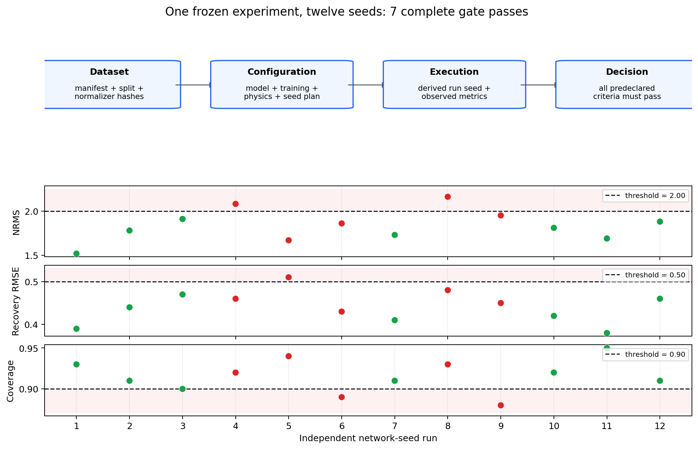

.. _ai_inversion_experiments:

Reproducible experiment configuration
=======================================

Every other package in :doc:`roadmap`'s map produces evidence: a
geological realization, a forward response, a fitted normalizer, a
loss value. None of that evidence answers a simpler question a
reviewer always asks first — what exactly produced this result, and
against what threshold was it judged acceptable?
:mod:`pycsamt.ai.experiments` exists to answer that question
*before* a run starts, not by reconstructing it afterward from
scattered scripts and a remembered epoch count. Its scope is
deliberately narrow: it describes what an experiment is — a pinned
dataset, a seed lineage, a configuration, a set of acceptance
criteria — without importing a machine-learning framework or
constructing a Maxwell solver. A config object here is a record, not
a runner.

Deriving stable, order-independent seeds
------------------------------------------

A single global ``seed=42`` sounds reproducible until two subsystems
happen to draw from the same generator in a different order between
runs, or a training seed and a data-shuffling seed accidentally
coincide.
:class:`~pycsamt.ai.experiments.config.SeedPlan` replaces that with
one root seed and a namespace, from which every named subsystem
derives its own child seed deterministically:

.. math::
   :label: eq-ai-experiments-seed-derive

   \mathrm{derive}(\ell) = \mathrm{uint}_{32}\!\Big(
   \mathrm{SHA\text{-}256}(n \mathbin\Vert r \mathbin\Vert \ell)[0{:}4]
   \Big),

where :math:`n` is the namespace, :math:`r` the root seed, :math:`\ell`
the label, and :math:`\mathbin\Vert` byte-string concatenation with a
null separator between fields. Equation
:eq:`eq-ai-experiments-seed-derive` is a pure function of its three
inputs, which is exactly what makes it useful: the same label always
derives the same seed from the same plan, regardless of how many
other labels were requested first or in what order.

The 32-bit result is compatible with NumPy and common learning frameworks,
but it is not a mathematical guarantee of uniqueness. If :math:`k` distinct
labels behave like independent hash inputs, the birthday approximation gives

.. math::
   :label: eq-ai-experiments-seed-collision

   P(\text{at least one collision}) \approx
   1-\exp\!\left[-\frac{k(k-1)}{2^{33}}\right].

For 100 labels this is about :math:`1.15\times10^{-6}`; for 1,000 labels it
is about :math:`1.16\times10^{-4}`. Ordinary experiments are therefore very
unlikely to collide, but a large sweep should derive all labels once with
:meth:`~pycsamt.ai.experiments.config.SeedPlan.derive_many` and assert that
the returned *values* are unique. The namespace is a domain separator, not
extra entropy: changing it intentionally creates a different seed lineage.

.. code-block:: pycon

   >>> from pycsamt.ai.experiments.config import SeedPlan

   >>> plan = SeedPlan(42, namespace="willy-l18")
   >>> plan.derive("geology") == plan.derive("geology")
   True
   >>> plan.derive("geology") == plan.derive("network")
   False
   >>> plan.derive("network")
   2959107669
   >>> children = plan.derive_many(["geology", "network", "shuffle"])
   >>> len(children) == len(set(children.values()))
   True

This is not a hypothetical convenience: :doc:`dataset2d`'s
:func:`~pycsamt.ai.training.dataset2d.generate_2d_maxwell_dataset`
builds one :class:`SeedPlan` from a dataset configuration's root seed
and derives a labeled ``f"{realization_id}/correlation"`` and
``f"{realization_id}/field"`` seed for every realization it
generates, so regenerating realization 47 alone, on a different
machine, still draws the exact field and correlation-length values
realization 47 drew the first time — no realization's randomness
depends on how many realizations were requested before it.

Pinning a dataset by hash, not by path
-------------------------------------------

A file path is not a stable reference: ``willy_l18.npz`` can be
silently regenerated, moved, or overwritten while an experiment
record still points at its old location and nobody notices until
results stop reproducing.
:class:`~pycsamt.ai.experiments.config.DatasetReference` pins an
experiment to the SHA-256 digests :doc:`data_contracts` already
produces for exactly this purpose — a
:class:`~pycsamt.ai.data.manifest.DatasetManifest`'s
``manifest_hash``, a
:class:`~pycsamt.ai.data.splits.RealizationSplit`'s ``split_hash``,
and, when the experiment normalizes data, a
:class:`~pycsamt.ai.data.normalization.ComplexZScore`'s
``state_hash`` — rather than to a path a caller might record as an
afterthought:

.. code-block:: pycon

   >>> from pycsamt.emtools._core import ensure_sites
   >>> from pycsamt.ai.domain_gap import survey_data_from_sites
   >>> from pycsamt.ai.data.normalization import ComplexZScore
   >>> from pycsamt.ai.data.splits import RealizationSplit
   >>> from pycsamt.ai.data.manifest import DatasetManifest
   >>> from pycsamt.ai.experiments.config import DatasetReference

   >>> sites = ensure_sites(
   ...     "data/AMT/WILLY_data/L18PLT", recursive=True, verbose=0
   ... )
   >>> field = survey_data_from_sites(sites, recursive=False, verbose=0)
   >>> state = ComplexZScore.fit(field)
   >>> split = RealizationSplit(("willy-l18",), (), ())
   >>> manifest = DatasetManifest(
   ...     dataset_id="willy-l18-zscore-v1",
   ...     generator="pycsamt.ai.data.normalization.ComplexZScore",
   ...     generator_version="1.0",
   ...     configuration={"weighting": "uniform", "eps": 1e-8},
   ...     split=split,
   ...     sample_count=field.n_stations,
   ... )

   >>> dataset_reference = DatasetReference(
   ...     "willy-l18-zscore-v1",
   ...     manifest.manifest_hash,
   ...     split.split_hash,
   ...     normalization_hash=state.state_hash,
   ... )
   >>> dataset_reference.manifest_hash == manifest.manifest_hash
   True

Every digest above comes from the exact same L18 objects
:doc:`data_contracts` builds and checks: this is not a parallel
bookkeeping scheme, it is those hashes read back into a record that
names which dataset, which split, and which fitted normalizer an
experiment actually used.

These digests provide :term:`content integrity`, not storage or automatic
verification. :class:`DatasetReference` checks that each supplied digest has
the syntax of a SHA-256 value; it does not open ``manifest_uri`` and prove
that the object currently stored there has that digest. At the execution
boundary, load the manifest, split, and normalizer, recompute their hashes,
and refuse the run if any value differs from the reference. A URI answers
"where might I retrieve it?" while the digest answers "is this the object I
approved?" Neither substitutes for the other.

Fixing acceptance criteria before looking at results
----------------------------------------------------------

Choosing a passing threshold after seeing the score is not
validation, it is curve fitting to one run.
:class:`~pycsamt.ai.experiments.config.AcceptanceCriterion` exists to
make that impossible by construction: a metric name, a comparison
operator, and a threshold, frozen into the experiment record before
any metric is observed. A held-out :term:`RMS misfit` threshold is
the most natural example — the same normalized residual concept
:doc:`scientific_validation` computes and this page's criteria merely
give a name and a number to:

.. code-block:: pycon

   >>> from pycsamt.ai.experiments.config import AcceptanceCriterion

   >>> nrms_ok = AcceptanceCriterion(
   ...     "test.impedance_nrms", "<=", 2.0, "response fit vs. observed"
   ... )
   >>> nrms_ok.evaluate(1.6)
   True
   >>> nrms_ok.evaluate(2.4)
   False

A single criterion is only half the picture; a real experiment
usually predeclares several, and
:meth:`~pycsamt.ai.experiments.config.ExperimentConfig.evaluate_gate`
checks all of them together as one
:class:`~pycsamt.ai.experiments.config.GateEvaluation`. Crucially, a
metric an experiment forgot to compute is not silently skipped — it
counts as an incomplete, failing gate rather than a passing one by
omission:

With criteria :math:`C_j(m_j)` evaluated on observed metrics :math:`m_j`,
the final decision is the logical conjunction

.. math::
   :label: eq-ai-experiments-gate

   G = \left(\bigwedge_{j=1}^{J} C_j(m_j)\right)
       \land \left(\mathcal M = \varnothing\right),

where :math:`\mathcal M` is the set of missing required metrics. Thus one
failure or one missing value makes :math:`G` false. NaN and infinity are
rejected rather than compared, and duplicate metric names are forbidden.
Avoid ``==`` for floating-point scientific metrics unless exact equality is
truly meaningful; a tolerance expressed with ``<=`` or ``>=`` is normally
the defensible choice.

.. code-block:: pycon

   >>> criteria = [
   ...     AcceptanceCriterion("test.impedance_nrms", "<=", 2.0),
   ...     AcceptanceCriterion("test.recovery_rmse", "<=", 0.5),
   ... ]
   >>> from pycsamt.ai.experiments.config import ExperimentConfig, SeedPlan
   >>> config = ExperimentConfig(
   ...     "willy-l18-mt2d-v1",
   ...     "learning_2d",
   ...     dataset_reference,
   ...     SeedPlan(42, namespace="willy-l18"),
   ...     model={"architecture": "unet", "lambda_x": 0.1, "lambda_z": 0.1},
   ...     training={"epochs": 100, "batch_size": 8},
   ...     physics={"solver": "mt2d", "components": ["zxy"]},
   ...     acceptance=criteria,
   ... )

   >>> full = config.evaluate_gate(
   ...     {"test.impedance_nrms": 1.6, "test.recovery_rmse": 0.42}
   ... )
   >>> full.passed
   True

   >>> partial = config.evaluate_gate({"test.impedance_nrms": 1.6})
   >>> partial.passed, partial.complete, partial.missing
   (False, False, ('test.recovery_rmse',))

``partial`` never claims a pass it cannot support: with
``test.recovery_rmse`` unmeasured, ``complete`` is ``False`` and the
gate fails, even though the one metric it did see would have passed
on its own. That asymmetry — silence must fail, never pass — is the
whole point of predeclaring criteria in the first place.

The complete configuration
------------------------------

:class:`~pycsamt.ai.experiments.config.ExperimentConfig` is where a
:class:`DatasetReference`, a :class:`SeedPlan`, and a list of
:class:`AcceptanceCriterion` join model/training/physics sections
that are frozen and hashed *without being interpreted*. That
restriction is deliberate: this class has no opinion on whether
``{"architecture": "unet"}`` is a valid U-Net configuration, because
answering that would require importing the very training framework
this package exists to stay independent of. Validating those
sections is :doc:`training`'s and :doc:`model_selection`'s job, not
this one's — its own job is to make sure the sections used for a
given run are pinned exactly and reproducibly.

.. code-block:: pycon

   >>> config.config_hash == config.config_hash
   True
   >>> config.child_seed("network") == config.seeds.derive("network")
   True

The ``stage`` field is not free text either: it must be one of eleven
fixed values, and those eleven are not arbitrary — they are
:doc:`roadmap`'s own M0-M10 stages, spelled as portable identifiers
instead of milestone codes.

.. list-table::
   :header-rows: 1
   :widths: 12 22 66

   * - Milestone
     - ``stage`` value
     - Roadmap scope
   * - M0
     - ``baseline``
     - Baseline freeze and reproducibility
   * - M1
     - ``data_audit``
     - Survey data contract and audit
   * - M2
     - ``geology``
     - Correlated geological priors
   * - M3
     - ``domain_gap``
     - Domain-gap and noise simulation
   * - M4
     - ``forward_2d``
     - Genuine 2-D electromagnetic forward path
   * - M5
     - ``learning_2d``
     - Response-aware 2-D learning
   * - M6
     - ``feasibility_3d``
     - 3-D Maxwell solver feasibility
   * - M7
     - ``forward_3d``
     - Verified 3-D forward backend
   * - M8
     - ``learning_3d``
     - Correlated 3-D training and spatial model
   * - M9
     - ``hybrid``
     - Hybrid inversion and uncertainty
   * - M10
     - ``field_evaluation``
     - Blind evaluation and release

An :class:`ExperimentConfig` therefore cannot claim to belong to a
stage that :doc:`roadmap` does not itself define, which is what makes
``config.stage`` a meaningful, checkable fact about a run rather than
a free-form label a spreadsheet would need to interpret by
convention. Saving and reloading the record is a plain, deterministic
JSON round trip, exactly like :doc:`data_contracts`'s manifests and
audit reports:

.. code-block:: pycon

   >>> from pathlib import Path
   >>> from tempfile import TemporaryDirectory

   >>> with TemporaryDirectory() as directory:
   ...     path = config.write_json(Path(directory) / "experiment.json")
   ...     reloaded = ExperimentConfig.read_json(path)
   ...     print(reloaded.config_hash == config.config_hash)
   True

A ``config_hash`` mismatch after that round trip would mean the
configuration was not actually reproduced — reloading it and getting
the same digest back is the check, not an assumption.

The digest is computed from canonical JSON over every serialized field,
including ``created_utc``. Mapping key order does not affect it, while a
changed threshold, tag, timestamp, dataset hash, or nested model value does.
Consequently, two scientifically identical configurations created with
different timestamps have different hashes. If the hash is intended to
identify a protocol rather than an individual record, either hold
``created_utc`` fixed or leave it ``None`` and timestamp the execution record
instead. The in-memory mappings and sequences are recursively frozen, which
prevents accidental mutation after the hash has been reviewed.

One frozen protocol still needs repeated runs
------------------------------------------------

Neural optimisation is stochastic even when the dataset and protocol are
fixed. A result from one favourable network seed estimates neither central
performance nor run-to-run instability. Keep one :class:`ExperimentConfig`
and derive labels such as ``network/run-000`` through ``network/run-011``;
then report every run, the aggregate distribution, and the fraction satisfying
the complete gate. Do not alter ``experiment_id`` or thresholds after seeing
which seeds fail.

The diagnostic below makes that distinction concrete. Every point belongs to
the same frozen configuration and dataset; colour indicates the *joint* gate,
not whether the point passes the panel in which it appears. Run 4, for
example, has acceptable recovery RMSE and coverage but fails because NRMS is
above 2.0. Run 5 fails only the RMSE threshold, while run 6 fails coverage.
Seven of twelve runs pass all three criteria. Reporting only their mean would
hide both the failure modes and the probability of obtaining an acceptable
training outcome.

   A pinned experiment protocol followed by per-seed joint-gate evaluation.
   Dashed lines are thresholds fixed before the metrics were generated.

What the configuration does not prove
----------------------------------------

An :class:`ExperimentConfig` is deliberately a source-of-truth *input*, not
an experiment tracker or execution attestation. Its hash does not prove that
the declared solver, dataset, or seed was actually used, and the current
:mod:`pycsamt.ai.experiments` package does not automatically capture runtime
artifacts. A reproducible hand-off must therefore pair the configuration JSON
and its hash with, at minimum:

* the observed metrics and serialized
  :class:`~pycsamt.ai.experiments.config.GateEvaluation` state;
* derived seed labels and values for every stochastic subsystem;
* source revision, pyCSAMT and dependency versions, solver backend, numerical
  precision, device, and deterministic-runtime settings;
* checkpoint, prediction, log, and report checksums; and
* start/end timestamps plus termination status.

Those are execution evidence, whereas the configuration is the approved
protocol. Keeping the two roles separate prevents a common provenance error:
a perfectly hashed declaration being mistaken for proof that the declared
computation took place. The broader packaging workflow in
:doc:`reproducibility` supplies the natural home for that evidence.
