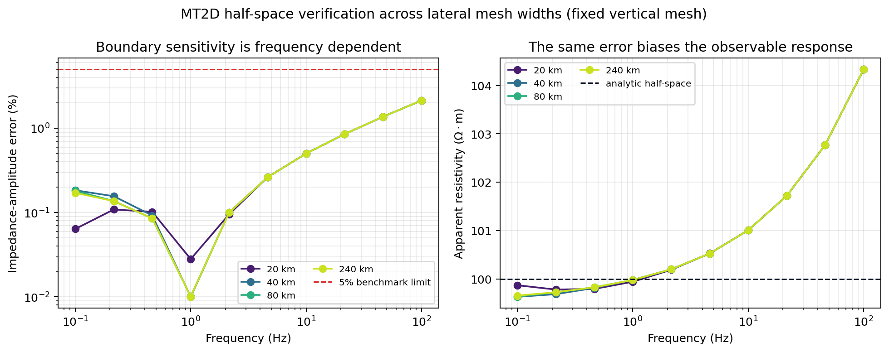
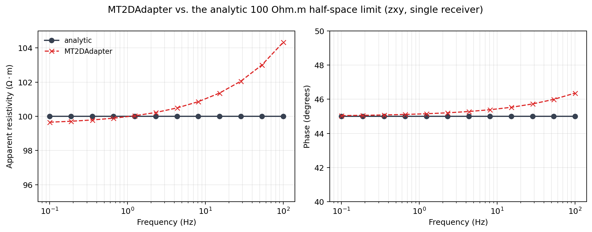

.. _ai_inversion_forward_physics:

Solver-neutral Maxwell contracts
================================

:doc:`roadmap`'s governing equation
:eq:`eq-ai-roadmap-maxwell` can be solved by more than one program: an
in-repo finite-difference solver, a research-only in-house 3-D
curl-curl solve, or an external Fortran executable. Every one of
those needs to hand :doc:`losses` and :doc:`scientific_validation` the
same shape of answer, or those packages would need a special case per
solver. :mod:`pycsamt.forward.maxwell` is that shared boundary: a
problem/result contract every backend consumes and produces
identically, a validated execution path no adapter can bypass, and a
set of analytic benchmarks that turn "this backend works" from a
claim into a number.

The problem and result contracts
------------------------------------

A :class:`~pycsamt.forward.maxwell.contracts.MaxwellMesh` is a
rectilinear grid of cell edges; a
:class:`~pycsamt.forward.maxwell.contracts.ReceiverSet` is named
observation locations in that mesh's coordinates. Together with a
conductivity array and a frequency list, they make up a
:class:`~pycsamt.forward.maxwell.contracts.MaxwellProblem` — every
physical input a backend needs and nothing else:

.. code-block:: pycon

   >>> import numpy as np
   >>> from pycsamt.forward.maxwell import (
   ...     MaxwellMesh, ReceiverSet, MaxwellProblem,
   ... )

   >>> mesh = MaxwellMesh(np.linspace(0, 10_000, 41), np.linspace(0, 5_000, 31))
   >>> mesh.shape, mesh.dimension
   ((30, 40), 2)
   >>> receivers = ReceiverSet([[5_000.0, 0.0]], ["S00"])
   >>> problem = MaxwellProblem(
   ...     mesh,
   ...     np.full(mesh.shape, 1.0 / 100.0),
   ...     [10.0, 1.0],
   ...     receivers,
   ...     ("zxy", "zyx"),
   ... )
   >>> problem.problem_hash
   '0db2d50b944706f3ad5f349e3d5c71e9d3c182bf5357373f0f7fa2788301308a'

That hash is deterministic in the physical content, not the Python
object identity: building the exact same mesh, conductivity,
frequencies, and receivers a second time reproduces it exactly, which
is what lets :mod:`~pycsamt.forward.maxwell.cache` key a cache
entry, or an experiment record pin the problem it was tested against,
by content rather than by an incidental variable name. The contract
also rejects a request the physics cannot honor, before any solver
ever sees it:

.. code-block:: pycon

   >>> MaxwellProblem(
   ...     mesh, np.full(mesh.shape, 0.01), [10.0], receivers, ("zxx",)
   ... )
   Traceback (most recent call last):
   ...
   ValueError: 2-D problems support only zxy and zyx impedance components.

A 2-D TE/TM formulation has no ``zxx``/``zyy`` diagonal response by
construction, so requesting one is not a solver limitation to work
around — it is a request the 2-D physics itself cannot answer, and
:class:`MaxwellProblem` says so immediately rather than letting a
solver silently return zeros for it.
:class:`~pycsamt.forward.maxwell.contracts.ForwardResult` is the
matching output half of the contract: complex impedance in the same
canonical ``(station, frequency, component)`` order
:class:`~pycsamt.ai.data.contracts.SurveyData` uses, plus a
:class:`~pycsamt.forward.maxwell.contracts.SolverDiagnostics` record
of convergence and residuals — never a bare array a caller has to
trust blindly.

The contract stores SI impedance in volts per ampere. For angular frequency
:math:`\omega=2\pi f` and magnetic permeability :math:`\mu`, the observable
quantities normally inspected by an MT user, :term:`apparent resistivity` and
:term:`phase`, are

.. math::
   :label: eq-ai-forwardphysics-observables

   \rho_a(f)=\frac{|Z(f)|^2}{\omega\mu},
   \qquad
   \phi(f)=\operatorname{atan2}(\Im Z(f),\Re Z(f)).

Equation :eq:`eq-ai-forwardphysics-observables` is also an immediate unit
check: substituting EDI field units directly would produce the wrong apparent
resistivity scale. Under the package's ``exp(+iwt)`` convention, the analytic
``zxy`` half-space response has positive 45-degree phase:

.. code-block:: pycon

   >>> import numpy as np
   >>> from pycsamt.forward.maxwell.benchmarks import half_space_impedance

   >>> frequency = np.array([100.0, 10.0, 1.0, 0.1])
   >>> impedance = half_space_impedance(100.0, frequency)
   >>> np.round(impedance, 6)
   array([0.198692+0.198692j, 0.062832+0.062832j,
          0.019869+0.019869j, 0.006283+0.006283j])
   >>> mu0 = 4e-7 * np.pi
   >>> rho_a = np.abs(impedance) ** 2 / (2 * np.pi * frequency * mu0)
   >>> np.round(rho_a, 6)
   array([100., 100., 100., 100.])
   >>> np.round(np.angle(impedance, deg=True), 3)
   array([45., 45., 45., 45.])

Do not infer a component convention from phase alone. Reversing electric or
magnetic field orientation changes an impedance sign and can shift the raw
phase by 180 degrees without changing :math:`\rho_a`. Compare components only
after matching axis orientation, Fourier convention, and any phase wrapping;
the canonical names preserve order, but they cannot repair incompatible input
conventions.

A validated execution path, not just an interface
-------------------------------------------------------

Any Python object with a matching ``solve`` method could call itself
a Maxwell backend; nothing would stop it from returning a result with
the wrong axes or silently claiming success on a diverged solve. That
is exactly what
:class:`~pycsamt.forward.maxwell.adapters.BaseMaxwellAdapter` closes
off: every adapter's :meth:`~pycsamt.forward.maxwell.adapters.BaseMaxwellAdapter.solve`
assesses the problem against declared
:class:`~pycsamt.forward.maxwell.backends.BackendCapabilities` first,
runs the concrete backend second, and validates the returned result
against the problem a third time — a subclass only ever implements
the middle step, so it cannot skip the checks around it even by
accident. The two demonstration adapters below make each check
concrete instead of abstract:

.. code-block:: pycon

   >>> from pycsamt.forward.maxwell import (
   ...     SolverDiagnostics, ForwardResult, BackendCapabilities,
   ...     CallableMaxwellAdapter,
   ... )

   >>> cap_3d_only = BackendCapabilities(
   ...     "demo3d", "1", (3,), ("zxy", "zyx"), verified_benchmarks=("half-space",)
   ... )
   >>> def solver_ok(p):
   ...     diagnostics = SolverDiagnostics([[True]], [[0]], [[0.0]], 0.01)
   ...     return ForwardResult(
   ...         p.problem_hash, p.frequencies_hz, p.receivers.names,
   ...         p.components, [[[1 + 1j]]], None, "demo3d", "1", diagnostics,
   ...     )
   >>> CallableMaxwellAdapter(cap_3d_only, solver_ok).solve(problem)
   Traceback (most recent call last):
   ...
   pycsamt.forward.maxwell.adapters.IncompatibleProblemError: backend 'demo3d' is incompatible: 2-D problems are unsupported

The 3-D-only adapter never even calls its solver: capability
assessment rejects the 2-D problem first. A backend that declares the
right dimension can still fail the *third* check, by returning
something that does not match what was actually asked for:

.. code-block:: pycon

   >>> cap_2d = BackendCapabilities(
   ...     "demo2d", "1", (2,), ("zxy", "zyx"), verified_benchmarks=("half-space",)
   ... )
   >>> def solver_wrong_axes(p):
   ...     diagnostics = SolverDiagnostics(
   ...         [[True], [True]], [[0], [0]], [[0.0], [0.0]], 0.01
   ...     )
   ...     return ForwardResult(
   ...         p.problem_hash, p.frequencies_hz, p.receivers.names,
   ...         ("zyx",), [[[1 + 1j], [1 + 1j]]], None, "demo2d", "1", diagnostics,
   ...     )
   >>> CallableMaxwellAdapter(cap_2d, solver_wrong_axes).solve(problem)
   Traceback (most recent call last):
   ...
   pycsamt.forward.maxwell.adapters.InvalidBackendResultError: result frequency, receiver, or component axes do not match the problem.

Here the solver ran, but returned ``zyx`` when the problem asked for
``zxy``/``zyx`` together — a mistake that would silently corrupt a
downstream array shape if nothing were checking for it.
:class:`~pycsamt.forward.maxwell.adapters.AdapterPolicy` controls the
rest of that third check: whether every solve must have converged,
whether a maximum relative residual is enforced, and whether an
ordinary Python exception raised inside a backend is wrapped into a
:class:`~pycsamt.forward.maxwell.adapters.BackendExecutionError`
(the default) or left to propagate as-is.

Meshes built from geology, not by hand
-------------------------------------------

Writing mesh edges by hand, as the minimal examples above do, does
not scale to a real earth model that needs padding or may carry a
topographic surface.
:func:`~pycsamt.forward.maxwell.mesh.build_solver_mesh` takes a
:class:`~pycsamt.ai.geology.GeologyGrid` and returns a padded,
air-layered
:class:`~pycsamt.forward.maxwell.mesh.SolverMeshModel` ready to
become a problem:

.. code-block:: pycon

   >>> from pycsamt.ai.geology import GeologyGrid
   >>> from pycsamt.forward.maxwell import MeshDesign, build_solver_mesh

   >>> grid = GeologyGrid.regular_2d(nx=20, nz=12, dx_m=200, dz_m=100)
   >>> model = build_solver_mesh(
   ...     grid,
   ...     resistivity_ohm_m=np.full(grid.shape, 100.0),
   ...     frequencies_hz=[10.0, 1.0],
   ...     design=MeshDesign(
   ...         horizontal_padding_cells=6,
   ...         bottom_padding_cells=8,
   ...         air_layers=8,
   ...     ),
   ... )
   >>> model.mesh.shape
   (28, 32)
   >>> model.core_slices
   (slice(8, 20, None), slice(6, 26, None))
   >>> model.quality.acceptable, model.quality.cell_count
   (True, 896)

``core_slices`` is exactly where the original 12x20 geological grid
sits inside the padded 28x32 solver mesh — the difference is eight
air layers on top, eight padding cells below, and six on each side,
each grown geometrically rather than added at core resolution, which
would waste cells far from the region anyone cares about.
:attr:`~pycsamt.forward.maxwell.mesh.MeshQuality.acceptable` reports
whether that padding is actually adequate, using the same
:term:`skin depth` already defined in equation
:eq:`eq-ai-skin-depth`:
:func:`~pycsamt.forward.maxwell.mesh.skin_depth_m` computes it exactly
rather than through that equation's decimal approximation, and
:attr:`~pycsamt.forward.maxwell.mesh.MeshQuality.cells_per_minimum_skin_depth`
checks the core mesh actually resolves it:

.. code-block:: pycon

   >>> from pycsamt.forward.maxwell import skin_depth_m
   >>> round(float(skin_depth_m(100, 1)), 1)
   5032.9
   >>> round(model.quality.cells_per_minimum_skin_depth, 2)
   7.96

Roughly eight core cells span the largest skin depth this problem's
frequencies produce, above the default four-cells-per-skin-depth
target, so ``model.quality.warnings`` is empty. Before handing the
model to a solver,
:meth:`~pycsamt.forward.maxwell.mesh.SolverMeshModel.assess_receivers`
checks that every receiver actually falls inside the mesh and on or
above the local terrain — a cheap geometric check worth running before
a much more expensive solve fails on the same problem:

.. code-block:: pycon

   >>> receivers = ReceiverSet(
   ...     [[float(x), 0.0] for x in grid.x_m[::4]],
   ...     [f"S{i:02d}" for i in range(len(grid.x_m[::4]))],
   ... )
   >>> model.assess_receivers(receivers)
   ()
   >>> problem_from_model = model.to_problem(
   ...     [10.0, 1.0], receivers, components=("zxy", "zyx")
   ... )
   >>> problem_from_model.mesh.shape, problem_from_model.receivers.count
   ((28, 32), 5)

An empty tuple from ``assess_receivers`` means no error was found;
:meth:`~pycsamt.forward.maxwell.mesh.SolverMeshModel.to_problem`
would have raised on exactly the same check if a receiver had been
placed below the surface or outside the padded mesh.

``build_solver_mesh`` is a geometry builder, not a promise that every backend
can use every geometry it represents. Its air mask and terrain surface can be
preserved for a future capable adapter, but ``MT2DAdapter``, ``MT3DAdapter``,
and the current v1 ``ModEm3DAdapter`` all declare
``supports_inactive_cells=False`` and ``supports_topography=False``. Passing
``mark_air_inactive=True`` to ``to_problem`` is therefore incompatible with
those adapters, and treating air cells as conductive does not become physical
topography. Always call ``adapter.assess(problem)`` after mesh construction;
an empty receiver-geometry report alone checks locations, not backend physics.

Padding enough is not automatic, and neither is knowing which boundary
controls the error. The executed width study below holds the vertical mesh
fixed and changes the lateral extent from 20 to 240 km. For a uniform
half-space the four curves nearly coincide: the adapter supplies the exact
1-D edge-column boundary response, and there is no lateral conductivity
gradient for a side boundary to truncate. The growing high-frequency error
is instead shared by every width and follows the fixed near-surface vertical
resolution becoming coarse relative to the shrinking skin depth.

   An executed MT2D mesh sensitivity study with an identical vertical mesh.
   Overlapping width curves rule out lateral extent as the dominant error in
   this controlled half-space case.

The result must not be generalized into "width never matters." A laterally
uniform analytic benchmark cannot exercise reflections or truncation caused
by a 2-D conductivity contrast near a side boundary. For heterogeneous
models, repeat the solve after independently enlarging lateral padding,
bottom padding, and near-surface resolution, and require the response change
to fall below a declared tolerance. :attr:`MeshQuality.acceptable` is an
advisory geometric gate; :term:`mesh convergence` of the requested observables is the
numerical evidence.

Proven against physics, not asserted
------------------------------------------

A backend that runs without raising is not the same as a backend that
computes correct impedance. :mod:`~pycsamt.forward.maxwell.benchmarks`
exists to close that gap with analytic references a real solver has
no way to satisfy by accident. For a uniform half-space of resistivity
:math:`\rho`, the analytic surface impedance is

.. math::
   :label: eq-ai-forwardphysics-halfspace

   Z(\omega) = \sqrt{i\,\omega\,\mu_0\,\rho},

and for a stack of layers it follows from recursing equation
:eq:`eq-ai-forwardphysics-halfspace`'s intrinsic impedance upward
through each interface, starting from the basal half-space
:math:`Z_N = \sqrt{i\omega\mu_0\rho_N}` and, for each layer
:math:`\ell` from :math:`N-1` down to :math:`1` with intrinsic
impedance :math:`\zeta_\ell=\sqrt{i\omega\mu_0\rho_\ell}`, wavenumber
:math:`k_\ell=\sqrt{i\omega\mu_0/\rho_\ell}`, and thickness
:math:`h_\ell`, applying

.. math::
   :label: eq-ai-forwardphysics-layered-recursion

   Z_\ell = \zeta_\ell\,
   \frac{Z_{\ell+1} + \zeta_\ell\tanh(k_\ell h_\ell)}
        {\zeta_\ell + Z_{\ell+1}\tanh(k_\ell h_\ell)}.

:func:`~pycsamt.forward.maxwell.benchmarks.half_space_impedance` and
:func:`~pycsamt.forward.maxwell.benchmarks.layered_earth_impedance`
implement equations :eq:`eq-ai-forwardphysics-halfspace` and
:eq:`eq-ai-forwardphysics-layered-recursion` directly, and
:func:`~pycsamt.forward.maxwell.benchmarks.half_space_benchmark`/
:func:`~pycsamt.forward.maxwell.benchmarks.layered_earth_benchmark`
package them into a :class:`~pycsamt.forward.maxwell.benchmarks.MaxwellBenchmark`
that any conforming adapter can run against. Against the mesh
calibrated above, :class:`MT2DAdapter` genuinely passes both:

For valid predicted and reference values :math:`Z_i` and
:math:`Z_i^{\mathrm{ref}}`, the benchmark reports three complementary errors,

.. math::
   :label: eq-ai-forwardphysics-benchmark-metrics

   \begin{aligned}
   E_{\mathrm{NRMS}}
      &= \sqrt{\frac{\sum_i|Z_i-Z_i^{\mathrm{ref}}|^2}
                       {\sum_i|Z_i^{\mathrm{ref}}|^2}},\\
   E_A &= \max_i
      \frac{\bigl||Z_i|-|Z_i^{\mathrm{ref}}|\bigr|}
           {|Z_i^{\mathrm{ref}}|},\\
   E_\phi &= \max_i
      \left|\arg\!\left(\frac{Z_i}{Z_i^{\mathrm{ref}}}\right)\right|.
   \end{aligned}

The ratio inside :math:`E_\phi` gives a circular phase difference, avoiding a
false 358-degree error across the :math:`-180/180` branch cut. Default limits
are 0.05 for :math:`E_{\mathrm{NRMS}}`, 0.05 for :math:`E_A`, 2 degrees for
:math:`E_\phi`, complete validity, and successful solver diagnostics. Passing
only one of these checks is not a benchmark pass.

.. code-block:: pycon

   >>> from pycsamt.forward.maxwell.benchmarks import (
   ...     half_space_benchmark, layered_earth_benchmark,
   ... )
   >>> from pycsamt.forward.maxwell.mt2d import MT2DAdapter

   >>> dz = 25.0 * 1.22 ** np.arange(34)
   >>> z_edges = np.concatenate([[0.0], np.cumsum(dz)])
   >>> calibrated_mesh = MaxwellMesh(np.linspace(0, 240_000, 25), z_edges)
   >>> station = ReceiverSet([[120_000.0, 0.0]], ["S00"])
   >>> adapter = MT2DAdapter(verbose=False)

   >>> half_space = half_space_benchmark(
   ...     calibrated_mesh, station, [10.0, 1.0], resistivity_ohm_m=100.0
   ... )
   >>> outcome = half_space.run(adapter)
   >>> outcome.passed
   True
   >>> round(outcome.metrics.normalized_rms, 5)
   0.00862

   >>> interface1, interface2 = z_edges[8], z_edges[16]
   >>> layered = layered_earth_benchmark(
   ...     calibrated_mesh, station, np.logspace(-1, 1, 6),
   ...     [100.0, 30.0, 500.0], [interface1, interface2 - interface1],
   ... )
   >>> layered.run(adapter).passed
   True

The same API preserves a failed outcome and explains every violated limit.
Using the earlier shallow 10-by-5 km mesh across 10 to 0.1 Hz gives:

.. code-block:: pycon

   >>> shallow = half_space_benchmark(
   ...     mesh, ReceiverSet([[5_000.0, 0.0]], ["S00"]),
   ...     [10.0, 1.0, 0.1], resistivity_ohm_m=100.0,
   ... )
   >>> failed = shallow.run(adapter)
   >>> failed.passed
   False
   >>> (round(failed.metrics.normalized_rms, 4),
   ...  round(failed.metrics.maximum_amplitude_relative_error, 4),
   ...  round(failed.metrics.maximum_phase_error_deg, 3))
   (0.0707, 0.0538, 2.997)
   >>> failed.failures
   ('normalized RMS 0.0706959 exceeds 0.05',
    'maximum amplitude relative error 0.0538247 exceeds 0.05',
    'maximum phase error 2.99718 deg exceeds 2 deg')

This is useful evidence, not an exception to suppress: all values are finite
and the solver ran, yet the discretized problem is not accurate enough for the
declared scientific tolerance.

A 0.86% normalized RMS error, well inside the default 5% threshold, is
:class:`MT2DAdapter`'s genuine accuracy on this mesh over the
0.1-10 Hz band the benchmark actually tests — not a rounded claim.

   Extending the same mesh and adapter to 100 Hz, well past the
   0.1-10 Hz band the benchmark above validates, shows agreement
   degrading toward the highest frequencies: a smaller skin depth
   there is resolved by relatively fewer cells on a mesh whose
   near-surface resolution was calibrated for the lower, benchmarked
   band. This is exactly the risk equation
   :eq:`eq-ai-skin-depth` and this page's mesh-quality checks exist to
   catch — a solver's validated accuracy is a property of one mesh and
   one frequency band, not a permanent property of the adapter.

What the solved 3-D backends guarantee
---------------------------------------

Both 3-D adapters now solve the frequency-domain curl--curl system, under the
package's ``exp(+iwt)`` convention,

.. math::
   :label: eq-ai-forwardphysics-mt3d-curlcurl

   \nabla\times\nabla\times\mathbf E
   +i\omega\mu_0\sigma\mathbf E=\mathbf 0,
   \qquad
   \mathbf H=-\frac{\nabla\times\mathbf E}{i\omega\mu_0}.

:class:`~pycsamt.forward.maxwell.mt3d.MT3DAdapter` discretizes equation
:eq:`eq-ai-forwardphysics-mt3d-curlcurl` on a staggered Yee grid. Electric
fields live on edges, magnetic fields on faces, and the non-uniform curl uses
dual-grid distances. This detail is essential: on a graded mesh the dual
distance between neighbouring faces is not either cell's individual width.
Two horizontal source polarizations are solved at each frequency and combined
at each receiver to recover ``zxx``, ``zxy``, ``zyx``, and ``zyy``.

The pure-Python adapter is still research-only because it uses a direct sparse
solve and rejects more than 6,000 cells by default. Non-uniform support solves
the earlier *mesh-design* failure: a fine geological core can now be padded to
several skin depths without paying for fine cells throughout the domain. It
does not make direct factorization scale to a production survey. On the
calibrated 4,096-cell mesh it passes both analytic gates at 0.5--2 Hz: about
1.9% normalized RMS for the half-space and about 3.5% for the layered earth.
Those numbers validate that mesh and band, not arbitrary tens-of-hertz grids.

:class:`~pycsamt.forward.maxwell.modem3d.ModEm3DAdapter` maps the same
:class:`~pycsamt.forward.maxwell.contracts.MaxwellProblem` to the compiled
ModEM ``Mod3DMT`` forward executable and converts its native field impedance
back to SI ``V/A``. The adapter shifts stations and model cells together into
ModEM-local coordinates, always asks ModEM for the full tensor, and then
filters the returned components into the caller's requested order. A real
compiled v6.2.6 binary passes the half-space and layered-earth gates below 5%
normalized RMS on the tested 8x8x10, 300 m-cell mesh at 0.5--1 Hz.

The following output was executed directly from the current capability
objects:

.. code-block:: pycon

   >>> from pycsamt.forward.maxwell.mt3d import MT3DAdapter
   >>> from pycsamt.forward.maxwell.modem3d import ModEm3DAdapter

   >>> for backend in (MT3DAdapter(), ModEm3DAdapter()):
   ...     cap = backend.capabilities
   ...     print(cap.name, cap.version)
   ...     print(cap.dimensions, cap.components)
   ...     print(
   ...         cap.supports_nonuniform_mesh,
   ...         cap.supports_topography,
   ...         cap.supports_inactive_cells,
   ...         cap.supports_anisotropy,
   ...     )
   ...     print(cap.maximum_cells, cap.verified_benchmarks)
   mt3d 1.0-research
   (3,) ('zxx', 'zxy', 'zyx', 'zyy')
   True False False False
   6000 ('half-space', 'layered-earth')
   modem3d modem-v6.2.6-adapter-1.0
   (3,) ('zxx', 'zxy', 'zyx', 'zyy')
   True False False False
   None ('half-space', 'layered-earth')

The shared capability list should not hide their different diagnostics.
``MT3DAdapter`` reports a measured algebraic residual from its sparse solve.
ModEM's predicted-data file exposes neither an iterative residual nor an
iteration history, so the v1 adapter stores finite placeholders of ``0.0``
and zero iterations while reporting real wall-clock time. A ModEM residual of
zero is therefore **not** evidence of an exact linear solve; analytic and
mesh-refinement comparisons remain the accuracy evidence.

Both adapters enforce surface receivers, horizontal containment, isotropic
conductivity, vacuum permeability, and no inactive cells or terrain. ModEM
additionally requires the top mesh edge at :math:`z=0` and at least ten earth
cells in depth, because its internal ten-air-layer setup otherwise reads past
the available earth widths. These are adapter-v1 restrictions and preflight
checks; they must not be generalized into claims about everything the ModEM
solver itself can represent.

Backends found by capability, not by import
-------------------------------------------------

A caller building a training dataset should not need to know which
Python module implements ``"mt2d"``.
:attr:`~pycsamt.forward.maxwell.backends.BackendCapabilities.assess`
answers the compatibility question directly from an adapter's own
declared capabilities, without running the solver at all:

.. code-block:: pycon

   >>> report = adapter.assess(problem_from_model)
   >>> report.compatible, report.errors
   (True, ())
   >>> adapter.capabilities.verified_benchmarks
   ('half-space', 'layered-earth')

:doc:`roadmap` shows the process-wide backend registry this
capability declaration feeds — looking up ``"mt2d"`` or ``"modem3d"``
by name and inspecting what each one honestly claims — rather than
repeating that example here.

Caching and batch generation
----------------------------------

A single solve above finishes in well under a second; a training
dataset needs thousands of them, and a run that is interrupted
partway through should not have to start over.
:class:`~pycsamt.forward.maxwell.cache.MaxwellResultCache` is a
content-addressed, multi-process-safe cache keyed by
``problem_hash``, so the same problem is never solved twice across
separate calls, processes, or restarts:

.. code-block:: pycon

   >>> from pathlib import Path
   >>> from tempfile import TemporaryDirectory
   >>> from pycsamt.forward.maxwell import MaxwellResultCache

   >>> with TemporaryDirectory() as directory:
   ...     cache = MaxwellResultCache(directory)
   ...     print(cache.contains(problem))
   ...     first = cache.get_or_solve(problem, adapter)
   ...     second = cache.get_or_solve(problem, adapter)
   ...     print(cache.contains(problem))
   False
   True

The second call above reused the first call's stored, checksum-verified
archive instead of invoking the solver again — the point is not raw
speed on one small problem, but that regenerating the same dataset
twice, or resuming after a crash partway through, never silently
redoes work or drifts from what was already computed.

The cache key is the ``problem_hash``; it does **not** include backend name,
backend version, adapter policy, or software revision. The stored
:class:`~pycsamt.forward.maxwell.contracts.ForwardResult` retains its backend
identity and is checksum-verified,
but ``get_or_solve(problem, another_adapter)`` can still return the existing
result because the physical problem key matches. Use a separate cache root per
backend/version when comparing solvers, and record both the problem hash and
the returned backend identity. Cache integrity means the archived result was
not corrupted; it does not mean every backend would produce the same result.

:func:`~pycsamt.forward.maxwell.batch.solve_batch` builds on this
cache to solve many problems at once, retrying only the exceptions a
:class:`~pycsamt.forward.maxwell.batch.BatchPolicy` marks transient
and collecting every terminal failure into a
:class:`~pycsamt.forward.maxwell.batch.FailureManifest` instead of
aborting the whole run — exactly the machinery :doc:`dataset2d` and
:doc:`dataset3d` already show generating a real, versioned training
dataset with it.
