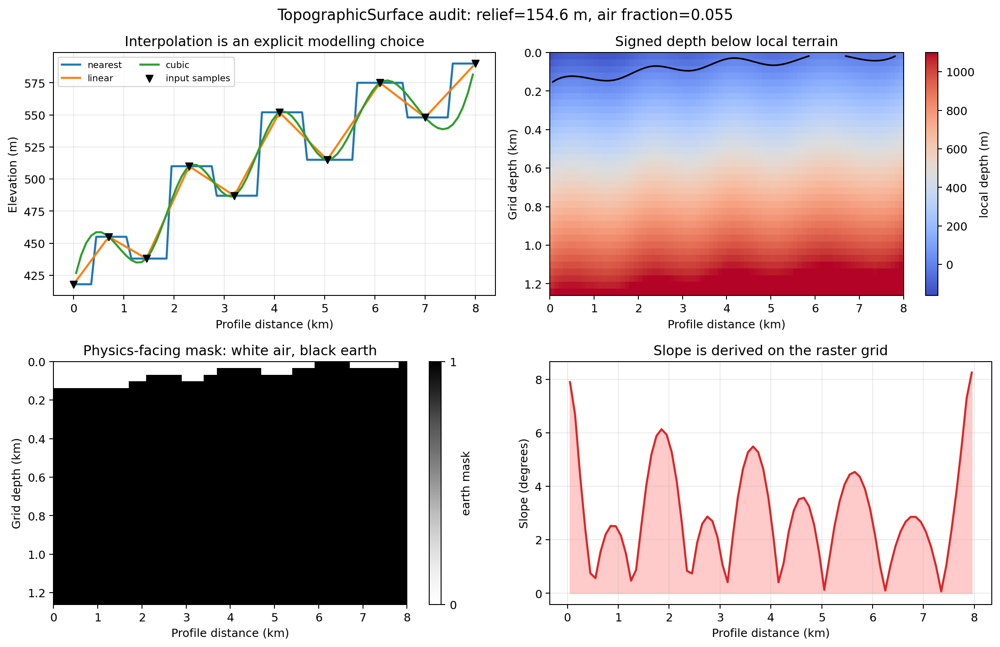
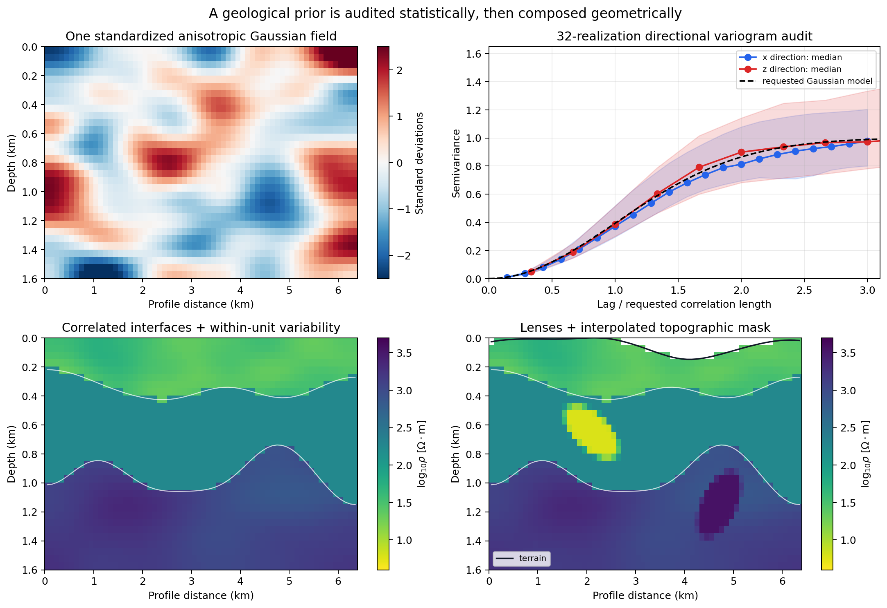
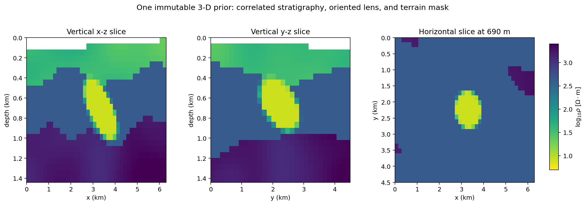

.. _ai_inversion_geology_priors:

Correlated geological priors
============================

Training a network on tiled 1-D models teaches it a per-station
relationship, not a spatial one: nothing in that training data ever
shows the network what a laterally continuous resistivity structure
looks like.  :mod:`pycsamt.ai.geology` exists to generate complete
2-D sections and 3-D volumes directly, so response simulation and
training happen on a traceable :term:`geological prior` instead of on independent columns
stitched together after the fact.

The package builds on a shared
:class:`~pycsamt.ai.geology.GeologyGrid` (canonical ``(z, x)`` or
``(z, y, x)`` cell-centre grid) and composes several generators on
top of it: anisotropic correlated Gaussian fields
(:class:`~pycsamt.ai.geology.CorrelatedField`, via
:func:`~pycsamt.ai.geology.generate_gaussian_field`), layered
geology with dipping interfaces
(:func:`~pycsamt.ai.geology.generate_layered_geology`), ellipsoidal
lenses and bodies (:func:`~pycsamt.ai.geology.insert_lenses`), and
topographic surfaces
(:class:`~pycsamt.ai.geology.TopographicSurface`).  Every generator
takes an explicit random seed and exposes its generation provenance,
so a training dataset can always be traced back to exactly the
configuration that produced it.

The public objects are useful at different points in that construction.
:class:`~pycsamt.ai.geology.GeologyGrid` fixes coordinates and canonical array
order; :class:`~pycsamt.ai.geology.GaussianCorrelation` defines spatial
scales; :class:`~pycsamt.ai.geology.CorrelatedField` and
:class:`~pycsamt.ai.geology.DirectionalVariogram` carry sampled values and
their diagnostics. :class:`~pycsamt.ai.geology.LayeredGeology` then exposes
interfaces, named layer masks, resistivity, summaries, and persistence, while
:class:`~pycsamt.ai.geology.LensGeology` adds named body masks, overlap
diagnostics, and the chosen conflict policy. Finally,
:class:`~pycsamt.ai.geology.TopographicSurface` keeps terrain sampling and the
physics-facing earth mask aligned to the same grid. These are immutable result
objects: create a new composition instead of editing their arrays in place.

.. code-block:: pycon

   >>> import numpy as np
   >>> from pycsamt.ai.geology import GeologyGrid, GaussianCorrelation
   >>> from pycsamt.ai.geology import generate_gaussian_field
   >>> grid = GeologyGrid.regular_2d(nx=32, nz=16, dx_m=100, dz_m=50)
   >>> model = GaussianCorrelation(length_x_m=500, length_z_m=100)
   >>> field = generate_gaussian_field(grid, model, seed=12)
   >>> field.values.shape
   (16, 32)
   >>> round(float(np.mean(field.values)), 6)
   0.0
   >>> round(float(np.std(field.values)), 6)
   1.0

The field values are dimensionless standard-normal scores, not resistivity.
They become geological parameters only after a caller assigns a distribution,
for example through :class:`~pycsamt.ai.geology.ElectricalLayer`. Keeping that
distinction explicit prevents a zero-centred Gaussian field from being passed
to a forward solver as if negative conductivity were meaningful.

The returned field is more than its ``values`` array. ``field_hash`` identifies
the values and provenance together, ``provenance()`` records the seed,
correlation, boundary policy and grid, and ``rescale`` returns another
immutable field with a requested sample mean and standard deviation:

.. code-block:: pycon

   >>> physical = field.rescale(mean=2.0, standard_deviation=0.25)
   >>> round(float(physical.values.mean()), 6)
   2.0
   >>> round(float(physical.values.std()), 6)
   0.25
   >>> len(field.field_hash), field.provenance()["seed"]
   (64, 12)

This rescaling still does not assign units. A mean of two could mean
``log10(ohm m)``, porosity, or another parameter; that semantic choice belongs
in the dataset configuration and must travel with the array.

What a Gaussian correlation length means
------------------------------------------

In two dimensions the requested stationary covariance is

.. math::
   :label: eq-ai-geology-gaussian-covariance

   C(h_x,h_z)=\exp\!\left[-\frac{1}{2}
      \left(\frac{h_x^2}{L_x^2}+\frac{h_z^2}{L_z^2}\right)\right].

Thus :math:`L_x` and :math:`L_z` are :term:`correlation length` scales, not hard feature
widths: at a one-length separation the correlation is
:math:`e^{-1/2}\approx0.607`, and it approaches zero only asymptotically. The
ratio :math:`L_x/L_z` is exposed as
:attr:`~pycsamt.ai.geology.GaussianCorrelation.anisotropy_xz`. In 3-D,
``length_y_m`` supplies the second horizontal principal scale and
``azimuth_deg`` rotates the horizontal axes; azimuth has no role in 2-D.

The generator filters white noise in Fourier space with amplitude

.. math::
   :label: eq-ai-geology-spectral-filter

   A(\mathbf k)=\exp\!\left[-\frac{1}{4}
      \left((k_xL_x)^2+(k_zL_z)^2\right)\right],

so the power multiplier :math:`|A|^2` is the spectrum corresponding to
equation :eq:`eq-ai-geology-gaussian-covariance`. ``boundary="periodic"``
filters directly on the requested grid and therefore joins opposite edges.
The default ``"reflect"`` filters a reflected doubled grid and crops its
centre, reducing that artificial wrap-around. Neither policy makes a small
domain representative: correlation lengths need several cells for numerical
resolution and the domain needs several correlation lengths for statistical
support. Extremely long lengths on a small grid are rejected when filtering
produces a numerically constant field.

Standardization enforces the *sample* mean and population standard deviation
of each realization to be exactly zero and one. This is convenient for
consistent scaling but suppresses between-realization fluctuations in those
two statistics. Set ``standardize=False`` when those fluctuations are part of
the intended prior, or call
:meth:`~pycsamt.ai.geology.CorrelatedField.rescale` when a precise sample mean
and spread are required.

Verify correlation statistically
-----------------------------------

:func:`~pycsamt.ai.geology.directional_variogram` computes the unbinned
empirical :term:`variogram` at integer cell lags,

.. math::
   :label: eq-ai-geology-variogram

   \widehat\gamma_a(m\Delta_a)=\frac{1}{2N_m}
      \sum_{(u,v)\in P_m}\left[g(v)-g(u)\right]^2,

where :math:`P_m` contains pairs separated by :math:`m` cells along axis
:math:`a` and :math:`N_m=|P_m|`. For a standardized Gaussian field, the
theoretical curve is :math:`\gamma(h)=1-C(h)`, with a sill near one. Pair
counts fall with lag, so the far end of a single realization's variogram is
the least stable part. This is why correlation recovery belongs at the
*ensemble* level:

.. code-block:: pycon

   >>> from pycsamt.ai.geology import directional_variogram

   >>> variogram_x = directional_variogram(field, "x", max_lag_cells=5)
   >>> variogram_x.lag_m.tolist()
   [100.0, 200.0, 300.0, 400.0, 500.0]
   >>> variogram_x.pair_count.tolist()
   [496, 480, 464, 448, 432]
   >>> np.all(np.diff(variogram_x.pair_count) < 0)
   True

The upper-right panel below aggregates 32 independently seeded fields. Once
lag is divided by its requested directional length, the horizontal and
vertical medians nearly collapse onto the theoretical Gaussian curve. The
10th--90th percentile envelopes remain broad, especially beyond two
correlation lengths: one field cannot be expected to reproduce the population
covariance exactly. The upper-left realization also shows the intended
:math:`L_x/L_z>1` texture as horizontally elongated patches rather than
independent columns.

Build stratigraphy before adding bodies
-----------------------------------------

:class:`~pycsamt.ai.geology.ElectricalLayer` defines a median resistivity and,
optionally, correlated within-unit variability. Before clipping to declared
bounds, the implemented model is

.. math::
   :label: eq-ai-geology-layer-resistivity

   \log_{10}\rho(\mathbf x)=\log_{10}\rho_{50}+s_{10}g(\mathbf x),

where :math:`\rho_{50}` is ``resistivity_ohm_m``, :math:`s_{10}` is
``log10_std``, and :math:`g` is a standardized correlated field. Therefore
``resistivity_ohm_m`` is the lognormal median, not its arithmetic mean. A
positive ``log10_std`` requires a correlation model; this prevents accidental
cell-wise white-noise geology.

:func:`~pycsamt.ai.geology.generate_layered_geology` generates correlated
interface relief independently from within-layer heterogeneity. Interfaces
are ordered from shallow to deep. ``minimum_thickness_m`` enforces separation;
``interface_policy="raise"`` rejects a crossing realization, while the
default ``"project"`` moves infeasible surfaces into the allowed region and
records the adjusted fraction. A large adjustment fraction means the proposed
means, relief, and thickness are mutually inconsistent and should be revised,
not quietly accepted as the intended prior.

.. code-block:: pycon

   >>> from pycsamt.ai.geology import ElectricalLayer
   >>> from pycsamt.ai.geology import generate_layered_geology

   >>> units = [
   ...     ElectricalLayer("cover", 20),
   ...     ElectricalLayer("sediments", 100),
   ...     ElectricalLayer("basement", 1000),
   ... ]
   >>> layered = generate_layered_geology(
   ...     GeologyGrid.regular_2d(nx=24, nz=16, dx_m=100, dz_m=50),
   ...     units, [200, 500], seed=5,
   ...     interface_relief_std_m=[30, 50],
   ...     interface_correlation=GaussianCorrelation(600, 100),
   ... )
   >>> layered.interface_depth_m.shape
   (2, 24)
   >>> summary = layered.summary()
   >>> {name: round(value, 3) for name, value in summary["layer_fractions"].items()}
   {'cover': 0.253, 'sediments': 0.37, 'basement': 0.378}
   >>> round(summary["adjusted_interface_fraction"], 3)
   0.0

The lower-left panel shows the result. White lines are continuous sampled
interfaces; colour variation within the upper and lower units comes from
separate correlated fields. Layer occupancy is worth recording across the
whole dataset: a valid geometry can still be a poor training prior if a rare
unit occupies too few cells or appears only at one depth.

Compose lenses with explicit overlap rules
--------------------------------------------

An :class:`~pycsamt.ai.geology.EllipsoidalLens` uses the normalized rotated
radius

.. math::
   :label: eq-ai-geology-lens-radius

   r(\mathbf x)=\sqrt{
      \left(\frac{x'}{a_x}\right)^2+
      \left(\frac{z'}{a_z}\right)^2},

in 2-D, with a corresponding :math:`y'` term in 3-D. Cells with :math:`r\le1`
belong to the envelope. A non-zero ``transition_fraction`` applies a cubic
smoothstep weight :math:`w\in[0,1]` in the outer shell and blends in log
resistivity,

.. math::
   :label: eq-ai-geology-lens-blend

   \log_{10}\rho_{\mathrm{new}}=(1-w)\log_{10}\rho_{\mathrm{base}}
      +w\log_{10}\rho_{\mathrm{lens}}.

Log-space blending preserves positivity and gives multiplicative rather than
arithmetic transitions. When bodies overlap, declaration order is not allowed
to decide silently: ``error``, ``first``, ``last``, ``most_conductive``, or
``most_resistive`` must state the rule.

.. code-block:: pycon

   >>> from pycsamt.ai.geology import EllipsoidalLens, insert_lenses

   >>> lens = EllipsoidalLens(
   ...     "conductor", 1200, 350, 350, 100, 5,
   ...     transition_fraction=0.2,
   ... )
   >>> composed = insert_lenses(layered, [lens], conflict_policy="error")
   >>> lens_summary = composed.summary()
   >>> round(lens_summary["assigned_fractions"]["conductor"], 4)
   0.0521
   >>> lens_summary["maximum_overlap"], lens_summary["conflict_policy"]
   (1, 'error')
   >>> round(float(np.min(composed.resistivity_ohm_m)), 3)
   5.0

Topography is a mask, not a vertical stretch
----------------------------------------------

:func:`~pycsamt.ai.geology.interpolate_topography` and
:func:`~pycsamt.ai.geology.topography_from_sites` rasterize elevation onto the
grid's horizontal cell centres. With reference elevation :math:`e_0`, terrain
depth and local cell depth are

.. math::
   :label: eq-ai-geology-topography-depth

   d_s(\mathbf x_h)=e_0-e(\mathbf x_h),
   \qquad d_{\mathrm{local}}(z,\mathbf x_h)=z-d_s(\mathbf x_h).

Cells with :math:`d_{\mathrm{local}}<0` form the air mask; geological arrays
remain on the regular depth grid rather than being warped. The reference
defaults to the maximum interpolated elevation, keeping surface depth
non-negative. Elevation datum and projected horizontal coordinates must still
be physically compatible--the class records their labels but cannot infer or
repair a CRS or datum mismatch.

.. code-block:: pycon

   >>> from pycsamt.ai.geology import interpolate_topography

   >>> x_sample = np.array([0, 600, 1200, 1800, 2400.0])
   >>> elevation = np.array([100, 130, 115, 150, 125.0])
   >>> surface = interpolate_topography(layered.grid, x_sample, elevation)
   >>> terrain = surface.summary()
   >>> round(terrain["relief_m"], 3), round(terrain["air_cell_fraction"], 4)
   (45.417, 0.0234)
   >>> round(terrain["maximum_slope_deg"], 3)
   3.338

Direct construction with :class:`~pycsamt.ai.geology.TopographicSurface` is
appropriate when elevation has already been rasterized onto ``grid.x_m`` (or
onto ``(grid.y_m, grid.x_m)`` in 3-D). Use
:func:`~pycsamt.ai.geology.interpolate_topography` when the inputs are sparse
projected samples, and :func:`~pycsamt.ai.geology.topography_from_sites` when
they are site objects with station metadata. The latter rejects ambiguous
all-zero elevations by default and needs explicit projected ``(x, y)``
coordinates for a 3-D grid.

The following complete example compares all three interpolation policies and
plots the principal :class:`~pycsamt.ai.geology.TopographicSurface` products.
It is the code used to produce the figure, so it can be copied and adapted by
changing the samples and grid rather than relying on hidden plotting logic.

.. code-block:: pycon

   >>> import matplotlib.pyplot as plt
   >>> import numpy as np
   >>> from pycsamt.ai.geology import GeologyGrid, interpolate_topography
   >>>
   >>> grid = GeologyGrid.regular_2d(nx=80, nz=36, dx_m=100, dz_m=35)
   >>> sample_x = np.array(
   ...     [0, 700, 1450, 2300, 3200, 4100, 5050, 6100, 7000, 8000]
   ... )
   >>> sample_z = np.array(
   ...     [418, 455, 438, 510, 487, 552, 515, 575, 548, 590.0]
   ... )
   >>> surfaces = {
   ...     method: interpolate_topography(
   ...         grid, sample_x, sample_z, interpolation_method=method,
   ...         source="surveyed benchmarks",
   ...         station_names=tuple(f"T{i:02d}" for i in range(sample_x.size)),
   ...     )
   ...     for method in ("nearest", "linear", "cubic")
   ... }
   >>> surface = surfaces["cubic"]
   >>> type(surface).__name__
   'TopographicSurface'
   >>> report = surface.summary()
   >>> round(report["relief_m"], 3), round(report["air_cell_fraction"], 3)
   (154.636, 0.055)
   >>> surface.local_depth_m().shape, surface.earth_mask().shape
   ((36, 80), (36, 80))
   >>> np.array_equal(surface.air_mask(), ~surface.earth_mask())
   True
   >>>
   >>> fig, axes = plt.subplots(2, 2, figsize=(12.4, 8.0))
   >>> for method, item in surfaces.items():
   ...     axes[0, 0].plot(grid.x_m / 1000, item.elevation_m, label=method)
   >>> _ = axes[0, 0].scatter(
   ...     sample_x / 1000, sample_z, c="black", marker="v",
   ...     label="input samples",
   ... )
   >>> _ = axes[0, 0].set(
   ...     xlabel="Profile distance (km)", ylabel="Elevation (m)"
   ... )
   >>> _ = axes[0, 0].legend()
   >>> local_depth = surface.local_depth_m()
   >>> image = axes[0, 1].imshow(
   ...     local_depth, extent=(0, 8, 1.26, 0), aspect="auto",
   ...     cmap="coolwarm", vmin=-160, vmax=1100,
   ... )
   >>> _ = axes[0, 1].contour(
   ...     grid.x_m / 1000, grid.z_m / 1000, local_depth,
   ...     levels=[0], colors="black",
   ... )
   >>> _ = axes[1, 0].imshow(
   ...     surface.earth_mask(), extent=(0, 8, 1.26, 0),
   ...     aspect="auto", cmap="Greys", vmin=0, vmax=1,
   ... )
   >>> _ = axes[1, 1].plot(
   ...     grid.x_m / 1000, surface.slope_degrees(), color="tab:red"
   ... )
   >>> for ax in axes.ravel():
   ...     ax.grid(alpha=0.2)
   >>> fig.tight_layout()
   >>> plt.show()

   Executed terrain workflow from sparse elevation samples to the arrays used
   by a forward mesh.

Nearest interpolation preserves sample plateaus but produces discontinuous
steps; linear interpolation is conservative between observations; cubic
interpolation is smoother but can introduce extrema not present at a sample.
Here the cubic raster spans 426.7--581.4 m even though the observations span
418--590 m because cell centres do not coincide with the endpoint samples.
The signed-depth panel
shows why ``surface_depth_m`` and ``local_depth_m`` must not be confused: the
former is one terrain value per horizontal cell, while the latter broadcasts
that surface across every depth cell. The binary mask is the appropriate
input to physics; the slope curve is a diagnostic of the rasterization, not a
replacement for inspecting the terrain itself.

In the lower-right panel of the diagnostic, white cells lie above the black
terrain line and are excluded by :meth:`~pycsamt.ai.geology.TopographicSurface.earth_mask`.
The conductive and resistive lenses retain smooth transition shells, while
the stratigraphic interfaces remain defined in the unwarped depth coordinate.
The exact executable used for all four panels is included here; it also shows
how the 32-realization variogram envelopes are assembled rather than hiding
that ensemble step behind the finished image.

.. code-dropdown:: ../../../scripts/generate_ai_inversion_figures.py
   :language: python
   :pyobject: make_geology_prior_diagnostic
   :linenos:
   :title: View geology-prior diagnostic source code

   Statistical verification and geometric composition of a deterministic 2-D
   prior. Shaded variogram bands are the 10th--90th percentiles across 32
   realizations, not uncertainty for one realization.

Carry the same composition into 3-D
-------------------------------------

A 3-D grid has canonical array shape ``(nz, ny, nx)``. Its
:class:`~pycsamt.ai.geology.GaussianCorrelation` must supply ``length_y_m``;
``azimuth_deg`` rotates the horizontal correlation axes. Likewise, a 3-D
:class:`~pycsamt.ai.geology.EllipsoidalLens` supplies ``center_y_m`` and
``radius_y_m``. Its azimuth rotates the horizontal major axis, while
``dip_deg`` rotates that major axis toward depth. These angles describe the
prior geometry; they are not strike and dip estimates recovered from data.

This executable example builds correlated stratigraphy, inserts one dipping
conductor, rasterizes a simple terrain plane from projected control points,
and plots two vertical sections plus one horizontal slice. The named masks
avoid relying on integer labels whose meaning may be forgotten later.

.. code-block:: pycon

   >>> import matplotlib.pyplot as plt
   >>> import numpy as np
   >>> from pycsamt.ai.geology import (
   ...     ElectricalLayer, EllipsoidalLens, GaussianCorrelation, GeologyGrid,
   ...     generate_layered_geology, insert_lenses, interpolate_topography,
   ... )
   >>> grid3 = GeologyGrid.regular_3d(
   ...     nx=42, ny=30, nz=24, dx_m=150, dy_m=150, dz_m=60
   ... )
   >>> correlation3 = GaussianCorrelation(
   ...     length_x_m=900, length_y_m=600, length_z_m=240, azimuth_deg=30
   ... )
   >>> units3 = (
   ...     ElectricalLayer(
   ...         "cover", 35, log10_std=0.08, heterogeneity=correlation3
   ...     ),
   ...     ElectricalLayer("host", 420),
   ...     ElectricalLayer(
   ...         "basement", 1800, log10_std=0.10, heterogeneity=correlation3
   ...     ),
   ... )
   >>> layered3 = generate_layered_geology(
   ...     grid3, units3, [360, 900], seed=31,
   ...     interface_relief_std_m=[70, 120],
   ...     interface_correlation=correlation3,
   ...     minimum_thickness_m=120,
   ... )
   >>> body3 = EllipsoidalLens(
   ...     "dipping conductor", center_x_m=3300, center_y_m=2250,
   ...     center_z_m=690, radius_x_m=1150, radius_y_m=650,
   ...     radius_z_m=260, resistivity_ohm_m=8, azimuth_deg=35,
   ...     dip_deg=18, transition_fraction=0.22,
   ... )
   >>> volume3 = insert_lenses(layered3, [body3], conflict_policy="error")
   >>> grid3.shape, layered3.interface_depth_m.shape
   ((24, 30, 42), (2, 30, 42))
   >>> int(volume3.lens_mask("dipping conductor").sum())
   604
   >>> round(volume3.summary()["assigned_fractions"]["dipping conductor"], 4)
   0.02
   >>> layered3.layer_mask("host").shape, layered3.interface(0).shape
   ((24, 30, 42), (30, 42))
   >>>
   >>> xy = np.array([
   ...     [0, 0], [6300, 0], [0, 4500], [6300, 4500],
   ...     [3150, 2250], [1575, 1125], [4725, 3375],
   ... ])
   >>> elevation = 510 + 0.018 * xy[:, 0] - 0.012 * xy[:, 1]
   >>> terrain3 = interpolate_topography(
   ...     grid3, xy, elevation, source="projected control points"
   ... )
   >>> log_rho = np.log10(volume3.resistivity_ohm_m)
   >>> earth = terrain3.earth_mask()
   >>> iy, ix = grid3.shape[1] // 2, grid3.shape[2] // 2
   >>> iz = int(np.argmin(np.abs(grid3.z_m - body3.center_z_m)))
   >>> views = (
   ...     np.where(earth[:, iy, :], log_rho[:, iy, :], np.nan),
   ...     np.where(earth[:, :, ix], log_rho[:, :, ix], np.nan),
   ...     log_rho[iz],
   ... )
   >>> fig, axes = plt.subplots(1, 3, figsize=(13.8, 4.8))
   >>> extents = ([0, 6.3, 1.44, 0], [0, 4.5, 1.44, 0], [0, 6.3, 4.5, 0])
   >>> for ax, values, extent in zip(axes, views, extents):
   ...     image = ax.imshow(
   ...         values, extent=extent, aspect="auto", cmap="viridis_r",
   ...         vmin=0.7, vmax=3.4,
   ...     )
   >>> colorbar_axis = fig.add_axes([0.925, 0.19, 0.015, 0.60])
   >>> _ = fig.colorbar(
   ...     image, cax=colorbar_axis, label="log10 resistivity [ohm m]"
   ... )
   >>> fig.subplots_adjust(
   ...     left=0.06, right=0.90, bottom=0.13, top=0.82, wspace=0.32
   ... )
   >>> plt.show()

   Executed 3-D composition shown with one shared resistivity scale.

The conductor appears with different widths and apparent inclinations in the
two vertical sections because each plane cuts the same rotated ellipsoid at a
different orientation. The horizontal slice exposes its azimuth more directly.
White cells in the vertical views are air from ``terrain3.earth_mask()``;
they are not missing geological samples. Notice also that the body occupies
only about 2% of the volume. That fraction should be checked across an
ensemble: a rare target can be scientifically plausible yet too uncommon for
a network to learn reliably.

Persist identity and audit the ensemble
-----------------------------------------

Generated fields, layered models, lens models, and topographic surfaces are
immutable and provide platform-stable hashes over their arrays and generation
provenance. Their ``to_npz``/``from_npz`` methods use pickle-free archives and
revalidate reconstructed geometry. A seed alone is insufficient: grid,
boundary policy, correlation definition, layer parameters, overlap policy,
and values all contribute to identity.

.. code-block:: pycon

   >>> from pathlib import Path
   >>> from tempfile import TemporaryDirectory
   >>> from pycsamt.ai.geology import (
   ...     CorrelatedField, LayeredGeology, LensGeology, TopographicSurface,
   ... )

   >>> with TemporaryDirectory() as directory:
   ...     root = Path(directory)
   ...     field_copy = CorrelatedField.from_npz(
   ...         field.to_npz(root / "field.npz")
   ...     )
   ...     layer_copy = LayeredGeology.from_npz(
   ...         layered.to_npz(root / "layers.npz")
   ...     )
   ...     lens_copy = LensGeology.from_npz(
   ...         composed.to_npz(root / "lenses.npz")
   ...     )
   ...     surface_copy = TopographicSurface.from_npz(
   ...         surface.to_npz(root / "terrain.npz")
   ...     )
   ...     print(field_copy.field_hash == field.field_hash)
   ...     print(layer_copy.model_hash == layered.model_hash)
   ...     print(lens_copy.model_hash == composed.model_hash)
   ...     print(surface_copy.surface_hash == surface.surface_hash)
   True
   True
   True
   True

Before sending an ensemble to :doc:`forward_physics`, audit more than image
quality: requested versus empirical variograms, resistivity histograms and
bounds, layer and lens occupancy by depth, interface-adjustment fraction,
overlap frequency, topographic air fraction and slope, and coverage of rare
structural combinations. Split related corruptions or variants by shared
realization lineage as explained in :doc:`data_contracts`; otherwise nearly
identical geology can leak across training and evaluation. These diagnostics
test whether the sampler represents the intended prior. They do not prove
that the intended prior represents the field area--that requires geological
constraints and the domain-gap checks in :doc:`domain_gap`.
