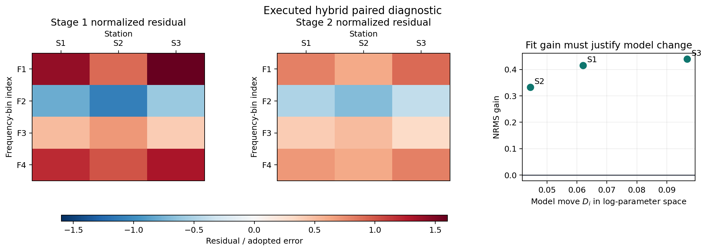
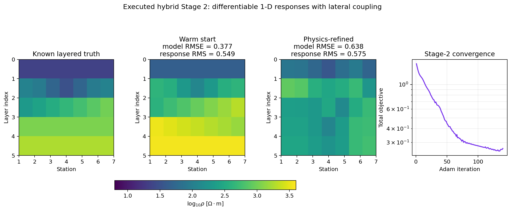

.. _ai_inversion_hybrid:

Hybrid AI and physics inversion
===============================

:term:`Hybrid inversion` is the bridge between fast learned inference and
observation-specific physics refinement.  The supervised model gives an initial
earth estimate; the physics step then asks whether that estimate can reproduce
the measured electromagnetic response under the declared solver, component,
regularization, and geometry assumptions.  It is not a shortcut around
:doc:`validation`.  It is a two-stage scientific claim:

.. math::
   :label: eq-hybrid-two-stage-map

   \mathbf{x}
   \xrightarrow{\;g_\theta\;}
   \mathbf{m}_0
   \xrightarrow{\;\operatorname*{arg\,min}_{\mathbf{m}}\mathcal{J}(\mathbf{m})\;}
   \hat{\mathbf{m}},

where :math:`\mathbf{x}` is the feature vector or panel,
:math:`g_\theta` is the fitted AI inverter, :math:`\mathbf{m}_0` is the
Stage-1 starting model, and :math:`\hat{\mathbf{m}}` is the Stage-2 refined
model.  A hybrid result is useful only when both stages remain visible.  If the
final section is shown without the initial AI estimate, the reader cannot tell
whether physics refinement improved the result, merely preserved it, or moved
it into a different but still non-unique model.
Equation :eq:`eq-hybrid-two-stage-map` also fixes the order of operations:
preprocessing and AI inference precede observation-specific optimization.

Use hybrid inversion when a supervised inverter already has a validated
:term:`feature contract`, but field observations deserve a physical correction
before interpretation.  Typical cases include:

* a trained :class:`pycsamt.ai.inversion.EMInverter1D` that gives plausible
  station models but leaves coherent response residuals;
* a 2-D section from :class:`pycsamt.ai.inversion.EMInverter2D` that needs
  station-by-station response consistency and lateral smoothing;
* a graph-based 3-D estimate that is useful as a spatial prior but still needs
  electromagnetic response checks;
* a comparison scenario where a fully physics-informed run is too sensitive to
  naive initialization.

Do not use a hybrid workflow to rescue an AI model outside its validated
domain.  A Stage-2 optimizer can reduce response misfit while keeping the
inversion trapped near a poor starting model, especially when bandwidth,
:term:`dimensionality`, or data quality differs strongly from the training
distribution.  This is one expression of :term:`non-uniqueness`: many earth
models can fit the same response within error, and a :term:`warm start` can decide
which basin the optimizer explores first.  In that situation the hybrid result
should be reported as a stress test or conditional interpretation, not as a
promoted model.

Before you run it
-----------------

Hybrid inversion is most useful when a few conditions are already true.  The
Stage-1 model should be a validated :term:`checkpoint`, not just a network that
happens to load.  The field or synthetic observation should pass the same
preprocessing, frequency support, component order, masking, and unit
conventions used during training.  The Stage-2 solver should be an appropriate
physical approximation for the intended use, and the regularization weights
should be chosen before looking at the final section.

Treat these as pre-run gates:

* the AI model was validated on a domain close to the target survey;
* the input arrays satisfy the documented :term:`feature contract`;
* quality control has identified missing bands, outliers, :term:`static shift`,
  and component problems;
* :term:`phase tensor` or other diagnostics do not contradict the assumed
  dimensionality;
* the Stage-2 objective, weights, bounds, and stopping rule are written down;
* the accepted comparison is Stage 2 against Stage 1, the
  :term:`baseline model`, and a classical or independent reference where
  available.

If one of these gates fails, continue only as an exploratory run.  That is not
a failure of the method; it is a protection against giving a polished
scientific meaning to an unsupported optimization.

The two-stage objective
-----------------------

Stage 1 is a supervised inverse mapping.  For a fitted AI model
:math:`g_\theta`, the starting model is

.. math::
   :label: eq-hybrid-stage1-map

   \mathbf{m}_{0,i}=g_\theta(\mathbf{x}_i).

Stage 2 starts from :math:`\mathbf{m}_{0,i}` and minimizes a physics objective
against the observed response.  In compact form,

.. math::
   :label: eq-hybrid-objective

   \mathcal{J}(\mathbf{m})
   =
   \mathcal{J}_{\mathrm{data}}(\mathbf{m})
   + \lambda_z \mathcal{J}_{\mathrm{vert}}(\mathbf{m})
   + \lambda_x \mathcal{J}_{\mathrm{lat}}(\mathbf{m})
   + \lambda_g \mathcal{J}_{\mathrm{graph}}(\mathbf{m}),

where inactive terms are omitted for lower-dimensional workflows.  The data
term compares the measured response :math:`\mathbf{d}^{\mathrm{obs}}` with the
response reconstructed by the :term:`forward operator`:

.. math::
   :label: eq-hybrid-data-term

   \mathcal{J}_{\mathrm{data}}
   =
   \frac{1}{|\mathcal{M}|}
   \sum_{(i,j)\in\mathcal{M}}
   \left[
      w^\rho_{ij}
      \left(
         \log_{10}\rho^{a,\mathrm{pred}}_{ij}
         -
         \log_{10}\rho^{a,\mathrm{obs}}_{ij}
      \right)^2
      +
      w^\phi_{ij}
      \left(
         \frac{\phi^{\mathrm{pred}}_{ij}
         -
         \phi^{\mathrm{obs}}_{ij}}{90}
      \right)^2
   \right].

Here :math:`\mathcal{M}` is the finite data mask, :math:`\rho^a` is
:term:`apparent resistivity`, and :math:`\phi` is :term:`phase`.  The
regularization terms encode the geometry expected from the selected
parameterization.  A 1-D station run usually uses vertical roughness only; a
2-D profile also uses lateral roughness; a 3-D graph workflow can penalize
roughness across graph edges.  The weights therefore have scientific meaning:
they decide how much misfit reduction is worth compared with added structure.
Thus :eq:`eq-hybrid-objective` is not reproducible unless the residual
definition in :eq:`eq-hybrid-data-term` and every active weight are reported.

The current :class:`~pycsamt.ai.inversion.HybridInverter1D`,
:class:`~pycsamt.ai.inversion.HybridInverter2D`, and
:class:`~pycsamt.ai.inversion.HybridInverter3D` kernels use the more specific
unweighted objective

.. math::
   :label: eq-hybrid-implemented-data-term

   \mathcal J_{\mathrm{data}}=
   \frac{1}{N_v}\sum_{(s,f)\in\mathcal M}
   \left[
      \left(\log_{10}\rho^a_{sf,\mathrm{pred}}
            -\log_{10}\rho^a_{sf,\mathrm{obs}}\right)^2
      +\left(\frac{\phi_{sf,\mathrm{pred}}-
                         \phi_{sf,\mathrm{obs}}}{90}\right)^2
   \right],

where a cell enters :math:`\mathcal M` only when both apparent resistivity and
phase are finite. Observational errors and error floors are not consumed by
this kernel, so equation :eq:`eq-hybrid-normalized-residual` is a recommended
external validation metric, not a description of the implemented optimizer.
The phase subtraction is direct rather than circular; normalize phase branches
before fitting so values near a wrapping boundary do not create an artificial
large residual.

The code uses means, not raw sums, for vertical and lateral differences. For
an :math:`S\times L` station-by-layer log-resistivity matrix :math:`U`,

.. math::
   :label: eq-hybrid-implemented-regularization

   \mathcal J_z=\frac{1}{S(L-1)}\sum_{s,\ell}
      (U_{s,\ell+1}-U_{s,\ell})^2,
   \qquad
   \mathcal J_x=\frac{1}{(S-1)L}\sum_{s,\ell}
      (U_{s+1,\ell}-U_{s,\ell})^2.

For the quasi-3-D path, :math:`\mathcal J_g=\operatorname{tr}
(U^T(D-A)U)/(SL)`. These normalizations matter when comparing runs with
different station or layer counts. Adam optimizes log-resistivity and
log-thickness through a :term:`differentiable forward model` implementing a
1-D MT recursion. PyTorch and
TensorFlow clip gradient norm to 5; log-thickness is clamped after every update
to :math:`[0,5]`, corresponding to 1--100,000 m. Log-resistivity has no
equivalent hard clamp, so inspect it for implausible values rather than
assuming positivity conversion alone makes the model geological.

The mask and weights deserve the same care as the network architecture.  A
typical normalized residual can be written

.. math::
   :label: eq-hybrid-normalized-residual

   r_{ij}
   =
   \frac{F_j(\mathbf{m}_i)-d^{\mathrm{obs}}_{ij}}{\sigma_{ij}},

where :math:`\sigma_{ij}` is the observational standard error or an adopted
error floor.  When an explicit error model is unavailable, the report should
state the substitute weights.  A phase residual divided by 90 degrees, a
log-apparent-resistivity residual, and a statistically normalized residual are
not interchangeable metrics.  They answer different questions, so do not mix
them without naming the residual space.

The regularization terms are usually roughness penalties.  For a 2-D
log-resistivity section :math:`u_{zk}=\log_{10}\rho_{zk}`, one possible reading
is

.. math::
   :label: eq-hybrid-section-roughness

   \mathcal{J}_{\mathrm{vert}}
   =
   \sum_{z,k}
   \left(u_{z+1,k}-u_{z,k}\right)^2,
   \qquad
   \mathcal{J}_{\mathrm{lat}}
   =
   \sum_{z,k}
   \left(u_{z,k+1}-u_{z,k}\right)^2.

For a graph model with edge set :math:`\mathcal{E}`,

.. math::
   :label: eq-hybrid-graph-roughness

   \mathcal{J}_{\mathrm{graph}}
   =
   \sum_{(p,q)\in\mathcal{E}}
   a_{pq}
   \left\|\mathbf{u}_{p}-\mathbf{u}_{q}\right\|_2^2,

where :math:`a_{pq}` is an edge weight.  These equations make the trade-off
visible: lowering the data term by introducing sharp or isolated structure is
penalized only to the degree encoded by :math:`\lambda_z`, :math:`\lambda_x`,
or :math:`\lambda_g`.
The distinction between the grid differences in
:eq:`eq-hybrid-section-roughness` and graph edges in
:eq:`eq-hybrid-graph-roughness` matters when results are compared across
dimensions.

The improvement made by Stage 2 should be measured in response space, not only
by a smaller training-style loss.  If :math:`r^{(1)}_{ij}` and
:math:`r^{(2)}_{ij}` are normalized residuals for Stage 1 and Stage 2,

.. math::
   :label: eq-hybrid-nrms-gain

   \Delta_{\mathrm{NRMS}}
   =
   \sqrt{\frac{1}{|\mathcal{M}|}\sum r^{(1)2}_{ij}}
   -
   \sqrt{\frac{1}{|\mathcal{M}|}\sum r^{(2)2}_{ij}}.

Positive :math:`\Delta_{\mathrm{NRMS}}` means Stage 2 improved normalized
response fit.  It does not by itself prove geological correctness; it must be
read beside model change, regularization, uncertainty, and independent
evidence.
Use exactly the same finite mask and error model in both terms of
:eq:`eq-hybrid-nrms-gain`; otherwise a positive value can be created merely by
discarding difficult observations.

.. code-block:: pycon

   >>> import numpy as np
   >>>
   >>> stage1_residual = np.array([
   ...     [1.4, -0.8, 0.5, 1.2],
   ...     [0.9, -1.1, 0.7, 1.0],
   ...     [1.6, -0.6, 0.4, 1.3],
   ... ])
   >>> stage2_residual = np.array([
   ...     [0.8, -0.5, 0.4, 0.7],
   ...     [0.6, -0.7, 0.5, 0.6],
   ...     [0.9, -0.4, 0.3, 0.8],
   ... ])
   >>> nrms1 = np.sqrt(np.mean(stage1_residual ** 2))
   >>> nrms2 = np.sqrt(np.mean(stage2_residual ** 2))
   >>> improvement = nrms1 - nrms2
   >>> print("Stage-1 NRMS:", round(float(nrms1), 3))
   Stage-1 NRMS: 1.023
   >>> print("Stage-2 NRMS:", round(float(nrms2), 3))
   Stage-2 NRMS: 0.626
   >>> print("NRMS improvement:", round(float(improvement), 3))
   NRMS improvement: 0.398
   >>> print("stations improved:", int(np.sum(
   ...     np.sqrt(np.mean(stage2_residual ** 2, axis=1))
   ...     <
   ...     np.sqrt(np.mean(stage1_residual ** 2, axis=1))
   ... )))
   stations improved: 3

The same table should also show stations that did not improve.  A global
average can hide a profile edge, noisy station, or component whose residuals
became worse after refinement.

A second diagnostic is the size of the model move.  Stage 2 is not better
because it moves farther; it is better only when the movement is justified by
the data and by geology.  A compact way to summarize the move is

.. math::
   :label: eq-hybrid-model-move

   D_i
   =
   \sqrt{
      \frac{1}{P}
      \sum_{p=1}^{P}
      \left(\hat{m}_{ip}-m_{0,ip}\right)^2
   },

computed in the same transformed parameter space used by the optimizer.
Report this beside the response improvement.  Small :math:`D_i` and better
response fit usually indicate a useful correction; large :math:`D_i` with
little response improvement suggests the hybrid result is weakly constrained.

.. code-block:: pycon

   >>> import numpy as np
   >>>
   >>> stage1_residual = np.array([
   ...     [1.4, -0.8, 0.5, 1.2],
   ...     [0.9, -1.1, 0.7, 1.0],
   ...     [1.6, -0.6, 0.4, 1.3],
   ... ])
   >>> stage2_residual = np.array([
   ...     [0.8, -0.5, 0.4, 0.7],
   ...     [0.6, -0.7, 0.5, 0.6],
   ...     [0.9, -0.4, 0.3, 0.8],
   ... ])
   >>> stage1_model = np.array([
   ...     [2.0, 2.5, 3.0, 1.7],
   ...     [2.1, 2.6, 2.9, 1.8],
   ...     [2.2, 2.4, 3.1, 1.7],
   ... ])
   >>> stage2_model = np.array([
   ...     [2.1, 2.45, 2.95, 1.72],
   ...     [2.15, 2.55, 2.95, 1.82],
   ...     [2.35, 2.35, 3.0, 1.75],
   ... ])
   >>> model_move = np.sqrt(np.mean((stage2_model - stage1_model) ** 2, axis=1))
   >>> station_nrms_gain = (
   ...     np.sqrt(np.mean(stage1_residual ** 2, axis=1))
   ...     -
   ...     np.sqrt(np.mean(stage2_residual ** 2, axis=1))
   ... )
   >>> for idx, (move, gain) in enumerate(zip(model_move, station_nrms_gain), start=1):
   ...     print(f"S{idx}: model_move={move:.3f}, nrms_gain={gain:.3f}")
   S1: model_move=0.062, nrms_gain=0.415
   S2: model_move=0.044, nrms_gain=0.333
   S3: model_move=0.097, nrms_gain=0.440

This style of table is intentionally simple.  It lets a reviewer ask the
right next question: did the largest model changes occur where the residuals
actually improved?

         plotted against model movement for three stations.
   :align: center
   :width: 100%

   Executed paired diagnostic for the arrays above.  The common residual color
   scale beneath the two heatmaps makes the contraction toward zero visible.
   Stations are columns labelled at the top and frequency bins run vertically.
   The final panel prevents that improvement from being separated from the
   model displacement defined by :eq:`eq-hybrid-model-move`.

All three stations move upward from the zero-gain line, so refinement improves
the adopted response metric in every case.  Station S3 moves farthest and also
gains most; it deserves closer geological review than S2, whose similar gain is
obtained with less model movement.  This is the intended interpretation of the
pair, not proof that any of these illustrative models is a WILLY subsurface
result.

1-D hybrid inversion
--------------------

:class:`pycsamt.ai.inversion.HybridInverter1D` combines a fitted
:class:`pycsamt.ai.inversion.EMInverter1D` with station-wise physics
refinement.  The 1-D workflow is appropriate when each station can reasonably
be interpreted as a layered earth, or when the result is explicitly used as a
screening or initialization product before higher-dimensional inversion.

The repository does not ship ``checkpoints/amt1d_resnet.npz``.  The following
is therefore a reference run that becomes executable only after the
:doc:`training` workflow has produced and validated that artifact.  It must not
be quoted as an executed WILLY result from the documentation build.

.. code-block:: pycon

   >>> from pycsamt.ai.inversion import EMInverter1D, HybridInverter1D
   >>>
   >>> ai = EMInverter1D.load("checkpoints/amt1d_resnet.npz")  # doctest: +SKIP
   >>> hybrid = HybridInverter1D(  # doctest: +SKIP
   ...     "data/AMT/WILLY_data/L18PLT",
   ...     ai_inverter=ai,
   ...     solver="mt1d",
   ...     comp="xy",
   ...     n_freqs=32,
   ...     max_iter=200,
   ...     smoothness_weight=0.005,
   ...     lr=5e-3,
   ... ).fit(verbose=True)
   >>> models = hybrid.predict()  # doctest: +SKIP
   >>> stage1_models = hybrid.stage1_models()  # doctest: +SKIP
   >>> stage1_residuals = hybrid.residuals(stage=1)  # doctest: +SKIP
   >>> stage2_residuals = hybrid.residuals(stage=2)  # doctest: +SKIP

The :term:`checkpoint` or fitted object used for Stage 1 must be the exact
artifact validated for the input representation.  Record the checkpoint
checksum, the frequency grid, component, transforms, and target
parameterization.  If the AI model predicts log-resistivity and log-thickness,
the Stage-2 initialization inherits that representation before the physical
solver converts it to positive parameters.

For each station, preserve:

* the Stage-1 layered model;
* the Stage-2 layered model;
* residuals by frequency and component for both stages;
* loss history and stopping iteration;
* any stations where Stage 2 worsened response fit;
* parameter floors, bounds, masks, and excluded frequencies.

The station-wise setting also makes failure localization clear.  If only one
station fails to improve, inspect that station before changing global weights:
look for dead-band frequencies, missing phase, static-shifted apparent
resistivity, component rotation, or a local dimensionality problem.  If most
stations fail to improve, the issue is more likely to be the AI starting
model, the solver assumption, or the weighting of the Stage-2 objective.

There is a current solver-selection limitation worth making explicit:
``solver="csamt1d"`` changes the public residual reconstruction to
:class:`~pycsamt.forward.em1d.CSAMT1DForward`, but the differentiable
``fit_station`` kernel receives no solver argument and always optimizes its MT
1-D recursion. Until those paths are unified, ``csamt1d`` is not evidence of a
CSAMT-specific Stage-2 objective. Treat such a run as experimental and verify
it with an independent CSAMT forward response; use ``solver="mt1d"`` for the
documented internally consistent path.

2-D hybrid refinement
---------------------

:class:`pycsamt.ai.inversion.HybridInverter2D` uses a fitted
:class:`pycsamt.ai.inversion.EMInverter2D` to initialize a profile section and
then jointly refines all stations.  The method is especially useful when a
U-Net-like section captures large-scale structure but needs explicit response
checking station by station.

:class:`~pycsamt.ai.inversion.EMInverter2D` can be supplied as a fitted object
or as a saved checkpoint path; :class:`HybridInverter2D` calls its inherited
``load`` implementation for the latter. Retain the training configuration and
normalization state in either case--loading network weights does not by itself
reconstruct the scientific feature contract. The placeholder below uses the
fitted-object route so that dependency remains visible.

.. code-block:: pycon

   >>> from pycsamt.ai.inversion import HybridInverter2D
   >>>
   >>> # ai2d is a fitted EMInverter2D retained from training.
   >>> hybrid = HybridInverter2D(  # doctest: +SKIP
   ...     "data/AMT/WILLY_data/L18PLT",
   ...     ai_inverter=ai2d,
   ...     n_layers=10,
   ...     depth_max=2000.0,
   ...     n_freqs=32,
   ...     mode="te",
   ...     smoothness_weight=0.005,
   ...     lateral_weight=0.003,
   ...     epochs=150,
   ...     lr=5e-3,
   ... ).fit(verbose=True)
   >>> stage1 = hybrid.stage1_section(as_log10=True)  # doctest: +SKIP
   >>> stage2 = hybrid.resistivity_section(as_log10=True)  # doctest: +SKIP
   >>> residuals_stage1 = hybrid.residuals(stage=1)  # doctest: +SKIP
   >>> residuals_stage2 = hybrid.residuals(stage=2)  # doctest: +SKIP

The 2-D hybrid objective still depends on the solver assumptions used in the
refinement step.  If the implementation uses per-station 1-D response physics
inside a laterally coupled section, say so directly in the report.  Lateral
smoothness can make neighbouring stations look geologically coherent, but it
does not turn a pseudo-2-D response check into a full 2-D electromagnetic
solver.

That is exactly what the current implementation does: every station is passed
through the differentiable layered 1-D MT recursion, while
:math:`\mathcal J_x` couples adjacent station models. ``mode="te"`` selects
``xy`` observations and ``mode="tm"`` selects ``yx``. ``mode="both"`` does
*not* create two independent TE/TM residual blocks; it arithmetically averages
TE and TM apparent resistivity and phase before interpolation to the common
frequency grid. Use that mode only when this averaging is scientifically
defensible. For a genuine joint-mode or full 2-D response test, evaluate the
final model externally with the verified path in :doc:`forward_physics`.
Also note that ``residuals(stage=...)`` currently reports TE observations when
``mode="both"`` because its diagnostic branch treats ``both`` like ``te``;
those rows therefore do not reconstruct the averaged target optimized in
Stage 2. Compute the averaged-target residual explicitly or report separate
TE/TM external residuals rather than labelling that table as the training
objective.

Stage 1 may also be resampled along the station axis when the field profile
has a different station count from the network's fixed input shape. Missing
panel values are filled by each channel/station frequency-column mean (or zero
when the entire column is missing), the panel is linearly resized for the AI
call, and the predicted section is resized back. Preserve both shapes and the
missingness mask: interpolation can make an initializer visually smooth
without adding observational support.

The controlled execution below isolates Stage 2 on seven synthetic stations.
The known response is generated independently with the public
:class:`~pycsamt.forward.em1d.MT1DForward`; a deliberately biased warm start
is then refined for 140 Adam iterations by the same differentiable
``fit_2d_joint`` kernel used by :class:`HybridInverter2D`. The internal total
objective falls from above 1.3 to about 0.25, but the independently recomputed
response RMS changes from 0.549 to 0.575 and model RMSE from 0.377 to 0.638.
In other words, this run *converges numerically while becoming less accurate*
under two external checks.

   Executed pseudo-2-D refinement with a shared colour scale. Response RMS is
   recomputed with the public forward solver rather than read from the
   optimizer's own loss history.

The mismatch does not mean every hybrid run must worsen. It demonstrates that
an internal differentiable recursion, its regularization, and an independent
forward implementation are distinct numerical claims. A falling loss proves
only that Adam is reducing the implemented objective. Require an external
response reconstruction on the same frequencies and units before promoting
Stage 2; where synthetic truth exists, retain model-space metrics as well.
This diagnostic is especially important after either forward implementation
changes.

The useful diagnostic is the difference between Stage 1 and Stage 2:

.. math::
   :label: eq-hybrid-section-change

   \Delta \log_{10}\rho_{zk}
   =
   \log_{10}\rho^{(2)}_{zk}
   -
   \log_{10}\rho^{(1)}_{zk},

where :math:`z` indexes depth and :math:`k` indexes station or lateral
position.  Large coherent changes may indicate real correction, but they may
also indicate that the supervised model was outside its training support.  The
response residuals decide whether the change improved the observation fit; the
geology decides whether the changed structure is credible.

A 2-D hybrid report should show three aligned panels whenever possible:
Stage-1 log-resistivity, Stage-2 log-resistivity, and
:math:`\Delta\log_{10}\rho`.  Put them on the same depth grid and color scale
unless the purpose is explicitly to inspect a residual panel.  The viewer
should not have to infer improvement from different color limits.  If several
figures are needed, arrange them as a row or grid so the Stage-1 and Stage-2
relationship is visually immediate.

Depth parameterization matters.  If Stage 1 predicts a section on one depth
grid and Stage 2 optimizes another, document the interpolation.  A sharp
conductor can appear to move simply because the target grid changed.  In
decision-facing reports, quote interface depths or conductor-top depths from
the final grid and preserve the Stage-1 grid in the reproducibility record.

3-D and graph hybrid workflows
------------------------------

:class:`pycsamt.ai.inversion.HybridInverter3D` follows the same pattern with a
quasi-3-D, graph-based Stage-1 estimate.  Its Stage-2 response term is assembled
from station-wise layered-earth responses and coupled by graph smoothness; it
is not a full 3-D Maxwell solver.  The graph penalty should be tied to the
survey geometry, not chosen only because it makes a smoother volume.  Record
the graph construction rule, edge radius, disconnected components, coordinate
system, and station exclusions.  Stratify diagnostics by node degree and survey
edge position because graph models often look best in dense interior regions
and weakest near sparse boundaries.

The 2-D mode semantics carry into this path: ``mode="both"`` averages TE and
TM observables before optimization, and the built-in residual table does not
reconstruct that averaged target. Report separate externally recomputed TE and
TM residuals when both modes are part of the scientific claim.

When the field setting is not demonstrably 3-D, a 3-D hybrid result can still
be useful as a consistency check.  Report that narrower role.  Do not promote a
3-D interpretation simply because the model class can output a volume.

For graph workflows, the Stage-1 prior can enter twice: once through the
learned model and again through graph smoothness.  That is not wrong, but it
must be visible.  A dense graph with a large :math:`\lambda_g` can make a
volume look stable even when the data support is sparse.  Always compare graph
hybrid output with a weaker graph or identity-graph ablation before claiming
that the volume is physically resolved.

Agent-assisted hybrid runs
--------------------------

:class:`pycsamt.agents.HybridInversionAgent` wraps the 1-D, 2-D, and 3-D
classes and returns a standardized result package with residual tables,
figures, and Stage-1 versus Stage-2 summaries.

.. code-block:: pycon

   >>> from pycsamt.agents import HybridInversionAgent
   >>> from pycsamt.ai.inversion import EMInverter1D
   >>>
   >>> ai = EMInverter1D.load("checkpoints/amt1d_resnet.npz")  # doctest: +SKIP
   >>> agent = HybridInversionAgent(  # doctest: +SKIP
   ...     dim=1,
   ...     max_iter=100,
   ...     smoothness_weight=0.005,
   ...     lr=5e-3,
   ...     api_key="",
   ... )
   >>> result = agent.execute({  # doctest: +SKIP
   ...     "path": "data/AMT/WILLY_data/L18PLT",
   ...     "ai_inverter": ai,
   ...     "output_dir": "outputs/hybrid/L18_1d",
   ... })
   >>> result.status  # doctest: +SKIP
   'success'
   >>> sorted(result.data)[:5]  # doctest: +SKIP
   ['convergence_df', 'figure_paths', 'figures', 'inverter', 'models']

Use the agent when standardized packaging is more important than exposing
every low-level constructor option.  Use the inverter classes directly when
component choice, mode, depth grid, graph geometry, or persistence behavior
must be controlled exactly.

At the current API boundary, use the agent's executed path for 1-D only. Its
2-D and 3-D private dispatch still forwards legacy ``solver``/``max_iter``
arguments and requests legacy stage-selecting output signatures that the
current :class:`HybridInverter2D` and :class:`HybridInverter3D` constructors
do not accept. Those dimensions should be run through the inverter classes
directly until the convenience wrapper is updated and integration-tested.
An agent returning ``failed`` is not a scientific Stage-2 result.

The agent result should be treated as a convenience layer, not as the only
scientific record.  Keep the underlying fitted inverter when the analysis may
need later residual recomputation, alternative plotting, or sensitivity tests.
If the agent saves figure paths, make sure the output directory also contains
the parameters that generated those figures; a plot without its weights and
mask is not reproducible evidence.

Convergence and stopping
------------------------

Hybrid optimization starts from a meaningful model, so the loss curve often
falls quickly and then flattens.  Stopping should not be based only on the last
loss value.  Inspect:

* whether data misfit and regularization terms move in the same direction;
* whether Stage 2 improves :term:`RMS misfit` relative to Stage 1;
* whether the model keeps changing after response improvement has saturated;
* whether a few stations dominate the remaining loss;
* whether different seeds or small perturbations of Stage 1 converge to the
  same interpretation.

When only the total loss is available, compare early, selected, and final
iterations rather than reporting the final model automatically.  A later
iteration can have slightly lower loss but a less interpretable section if the
decrease comes from a narrow noisy band.  For reproducibility, record the
selected epoch or iteration and the reason it was selected.

Sensitivity design
------------------

A hybrid run should be accompanied by a small sensitivity set.  The goal is
not to produce a gallery of alternatives; it is to test whether the scientific
claim depends on one fragile setting.  Useful perturbations are:

* Stage-1 checkpoint from a different seed or architecture;
* :math:`\lambda_z`, :math:`\lambda_x`, or :math:`\lambda_g` multiplied and
  divided by a small factor;
* TE, TM, or both modes where the data support allows it;
* removal of suspect frequencies or stations;
* mild perturbation of the Stage-1 model before refinement;
* alternative error floors for apparent resistivity and phase;
* a classical inversion or PINN run started from a neutral model.

The scientific result is stronger when the target conductor, interface, or
resistive body remains in the same approximate place across acceptable
scenarios.  It is weaker when only one setting produces the desired structure.

What to compare
---------------

Hybrid validation is a paired comparison.  Every case has at least two
predictions from the same input: the AI Stage-1 estimate and the physics-refined
Stage-2 estimate.  Compare them on identical masks and units:

* Stage-1 and Stage-2 :term:`response-space metric` values;
* Stage-1 and Stage-2 :term:`model-space metric` values where synthetic or
  withheld truth exists;
* residual trends by frequency, station, and component;
* model change in log-resistivity, thickness, and interface depth;
* improvement over the agreed :term:`baseline model`;
* sensitivity to regularization weights, learning rate, and iteration count;
* convergence from different seeds or perturbed Stage-1 starts;
* field consistency with independent geology, wells, or classical inversion.

The expected outcome is not always "Stage 2 changes the model."  A small model
change with a clear residual improvement can be excellent.  A large model
change with little response improvement is a warning that the optimizer may be
using regularization freedom or data noise rather than recovering structure.

A simple decision matrix helps keep this interpretation consistent:

.. list-table::
   :header-rows: 1
   :widths: 24 38 38

   * - Observation
     - Likely reading
     - Action
   * - Stage 2 improves response fit and makes a small model move.
     - The AI estimate was close and physics refinement corrected it.
     - Accept if validation gates and field evidence also pass.
   * - Stage 2 improves response fit but makes a large model move.
     - The AI estimate may be outside local support, or the data require
       structure absent from Stage 1.
     - Treat as conditional; run sensitivity and independent checks.
   * - Stage 2 changes the model but response fit barely improves.
     - The refinement is probably weakly constrained.
     - Do not promote without stronger evidence.
   * - Stage 2 worsens response fit.
     - The objective, weights, masks, or starting model may be incompatible.
     - Inspect residuals and revert to Stage 1 or redesign the run.
   * - Stage 2 improves global fit but worsens critical stations.
     - A mean score is hiding local failure.
     - Report station-level limitations or narrow the operating envelope.

Reporting requirements
----------------------

A hybrid report should make the transition from AI estimate to physics
refinement reproducible:

* Stage-1 checkpoint identity, checksum, training domain, and
  :term:`feature contract`;
* observed data source, component, frequency grid, masks, and units;
* solver, dimensionality, parameterization, bounds, and floors;
* objective weights :math:`\lambda_z`, :math:`\lambda_x`, and
  :math:`\lambda_g`;
* optimizer, learning rate, iteration count, stopping rule, and device;
* Stage-1 and Stage-2 sections or models shown together;
* Stage-1 and Stage-2 residual tables and figures;
* :term:`response reconstruction` settings and residual definition;
* uncertainty or scenario ensemble results when the interpretation depends on
  the refined model;
* final status: accepted, conditional, or rejected for the declared use.

For reproducibility, store the raw Stage-1 output before any positivity floor
or solver-specific conversion.  Floors are sometimes necessary to keep the
physics step stable, but they can also hide an invalid AI prediction.  The
reader should be able to see whether Stage 2 refined a credible starting model
or corrected a starting model that was already outside the allowed range.

Common failure modes
--------------------

Hybrid inversion can fail quietly.  Watch for:

* Stage 2 improves the total scalar loss but worsens a critical frequency band;
* the final model is nearly identical to Stage 1 because the optimizer stalled;
* response fit improves only after excessive smoothing removes target
  structure;
* a strong :term:`domain gap` is treated as a refinement problem;
* lateral or graph regularization creates coherence unsupported by the data;
* the Stage-1 checkpoint is restored without its preprocessing normalizers;
* synthetic validation shows improvement, but field residuals remain
  systematic;
* only the final section is reported, hiding Stage-1 dependence.

The safest conclusion is often conditional: the hybrid result is accepted
inside a declared :term:`operating envelope`, with classical review or
independent evidence required where the Stage-2 correction is large.

Next steps
----------

Use :doc:`pinn_2d` when the workflow starts directly from physics-informed
optimization rather than from a supervised AI estimate.  Use
:doc:`validation` to decide whether Stage 2 truly improves the model, and use
:doc:`reporting` to package both stages as auditable evidence.
