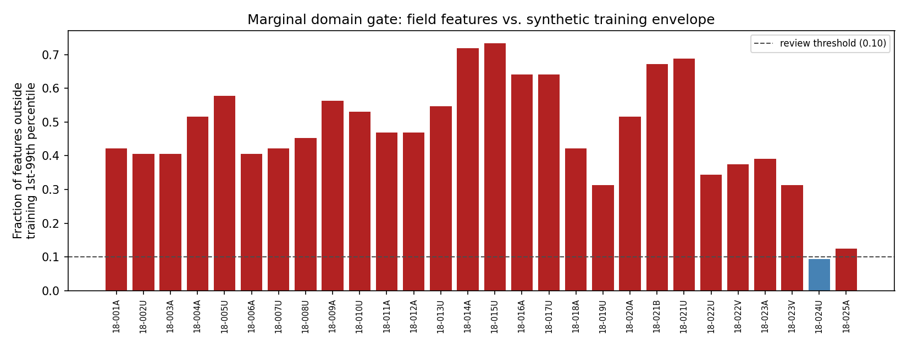
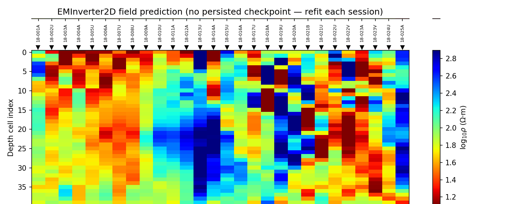
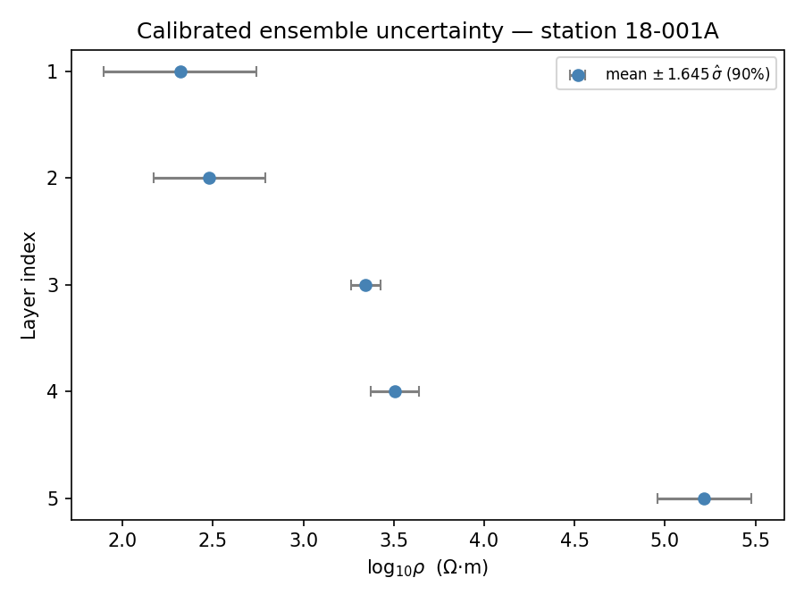
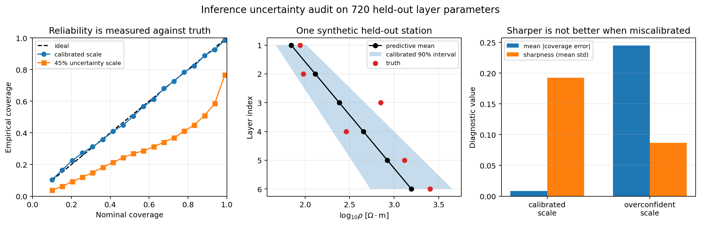

.. _ai_inversion_inference:

AI inversion inference
======================

Inference applies a fitted :term:`AI inversion` model to observations that
were not used to update its parameters. Although the network call may take
only milliseconds, a reliable inference workflow includes :term:`checkpoint`
verification, exact preprocessing replay, input-domain assessment, output
decoding, forward response reconstruction, uncertainty, scientific review,
and controlled export.

This guide assumes that the dataset and model have already passed the
procedures in :doc:`data_preparation`, :doc:`training`, and :doc:`validation`.
Inference is not the stage at which an unvalidated checkpoint becomes valid.

.. admonition:: Compatibility before prediction
   :class: important

   Never run a checkpoint on an array merely because its shape matches. The
   feature meaning, order, units, grid, normalization, target parameterization,
   backend, and model metadata must match the approved training contract.

Inference workflow
------------------

#. identify the approved model and deployment policy;
#. verify checkpoint integrity and compatibility;
#. load and QC field observations;
#. reproduce the feature contract exactly;
#. apply saved missing-value and normalization transformations;
#. gate unsupported or out-of-distribution inputs;
#. run prediction without changing model state;
#. decode outputs into documented physical units;
#. reconstruct responses and inspect residuals;
#. calculate calibrated uncertainty where available;
#. apply acceptance, review, or rejection rules;
#. export predictions with station order and provenance.

1. Define the inference unit
----------------------------

The unit passed to the model depends on architecture:

1-D
   One row per station. Stations can be batched, but each prediction is
   independent unless an ensemble or later spatial operation is applied.

2-D
   One complete ordered profile panel per batch item. Station count, order,
   channel count, frequency grid, and depth target must match training.

Graph 3-D
   One survey graph or a batch of graphs sharing compatible node and feature
   conventions. Predictions depend on feature rows and adjacency together.

PINN or hybrid
   Observations are attached at construction time rather than passed to
   ``predict(X)``. Both still require an explicit ``fit()`` call before
   ``predict()`` — there is no stateless, pre-fitted deployment path for
   these classes.

Do not split a profile or graph into convenient batches if that changes the
spatial context learned by the model.

2. Assemble the approved model package
--------------------------------------

An inference package should contain:

* checkpoint or fitted-model artifact;
* checksum and model identifier;
* architecture and backend information;
* feature schema and exact frequency/time grid;
* saved normalization or preprocessing state;
* output schema, transformations, and units;
* training-distribution summary;
* validation and calibration metrics;
* intended methods, geometry, and operating domain;
* known failure modes and rejection thresholds;
* software and dependency versions;
* approval status and reviewer.

A standalone weights file is insufficient. If the :term:`feature contract`
cannot be reconstructed unambiguously, the checkpoint should not be deployed.

3. Verify integrity and compatibility
-------------------------------------

Before loading, verify the artifact checksum using the project's approved
integrity tooling. Then compare model metadata with the inference request:

.. list-table::
   :header-rows: 1
   :widths: 34 66

   * - Compatibility field
     - Required match
   * - Method and solver
     - MT, CSAMT, TEM, or other documented physics and response convention;
       for learned 3-D models, preserve the training forward backend separately
       from the deep-learning runtime backend.
   * - Parameterization
     - Layer count, depth grid, thickness representation, and output order.
   * - Features
     - Components, apparent resistivity/phase or impedance channels, block
       order, transformations, and masks.
   * - Sampling grid
     - Exact frequencies or times, order, unit, and interpolation rule.
   * - Normalization
     - Saved training statistics and transformation version.
   * - Geometry
     - Station count/order for 2-D; coordinates and graph policy for 3-D.
   * - Backend
     - Compatible PyTorch/TensorFlow model construction and weight format.
   * - Operating domain
     - Supported ranges, noise, missingness, geology, and survey layout.

Reject incompatibility rather than modifying field arrays until the model runs.
Any deliberate adapter becomes a new preprocessing version that requires
validation.

4. Load a 1-D checkpoint
------------------------

:class:`pycsamt.ai.inversion.EMInverter1D` explicitly saves weights,
normalizers, hyperparameters, history, and selected metadata:

.. code-block:: pycon

   >>> from pathlib import Path
   >>> from pycsamt.ai.inversion import EMInverter1D
   >>> checkpoint = Path("checkpoints/mt1d_resnet_5layer.npz")
   >>> inverter = EMInverter1D.load(checkpoint)
   >>> inverter.n_layers, inverter.arch, inverter.log_thickness
   (5, 'resnet', True)

Loading restores the backend recorded in the checkpoint and rebuilds the
network. The compatible deep-learning backend must be installed. Treat a
checkpoint as executable model content and load only trusted artifacts. This
particular checkpoint was trained on the Willy AMT line's own frequency band
— 32 log-spaced frequencies from 1.05 to 9500 Hz — which matters for every
example that follows: the field feature grid must reproduce that exact band,
not a value copied from a different survey or a different guide page.

.. note::

   The named approved checkpoint and its training-percentile arrays are
   reference-run artifacts, not files distributed with the source checkout.
   The recorded outputs and existing figures below may therefore be read as a
   case study, but reproducing prediction values requires the reviewed model
   package. WILLY loading, feature-grid, finiteness, and geometry checks use
   bundled data and are executable directly.

Registry checkpoints can be requested with:

.. code-block:: pycon

   >>> inverter = EMInverter1D.from_pretrained(
   ...     "mt1d-resnet-5layer-v1",
   ...     cache_dir="model_cache",
   ... )

Registry presence does not guarantee that weights are currently downloadable
— see :doc:`agents`'s :class:`~pycsamt.agents.ModelZooAgent` walkthrough for
what a not-yet-released registry entry looks like in practice. Preserve
registry metadata and the downloaded file checksum. Do not replace a failed
download with new training while continuing to label the result as the
registry model.

5. Prepare 1-D field features
-----------------------------

Use the public bridge and the checkpoint's exact grid:

.. code-block:: pycon

   >>> from pycsamt.ai.inversion import sites_to_features_1d
   >>> from pycsamt.emtools._core import ensure_sites
   >>> sites = ensure_sites(
   ...     "data/AMT/WILLY_data/L18PLT",
   ...     recursive=True,
   ...     verbose=0,
   ... )
   >>> X_field, frequencies_hz, station_names = sites_to_features_1d(
   ...     sites,
   ...     comp="xy",
   ...     n_freqs=32,
   ...     freq_min=1.05,
   ...     freq_max=9500.0,
   ... )
   >>> X_field.shape
   (28, 64)

The bridge returns the block layout ``[log10(rho_a), phase_deg]``. Frequency
endpoints and ``n_freqs`` must come from model metadata, not memory or a
nearby example — and the boundary matters literally: these 28 stations cover
1.008–10400 Hz, so a query grid starting at ``freq_min=1.0`` puts one point
just outside every station's real range and returns ``nan`` there, while
``freq_min=1.05`` stays safely inside it.

Check the matrix before prediction:

.. code-block:: pycon

   >>> import numpy as np
   >>> print("Feature shape:", X_field.shape)
   Feature shape: (28, 64)
   >>> print("Non-finite fraction:", np.round(np.mean(~np.isfinite(X_field), axis=1), 3))
   Non-finite fraction: [0. 0. 0. 0. 0. 0. 0. 0. 0. 0. 0. 0. 0. 0. 0. 0. 0. 0. 0. 0. 0. 0. 0. 0.
    0. 0. 0. 0.]

``sites_to_features_1d`` leaves values outside a station's observed range as
``nan``. That is not a hypothetical edge case: requesting the wider band used
elsewhere in this guide series (:math:`10^{-4}` to :math:`10^{3}`\ Hz, the
:class:`~pycsamt.agents.AIInversionAgent` default) against these same 28
stations leaves 56.25% of every feature row non-finite, because natural-source
AMT simply has no usable signal down at :math:`10^{-4}`\ Hz. Apply only the
imputation/mask policy fitted and validated with the checkpoint — the
inverter's stored normalizer does not define a missing-value policy by
itself, and a plain feed-forward network propagates a single ``nan`` input
into an entirely ``nan`` output rather than silently ignoring it.

6. Replay preprocessing exactly
-------------------------------

For :class:`~pycsamt.ai.inversion.EMInverter1D`, ``predict()`` applies the
normalizer restored from the fitted object. Therefore supply features in the
same pre-normalized representation used by training. Do not normalize them a
second time.

For custom models, distinguish:

Raw transformation
   Conversion from physical observations into log resistivity, phase, masks,
   or other feature channels.

Grid transformation
   Sorting and interpolation onto the approved frequency/time/station axes.

Missing-value transformation
   Masking or imputation using the trained policy.

Statistical transformation
   Scaling with training-only means, standard deviations, or other fitted
   parameters.

Model input adaptation
   Batch and channel dimensions expected by the selected backend.

Version this pipeline as one unit. A change to any stage creates a new
deployment configuration and may invalidate prior validation.

7. Gate out-of-domain inputs
----------------------------

Run domain checks before predictions are visible to the interpreter. At
minimum, compare each field row against training feature percentiles:

.. math::
   :label: eq-ai-inference-domain-fraction

   g_s = \frac{1}{P}\sum_{j=1}^{P}
   \mathbf 1\!\left\{x_{sj}<q_{0.01,j}\ \text{or}\
   x_{sj}>q_{0.99,j}\right\},

where :math:`P` is feature count and the quantiles are fitted on training data
only. A threshold such as :math:`g_s>0.10` is an operational review rule, not
the probability that station :math:`s` is wrong.

.. code-block:: pycon

   >>> train_low = np.load("model_package/training_p01.npy")
   >>> train_high = np.load("model_package/training_p99.npy")
   >>> outside = (X_field < train_low) | (X_field > train_high)
   >>> outside_fraction = np.nanmean(outside, axis=1)
   >>> review_mask = outside_fraction > 0.10
   >>> int(review_mask.sum())
   27

The plotting code is intentionally explicit so the threshold and review
classification remain visible when this diagnostic is adapted:

.. code-block:: pycon

   >>> import matplotlib.pyplot as plt
   >>> fig, ax = plt.subplots(figsize=(10.5, 4.2))
   >>> colors = np.where(review_mask, "#dc2626", "#16a34a")
   >>> _ = ax.bar(np.arange(len(station_names)), outside_fraction, color=colors)
   >>> _ = ax.axhline(0.10, color="black", linestyle="--",
   ...                label="10% review threshold")
   >>> _ = ax.set(
   ...     xlabel="Station index", ylabel="Fraction outside training envelope"
   ... )
   >>> _ = ax.legend()
   >>> fig.tight_layout()
   >>> plt.show()

   Twenty-seven of the twenty-eight stations exceed the 10% review threshold;
   only one falls inside it. A synthetic training envelope built from a
   generic noise model is not automatically wide enough for a real survey.

Equation :eq:`eq-ai-inference-domain-fraction` is only a marginal, per-feature
gate on the synthetic percentile envelope, and it is
common for real field data to sit partly outside a generic synthetic prior
even when the predictions themselves remain usable. Strongly correlated feature
patterns can also remain out of domain even when every value lies inside its
individual range. Where available, also apply multivariate distance,
latent-space, density, ensemble disagreement, missingness, and geometry
checks — this bar chart is a first screen, not the final word.

The package supplies multivariate screens through
:func:`~pycsamt.ai.validation.flag_out_of_distribution`. Apply them in the
same feature representation used to define the reference set:

.. code-block:: pycon

   >>> from pycsamt.ai.validation import flag_out_of_distribution
   >>> training_features = np.load(  # doctest: +SKIP
   ...     "model_package/training_features_pre_normalization.npy"
   ... )
   >>> ood = flag_out_of_distribution(  # doctest: +SKIP
   ...     X_field, training_features, method="knn", k=5, quantile=0.99
   ... )
   >>> ood.scores.shape, round(ood.fraction_flagged, 3)  # doctest: +SKIP
   ((28,), 0.964)

``knn`` uses distance to the :math:`k`-th training neighbour and derives its
threshold from leave-one-out training distances. ``mahalanobis`` measures
distance in the training covariance geometry and requires more reference rows
than features plus a nonsingular covariance. Neither score is a probability;
feature scaling, reference selection, :math:`k`, method, and threshold are
part of the approved gate.

Define actions in advance:

``accept_for_prediction``
   Input falls inside validated operating conditions.

``predict_with_review``
   Limited departure exists, prediction is retained for expert evaluation, and
   the departure is visible in outputs.

``reject``
   Input is incompatible or materially outside the validated domain.

Do not use the visual plausibility of the prediction to override an input gate
without documenting a new review decision.

8. Run 1-D prediction
---------------------

Raw parameter vectors
~~~~~~~~~~~~~~~~~~~~~

.. code-block:: pycon

   >>> y_pred = inverter.predict(X_field, as_log_rho=True)
   >>> y_pred.shape
   (28, 9)

The output contains resistivity parameters first and thickness parameters
after them — for this 5-layer checkpoint, that is 5 log10-resistivity values
followed by 4 thickness values, concatenated into one length-9 row. With
``as_log_rho=True``, resistivity remains log10 ohm metres. Thickness behavior
depends on the fitted inverter's ``log_thickness`` setting (``True`` here).
Do not assume the entire output vector has one unit — the same raw-vector
layout resurfaces for :class:`~pycsamt.ai.inversion.GCNInverter3D` in
:ref:`ai_inversion_inference_3d` below, and slicing it incorrectly there
silently mixes resistivity and thickness together.

With ``as_log_rho=False``, the method converts resistivity to linear ohm metres
and converts thickness to linear metres when ``log_thickness`` is enabled.

LayeredModel output
~~~~~~~~~~~~~~~~~~~

Prefer :meth:`pycsamt.ai.inversion.EMInverter1D.predict_models` when downstream
code expects physical layered models:

.. code-block:: pycon

   >>> models = inverter.predict_models(X_field)
   >>> sum(1 for m in models if m is None)
   0
   >>> models[0].resistivity.round(1), models[0].thickness.round(1)
   (array([  327.2,   647.8,  5680.7,  2609.5, 1041267.2]), array([ 29.5, 374.2, 256.3, 284.8]))

This method back-transforms resistivity and thickness, clips resistivity to a
positive minimum and thickness to at least one metre, and can return ``None``
when model construction fails. Clipping should be reported; a boundary value
may signal unsupported output rather than a physical estimate. A deep,
resistive basement layer such as station 18-001A's :math:`10^{6}`-scale final
value is physically plausible for crystalline basement, but it is exactly the
kind of boundary-adjacent estimate that response reconstruction (step 15)
should confirm rather than accept on inspection alone.

Single synthetic response
~~~~~~~~~~~~~~~~~~~~~~~~~

``predict_response(response)`` is a convenience for a compatible
``ForwardResponse``. Field :class:`~pycsamt.site.Sites` should use the public
bridge so station identity and interpolation remain explicit.

9. Run 2-D profile prediction
-----------------------------

Create the field panel with the contract used during training:

.. code-block:: pycon

   >>> from pycsamt.ai.inversion import sites_to_panel_2d
   >>> X_profile, frequencies_hz, station_names = sites_to_panel_2d(
   ...     sites,
   ...     n_freqs=32,
   ...     n_components=2,
   ...     comp_te="xy",
   ...     comp_tm="yx",
   ...     freq_min=1.05,
   ...     freq_max=9500.0,
   ... )
   >>> section = inverter_2d.predict(X_profile, as_log_rho=True)
   >>> X_profile.shape, section.shape
   ((1, 2, 32, 28), (1, 40, 28))

Plot the returned section with one declared transformation and fixed limits;
letting each deployment choose its own colour range makes comparisons
misleading:

.. code-block:: pycon

   >>> import matplotlib.pyplot as plt
   >>> fig, ax = plt.subplots(figsize=(11.0, 5.0))
   >>> image = ax.imshow(section[0], aspect="auto", origin="upper",
   ...                   cmap="turbo", vmin=0.0, vmax=4.0)
   >>> _ = ax.set(
   ...     xlabel="Station index", ylabel="Depth-cell index",
   ...     title="Predicted 2-D log-resistivity section",
   ... )
   >>> _ = fig.colorbar(image, ax=ax, label="log10 resistivity [ohm m]")
   >>> fig.tight_layout()
   >>> plt.show()

The input shape is ``(n_profiles, n_components, n_freqs, n_stations)``. The
output shape is ``(n_profiles, n_depth, n_stations)``. ``n_components=2`` is
deliberate here, not a shortcut: the public 2-D synthetic generator behind a
freshly trained :class:`~pycsamt.ai.inversion.EMInverter2D` produces log10
apparent resistivity and phase for one component, not four Re/Im tensor
channels, so a panel and a training target must agree on that count before
``fit()`` is ever called.

   This section comes from a U-Net retrained fresh for this example — see
   the warning below on why the checkpoint step being demonstrated for 1-D
   is not available here. Sixty epochs against 28 stations at once produces
   a noticeably patchier result than the 1-D and hybrid sections elsewhere on
   this page; that is a fast-retrain artefact to weigh against, not evidence
   the architecture is unsuitable. Station names are placed along the top;
   depth-cell index increases vertically.

The 2-D inverter applies its learned input and target normalization internally.
The field station count must match the inverter's configured station axis.
Station ordering is preserved by the bridge and must already follow reviewed
profile chainage.

In the current implementation, each of ``_x_mean``, ``_x_std``, ``_y_mean``,
and ``_y_std`` is one scalar computed over the complete training tensor, not a
per-channel or per-frequency array. ``predict`` reuses those saved scalars.
Although fitting computes them with ``nanmean``/``nanstd``, normalization does
not remove missing cells: a ``nan`` remains ``nan`` and propagates through the
network. A finite-value or validated imputation gate is therefore required
before both fitting and inference.

Use ``as_log_rho=False`` for linear ohm metres. Retain the fixed depth grid
from model metadata; the predicted array alone does not contain depth
coordinates.

The fitted 2-D model can be persisted through the ``BaseEMNet`` interface inherited by
:class:`~pycsamt.ai.inversion.EMInverter2D`:

.. code-block:: pycon

   >>> inverter_2d.save("checkpoints/line2d_unet.npz")  # doctest: +SKIP
   >>> restored_2d = type(inverter_2d).load(  # doctest: +SKIP
   ...     "checkpoints/line2d_unet.npz"
   ... )
   >>> restored_2d.n_depth, restored_2d.n_stations, restored_2d.n_freqs  # doctest: +SKIP
   (40, 28, 32)

The checkpoint carries architecture parameters, backend weights, channel
selection, and fitted scalar input/target normalization. It does not turn the
frequency values, station identities, profile chainage, component convention,
depth coordinates, training distribution, or validation decision into an
inference manifest. Preserve those scientific contracts beside the checkpoint
and check them before calling ``predict``.

.. _ai_inversion_inference_3d:

10. Run graph 3-D prediction
----------------------------

Graph prediction requires features plus adjacency or coordinates:

.. code-block:: pycon

   >>> from pycsamt.ai.inversion import (
   ...     sites_to_coords_3d,
   ...     sites_to_features_1d,
   ... )
   >>> X_nodes, frequencies_hz, station_names = sites_to_features_1d(
   ...     sites,
   ...     comp="xy",
   ...     n_freqs=32,
   ...     freq_min=1.05,
   ...     freq_max=9500.0,
   ... )
   >>> coords_m = sites_to_coords_3d(sites, station_spacing=500.0)
   >>> graph_prediction = inverter_3d.predict(
   ...     X_nodes,
   ...     coords=coords_m,
   ...     radius=250.0,
   ...     as_log_rho=True,
   ... )
   >>> graph_prediction.shape
   (28, 9)

The network call itself does not run Maxwell physics. The checkpoint must
state whether its training responses came from tiled MT1D columns,
``MT3DAdapter``, or a solver-neutral corpus produced with
``ModEm3DAdapter``. All three checkpoints may share the same GCN architecture
and output shape while representing materially different training
distributions. The inference record must therefore preserve the dataset
manifest and forward-backend identity; a generic label such as ``gcn3d`` or
``physics=mt3d`` is not enough to establish that ModEM generated the training
responses.

The field feature order, coordinate order, and station-name order must be
identical. ``sites_to_coords_3d`` reads each station's EDI header coordinates
and projects them to local metres; it falls back to an artificial uniform
line only when a station's coordinates are genuinely absent or all zero — do
not assume a fallback layout is in effect just because the numbers look
large, since the projection here is an absolute equirectangular approximation
rather than one centred on a local origin.

Like the 2-D estimator, the current GCN stores one global scalar mean and
standard deviation for all input values and another pair for all target
values. This is the implemented contract, even when feature blocks have
different physical meanings. Do not replace it at inference with per-feature
standardization unless the model is retrained and revalidated with that new
contract.

Like the 1-D raw vector in step 8, ``graph_prediction`` concatenates
resistivity first and thickness second — ``(n_stations, 2 * n_layers - 1)``,
9 columns for these 5-layer models. Split it explicitly before treating any
part of it as a resistivity section:

.. code-block:: pycon

   >>> n_layers = 5
   >>> pred_rho = graph_prediction[:, :n_layers]
   >>> pred_rho.min().round(2), pred_rho.max().round(2)
   (-1.61, 6.29)

``pred_rho`` has shape ``(station, layer)``. It is a set of graph-coupled
vertical columns, not yet a rectilinear ``(z, y, x)`` resistivity volume. The
layer depths come from each row's predicted thickness block; if thickness
varies by station, even the vertical cell boundaries are not shared until a
declared resampling is applied. Creating a map volume requires an explicit
operator

.. math::
   :label: eq-ai-inference-graph-to-grid

   \mathbf m_o=Q_{(s,\ell)\rightarrow(z,y,x)}
      \!\left(\mathbf m_{s\ell},\mathbf c_s,\mathbf h_{s\ell}\right),

where :math:`\mathbf c_s` are station coordinates and
:math:`\mathbf h_{s\ell}` are layer thicknesses. Record the target
:term:`output grid`, interpolation or support radius, extrapolation rule, and
cells with no station support. Equation :eq:`eq-ai-inference-graph-to-grid`
is a display/model-transfer step; it does not add spatial resolution or turn
the prediction into a numerical 3-D inversion.

If the fitted inverter stored an approved adjacency matrix, omit new geometry
only when field nodes and order are exactly the same. Otherwise pass a reviewed
adjacency explicitly:

.. code-block:: pycon

   >>> graph_prediction = inverter_3d.predict(
   ...     X_nodes,
   ...     adjacency=approved_adjacency,
   ...     as_log_rho=True,
   ... )

Inspect graph degree and disconnected nodes. Changing ``radius`` changes the
model context and is not a harmless inference option.

The graph inverter also inherits ``save()/load()``. Its checkpoint includes
network weights, fitted scalar normalization, backend, and the adjacency stored
during ``fit`` when one exists:

.. code-block:: pycon

   >>> inverter_3d.save("checkpoints/survey_gcn.npz")  # doctest: +SKIP
   >>> restored_3d = type(inverter_3d).load(  # doctest: +SKIP
   ...     "checkpoints/survey_gcn.npz"
   ... )
   >>> restored_3d.n_features, restored_3d.n_layers  # doctest: +SKIP
   (64, 5)

Coordinates, station names, coordinate reference system, radius-based graph
construction policy, and the meaning of every feature and output column still
belong in the external deployment record. When a stored adjacency is reused,
verify its shape and station ordering against the inference survey; a valid
matrix attached to the wrong node order is scientifically invalid without
raising a shape error.

Elevation deserves the same separation. ``sites_to_coords_3d`` returns
horizontal coordinates for graph construction; draping the decoded columns
over station elevation changes their presentation, not the forward physics.
Neither inference nor gridding introduces inactive air cells. A
terrain-physics claim requires a separately constructed, terrain-capable
Maxwell problem and a backend validated for it; the current MT2D, MT3D, and v1
ModEM adapters do not provide that capability.

11. Predict graph uncertainty
-----------------------------

Use :term:`Monte Carlo dropout` where supported:

.. code-block:: pycon

   >>> mean, standard_deviation = inverter_3d.predict_with_uncertainty(
   ...     X_nodes,
   ...     coords=coords_m,
   ...     radius=250.0,
   ...     n_mc=40,
   ... )
   >>> std_rho = standard_deviation[:, :n_layers]
   >>> float(std_rho.mean().round(3))
   0.11

Verify the exact signature in the installed API when passing adjacency versus
coordinates. The standard deviation is in output-parameter space — slice it
to the resistivity block exactly as in step 10 — and should be reported with
the same transformation as the mean. It captures stochastic dropout
variation only, one :term:`epistemic uncertainty` estimate among several, not
total inversion or domain uncertainty.

12. Ensemble inference
----------------------

:class:`pycsamt.ai.inversion.EnsembleInverter` can return a mean, spread,
quantiles, intervals, or calibrated posterior draws:

.. code-block:: pycon

   >>> from pycsamt.ai.inversion import EnsembleInverter
   >>> ensemble = EnsembleInverter.load("checkpoints/mt1d_ensemble")
   >>> mean = ensemble.predict(X_field)
   >>> mean, std = ensemble.predict_with_uncertainty(X_field)
   >>> quantiles = ensemble.predict_quantiles(X_field, q=(0.05, 0.50, 0.95))
   >>> mean.shape, std.shape
   ((28, 9), (28, 9))

An ensemble has explicit ``save()`` and ``load()`` support. Its members must
share a compatible input and output contract. The current serialization stores
member checkpoints, estimator count, and seeds; it does **not** serialize the
attached conformal or posterior calibrators.

After loading, restore calibration through the project's reviewed
:term:`calibration set` and call ``calibrate()`` again before requesting
intervals:

.. code-block:: pycon

   >>> cal = np.load("checkpoints/mt1d_ensemble_cal_set.npz")
   >>> _ = ensemble.calibrate(cal["X_cal"], cal["y_cal"], alpha=0.10)
   >>> mean, std = ensemble.predict_with_uncertainty(X_field)
   >>> std[0, :5].round(3)
   array([0.257, 0.189, 0.05 , 0.081, 0.158])

For a single station, plot interval bounds against layer index without first
converting only the mean to linear resistivity:

.. code-block:: pycon

   >>> import matplotlib.pyplot as plt
   >>> station_index = 0
   >>> layer = np.arange(1, inverter.n_layers + 1)
   >>> center = mean[station_index, :inverter.n_layers]
   >>> spread = std[station_index, :inverter.n_layers]
   >>> lower90 = center - 1.645 * spread
   >>> upper90 = center + 1.645 * spread
   >>> fig, ax = plt.subplots(figsize=(5.4, 5.0))
   >>> _ = ax.errorbar(
   ...     center, layer, xerr=[center - lower90, upper90 - center],
   ...     fmt="o-", capsize=3,
   ... )
   >>> ax.invert_yaxis()
   >>> _ = ax.set(xlabel="log10 resistivity [ohm m]", ylabel="Layer index")
   >>> fig.tight_layout()
   >>> plt.show()

   Layer-by-layer calibrated uncertainty for station 18-001A. Interval width
   grows with depth, consistent with declining sensitivity as period
   increases — a shallower, better-resolved layer should show a tighter band
   than the half-space estimate beneath it.

:meth:`~pycsamt.ai.inversion.EnsembleInverter.predict_intervals` uses a
*different* calibrator — split :term:`conformal prediction` — built around one
shared multiplier :math:`\hat q` applied to every output dimension at once:

.. math::
   :label: eq-ai-inference-conformal-joint

   s_i = \max_j \frac{\lvert y_{ij} - f(\mathbf{x}_i)_j\rvert}{\sigma_j(\mathbf{x}_i)+\varepsilon},
   \qquad
   \hat q = \operatorname{Quantile}_{q_n}(s_1,\dots,s_{n_{\rm cal}}),
   \qquad
   q_n=\min\!\left(1,
      \frac{\left\lceil(n_{\rm cal}+1)(1-\alpha)\right\rceil}{n_{\rm cal}}
   \right),
   \qquad
   \hat{C}_j(\mathbf{x}) = \bigl[f(\mathbf{x})_j - \hat q\,\sigma_j(\mathbf{x}),\ f(\mathbf{x})_j + \hat q\,\sigma_j(\mathbf{x})\bigr].

Equation :eq:`eq-ai-inference-conformal-joint` takes the *worst* normalised
residual across all 9 output dimensions and gives a valid joint guarantee, but
it means one badly scaled dimension inflates every
other dimension's interval too:

.. code-block:: pycon

   >>> center, lower, upper = ensemble.predict_intervals(X_field, alpha=0.10)
   >>> lower[0, :5].round(1), upper[0, :5].round(1)
   (array([-8233.4, -6040.6, -1608.2, -2606.9, -5070. ]), array([8238. , 6045.6, 1614.9, 2613.9, 5080.4]))

Compare that to the calibrated ``std``-based interval above: the resistivity
parameters are perfectly well behaved (``std`` of a few tenths of a
log10-unit), but because this same target vector also carries linear-metre
thickness values two to three orders of magnitude larger, the single
:math:`\hat q` needed to cover the worst thickness dimension dwarfs the
resistivity intervals into physical nonsense. Read this as a warning about
:math:`\hat q`'s joint-max design when a target mixes incompatible units, not
as a property of the resistivity estimate itself — the calibrated
``predict_with_uncertainty`` above and ``predict_posterior`` below both scale
each output dimension by its own residual spread and stay interpretable.

.. code-block:: pycon

   >>> posterior_draws = ensemble.predict_posterior(
   ...     X_field, n_samples=500, rng=np.random.default_rng(42),
   ... )
   >>> posterior_draws.shape
   (500, 28, 9)
   >>> posterior_draws[:, 0, :5].std(axis=0).round(3)
   array([0.262, 0.178, 0.049, 0.08 , 0.157])

Conformal coverage assumes calibration and deployment examples are
:term:`exchangeability`-compatible. The convenience method below does not
evaluate the conformal interval from equation
:eq:`eq-ai-inference-conformal-joint`; it measures how often targets fall
inside the mean plus or minus the default 1.96 calibrated standard deviations.
On this reference calibration set that separate Gaussian-style diagnostic was
only 12.3%:

.. code-block:: pycon

   >>> ensemble.coverage(cal["X_cal"], cal["y_cal"])
   0.123

That gap is not uniform across output dimensions — the resistivity
parameters cover far better than the thickness parameters, which this
ensemble's raw inter-member spread represents poorly. A single pooled
coverage number can hide exactly this kind of per-parameter split. Evaluate
conformal coverage directly from ``lower <= y <= upper`` when reporting the
conformal method, and distinguish marginal, simultaneous-vector, and
per-parameter coverage. Preserve the calibration dataset ID and empirical
test coverage, broken out by output
dimension where practical, with the inference output. Do not assume a loaded
ensemble remains calibrated merely because the ensemble directory was saved
after calibration.

Reliability and sharpness answer different questions
~~~~~~~~~~~~~~~~~~~~~~~~~~~~~~~~~~~~~~~~~~~~~~~~~~~~

For Gaussian predictive summaries, a nominal central interval of level
:math:`c` is

.. math::
   :label: eq-ai-inference-gaussian-interval

   I_c(\mathbf x)=\left[
      \mu(\mathbf x)-\Phi^{-1}\!\left(\frac{1+c}{2}\right)\sigma(\mathbf x),
      \mu(\mathbf x)+\Phi^{-1}\!\left(\frac{1+c}{2}\right)\sigma(\mathbf x)
   \right],

where :math:`\Phi^{-1}` is the standard-normal quantile. On an independent
held-out set with validity mask :math:`M`, empirical coverage is

.. math::
   :label: eq-ai-inference-empirical-coverage

   \widehat C(c)=\frac{1}{|M|}\sum_{i\in M}
      \mathbf 1\{y_i\in I_c(\mathbf x_i)\}.

A reliable predictor follows :math:`\widehat C(c)\approx c` over several
levels. :term:`Sharpness` measures interval concentration--implemented by
:func:`~pycsamt.ai.validation.predictive_sharpness` as mean predictive
standard deviation--and is useful only after reliability is acceptable. An
arbitrarily tiny standard deviation is very sharp and very wrong whenever it
fails to cover held-out truth.

The executed diagnostic below uses
:func:`~pycsamt.ai.validation.reliability_curve` on 720 synthetic held-out
layer parameters. Both candidates have the same predictive mean. One reports
the data-generating uncertainty scale; the other reports only 45% of it. The
exact figure code is exposed so the arrays can be replaced with calibration or
test outputs from a real model package.

.. code-dropdown:: ../../../scripts/generate_ai_inversion_figures.py
   :language: python
   :pyobject: make_inference_calibration_diagnostic
   :linenos:
   :title: View calibration-diagnostic source code

   Executed comparison of a calibrated uncertainty scale and an overconfident
   scale for identical predictive means.

The calibrated curve stays close to the diagonal, with mean absolute coverage
error 0.009 and mean standard deviation 0.193 log10 ohm metres. Shrinking the
standard deviations makes the result look sharper (0.087) but raises coverage
error to 0.245; even the nominal 99% intervals cover only 76.7% of held-out
parameters. The middle panel also shows why one station is not a calibration
test: a few truths can fall inside or outside by chance. Reliability is an
ensemble property measured on untouched examples, then stratified by layer,
parameter type, domain status, and decision-relevant subgroup.

13. PINN and hybrid inference
-----------------------------

PINN and hybrid classes do not follow the same stateless ``predict(X)`` pattern
as supervised surrogates: both are constructed directly from ``sites`` and
require an explicit ``fit()`` call before ``predict()`` returns anything.
:class:`pycsamt.ai.inversion.PINNInverter1D.predict` then returns fitted
layered models after observation-specific optimization, and
:class:`pycsamt.ai.inversion.HybridInverter1D.predict` returns the refined
models associated with its configured observations:

.. code-block:: pycon

   >>> from pycsamt.ai.inversion import PINNInverter1D
   >>> pinn = PINNInverter1D(
   ...     "data/AMT/WILLY_data/L18PLT", solver="mt1d", n_layers=10,
   ...     depth_max=2000.0, smoothness_weight=0.01, lr=1e-2, comp="xy",
   ... )
   >>> _ = pinn.fit(epochs=400, verbose=False)
   >>> pinn_models = pinn.predict()
   >>> len(pinn_models), sum(1 for m in pinn_models if m is None)
   (28, 0)
   >>> pinn_models[0].resistivity.round(0)
   array([ 100.,  957.,  623.,  821.,  622.,  821.,  622.,  821.,  622., 821.])

Ten layers were requested, but from the third layer down the values settle
into an alternating ~623/~821 pattern rather than resolving independently — a
visible symptom of :term:`non-uniqueness`: past a certain depth the
smoothness-regularised physics loss stops discriminating between layer
configurations that produce nearly the same surface response, and the
optimizer parks on one arbitrary member of that family. Report the depth
beyond which layers stop varying independently rather than presenting all
ten as equally resolved.

.. code-block:: pycon

   >>> from pycsamt.ai.inversion import HybridInverter1D
   >>> hybrid = HybridInverter1D(
   ...     "data/AMT/WILLY_data/L18PLT",
   ...     ai_inverter="checkpoints/mt1d_resnet_5layer.npz",
   ...     solver="mt1d", max_iter=150, smoothness_weight=0.005,
   ...     lr=5e-3, comp="xy", n_freqs=32,
   ... )
   >>> _ = hybrid.fit(verbose=False)
   >>> hybrid_models = hybrid.predict()
   >>> hybrid_models[0].resistivity.round(1)
   array([1.348e+02, 5.770e+02, 3.793e+03, 2.258e+03, 1.117e+05])

The hybrid result stays close to the plain checkpoint's own prediction for
this station (compare step 8's ``[327, 648, 5681, 2610, 1.04e6]``) while
refining it against the physics residual — starting from a trained AI
estimate rather than an arbitrary initial model is exactly the point of the
two-stage design, and a hybrid result that looks nothing like its AI starting
point is worth investigating before it is trusted.

Treat both as inversion runs rather than pure checkpoint deployment:

* preserve observations and optimizer configuration;
* verify convergence and loss components;
* record regularization and initialization;
* inspect fitted responses and per-station residuals;
* do not reuse a result for different observations without rerunning the
  documented workflow.

See :doc:`pinn_2d` for the complete profile workflow.

14. Decode outputs safely
-------------------------

Every exported array needs a schema. Record:

* array shape and axis names;
* station order;
* depth/layer coordinates;
* parameter block boundaries;
* log10 versus linear values;
* resistivity and thickness units;
* masked, rejected, or clipped predictions;
* model/checkpoint identifier;
* preprocessing and inference version.

For the five-layer checkpoint, decoding raw row :math:`\mathbf y` is

.. math::
   :label: eq-ai-inference-decode

   \rho_\ell = 10^{y_\ell},\quad \ell=1,\ldots,5,
   \qquad
   h_k =
   \begin{cases}
      10^{y_{5+k}}, & \text{if thickness was trained in log space},\\
      y_{5+k}, & \text{otherwise},
   \end{cases}
   \quad k=1,\ldots,4.

Equation :eq:`eq-ai-inference-decode` is model metadata in mathematical form;
guessing the second branch from numerical magnitude can silently turn metres
into powers of ten.

Validate decoded properties:

.. code-block:: pycon

   >>> for name, model in zip(station_names, models):
   ...     if model is None:
   ...         continue
   ...     if not np.all(np.isfinite(model.resistivity)):
   ...         raise ValueError(f"{name}: non-finite resistivity")
   ...     if not np.all(model.resistivity > 0):
   ...         raise ValueError(f"{name}: non-positive resistivity")
   ...     if not np.all(model.thickness > 0):
   ...         raise ValueError(f"{name}: non-positive thickness")

No error raised for these 28 stations — but positive and finite values are
necessary, not sufficient. Also compare with training bounds and flag
predictions near limits, such as station 18-001A's basement resistivity above.

15. Reconstruct forward responses
---------------------------------

A predicted model should be passed through the relevant forward operator and
compared with field observations. For layered MT:

.. code-block:: pycon

   >>> from pycsamt.forward import MT1DForward
   >>> reconstructed = []
   >>> for model in models:
   ...     if model is None:
   ...         reconstructed.append(None)
   ...         continue
   ...     reconstructed.append(MT1DForward(freqs=frequencies_hz).run(model))

Calculate residuals in a clearly defined space. A robust report states:

* apparent resistivity, phase, complex impedance, or decay values used;
* linear or log residual transformation;
* observational errors and weights;
* interpolation grid;
* components included;
* missing-data mask;
* global and station/frequency summaries.

When standard deviations :math:`\sigma_i` are available, one comparable
summary is the normalized RMS

.. math::
   :label: eq-ai-inference-nrms

   \operatorname{NRMS}
   = \sqrt{\frac{1}{N}\sum_{i=1}^{N}
      \left(\frac{d_i^{\mathrm{pred}}-d_i^{\mathrm{obs}}}{\sigma_i}\right)^2}.

Report equation :eq:`eq-ai-inference-nrms` separately by component and useful
frequency band as well as globally. A single average can still hide where a
structured residual occurs.

Do not accept a model solely because it resembles expected geology. Conversely,
response agreement alone cannot establish uniqueness — as the PINN layers in
step 13 make concrete.

For a graph checkpoint, choose the reconstruction operator according to the
claim being tested. Station-wise ``MT1DForward`` responses test whether each
decoded column is locally compatible with the observations, but they do not
test the lateral coupling represented during genuine 3-D Maxwell training.
To audit that claim, first apply the documented graph-to-grid mapping from
equation :eq:`eq-ai-inference-graph-to-grid`, transfer the result onto a
:term:`solver mesh`, and solve the shared 3-D conductivity model with
``MT3DAdapter`` for a research-scale check or ``ModEm3DAdapter`` for the
production backend. Compare the requested tensor components on the observed
frequency and station axes, preserving observational errors and masks.

That 3-D reconstruction is currently an explicit workflow, not a method
inside ``GCNInverter3D.predict``. Its result must retain the graph prediction,
mapping configuration, Maxwell problem hash, backend/version, diagnostics,
and residual table. ModEM's v1 diagnostic residual of zero is a documented
placeholder because its predicted-data file exposes no algebraic residual;
use response benchmarks and observed-data residuals as the evidence instead.

16. Apply acceptance rules
--------------------------

Combine gates rather than relying on one RMS:

Input compatibility
   Exact feature contract, finite values, frequency support, geometry, and
   accepted missingness.

Domain support
   Training-envelope, multivariate, latent, or ensemble diagnostics.

Output validity
   Finite physical parameters, supported bounds, no unexplained clipping, and
   correct shape.

Response fit
   Error-aware reconstructed response with no structured residual pattern.

Uncertainty
   Calibrated interval or model spread suitable for the decision.

Scientific consistency
   Dimensionality, classical baseline, boreholes, geology, and neighboring
   observations.

Assign ``accepted``, ``needs_review``, or ``rejected`` per station/profile and
preserve the reason. Do not remove rejected stations from exports without a
rejection table.

17. Batch and resource behavior
-------------------------------

For 1-D models, batch size affects memory and throughput but should not change
station semantics. Confirm numerical consistency between a small batch and the
production batch.

For 2-D and graph models, one batch item contains a complete profile or survey.
Padding multiple geometries to one size requires a trained mask policy.

Run inference in evaluation mode. The provided supervised prediction methods
handle backend evaluation internally. MC dropout intentionally reintroduces
stochastic behavior for uncertainty; use a documented sample count and seed
where the API permits.

Record device, backend, precision, batch size, elapsed time, and memory-related
fallbacks. Numerical differences across devices should be evaluated against an
approved tolerance.

18. Export an inference record
------------------------------

A reproducible inference directory can contain:

.. code-block:: text

   inference/L18_mt1d_resnet_v001/
   ├── manifest.yml
   ├── checkpoint_reference.yml
   ├── input/
   │   ├── station_inventory.csv
   │   ├── field_features.npz
   │   └── domain_diagnostics.csv
   ├── predictions/
   │   ├── parameter_vectors.npz
   │   ├── layered_models.csv
   │   └── status_by_station.csv
   ├── responses/
   │   └── reconstructed_residuals.csv
   ├── uncertainty/
   │   └── prediction_intervals.npz
   ├── figures/
   └── review/
       └── inference_review.md

The manifest should record checkpoint checksum, feature contract, input survey
and QC IDs, preprocessing version, domain thresholds, software/backend, device,
random settings, output schema, accepted/rejected stations, reviewer, status,
and date.

Complete 1-D inference example
-------------------------------

.. code-block:: pycon

   >>> from pathlib import Path
   >>> import json
   >>> import numpy as np
   >>> from pycsamt.ai.inversion import EMInverter1D, sites_to_features_1d
   >>> from pycsamt.emtools._core import ensure_sites
   >>> from pycsamt.forward import MT1DForward
   >>> root = Path("inference/L18_mt1d_resnet_v001")
   >>> root.mkdir(parents=True, exist_ok=True)
   >>> inverter = EMInverter1D.load("checkpoints/mt1d_resnet_5layer.npz")
   >>> sites = ensure_sites("data/AMT/WILLY_data/L18PLT", recursive=True, verbose=0)
   >>> X, freqs, names = sites_to_features_1d(
   ...     sites, comp="xy", n_freqs=32, freq_min=1.05, freq_max=9500.0,
   ... )
   >>> # Replace this gate with the approved model-package policy.
   >>> finite_fraction = np.mean(np.isfinite(X), axis=1)
   >>> accepted = finite_fraction == 1.0
   >>> int(accepted.sum())
   28
   >>> models = [None] * len(names)
   >>> if accepted.any():
   ...     accepted_models = inverter.predict_models(X[accepted])
   ...     for index, model in zip(np.flatnonzero(accepted), accepted_models):
   ...         models[index] = model
   >>> responses = []
   >>> forward = MT1DForward(freqs=freqs)
   >>> for model in models:
   ...     responses.append(None if model is None else forward.run(model))
   >>> rho = np.full((len(names), inverter.n_layers), np.nan)
   >>> thickness = np.full((len(names), inverter.n_layers - 1), np.nan)
   >>> for index, model in enumerate(models):
   ...     if model is not None:
   ...         rho[index] = model.resistivity
   ...         thickness[index] = model.thickness
   >>> np.savez_compressed(
   ...     root / "predictions.npz",
   ...     station_names=np.asarray(names),
   ...     frequencies_hz=freqs,
   ...     resistivity_ohm_m=rho,
   ...     thickness_m=thickness,
   ...     accepted=accepted,
   ... )
   >>> manifest = {
   ...     "checkpoint": "mt1d_resnet_5layer.npz",
   ...     "component": "xy",
   ...     "n_freqs": 32,
   ...     "freq_min_hz": 1.05,
   ...     "freq_max_hz": 9500.0,
   ...     "feature_layout": "log10_rho_then_phase_deg",
   ...     "accepted_stations": int(accepted.sum()),
   ...     "rejected_stations": int((~accepted).sum()),
   ... }
   >>> _ = (root / "manifest.json").write_text(
   ...     json.dumps(manifest, indent=2), encoding="utf-8",
   ... )

Because the field query grid was matched to the checkpoint's own training
band (step 5), every station clears the strict all-finite gate here — a
direct contrast with the 56.25%-nonfinite result a mismatched grid would have
produced, and with the 27-of-28 review flags the *percentile* gate in step 7
raises on the very same stations. A production model may use a different
approved policy for either gate, but it must not improvise one during
deployment.

Review checklist
----------------

.. list-table::
   :header-rows: 1
   :widths: 31 69

   * - Check
     - Required evidence
   * - Model is approved
     - Identifier, checksum, model card, validation, calibration, and status.
   * - Contract matches
     - Method, features, grid, normalization, output schema, and geometry.
   * - Inputs are traceable
     - Survey, QC, processing, station order, coordinates, and exclusions.
   * - Missingness follows policy
     - Masks/imputation identical to validation and visible in results.
   * - Domain gate runs first
     - Thresholds, diagnostics, accepted/review/rejected status, and reasons.
   * - Prediction is immutable
     - Evaluation mode, no fitting, no normalization update, and recorded
       backend/device.
   * - Outputs decode correctly
     - Log/linear conversions, units, layers, depth, station axes, and clipping.
   * - Responses are reconstructed
     - Forward operator, components, errors, residual definition, and patterns.
   * - Uncertainty is conditional
     - Method, calibration set, coverage, domain-shift limitation, and sample
       count.
   * - Release is auditable
     - Manifest, arrays, status table, checkpoint reference, reviewer, and date.

Common mistakes
---------------

Avoid these errors:

* loading an untrusted checkpoint;
* checking only feature count rather than feature meaning;
* rebuilding normalization from field data;
* silently filling NaNs with convenient values;
* predicting before out-of-domain screening;
* treating all output columns as log10 values;
* losing station order when exporting predictions;
* changing profile station count or graph radius at deployment;
* calling graph-context output a full numerical 3-D inversion;
* calling ``(station, layer)`` predictions a rectilinear volume without a
  documented output-grid mapping and unsupported-cell mask;
* reporting an MT1D column reconstruction as validation of coupled MT3D
  response physics, or calling an inference ModEM-generated when only the
  network ran;
* treating an elevation-draped prediction as terrain-aware forward physics;
* treating MC dropout or ensemble spread as total uncertainty;
* reading a shared-multiplier conformal interval as if it were scaled
  per-parameter, especially when the target mixes resistivity and thickness;
* claiming conformal field coverage from synthetic calibration alone;
* accepting geological-looking models without response reconstruction;
* exporting predictions without rejected-input records;
* loading a 2-D or 3-D checkpoint without restoring its external frequency,
  station, coordinate, graph, depth, and feature contracts.

Next steps
----------

Continue with:

* :doc:`validation` for response, baseline, field, and acceptance testing;
* :doc:`uncertainty` for calibration, ensembles, and distribution shift;
* :doc:`reporting` for model cards and controlled prediction packages;
* :doc:`agents` for standard EDI-to-prediction orchestration;
* :doc:`pinn_2d` for observation-specific physics-informed inference.
