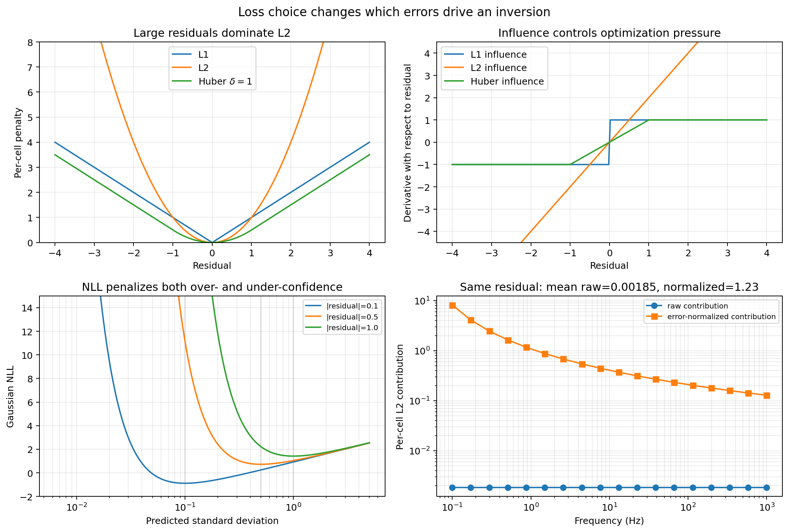
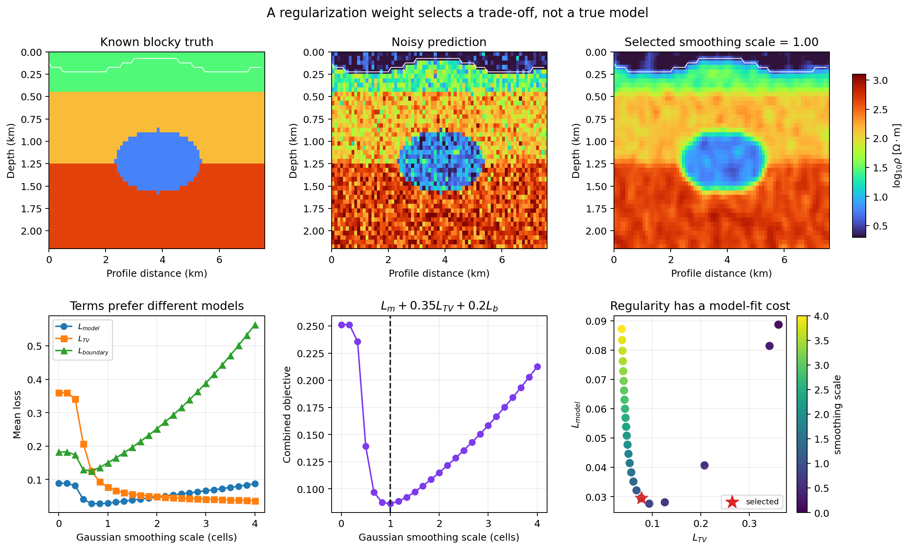

.. _ai_inversion_losses:

Loss functions for scientific inversion
=======================================

:doc:`concepts` introduces a supervised :term:`objective function` in two
pieces, a :term:`model-space metric` :eq:`eq-ai-model-loss` and a
:term:`response-space metric` :eq:`eq-ai-data-loss`, and a PINN-style
combination with generic vertical, lateral, and graph
:term:`regularization` terms :eq:`eq-ai-pinn-objective`.
:mod:`pycsamt.ai.losses` is where that idea becomes five focused submodules
with independently testable functions, reusable callable configurations, and
immutable result records rather than one opaque training step:

.. math::
   :label: eq-ai-losses-staged

   L = w_m L_{\mathrm{model}} + \lambda_x L_{\mathrm{grad}_x}
       + \lambda_z L_{\mathrm{grad}_z} + \lambda_{tv} L_{TV}
       + \lambda_d L_{\mathrm{response}},

with :math:`L_{\mathrm{model}}` from :mod:`~pycsamt.ai.losses.model`,
the gradient and total-variation terms from
:mod:`~pycsamt.ai.losses.spatial`, and :math:`L_{\mathrm{response}}`
from :mod:`~pycsamt.ai.losses.response`. Two further terms sit outside
:eq:`eq-ai-losses-staged` rather than being folded into it:
:mod:`~pycsamt.ai.losses.boundary` anchors cells the training data has
no sensitivity to, and :mod:`~pycsamt.ai.losses.uncertainty` scores a
network's declared confidence, which is not something a single scalar
data-fit term can express. Scalar loss functions return an immutable result
record containing ``value``, ``kind``, ``reduction``, ``n_valid``, and
``weight_sum``; :func:`~pycsamt.ai.losses.depth_weights` returns an array and
:class:`~pycsamt.ai.losses.SpatialLoss` returns its combined float directly.
The counts distinguish a small fitted loss from a term that had no usable
cells after masking. All five submodules operate on plain NumPy arrays; nothing
here imports PyTorch or TensorFlow.

The public API is organized by the scientific question each term asks:

.. list-table::
   :header-rows: 1
   :widths: 19 31 50

   * - Family
     - Public interface
     - Question answered
   * - Model
     - ``model_l1_loss``, ``model_l2_loss``, ``model_huber_loss``,
       ``depth_weights``, ``ModelLoss``
     - How far is the predicted earth parameter grid from known training
       truth, after masks and scientific weights?
   * - Spatial
     - ``gradient_smoothness_loss``, ``total_variation_loss``, ``SpatialLoss``
     - How much neighboring structure or pixel-scale variation does the model
       contain along declared grid axes?
   * - Boundary
     - ``boundary_condition_loss``, ``BoundaryLoss``
     - Does the model satisfy an explicit value on air, padding, or another
       constrained region?
   * - Response
     - ``response_residual_loss``, ``response_loss_from_contracts``,
       ``ResponseLoss``
     - Does a forward response reconstructed from the model agree with complex
       observations, optionally relative to their errors?
   * - Uncertainty
     - ``gaussian_nll_loss``, ``calibration_loss``, ``UncertaintyLoss``
     - Is a predicted mean accurate at the scale of its declared variance, and
       do interval claims match empirical held-out coverage?

The corresponding records are
:class:`~pycsamt.ai.losses.ModelLossResult`,
:class:`~pycsamt.ai.losses.SpatialLossResult`,
:class:`~pycsamt.ai.losses.ResponseLossResult`, and
:class:`~pycsamt.ai.losses.UncertaintyLossResult`. They are frozen dataclasses:
store or serialize their fields rather than mutating a result after review.
``ResponseLossResult.normalized`` additionally records whether an error array
was actually applied, while ``SpatialLossResult.label`` distinguishes an axis
gradient from total variation.

These values are not automatically commensurate. Model loss may be in squared
log-resistivity, response loss may be squared normalized impedance, spatial
loss is a grid-difference penalty, and boundary loss depends on its target
parameterization. Consequently, the coefficients in
:eq:`eq-ai-losses-staged` define both numerical scaling and scientific
preference. Report the input transformation, reduction, masks, valid counts,
and every coefficient; quoting only the final scalar cannot reproduce the
objective.

Weighting a residual by what it means
--------------------------------------

All masked scalar families use the same weighted reductions. If :math:`M`
contains cells that are finite, explicitly valid, and assigned positive weight,

.. math::
   :label: eq-ai-losses-reductions

   L_{\mathrm{mean}}=
   \frac{\sum_{i\in M}w_i\ell_i}{\sum_{i\in M}w_i},
   \qquad
   L_{\mathrm{sum}}=\sum_{i\in M}w_i\ell_i.

``reduction="mean"`` is usually comparable across batch sizes or changing
valid-cell counts, whereas ``"sum"`` makes a larger survey or denser mask
contribute more. If no positive weight remains, the mean is ``nan`` and the
sum is zero; in either case ``n_valid`` and ``weight_sum`` reveal the empty
term. A training system should reject that condition rather than replace
``nan`` with zero and claim a perfect fit. Notice that ``n_valid`` counts
finite mask-selected cells even when their supplied weight is zero, while
``weight_sum`` records their actual influence.

:func:`~pycsamt.ai.losses.model.model_l1_loss`,
:func:`~pycsamt.ai.losses.model.model_l2_loss`, and
:func:`~pycsamt.ai.losses.model.model_huber_loss` share one masked,
weighted reduction over a predicted and a true grid — L1 and L2 in the
usual sense, and Huber blending the two,

.. math::
   :label: eq-ai-losses-huber

   \ell_\delta(r) =
   \begin{cases}
     \tfrac12 r^2, & |r| \le \delta \\
     \delta\left(|r| - \tfrac12\delta\right), & |r| > \delta,
   \end{cases}

quadratic near zero and linear beyond the transition point
:math:`\delta`, so a handful of badly recovered cells cannot dominate
the gradient the way a pure L2 term would:

.. code-block:: pycon

   >>> import numpy as np
   >>> from pycsamt.ai.losses import model_l2_loss, model_huber_loss

   >>> model_l2_loss(np.array([1.0, 3.0]), np.array([1.0, 1.0])).value
   2.0
   >>> small = model_huber_loss(np.array([0.5]), np.array([0.0]), delta=1.0).value
   >>> large = model_huber_loss(np.array([5.0]), np.array([0.0]), delta=1.0).value
   >>> round(small, 3), round(large, 3)
   (0.125, 4.5)

A cell can be excluded three ways — a non-finite value in either
array, an explicit ``valid`` mask, or a zero ``weights`` entry — and
all three compose, since a masked-out cell should never silently
survive because a weight happened to be positive.
:func:`~pycsamt.ai.losses.model.depth_weights` builds one common
weight pattern directly: shallow cells outweigh deep ones,
proportional to :math:`1/(1+\text{depth index})` and normalized to sum
to one, matching the intuition that near-surface structure is both
easier to recover and more heavily sampled by the data than depth is:

.. code-block:: pycon

   >>> from pycsamt.ai.losses import ModelLoss, depth_weights
   >>> depth_weights(3)
   array([0.54545455, 0.27272727, 0.18181818])

   >>> loss = ModelLoss.with_depth_weights(n_depth=3, dimension=2, kind="l2")
   >>> loss.weights.shape
   (3, 1)
   >>> true = np.array([[1.0, 1.0, 1.0], [2.0, 2.2, 2.0], [3.0, 3.0, 3.5]])
   >>> pred = np.array([[1.1, 0.9, 1.0], [2.3, 2.0, 2.1], [2.5, 3.4, 3.6]])
   >>> loss(pred, true)
   ModelLossResult(value=0.04181818181818182, kind='l2', reduction='mean', n_valid=9, weight_sum=3.0)

The depth-weighted value is well below the unweighted
``model_l2_loss(pred, true).value`` of ``0.0644``, because most of
this section's error sits in the poorly recovered bottom row, which
:class:`~pycsamt.ai.losses.model.ModelLoss`'s depth weighting
deliberately discounts. :class:`~pycsamt.ai.losses.model.ModelLoss`
bundles a kind, reduction, and optional fixed weights into one
reusable callable, so a training loop configures it once outside the
loop rather than re-passing the same keyword arguments on every batch.

Loss names become easier to reason about when their penalties and influence
functions are seen together. For residual :math:`r`, this implementation uses
:math:`|r|` for L1 and :math:`r^2` for L2--there is no factor of one half in
L2--so their derivatives away from the L1 cusp are
:math:`\operatorname{sign}(r)` and :math:`2r`. Huber has derivative :math:`r`
inside :math:`[-\delta,\delta]` and clips to
:math:`\delta\operatorname{sign}(r)` outside. The exact executable for the
following four-panel comparison is exposed here.

.. code-dropdown:: ../../../scripts/generate_ai_inversion_figures.py
   :language: python
   :pyobject: make_losses_penalty_anatomy
   :linenos:
   :title: View penalty-anatomy source code

   Executed loss anatomy using the public NumPy functions for every scalar
   value shown.

The upper panels explain why L2 rapidly redirects an optimizer toward one
large residual, while L1 gives every nonzero residual equal-magnitude pressure.
Huber preserves a smooth quadratic basin near the solution but limits the
influence of an extreme cell. That robustness is useful for occasional target
outliers, but it can also under-emphasize a real, narrow conductor if the
training distribution systematically treats its large contrast as an outlier.
The lower-left panel shows the uncertainty analogue: for a fixed residual the
Gaussian NLL is minimized near :math:`\sigma=|r|`; driving variance to zero or
inflating it without limit is penalized. The response panel is interpreted in
detail below, where its error units are defined.

Penalizing structure, not just misfit
----------------------------------------

A network can minimize :math:`L_{\mathrm{model}}` and still produce a
section that is pixel-noisy between neighbouring cells that the data
cannot individually distinguish.
:func:`~pycsamt.ai.losses.spatial.gradient_smoothness_loss` penalizes
the first difference along one grid axis. For axis :math:`a`, it evaluates

.. math::
   :label: eq-ai-losses-gradient

   L_{\nabla_a}=\mathcal R\left(
      \ell\left[m_{\mathbf i+\mathbf e_a}-m_{\mathbf i}\right],
      \min(w_{\mathbf i+\mathbf e_a},w_{\mathbf i})
   \right),

where :math:`\mathcal R` is the selected reduction from
:eq:`eq-ai-losses-reductions`. A pair enters only when both endpoints are
finite and valid; its weight is the smaller endpoint weight. Thus a masked air
cell cannot form a gradient pair with earth, and a zero-weight endpoint removes
that edge. The function differences array values by cell index--it does **not**
divide by physical ``dx_m``, ``dy_m``, or ``dz_m``. On unequal cell spacing or
when comparing grids, supply scientifically derived weights or implement the
physical gradient explicitly.

For canonical arrays, axis 0 is depth, axis 1 is x in ``(z, x)``, and axes
``(0, 1, 2)`` are ``(z, y, x)`` in 3-D. Negative axes are accepted. The
call below evaluates lateral differences along axis 1:

.. code-block:: pycon

   >>> from pycsamt.ai.losses import gradient_smoothness_loss, total_variation_loss
   >>> grid = np.array([[0.0, 1.0, 3.0], [0.0, 0.0, 0.0]])
   >>> gradient_smoothness_loss(grid, axis=1, kind="l1")
   SpatialLossResult(value=0.75, kind='l1', label='grad_axis1', reduction='mean', n_valid=4, weight_sum=4.0)

and :func:`~pycsamt.ai.losses.spatial.total_variation_loss` sums that
same penalty over every axis at once — the standard *anisotropic*
total-variation definition (a per-axis sum of directional gradients),
not an isotropic pointwise gradient norm. With mean reduction it divides the
sum of all directional penalties by the combined directional weight sum; it
does not add separately normalized axis means. On the same predicted
section used above, the three terms of :eq:`eq-ai-losses-staged`'s
spatial part read differently depending on which direction the
structure actually varies in:

.. code-block:: pycon

   >>> gradient_smoothness_loss(pred, axis=0, kind="l2").value  # depth
   1.3516666666666666
   >>> gradient_smoothness_loss(pred, axis=1, kind="l2").value  # lateral
   0.16666666666666663
   >>> total_variation_loss(pred, kind="l1").value
   0.6916666666666668

The depth gradient is nearly ten times the lateral one here, because
``pred`` genuinely varies with depth by design — a reminder that
:math:`\lambda_z` should not, in general, be tuned to the same value as
:math:`\lambda_x` for a survey where vertical layering is expected and
lateral continuity is the assumption worth enforcing.
:class:`~pycsamt.ai.losses.spatial.SpatialLoss` combines all three into
:eq:`eq-ai-losses-staged`'s :math:`\lambda_x L_{\mathrm{grad}_x} +
\lambda_z L_{\mathrm{grad}_z} + \lambda_{tv} L_{TV}` for a canonical
2-D ``(z, x)`` grid, and returns the combined float directly rather
than a result dataclass, since it is a sum of differently-labelled
terms with no single ``kind`` left to report:

.. code-block:: pycon

   >>> from pycsamt.ai.losses import SpatialLoss
   >>> spatial = SpatialLoss(lambda_x=1.0, lambda_z=0.5, lambda_tv=0.1, kind="l2")
   >>> spatial(pred)
   0.9116666666666666

which is exactly ``1.0 * 0.1667 + 0.5 * 1.3517 + 0.1 * 0.6917`` from
the three terms computed above — :class:`SpatialLoss` is bookkeeping
over the same functions, not a separate implementation. Its ``kind`` controls
the x and z gradient terms, while its TV term always uses L1. It accepts only
a 2-D ``(z, x)`` grid; call the lower-level axis functions directly for 3-D.

The controlled experiment below makes the trade-off concrete. A known blocky
section is corrupted by cell noise and unconstrained values above a sinusoidal
terrain boundary. Twenty-five Gaussian smoothing scales are treated as
candidate predictions. Each candidate is scored with the public model, TV,
and boundary losses, then combined with fixed coefficients. This is a
diagnostic sweep, not a proposal to smooth network outputs after inference.

.. code-dropdown:: ../../../scripts/generate_ai_inversion_figures.py
   :language: python
   :pyobject: make_losses_regularization_tradeoff
   :linenos:
   :title: View regularization-trade-off source code

   Executed regularization sweep with one common log-resistivity scale.

The unsmoothed prediction has high TV and boundary loss but is not the worst
model-space fit because its sharp interfaces remain close to truth. Moderate
smoothing removes pixel noise and lowers all three terms initially. Beyond the
selected one-cell scale, TV continues to improve slowly while model loss rises:
the conductor and layer boundaries are being blurred. The red star is selected
only by :math:`L_m+0.35L_{TV}+0.20L_b`; changing either coefficient moves it
along the trade-off curve. A low combined objective therefore identifies the
preferred model under declared penalties, not the uniquely true earth.

Anchoring what the training data cannot see
------------------------------------------------

Not every cell in a predicted section is constrained by the response
data at all. Air cells above topography, and the outer padding of a
mesh built wide enough to keep boundary effects away from the survey
footprint, have no sensitivity in the forward problem — a network is
free to put anything there unless something tells it otherwise.
:func:`~pycsamt.ai.losses.boundary.boundary_condition_loss` is a
masked data-fit loss against an explicit required ``target`` value,
restricted to a caller-supplied ``boundary_mask``: there is no implicit
default target, since an agent should never silently hide a physical
assumption like "air is very resistive" inside a keyword default.
A common source for that mask is
:meth:`~pycsamt.ai.geology.topography.TopographicSurface.air_mask`:

.. code-block:: pycon

   >>> from pycsamt.ai.losses import BoundaryLoss
   >>> air_mask = np.array([[True, True, True], [False, False, False], [False, False, False]])
   >>> boundary = BoundaryLoss(kind="l1")
   >>> boundary(pred, boundary_mask=air_mask, target=1.0)
   ModelLossResult(value=0.0666666666666667, kind='l1', reduction='mean', n_valid=3, weight_sum=3.0)

``target=1.0`` here stands in for a fixed log-resistivity air value;
it is chosen only to keep the arithmetic visible and is not a recommended
physical air resistivity. The production target must use the same parameter
space as ``y_pred``--for example log10 resistivity if the model output is
logarithmic--and must match the forward solver's air convention. A scalar
target broadcasts everywhere before the boundary mask is applied; an array
target may encode a spatially varying required boundary. The small residual
reflects that the top row of ``pred`` was already close to one. Internally
:func:`~pycsamt.ai.losses.boundary.boundary_condition_loss` reuses the
exact same L1/L2/Huber machinery as
:mod:`~pycsamt.ai.losses.model` against a broadcast target array, so
everything said about robust penalties and masking above applies here
unchanged — a boundary constraint is a data-fit loss against a target
that happens to be known in advance rather than observed.

``BoundaryLoss(kind="huber", delta=...)`` is the reusable equivalent for
repeated batches. ``boundary_mask`` itself must select at least one cell. If a
separate ``valid`` mask subsequently removes every selected cell, the result
follows the empty-mean behavior in :eq:`eq-ai-losses-reductions`; inspect
``n_valid`` rather than assuming the initial boundary mask guaranteed an
active constraint.

Closing the loop back through the forward solver
------------------------------------------------------

:math:`L_{\mathrm{model}}` and the spatial terms only ever look at
resistivity cells; nothing yet checks whether the recovered section,
run back through a solver, actually reproduces the data.
:func:`~pycsamt.ai.losses.response.response_residual_loss` closes that
loop directly on complex impedance. With complex residual
:math:`\Delta Z_i=Z_i^{\mathrm{pred}}-Z_i^{\mathrm{obs}}`, the implemented
per-cell penalties are

.. math::
   :label: eq-ai-losses-complex-response

   \ell_i^{L1}=\left|\frac{\Delta Z_i}{s_i}\right|,
   \qquad
   \ell_i^{L2}=\left(\frac{\Re\Delta Z_i}{s_i}\right)^2+
                \left(\frac{\Im\Delta Z_i}{s_i}\right)^2,

where :math:`s_i=1` without ``errors`` and otherwise is the positive
absolute impedance standard error supplied for that complex cell. One scalar
therefore scales both real and imaginary residuals; the function does not
accept a full 2-by-2 covariance between them. L1 uses complex modulus, not
separate absolute real and imaginary penalties.

.. code-block:: pycon

   >>> from pycsamt.ai.losses import response_residual_loss
   >>> z_pred = np.array([1 + 1j, 2 + 2j])
   >>> z_obs = np.array([1 + 1j, 0 + 0j])
   >>> response_residual_loss(z_pred, z_obs, kind="l2").value
   4.0
   >>> response_residual_loss(z_pred, z_obs, errors=np.array([1.0, 2.0]), kind="l2").value
   1.0

dividing each residual by its declared standard error before the
penalty when one is supplied, matching the usual normalized-RMS EM
data-misfit convention — an observation sitting at its
:term:`error floor` contributes less to the loss than one whose small
declared uncertainty claims it should already be matched almost
exactly. With ``kind="l2"`` and mean reduction, ``result.value`` is the
*squared* normalized RMS; take ``sqrt(result.value)`` to report NRMS itself.
Non-finite or non-positive error entries are excluded together with non-finite
responses and ``valid=False`` cells. Always report ``n_valid`` so a lower loss
cannot be mistaken for improvement when difficult observations were removed.

For repeated raw-array evaluation, configure the callable once:

.. code-block:: pycon

   >>> from pycsamt.ai.losses import ResponseLoss
   >>> response_loss = ResponseLoss(kind="l2", reduction="mean")
   >>> result = response_loss(
   ...     z_pred, z_obs, errors=np.array([1.0, 2.0]),
   ...     valid=np.array([True, True]),
   ... )
   >>> result.normalized, result.n_valid, result.weight_sum
   (True, 2, 2.0)
   >>> np.sqrt(result.value)
   1.0
:func:`~pycsamt.ai.losses.response.response_loss_from_contracts` skips
the manual array bookkeeping and takes a
:class:`~pycsamt.forward.maxwell.contracts.ForwardResult` (see
:doc:`forward_physics`) and a
:class:`~pycsamt.ai.data.contracts.SurveyData` (see
:doc:`data_contracts`) directly, refusing to run if their stations,
components, or frequencies are not identically ordered — silently
interpolating or reordering either axis before a misfit calculation is
exactly the kind of survey-matching mistake this contract exists to
rule out:

.. code-block:: pycon

   >>> from pycsamt.ai.data import SurveyData
   >>> from pycsamt.forward.maxwell import ForwardResult, SolverDiagnostics
   >>> from pycsamt.ai.losses import response_loss_from_contracts

   >>> z = np.array([[[1 + 1j]]])
   >>> observed = SurveyData(z, [10.0], ["S1"], ["zxy"], [[0, 0]])
   >>> diagnostics = SolverDiagnostics([[True]], [[1]], [[0.0]], 0.01)
   >>> forward = ForwardResult(
   ...     "a" * 64, [10.0], ["S1"], ["zxy"], z, None, "demo", "1", diagnostics,
   ... )
   >>> response_loss_from_contracts(forward, observed).value
   0.0

The lower-right panel of ``losses_penalty_anatomy.png`` holds the complex
residual fixed at every frequency. Raw L2 contributions are therefore flat and
their mean is 0.00185 in the example's impedance units squared. Declared errors
increase from 0.015 to 0.12, so normalization makes low-frequency cells exert
far greater pressure and raises the mean normalized loss to 1.23. This is not
an intrinsic frequency weighting: it is entirely induced by the supplied
error array. If error floors or units are wrong, the optimizer will faithfully
emphasize the wrong observations.

``response_loss_from_contracts`` intersects ``forward.valid`` with
``observed.valid`` and uses ``observed.impedance_error`` when requested and
available. Solver convergence metadata beyond that validity mask is not itself
part of the scalar loss, so preserve the full
:class:`~pycsamt.forward.maxwell.contracts.SolverDiagnostics` beside the
result.

This is the same pairing the two-family split in :doc:`domain_gap`
exists for: a network trained only against clean synthetic responses
has no reason to expect the noise, static shift, and distortion an
:math:`L_{\mathrm{response}}` term will encounter once ``observed``
comes from a real survey rather than another
:func:`~pycsamt.ai.training.dataset2d.generate_2d_maxwell_dataset`
sample.

Making declared uncertainty answerable to evidence
----------------------------------------------------------

A model that predicts a resistivity value without a credible error bar
is only half a result. :func:`~pycsamt.ai.losses.uncertainty.gaussian_nll_loss`
trains a heteroscedastic :term:`aleatoric uncertainty` head alongside
the mean prediction, with each cell contributing

.. math::
   :label: eq-ai-losses-gaussian-nll

   \ell_i = \tfrac12\left(\frac{(\hat y_i - y_i)^2}{\sigma_i^2}
   + \log\sigma_i^2 + \log 2\pi\right),
   \qquad \sigma_i^2 = \exp(\log\sigma_i^2),

parameterized through a predicted log-variance rather than the
variance itself, so the network output stays unconstrained in sign
while :math:`\sigma_i^2` is guaranteed positive after the exponential:

.. code-block:: pycon

   >>> from pycsamt.ai.losses import gaussian_nll_loss, calibration_loss
   >>> pred_u = np.array([1.0, 2.2, 2.9, 4.5])
   >>> true_u = np.array([1.1, 2.0, 3.0, 4.0])
   >>> log_var = np.log(np.array([0.05, 0.1, 0.2, 0.3]))
   >>> gaussian_nll_loss(pred_u, true_u, log_var)
   UncertaintyLossResult(value=0.09038918945783034, kind='gaussian_nll', reduction='mean', n_valid=4, weight_sum=4.0)

Unlike L1, L2, and Huber, Gaussian NLL need not be non-negative: a sufficiently
accurate mean with variance below :math:`1/(2\pi)` can produce a negative log
density. That is not an invalid result. For one fixed nonzero residual, setting
the derivative with respect to variance to zero gives
:math:`\sigma^2=r^2`, which explains the minima in the lower-left figure.
Jointly training mean and log-variance can still hide systematic mean errors
behind inflated variance unless calibration and sharpness are checked on held-
out data. Very large finite log-variance can also overflow ``exp`` numerically;
the NumPy function does not clip it, so constrain or stabilize an autograd
implementation deliberately.

:class:`~pycsamt.ai.losses.UncertaintyLoss` stores the reduction for repeated
batches and forwards masks and weights unchanged:

.. code-block:: pycon

   >>> from pycsamt.ai.losses import UncertaintyLoss
   >>> nll = UncertaintyLoss(reduction="sum")
   >>> batch = nll(
   ...     pred_u, true_u, log_var,
   ...     valid=np.array([True, True, False, True]),
   ... )
   >>> batch.reduction, batch.n_valid, round(batch.value, 6)
   ('sum', 3, 0.222337)

A low, well-behaved log-variance still needs checking against reality:
declaring :math:`\sigma` honestly is not the same as being right about
it. :func:`~pycsamt.ai.losses.uncertainty.calibration_loss` scores that
separately, penalizing the gap between empirical coverage measured on a
held-out :term:`calibration set` and the nominal confidence level each
coverage value was supposed to hit:

.. code-block:: pycon

   >>> coverage = np.array([0.42, 0.68, 0.83, 0.94])
   >>> nominal = np.array([0.5, 0.7, 0.8, 0.9])
   >>> calibration_loss(coverage, nominal)
   UncertaintyLossResult(value=0.0023249999999999968, kind='calibration', reduction='mean', n_valid=4, weight_sum=4.0)

``calibration_loss(kind="l1")`` uses absolute coverage error and ``kind="l2"``
uses squared error. The returned result's ``kind`` is ``"calibration"`` in
both cases, so record the selected residual kind in the experiment
configuration; it cannot be reconstructed from the result record alone.

The two stay separate functions rather than one combined call
deliberately: the Gaussian NLL is a per-cell term evaluated and
backpropagated every training step, while calibration summarizes
predictive intervals across many held-out realizations and is checked
periodically, not differentiated through.

Assemble an auditable staged score
-----------------------------------

Keep component results before forming a total. This makes masks, counts, and
scales inspectable and prevents a weighted sum from erasing the reason it
changed:

.. code-block:: pycon

   >>> from pycsamt.ai.losses import ModelLoss, SpatialLoss, BoundaryLoss
   >>> model_term = ModelLoss(kind="l2")(pred, true)
   >>> spatial_term = SpatialLoss(
   ...     lambda_x=1.0, lambda_z=0.5, lambda_tv=0.1, kind="l2"
   ... )(pred)
   >>> boundary_term = BoundaryLoss(kind="l1")(
   ...     pred, boundary_mask=air_mask, target=1.0
   ... )
   >>> response_term = ResponseLoss(kind="l2")(
   ...     z_pred, z_obs, errors=np.array([1.0, 2.0])
   ... )
   >>> terms = {
   ...     "model": model_term.value,
   ...     "spatial": spatial_term,
   ...     "boundary": boundary_term.value,
   ...     "response": response_term.value,
   ... }
   >>> coefficients = {
   ...     "model": 1.0, "spatial": 0.05,
   ...     "boundary": 0.10, "response": 0.20,
   ... }
   >>> total = sum(coefficients[name] * value for name, value in terms.items())
   >>> {name: round(value, 4) for name, value in terms.items()}
   {'model': 0.0644, 'spatial': 0.9117, 'boundary': 0.0667, 'response': 1.0}
   >>> round(total, 4)
   0.3167

This number is reproducible only with the arrays and conventions established
earlier in the page. In production, fail the batch if any enabled component is
non-finite or has zero ``weight_sum``. Log each unweighted value, coefficient,
weighted contribution, valid count, and mask identifier. Tune coefficients on
validation evidence rather than choosing them merely to make printed terms
similar in magnitude; equal numerical scale does not imply equal scientific
importance.

Wiring the spatial terms into a trainable network
--------------------------------------------------------

Every function above operates on NumPy arrays, which is what keeps
:mod:`pycsamt.ai.losses` importable without an optional deep-learning
backend and lets every example on this page run without one — but a
NumPy array cannot participate in backpropagation.
:class:`~pycsamt.ai.inversion.EMInverter2D`'s ``fit`` method exposes
``lambda_x``, ``lambda_z``, and ``lambda_tv`` keywords that add the
lateral-gradient, depth-gradient, and total-variation terms to its
plain MSE data fit during PyTorch training, mirroring the math of
:eq:`eq-ai-losses-staged`'s spatial part but computed directly
on normalized ``torch`` tensors rather than by calling
:mod:`~pycsamt.ai.losses.spatial` itself, since a training step needs
gradients to flow through the penalty and not just past it. All three
weights default to zero, which reproduces plain MSE training
unchanged, and the staged terms are currently only implemented for the
PyTorch backend: passing a nonzero weight while TensorFlow is active
raises ``NotImplementedError`` rather than silently ignoring the
request. :mod:`~pycsamt.ai.losses.response`,
:mod:`~pycsamt.ai.losses.boundary`, and
:mod:`~pycsamt.ai.losses.uncertainty` are not yet wired into that same
training step; they remain available today for offline scoring —
exactly the checks :doc:`scientific_validation` runs after training,
independently of whichever loss shaped it.

There are two precise differences between that training adapter and the NumPy
diagnostics. The PyTorch TV adapter adds the *separate mean* absolute x and z
gradients, whereas :func:`total_variation_loss` pools all directional
differences before its mean reduction. It also operates after one global
target normalization and currently accepts no validity mask or per-cell
weights. Therefore the same numerical ``lambda_tv`` does not guarantee the
same scalar reported by an offline call on physical log-resistivity. Use the
NumPy package as the authoritative auditable diagnostic API and regard each
backend training adapter as a separately versioned implementation that must be
tested against its intended formula.

Choose and validate the objective deliberately
------------------------------------------------

No loss family is universally best. A defensible starting decision is:

.. list-table::
   :header-rows: 1
   :widths: 20 35 45

   * - Term
     - Useful when
     - Main failure to test
   * - Model L2
     - Synthetic targets are trustworthy and large errors should receive
       rapidly increasing pressure.
     - Rare contrasts or mislabeled cells dominate training.
   * - Model L1
     - Robustness to sparse large target errors matters.
     - Constant influence slows fine convergence and underweights meaningful
       high-contrast bodies.
   * - Model Huber
     - A smooth near-zero basin and bounded outlier influence are both useful.
     - ``delta`` is chosen in the wrong transformed units.
   * - Gradient/TV
     - Geological continuity or piecewise-constant structure is part of the
       declared prior.
     - Thin conductors, faults, and interfaces are erased; cell spacing is
       ignored.
   * - Boundary
     - Air, padding, or fixed regions have explicit values and masks.
     - A numerical target uses the wrong log/linear convention or constrains
       cells that should remain free.
   * - Response
     - Predictions can be forwarded through verified physics on aligned survey
       contracts.
     - Incorrect errors, validity masks, solver bias, or units redirect fit.
   * - Gaussian NLL
     - The network predicts both a conditional mean and heteroscedastic
       log-variance.
     - Variance inflation hides bias, or extreme log-variance overflows.
   * - Calibration
     - Held-out interval coverage is available across many independent cases.
     - Calibration data leak into fitting or fail to represent deployment.

For synthetic training, monitor model-space recovery and response-space fit
together. A model can be close cell by cell yet reproduce responses poorly if
the forward operator is sensitive to a small misplaced structure; another can
fit responses well while differing greatly from truth because EM inversion is
non-unique. For field deployment, model loss against truth is unavailable, so
response residuals, uncertainty calibration, geology, dimensionality tests,
and classical baselines carry the acceptance decision. Regularization makes a
solution preferable under a prior; it does not create information in the data.
