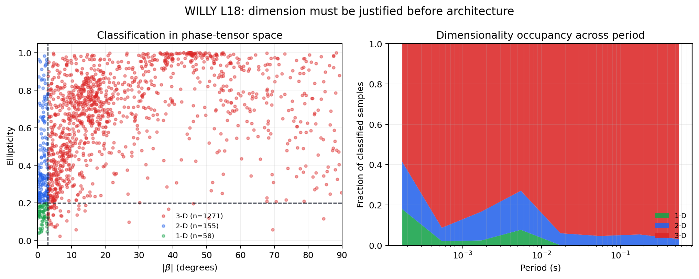
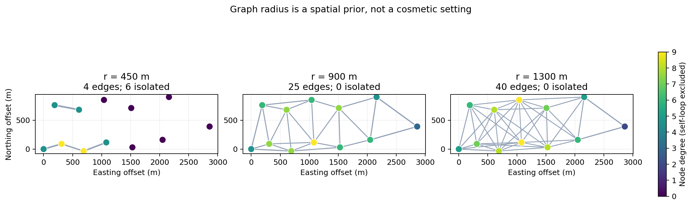
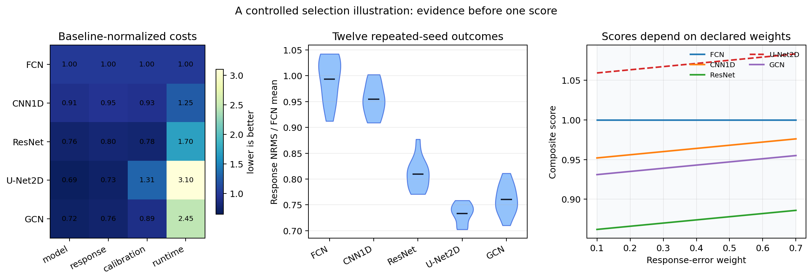

.. _ai_inversion_model_selection:

AI model selection
==================

Model selection chooses the scientific representation, learning strategy, and
architecture used for :term:`AI inversion`.  It is not simply a search for the
network with the lowest validation loss.  The selected model must match survey
physics, geometry, data volume, target parameterization, deployment
constraints, and the evidence required for field acceptance.

pyCSAMT supports supervised 1-D, profile 2-D, graph-context 3-D, joint,
ensemble, physics-informed, and hybrid workflows. Each answers a different
question and encodes different :term:`model prior` assumptions.  The selection
task is therefore a constrained decision:

.. math::
   :label: eq-ai-selection-rule

   c^\star
   =
   \operatorname*{arg\,min}_{c\in\mathcal{C}_{\mathrm{valid}}}
   S(c),

In equation :eq:`eq-ai-selection-rule`, :math:`c` is a candidate workflow and
architecture, :math:`S(c)` is the
predeclared selection score, and :math:`\mathcal{C}_{\mathrm{valid}}` contains
only candidates that satisfy the survey physics, data contract, validation,
deployment, and reproducibility constraints.  A model with the smallest
synthetic loss is not selectable if it cannot be restored, violates the
intended :term:`operating envelope`, or fails response diagnostics.

.. admonition:: Prefer the simplest defensible model
   :class: important

   Added architectural complexity is justified only when it improves a
   predeclared scientific or operational criterion on independent data. A more
   elaborate network can hide stronger assumptions, increase leakage risk, and
   make deployment less reproducible without adding recoverable information.

Selection workflow
------------------

#. define the decision, output, and acceptance metrics;
#. determine defensible physical :term:`dimensionality` from the survey;
#. freeze the :term:`feature contract` and target contract;
#. establish non-AI and simple AI :term:`baseline model` comparisons;
#. identify candidate model families rather than arbitrary hyperparameters;
#. define leakage-resistant training, validation, calibration, and test roles;
#. train candidates under comparable budgets;
#. compare :term:`model-space metric`, :term:`response-space metric`,
   calibration, and field metrics;
#. test robustness, :term:`domain gap`, compute, and persistence;
#. select once using the declared rule and confirm on an untouched test set;
#. document rejected candidates and the reason for the final choice.

1. Define the selection objective
---------------------------------

Different objectives can select different models. Examples include:

* minimize median log-resistivity error on unseen synthetic geology;
* recover conductor-top depth within an operational tolerance;
* minimize error-weighted field response residuals;
* maintain calibrated 90% intervals with useful sharpness;
* rank drilling targets consistently across accepted scenarios;
* run within memory and latency limits on the deployment machine;
* remain stable under missing frequency bands or station dropout.

Declare a primary metric, secondary constraints, and unacceptable failure
modes before comparing candidates.  Do not select using whichever metric looks
best after training.  A compact decision score can be useful when it is
declared before results are inspected:

.. math::
   :label: eq-ai-selection-score

   S(c)
   =
   \operatorname{RMSE}_{\log\rho}(c)
   + \alpha\,\operatorname{NRMS}_{\mathrm{resp}}(c)
   + \beta\,\operatorname{Cost}(c)
   + \gamma\,\operatorname{Risk}(c).

In equation :eq:`eq-ai-selection-score`, the weights :math:`\alpha`,
:math:`\beta`, and :math:`\gamma` do not make the decision objective; the
scientific decision makes the weights. For example,
a screening tool may tolerate larger model-space error if it is fast and
well-calibrated, while a drill-target interpretation may give much more weight
to conductor-top depth, response reconstruction, and failure visibility.

2. Decide dimension before architecture
---------------------------------------

Dimension is a geophysical assumption, not a neural-network preference.  A
candidate's output shape should follow the survey evidence.  A useful mental
model is

.. math::
   :label: eq-ai-dimension-model

   \rho(\mathbf{x}) =
   \begin{cases}
      \rho(z), & \text{1-D layered earth},\\
      \rho(x,z), & \text{2-D profile with invariant strike direction},\\
      \rho(x,y,z), & \text{3-D volume or graph-context setting}.
   \end{cases}

The alternatives in equation :eq:`eq-ai-dimension-model` control what the
model can represent and what it is
allowed to ignore.  A 1-D model is transparent but cannot represent lateral
boundaries.  A 2-D profile can represent lateral structure but assumes the line
and strike convention are meaningful.  A graph-context 3-D model can borrow
information from nearby stations, but its graph is a spatial prior and may not
mean the training examples used full 3-D electromagnetic physics.

Choose 1-D when
~~~~~~~~~~~~~~~

* local geology is approximately layered;
* station-by-station screening is the goal;
* survey spacing is too sparse for stable lateral learning;
* no reviewed profile or areal geometry is available;
* a transparent baseline is needed.

Use :class:`pycsamt.ai.inversion.EMInverter1D`, a 1-D PINN, or a 1-D hybrid.
Document why the 1-D assumption is adequate.  If the goal is only screening,
state that; if the result will guide interpretation, pair it with response
residuals and dimensionality diagnostics.

Choose profile 2-D when
~~~~~~~~~~~~~~~~~~~~~~~

* stations form a meaningful ordered line;
* tensor, strike, and dimensionality evidence support a 2-D approximation;
* lateral continuity is central to the decision;
* training examples represent profile geometry and missingness;
* a fixed station and depth representation is acceptable.

Use :class:`pycsamt.ai.inversion.EMInverter2D`,
:class:`pycsamt.ai.inversion.PINNInverter2D`, or
:class:`pycsamt.ai.inversion.HybridInverter2D`.

Profile 2-D selection should be tied to the line geometry.  Record the station
ordering, spacing, strike convention, and how off-line stations are handled.
If profiles have variable station counts, choose one validated policy before
training: crop, pad, resample, train separate models, or use a graph workflow.

Choose graph-context 3-D when
~~~~~~~~~~~~~~~~~~~~~~~~~~~~~

* stations form several lines or an areal layout;
* projected coordinates and station order are reliable;
* neighborhood relationships carry useful information;
* training surveys represent graph layout and correlation scales;
* node-wise layered outputs are suitable.

Use :class:`pycsamt.ai.inversion.GCNInverter3D`,
:class:`pycsamt.ai.inversion.PINNInverter3D`, or
:class:`pycsamt.ai.inversion.HybridInverter3D`.

The GCN shares information among station nodes. It does not automatically mean
that supervised examples were generated with a full numerical 3-D EM solver.
Do not select it merely to label the product "3-D." ``Inv3DAgent(physics="mt1d")``
(the default) trains on tiled 1-D columns; ``Inv3DAgent(physics="mt3d")``
(:doc:`dataset3d`) trains on :term:`Genuine 3-D Maxwell training` volumes
instead, at substantially higher cost per profile and still only as a
research-stage slice, not a gated production path -- see :doc:`roadmap`'s M8
entry before treating either mode's output as more validated than it is.

When dimension is uncertain, compare conservative alternatives.  A common
selection record includes a 1-D baseline, a 2-D or graph candidate, and a note
explaining whether the higher-dimensional candidate improved a declared
criterion enough to justify its stronger assumptions.  If the improvement is
only cosmetic in section images and not visible in response fit, field
evidence, or decision stability, keep the simpler model.

What WILLY L18 permits
~~~~~~~~~~~~~~~~~~~~~~

The dimension decision can be exercised on the bundled line before choosing a
network. :func:`pycsamt.emtools.dimensionality.classify_dimensionality` uses
phase-tensor skew and ellipticity to classify each usable station-frequency
sample. The labels are a diagnostic under explicit thresholds, not geological
truth, but they reveal whether a layered or strike-invariant assumption is
consistent with the measured tensor.

Writing the complex impedance as :math:`\mathbf Z=\mathbf X+i\mathbf Y`, the
phase tensor and the two plotted invariants are

.. math::
   :label: eq-ai-phase-tensor-dimension

   \boldsymbol\Phi=\mathbf X^{-1}\mathbf Y,
   \qquad
   \beta=\frac{1}{2}\operatorname{atan2}
      (\Phi_{12}-\Phi_{21},\Phi_{11}+\Phi_{22}),
   \qquad
   e=\frac{s_1-s_2}{s_1+s_2},

where :math:`s_1\ge s_2` are singular values of
:math:`\boldsymbol\Phi`. The implementation expresses :math:`\beta` in
degrees and applies the rule

.. math::
   :label: eq-ai-dimension-classifier

   D(\beta,e)=
   \begin{cases}
      \text{1-D}, & |\beta|\le 3^\circ\ \text{and}\ |e|\le0.2,\\
      \text{2-D}, & |\beta|\le 3^\circ\ \text{and}\ |e|>0.2,\\
      \text{3-D}, & |\beta|>3^\circ.
   \end{cases}

Equations :eq:`eq-ai-phase-tensor-dimension` and
:eq:`eq-ai-dimension-classifier` make the assumptions behind the labels
auditable. Changing the thresholds changes the counts and must be justified
rather than tuned until a preferred dimension appears.

.. code-block:: pycon

   >>> from pycsamt.emtools._core import ensure_sites
   >>> from pycsamt.emtools.dimensionality import classify_dimensionality

   >>> sites = ensure_sites(
   ...     "data/AMT/WILLY_data/L18PLT", recursive=True, verbose=0
   ... )
   >>> dimensionality = classify_dimensionality(sites)
   >>> counts = dimensionality["dim"].value_counts().sort_index()
   >>> print("station-frequency samples:", len(dimensionality))
   station-frequency samples: 1484
   >>> print({"1-D": int(counts.get(0, 0)),
   ...        "2-D": int(counts.get(1, 0)),
   ...        "3-D": int(counts.get(2, 0))})
   {'1-D': 58, '2-D': 155, '3-D': 1271}
   >>> print("3-D fraction:", round(float((dimensionality["dim"] == 2).mean()), 3))
   3-D fraction: 0.856

   Most samples lie beyond the default 3-degree skew boundary and classify as
   3-D. The period-binned panel shows that this is not confined to one narrow
   band. These labels should be reviewed with strike stability, errors,
   distortion, source assumptions, and neighboring lines before a physical
   dimension is accepted.

The plotting code is intentionally part of the example so the thresholds,
period binning, and class counts can be inspected and adapted:

.. code-dropdown:: ../../../scripts/generate_ai_inversion_figures.py
   :language: python
   :pyobject: make_model_selection_willy_dimension
   :linenos:
   :title: View WILLY dimensionality source code

This result does not automatically select
:class:`~pycsamt.ai.inversion.GCNInverter3D`: that class shares node context
but may be trained from 1-D forward responses. Nor does it make the L18 line
useless. A station-wise 1-D model remains valuable as a deliberately limited
screening baseline. A profile 2-D result may be tested as an approximation,
but it should not be presented as the unique or fully supported physical
interpretation when 85.6% of the diagnostic samples reject the assumed 1-D/2-D
regime. For an interpretation decision, retain a true 3-D physics baseline or
state that the current AI candidate is exploratory.

3. Compare model families
-------------------------

Compare families before fine-tuning hyperparameters.  This keeps the question
scientific: "Which representation is justified?" comes before "Which dropout
value won?"  For each family, identify the information it can use, the prior it
adds, and the failure it may hide.

.. list-table::
   :header-rows: 1
   :widths: 19 22 28 31

   * - Family
     - Data requirement
     - Strength
     - Principal limitation
   * - Supervised 1-D
     - Synthetic labelled soundings.
     - Fast, simple, portable checkpoint support, strong baseline.
     - Ignores lateral structure and depends on synthetic coverage.
   * - Supervised U-Net 2-D
     - Labelled profile panels and fixed section targets.
     - Learns multiscale lateral patterns over a complete line.
     - Continuity is architectural and does not by itself establish 2-D
       electromagnetic validity.
   * - Supervised GCN
     - Labelled multi-station surveys and fixed graph convention.
     - Uses irregular spatial relationships and supports dropout spread.
     - Sensitive to graph construction; pseudo-3-D training may use 1-D
       forward responses.
   * - Joint supervised
     - Aligned, correlated modalities with common model targets.
     - Can combine complementary sensitivity.
     - Alignment, modality imbalance, and cross-property assumptions increase
       complexity and leakage risk.
   * - Ensemble
     - Several fitted compatible estimators plus calibration data.
     - Measures member disagreement and supports calibrated intervals.
     - Multiplies training/storage cost and misses shared structural bias.
   * - PINN
     - Observations and differentiable physics; no labelled model targets.
     - Direct response-based optimization and explicit regularization.
     - Slower per survey; sensitive to optimizer, physics, and loss weights.
   * - Hybrid
     - AI initial estimate plus physics-refinement workflow.
     - Combines fast initialization with response-space refinement.
     - Two-stage provenance and failure behavior are more complex.

The table should not be read as a ranking.  A supervised 1-D inverter can be
the best production choice when the operating envelope is narrow and
well-tested.  A PINN or hybrid can be stronger when observation-specific
response fit is required.  An ensemble is justified when uncertainty quality is
part of the decision.  A joint model is justified only when the extra modality
changes the decision in a repeatable way.

4. Choose the 1-D architecture
------------------------------

:class:`pycsamt.ai.inversion.EMInverter1D` supports ``"fcn"``, ``"cnn1d"``,
and ``"resnet"``:

.. code-block:: pycon

   >>> from pycsamt.ai.inversion import EMInverter1D
   >>>
   >>> candidate = EMInverter1D(
   ...     arch="resnet",
   ...     n_layers=5,
   ...     solver="mt1d",
   ...     include_phase=True,
   ...     log_thickness=True,
   ... )
   >>> print(candidate.__class__.__name__, candidate.arch, candidate.n_layers, candidate.solver)
   EMInverter1D resnet 5 mt1d

FCN
~~~

A fully connected network treats the complete feature vector globally.

Prefer it when:

* the feature vector is short and fixed;
* a simple capacity baseline is needed;
* channel adjacency should not be assumed meaningful;
* training data are limited relative to larger models.

Its weakness is that it does not explicitly exploit ordered frequency-local
patterns.

CNN1D
~~~~~

A one-dimensional convolution shares filters along the arranged input axis.

Prefer it when:

* features have a meaningful local ordering;
* the same transformation should detect patterns across frequency;
* robustness to local shifts or patterns is useful.

Check the actual block layout. Concatenated resistivity and phase blocks create
a boundary that is not a physical frequency adjacency. Architecture benefit
depends on how the network implementation consumes that vector.

ResNet
~~~~~~

Residual connections support deeper mappings and stable gradient flow.

Prefer it as a strong default candidate when:

* enough synthetic examples cover the parameter space;
* FCN underfits important nonlinear structure;
* compute and checkpoint complexity remain acceptable.

Do not assume ResNet must win because it is deeper. Compare it against FCN and
CNN1D under the same data, split, optimization budget, and selection metric.

5. Choose layer count and target complexity
-------------------------------------------

For a layered model, output size is commonly ``2 * n_layers - 1``. Increasing
``n_layers`` adds resistivity and interface parameters, expanding ambiguity.
For :math:`L` layers, the target vector is commonly

.. math::
   :label: eq-ai-layer-target

   \mathbf{y}
   =
   \left[
      \log_{10}\rho_1,\ldots,\log_{10}\rho_L,
      \tau_1,\ldots,\tau_{L-1}
   \right],
   \qquad
   \dim(\mathbf{y})=2L-1,

In equation :eq:`eq-ai-layer-target`, :math:`\tau_\ell` is either thickness
:math:`h_\ell` or
:math:`\log_{10}h_\ell`, depending on the target transform.  Interface depths
are derived quantities,

.. math::
   :label: eq-ai-interface-depth

   z_k = \sum_{\ell=1}^{k} h_\ell,

Equation :eq:`eq-ai-interface-depth` shows why thickness errors accumulate
with depth. This is why layer-count selection
should include interface-depth diagnostics, not only per-entry target loss.

Select layer count using:

* available frequency/time bandwidth;
* expected number of resolvable electrical units;
* target depth and station spacing;
* sensitivity and classical inversion evidence;
* synthetic recovery by depth;
* stability across noise and starting distributions;
* the decision's required detail.

Compare candidate layer counts by response reconstruction and boundary
stability, not only target-vector MSE. A five-layer prediction can fit a
three-unit earth by splitting units artificially; a three-layer model can smear
a thin critical conductor.

Use a fixed layer count for straightforward supervised outputs. Variable-layer
targets from ``generate_dataset`` are NaN-padded and require a proven mask-aware
strategy; they do not automatically make the network variable-output.

When several layer counts are plausible, prefer the smallest count that passes
the decision criterion.  If a deeper parameterization improves aggregate loss
but moves conductor tops or water-table proxies unpredictably, it is adding
degrees of freedom without improving the interpretation.  Keep rejected
layer-count results in the selection record because they explain why the final
parameterization is not arbitrary.

6. Select solver and feature content
------------------------------------

For 1-D configuration, supported solver names are ``"mt1d"``, ``"csamt1d"``,
and ``"tem1d"``. The solver must agree with synthetic generation and field
representation.

Phase
~~~~~

Set ``include_phase=True`` when phase is available, quality-controlled, and
represented consistently in synthetic data. Phase adds information but also
exposes phase convention, wrapping, and noise differences.

Do not include a phase channel filled with constants merely to satisfy a model
trained with phase. Either use a validated missing-channel strategy or select
a model trained without phase.

Components
~~~~~~~~~~

Select ``xy``, ``yx``, TE/TM, or multiple tensor channels based on survey
orientation and dimensionality. More channels can improve identifiability only
when their physics, units, errors, and ordering are modeled consistently.

Frequency grid
~~~~~~~~~~~~~~

Grid extent controls sensitivity and deployment compatibility. A larger
``n_freqs`` increases input resolution and compute but cannot create
information absent from the field observations. Prefer a common range with
adequate coverage across required stations.

The frequency grid is a reproducibility object.  Store the exact frequencies or
periods, interpolation convention, fill policy, and mask.  A model trained on
log-spaced synthetic frequencies and deployed on linearly interpolated field
features is no longer seeing the same input distribution, even if the vector
length matches.

7. Select the 2-D U-Net configuration
-------------------------------------

:class:`pycsamt.ai.inversion.EMInverter2D` maps
``(n_components, n_freqs, n_stations)`` panels to
``(n_depth, n_stations)`` sections.  The shape is part of the model contract:

.. math::
   :label: eq-ai-2d-shape

   \mathbf{X}\in\mathbb{R}^{C\times F\times S}
   \longmapsto
   \hat{\mathbf{U}}\in\mathbb{R}^{D\times S},

In equation :eq:`eq-ai-2d-shape`, :math:`C` is component count, :math:`F` is
frequency count, :math:`S` is
station count, and :math:`D` is depth-cell count.

.. code-block:: pycon

   >>> from pycsamt.ai.inversion import EMInverter2D
   >>>
   >>> candidate_2d = EMInverter2D(
   ...     n_components=4,
   ...     n_freqs=32,
   ...     n_stations=48,
   ...     n_depth=64,
   ...     arch="unet",
   ...     dropout=0.20,
   ... )
   >>> print(
   ...     candidate_2d.__class__.__name__,
   ...     candidate_2d.n_components,
   ...     candidate_2d.n_freqs,
   ...     candidate_2d.n_stations,
   ...     candidate_2d.n_depth,
   ... )
   EMInverter2D 4 32 48 64

Selection variables include:

``n_components``
   Two channels can represent TE log resistivity and phase; four add TM log
   resistivity and phase in the public field bridge.

``n_freqs``
   Controls vertical input sampling and U-Net input height.

``n_stations``
   Fixes profile width. Field profiles with different station counts need a
   validated resampling, crop, pad, or separate model.

``n_depth``
   Fixes output depth sampling. More cells improve display resolution, not
   necessarily geophysical resolution.

``dropout``
   Regularizes training. Excessive dropout can underfit; insufficient dropout
   can overfit synthetic profile patterns.

``channels`` or U-Net depth
   Control capacity and receptive field. The implementation constrains pooling
   depth according to the smaller input dimension.

Select using complete-profile holdouts and boundary/response metrics. Never
split stations from one synthetic profile across training and validation.

For U-Net-style models, station padding and cropping can become hidden priors.
Padding with zeros, NaNs, edge values, or learned masks are different choices.
If the profile width is fixed at :math:`S=48`, a 35-station field line should
not be silently stretched to 48 stations without a documented test showing that
the transformation preserves target geometry and response diagnostics.

8. Select graph architecture and adjacency
------------------------------------------

:class:`pycsamt.ai.inversion.GCNInverter3D` requires per-station features,
layer count, hidden widths, dropout, and graph context:

.. code-block:: pycon

   >>> from pycsamt.ai.inversion import GCNInverter3D
   >>>
   >>> candidate_3d = GCNInverter3D(
   ...     n_features=64,
   ...     n_layers=5,
   ...     hidden=(256, 128, 64),
   ...     dropout=0.10,
   ... )
   >>> print(candidate_3d.__class__.__name__, candidate_3d.n_features, candidate_3d.n_layers, candidate_3d.hidden)
   GCNInverter3D 64 5 (256, 128, 64)

Adjacency is as important as network width. If neither adjacency nor
coordinates is passed, the implementation warns and uses identity adjacency,
removing inter-station coupling.

Compare radius or graph policies using:

* node degree and connected components;
* survey spacing distribution;
* known structural boundaries;
* recovery across correlation-length scenarios;
* station dropout robustness;
* performance on irregular layouts;
* uncertainty near isolated nodes and survey edges.

A radius that is too small reduces the GCN toward station-wise prediction. A
radius that is too large shares information across unrelated structures.
Select radius as a spatial prior in coordinate units, not as a generic neural
hyperparameter.

For a radius graph, the adjacency can be written

.. math::
   :label: eq-ai-radius-adjacency

   A_{ij}
   =
   \mathbf{1}\{\|\mathbf{s}_i-\mathbf{s}_j\|_2 \le r\},

In equation :eq:`eq-ai-radius-adjacency`, :math:`\mathbf{s}_i` is station
coordinate and :math:`r` is the selected
radius.  That one number controls node degree, connected components, and how
much information crosses geological boundaries.  Report the degree
distribution for every candidate radius.  If the graph has many isolated
nodes, the architecture is not using the intended spatial context.

The binary matrix in equation :eq:`eq-ai-radius-adjacency` is only the first
stage. With the defaults of :func:`pycsamt.ai.nets.build_adjacency`, self loops
are retained and the matrix supplied to message passing is

.. math::
   :label: eq-ai-normalized-adjacency

   \widehat{\mathbf A}
   =
   \widetilde{\mathbf D}^{-1/2}
   \widetilde{\mathbf A}
   \widetilde{\mathbf D}^{-1/2},
   \qquad
   \widetilde{\mathbf A}=\mathbf A+\mathbf I,
   \qquad
   \widetilde D_{ii}=\sum_j\widetilde A_{ij}.

This normalization prevents a high-degree station from contributing simply
because it has more neighbours. It does not remove the spatial prior: the
radius still decides which stations may exchange information. The following
reproducible diagnostic uses the public builder twice—once without loops or
normalization to count physical neighbour edges, and once with defaults to
scale the plotted edge weights.

.. code-dropdown:: ../../../scripts/generate_ai_inversion_figures.py
   :language: python
   :pyobject: make_model_selection_graph_radius
   :linenos:
   :title: View graph-radius diagnostic source code

   At 450 m, disconnected nodes cannot receive spatial context; at 900 m the
   survey is connected mainly through local neighbours; at 1300 m many
   long-range edges blur the meaning of locality. The middle value is not
   automatically correct—the appropriate radius must also survive held-out
   geology, coordinate perturbation, and response-space tests—but this view
   exposes topology that a validation-loss table would conceal.

9. Decide whether joint inversion is justified
----------------------------------------------

:class:`pycsamt.ai.inversion.JointInverter` fuses two or more feature matrices
into one layered target:

.. code-block:: pycon

   >>> from pycsamt.ai.inversion import JointInverter
   >>>
   >>> joint = JointInverter(
   ...     n_features_list=(64, 25),
   ...     n_layers=5,
   ...     growth_rate=32,
   ...     n_dense_layers=6,
   ...     hidden_dim=256,
   ...     dropout=0.20,
   ...     log_thickness=True,
   ... )
   >>> print(joint.__class__.__name__, joint.n_features_list, joint.n_layers)
   JointInverter (64, 25) 5

Joint inversion is justified when modalities:

* observe compatible locations and support volumes;
* share a defensible common target or cross-property relationship;
* are aligned without label leakage;
* provide complementary rather than redundant information;
* have realistic joint synthetic examples;
* remain available under the deployment policy.

Compare against each modality alone. A fused network that improves aggregate
loss may rely almost entirely on one modality or learn spurious correlations.
Test missing-modality behavior explicitly.

Use an :term:`ablation study` for joint models.  Train or evaluate variants
with one modality removed, shuffled, corrupted, or replaced by a baseline.  If
the joint model still performs well after a supposedly important modality is
shuffled, the model is not using that modality in a scientifically meaningful
way.

10. Decide between supervised, PINN, and hybrid
-----------------------------------------------

Choose supervised when
~~~~~~~~~~~~~~~~~~~~~~

* a representative synthetic generator exists;
* repeated low-latency inference is important;
* target labels and parameterization are trustworthy;
* domain coverage can be tested.

Choose PINN when
~~~~~~~~~~~~~~~~

* labelled model generation is a bottleneck;
* differentiable physics matches the observations;
* per-survey optimization cost is acceptable;
* data-fit and regularization need direct control;
* convergence can be reviewed for every run.

Choose hybrid when
~~~~~~~~~~~~~~~~~~

* an AI prior provides a useful initialization;
* field response refinement is required;
* supervised domain shift is a concern;
* the extra two-stage complexity is justified by independent improvement.

Compare final response fit, structural stability, runtime, and failure rate.
Do not compare supervised inference latency alone with a PINN's complete
optimization and conclude that the latter is inferior without considering the
different task.

11. Decide whether an ensemble is required
------------------------------------------

:class:`pycsamt.ai.inversion.EnsembleInverter` trains or combines compatible
base estimators.

Use an ensemble when:

* uncertainty or stability is part of the decision;
* member diversity can be created through seeds, data, or architectures;
* calibration and test sets are large enough;
* multiplied training and storage cost are acceptable.

Member disagreement measures only differences among members. If every member
uses the same incorrect simulator or narrow prior, the ensemble can agree and
still be wrong. Compare raw spread, calibrated coverage, interval sharpness,
and field domain diagnostics.

12. Establish baselines
-----------------------

Every selection study should include:

Simple statistical baseline
   Mean target, nearest synthetic neighbor, or simple regression where
   appropriate. This reveals whether the network learns more than dataset bias.

Simple neural baseline
   Usually FCN or compact 1-D network.

Dimensional baseline
   Independent 1-D predictions before U-Net or graph context.

Physics baseline
   Forward reconstruction and a classical inversion appropriate to the survey,
   such as built-in 1-D, Occam2D, ModEM, or MARE2DEM.

Operational baseline
   Current project method, including runtime and reviewer effort.

A candidate should improve a declared criterion without unacceptable losses in
calibration, robustness, interpretability, or deployability.

13. Define a fair comparison protocol
-------------------------------------

Hold constant across candidates:

* dataset version and split indices;
* feature and target transformations;
* training and validation roles;
* number of repeated seeds;
* early-stopping policy;
* optimization budget where comparable;
* metric implementation;
* test and field evaluation sets;
* hardware or normalized resource accounting.

Architecture-specific tuning is legitimate, but the tuning budget should be
comparable and documented. Report the distribution across repeated runs rather
than only the best seed.

Use nested selection when possible:

* inner validation chooses architecture and hyperparameters;
* calibration fits uncertainty after model choice;
* untouched synthetic test estimates final in-domain performance;
* withheld field evidence assesses transfer.

Do not choose architecture, layer count, and reporting threshold on the same
test observations.

14. Compare multiple metric families
------------------------------------

Model-space
   Log-resistivity error, thickness error, boundary-depth error, section error,
   and performance by depth or geology.

Response-space
   Error-weighted impedance, apparent-resistivity, phase, or decay residuals
   after forward reconstruction.

Structural
   Conductor detection, boundary overlap, continuity, false targets, and edge
   behavior.

Uncertainty
   Coverage, interval width, reliability, ensemble spread, and failure under
   domain shift.

Robustness
   Noise, missing bands, station dropout, static shift, coordinate perturbation,
   and out-of-prior geology.

Operational
   Training time, inference time, peak memory, artifact size, persistence,
   backend availability, and reproducibility.

Field
   Classical response fit, borehole or geological agreement, and stability of
   the actual decision.

Aggregate averages can hide failure in deep layers, rare conductive targets,
or sparse stations. Report distributions and scenario-stratified results.

When a scalar ranking is required, normalize each metric against an agreed
reference before combining it.  One defensible pattern is

.. math::
   :label: eq-ai-normalized-selection-score

   S_c
   =
   w_m\frac{M_c}{M_b}
   +
   w_r\frac{R_c}{R_b}
   +
   w_u\frac{U_c}{U_b}
   +
   w_t\frac{T_c}{T_b}
   +
   P_c,

In equation :eq:`eq-ai-normalized-selection-score`, :math:`M_c` is a
model-space error, :math:`R_c` is a response-space
error, :math:`U_c` is an uncertainty penalty, :math:`T_c` is runtime or
resource cost, subscript :math:`b` denotes the baseline, and :math:`P_c` is a
hard penalty for failing mandatory gates.  Lower is better only if all
quantities are defined that way.

.. code-block:: pycon

   >>> candidates = {
   ...     "fcn": {"model": 0.32, "response": 1.18, "uncertainty": 0.20, "runtime": 1.0, "gate": 0.0},
   ...     "resnet": {"model": 0.24, "response": 0.94, "uncertainty": 0.16, "runtime": 1.6, "gate": 0.0},
   ...     "unet2d": {"model": 0.22, "response": 0.91, "uncertainty": 0.28, "runtime": 3.4, "gate": 0.5},
   ... }
   >>> baseline = candidates["fcn"]
   >>> weights = {"model": 0.35, "response": 0.35, "uncertainty": 0.20, "runtime": 0.10}
   >>> scores = {}
   >>> for name, row in candidates.items():
   ...     score = row["gate"]
   ...     for metric, weight in weights.items():
   ...         score += weight * row[metric] / baseline[metric]
   ...     scores[name] = round(score, 3)
   >>> scores
   {'fcn': 1.0, 'resnet': 0.861, 'unet2d': 1.631}
   >>> min(scores, key=scores.get)
   'resnet'

The score does not replace scientific review.  In this toy example, the 2-D
candidate has strong model and response errors but receives a gate penalty,
which might represent unresolved profile-width handling, failed dimensionality
evidence, or unacceptable field residuals. Without that penalty, the ranking would
silently ignore a deployment or validation failure.

More importantly, a single score hides run-to-run dispersion and weight
sensitivity. The controlled illustration below uses explicit synthetic
candidate metrics—it is a decision-analysis example, not a pyCSAMT benchmark.
All costs are normalized to the FCN baseline, twelve seeded perturbations show
why a mean is insufficient, and the dashed U-Net curve denotes a candidate
that failed a mandatory gate.

.. code-dropdown:: ../../../scripts/generate_ai_inversion_figures.py
   :language: python
   :pyobject: make_model_selection_tradeoff
   :linenos:
   :title: View selection-trade-off source code

   ResNet and GCN improve the model and response columns in this constructed
   study, but cost more to run; U-Net has low errors but fails its external
   gate and is therefore ineligible. The seed distributions overlap, so a
   small difference between means should not be treated as decisive. The
   right panel makes the governance issue visible: changing the declared
   response weight changes relative scores. Weights and gates must therefore
   be fixed before inspecting final test results, with the non-dominated
   alternatives retained when no stable winner exists.

15. Consider persistence and deployment
---------------------------------------

The main supervised classes share public persistence support, but artifact
contents and surrounding state still differ:

* :class:`~pycsamt.ai.inversion.EMInverter1D` has its specialized
  ``save()``/``load()`` implementation;
* :class:`~pycsamt.ai.inversion.EMInverter2D`,
  :class:`~pycsamt.ai.inversion.GCNInverter3D`, and
  :class:`~pycsamt.ai.inversion.JointInverter` inherit the public pair from
  :class:`pycsamt.ai.BaseEMNet`;
* :class:`~pycsamt.ai.inversion.EnsembleInverter` saves and loads member
  checkpoints and ensemble metadata, but not attached uncertainty calibrators.

Availability of a method is not deployment evidence. Round-trip every final
artifact in a clean target environment and compare predictions, normalization
state, feature contract, graph construction, and software versions. A graph
checkpoint, for example, does not make an unrecorded coordinate projection or
radius reproducible.

Also evaluate:

* CPU/GPU availability;
* PyTorch or TensorFlow backend compatibility;
* memory for profile/graph batch sizes;
* offline or network restrictions;
* checkpoint security and trusted loading;
* latency and throughput;
* monitoring and rollback requirements.

16. Use InversionConfig for 1-D candidates
------------------------------------------

:class:`pycsamt.ai.inversion.InversionConfig` captures supported 1-D settings:

.. code-block:: pycon

   >>> from pycsamt.ai.inversion import InversionConfig
   >>>
   >>> config = InversionConfig(
   ...     arch="resnet",
   ...     n_layers=5,
   ...     solver="mt1d",
   ...     include_phase=True,
   ...     log_thickness=True,
   ...     augment_noise=0.02,
   ...     epochs=150,
   ...     batch_size=256,
   ...     lr=1e-3,
   ...     patience=20,
   ...     val_frac=0.15,
   ...     grad_clip=1.0,
   ...     seed=42,
   ...     checkpoint_dir="checkpoints",
   ...     checkpoint_name="mt1d_resnet_5l",
   ... )
   >>> config.validate()
   >>> inverter = config.to_inverter()
   >>> fit_kwargs = config.to_fit_kwargs()
   >>> print(config.arch, config.n_layers, fit_kwargs["epochs"], inverter.__class__.__name__)
   resnet 5 150 EMInverter1D
   >>> # Training needs a prepared dataset:
   >>> # inverter.fit(dataset, **fit_kwargs)

``validate()`` checks supported architecture, solver, device, and numerical
ranges. It does not evaluate scientific suitability.

``weight_decay`` and ``min_delta`` are stored in the configuration for
documentation but are not currently included by ``to_fit_kwargs()`` because
``EMInverter1D.fit`` does not expose them. Do not assume every configuration
field affects training. Likewise, ``save_best``, ``checkpoint_dir``, and
``checkpoint_name`` do not make ``to_inverter()`` or ``to_fit_kwargs()`` save
automatically. The caller must save the fitted inverter explicitly. Calling
``checkpoint_path()`` resolves the configured filename and creates its parent
directory, so use it only when that filesystem side effect is intended:

.. code-block:: pycon

   >>> path = config.checkpoint_path()
   >>> path.as_posix().endswith("checkpoints/mt1d_resnet_5l.npz")
   True
   >>> # After fitting and acceptance testing:
   >>> # inverter.save(path)

``from_inverter()`` reconstructs architectural fields that are present on an
inverter; it cannot recover a past optimizer schedule or split policy that the
inverter does not retain. Preserve the original configuration and selection
record beside the checkpoint.

17. Record the selection decision
---------------------------------

A model-selection record should contain:

.. code-block:: text

   model_selection/
   ├── selection_plan.yml
   ├── dataset_reference.yml
   ├── split_indices.npz
   ├── candidates.csv
   ├── metrics_by_seed.csv
   ├── metrics_by_scenario.csv
   ├── compute_profile.csv
   ├── rejected_candidates.md
   ├── selected_model.yml
   └── review_signoff.md

For every candidate record:

* family, dimension, architecture, and parameter count;
* feature and target contract IDs;
* training configuration and seeds;
* validation/calibration/test metrics;
* response reconstruction results;
* domain-shift and robustness tests;
* runtime, memory, artifact size, and persistence method;
* known limitations and failure cases;
* selection status and reason.

Complete selection example
--------------------------

The following skeleton runs supported 1-D architectures repeatedly on one
dataset. Because the current ``fit(..., seed=...)`` uses the seed for its
internal train/validation split as well as training randomness, these runs
measure combined split-and-training sensitivity rather than a strictly fixed
split comparison. A controlled study should supply pre-separated arrays or a
project harness with frozen indices. Final selection must use project metrics,
not only the validation score stored by the inverter:

.. code-block:: pycon

   >>> from pycsamt.ai.inversion import InversionConfig
   >>>
   >>> planned = []
   >>> for arch in ("fcn", "cnn1d", "resnet"):
   ...     for seed in (11, 22, 33):
   ...         cfg = InversionConfig(
   ...             arch=arch,
   ...             n_layers=5,
   ...             solver="mt1d",
   ...             include_phase=True,
   ...             epochs=100,
   ...             batch_size=256,
   ...             lr=1e-3,
   ...             patience=15,
   ...             val_frac=0.15,
   ...             seed=seed,
   ...             checkpoint_dir=None,
   ...             verbose=False,
   ...         )
   ...         cfg.validate()
   ...         planned.append((cfg.arch, cfg.seed, cfg.to_fit_kwargs()["epochs"]))
   >>> len(planned)
   9
   >>> planned[:3]
   [('fcn', 11, 100), ('fcn', 22, 100), ('fcn', 33, 100)]
   >>> # In a real study, train each candidate on a prepared dataset:
   >>> # model = cfg.to_inverter()
   >>> # model.fit(dataset, **cfg.to_fit_kwargs())

This example only builds and validates the candidate grid.  Production
selection should then train each candidate on prepared data, write stable
public histories or independently computed metrics, and never make a decision
solely from private internals.

Selection checklist
-------------------

.. list-table::
   :header-rows: 1
   :widths: 31 69

   * - Check
     - Evidence
   * - Objective declared first
     - Primary metric, constraints, failure conditions, and decision tolerance.
   * - Dimension is geophysical
     - Survey layout, strike, tensor/tipper diagnostics, and target geometry.
   * - Parameterization is resolvable
     - Layer/depth tests, bandwidth, sensitivity, and boundary stability.
   * - Candidates are meaningful
     - Simple baseline, supervised/PINN/hybrid rationale, and architecture
       assumptions.
   * - Comparison is fair
     - Frozen data and splits, comparable tuning budget, repeated seeds, and
       untouched test set.
   * - Metrics are multidimensional
     - Model, response, structure, uncertainty, robustness, field, and compute.
   * - Domain shift is tested
     - Missingness, noise, nuisance effects, geology, geometry, and field
       coverage.
   * - Deployment is feasible
     - Persistence, backend, hardware, security, latency, and rollback.
   * - Decision is auditable
     - All candidates, rejected alternatives, declared selection rule, reviewer,
       and signoff.

Common mistakes
---------------

Avoid these errors:

* choosing dimension from architecture availability rather than geophysics;
* selecting the most complex model by default;
* comparing candidates trained on different random splits;
* tuning on the test or field-validation set;
* reporting only the best seed;
* increasing output depth cells and claiming improved physical resolution;
* using variable-layer NaN targets without a mask-aware strategy;
* confusing U-Net continuity with 2-D forward physics;
* using identity adjacency and describing the result as spatial GCN inversion;
* selecting graph radius without inspecting connectivity;
* fusing modalities without testing each modality alone;
* interpreting ensemble agreement as absence of shared bias;
* comparing only validation loss and ignoring response reconstruction;
* selecting a model that cannot be restored in production;
* assuming every ``InversionConfig`` field is used by ``to_fit_kwargs()``.

Next steps
----------

Continue with:

* :doc:`training` to fit the selected candidate reproducibly;
* :doc:`validation` to run the final acceptance protocol;
* :doc:`inference` to deploy the approved model contract;
* :doc:`uncertainty` to select and calibrate predictive intervals;
* :doc:`hybrid` for AI warm-start plus physics refinement choices;
* :doc:`pinn_2d` for detailed physics-informed profile choices;
* :doc:`reporting` for the model-selection record and model card.

The WILLY dimensionality figure is reproduced by
``docs/scripts/generate_ai_inversion_figures.py`` from the bundled L18 EDI
files. It is a deterministic diagnostic of the documented classification
rule, not an AI prediction or an accepted inversion model.
