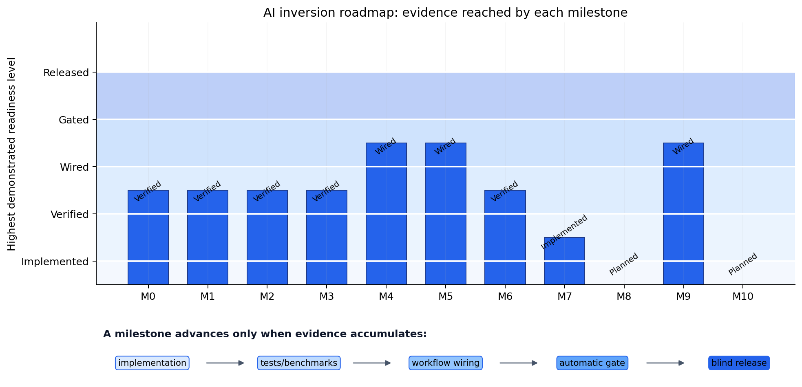

.. _ai_inversion_roadmap:

Architecture roadmap
====================

The pages under :doc:`concepts`, :doc:`data_preparation`,
:doc:`model_selection`, :doc:`training`, :doc:`inference`,
:doc:`validation`, :doc:`uncertainty`, :doc:`hybrid`, :doc:`pinn_2d`,
:doc:`agents`, and :doc:`reporting` document the ``Inv2DAgent``/
``Inv3DAgent`` workflow that predates this roadmap. Both agents
started as smoke/demo implementations: they inverted each station
independently against station-wise 1-D (:mod:`~pycsamt.forward.em1d`)
synthetic physics, then tiled the per-station results into a
pseudo-2-D or pseudo-3-D section. Because each station was solved in
isolation, nothing enforced lateral continuity between neighbours, so
a raw, native-cell rendering of that tiling looked patchy rather than
smooth. That ``physics="mt1d"`` path still exists, unconditionally,
as ``Inv2DAgent``'s default — but it is no longer the only path. An
opt-in ``physics="mt2d"`` mode now generates genuinely 2-D correlated
training models and solves them with a verified 2-D Maxwell backend
before training a U-Net on the result, described below in
:ref:`ai_inversion_roadmap_wiring`. ``Inv3DAgent`` has not made the
same transition yet: it still shares layered station parameters
through a spatial graph rather than solving a 3-D forward problem.

.. admonition:: Do not mistake smoothness for resolution
   :class: important

   A published figure that looks smooth may simply be display
   interpolation, unrelated to whether the underlying cells were
   actually resolved. Genuine smoothness in a released model should
   come from a network resolving spatially correlated structure,
   learned through the loss terms in :doc:`losses`, not from a
   post-hoc rendering choice. Save and label both the native-cell and
   the interpolated version of a section, and publish it alongside
   response residuals, uncertainty, and a comparison with an
   established classical inversion — never display interpolation
   alone as evidence of recovered resolution.

This is the reason a lower-level architecture has been built
underneath the existing agents rather than only tuning the agents
themselves. A single U-Net trained on tiled, independent 1-D columns
cannot be described as genuine 2-D or 3-D electromagnetic inversion,
regardless of how its output is rendered — it has to consume real
2-D/3-D forward physics, spatially correlated training models, a
staged loss with explicit spatial regularization and response fit,
and validated recovery/uncertainty evidence, in that order. The
package map below is that architecture; the sections after it report,
honestly, how much of it is verified today rather than only planned.

Roadmap language is deliberately cumulative. **Implemented** means that a
public API exists. **Verified** adds focused tests or physical benchmarks.
**Wired** means that an agent or dataset workflow actually consumes the API.
**Gated** adds a predeclared, automatically evaluated acceptance criterion,
and **released** adds a blind field evaluation with archived artifacts. Thus,
an implemented solver is not automatically a verified solver, and a verified
loss function is not automatically part of an accepted inversion workflow.
For milestone :math:`m`, the release condition can be written compactly as

.. math::
   :label: eq-ai-roadmap-readiness

   R_m = I_m \land V_m \land W_m \land G_m \land B_m,

where :math:`I_m`, :math:`V_m`, :math:`W_m`, :math:`G_m`, and :math:`B_m`
denote implementation, verification, workflow wiring, automatic gate, and
blind-evaluation evidence. Equation :eq:`eq-ai-roadmap-readiness` is a logical
contract, not a numerical score: one missing condition prevents a release
claim even when the other four are satisfied.

Package map
-----------

Each row below is one building block of the architecture. All of them
are usable as libraries today; :ref:`ai_inversion_roadmap_wiring`
covers which ones are actually consumed end-to-end by an agent, as
opposed to only unit-tested in isolation.

.. list-table::
   :header-rows: 1
   :widths: 22 45 33

   * - Package
     - Role
     - Guide page
   * - :mod:`pycsamt.ai.data`
     - Canonical impedance tensors, masks, normalization state, and
       dataset manifests shared by every later stage.
     - :doc:`data_contracts`
   * - :mod:`pycsamt.ai.geology`
     - Correlated random fields, layered geology, faults/lenses, and
       topography for synthetic training models.
     - :doc:`geology_priors`
   * - :mod:`pycsamt.ai.domain_gap`
     - Heteroscedastic noise, error floors, static shift, galvanic
       distortion, dropout, outliers, and coordinate perturbations,
       with parameter ranges that can be fitted directly from a real
       survey's own QC diagnostics rather than guessed.
     - :doc:`domain_gap`
   * - :mod:`pycsamt.forward.maxwell`
     - Solver-neutral 2-D/3-D Maxwell problem/result contracts, a
       backend registry, and concrete adapters for a verified 2-D
       solver, a research-only 3-D solver, and an external ModEM
       adapter.
     - :doc:`forward_physics`
   * - :mod:`pycsamt.ai.training.dataset2d`
     - Wires :mod:`~pycsamt.ai.geology` fields through a
       :mod:`~pycsamt.forward.maxwell` backend, batched and cached,
       into versioned :class:`~pycsamt.ai.data.contracts.SurveyData`
       training pairs.
     - :doc:`dataset2d`
   * - :mod:`pycsamt.ai.training.dataset3d`
     - Wires :mod:`~pycsamt.ai.geology` volumes through
       :class:`~pycsamt.forward.maxwell.mt3d.MT3DAdapter` on a padded,
       non-uniform mesh, into the same versioned
       :class:`~pycsamt.ai.data.contracts.SurveyData` training-pair shape
       as the 2-D generator. M8's research slice, not yet its production
       backend (see M8 above).
     - :doc:`dataset3d`
   * - :mod:`pycsamt.ai.losses`
     - The staged training objective: data fit, spatial
       regularization, response consistency, boundary constraints,
       and uncertainty terms.
     - :doc:`losses`
   * - :mod:`pycsamt.ai.validation`
     - Synthetic-recovery diagnostics, response-residual reports,
       calibration curves, and out-of-distribution checks.
     - :doc:`scientific_validation`
   * - :mod:`pycsamt.ai.experiments`
     - Immutable experiment configuration, seed lineage, and
       acceptance-gate evaluation for reproducible runs.
     - :doc:`experiments`

The 3-D Maxwell equation and the production-backend choice
------------------------------------------------------------

The equation :mod:`~pycsamt.forward.maxwell` targets for a 3-D
problem, with one documented time convention fixed per problem
(:class:`~pycsamt.forward.maxwell.contracts.MaxwellProblem` accepts
either ``exp(+iwt)`` or ``exp(-iwt)``, never both silently), is

.. math::
   :label: eq-ai-roadmap-maxwell

   \nabla\times\left(\mu^{-1}\nabla\times\mathbf E\right)
   + i\omega\sigma\mathbf E = \mathbf s,

with complex electric field :math:`\mathbf E`, angular frequency
:math:`\omega`, permeability :math:`\mu`, conductivity :math:`\sigma`
(anisotropic where a backend declares that support), and source term
:math:`\mathbf s`. Equation :eq:`eq-ai-roadmap-maxwell` is the same
one :doc:`forward_physics`'s 2-D adapter already solves on a reduced
TE/TM formulation. Extending it to a genuine 3-D solve raises a
practical question: solve it directly in-house, or route it through a
trusted external backend, the way :term:`Occam2D` and :term:`MARE2DEM`
already do for other methods in this package.

A direct sparse solve does not scale to production 3-D EM. Timing a
direct factorization against an unpreconditioned iterative solve at
increasing problem size shows direct-solve cost growing close to
quadratically with cell count, which extrapolates to tens of minutes
per single frequency/polarization solve at a realistic 3-D mesh size —
before multiplying by polarizations, frequencies, and the hundreds to
thousands of realizations a training dataset needs. No verified Python
3-D EM package (SimPEG, discretize, emg3d, pygimli) is installed in
this environment, and the existing
:class:`~pycsamt.forward.em3d.MT3DForward` is explicitly
:term:`Quasi-3-D`: it averages two independent 2-D cross-section
solves rather than solving equation :eq:`eq-ai-roadmap-maxwell`
directly, so it is not a genuine 3-D candidate either. Production 3-D
work therefore targets a verified external backend; an in-house
solver is kept research-only until it can be paired with a
problem-specific preconditioner, itself a substantial and distinct
numerical effort.

Two adapters exist as a direct consequence:

:class:`~pycsamt.forward.maxwell.modem3d.ModEm3DAdapter`
   Wraps the vendored ModEM Fortran solver
   (``pycsamt/models/modem/_source``) as a
   :class:`~pycsamt.forward.maxwell.external.BaseExternalMaxwellAdapter`
   subclass, reusing ModEM's own file I/O rather than a second parser.
   This is the intended production adapter. No compiled ``Mod3DMT``
   binary is committed to the repository (it is a local build
   artifact — see ``pycsamt/models/modem/_source/README`` for build
   instructions), but one has been built and used to validate this
   adapter against both analytic benchmarks with real margin, so its
   ``verified_benchmarks`` reports ``("half-space", "layered-earth")``.
   That validation surfaced and fixed five real bugs spanning the
   vendored Makefile, this adapter's own command-building and the
   shared external-executable resolver, the WS-format model
   reader/writer, and a genuine out-of-bounds read in ModEM's own
   air-layer setup for grids with fewer than 10 earth z-cells (now an
   explicit preflight rejection) — see the module docstring and the
   M6 ADR's 2026-07-29 update for the full account.

:class:`~pycsamt.forward.maxwell.mt3d.MT3DAdapter`
   A genuine, in-house discrete curl-curl solver on a Cartesian Yee
   grid (cell widths may be non-uniform per axis, e.g. a padded mesh),
   provided as an explicit research-only alternative and capped at
   6,000 cells by its own declared capabilities. On a padded,
   non-uniform calibrated mesh it passes both the analytic half-space
   and layered-earth benchmarks, so its ``verified_benchmarks``
   reports ``("half-space", "layered-earth")``. Small-grid/research-only
   status is unrelated to this and still applies: it exists because a
   direct sparse solve does not scale to realistic production 3-D mesh
   sizes (see the M6 architecture-decision record), not because of any
   remaining accuracy gap.

.. _ai_inversion_roadmap_verified:

What is verified today
-----------------------

None of the claims above are worth much without a way to check them
against the running code, so check the registry directly instead of
trusting this page's prose:

.. code-block:: pycon

   >>> from pycsamt.forward.maxwell import (
   ...     register_mt2d_backend,
   ...     register_modem3d_backend,
   ...     list_backends,
   ... )
   >>> register_mt2d_backend()
   >>> register_modem3d_backend()
   >>> for name, info in sorted(list_backends().items()):
   ...     cap = info["capabilities"]
   ...     print(
   ...         name, "dims=", cap["dimensions"],
   ...         "verified=", cap["verified_benchmarks"],
   ...         "available=", info["available"],
   ...     )
   modem3d dims= [3] verified= [] available= False
   mt2d dims= [2] verified= ['half-space', 'layered-earth'] available= True

``mt2d`` reports two verified benchmarks and is available in any
environment, since it wraps in-repo Python physics. ``modem3d``
reports zero verified benchmarks and ``available=False`` here,
because :func:`~pycsamt.forward.maxwell.external.resolve_executable`
cannot find a compiled ModEM binary — this is exactly the honesty the
:attr:`~pycsamt.forward.maxwell.backends.BackendCapabilities.verified_benchmarks`
field exists to enforce: a backend's benchmark status is read from
its registration, not asserted in documentation.
:class:`~pycsamt.forward.maxwell.mt3d.MT3DAdapter` does not appear at
all, because it has no ``register_mt3d_backend`` entry point; being
research-only and cell-capped, it is meant to be constructed
directly, not routed to through the registry a production dataset
generator would use.

.. _ai_inversion_roadmap_wiring:

Wired into the agents
----------------------

A library existing under :mod:`pycsamt.ai` or
:mod:`pycsamt.forward.maxwell` does not by itself change what
``Inv2DAgent`` or ``Inv3DAgent`` do. ``Inv2DAgent`` now exposes a
``physics`` argument that chooses between the two:

``physics="mt1d"`` (default)
   Unchanged from the original smoke/demo path: independent 1-D
   forward models tiled into a profile-shaped array. Kept as the
   default and as an explicit fallback, so a known baseline is always
   available to compare against.

``physics="mt2d"`` (opt-in)
   Generates spatially correlated 2-D training models with
   :mod:`~pycsamt.ai.geology`, solves them with the verified
   :class:`~pycsamt.forward.maxwell.mt2d.MT2DAdapter` through
   :func:`~pycsamt.ai.training.dataset2d.generate_2d_maxwell_dataset`,
   and can add the spatial-regularization terms from :doc:`losses`
   (``lambda_x``, ``lambda_z``, ``lambda_tv``) to
   :meth:`~pycsamt.ai.inversion.inv2d.EMInverter2D.fit`. Only the
   TE-mode (``zxy``) response is used for training here, even though
   :doc:`dataset2d` now validates the TM-mode (``zyx``) response too
   — this agent's feature layout is still TE-only, so it does not ask
   for the extra, currently-unused mode. Where a
   held-out synthetic split exists, a genuine :term:`synthetic
   recovery` check against known-truth resistivity is attached to the
   result through :func:`~pycsamt.ai.validation.recovery_report` —
   the one place in this workflow where "recovery" evidence is
   actually available, since field surveys carry no ground truth to
   compare against.

This is real wiring, not a description of intent: both physics modes
run end-to-end against bundled EDI data in the agent's own test
suite. It is also an incomplete one. The ``mt2d`` path currently
places stations on a synthetic uniform grid rather than the field
survey's actual geometry, no automated evaluation of the M5 acceptance
threshold exists yet (only the recovery check above, which is
necessary but not sufficient), and the spatial-regularization terms
train only on the PyTorch backend — selecting them under TensorFlow
raises rather than silently falling back to an unregularized fit.
``Inv3DAgent`` has not been touched by any of this: it remains a
:term:`Quasi-3-D`-adjacent graph model over per-station layered
parameters, sharing information through station adjacency rather than
solving equation :eq:`eq-ai-roadmap-maxwell` in three dimensions, and
:doc:`forward_physics`'s two 3-D adapters are not yet its data source.

Milestone status
----------------

The architecture is organized into eleven development stages, M0
through M10, each gated by an explicit acceptance criterion before it
can be called complete. The table below reports where each stage
genuinely stands today.

   The highest demonstrated readiness level for each milestone. Bars stop at
   the available evidence; they do not estimate percentage completion.

The concentration of blue bars at **verified** and **wired** is informative.
The reusable 2-D components are no longer merely proposals, but automatic
acceptance and blind release remain the bottleneck. M7 is different: its
production adapter is implemented, yet verification cannot advance until a
compiled ModEM executable is available. M8 and M10 are shown as planned, so
their zero-height bars must not be read as failed experiments.

.. code-dropdown:: ../../../scripts/generate_ai_inversion_figures.py
   :language: python
   :pyobject: make_roadmap_capability_matrix
   :linenos:
   :title: View roadmap-figure source code

.. list-table::
   :header-rows: 1
   :widths: 8 24 68

   * - Milestone
     - Scope
     - Status
   * - M0
     - Baseline freeze and reproducibility
     - Verified. Experiment configuration and seed/split manifests exist
       and have focused tests; see :doc:`experiments`. They support later
       gates, but do not themselves constitute a field release.
   * - M1
     - Survey data contract and WILLY audit
     - Verified. :class:`~pycsamt.ai.data.contracts.SurveyData` is exercised
       on WILLY in :doc:`data_contracts`; frequency coverage, dimensionality,
       and static-shift/domain-fit evidence are reported across
       :doc:`data_contracts`, :doc:`model_selection`, and :doc:`domain_gap`.
       These checks are documented and reproducible, although they are not
       yet exported as one signed release artifact.
   * - M2
     - Correlated geological priors
     - Verified as a library. :doc:`geology_priors` exercises correlated
       fields, layers, faults, lenses, topographic surfaces, and 3-D
       composition with reproducible diagnostic figures. Ensemble ranges
       still need to be frozen for each survey-specific experiment rather
       than treated as universal geological assumptions.
   * - M3
     - Domain-gap and noise simulator
     - Verified. :mod:`pycsamt.ai.domain_gap` fits noise, dropout, and
       distortion ranges from real WILLY QC diagnostics and is tested
       against that survey, not only against synthetic self-tests.
   * - M4
     - Genuine 2-D electromagnetic forward path
     - Wired. :class:`~pycsamt.forward.maxwell.mt2d.MT2DAdapter` passes
       both analytic benchmarks; contracts, mesh, cache, batching, and
       the external-adapter base are tested, and :doc:`dataset2d` consumes
       the backend to generate training pairs (:doc:`forward_physics`).
   * - M5
     - Response-aware 2-D learning
     - Wired, not gated. The staged loss and validation libraries exist;
       ``Inv2DAgent(physics="mt2d")`` wires them together end-to-end
       (:ref:`ai_inversion_roadmap_wiring`); the gate's own held-out
       normalized-RMS threshold is not yet evaluated automatically.
   * - M6
     - 3-D Maxwell solver feasibility and specification
     - Decided. Production 3-D work targets an external ModEM backend;
       an in-house production solver is not pursued — see
       :ref:`ai_inversion_roadmap_verified` above.
   * - M7
     - Verified 3-D forward backend
     - Substantively addressed for the ModEM path.
       :class:`~pycsamt.forward.maxwell.modem3d.ModEm3DAdapter` was
       validated against both analytic limits using a real compiled
       ``Mod3DMT`` (a local build artifact, not committed — see
       ``pycsamt/models/modem/_source/README``), which surfaced and
       fixed five real bugs (a vendored Makefile gap, a
       ``resolve_executable`` PATHEXT gap, a missing ModEM CLI
       argument, a WS-format header mismatch, and a genuine
       out-of-bounds read in ModEM's own air-layer sizing for grids
       with fewer than 10 earth z-cells). Remaining open items: ModEM
       license terms are still unconfirmed with the OSU authors, and
       only the two analytic limits (not the 2-D extrusion, isolated
       3-D body, non-uniform mesh, or MPI-build cases) have been
       checked. :class:`~pycsamt.forward.maxwell.mt3d.MT3DAdapter` is
       a research-only exception, verified at both the half-space and
       layered-earth limits (not a production backend regardless —
       see M6).
   * - M8
     - Correlated 3-D training and spatial model
     - Not started against the verified ModEM backend; a research
       slice exists but is explicitly not this milestone's production
       backend — ``Inv3DAgent(physics="mt3d")`` trains on genuinely
       3-D volumes solved with
       :class:`~pycsamt.forward.maxwell.mt3d.MT3DAdapter` (via
       :doc:`dataset3d`), not
       :class:`~pycsamt.forward.maxwell.modem3d.ModEm3DAdapter`.
   * - M9
     - Hybrid inversion and uncertainty, on this architecture
     - Wired on the earlier architecture. The 1-D, 2-D, and 3-D hybrid
       classes perform staged AI initialization and physics refinement, and
       :doc:`hybrid` documents their outputs and uncertainty checks. They do
       not yet consume the complete :mod:`pycsamt.ai.losses`,
       :mod:`pycsamt.ai.validation`, and :mod:`pycsamt.ai.experiments`
       acceptance stack, so M9 is not gated or release-ready.
   * - M10
     - WILLY blind evaluation and release
     - Not started; depends on M5 through M9.

Read this table with the linked package pages and the running APIs. Those
pages describe limitations beside the affected operation, where they are less
likely to be separated from the example than in a generic status box. If a
future implementation changes before this summary does, the executable
examples, backend capability declarations, and tests are the authoritative
evidence.

Next steps
----------

Continue with the package-level pages, each covering one row of the
map above with a runnable example:

* :doc:`data_contracts`
* :doc:`geology_priors`
* :doc:`domain_gap`
* :doc:`forward_physics`
* :doc:`dataset2d`
* :doc:`losses`
* :doc:`scientific_validation`
* :doc:`experiments`

For the complete ``Inv2DAgent``/``Inv3DAgent`` workflow built on top of
these packages, continue with :doc:`data_preparation`,
:doc:`model_selection`, :doc:`training`, :doc:`inference`,
:doc:`validation`, :doc:`uncertainty`, :doc:`hybrid`, :doc:`pinn_2d`,
:doc:`agents`, and :doc:`reporting`.
