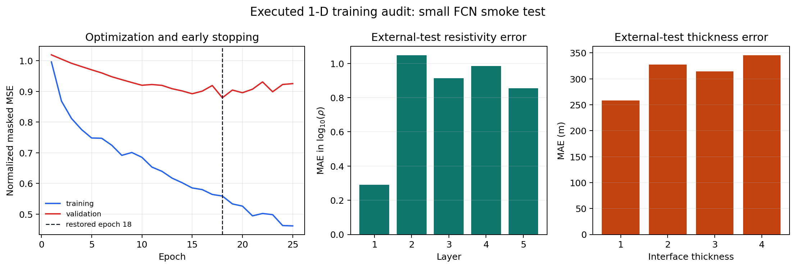

.. _ai_inversion_training:

Training AI inversion models
============================

Training turns a selected architecture and a prepared synthetic dataset into
an :term:`AI inversion` model that can be tested on data it has never seen.
In EM inversion, a decreasing loss is not sufficient evidence of success.  The
trained model must also recover physically plausible parameters, reproduce
the observations through a forward solver, remain stable under noise, and
generalize to acquisition conditions close to the field survey.

This page covers the fitting stage.  Prepare and audit the arrays first as
described in :doc:`data_preparation`, and choose the architecture with
:doc:`model_selection`.  Use :doc:`validation` after fitting; do not use the
test set to make training decisions.

What ``fit`` means in pyCSAMT
-----------------------------

pyCSAMT supports two distinct training patterns:

* **supervised amortized inversion** learns a mapping from many synthetic EM
  responses to known subsurface models.  This is the pattern used by
  :class:`pycsamt.ai.inversion.EMInverter1D`,
  :class:`~pycsamt.ai.inversion.EMInverter2D`,
  :class:`~pycsamt.ai.inversion.GCNInverter3D`, and
  :class:`~pycsamt.ai.inversion.JointInverter`;
* **observation-specific optimization** adjusts a model for one observed
  profile by minimizing data and physics losses.  :term:`Hybrid inversion` is
  explained in :doc:`hybrid`, while direct :term:`physics-informed inversion`
  is explained in :doc:`pinn_2d`.

The first produces a reusable predictor.  The second produces a result tied
to the observation being optimized.  Record which meaning applies whenever
you report that a model was "trained."

Before starting a run
---------------------

Freeze the scientific choices before tuning the optimizer.  At minimum,
record:

* the dataset file, checksum or immutable version identifier;
* frequency grid, component ordering, phase units, and missing-value policy,
  which together form the :term:`feature contract`;
* target parameterization, layer count, bounds, and whether thickness is
  logarithmic;
* simulator and noise model used to create the examples;
* split rule and random seed;
* architecture, backend, package version, device, and training arguments;
* the field survey or geological domain for which the model is intended;
* the expected :term:`training distribution` and likely :term:`domain gap`
  when the model is later applied to field data.

Inspect shapes and finite-value counts immediately before fitting.  A 1-D
input has shape ``(n_samples, n_features)``.  Its target contains layer
resistivities followed by interface thicknesses, so a model with ``L``
layers predicts ``2 * L - 1`` values.

.. code-block:: pycon

   >>> import numpy as np
   >>>
   >>> n_layers = 5
   >>> X = np.ones((12, 64))
   >>> y = np.ones((12, 2 * n_layers - 1))
   >>> y[0, -1] = np.nan
   >>> print("X:", X.shape, "y:", y.shape)
   X: (12, 64) y: (12, 9)
   >>> print("finite X:", round(float(np.isfinite(X).mean()), 3))
   finite X: 1.0
   >>> print("finite y:", round(float(np.isfinite(y).mean()), 3))
   finite y: 0.991
   >>> assert X.shape[0] == y.shape[0]
   >>> assert y.shape[1] == 2 * n_layers - 1

Do not silently replace invalid targets by arbitrary numbers.  Missing target
values have a scientific meaning and must be either excluded under a written
rule or handled by a loss that explicitly masks them.

For a masked target matrix :math:`\mathbf{Y}` and prediction
:math:`\hat{\mathbf{Y}}`, the supervised training loss should be interpreted
as a finite-entry objective,

.. math::
   :label: eq-ai-training-masked-loss

   \mathcal{L}_{\mathrm{sup}}
   =
   \frac{
      \sum_{i,j} M_{ij}\left(\hat{Y}_{ij}-Y_{ij}\right)^2
   }{
      \sum_{i,j} M_{ij}
   },
   \qquad
   M_{ij}=\mathbf{1}\{Y_{ij}\ \mathrm{is\ finite}\}.

In equation :eq:`eq-ai-training-masked-loss`, the denominator matters. A batch
with many masked target entries contributes
less information than a complete batch; it should not accidentally dominate
training because missing values were filled with zeros.

Splits, leakage, and normalization
----------------------------------

A credible experiment normally has three disjoint groups:

``training``
   Updates network weights.

``validation``
   Selects the stopping epoch and hyperparameters.

``test``
   Is opened only after choices are frozen and provides the final unbiased
   comparison.

Split by the highest-level independent unit.  Variants generated from the
same earth model, stations from the same synthetic survey, or several noise
realizations of one response should not be scattered across splits.  A
random row split can otherwise measure memorization of a parent model rather
than geological generalization.

Let :math:`p(i)` be the parent earth, profile, or survey identifier for sample
:math:`i`.  A leakage-resistant split requires

.. math::
   :label: eq-ai-training-group-split

   p(i)=p(k) \Longrightarrow s_i=s_k,

In equation :eq:`eq-ai-training-group-split`, :math:`s_i` is the assigned
split. If this condition is violated, the
validation curve may look good because the model has already seen siblings of
the validation case during training.  That is :term:`validation leakage`, even
when no literal validation row was passed as a training row.

.. important:: Current high-level supervised ``fit`` methods compute their
   normalization statistics on the supplied arrays before making their
   internal training/validation split.  Consequently, the internal
   validation loss is not strictly isolated from validation distribution
   statistics.  The same issue applies to the global scalar normalization in
   the 2-D and graph trainers and to per-modality normalization in the joint
   trainer.  Treat this as a documented implementation limitation when
   publishing results.  A strict benchmark requires a project-level training
   path that fits preprocessing on training data only and then applies the
   frozen transform to validation and test data.

Keep an external test set completely outside ``fit``.  Passing a preselected
training subset to ``fit`` protects the test set, although ``fit`` will still
create its own validation subset from that supplied training pool.

Configuration-first 1-D training
---------------------------------

:class:`pycsamt.ai.inversion.RunConfig` keeps forward-model and inversion
settings together.  A versioned configuration file is preferable to a
notebook cell whose state may be unclear.

.. code-block:: pycon

   >>> from pycsamt.ai.inversion import RunConfig
   >>>
   >>> # Create once, edit deliberately, and commit with the experiment record.
   >>> # RunConfig.write_template("configs/mt1d_run.yml")  # doctest: +SKIP
   >>> run = RunConfig()  # doctest: +SKIP
   >>> run.validate()  # doctest: +SKIP
   >>> inverter = run.to_inverter()  # doctest: +SKIP
   >>> inverter.fit(dataset, **run.to_fit_kwargs())  # doctest: +SKIP
   >>> inverter.save("checkpoints/mt1d_final.npz")  # doctest: +SKIP

``RunConfig.validate()`` checks configuration consistency; it cannot prove
that the frequency coverage, parameter bounds, noise model, or synthetic
geology are adequate for the field problem.

.. warning:: ``checkpoint_dir`` and ``save_best`` in the configuration do not
   by themselves make :meth:`EMInverter1D.fit
   <pycsamt.ai.inversion.EMInverter1D.fit>` write a checkpoint.  Save the
   fitted inverter explicitly.  Also note that ``weight_decay`` and
   ``min_delta`` are not forwarded by the current
   ``RunConfig.to_fit_kwargs()`` adapter; the high-level PyTorch trainer uses
   its own defaults for those values.

   Use an explicit ``.npz`` suffix for a 1-D checkpoint. ``save("model")`` is
   handled by NumPy as ``model.npz``, whereas ``load("model")`` checks the
   literal unsuffixed path and raises ``FileNotFoundError``.

Direct 1-D fitting
------------------

The direct interface is useful for a controlled experiment.  The constructor
must match the selected architecture names described in :doc:`model_selection`:

.. code-block:: pycon

   >>> from pycsamt.ai.inversion import EMInverter1D
   >>>
   >>> inverter = EMInverter1D(
   ...     n_features=64,
   ...     n_layers=5,
   ...     arch="resnet",
   ...     solver="mt1d",
   ...     device="cpu",
   ...     log_thickness=True,
   ...     augment_noise=0.01,
   ... )
   >>> print(inverter.__class__.__name__, inverter.arch, inverter.n_layers, inverter.solver)
   EMInverter1D resnet 5 mt1d
   >>> inverter.fit(  # doctest: +SKIP
   ...     X_train_pool,
   ...     y_train_pool,
   ...     epochs=300,
   ...     batch_size=256,
   ...     lr=1e-3,
   ...     patience=30,
   ...     val_frac=0.15,
   ...     grad_clip=1.0,
   ...     seed=42,
   ...     verbose=True,
   ... )
   >>> inverter.save("checkpoints/mt1d_seed42.npz")  # doctest: +SKIP

``X_train_pool`` excludes the external test set.  When a forward dataset is
passed instead of arrays, its metadata and model layout are used by the
dataset adapter.  Samples with an incompatible layer count are filtered, and
the output is trimmed to the expected ``2 * n_layers - 1`` columns.

For the PyTorch backend, the 1-D trainer uses Adam, a plateau learning-rate
scheduler, gradient clipping, masked mean-squared error, and early stopping.
The best in-memory weights are restored before ``fit`` returns.  Noise
augmentation is applied to the training subset and disabled for validation.
TensorFlow follows its backend implementation and should be treated as a
separate experiment rather than assumed to reproduce PyTorch numerically.

Understanding the training arguments
------------------------------------

``epochs``
   Maximum passes through the training subset.  Early stopping may finish
   earlier.  More epochs do not repair an unsuitable dataset.

``batch_size``
   Number of examples per update.  Larger batches need more memory and often
   give smoother gradients; smaller batches add gradient noise.  Compare
   settings at a similar number of optimizer updates when possible.

``lr``
   Initial learning rate.  Divergence or oscillation often indicates a value
   that is too large; extremely slow improvement can indicate a value that is
   too small, poor scaling, or an uninformative dataset.

``patience``
   Number of non-improving validation epochs tolerated before stopping.
   Choose it relative to the noisiness of the validation curve.

``val_frac``
   Fraction held out internally for early stopping.  Small datasets need
   enough validation examples to make the curve meaningful.

``grad_clip``
   Maximum gradient norm.  Clipping can contain occasional large updates,
   but persistent clipping is a symptom to investigate rather than a cure.

``seed``
   Controls the internal split and stochastic training operations.  It aids
   reproducibility but does not guarantee bitwise equality across hardware,
   backend, or library versions.

``augment_noise``
   Constructor setting that perturbs training inputs.  Match it to plausible
   measurement uncertainty; excessive augmentation erases useful structure.

Monitor more than one loss
--------------------------

The 1-D PyTorch trainer records training loss, validation loss, learning
rate, and epoch time internally, and the checkpoint preserves training
history and metadata.  The internal ``_history`` attribute is useful for
diagnostics but is private and therefore not a stable public API.  Reporting
code should tolerate its absence or consume history exposed by the agent
workflow.

.. code-block:: pycon

   >>> history = {
   ...     "train_loss": [0.42, 0.31, 0.25, 0.23],
   ...     "val_loss": [0.45, 0.34, 0.33, 0.36],
   ...     "lr": [1e-3, 1e-3, 5e-4, 5e-4],
   ... }
   >>> best = int(min(
   ...     range(len(history["val_loss"])),
   ...     key=history["val_loss"].__getitem__,
   ... ))
   >>> print("best epoch:", best + 1)
   best epoch: 3
   >>> print("best validation loss:", history["val_loss"][best])
   best validation loss: 0.33

For a fitted inverter, the same pattern is:

.. code-block:: pycon

   >>> history = getattr(inverter, "_history", None)  # doctest: +SKIP
   >>> if history:  # doctest: +SKIP
   ...     best = int(min(
   ...         range(len(history["val_loss"])),
   ...         key=history["val_loss"].__getitem__,
   ...     ))
   ...     print("best epoch:", best + 1)
   ...     print("best validation loss:", history["val_loss"][best])

Interpret the curves jointly:

* falling training and validation loss indicates useful learning;
* falling training loss with rising validation loss indicates overfitting;
* two flat, high curves suggest poor scaling, insufficient capacity, an
  unsuitable target representation, or weak information in the inputs;
* erratic or non-finite loss calls for checks of learning rate, target range,
  invalid values, and gradient magnitude;
* a low normalized loss can still hide large errors in a scientifically
  important layer, so inspect per-parameter errors in physical units.

An executed CPU training audit
~~~~~~~~~~~~~~~~~~~~~~~~~~~~~~

The following small run is deliberately an execution and persistence test,
not a production model. It keeps 15% of 240 synthetic examples completely
outside ``fit``, trains a compact FCN for at most 25 epochs, and reloads the
checkpoint using the exact filename written by ``save``.

.. code-block:: pycon

   >>> from pathlib import Path
   >>> from tempfile import TemporaryDirectory
   >>> import numpy as np
   >>> from pycsamt.ai.inversion import EMInverter1D
   >>> from pycsamt.forward.batch import generate_dataset

   >>> frequency_hz = np.logspace(np.log10(1.01), 4, 24)
   >>> samples = generate_dataset(
   ...     solver="mt1d", n_samples=240, freqs=frequency_hz,
   ...     n_layers=5, rho_range=(1.0, 10_000.0), depth_max=2000.0,
   ...     noise_level=0.05, noise_type="field", include_phase=True,
   ...     seed=137, n_jobs=1, output=None, verbose=False,
   ... )
   >>> train, validation, external_test = samples.split(
   ...     val_frac=0.15, test_frac=0.15, seed=137
   ... )
   >>> X_pool = np.vstack([train.X, validation.X])
   >>> y_pool = np.vstack([train.y, validation.y])
   >>> fitted = EMInverter1D(
   ...     n_features=48, n_layers=5, arch="fcn", solver="mt1d",
   ...     device="cpu", log_thickness=False, augment_noise=0.01,
   ... )
   >>> _ = fitted.fit(
   ...     X_pool, y_pool, epochs=25, batch_size=64, lr=1e-3,
   ...     patience=7, val_frac=0.15, grad_clip=1.0, seed=137,
   ...     verbose=False,
   ... )
   >>> predicted = fitted.predict(external_test.X)
   >>> print("external test shape:", predicted.shape)
   external test shape: (36, 9)
   >>> print("stopped within budget:", len(fitted._history["train_loss"]) <= 25)
   stopped within budget: True
   >>> with TemporaryDirectory() as folder:
   ...     checkpoint = Path(folder) / "training_smoke.npz"
   ...     fitted.save(checkpoint)
   ...     restored = EMInverter1D.load(checkpoint)
   ...     restored_prediction = restored.predict(external_test.X)
   ...     print("checkpoint exists:", checkpoint.exists())
   ...     print("reload close:", np.allclose(
   ...         predicted, restored_prediction, rtol=1e-5, atol=1e-3
   ...     ))
   checkpoint exists: True
   reload close: True

   The validation minimum selects the restored epoch, whereas the right panel
   converts external-test errors back to target units. The run can converge in
   normalized space while deep interface-thickness errors remain hundreds of
   metres. This is why a checkpoint smoke test is necessary but insufficient
   for scientific acceptance.

The widening train-validation gap and large held-out errors mean this small
model should be rejected, even though fitting completed and restoration
succeeded. Its value is to verify the mechanics and expose underpowered data
and training choices before a costly production run.

The private ``_history`` access above is acceptable for this version-specific
documentation audit, but production reporting should export a supported
history artifact. The reload comparison uses a declared numerical tolerance;
requiring bitwise equality across restored backends or hardware is generally
too strict.

For reproducibility, the early-stopping rule can be written as a selection of
the epoch

.. math::
   :label: eq-ai-training-best-epoch

   e^\star = \operatorname*{arg\,min}_{e\le E}
   \mathcal{L}_{\mathrm{val}}(e),

Equation :eq:`eq-ai-training-best-epoch` is subject to the patience rule. The
final weights should be those from
:math:`e^\star`, not necessarily the last epoch.  Record both the last epoch
and the selected epoch because a long tail of non-improving epochs can reveal
optimizer instability or an overly patient run.

Training a 2-D U-Net
--------------------

:class:`~pycsamt.ai.inversion.EMInverter2D` expects a batch of profile panels
and matching resistivity images.  Confirm the constructor dimensions and
array axes against :doc:`data_preparation` before fitting.

.. code-block:: pycon

   >>> from pycsamt.ai.inversion import EMInverter2D
   >>>
   >>> inv2d = EMInverter2D(
   ...     n_components=4,
   ...     n_freqs=32,
   ...     n_stations=48,
   ...     n_depth=64,
   ...     solver="pytorch",
   ...     device="cpu",
   ... )
   >>> print(inv2d.__class__.__name__, inv2d.n_components, inv2d.n_freqs, inv2d.n_stations, inv2d.n_depth)
   EMInverter2D 4 32 48 64
   >>> inv2d.fit(  # doctest: +SKIP
   ...     X2_train_pool,
   ...     y2_train_pool,
   ...     epochs=200,
   ...     batch_size=16,
   ...     lr=1e-3,
   ...     patience=20,
   ...     val_frac=0.15,
   ...     grad_clip=1.0,
   ...     seed=42,
   ... )

The internal random split is along the profile-example axis, not the station
axis inside a profile.  Keep profiles descended from the same synthetic earth
model in one external group.  PyTorch and TensorFlow use different tensor
layouts internally, and the TensorFlow path performs geometry resizing as
needed; validate exported results on the requested depth and station grids.
The current 2-D class does not expose the same documented public checkpoint
workflow as ``EMInverter1D``, so verify persistence requirements before a
long production run.

The 2-D loss is an image-like objective, but the target is still a geophysical
section.  If :math:`U_{bzk}` is log-resistivity for batch item :math:`b`, depth
cell :math:`z`, and station :math:`k`, a masked section loss is

.. math::
   :label: eq-ai-training-2d-loss

   \mathcal{L}_{2D}
   =
   \frac{
      \sum_{b,z,k} M_{bzk}
      \left(\hat{U}_{bzk}-U_{bzk}\right)^2
   }{
      \sum_{b,z,k} M_{bzk}
   }.

Pair equation :eq:`eq-ai-training-2d-loss` with boundary and response
diagnostics. A visually smooth section
can have low pixel loss while placing a conductor top at the wrong depth.

Training a graph model
----------------------

:class:`~pycsamt.ai.inversion.GCNInverter3D` learns from station features and
an adjacency matrix.  Graph construction is part of the experiment, not a
minor preprocessing detail.

.. code-block:: pycon

   >>> from pycsamt.ai.inversion import GCNInverter3D
   >>>
   >>> gcn = GCNInverter3D(
   ...     n_features=64,
   ...     n_layers=5,
   ...     solver="pytorch",
   ...     device="cpu",
   ... )
   >>> print(gcn.__class__.__name__, gcn.n_features, gcn.n_layers)
   GCNInverter3D 64 5
   >>> gcn.fit(  # doctest: +SKIP
   ...     X3_train_pool,
   ...     y3_train_pool,
   ...     adjacency=adjacency,
   ...     coords=station_xy,
   ...     epochs=250,
   ...     batch_size=8,
   ...     lr=1e-3,
   ...     patience=25,
   ...     val_frac=0.15,
   ...     seed=42,
   ... )

Audit node order, coordinate units, isolated nodes, degree distribution, and
connected components.  If neither a valid adjacency nor usable coordinates
are supplied, an identity graph can be used as a fallback; that removes
inter-station message passing and should never be mistaken for spatial
inversion.  Split along independent synthetic surveys.  Do not split nodes
from one survey between training and validation unless that transductive task
is explicitly the scientific objective.

For graph training, write the graph construction rule beside the loss.  If
:math:`A` is the adjacency matrix and :math:`H^{(t)}` is a hidden node matrix,
the GCN update is conditioned on a neighborhood aggregation of the form

.. math::
   :label: eq-ai-training-gcn-update

   H^{(t+1)} = \sigma\!\left(\tilde{A}H^{(t)}W^{(t)}\right),

In equation :eq:`eq-ai-training-gcn-update`, :math:`\tilde{A}` is the
normalized adjacency used by the implementation.
Changing coordinate units, edge radius, or node order changes
:math:`\tilde{A}` and therefore changes the model being trained.

Joint and ensemble training
---------------------------

A :class:`~pycsamt.ai.inversion.JointInverter` receives one feature matrix per
modality.  All matrices and the target must share the same row order.

.. code-block:: pycon

   >>> from pycsamt.ai.inversion import JointInverter
   >>>
   >>> joint = JointInverter(
   ...     n_features_list=(64, 25),
   ...     n_layers=5,
   ...     solver="pytorch",
   ... )
   >>> print(joint.__class__.__name__, joint.n_features_list, joint.n_layers)
   JointInverter (64, 25) 5
   >>> joint.fit(  # doctest: +SKIP
   ...     [X_mt_train_pool, X_aux_train_pool],
   ...     y_train_pool,
   ...     epochs=250,
   ...     batch_size=128,
   ...     lr=1e-3,
   ...     patience=25,
   ...     val_frac=0.15,
   ...     seed=42,
   ... )

Test a shuffled or missing auxiliary modality as an ablation.  If performance
does not change, the claimed joint information may not be used.  Remember
that the current joint trainer also estimates its modality normalizers before
its internal split.

Joint training is vulnerable to row-alignment errors because all modalities
share a target.  A safe pre-fit invariant is

.. math::
   :label: eq-ai-training-joint-alignment

   \operatorname{id}^{(1)}_i
   =
   \operatorname{id}^{(2)}_i
   =
   \operatorname{id}^{(y)}_i
   \quad \text{for every row } i.

Equation :eq:`eq-ai-training-joint-alignment` must be checked explicitly. Do
not rely on array length alone. Equal lengths can still describe different
stations, times, or synthetic parent models if the join order was lost.

:class:`~pycsamt.ai.inversion.EnsembleInverter` deep-copies and trains the
base estimator with different seeds:

.. code-block:: pycon

   >>> from pycsamt.ai.inversion import EMInverter1D, EnsembleInverter
   >>>
   >>> base = EMInverter1D(
   ...     n_features=64,
   ...     n_layers=5,
   ...     solver="mt1d",
   ... )
   >>> ensemble = EnsembleInverter(base, n_estimators=5, seeds=[42, 43, 44, 45, 46])
   >>> print(ensemble.__class__.__name__, ensemble.n_estimators, ensemble.seeds[:2])
   EnsembleInverter 5 [42, 43]
   >>> ensemble.fit(  # doctest: +SKIP
   ...     X_train_pool,
   ...     y_train_pool,
   ...     epochs=250,
   ...     batch_size=256,
   ...     patience=25,
   ...     val_frac=0.15,
   ...     verbose=True,
   ... )
   >>> ensemble.save("checkpoints/mt1d_ensemble")  # doctest: +SKIP

Budget approximately one full training run per member.  Member seeds affect
both the random split and model optimization, so ensemble spread combines
those sources of variation.  In uncertainty language, ensembles mainly probe
:term:`epistemic uncertainty`; input noise and incomplete measurements
contribute :term:`aleatoric uncertainty`.  Calibrate prediction intervals only
on a separate :term:`calibration set`.  Persist calibration products separately
because the current ensemble checkpoint does not preserve fitted calibrators.

PINN and hybrid optimization
----------------------------

Do not transfer the supervised recipe mechanically to a PINN or hybrid run.
Both workflows must track the data-misfit term, physics residual,
regularization terms, their weights, forward-solver settings, and the initial
model.  A low total loss is ambiguous if one weighted term dominates.  See
:doc:`hybrid` and :doc:`pinn_2d` for the staged workflow and required
diagnostics.

Reproducible experiment design
------------------------------

One successful seed is not a stability study.  For model comparison:

#. freeze one external test set and one grouping policy;
#. train each candidate with several declared seeds;
#. select hyperparameters using validation results only;
#. report the distribution of physical-unit metrics across seeds;
#. compare forward-response misfit and geological plausibility;
#. retain the configuration, dataset identity, logs, environment, and model
   artifact for every accepted run.

Changing the seed changes both the high-level internal validation membership
and weight initialization.  If the experiment must isolate initialization
variance from split variance, construct a lower-level training protocol with
a frozen split rather than interpreting the high-level seed sweep as a pure
initialization test.

Failure diagnosis
-----------------

Non-finite loss
   Check input and target finiteness, logarithms of non-positive values,
   extreme parameter bounds, learning rate, and gradient norms.  Do not simply
   discard the failing batches.

Validation loss rises early
   Confirm grouping, reduce capacity, increase representative training data,
   review augmentation, and shorten patience.  First rule out duplicated
   parent models across splits.

Training and validation losses remain high
   Verify component order and units, input/target pairing, layer layout, and
   whether the response contains enough information for the requested model.

Good synthetic metrics but poor field behavior
   Suspect domain shift: acquisition geometry, frequency coverage, noise,
   distortion, geology, or preprocessing differs from the simulator.  More
   epochs usually amplify rather than solve this problem.

Unstable graph training
   Inspect node ordering, coordinate scale, adjacency normalization,
   disconnected components, and survey-level splits.

Out-of-memory errors
   Reduce batch size first, then model width or panel dimensions.  Record the
   changed setting because it can alter optimizer behavior.

Training completion checklist
-----------------------------

Before promoting a model to inference, confirm that:

* the external test set was never passed to ``fit``;
* dataset identity, split policy, seeds, versions, and device were recorded;
* the selected epoch came from validation behavior, not test performance;
* losses and physical-unit errors were checked per parameter or depth range;
* predicted models were forward-modelled and compared with held-out responses;
* noise, domain-shift, and out-of-distribution tests were run;
* checkpoint loading and one representative prediction were verified;
* known normalization and persistence limitations were written into the run
  report rather than hidden.

Training is complete only when the artifact and the evidence needed to reject
or trust it are both reproducible.  Continue with :doc:`inference`,
:doc:`uncertainty`, and :doc:`reporting`.

The executed audit figure is reproduced by
``docs/scripts/generate_ai_inversion_figures.py`` using deterministic synthetic
generation and a CPU PyTorch run. Small numerical differences may occur across
backend and library versions; the scientific conclusion depends on the loss
separation and physical-unit errors, not identical pixels or last decimals.
