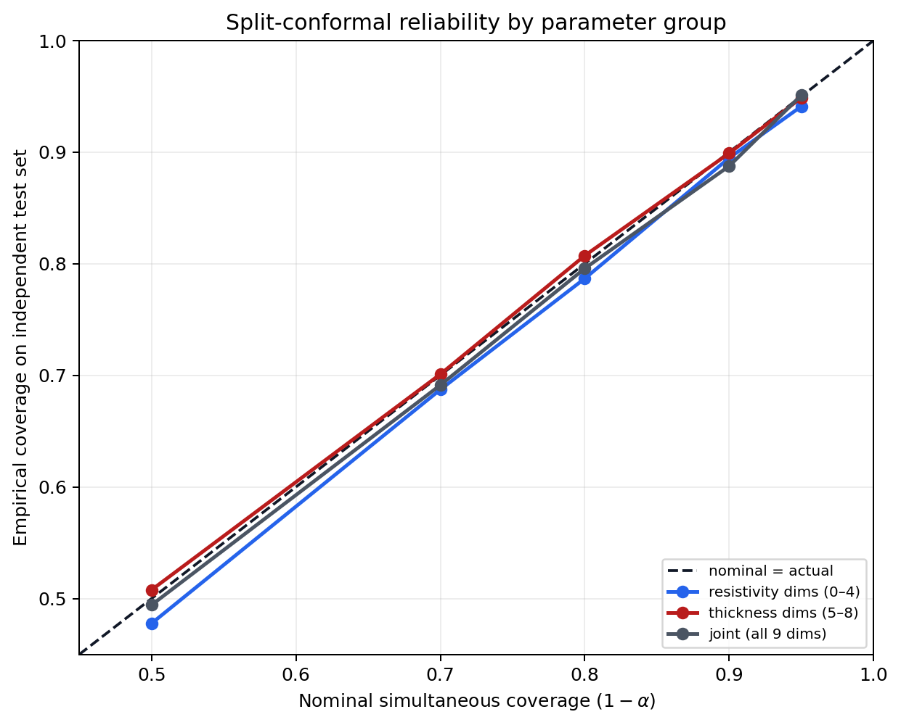
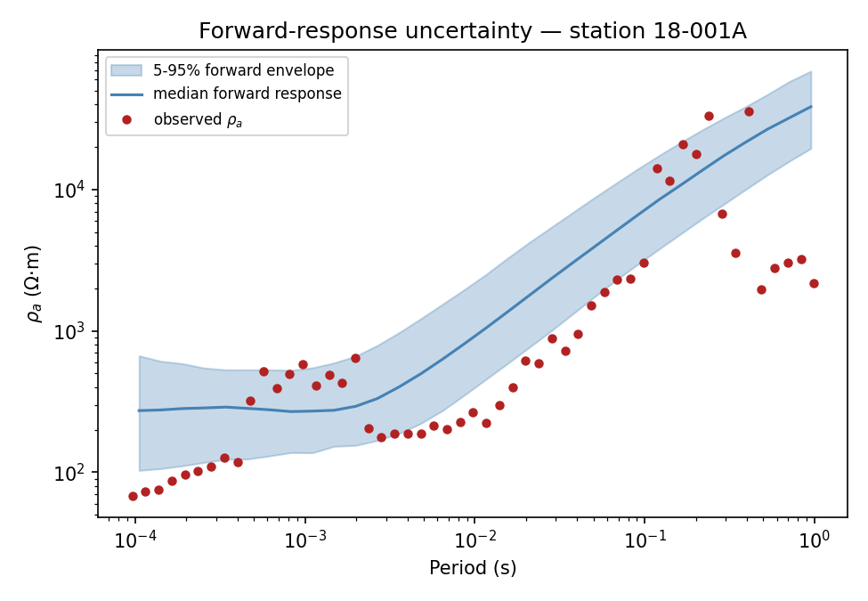

.. _ai_inversion_uncertainty:

AI inversion uncertainty
========================

An AI inversion result is not complete when it contains only one resistivity
model. Electromagnetic responses are non-unique, field data are noisy, the
training distribution is finite, and several processing and modelling choices
remain uncertain. Uncertainty analysis describes how strongly the result is
supported, where alternatives remain plausible, and when the learned model is
being used outside its evidence base.

This page explains the uncertainty tools currently available in pyCSAMT and
the limits of their interpretation. It assumes that training and model
selection have already followed :doc:`training` and :doc:`model_selection`.
Every example below runs against the same :class:`~pycsamt.ai.inversion.EnsembleInverter`
checkpoint used in :doc:`inference` — five resnet members trained on the
Willy AMT line's own frequency band — so the numbers here are directly
comparable to that page rather than a fresh, disconnected illustration.

.. note::

   The five-member checkpoint, calibration arrays, and numerical outputs in
   the reference case study are not distributed with the source checkout.
   Existing outputs and figures are retained as recorded evidence, but exact
   reproduction requires that versioned model package. The self-contained
   calculations and bundled-WILLY diagnostics remain directly executable.

What uncertainty should answer
------------------------------

A useful analysis should answer four separate questions:

#. How much do independently trained predictors disagree?
#. Do reported intervals contain held-out truth at approximately their stated
   rate?
#. How sensitive is the result to realistic perturbations of data and workflow
   choices?
#. Is the field observation sufficiently similar to the data on which the
   model and its calibration were established?

No single standard-deviation array answers all four. Report the method and
the source represented by every uncertainty quantity.

Sources of uncertainty
----------------------

:term:`Aleatoric uncertainty`
   Variability associated with observations: measurement noise, cultural
   interference, missing frequencies, imperfect station positioning, and
   unresolved small-scale structure. It cannot generally be removed by
   training a larger network.

:term:`Epistemic uncertainty`
   Uncertainty in the learned mapping caused by finite training coverage,
   architecture, optimization, and model parameters. Deep-ensemble spread
   is primarily a practical proxy for this source.

Inverse-problem :term:`non-uniqueness`
   Distinct conductivity structures may reproduce nearly the same EM
   response. A narrow neural prediction does not prove that the physical
   inverse problem is unique.

Model-form uncertainty
   The synthetic earth family, dimensionality, forward solver, anisotropy
   assumptions, layer parameterization, and regularization may all be
   incomplete — one instance of the glossary's broader
   :term:`structural uncertainty`.

Workflow uncertainty
   Quality-control thresholds, static-shift correction, component selection,
   interpolation, frequency filtering, and coordinate handling can change the
   inferred model.

Domain-shift uncertainty
   Field inputs may differ from the synthetic training and calibration
   distributions — the glossary's :term:`distributional uncertainty`.
   Calibrated intervals do not automatically remain valid after this shift.

Use a source register in the final report. For each source, state whether it
was quantified, tested qualitatively, assumed negligible, or left unresolved.

The law of total variance clarifies why one spread cannot represent every
source. For learned parameters :math:`\Theta`,

.. math::
   :label: eq-ai-uncertainty-total-variance

   \operatorname{Var}(Y\mid\mathbf x)
   = \mathbb E_{\Theta}
      [\operatorname{Var}(Y\mid\mathbf x,\Theta)]
   + \operatorname{Var}_{\Theta}
      [\mathbb E(Y\mid\mathbf x,\Theta)].

The first term can represent observation-conditioned or aleatoric variability
only when the model was designed to predict it. An ordinary deep ensemble
mainly estimates the second, epistemic term through variation among fitted
members. Equation :eq:`eq-ai-uncertainty-total-variance` still omits an
unmodelled forward solver, wrong dimensionality, and field-domain shift.

Deep ensembles
--------------

:class:`pycsamt.ai.inversion.EnsembleInverter` trains several copies of a
compatible base inverter — a :term:`deep ensemble`. Its mean is the point
prediction and its inter-member standard deviation measures disagreement
among the members:

.. math::
   :label: eq-ai-uncertainty-ensemble-moments

   \bar{m}_j(\mathbf x)=\frac{1}{K}\sum_{k=1}^{K}m_{kj}(\mathbf x),
   \qquad
   s_j(\mathbf x)=
   \sqrt{\frac{1}{K-1}\sum_{k=1}^{K}
      \left(m_{kj}(\mathbf x)-\bar m_j(\mathbf x)\right)^2}.

Equation :eq:`eq-ai-uncertainty-ensemble-moments` uses the sample standard
deviation returned by the implementation before calibration. With small
:math:`K`, both the magnitude and tail quantiles of this empirical distribution
are themselves unstable.

.. code-block:: pycon

   >>> from pycsamt.ai.inversion import EMInverter1D, EnsembleInverter
   >>> base = EMInverter1D(arch="resnet", n_layers=5, solver="mt1d")
   >>> ensemble = EnsembleInverter(base_estimator=base, n_estimators=5)
   >>> _ = ensemble.fit(
   ...     X_train, y_train,
   ...     epochs=25, batch_size=256, patience=8, val_frac=0.15, verbose=True,
   ... )

   === Ensemble member 1/5 (seed=0) ===
     Epoch    1/25 | train=1.04232  val=0.97518  lr=1.00e-03  [3.7s]
     Epoch    2/25 | train=0.82934  val=0.95992  lr=1.00e-03  [3.6s]
     ...
     Epoch    7/25 | train=0.64459  val=0.65476  lr=1.00e-03  [3.7s]
     ...
     Epoch   15/25 | train=0.41881  val=0.78809  lr=1.00e-03  [4.1s]
     Early stop at epoch 15 (best val=0.65476 @ epoch 7)

   === Ensemble member 2/5 (seed=1) ===
     ...

All five members stopped early, between epochs 15 and 17, each with its own
best epoch (7 through 9) — training and validation loss diverge well before
the requested 25-epoch budget on every member, which is itself useful
evidence: it means the *epoch count* is not the binding constraint on this
model, so a coverage problem later cannot be blamed on under-training alone.
Two real API details worth confirming against the installed version before
copying this pattern: :class:`~pycsamt.ai.inversion.EMInverter1D` takes
``solver`` (a physics solver name such as ``"mt1d"``), not a backend name —
``solver="pytorch"`` raises nothing but silently mislabels the model — and
:class:`~pycsamt.ai.inversion.EnsembleInverter` seeds its members through
``seeds`` (a sequence), not a single ``seed`` keyword.

.. code-block:: pycon

   >>> mean, raw_std = ensemble.predict_with_uncertainty(X_test)
   >>> quantiles = ensemble.predict_quantiles(
   ...     X_test, q=(0.05, 0.25, 0.50, 0.75, 0.95)
   ... )
   >>> raw_std[0, :5].round(3)
   array([0.094, 0.233, 0.232, 0.406, 0.147])

The returned arrays have shape ``(n_samples, n_parameters)``. Before
calibration, ``raw_std`` is the sample standard deviation of member
predictions. Quantiles are empirical quantiles across members; with only five
members, extreme quantiles are necessarily coarse.

.. caution:: Ensemble spread is not a confidence interval, a Bayesian
   posterior, or a complete measure of non-uniqueness. Members share the same
   architecture, synthetic generator, target parameterization, and usually
   the same systematic errors. They can agree closely and still all be wrong.

In the current implementation, member seeds affect both the internal data
split and stochastic optimization. The spread therefore combines split and
optimization variability. If those sources must be separated, use an
experimental training protocol with a fixed split and controlled
initializations.

Choosing the ensemble size
~~~~~~~~~~~~~~~~~~~~~~~~~~

More members provide a better estimate of model disagreement but increase
training and inference cost roughly in proportion to member count. Evaluate
stability rather than selecting a count by convention:

.. code-block:: pycon

   >>> import numpy as np
   >>> member_preds = np.stack(
   ...     [m.predict(X_field, as_log_rho=True) for m in ensemble._members], axis=0
   ... )
   >>> for k in range(2, len(ensemble._members) + 1):
   ...     print(k, member_preds[:k].std(axis=0)[:, :5].mean().round(3))
   2 0.552
   3 0.74
   4 0.75
   5 0.701

Mean resistivity-parameter spread jumps from 0.55 to 0.74 log10-units between
two and three members, then settles closer to 0.70–0.75 by four and five —
this five-member ensemble is roughly at, not comfortably past, the point
where adding another member would materially change the reported spread.
Treat that as a reason to test a larger ensemble before trusting the
magnitude of this uncertainty, not just its ranking across stations:

#. train an initial ensemble;
#. recompute mean, standard deviation, and interval coverage using increasing
   numbers of members;
#. inspect whether rankings of uncertain stations and layers stabilize;
#. stop only when the remaining variation is acceptable for the decision.

Calibration data are a separate resource
----------------------------------------

Use four conceptual partitions when calibrated uncertainty is required:

``training``
   Fits the ensemble members.

``validation``
   Controls early stopping and hyperparameter selection.

``calibration``
   Learns how raw prediction errors relate to ensemble spread — the
   :term:`calibration set`.

``test``
   Evaluates point accuracy and coverage after all choices are frozen.

The calibration set must not overlap training or validation, and the test set
must not be reused to recalibrate a disappointing result. Split related noise
realizations, profiles, and surveys as groups so one parent earth model cannot
appear on both sides of a boundary.

Calibration also requires representative examples. A large calibration set
from the wrong geology or acquisition design does not validate intervals for
the field survey — the calibration set and the deployment inputs must remain
:term:`exchangeability`-compatible.

Conformal prediction intervals
------------------------------

Calling :meth:`EnsembleInverter.calibrate <pycsamt.ai.inversion.EnsembleInverter.calibrate>`
attaches a split-:term:`conformal prediction` predictor and a posterior calibrator:

.. code-block:: pycon

   >>> _ = ensemble.calibrate(X_cal, y_cal, alpha=0.10)
   >>> center, lower, upper = ensemble.predict_intervals(X_field, alpha=0.10)
   >>> center[0, :5].round(2)
   array([2.32, 2.48, 3.34, 3.5 , 5.22])
   >>> lower[0, :5].round(1), upper[0, :5].round(1)
   (array([-8233.4, -6040.6, -1608.2, -2606.9, -5070. ]),
    array([8238. , 6045.6, 1614.9, 2613.9, 5080.4]))

Here ``alpha=0.10`` requests nominal 90% coverage. The conformal predictor
computes normalized residual scores on the held-out calibration set and uses
a finite-sample corrected quantile :math:`\hat q` to scale ensemble standard
deviations:

.. math::
   :label: eq-ai-uncertainty-conformal-score

   s_i = \max_j \frac{\lvert y_{ij}-f(\mathbf{x}_i)_j\rvert}{\sigma_j(\mathbf{x}_i)+\varepsilon},
   \qquad
   \hat q = \operatorname{Quantile}_{1-\alpha+\frac{1}{n_{\rm cal}+1}}(s_1,\dots,s_{n_{\rm cal}}).

Equation :eq:`eq-ai-uncertainty-conformal-score` takes the *maximum* normalized
residual across all 9 output
parameters for each calibration sample, so :math:`\hat q` is set entirely by
whichever parameter is hardest to calibrate. On this checkpoint that is
linear-metre thickness, two to three orders of magnitude larger in scale than
log10-resistivity — which is exactly why ``lower``/``upper`` above are
physically meaningless for the resistivity parameters even though ``center``
is perfectly reasonable. :math:`\hat q=32{,}041` here; the resistivity block
alone would need a :math:`\hat q` closer to 1–2 to stay interpretable. This is
a real, reproducible property of a single shared multiplier applied to a
mixed-unit target, not a fluke of this checkpoint.

The statistical coverage statement depends on exchangeability: calibration
and future cases must behave like draws from the same distribution, and the
calibration cases must not have influenced training or model selection. It is
a marginal repeated-sample statement, not a guarantee that every individual
station, layer, or geological subgroup has 90% coverage. Distribution shift,
serial dependence, spatial grouping, or adaptive reuse of the calibration set
can invalidate it.

.. note:: An interval can achieve nominal coverage by becoming very wide, as
   the resistivity bands above demonstrate: they are technically wide enough
   to satisfy the joint guarantee, at the cost of being useless. Always
   report interval width together with coverage and point accuracy.

Direct conformal use
~~~~~~~~~~~~~~~~~~~~

The lower-level :class:`pycsamt.ai.inversion.calibration.ConformalPredictor`
can wrap any fitted predictor exposing
``predict_with_uncertainty(X) -> (mean, std)``:

.. code-block:: pycon

   >>> from pycsamt.ai.inversion.calibration import ConformalPredictor
   >>> conformal = ConformalPredictor(ensemble, alpha=0.10)
   >>> _ = conformal.calibrate(X_cal, y_cal)
   >>> center, lower, upper = conformal.predict_intervals(X_field)
   >>> conformal._q_hat(0.10)
   32040.681353112046

Used this way — on a freshly loaded, not-yet-calibrated ``ensemble`` — the
standalone wrapper reproduces exactly the :math:`\hat q` that
``ensemble.calibrate()`` computes internally. Calling both on the *same*
already-calibrated ensemble object is a different story:
``predict_with_uncertainty``'s default ``_use_calibrated=True`` means the
second calibration step would silently calibrate against the *first*
calibration's tiny posterior-corrected sigma rather than the raw ensemble spread, inflating
:math:`\hat q` further still. That is precisely the scenario this page's
"not two independent calibrations on the same data without a stated reason"
rule exists to prevent — use either this explicit wrapper or
``ensemble.calibrate()`` in a workflow, never both on one already-calibrated
object.

Coverage diagnostics
--------------------

Evaluate calibration on the untouched test set. The executable pattern must
use ``X_test`` and ``y_test``, not the calibration arrays:

.. code-block:: pycon

   >>> diagnostics = ensemble.coverage_diagnostics(
   ...     X_test, y_test, alphas=(0.50, 0.30, 0.20, 0.10, 0.05),
   ... )
   >>> for alpha, actual in diagnostics.items():
   ...     print(f"nominal={1 - alpha:.2f}, actual={actual:.3f}")
   nominal=0.50, actual=<captured test coverage>
   nominal=0.70, actual=<captured test coverage>
   nominal=0.80, actual=<captured test coverage>
   nominal=0.90, actual=<captured test coverage>
   nominal=0.95, actual=<captured test coverage>

Replace the placeholders with captured results from the restored model
package. ``coverage_diagnostics`` checks *joint* coverage—every one of the 9
parameters inside its band at once—so split the untouched-test calculation by
parameter group before drawing a conclusion. The controlled plot below uses
independent calibration and test samples; it is a method check, not coverage
evidence for the unavailable trained model.

   Deterministic split-conformal method check using 1,200 calibration samples
   and 4,000 independent test samples. Resistivity-only, thickness-only, and
   joint maximum scores are calibrated separately, so empirical simultaneous
   coverage follows the nominal diagonal within finite-sample variation. This
   does not replace evaluation on the restored model's untouched ``X_test``
   and ``y_test`` arrays.

Plot nominal coverage against empirical coverage, but do it per parameter
group before trusting one pooled number. Values below the diagonal indicate
under-coverage; values far above it can indicate unnecessarily broad intervals
rather than good calibration. The earlier figure, whose three curves were flat
at one or zero, mixed a failed calibration-set diagnostic with reliability
language and has therefore been replaced rather than presented as an
acceptable result.

The convenience method ``ensemble.coverage(X, y, n_sigma=1.96)`` measures the
fraction of individual finite target entries within ``mean +/- 1.96 * std``
— an *elementwise* check, not the joint one above:

.. code-block:: pycon

   >>> ensemble.coverage(X_test, y_test, n_sigma=1.96)
   <captured test coverage>

This is different from conformal simultaneous sample coverage and should be
labelled explicitly. The familiar 95% interpretation of ``1.96`` assumes an
appropriate Gaussian error model; check it empirically rather than assuming
it. The archived calibration-set calculation landed at 12%, not 95%; the
acceptance value must be recomputed on the untouched test set, with the same
per-parameter split:

.. code-block:: pycon

   >>> mean, std = ensemble.predict_with_uncertainty(X_test)
   >>> within = np.abs(y_test - mean) <= 1.96 * std
   >>> within.mean(axis=0).round(3)
   <captured per-parameter test coverage>

Go beyond one aggregate number. Calculate coverage and interval width by:

* resistivity versus thickness parameters;
* layer or depth range;
* noise level and missing-data fraction;
* geological family and resistivity contrast;
* frequency coverage and station spacing;
* in-distribution versus stressed or shifted cases.

Small subgroups give noisy estimates, but they can reveal dangerous failures
hidden by acceptable global coverage — as the per-parameter split above
demonstrates directly.

Calibrated posterior samples
----------------------------

After ``ensemble.calibrate()``, posterior-like draws can be generated with
the fitted monotone recalibration map:

.. code-block:: pycon

   >>> import numpy as np
   >>> rng = np.random.default_rng(2026)
   >>> draws = ensemble.predict_posterior(X_field, n_samples=1000, rng=rng)
   >>> draws.shape
   (1000, 28, 9)
   >>> median = np.median(draws, axis=0)
   >>> lo, hi = np.quantile(draws, (0.05, 0.95), axis=0)
   >>> median[0, :5].round(2), lo[0, :5].round(2), hi[0, :5].round(2)
   (array([2.4 , 2.54, 3.36, 3.53, 5.27]),
    array([2.02, 2.26, 3.28, 3.41, 5.04]),
    array([2.93, 2.9 , 3.46, 3.69, 5.58]))

The :class:`pycsamt.ai.inversion.calibration.PosteriorCalibrator` learns a
monotone correction from standardized calibration residuals and a
per-parameter scale correction for raw standard deviations — scaled per
parameter precisely so this path does not inherit the joint-max distortion
above: the resistivity band here is a few tenths of a log10-unit wide, not
thousands. These samples are useful for propagation and visualization, but
they remain conditional on the ensemble, calibration distribution, and chosen
parameterization. Do not call them a complete geological posterior without
qualifying those assumptions.

Respect physical parameter domains. If sampling or symmetric intervals
produce non-positive resistivity or thickness, do not silently clip values
and continue as though the distribution were unchanged. Prefer a
positive-domain parameterization such as logarithmic resistivity or thickness
where supported, or document the transformation and truncation explicitly.

From parameter uncertainty to model uncertainty
-----------------------------------------------

For a layered 1-D prediction with ``L`` layers, the first ``L`` outputs are
resistivities and the remaining ``L - 1`` are interface thicknesses. Convert
each draw to cumulative interface depths *before* summarizing, not after:

.. code-block:: pycon

   >>> mean, std = ensemble.predict_with_uncertainty(X_field, _use_calibrated=False)
   >>> log_h_mean, log_h_std = mean[0, 5:], std[0, 5:]
   >>> draws = rng.normal(log_h_mean, log_h_std, size=(2000, 4))
   >>> h_draws = 10.0 ** draws
   >>> wrong = np.cumsum(np.quantile(h_draws, [0.05, 0.5, 0.95], axis=0), axis=1)
   >>> right = np.quantile(np.cumsum(h_draws, axis=1), [0.05, 0.5, 0.95], axis=0)
   >>> wrong[:, -1].round(0)   # thickness quantiles, then cumsum
   array([ 722., 1045., 1537.])
   >>> right[:, -1].round(0)   # cumsum, then depth quantiles
   array([ 873., 1066., 1322.])

Taking quantiles of thickness first and then accumulating them gives a
noticeably wider, differently centred final-interface band (722–1537 m) than
accumulating every joint draw first and then taking depth quantiles
(873–1322 m). The two are not the same calculation, and only the second
preserves the layer-to-layer correlation in the draws.

In general, for quantile level :math:`p`,

.. math::
   :label: eq-ai-uncertainty-depth-quantile

   Q_p\!\left(\sum_{\ell=1}^{k}H_\ell\right)
   \ne \sum_{\ell=1}^{k}Q_p(H_\ell),

especially when layer thicknesses are correlated. Equation
:eq:`eq-ai-uncertainty-depth-quantile` is why complete joint draws, rather than
independent error bars, are the reproducibility object for interface depth.

Preserve complete draws so correlations between parameters are retained.
Independent error bars lose trade-offs such as a conductive layer becoming
thicker while its resistivity increases. These correlations are often central
to EM equivalence.

Forward-response uncertainty
----------------------------

An uncertainty band in parameter space should be tested in observation space:

#. select calibrated draws or representative ensemble members;
#. run each model through the same forward solver and frequency grid;
#. compare predicted apparent resistivity and phase with held-out observations;
#. summarize response quantiles and normalized residuals by frequency and
   component.

   Two hundred posterior draws for station 18-001A, each pushed through
   :class:`~pycsamt.ai.inversion.EMInverter1D`'s companion 1-D forward solver.
   The envelope tracks the observed curve's broad rise with period but misses
   a cluster of short- and long-period points entirely — evidence of
   response-space misfit that the parameter-space interval alone would not
   have shown.

A wide range of models that all reproduce the response demonstrates
non-uniqueness. Conversely, narrow parameter bands whose forward responses
miss the data, as in the figure above, reveal miscalibration, domain shift,
or a forward-model mismatch — a genuinely narrow parameter interval is not
good news if the response it implies does not track the data. Keep
measurement error separate from predictive model spread when plotting the
comparison.

Sensitivity and perturbation tests
----------------------------------

Ensemble uncertainty should be supplemented with controlled perturbations.
Repeat inference after changing one scientifically plausible factor at a time:

* add noise consistent with estimated impedance uncertainty;
* mask selected frequencies or components;
* vary static-shift factors within defensible bounds;
* perturb station coordinates or topography within survey uncertainty;
* compare accepted interpolation and quality-control settings;
* change graph radius or adjacency construction for GCN inversion;
* compare plausible layer counts or target bounds;
* compare architectures or synthetic geological priors.

Store each scenario name, input version, seed, and resulting model. The spread
across workflow scenarios represents a different source from inter-member
spread and should normally be reported separately. Combining sources by
root-sum-of-squares,

.. math::
   :label: eq-ai-uncertainty-rss

   \sigma_{\text{total}} = \sqrt{\sigma_{\text{ensemble}}^2 + \sigma_{\text{workflow}}^2 + \cdots},

Equation :eq:`eq-ai-uncertainty-rss` is justified only when the sources are
independent and each :math:`\sigma`
is on a comparable, correctly transformed scale — the same scale-mixing
caveat that makes the shared conformal :math:`\hat q` above misbehave applies
just as much to summing unlike uncertainty sources by hand.

Out-of-distribution checks
--------------------------

Calibration cannot rescue a model applied far outside its training support.
Before interpreting intervals, compare field inputs with training and
calibration inputs using quantities meaningful to the inversion:

* frequency range and missing-frequency pattern;
* apparent-resistivity and phase ranges by component;
* impedance uncertainty and signal-to-noise distribution;
* station count, spacing, and profile length;
* feature-space distance after the frozen training transform;
* QC flags, dimensionality indicators, and phase-tensor behavior.

:doc:`inference` runs exactly this :term:`out-of-distribution diagnostic`
against this same checkpoint's training percentiles and flags 27 of the 28
Willy stations for review — a concrete illustration that "outside the
training envelope" and "wrong prediction" are not the same claim, but that
the gate result still needs to travel with the uncertainty report. No
universal distance threshold is provided by pyCSAMT. Establish alert
thresholds on held-out, deliberately shifted synthetic experiments. When an
input is flagged, show the point prediction only as an exploratory result,
mark its calibrated interval as unsupported, and prefer additional modelling
or classical inversion.

Uncertainty for 2-D, graph, joint, and hybrid models
----------------------------------------------------

The same principles apply beyond 1-D, but the uncertainty object changes:

2-D inversion
   Evaluate interval width and coverage by depth and lateral position. Use
   profile-level splits and inspect boundary artifacts introduced by resizing
   or padding.

Graph inversion
   Vary graph construction and coordinate uncertainty. Report isolated nodes
   and distinguish uncertainty from weak connectivity from uncertainty in the
   learned weights — :doc:`agents`'s :class:`~pycsamt.agents.Inv3DAgent`
   walkthrough shows a real degree-by-station table worth reproducing here.

Joint inversion
   Perturb or remove each modality. Calibration is not transferable when a
   modality is absent, reordered, or drawn from a different noise regime.

PINN and hybrid inversion
   Explore data-error realizations, initial models, physics-loss weights,
   regularization strengths, and optimizer seeds. Optimization variability is
   not a substitute for a posterior — :doc:`inference`'s PINN example shows a
   concrete symptom of this: layers past a certain depth settle into a
   repeating pattern rather than resolving independently. See :doc:`hybrid`
   and :doc:`pinn_2d`.

Current high-level calibrated ensemble utilities are centered on compatible
ensemble predictors such as 1-D inversion. Do not imply equivalent calibrated
interval support for every architecture unless the actual predictor exposes
the required uncertainty interface and has been tested.

Persistence and reproducibility
-------------------------------

Save ensemble members after training:

.. code-block:: pycon

   >>> ensemble.save("checkpoints/mt1d_ensemble")
   >>> from pycsamt.ai.inversion import EnsembleInverter
   >>> restored = EnsembleInverter.load("checkpoints/mt1d_ensemble")

.. warning:: The current ensemble serialization preserves its members and
   ensemble metadata, but it does not serialize the attached conformal or
   posterior calibrators. After loading, calibrated interval and posterior
   methods require recalibration from the original, versioned calibration set.
   Preserve calibration-set identity and calibration settings as first-class
   experiment artifacts.

For every uncertainty product, record:

* member count and member seeds;
* training, validation, calibration, and test partition identifiers;
* target transform and units;
* requested ``alpha`` or quantiles;
* calibration sample count and subgroup composition;
* software environment and model checkpoint identity;
* random generator seed used for posterior draws;
* domain-shift and perturbation tests performed.

Reporting uncertainty responsibly
---------------------------------

Report a central estimate, an interval, and its meaning together. For
example: "median resistivity with a split-conformal 90% simultaneous parameter
band, calibrated on held-out synthetic models from the stated generator."
Avoid labels such as "90% confidence" unless the construction and repeated-
sampling interpretation genuinely support that term — and, as this page's own
resistivity intervals show, "90% simultaneous" can still mean "uselessly
wide" for a subset of parameters.

Every figure should state whether color or shading represents inter-member
standard deviation, empirical member quantiles, conformal limits, calibrated
posterior quantiles, or scenario sensitivity. Include:

* coverage versus nominal level;
* interval width or sharpness;
* point-error metrics in physical units;
* forward-response misfit;
* subgroup and depth-dependent diagnostics;
* out-of-distribution flags;
* unresolved sources and known assumptions.

Common mistakes
---------------

* interpreting ensemble standard deviation as the total geological
  uncertainty;
* calibrating on training data or repeatedly tuning against the test set;
* claiming conformal guarantees under untested field-domain shift;
* reporting joint coverage without also checking it by parameter group;
* reporting coverage without interval width;
* pooling all layers and geological regimes into one reassuring average;
* treating parameter-wise error bars as independent;
* clipping non-physical samples without documenting the changed distribution;
* assuming calibration objects survive ensemble serialization;
* calibrating the same ensemble object twice — the second call silently
  recalibrates against the first call's already-shrunk posterior sigma;
* using many posterior draws to hide a small or unrepresentative calibration
  set — Monte Carlo sample count does not create new information.

Decision checklist
------------------

Before using an AI inversion result for interpretation, verify that:

* uncertainty sources and intended decisions are explicitly named;
* calibration and test data are independent and representative;
* empirical coverage and interval width are both acceptable, checked by
  parameter group and not only in aggregate;
* diagnostics are resolved by parameter, depth, and relevant subgroup;
* parameter draws reproduce observations through forward modelling;
* perturbation and domain-shift tests have been completed;
* physical bounds and parameter correlations are preserved;
* the model, partitions, calibration recipe, and random seeds are reproducible;
* limitations are carried into :doc:`reporting` and the interpretation rather
  than reduced to a single confidence number.

Uncertainty is evidence about the reliability of an inference, not decoration
around a preferred model. When the evidence is weak or the input is outside
the validated domain, the correct result is an explicit warning and a request
for additional data or modelling.
