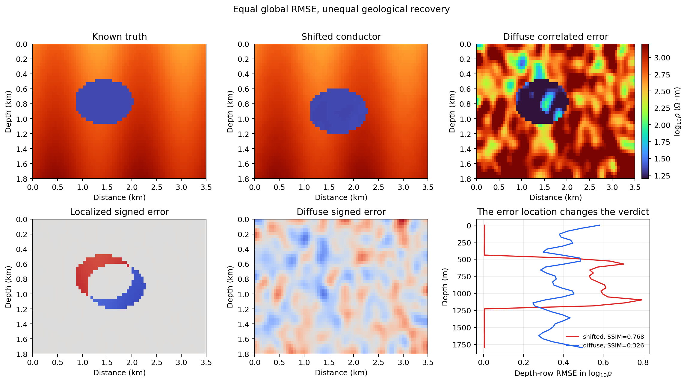
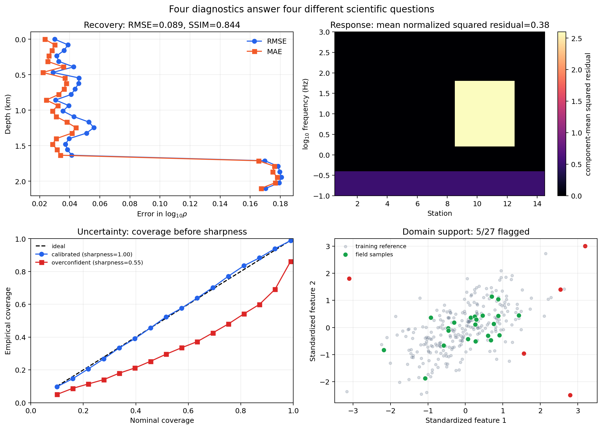
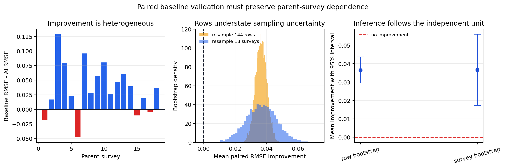
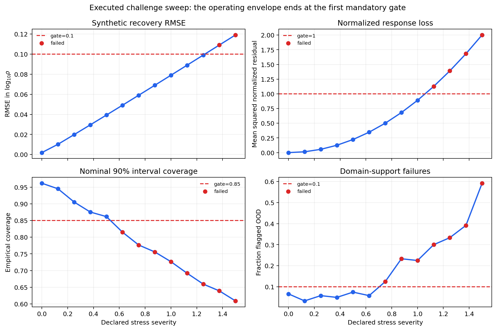
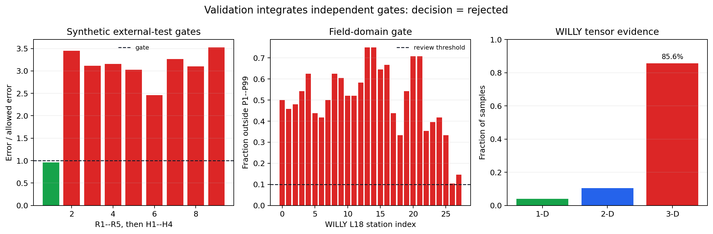

.. _ai_inversion_validation:

AI inversion validation
=======================

Validation determines whether an :term:`AI inversion` model is fit for a
stated use, not merely whether it can predict a synthetic test array.  A
defensible result must be accurate in parameter space, reproduce the
electromagnetic response, remain stable under realistic perturbations, behave
honestly when uncertain, and add value relative to a simpler
:term:`baseline model` or to an established classical inversion.

This page provides a validation protocol for models trained as described in
:doc:`training`.  Uncertainty calibration is treated in :doc:`uncertainty`,
while the final evidence package is assembled in :doc:`reporting`.

Validation is a claim with a scope
----------------------------------

Write the intended-use statement before computing metrics.  It is the domain
condition attached to every number that follows.  If a fitted model is
represented by :math:`g_\theta` and the measured feature vector by
:math:`\mathbf{x}`, validation is not the unconditional claim that
:math:`g_\theta(\mathbf{x})` is correct everywhere.  It is the narrower claim
that, for samples drawn from a declared domain :math:`\mathcal{D}`, the
prediction :math:`\hat{\mathbf{m}} = g_\theta(\mathbf{x})` is accurate enough
for a named decision and fails visibly outside that domain.  The statement
should name:

* survey method and components, such as :term:`AMT`, :term:`MT`,
  :term:`apparent resistivity`, and :term:`phase`;
* frequency range, station spacing, and expected data-quality range;
* geological families and resistivity contrasts represented;
* output :term:`dimensionality`, layer count, depth range, and parameter units;
* whether the result is for screening, initialization, interpretation, or a
  decision requiring quantitative accuracy;
* conditions under which the model must abstain or be reviewed.

A model validated for five-layer synthetic :term:`1D` earths is not thereby
validated for a strongly :term:`3D` field setting.  Every acceptance statement
should be read as "validated for this declared domain under these tests."

The evaluation partitions
-------------------------

Keep the roles of data partitions distinct:

``training``
   Updates model weights.

``validation``
   Controls early stopping, architecture choice, and hyperparameters.

``calibration``
   Fits conformal or posterior calibration when required.

``test``
   Measures final performance after all choices are frozen.

``challenge``
   Optional deliberately shifted cases used to identify failure boundaries.

The :term:`calibration set` and :term:`challenge set` have different jobs.  A
calibration set adjusts uncertainty statements after the model architecture is
chosen; a challenge set maps the failure boundary and should not quietly become
a source of tuning decisions.  The test set is not a second validation set.  If
its results cause another round of tuning, it has become development data and a
new untouched test set is required.

Split by independent geological realization or survey, not merely by row.
Noise variants from one :term:`forward model`, overlapping profile windows, or
nodes from one synthetic graph must remain in the same partition.  Record the
split manifest and verify that parent identifiers do not cross boundaries.  Any
path by which held-out information influences model selection, preprocessing,
or threshold setting is :term:`validation leakage`; it usually makes the final
score optimistic in a way that is difficult to repair after the fact.

.. important:: The current high-level supervised trainers estimate
   normalization statistics before making their internal training/validation
   split.  This limitation affects the internal validation curve.  It does not
   justify exposing the external test set: keep test and calibration arrays
   entirely outside ``fit`` and document the preprocessing behavior in the
   evidence report.

Freeze the artifact before testing
----------------------------------

Before opening the test set, preserve:

* model :term:`checkpoint` and checksum;
* configuration and random seeds;
* dataset and split identifiers;
* preprocessing and target transforms;
* pyCSAMT, backend, Python, and dependency versions;
* selected epoch and selection rationale;
* acceptance thresholds written without reference to test results.

Reload the checkpoint in a fresh process and reproduce a small reference
prediction.  This catches missing normalizers, incompatible shapes, and
serialization assumptions before scientific evaluation begins.

Parameter-space evaluation
--------------------------

For 1-D inversion, request predictions in the same representation as the
stored targets.  The default output of
:meth:`pycsamt.ai.inversion.EMInverter1D.predict` contains logarithmic
resistivity and, when ``log_thickness=True``, logarithmic thickness.

:term:`Model-space metric` values are easiest to audit when each target
quantity keeps its own units.  For sample :math:`i` and layer :math:`\ell`,
let :math:`y^{\rho}_{i\ell}=\log_{10}\rho_{i\ell}` and
:math:`\hat{y}^{\rho}_{i\ell}` be the predicted log-resistivity.  The
log-space error is
:math:`e^{\rho}_{i\ell}=\hat{y}^{\rho}_{i\ell}-y^{\rho}_{i\ell}`, while the
corresponding multiplicative physical error is
:math:`10^{|e^{\rho}_{i\ell}|}`.  If :math:`\mathcal{M}` is the finite-value
mask for the entries included in a metric, the masked RMSE is

.. math::
   :label: eq-ai-validation-masked-rmse

   \operatorname{RMSE}
   =
   \sqrt{
     \frac{1}{|\mathcal{M}|}
     \sum_{(i,j)\in\mathcal{M}}
     \left(\hat{y}_{ij}-y_{ij}\right)^2
   }.

Equation :eq:`eq-ai-validation-masked-rmse` is meaningful only with its mask,
target representation, and units. A trained workflow would call
``inverter.predict(X_test, as_log_rho=True)``.
The miniature example below isolates the metric semantics with fixed arrays so
the reported output is reproducible:

.. code-block:: pycon

   >>> import numpy as np
   >>> from pycsamt.ai.training.metrics import layer_rmse, summarise
   >>>
   >>> n_layers = 3
   >>> y_test = np.array([
   ...     [2.0, 2.5, 3.0, 60.0, 120.0],
   ...     [2.3, 2.8, 3.2, 80.0, 160.0],
   ...     [1.9, 2.4, 2.9, np.nan, 140.0],
   ... ])
   >>> y_pred = np.array([
   ...     [2.1, 2.4, 3.1, 65.0, 110.0],
   ...     [2.2, 2.9, 3.1, 90.0, 150.0],
   ...     [2.0, 2.5, 3.0, 75.0, 135.0],
   ... ])
   >>>
   >>> overall = summarise(y_test, y_pred, n_layers=n_layers)
   >>> per_parameter = layer_rmse(y_test, y_pred)
   >>> {name: round(value, 4) for name, value in overall.items()}
   {'rmse': 5.0006, 'mae': 2.9214, 'r2': 0.9923, 'relative_rmse': 0.0596, 'depth_rmse': 0.0577}
   >>> print("resistivity RMSE by layer:", np.round(per_parameter[:n_layers], 4))
   resistivity RMSE by layer: [0.1 0.1 0.1]
   >>> print("thickness RMSE by interface:", np.round(per_parameter[n_layers:], 4))
   thickness RMSE by interface: [7.9057 8.6603]
   >>> print("finite target values:", int(np.isfinite(y_test).sum()))
   finite target values: 14

The available metric helpers ignore non-finite entries.  Report how many
values each metric used; a score based on a small surviving fraction can look
misleadingly good.

Interpret metrics in their actual space:

RMSE and MAE
   Express typical error magnitude.  In log10 resistivity, an absolute error
   of 0.3 corresponds to approximately a factor of two, not 0.3 ohm-m.

R-squared
   Compares residual variation with target variation.  It can be negative and
   can look strong when broad target ranges dominate scientifically important
   local errors.

Relative RMSE
   Divides errors by target magnitude.  It becomes unstable near zero and is
   awkward for log-valued targets, so do not use it without explaining the
   representation.

Depth-weighted RMSE
   Summarizes resistivity errors with layer-index weighting.  The current
   helper gives deeper layers less influence; it does not replace explicit
   depth-resolved results.

The first scalar RMSE in the example is intentionally poor as a headline
number: it mixes log-resistivity entries and metre-valued thickness entries.
Never combine resistivity and thickness into one headline score without also
showing their separate physical-unit errors.  Convert predictions back to
ohm-m and metres for decision-facing tables:

.. code-block:: pycon

   >>> rho_true = 10.0 ** y_test[:, :n_layers]
   >>> rho_pred = 10.0 ** y_pred[:, :n_layers]
   >>> h_true = y_test[:, n_layers:]
   >>> h_pred = y_pred[:, n_layers:]
   >>>
   >>> rho_factor_error = np.maximum(rho_pred / rho_true, rho_true / rho_pred)
   >>> thickness_abs_error = np.abs(h_pred - h_true)
   >>> print("median rho factor error:", np.round(np.nanmedian(rho_factor_error, axis=0), 3))
   median rho factor error: [1.259 1.259 1.259]
   >>> print("median thickness abs error m:", np.round(np.nanmedian(thickness_abs_error, axis=0), 3))
   median thickness abs error m: [ 7.5 10. ]
   >>> print("worst rho factor error:", round(float(np.nanmax(rho_factor_error)), 3))
   worst rho factor error: 1.259

Report medians, upper quantiles, and worst credible cases in addition to means.
Aggregate metrics should be broken down by layer, cumulative interface depth,
resistivity contrast, conductor thickness, and data quality.

Model geometry and boundary recovery
------------------------------------

Layered targets need geometry-aware diagnostics.  Compute interface depths by
cumulatively summing thicknesses for every sample,
:math:`z_{ik}=\sum_{\ell=1}^{k}h_{i\ell}`, where :math:`h_{i\ell}` is layer
thickness and :math:`z_{ik}` is the depth to interface :math:`k`.  Then
evaluate:

* interface-depth absolute and relative error;
* whether important conductive or resistive units are detected;
* top and base depth error for target units;
* resistivity-thickness trade-offs;
* false layers, merged layers, and missed thin layers;
* performance as interfaces approach the investigation limit.

For 2-D and 3-D outputs, report cell-wise error together with structural
measures: lateral boundary position, depth extent, connected-body recovery,
and smoothing or edge artifacts.  A low image RMSE can coexist with a badly
placed target boundary.

The aggregation trap is observable, not theoretical
~~~~~~~~~~~~~~~~~~~~~~~~~~~~~~~~~~~~~~~~~~~~~~~~~~~~

The next audit constructs two 2-D predictions with the same global RMSE. One
misplaces the target conductor; the other adds spatially correlated error
throughout the section. Both are evaluated by
:func:`~pycsamt.ai.validation.recovery_report` without post-processing:

.. code-block:: text

   shifted conductor: RMSE=0.3832  MAE=0.1001  SSIM=0.7683
   diffuse error:     RMSE=0.3832  MAE=0.2995  SSIM=0.3265

   Equal global RMSE engineered to machine precision, then assessed through
   structure and depth rather than accepted as equivalent.

The shifted-conductor prediction concentrates a large signed error around one
geological boundary, yet its low-error background yields much lower MAE and
higher structural similarity than the diffuse prediction. Whether that is the
better model depends on intended use: it may be preferable for regional
background resistivity but unacceptable if locating the conductor is the
decision. The depth curves reveal where each failure occurs. A scalar gate
cannot encode that distinction, so pair global recovery with target-boundary,
depth-resolved, and response-space gates chosen before testing.

.. code-dropdown:: ../../../scripts/generate_ai_inversion_figures.py
   :language: python
   :pyobject: make_validation_aggregation_trap
   :linenos:
   :title: View and copy the equal-RMSE recovery audit

Response-space validation
-------------------------

The strongest physical check is to forward-model the predicted earth and
compare its response with the input observation.  If :math:`F` is the
:term:`forward operator`, :math:`\hat{\mathbf{m}}_i` is the predicted earth
model, :math:`\mathbf{d}_i` is the observed response vector, and
:math:`\sigma_{ij}` is the observational standard error for component
:math:`j`, the normalized residual is

.. math::
   :label: eq-ai-validation-normalized-residual

   r_{ij}
   =
   \frac{F_j(\hat{\mathbf{m}}_i)-d_{ij}}{\sigma_{ij}}.

The normalized :term:`response-space metric` is then

.. math::
   :label: eq-ai-validation-response-nrms

   \operatorname{NRMS}
   =
   \sqrt{
     \frac{1}{|\mathcal{M}|}
     \sum_{(i,j)\in\mathcal{M}} r_{ij}^{2}
   }.

Equations :eq:`eq-ai-validation-normalized-residual` and
:eq:`eq-ai-validation-response-nrms` require observational errors, not a
generic neural loss scale. For a trained 1-D MT model,
``inverter.predict_models(X_test)`` can be passed
to :class:`pycsamt.forward.MT1DForward`.  The compact example below uses
already reconstructed responses so the residual definition is explicit:

.. code-block:: pycon

   >>> import numpy as np
   >>>
   >>> observed = np.array([
   ...     [2.0, 2.2, 2.4, 45.0, 47.0, 49.0],
   ...     [1.8, 2.1, 2.5, 43.0, 46.0, 50.0],
   ... ])
   >>> reconstructed = np.array([
   ...     [2.0, 2.1, 2.4, 44.0, 47.5, 49.5],
   ...     [1.9, 2.0, 2.6, 42.5, 46.0, 50.0],
   ... ])
   >>> sigma = np.array([
   ...     [0.1, 0.2, 0.2, 2.0, 2.0, 3.0],
   ...     [0.1, 0.2, 0.2, 1.0, 2.0, 3.0],
   ... ])
   >>>
   >>> residual = (reconstructed - observed) / sigma
   >>> nrms = np.sqrt(np.mean(residual ** 2))
   >>> inside_one_sigma = np.mean(np.abs(residual) <= 1.0)
   >>> print("normalized RMS:", round(float(nrms), 3))
   normalized RMS: 0.442
   >>> print("fraction within 1 sigma:", round(float(inside_one_sigma), 3))
   fraction within 1 sigma: 1.0
   >>> print("per-feature mean residual:", np.round(residual.mean(axis=0), 3))
   per-feature mean residual: [ 0.5   -0.5    0.25  -0.5    0.125  0.083]

In the full workflow, ``predict_models`` converts the network output to
:class:`pycsamt.forward.synthetic.LayeredModel` objects and enforces positive
minimum values.  Preserve the raw network output as well; otherwise automatic
flooring can hide invalid predictions.

Compare forward responses with the unnormalized test observations using:

* log-apparent-resistivity residual by frequency;
* phase residual in degrees, with the adopted phase convention stated;
* component-specific residuals where applicable;
* normalized residual using observational standard errors;
* fraction of residuals inside declared error bounds;
* systematic frequency trends and station-correlated misfit.

Do not reduce the comparison immediately to one scalar.  A similar total
misfit can conceal a narrow frequency band that controls the target depth.
When training and validation use one forward solver, repeat a subset with an
independent trusted implementation if possible; otherwise the neural model and
its validation can share the same simulator bias.

The reports answer different questions
~~~~~~~~~~~~~~~~~~~~~~~~~~~~~~~~~~~~~~

The current validation package returns immutable report objects rather than
only scalar values:

* :func:`~pycsamt.ai.validation.recovery_report` preserves global recovery,
  structural similarity, depth profiles, valid-cell count, and grid shape;
* :func:`~pycsamt.ai.validation.response_residual_report` preserves the
  overall response loss and station-, frequency-, and component-wise views;
* :func:`~pycsamt.ai.validation.reliability_curve` preserves coverage,
  calibration loss, sharpness, valid count, and evaluated shape;
* :func:`~pycsamt.ai.validation.flag_out_of_distribution` preserves every
  score, its reference-derived threshold, flags, method, and reference size.

The controlled audit below executes all four APIs on one synthetic case:

.. code-block:: text

   recovery RMSE: 0.0893 log10(ohm.m)
   structural similarity: 0.8438
   mean normalized squared response residual: 0.3751
   calibrated mean coverage error: 0.0001
   overconfident mean coverage error: 0.0425
   samples flagged OOD: 5 / 27

   Four reports generated from the current recovery, residual, calibration,
   and OOD APIs. Each panel retains the axis on which failure occurs.

The recovery panel shows error increasing at depth even though the global
RMSE remains below 0.09. The response heatmap localizes a component-specific
misfit to stations 9--12 and a separate high-frequency edge effect; a global
value of 0.375 would hide both structures. The reliability curves distinguish
a correctly scaled predictor from a sharper but overconfident one. Finally,
the domain panel retains five flagged samples rather than removing them before
computing a reassuring average. Agreement in one panel cannot override a
failure in another because model truth, response fit, uncertainty honesty, and
deployment support are different validation claims.

.. code-dropdown:: ../../../scripts/generate_ai_inversion_figures.py
   :language: python
   :pyobject: make_scientific_validation_anatomy
   :linenos:
   :title: View and copy the four-report validation audit

Baselines and ablations
-----------------------

:term:`AI inversion` validation requires comparisons that answer whether the
complexity adds value.  Use the same held-out cases, preprocessing, units, and
metrics for all methods.  Relevant :term:`baseline model` choices include:

* a constant predictor based only on training-target medians;
* a simple nearest-neighbour or low-capacity regression baseline;
* the selected classical Occam, ModEM, or MARE2DEM workflow where dimensionality
  and data support permit;
* an AI-initialized classical or hybrid refinement;
* alternative AI architectures selected before test evaluation.

Compare accuracy, forward misfit, uncertainty calibration, runtime, memory,
failure rate, and analyst effort.  A model that is faster but less accurate may
still be valuable as an initializer; state that narrower role rather than
claiming replacement of classical inversion.

Because candidate and baseline are evaluated on the same held-out parents,
compare them through paired differences. If :math:`E_{A,g}` and
:math:`E_{B,g}` are errors for the AI model and baseline on independent parent
survey :math:`g`, define improvement as

.. math::
   :label: eq-ai-validation-paired-improvement

   \Delta_g = E_{B,g}-E_{A,g},
   \qquad
   \bar{\Delta}=\frac{1}{G}\sum_{g=1}^{G}\Delta_g.

Positive :math:`\Delta_g` favors the AI model. Confidence limits for
:math:`\bar{\Delta}` must resample the independent parent surveys, not every
correlated station window as though it were a new experiment.

The executed illustration contains 18 parent surveys with eight correlated
rows each:

.. code-block:: text

   mean paired RMSE improvement: 0.0367
   surveys favoring AI: 14 / 18
   row-bootstrap 95% interval:    [0.0295, 0.0437]
   survey-bootstrap 95% interval: [0.0173, 0.0561]

   The point estimate is unchanged, but uncertainty expands when resampling
   follows the actual independent unit.

Four surveys favor the baseline, so the positive mean is not a universal-win
claim. Treating 144 rows as independent produces a much tighter interval than
resampling 18 surveys and overstates the precision of deployment-level
improvement. The group interval remains positive in this controlled example,
but the wider range is the defensible evidence. Stratify the paired deltas by
geology, noise, dimensionality, and acquisition regime to learn where either
method wins; do not select only the favorable strata after seeing the test
result.

.. code-dropdown:: ../../../scripts/generate_ai_inversion_figures.py
   :language: python
   :pyobject: make_validation_paired_bootstrap
   :linenos:
   :title: View and copy the parent-survey bootstrap audit

:term:`Ablation study` results determine which inputs and mechanisms matter.
Repeat evaluation after removing :term:`phase`, individual components,
auxiliary modalities, graph edges, augmentation, or a physics-loss term.  An
unchanged score may reveal that a claimed information source is being ignored.

Robustness and stress testing
-----------------------------

Construct challenge sets before field deployment.  Vary one factor at a time
and then test realistic combinations:

* noise amplitude, outliers, and coherent cultural interference;
* missing frequencies, shortened bandwidth, and irregular sampling;
* static shift and residual distortion;
* station spacing, profile length, and coordinate error;
* resistivity and thickness near or beyond training bounds;
* thin conductors, sharp contrasts, anisotropy, and 2-D/3-D structures;
* component loss or modality dropout;
* graph radius, connectivity, and isolated stations;
* alternative forward-model or discretization settings.

Plot performance against stress severity.  Define the :term:`operating
envelope` at the point where error, coverage, or failure rate crosses a
predeclared limit.  Stress tests are not expected to all pass; their purpose is
to reveal when the model should abstain.

If :math:`s` denotes an ordered stress level and gate :math:`q` passes when
:math:`G_q(s)=1`, the supported boundary is

.. math::
   :label: eq-ai-validation-operating-boundary

   s_{\max}
   = \sup\left\{s:\prod_{q\in\mathcal{Q}}G_q(s)=1\right\}.

Equation :eq:`eq-ai-validation-operating-boundary` uses the intersection of
mandatory gates. Averaging them into one composite score would allow strong
performance on an easy metric to compensate for a critical physical failure.
The executed sweep below increases one declared severity variable and applies
fixed teaching thresholds: recovery RMSE at most 0.10, normalized response
loss at most 1.0, nominal-90% coverage at least 0.85, and OOD fraction at most
0.10.

.. code-block:: text

   first coverage failure severity: 0.625
   first OOD-fraction failure severity: 0.750
   first response-loss failure severity: 1.125
   first recovery-RMSE failure severity: 1.375
   joint operating boundary: below 0.625

   A deterministic challenge sweep evaluated with the current recovery,
   response-residual, reliability, and OOD report functions.

Parameter recovery is the last panel to fail, not the first. If this experiment
reported only synthetic RMSE, it would claim support through severity 1.25;
coverage has already failed at 0.625 and domain support at 0.75. The correct
operating boundary therefore lies below 0.625. The ordering is itself useful:
uncertainty becomes dishonest before the point estimate visibly collapses,
then the input leaves reference support, followed by response and model-space
failure. A real challenge axis should correspond to a physical quantity such
as missing-frequency fraction, impedance noise, static-shift magnitude, or
distance beyond the training resistivity range.

.. code-dropdown:: ../../../scripts/generate_ai_inversion_figures.py
   :language: python
   :pyobject: make_validation_stress_envelope
   :linenos:
   :title: View and copy the executed operating-envelope sweep

Uncertainty validation
----------------------

For an :term:`ensemble inversion`, point accuracy and uncertainty quality are
separate axes.  On an untouched test set, examine:

* empirical versus nominal conformal coverage;
* interval width or sharpness;
* coverage by layer, depth, geology, and noise regime;
* whether larger predicted spread corresponds to larger actual error;
* forward-response coverage after propagating parameter draws;
* behavior on deliberately shifted challenge cases.

For interval estimates :math:`[L_{ij}(\alpha), U_{ij}(\alpha)]` designed to
cover target entry :math:`y_{ij}` at nominal probability :math:`1-\alpha`, the
entry-wise empirical coverage is

.. math::
   :label: eq-ai-validation-coverage

   \widehat{C}(\alpha)
   =
   \frac{1}{|\mathcal{M}|}
   \sum_{(i,j)\in\mathcal{M}}
   \mathbf{1}\{L_{ij}(\alpha)\le y_{ij}\le U_{ij}(\alpha)\}.

Equation :eq:`eq-ai-validation-coverage` measures entry-wise coverage. The mean
interval width,
:math:`|\mathcal{M}|^{-1}\sum_{(i,j)\in\mathcal{M}}
\left(U_{ij}(\alpha)-L_{ij}(\alpha)\right)`, must be reported beside
coverage, because overly wide intervals can cover well while still being
scientifically unhelpful.

.. code-block:: pycon

   >>> import numpy as np
   >>>
   >>> y_test = np.array([
   ...     [2.0, 2.5, 3.0],
   ...     [2.1, 2.6, 2.9],
   ... ])
   >>> lower = np.array([
   ...     [1.85, 2.35, 2.85],
   ...     [1.95, 2.45, 2.75],
   ... ])
   >>> upper = np.array([
   ...     [2.15, 2.65, 3.15],
   ...     [2.25, 2.75, 3.05],
   ... ])
   >>> alpha = 0.10
   >>> entry_coverage = float(np.mean((lower <= y_test) & (y_test <= upper)))
   >>> sample_coverage = float(np.mean(np.all(
   ...     (lower <= y_test) & (y_test <= upper), axis=1
   ... )))
   >>> mean_width = np.mean(upper - lower, axis=0)
   >>> print("nominal coverage:", 1.0 - alpha)
   nominal coverage: 0.9
   >>> print("entry coverage:", entry_coverage)
   entry coverage: 1.0
   >>> print("simultaneous sample coverage:", sample_coverage)
   simultaneous sample coverage: 1.0
   >>> print("mean 90% interval width:", np.round(mean_width, 3))
   mean 90% interval width: [0.3 0.3 0.3]

Coverage measured on individual entries with ``ensemble.coverage`` is not the
same diagnostic as the conformal simultaneous sample coverage.  Label the
definition used.  See :doc:`uncertainty` for the :term:`exchangeability`
assumptions and :term:`calibration set` requirements.

Field-data validation
---------------------

Synthetic truth enables parameter scoring; field data rarely provide complete
truth.  Field validation therefore combines several weaker but independent
lines of evidence:

Data compatibility
   Confirm component order, units, phase convention, frequency support,
   missing-value handling, station geometry, and preprocessing match the
   validated :term:`feature contract`.

Quality control
   Review impedance validity, uncertainty, coherence or quality indicators,
   outliers, static shift, phase tensor, dimensionality, and strike.  Load EDI
   data through :func:`pycsamt.emtools._core.ensure_sites`; do not bypass the
   canonical data model with ad-hoc arrays unless their provenance is retained.

Distribution support
   Compare field feature ranges and distances with training and calibration
   distributions.  Flag :term:`domain gap` and
   :term:`out-of-distribution diagnostic` results rather than interpreting a
   narrow ensemble spread as safety.

Forward consistency
   Forward-model predicted structures and compare with the measured response
   and observational errors.

Method agreement
   Compare with an appropriate classical inversion and with alternative
   parameterizations.  Investigate disagreements instead of averaging them
   away.

External evidence
   Compare interfaces and conductors with boreholes, logs, geology, hydrochemical
   information, seismic constraints, or known structures that were not used to
   tune the model.

Spatial coherence
   Adjacent stations should vary in geologically plausible ways, but do not use
   smoothness alone as proof: a biased model can be smoothly wrong.

Blind wells or withheld geotechnical observations provide especially valuable
checks.  Keep them hidden until the workflow and interpretation rules are
frozen.

Validation by inversion family
------------------------------

1-D models
   Validate resistivity, thickness, cumulative interface depth, response
   misfit, and lateral consistency across independently inverted stations.
   Diagnose where the 1-D assumption fails.

2-D U-Net models
   Split at profile or parent-model level.  Validate depth/lateral geometry,
   station-boundary effects, resizing behavior, and profile forward responses.

GCN models
   Split at survey level.  Verify node order and adjacency, then stratify error
   by node degree, edge distance, boundary location, and connected component.
   Compare against the identity-graph ablation.

Joint models
   Validate row alignment and each modality independently.  Test missing,
   corrupted, and shuffled modalities and compare against the strongest
   single-modality baseline.

PINN and hybrid models
   Validate total and component losses, initial-model sensitivity, physics
   residual, observed-data misfit, regularization sensitivity, and convergence
   from multiple seeds.  See :doc:`hybrid` and :doc:`pinn_2d`.

Failure analysis
----------------

Do not report only representative successes.  Create a failure table with one
row per failed or high-error case and include:

* case and parent-group identifier;
* input quality and out-of-distribution indicators;
* true and predicted parameter summaries where truth exists;
* response residuals by frequency and component;
* uncertainty interval and whether it covered the truth;
* architecture, seed, and preprocessing version;
* likely failure category and supporting evidence;
* disposition: accepted limitation, abstention rule, data correction, or model
  redevelopment.

Inspect the worst cases by a metric chosen before opening them.  Avoid deleting
difficult cases unless a reproducible data-quality rule, independent of model
error, requires exclusion.

Worked rejection decision
-------------------------

The small FCN executed in :doc:`training` is useful for demonstrating how
separate gates combine. Before examining the results, suppose this teaching
exercise requires log-resistivity MAE no greater than 0.3 in every layer,
thickness MAE no greater than 100 m at every interface, no more than 10% of a
field row outside the synthetic P1--P99 envelope, and dimensionality evidence
compatible with station-wise 1-D interpretation. These are illustrative smoke
test limits, not universal geophysical thresholds.

.. code-block:: pycon

   >>> print("resistivity layers passing:", 1, "/ 5")
   resistivity layers passing: 1 / 5
   >>> print("interfaces passing:", 0, "/ 4")
   interfaces passing: 0 / 4
   >>> print("WILLY stations requiring domain review:", 28, "/ 28")
   WILLY stations requiring domain review: 28 / 28
   >>> print("WILLY 3-D diagnostic fraction:", 0.856)
   WILLY 3-D diagnostic fraction: 0.856
   >>> decision = "rejected"
   >>> print("validation decision:", decision)
   validation decision: rejected

   Only the first resistivity layer passes the illustrative error limit, no
   interface passes, every WILLY station exceeds the marginal domain-review
   threshold, and most tensor samples classify as 3-D. Checkpoint restoration
   passed in the training audit, but that operational success cannot override
   four scientific failures.

.. code-dropdown:: ../../../scripts/generate_ai_inversion_figures.py
   :language: python
   :pyobject: make_validation_gate_dashboard
   :linenos:
   :title: View and copy the executed rejection-dashboard code

The decision is rejection rather than ``conditional`` because failures occur
inside the synthetic test problem as well as during field transfer. Response
reconstruction was not supplied for this smoke checkpoint, so that mandatory
gate is *not evaluated*, never silently counted as a pass. A production study
would replace the illustrative thresholds, small dataset, and generic prior
with predeclared project requirements and independent evidence.

Acceptance criteria
-------------------

Define thresholds from the intended scientific decision, observational error,
baseline performance, and acceptable risk.  Avoid universal thresholds such
as "R-squared above 0.9" without context.  A promotion gate can require all of
the following:

* parameter error below declared limits overall and in critical subgroups;
* forward-response residual consistent with the data-error model;
* improvement over the agreed baseline by a declared margin;
* calibrated coverage close to nominal without excessive interval width;
* no severe degradation inside the declared noise and acquisition envelope;
* an out-of-distribution or QC rule that catches unsupported inputs;
* acceptable failure, latency, and resource rates;
* reproducible checkpoint reload and prediction;
* documented review of worst cases and unresolved risks.

Use three outcomes rather than forcing pass or fail:

``accepted``
   All mandatory gates pass for the stated intended use.

``conditional``
   The model is allowed only inside a narrower operating envelope or with
   mandatory classical/analyst review.

``rejected``
   Evidence is insufficient or a critical gate fails.  Return to data design,
   model selection, or training rather than weakening the threshold after
   seeing results.

Statistical reporting
---------------------

Point estimates alone hide sampling variability.  Report sample counts and
confidence intervals for aggregate metrics, preferably using bootstrap units
that respect the grouping structure.  For example, resample whole geological
realizations or surveys rather than correlated rows.  Use paired resampling
when comparing two methods on the same cases.

Report results across training seeds, but distinguish variation across seeds
from uncertainty of the finite test sample.  Do not select the best seed on the
test set.  If many architectures, groups, or metrics are inspected, acknowledge
the resulting multiplicity and prioritize predeclared primary endpoints.

Minimum validation record
-------------------------

The validation artifact should contain:

* intended-use and exclusion statements;
* immutable model, configuration, environment, and data identifiers;
* partition manifest with grouping and leakage checks;
* parameter metrics in model and physical units;
* depth-, layer-, geology-, and quality-stratified results;
* forward-response residual figures and tables;
* baseline and ablation comparisons;
* robustness, domain-shift, and uncertainty diagnostics;
* field and independent-evidence comparisons;
* complete failure analysis;
* predeclared thresholds and final accepted, conditional, or rejected status.

Validation checklist
--------------------

Before signing off, confirm that:

* no test or calibration case influenced training or model selection;
* parent earths, profiles, and surveys do not cross partitions;
* metrics use stated units, transforms, masks, and denominators;
* physical geometry and forward responses were evaluated;
* comparisons use identical held-out cases and preprocessing;
* uncertainty coverage and width were both measured;
* challenge tests define a credible operating envelope;
* field inputs were checked for QC, dimensionality, and domain support;
* failures and negative evidence remain visible;
* the conclusion is limited to the tested intended use.

Validation is complete when another analyst can reproduce the evidence and
reach the same promotion decision without relying on undocumented judgment.
Carry that evidence into :doc:`reporting` and, for field interpretation, the
broader :doc:`../interpretation/index` workflow.

