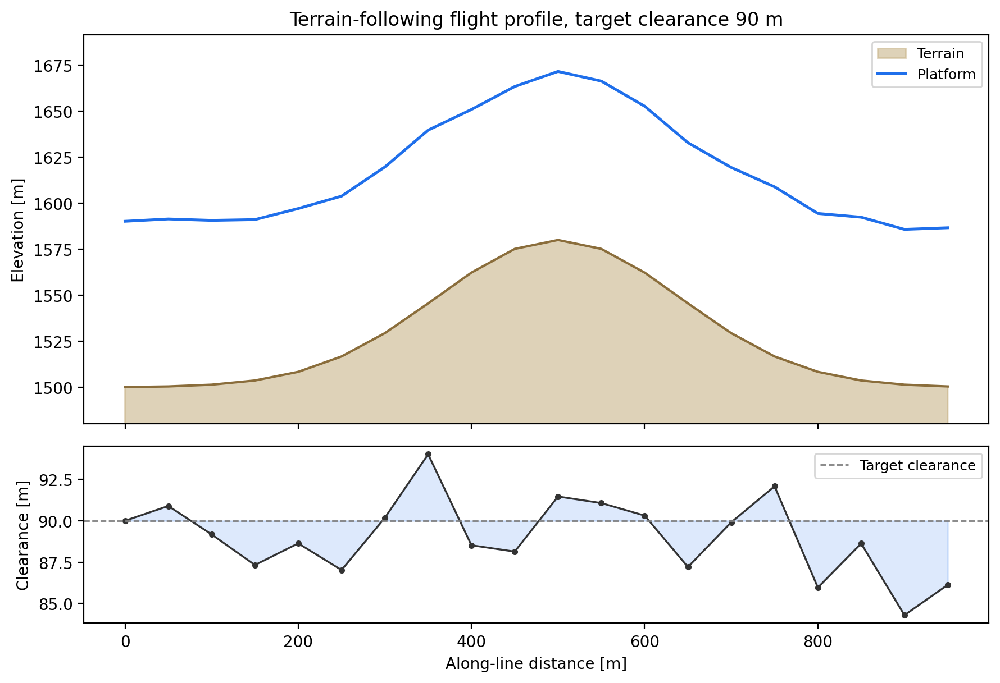

.. _user_guide_airborne_data_model:

Flight Lines and Datasets
=========================

:class:`~pycsamt.airborne.NavigationTrack`,
:class:`~pycsamt.airborne.AirborneEMRecord`,
:class:`~pycsamt.airborne.AirborneEMLine`, and
:class:`~pycsamt.airborne.AirborneEMDataset` are the four containers
every technology subpackage builds on. Navigation is the definitive
spine: a flight line's sample identifiers, position, and attitude are
recorded once, independently of whether every sample actually
produced a usable transfer function. Records are then attached
sparsely, keyed by the same sample identifiers, so a rejected or
missing EM sample never forces deleting its navigation point, and
never gets a fabricated response to fill the gap. Every name below
imports from the top-level :mod:`pycsamt.airborne` package; this page
builds everything from scratch with small synthetic examples, since
reading a real committed survey through this same model is
:doc:`site`'s job.

Navigation and Attitude
-----------------------

A :class:`~pycsamt.airborne.NavigationTrack` needs only
``sample_ids`` -- coordinates, elevations, attitude, and clearance are
all optional, and validated in pairs rather than individually.
Geographic and projected coordinates are independent options, so a
line can carry one, the other, both, or neither:

.. code-block:: pycon

   >>> import numpy as np
   >>> from pycsamt.airborne import NavigationTrack
   >>> n = 20
   >>> x = np.arange(n, dtype=float) * 50.0
   >>> terrain = 1500.0 + 80.0 * np.exp(-((x - 500.0) / 200.0) ** 2)
   >>> rng = np.random.default_rng(7)
   >>> target_clearance = 90.0
   >>> platform = terrain + target_clearance + rng.normal(0.0, 3.0, size=n)
   >>> nav = NavigationTrack(
   ...     sample_ids=tuple(f"S{i:02d}" for i in range(n)),
   ...     easting=x, northing=np.zeros(n),
   ...     terrain_elevation=terrain, platform_elevation=platform,
   ...     heading=np.full(n, 90.0),
   ... )
   >>> nav.n_samples
   20
   >>> nav.has_projected_coordinates, nav.has_geographic_coordinates
   (True, False)

``terrain`` is a synthetic 80 m hill, an exponential bump centred on
the line's midpoint over a flat 1500 m plain; ``platform`` tracks it
at a target clearance of 90 m plus small realistic noise, standing in
for what a radar altimeter hold actually achieves in practice, not a
perfectly constant offset. Latitude/longitude and easting/northing
each raise together or not at all, and finite coordinates are
range-checked rather than merely type-checked:

.. code-block:: pycon

   >>> try:
   ...     NavigationTrack(sample_ids=("S0", "S1"), latitude=[10.0, 20.0])
   ... except ValueError as exc:
   ...     print("ValueError:", exc)
   ValueError: latitude and longitude must be supplied together
   >>> try:
   ...     NavigationTrack(sample_ids=("S0", "S1"), latitude=[95.0, 20.0], longitude=[0.0, 0.0])
   ... except ValueError as exc:
   ...     print("ValueError:", exc)
   ValueError: finite latitude values must be within [-90, 90]

:attr:`~pycsamt.airborne.NavigationTrack.clearance_values` prefers an
explicit ``clearance`` array when one was supplied, and only falls
back to deriving ``platform_elevation - terrain_elevation`` when it
was not -- the derived case used here, since no explicit clearance was
given:

.. code-block:: pycon

   >>> import matplotlib.pyplot as plt
   >>> cv = nav.clearance_values
   >>> np.round(cv[:5], 2)
   array([90.  , 90.9 , 89.18, 87.33, 88.64])
   >>> round(float(cv.mean()), 2), round(float(cv.std()), 2)
   (89.05, 2.28)
   >>> fig, (ax1, ax2) = plt.subplots(
   ...     2, 1, figsize=(9.0, 6.2), sharex=True,
   ...     gridspec_kw={"height_ratios": [2.2, 1]},
   ... )
   >>> _ = ax1.fill_between(x, 0, terrain, color="#c9b58a", alpha=0.6, label="Terrain")
   >>> _ = ax1.plot(x, terrain, color="#8a6d3b", lw=1.5)
   >>> _ = ax1.plot(x, platform, color="#1f6feb", lw=1.8, label="Platform")
   >>> _ = ax1.set_ylim(terrain.min() - 20, platform.max() + 20)
   >>> _ = ax1.set_ylabel("Elevation [m]")
   >>> _ = ax1.legend(loc="upper right", fontsize=9)
   >>> _ = ax1.set_title("Terrain-following flight profile, target clearance 90 m")
   >>> _ = ax2.plot(x, cv, color="0.2", lw=1.2, marker="o", ms=3)
   >>> _ = ax2.axhline(target_clearance, color="0.5", ls="--", lw=1.0, label="Target clearance")
   >>> _ = ax2.fill_between(x, cv, target_clearance, color="#1f6feb", alpha=0.15)
   >>> _ = ax2.set_ylabel("Clearance [m]")
   >>> _ = ax2.set_xlabel("Along-line distance [m]")
   >>> _ = ax2.legend(loc="upper right", fontsize=9)
   >>> fig.tight_layout()
   >>> fig.savefig("user-guide-airborne-data-model-01.png", dpi=200, bbox_inches="tight")

   Terrain (tan) and platform (blue) elevation over the synthetic
   hill, with the derived clearance below it.

The top panel shows exactly what a clearance hold is supposed to
achieve: the platform trace echoes the terrain's rise and fall rather
than staying level, climbing roughly 80 m over the hill's crest right
alongside the ground. The bottom panel is where the noise actually
matters -- clearance oscillates around the 90 m target by a few
metres sample to sample, dipping as low as about 84 m and rising past
93 m, entirely ordinary altimeter/autopilot response rather than a
data problem, and exactly the kind of variation
:attr:`~pycsamt.airborne.NavigationTrack.clearance_values` is built to
expose rather than smooth away.

Records and Lines
-----------------

An :class:`~pycsamt.airborne.AirborneEMLine` pairs one
:class:`~pycsamt.airborne.NavigationTrack` with a sparse
``{sample_id: AirborneEMRecord}`` mapping. A freshly built line has
navigation but no records at all --
:attr:`~pycsamt.airborne.AirborneEMLine.missing_sample_ids` reports
every sample as missing until records are actually attached:

.. code-block:: pycon

   >>> from pycsamt.airborne import AirborneEMLine
   >>> line = AirborneEMLine(line_id="DEMO01", navigation=nav)
   >>> line.n_samples, line.n_records
   (20, 0)
   >>> len(line.missing_sample_ids)
   20

:func:`~pycsamt.airborne.ztem.build_ztem_record` -- the same kind of
technology constructor :doc:`site` and :doc:`registry_and_io` already
use -- builds one :class:`~pycsamt.airborne.AirborneEMRecord` at a
time, ready for :meth:`~pycsamt.airborne.AirborneEMLine.add_record`.
Deliberately skipping sample ``S07`` leaves the line genuinely sparse,
not just theoretically capable of it:

.. code-block:: pycon

   >>> from pycsamt.airborne.ztem import build_ztem_record, ZTEMSystemSpec
   >>> freqs = np.array([90.0, 180.0, 360.0])
   >>> for i, sid in enumerate(nav.sample_ids):
   ...     if i == 7:
   ...         continue
   ...     tip = np.zeros((3, 2), dtype=complex)
   ...     tip[:, 0] = 0.05 + 0.01j
   ...     tip[:, 1] = 0.02 - 0.005j
   ...     record = build_ztem_record(sid, tip, frequency=freqs, system_spec=ZTEMSystemSpec())
   ...     _ = line.add_record(record)
   >>> line.n_records
   19
   >>> line.missing_sample_ids
   ('S07',)
   >>> line.transfer_function_names
   ('tipper',)
   >>> line.record_at(0).sample_id
   'S00'
   >>> line.record_at(7) is None
   True

:meth:`~pycsamt.airborne.AirborneEMLine.record_at` and
:meth:`~pycsamt.airborne.AirborneEMLine.get_record` both return
``None`` for a missing sample rather than raising -- ``S07`` is a
perfectly valid navigation index, it simply has nothing attached.
:meth:`~pycsamt.airborne.AirborneEMLine.iter_records` skips it
silently and yields every other record in navigation order, not
insertion order, which happens to be the same order here only because
records were added in navigation order to begin with:

.. code-block:: pycon

   >>> order = [r.sample_id for r in line.iter_records()]
   >>> order == [s for s in nav.sample_ids if s != "S07"]
   True

Assembling A Dataset
--------------------

:class:`~pycsamt.airborne.AirborneEMDataset` collects lines the same
way lines collect records -- keyed, this time by ``line_id`` -- and
adds survey-level bookkeeping on top: iterating every line or every
record across the whole survey, and recovering just the EMTF payloads
that actually exist. Two more small lines, offset 100 m apart along
northing, make that concrete:

.. code-block:: pycon

   >>> from pycsamt.airborne import AirborneEMDataset
   >>> def make_offset_line(line_id, northing_offset):
   ...     nav2 = NavigationTrack(
   ...         sample_ids=tuple(f"{line_id}_S{i:02d}" for i in range(n)),
   ...         easting=x, northing=np.full(n, northing_offset),
   ...         terrain_elevation=terrain, platform_elevation=platform,
   ...     )
   ...     ln = AirborneEMLine(line_id=line_id, navigation=nav2)
   ...     for sid in nav2.sample_ids:
   ...         tip = np.zeros((3, 2), dtype=complex)
   ...         tip[:, 0] = 0.05 + 0.01j
   ...         tip[:, 1] = 0.02 - 0.005j
   ...         rec = build_ztem_record(sid, tip, frequency=freqs, system_spec=ZTEMSystemSpec())
   ...         ln.add_record(rec)
   ...     return ln
   >>> line_a = make_offset_line("A", 0.0)
   >>> line_b = make_offset_line("B", 100.0)
   >>> dataset = AirborneEMDataset(name="demo_survey", lines={"A": line_a, "B": line_b})
   >>> dataset.n_lines, dataset.n_samples, dataset.n_records
   (2, 40, 40)
   >>> dataset.line_ids
   ('A', 'B')
   >>> dataset.get_line("A") is line_a
   True
   >>> _ = dataset.add_line(line, replace=True)
   >>> dataset.n_lines
   3
   >>> len(dataset.emtf_records())
   59

``59``, not ``60`` -- ``dataset.emtf_records()`` folds ``DEMO01``'s
own sparsity into the dataset total automatically, since
:meth:`~pycsamt.airborne.AirborneEMDataset.emtf_records` omits any
record with no attached ``EMTF`` rather than representing the gap
with a placeholder, the same convention
:meth:`~pycsamt.airborne.AirborneEMLine.iter_records` already applies
at the line level.

:meth:`~pycsamt.airborne.AirborneEMDataset.inspect`/
:meth:`~pycsamt.airborne.AirborneEMDataset.qc` are thin, lazily-
imported convenience wrappers around exactly the functions
:doc:`quality_control` covers directly --
:func:`~pycsamt.airborne.inspect_airborne`/
:func:`~pycsamt.airborne.assess_airborne_qc` -- so a dataset can
inspect or assess itself without an extra import:

.. code-block:: pycon

   >>> insp = dataset.inspect()
   >>> insp.object_type, insp.n_lines, insp.n_samples, insp.n_records
   ('dataset', 3, 60, 59)
   >>> report = dataset.qc()
   >>> report.status
   'warning'
   >>> len(report.warnings), len(report.errors)
   (59, 0)

Fifty-nine warnings -- one per attached record across all three
lines, ``DEMO01``'s missing ``S07`` sample already counted separately
as an ``"info"``-severity finding above -- is expected rather than a
bug: every record here was built with
:func:`~pycsamt.airborne.ztem.build_ztem_record` and no
``reference_station`` argument, so none of them carry the fixed
ground-reference metadata :doc:`registry_and_io` already showed ZTEM's
``reference_required=True`` contract demands.
:attr:`~pycsamt.airborne.qc.AirborneQCReport.status` is still only
``"warning"``, not ``"error"``, because a missing reference station is
incomplete metadata, not an internally inconsistent one -- the exact
severity philosophy :doc:`quality_control` explains in full, with a
dataset built to actually pass.
