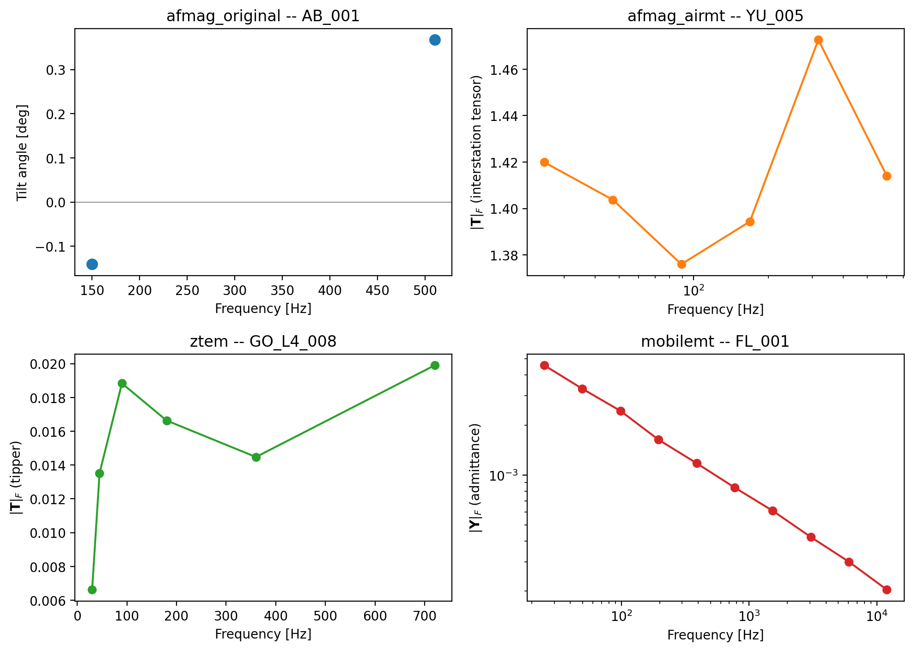
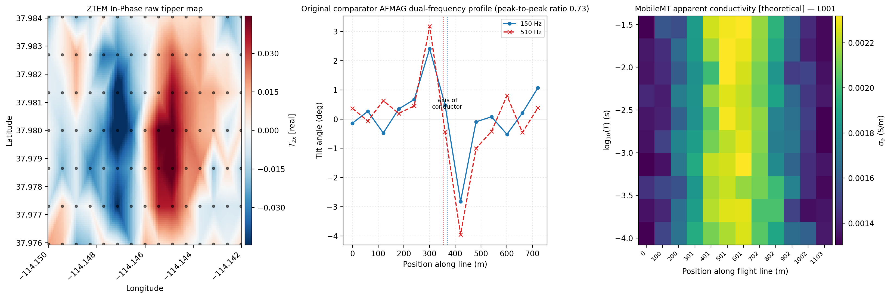

.. _user_guide_airborne_site:

The Airborne Site View
======================

:class:`~pycsamt.airborne.site.AirborneSite` and
:class:`~pycsamt.airborne.site.AirborneSites` give a flat,
``Sites``-shaped view over :class:`~pycsamt.airborne.AirborneEMLine`/
:class:`~pycsamt.airborne.AirborneEMDataset` records -- one wrapped
:class:`~pycsamt.airborne.AirborneEMRecord` per sample, read directly
from its :class:`~pycsamt.emtf.EMTF` document. Unlike
:class:`~pycsamt.site.base.Site`, whose numeric accessors all route
through a materialized EDI, an :class:`~pycsamt.airborne.site.AirborneSite`
has no EDI bridge and no impedance requirement, so it can hold a
tipper, an interstation transfer function, a scalar tilt reading, or
a MobileMT admittance tensor equally, and read whichever one its
``EMTF`` document actually carries. This page works entirely from the
four sample surveys committed under ``data/AFMAG/``, ``data/ZTEM/``,
and ``data/mobileMT/`` -- see :doc:`overview` for what each represents
-- rather than the small hand-built lines :doc:`data_model` constructs
from scratch.

Reading Sample Surveys
----------------------

:func:`~pycsamt.airborne.site.ensure_asites` is the single entry point
every airborne-aware ``emtools`` function coerces its input through,
and it reads a directory of EMTF-XML files directly into an
:class:`~pycsamt.airborne.site.AirborneSites`:

.. code-block:: pycon

   >>> from pycsamt.airborne.site import ensure_asites
   >>> ztem = ensure_asites("data/ZTEM/gold_springs_nv")
   >>> len(ztem), ztem.technologies
   (105, ('ztem',))
   >>> afmag_o = ensure_asites("data/AFMAG/abitibi_on")
   >>> len(afmag_o), afmag_o.technologies
   (13, ('afmag_original',))
   >>> afmag_a = ensure_asites("data/AFMAG/yulong_belt_cn")
   >>> len(afmag_a), afmag_a.technologies
   (11, ('afmag_airmt',))
   >>> mmt = ensure_asites("data/mobileMT/flammefjeld_greenland")
   >>> len(mmt), mmt.technologies
   (12, ('mobilemt',))

Four different directories, four different :term:`AFMAG`-family or
ZTEM/MobileMT deliveries, and the same one-line call reads all of
them. :attr:`~pycsamt.airborne.site.AirborneSites.technologies` is not
supplied by the caller anywhere above -- each
:class:`~pycsamt.airborne.site.AirborneSite` resolves its own
:attr:`~pycsamt.airborne.site.AirborneSite.technology` from the
underlying ``EMTF.subtype``, written by whichever ``build_*_line``
constructor produced the document in the first place (``ztem``,
``mobilemt``, ``afmag_original``, or ``afmag_airmt`` -- the two AFMAG
generations are kept as genuinely distinct labels, not folded into one
``"afmag"`` tag, since their response shapes below are not
interchangeable).

Four Response Families
----------------------

:meth:`~pycsamt.airborne.site.AirborneSite.has_component` checks
which of those response shapes a given site actually carries, without
having to inspect ``EMTF.subtype`` by hand:

.. code-block:: pycon

   >>> afmag_o_site = afmag_o[0]
   >>> afmag_a_site = afmag_a[4]
   >>> ztem_site = ztem.get("GO_L4_008")
   >>> mmt_site = mmt[0]
   >>> for s in (afmag_o_site, afmag_a_site, ztem_site, mmt_site):
   ...     print(
   ...         s.name, s.technology,
   ...         "tipper=", s.has_component("tipper"),
   ...         "interstation_tensor=", s.has_component("interstation_tensor"),
   ...         "afmag_tilt=", s.has_component("afmag_tilt"),
   ...         "admittance=", s.has_component("admittance"),
   ...     )
   AB_001 afmag_original tipper= False interstation_tensor= False afmag_tilt= True admittance= False
   YU_005 afmag_airmt tipper= False interstation_tensor= True afmag_tilt= False admittance= False
   GO_L4_008 ztem tipper= True interstation_tensor= False afmag_tilt= False admittance= False
   FL_001 mobilemt tipper= False interstation_tensor= False afmag_tilt= False admittance= True

Each site carries exactly one of the four -- a diagonal, not a
coincidence: ``AirborneSite`` never fabricates a component a
technology does not measure, so ``afmag_tilt_deg`` stays ``None`` on
a ZTEM site and ``tipper`` stays ``None`` on a MobileMT site, rather
than either silently returning zeros. Plotting all four against
frequency, on their own natural axes, makes the physical difference
concrete:

.. code-block:: pycon

   >>> import numpy as np
   >>> import matplotlib.pyplot as plt
   >>> def frobenius(arr):
   ...     axes = tuple(range(1, arr.ndim))
   ...     return np.sqrt(np.sum(np.abs(arr) ** 2, axis=axes))
   >>> fig, axes = plt.subplots(2, 2, figsize=(10.0, 7.2))
   >>> ax = axes[0, 0]
   >>> _ = ax.plot(afmag_o_site.freq, afmag_o_site.afmag_tilt_deg, "o", ms=8, color="C0")
   >>> _ = ax.axhline(0.0, color="0.6", lw=0.8)
   >>> _ = ax.set_title(f"afmag_original -- {afmag_o_site.name}")
   >>> _ = ax.set_xlabel("Frequency [Hz]"); _ = ax.set_ylabel("Tilt angle [deg]")
   >>> ax = axes[0, 1]
   >>> mag = frobenius(afmag_a_site.interstation_tensor)
   >>> _ = ax.semilogx(afmag_a_site.freq, mag, "o-", color="C1")
   >>> _ = ax.set_title(f"afmag_airmt -- {afmag_a_site.name}")
   >>> _ = ax.set_xlabel("Frequency [Hz]"); _ = ax.set_ylabel(r"$\|\mathbf{T}\|_F$ (interstation tensor)")
   >>> ax = axes[1, 0]
   >>> mag = frobenius(ztem_site.tipper)
   >>> _ = ax.plot(ztem_site.freq, mag, "o-", color="C2")
   >>> _ = ax.set_title(f"ztem -- {ztem_site.name}")
   >>> _ = ax.set_xlabel("Frequency [Hz]"); _ = ax.set_ylabel(r"$\|\mathbf{T}\|_F$ (tipper)")
   >>> ax = axes[1, 1]
   >>> mag = frobenius(mmt_site.admittance)
   >>> _ = ax.loglog(mmt_site.freq, mag, "o-", color="C3")
   >>> _ = ax.set_title(f"mobilemt -- {mmt_site.name}")
   >>> _ = ax.set_xlabel("Frequency [Hz]"); _ = ax.set_ylabel(r"$\|\mathbf{Y}\|_F$ (admittance)")
   >>> fig.tight_layout()
   >>> fig.savefig("user-guide-airborne-site-01.png", dpi=200, bbox_inches="tight")

   The four response families read from one common container, each on
   its own natural axis.

The historical comparator (top left) samples only two audio-frequency
bands, ``150`` and ``510`` Hz, and reports a signed tilt in degrees
-- station ``AB_001`` reads slightly negative at ``150`` Hz and
positive at ``510`` Hz, a genuine sign reversal between bands rather
than measurement noise, since the comparator has no
polarization-ellipse decomposition to average over. AirMt's
interstation tensor (top right) and ZTEM's tipper (bottom left) are
both plotted as a per-frequency Frobenius norm across every
component, since neither reduces naturally to one scalar component
the way the comparator's tilt does; MobileMT's admittance
(bottom right) is shown on log-log axes because it falls off by more
than an order of magnitude across its ten-decade frequency range,
:math:`H = Y E` weakening steadily as frequency rises exactly as
:ref:`airborne_theory` derives for a fixed source-receiver geometry.

Selecting And Grouping
----------------------

:class:`~pycsamt.airborne.site.AirborneSites` indexes by position or
by case-insensitive name, and :meth:`~pycsamt.airborne.site.AirborneSites.select`
filters by an explicit name list or a predicate:

.. code-block:: pycon

   >>> ztem[0]
   AirborneSite(name='GO_L1_001', technology='ztem', nfreq=6, coords=(37.98404,-114.15000,1750.0))
   >>> ztem["GO_L1_001"] is ztem.get("GO_L1_001")
   True
   >>> line4 = ztem.select(predicate=lambda s: s.name.split("_")[1] == "L4")
   >>> len(line4), line4[0].name, line4[-1].name
   (15, 'GO_L4_001', 'GO_L4_015')

``gold_springs_nv``'s station names encode a flight-line label
directly (``GO_L<n>_<seq>``), so grouping by line here is a one-line
predicate over :attr:`~pycsamt.airborne.site.AirborneSite.name`.
:attr:`~pycsamt.airborne.site.AirborneSites.line_ids` is *not* an
alternative way to reach the same grouping, though:

.. code-block:: pycon

   >>> ztem.line_ids
   ()

Reading straight from a directory via
:meth:`~pycsamt.airborne.site.AirborneSites.from_xml_dir` (what
``ensure_asites`` does above) constructs every site with
``line_id=None`` -- the file itself carries no flight-line identifier,
only the station name does by convention. ``line_id`` is populated
only when sites are built from an already-assembled
:class:`~pycsamt.airborne.AirborneEMLine`, via
:meth:`~pycsamt.airborne.site.AirborneSites.from_line`:

.. code-block:: pycon

   >>> from pycsamt.airborne import NavigationTrack
   >>> from pycsamt.airborne.ztem import build_ztem_line, ZTEMSystemSpec
   >>> from pycsamt.airborne.site import AirborneSites
   >>> nav = NavigationTrack(
   ...     sample_ids=("S00", "S01"),
   ...     easting=np.array([0.0, 50.0]),
   ...     northing=np.array([0.0, 0.0]),
   ... )
   >>> tip = np.zeros((2, 1, 2), dtype=complex)
   >>> tip[:, 0, 0] = [0.01 + 0.002j, 0.015 + 0.001j]
   >>> tip[:, 0, 1] = [0.003 - 0.001j, 0.004 - 0.0005j]
   >>> line = build_ztem_line(
   ...     "DEMO", nav, tip, frequency=np.array([90.0]),
   ...     system_spec=ZTEMSystemSpec(),
   ... )
   >>> AirborneSites.from_line(line).line_ids
   ('DEMO',)

The distinction matters because ``ensure_asites`` is the entry point
every airborne ``emtools`` function actually receives -- so any code
that groups stations by ``line_id`` rather than through the document's
own metadata will silently see nothing on data read from a directory.
:ref:`emtools_ztem` avoids exactly this trap by reading the flight-line
label back out of ``EMTF.metadata["notes"]["ZTEM"]["LineId"]`` instead
of relying on ``line_id``; the station-name predicate used above is a
second, equally valid way to reach the same grouping when the survey's
naming convention already encodes it.

:meth:`~pycsamt.airborne.site.AirborneSites.closest` finds the nearest
site to a target coordinate by great-circle distance, with an optional
distance cutoff:

.. code-block:: pycon

   >>> nearest = ztem.closest(37.979, -114.1455)
   >>> nearest.name
   'GO_L5_009'
   >>> ztem.closest(37.979, -114.1455, tol=60.0).name
   'GO_L5_009'
   >>> ztem.closest(37.979, -114.1455, tol=30.0) is None
   True

``GO_L5_009`` sits about 39 m from the target coordinate -- inside a
60 m tolerance, outside a 30 m one, so the same query returns the
station or ``None`` depending on how far away "close enough" is
allowed to be.

.. note::

   ``AirborneSites`` deliberately does not mirror every
   ``Sites`` bulk-editing method. There is no ``edit_all``,
   ``with_topography``, or ``to_profile`` here -- those are real
   ``Sites`` features this module does not yet need for the
   ``emtools`` integration it exists to unblock, left out rather than
   stubbed with placeholder behaviour.

One Container, Three Diagnostics
--------------------------------

The point of reading every technology through the same
:class:`~pycsamt.airborne.site.AirborneSites` container is not just
tidy code -- it is that the container needs no conversion to reach
each technology's own, literature-derived diagnostic. ``ztem``,
``afmag_o``, and ``mmt`` above are handed directly to
:func:`~pycsamt.emtools.ztem.plot_ztem_map`,
:func:`~pycsamt.emtools.afmag.plot_original_afmag_dual_frequency_profile`,
and :func:`~pycsamt.emtools.mobilemt.plot_mobilemt_conductivity_psection`
-- each built around a specific literature source (Legault et al.
2012's map-view grid, Ward (1959) Fig. 16's dual-frequency profile,
and the theoretical admittance-to-conductivity relationship Prikhodko
et al. (2022) describe for MobileMT), none of which take anything
other than an ``AirborneSites``-like object as their first argument:

.. code-block:: pycon

   >>> from pycsamt.emtools.ztem import plot_ztem_map
   >>> from pycsamt.emtools.afmag import plot_original_afmag_dual_frequency_profile
   >>> from pycsamt.emtools.mobilemt import plot_mobilemt_conductivity_psection
   >>> fig, (ax1, ax2, ax3) = plt.subplots(1, 3, figsize=(16.5, 5.6))
   >>> _ = plot_ztem_map(ztem, ax=ax1)
   >>> _ = plot_original_afmag_dual_frequency_profile(afmag_o, ax=ax2)
   >>> _ = plot_mobilemt_conductivity_psection(mmt, ax=ax3)
   >>> for ax in (ax1, ax2, ax3):
   ...     ax.title.set_fontsize(10)
   >>> fig.tight_layout(w_pad=2.5)
   >>> fig.savefig("user-guide-airborne-site-02.png", dpi=200, bbox_inches="tight")

   Three technologies, three EMTF-XML directories, three real
   diagnostics -- none of them written for this page.

Each panel is genuinely reading its own physics. The ZTEM map (left)
grids the in-phase :math:`T_{zx}` across all seven ``gold_springs_nv``
lines and finds the same synthetic conductor this page's earlier
figures already touched: a blue-to-red crossover striking
north-south, strongest through the survey's centre where the target's
along-strike amplitude peaks. The AFMAG profile (middle) reproduces
Ward's own reading of a comparator survey -- both frequencies swing
through zero together near station distance ``360`` m, "the axis of
conductor" the annotation marks, and their differing peak-to-peak
amplitudes (the panel's title reports the ratio) are exactly the
frequency-dependence Ward used to argue for a real conductor rather
than topographic noise. The MobileMT pseudosection (right) images
theoretical apparent conductivity against period and along-line
position: the brighter band sitting under roughly ``400``-``700`` m is
the same kind of central-line response the ZTEM map shows spatially,
here resolved with period as a rough proxy for depth instead of a
second horizontal axis. Interpreting any one of these three panels in
depth is exactly what :ref:`emtools_ztem`, :ref:`emtools_afmag`, and
:ref:`emtools_mobilemt` are for; this page's point is narrower --
every panel above started from nothing more than a directory path and
:func:`~pycsamt.airborne.site.ensure_asites`.

Exporting And Round-Tripping
----------------------------

:meth:`~pycsamt.airborne.site.AirborneSite.to_dataframe` exports one
site's data to a tidy, frequency-indexed table:

.. code-block:: pycon

   >>> ztem_site.to_dataframe(kind="tipper").round(4)
                      Tx              Ty
   f
   30.0  -0.0012-0.0038j -0.0004-0.0052j
   45.0  -0.0041+0.0059j -0.0084+0.0078j
   90.0   0.0145-0.0024j -0.0079-0.0087j
   180.0  0.0075+0.0116j  0.0091-0.0018j
   360.0 -0.0070-0.0078j -0.0046-0.0088j
   720.0  0.0092-0.0163j  0.0052-0.0045j

and :meth:`~pycsamt.airborne.site.AirborneSites.write_xml` writes an
entire collection back out, one EMTF-XML file per site, which
:meth:`~pycsamt.airborne.site.AirborneSites.from_xml_dir` can read
straight back in -- a genuine round trip through the file format, not
just an in-memory copy:

.. code-block:: pycon

   >>> import tempfile
   >>> with tempfile.TemporaryDirectory() as tmp:
   ...     paths = afmag_a.write_xml(tmp)
   ...     reread = AirborneSites.from_xml_dir(tmp)
   ...     orig = afmag_a.get("YU_005")
   ...     back = reread.get("YU_005")
   ...     tensors_match = np.allclose(orig.interstation_tensor, back.interstation_tensor)
   ...     freqs_match = np.allclose(orig.freq, back.freq)
   >>> len(paths), len(reread)
   (11, 11)
   >>> tensors_match, freqs_match
   (True, True)

The interstation tensor and frequency grid both survive the
write-then-read cycle exactly, confirming that
:meth:`~pycsamt.airborne.site.AirborneSite.to_xml` -- called once per
site under ``write_xml`` -- serializes the full ``(n_f, 3, 2)`` array
rather than truncating it to the ``(n_f, 1, 2)`` shape a tipper-only
document would need.
