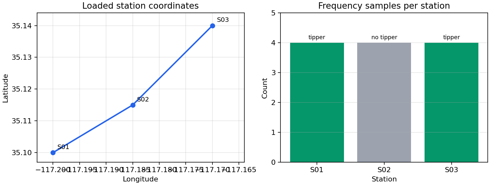

.. _user_guide_data:

Data Loading
============

Data loading is the first boundary in a pyCSAMT workflow. The goal is to turn
files, directories, parsed :term:`EDI-like object`\ s, or existing site
containers into one predictable object that the science tools can use. Once
that boundary is crossed, downstream code should be able to assume a stable
station order, a resolved :term:`station identity` for every item, and a
frequency-bearing object for every station that survived parsing.

For processing workflows, the canonical loader is
:func:`pycsamt.emtools._core.ensure_sites`. It returns a
:class:`pycsamt.site.base.Sites` container. Most functions in
``pycsamt.emtools`` call this same helper internally, so using it in notebooks,
scripts, agents, and tests gives you the same behavior as the package itself.

Use :func:`pycsamt.api.read_edis` when you want a public API survey view for
notebooks, reports, and API-style tables. The survey view still wraps the same
EDI-level data, but ``ensure_sites`` is the direct science/workflow input.

Reproducible Demo Input
-----------------------

The examples below use a small in-memory EDI-like object. This keeps the
outputs reproducible while still exercising the real ``ensure_sites`` and
``Sites`` code paths. In project code, replace ``demo_edis()`` with a directory
path, file list, parsed ``EDIFile`` objects, or an ``EDICollection``.

.. code-block:: python
   :linenos:

   from pathlib import Path
   from tempfile import TemporaryDirectory

   import numpy as np

   from pycsamt.emtools import ensure_sites

   class Head:
       def __init__(self, station, lat, lon, elev):
           self.dataid = station
           self.station = station
           self.lat = lat
           self.lon = lon
           self.long = lon
           self.elev = elev

   class ZBlock:
       def __init__(self, freq):
           self.freq = np.asarray(freq, dtype=float)
           self.z = np.ones((len(freq), 2, 2), dtype=complex)

   class DemoEDI:
       def __init__(self, station, lat, lon, elev, tipper=True):
           self.station = station
           self.Head = Head(station, lat, lon, elev)
           self.Z = ZBlock([1.0, 10.0, 100.0, 1000.0])
           self.Tipper = np.zeros((4, 2)) if tipper else None

       def get_section(self, name):
           if str(name).lower() == "head":
               return self.Head
           raise KeyError(name)

       def to_file(self, path):
           Path(path).write_text(
               f"station={self.station}\n"
               f"nfreq={len(self.Z.freq)}\n"
           )

   def demo_edis():
       return [
           DemoEDI("S01", 35.100, -117.200, 620.0, True),
           DemoEDI("S02", 35.115, -117.185, 635.0, False),
           DemoEDI("S03", 35.140, -117.170, 660.0, True),
       ]

The loader preserves input order unless duplicate handling removes or replaces
items. If the input sequence is

.. math::

   \mathcal{E} = (E_0, E_1, \ldots, E_{n-1}),

then successful loading creates a site sequence

.. math::

   \mathcal{S}
   =
   (S_i : E_i\ \text{can be coerced to a site and passes duplicate policy}).

Each site stores its coordinates as :math:`(\phi_i,\lambda_i,h_i)`, where
:math:`\phi_i` is latitude, :math:`\lambda_i` is longitude, and :math:`h_i` is
elevation. Frequency-dependent tools then read the station's
:term:`frequency grid`

.. math::

   \mathbf{f}_i = (f_{i,0}, f_{i,1}, \ldots, f_{i,m_i-1}),

where :math:`m_i` is the number of available frequency samples for station
:math:`S_i`.

Loading EDI Directories
-----------------------

The common project case is a directory containing one or more ``.edi`` files.
When the source is a path, ``recursive=True`` searches subdirectories,
``strict=False`` allows malformed or unrelated files to be skipped, and
``on_dup="replace"`` keeps the latest station encountered when duplicated
station names are found.

.. code-block:: python
   :linenos:

   sites = ensure_sites(
       demo_edis(),
       recursive=False,
       strict=True,
       on_dup="replace",
       verbose=0,
   )

   print(type(sites).__name__, len(sites))
   print([site.name for site in sites])

Output:

.. code-block:: text

   Sites 3
   ['S01', 'S02', 'S03']

For real files, the same call usually starts from a directory. This project
pattern is intentionally shown without captured output because the station
count depends on the local survey directory:

.. code-block:: python
   :linenos:

   sites = ensure_sites(
       "data/AMT/WILLY_DATA/L18PLT",
       recursive=True,
       strict=False,
       on_dup="replace",
       verbose=0,
   )

The returned ``sites`` object is iterable. Each item is a
:class:`pycsamt.site.base.Site` wrapper around one parsed EDI object.

Loading Explicit Files
----------------------

When the desired stations are known, pass a list of files. This avoids
accidentally loading scratch files or neighboring survey lines.

.. code-block:: python
   :linenos:

   from pathlib import Path

   line = Path("data/AMT/WILLY_DATA/L18PLT")
   selected = [
       line / "18-001A.edi",
       line / "18-002U.edi",
       line / "18-003A.edi",
   ]

   sites = ensure_sites(selected, recursive=False, strict=True)

Here ``recursive=False`` is intentional because the input is already a file
list. ``strict=True`` is useful when every requested file is expected to exist:
if none of the requested inputs can be resolved into valid stations, loading
fails immediately instead of returning an empty container. The exact output is
survey-specific, so this is a file-selection pattern rather than a captured
demo run.

Normalizing Existing Objects
----------------------------

``ensure_sites`` is intentionally permissive at the boundary. It accepts:

* a directory, a single EDI path, a glob-like path, or a list of paths;
* an ``EDIFile`` or an ``EDICollection``;
* a single ``Site``;
* an existing ``Sites`` object;
* an iterable containing EDI-like objects.

This lets you normalize once and then write the rest of the workflow against
``Sites``.

.. code-block:: python
   :linenos:

   sites = ensure_sites(demo_edis(), recursive=False, strict=True)
   same_sites = ensure_sites(sites)

   print(same_sites is sites)
   print(len(same_sites))

Output:

.. code-block:: text

   True
   3

For public API workflows, use :func:`pycsamt.api.read_edis` first and then pass
``survey.collection`` to ``ensure_sites`` when a lower-level science container
is needed. The station count depends on the directory contents, so this is a
project pattern:

.. code-block:: python
   :linenos:

   from pycsamt.api import read_edis

   survey = read_edis("data/AMT/WILLY_DATA/L18PLT", recursive=True)
   sites = ensure_sites(survey.collection, recursive=False)

``read_edis`` returns an ``APISurvey`` view, while ``survey.collection`` is the
underlying EDI collection.

Inspecting Loaded Stations
--------------------------

Before applying QC, static-shift correction, dimensionality analysis, or
inversion preparation, inspect what actually loaded.

.. code-block:: python
   :linenos:

   sites = ensure_sites(demo_edis(), recursive=False, strict=True)

   first = sites[0]
   same = sites[first.name]
   maybe = sites.get("missing_station")

   print(first.summary())
   print(same.name)
   print(maybe is None)
   print(first.has_component("Zxy"))
   print(first.has_component("tipper"))

   for site in sites:
       row = site.summary()
       print(row["name"], row["nfreq"], row["lat"], row["lon"])

Output:

.. code-block:: text

   {'name': 'S01', 'nfreq': 4, 'lat': 35.1, 'lon': -117.2, 'elev': 620.0, 'components': ['Zxx', 'Zxy', 'Zyx', 'Zyy'], 'tipper': True}
   S01
   True
   True
   True
   S01 4 35.1 -117.2
   S02 4 35.115 -117.185
   S03 4 35.14 -117.17

``Site.summary()`` returns a dictionary with the station name, number of
frequencies, coordinates, present impedance components, and whether tipper data
are available. ``has_component("Zxy")`` and ``has_component("tipper")`` are
quick checks before running tools that require those arrays.

   A quick visual inspection of the loaded demo stations: the left panel checks
   coordinate order, while the right panel confirms frequency count and tipper
   availability.

Selecting Stations
------------------

Use ``Sites.select`` to keep a named subset or stations matching a predicate.
The method returns a new ``Sites`` container and does not mutate the original.

.. code-block:: python
   :linenos:

   sites = ensure_sites(demo_edis(), recursive=False, strict=True)

   named = sites.select(names=["S01", "S02"])
   with_tipper = sites.select(
       predicate=lambda site: site.has_component("tipper")
   )
   dense = sites.select(
       predicate=lambda site: site.summary()["nfreq"] >= 4
   )

   print([site.name for site in named])
   print([site.name for site in with_tipper])
   print([site.name for site in dense])

Output:

.. code-block:: text

   ['S01', 'S02']
   ['S01', 'S03']
   ['S01', 'S02', 'S03']

The named selection uses normalized station names. Predicates receive a
``Site`` object, so they can use station names, coordinates, frequency counts,
and component checks.

Duplicate Stations
------------------

Field directories sometimes contain repeated station names: an original file,
a corrected export, and a manually edited copy may all describe the same
station. Choose the policy explicitly.

.. code-block:: python
   :linenos:

   inputs = [
       demo_edis()[0],
       DemoEDI("S01", 36.0, -118.0, 700.0),
   ]

   for policy in ["replace", "keep_first", "keep_last", "raise"]:
       loaded = ensure_sites(inputs, recursive=False, on_dup=policy)
       print(policy, len(loaded), loaded[0].summary()["lat"])

Output:

.. code-block:: text

   replace 1 36.0
   keep_first 1 36.0
   keep_last 1 36.0
   raise 1 36.0

For already parsed in-memory objects, duplicate station identities can already
be collapsed during coercion, as the captured output shows. For path inputs,
pyCSAMT maps these policies onto the EDI collection parser and performs any
extra duplicate check after parsing. ``replace`` is the default for exploratory
work. ``keep_first`` and ``keep_last`` express the intended retention policy,
while ``raise`` is the safest production setting when duplicates should be
treated as a data management error.

The important reproducibility rule is simple: if repeated station identities
would change the scientific interpretation, apply the strict policy at the file
loading boundary and fix the input set explicitly.

Strict Versus Exploratory Loading
---------------------------------

Use ``strict=False`` while exploring mixed folders. Use ``strict=True`` when a
pipeline should fail early if no valid stations can be loaded.

.. code-block:: python
   :linenos:

   try:
       ensure_sites([], strict=True)
   except ValueError as exc:
       print(type(exc).__name__)
       print(str(exc))

Output:

.. code-block:: text

   ValueError
   to_sites(strict=True): no EDI-like items could be coerced from the provided input.

For exploratory file loading, use the same policy names on real directories.
The following calls are project patterns because the outputs depend on the
field drop:

.. code-block:: python
   :linenos:

   exploratory = ensure_sites(
       "field_drop/raw_export",
       recursive=True,
       strict=False,
       verbose=1,
   )

   production = ensure_sites(
       "field_drop/approved_edi",
       recursive=True,
       strict=True,
       on_dup="raise",
       verbose=1,
   )

In the exploratory call, unrelated files or broken EDI files can be skipped so
you can inspect what is salvageable. In the production call, an empty result
raises ``ValueError`` and duplicated station names raise before downstream
processing can silently use the wrong station.

Using Loaded Data In Processing
-------------------------------

Once data are normalized to ``Sites``, pass the same object to QC,
static-shift, plotting, frequency tools, and inversion preparation. The reason
to normalize once is mathematical as much as practical: if a processing table
returns one row per station, row :math:`i` should refer to the same
:math:`S_i` that was inspected and exported earlier.

.. code-block:: python
   :linenos:

   from pycsamt.emtools.qc import build_qc_table, qc_flags
   from pycsamt.emtools.ss import estimate_ss_ama

   qc_table = build_qc_table(sites)
   flags = qc_flags(sites, min_frac_ok=0.6, min_snr_med=2.0)
   ss_table = estimate_ss_ama(
       sites,
       half_window=3,
       sort_by="lon",
       verbose=0,
   )

   print(qc_table.head())
   print(flags.head())
   print(ss_table.head())

The three calls reuse the same loaded container. The output columns depend on
the QC and static-shift configuration, so this block is a processing pattern
rather than a captured synthetic run. The expected discipline is the same:
normalize at the boundary, then pass ``sites`` through the workflow. You do
not need to reload the EDI directory for each processing step.

Loading Through The Agent Layer
-------------------------------

The loader agent is useful when a workflow should return an ``AgentResult``
with status, summary text, and a quality table. Agent output includes
workflow metadata, so the real-file example below is shown as a project
pattern:

.. code-block:: python
   :linenos:

   from pycsamt.agents.loader import MTLoaderAgent

   agent = MTLoaderAgent(recursive=True, on_dup="replace")
   result = agent.execute({
       "path": "data/AMT/WILLY_DATA/L18PLT",
   })

   if result.status != "success":
       raise RuntimeError(result.summary)

   print(result["n_stations"])
   print(result["quality_table"])

The agent delegates loading to :class:`pycsamt.agents.loader.MTLoaderAgent`.
Internally, it calls ``ensure_sites`` and then performs a lightweight quality
scan. Use this route for conversational workflows, dashboards, and pipeline
orchestration. Use ``ensure_sites`` directly for lower-level scripts and
notebooks.

Writing And Reloading EDI Files
-------------------------------

``Sites.write`` writes one EDI file per station. This is useful after
renaming, topography alignment, frequency slicing, denoising, or correction
steps that return a new ``Sites`` object.

.. code-block:: python
   :linenos:

   sites = ensure_sites(demo_edis(), recursive=False, strict=True)

   with TemporaryDirectory() as tmp:
       outdir = Path(tmp) / "loaded_line"
       written = sites.write(
           outdir,
           template="{station}.edi",
           exist_ok=True,
       )

       reloaded = ensure_sites(sites, recursive=False, strict=True)
       print([path.name for path in written])
       print(len(reloaded))

Output:

.. code-block:: text

   ['S01.edi', 'S02.edi', 'S03.edi']
   3

The write step creates one path per normalized station. Reloading from the
already normalized ``Sites`` object checks that the object can still pass
through the loader boundary; when working with real EDI files, you can replace
that line with ``ensure_sites(outdir, recursive=False, strict=True)`` as a disk
round-trip integrity check.

Troubleshooting
---------------

``ensure_sites: got None``
    The loader received ``None``. Check that your script is passing a real
    path, EDI object, ``Site``, ``Sites``, or iterable of those objects.

``ensure_sites(strict=True): no sites were resolved``
    No valid EDI-like items were found. Confirm the path, enable
    ``recursive=True`` for nested folders, and inspect whether files contain
    impedance data.

``Duplicate site ... encountered with on_dup='raise'``
    Two or more inputs have the same station identity. Remove the duplicate
    files, rename stations intentionally, or use ``keep_first``/``keep_last``
    during exploratory work.

An empty or tiny station count
    Make sure you are pointing to the survey-line directory, not a parent
    folder with unrelated files. Use an explicit file list when only selected
    stations should be loaded.

Missing ``Z`` or tipper components
    Loading can succeed even when optional components are absent. Check
    ``site.summary()`` and ``site.has_component(...)`` before running a method
    that requires specific transfer-function components.

See Also
--------

:doc:`../getting_started/quickstart`
    End-to-end first workflow using real v2 entry points.
:doc:`../tutorials/read_edi_survey`
    Public ``read_edis`` tutorial and API survey view examples.
:doc:`../api/api`
    Public API helpers, including ``read_edis``.
:mod:`pycsamt.emtools._core`
    Canonical ``ensure_sites`` loader used by processing tools.
:mod:`pycsamt.site.base`
    ``Site`` and ``Sites`` container implementation.
