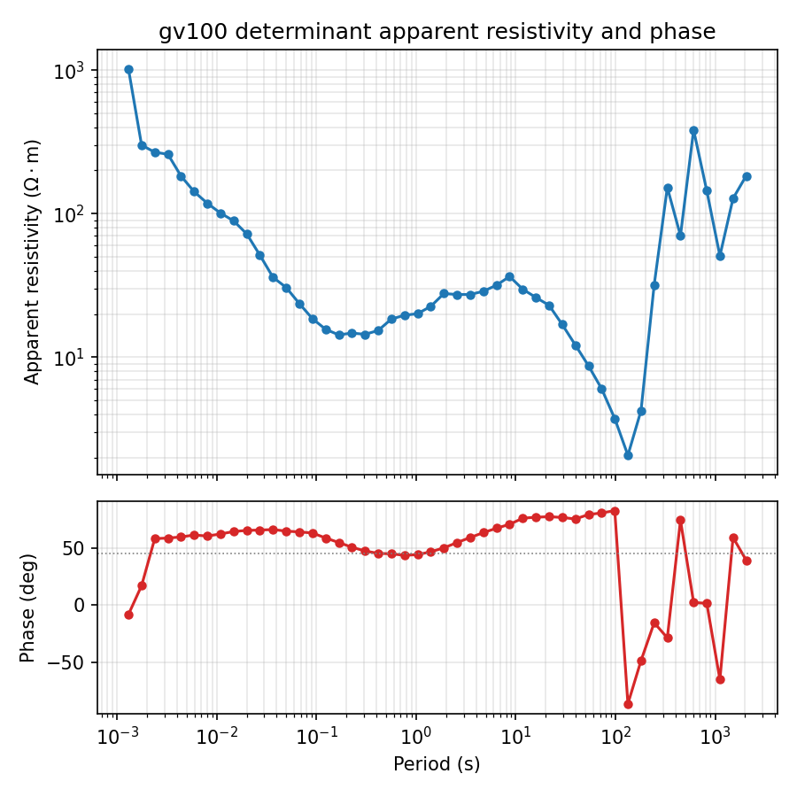

.. _user_guide_emtf_document:

The EMTF Document
=================

.. currentmodule:: pycsamt.emtf

:class:`EMTF` is the document-level container for one station's
transfer functions: one or more named
:class:`~pycsamt.emtf.transfer.TransferFunction` objects (impedance,
tipper, and anything else registered in the datatype registry) plus
the format-neutral metadata that describes them --
:attr:`~document.EMTF.site`, :attr:`~document.EMTF.provenance`,
:attr:`~document.EMTF.copyright`, :attr:`~document.EMTF.site_layout`,
:attr:`~document.EMTF.orientation`, :attr:`~document.EMTF.processing`,
:attr:`~document.EMTF.quality` -- all covered in :doc:`../metadata/index`
rather than redefined here. Every public class used on this page
(``EMTF``, ``TransferFunction``, ``get_emtf_datatype``) imports
directly from the top-level package: ``from pycsamt.emtf import EMTF,
TransferFunction, get_emtf_datatype``. There is no need to reach into
:mod:`pycsamt.emtf.document` or :mod:`pycsamt.emtf.transfer` directly
in ordinary code -- those module paths are used here only inside
``:class:`` cross-references, for Sphinx's benefit, not because the
import path is different in practice.

Loading a Real Document
-----------------------

The two real stations already used throughout :doc:`../metadata/index`
-- the WILLY L18 EDI line and the Gabbs Valley USGS station gv100
(public-domain USGS data, https://doi.org/10.5066/P9GZ9Z56) -- load
into an :class:`EMTF` the same way regardless of which real-world
processing chain produced the source file:

.. code-block:: pycon

   >>> from pathlib import Path
   >>> from pycsamt.emtf import EMTF

   >>> tf_willy = EMTF.from_edi(Path("data/AMT/WILLY_DATA/L18PLT/18-001A.edi"))
   >>> print(sorted(tf_willy.transfer_functions.keys()))
   ['impedance']

   >>> tf_gv = EMTF.from_edi(Path("data/gv_data/gv_final_edi/gv100.edi"))
   >>> print(sorted(tf_gv.transfer_functions.keys()))
   ['impedance', 'tipper']
   >>> print(tf_gv.tags)
   ('impedance', 'tipper')

WILLY genuinely has no tipper block at all -- the source EDI's
``TIP`` section is absent, not empty -- so ``tf_willy`` correctly
attaches only an ``"impedance"`` transfer function.
:attr:`~document.EMTF.tags` tracks every transfer-function key
attached so far and is automatically kept in sync by
:meth:`~document.EMTF.add_transfer_function`.

Retrieving a Transfer Function by Name or Alias
-----------------------------------------------

:meth:`~document.EMTF.get_transfer_function` resolves either the
document's internal key or any alias/short code registered for that
datatype -- ``"Z"`` and ``"impedance"`` both reach the same object,
because the EMTF datatype registry (covered in full in
:doc:`transfer_functions`) defines ``"Z"`` as impedance's short code:

.. code-block:: pycon

   >>> from pycsamt.emtf import get_emtf_datatype

   >>> print(get_emtf_datatype("impedance").tag)
   impedance

   >>> imp = tf_gv.get_transfer_function("impedance")
   >>> imp_alias = tf_gv.get_transfer_function("Z")
   >>> print(imp is imp_alias)
   True
   >>> print(imp.data.shape, imp.input_channels, imp.output_channels)
   (48, 2, 2) ('Hx', 'Hy') ('Ex', 'Ey')

   >>> tip = tf_gv.get_transfer_function("T")
   >>> print(tip.data.shape, tip.input_channels, tip.output_channels)
   (48, 1, 2) ('Hx', 'Hy') ('Hz',)

   >>> print(tf_gv.get_transfer_function("does-not-exist"))
   None

A name that matches nothing returns ``None`` rather than raising --
useful for an optional-tipper check like ``if doc.get_transfer_function("T"):
...`` without a ``try``/``except``.

Building a Document From Scratch
--------------------------------

Constructing :class:`TransferFunction` and :class:`EMTF` objects
directly -- rather than loading them from a file -- shows the
document's own consistency rules directly, without an EDI adapter's
extra layer in between:

.. code-block:: pycon

   >>> import numpy as np
   >>> from pycsamt.emtf import TransferFunction

   >>> periods1 = np.array([1.0, 10.0, 100.0])
   >>> z = np.ones((3, 2, 2), dtype=complex)
   >>> tf1 = TransferFunction(
   ...     name="impedance", data=z,
   ...     input_channels=("Hx", "Hy"), output_channels=("Ex", "Ey"),
   ...     periods=periods1,
   ... )
   >>> doc = EMTF()
   >>> doc.add_transfer_function(tf1)
   EMTF(product_id=None, description=None, subtype=None, tags=tuple(['impedance']), periods=ndarray(shape=(3,), dtype=float64), transfer_functions=dict(len=1, keys=[impedance]), provenance=None, copyright=None, site=None, site_layout=None, orientation=None, processing=None, quality=None, field_notes=dict(len=0, keys=[]), station=None, station_id=None, lat=None, lon=None, elev=None, azimuth=None, metadata=dict(len=0, keys=[]), attrs=dict(len=0, keys=[]))

:meth:`~document.EMTF.add_transfer_function` returns ``self``, so
calling it bare in a REPL -- as above -- echoes the *entire* document
repr, not just a confirmation. That is deliberate: it makes the call
chainable (``EMTF().add_transfer_function(tf1).add_transfer_function(tf2)``),
but it also means a script that calls it for a side effect only should
not leave the call bare at module level, or the interpreter will
print the whole document. The repr above is also a convenient map of
every field this page and :doc:`../metadata/index` cover, all in one
place.

A second transfer function must share the document's period grid once
one is already set:

.. code-block:: pycon

   >>> periods2 = np.array([1.0, 10.0, 200.0])
   >>> t = np.ones((3, 1, 2), dtype=complex)
   >>> tf2 = TransferFunction(
   ...     name="tipper", data=t,
   ...     input_channels=("Hx", "Hy"), output_channels=("Hz",),
   ...     periods=periods2,
   ... )
   >>> try:
   ...     doc.add_transfer_function(tf2)
   ... except ValueError as exc:
   ...     print(type(exc).__name__, exc)
   ValueError period grid for 'tipper' differs from EMTF document

   >>> try:
   ...     doc.add_transfer_function(tf1)
   ... except ValueError as exc:
   ...     print(type(exc).__name__, exc)
   ValueError transfer function already exists: impedance

   >>> _ = doc.add_transfer_function(tf1, replace=True)

``tf2``'s last period, 200 s instead of 100 s, is enough to reject it
-- periods are compared with a tight numerical tolerance, not just
counted. Re-attaching ``tf1`` under its own name fails the same way a
duplicate dictionary key would; ``replace=True`` is required to
intentionally overwrite an existing entry, so a typo cannot silently
discard an already-attached transfer function.

Convenience Accessors and Units
-------------------------------

:attr:`~document.EMTF.z`, :attr:`~document.EMTF.tipper`,
:attr:`~document.EMTF.impedance`, and :attr:`~document.EMTF.tipper_tf`
read straight through to the matching
:class:`~pycsamt.emtf.transfer.TransferFunction`'s ``.data``. What
they do **not** do is convert units -- a real EDI-derived impedance
stays in the file's native unit until something explicitly converts
it:

.. code-block:: pycon

   >>> print(imp.units)
   [mV/km]/[nT]
   >>> print(imp.data[0])
   [[ -86.57589 -714.197j 1090.806  +2750.944j]
    [-115.5849 +1316.743j -683.7422 -5020.612j]]

Passing that array straight into an SI-based formula --
:meth:`~pycsamt.core.base.MTBase.rho_phase_from_z`,
:meth:`~pycsamt.core.base.MTBase.skin_depth`, or any other
:class:`~pycsamt.core.base.MTBase` method inherited by
``TransferFunction`` -- silently produces nonsense: apparent
resistivities in the hundreds of millions of ohm-metres for a real,
unremarkable MT station. The fix is
:meth:`~pycsamt.core.base.MTBase.z_mvk_nt_to_ohms`, which converts the
EDI-native ``[mV/km]/[nT]`` convention to SI ohms:

.. code-block:: pycon

   >>> z_si = imp.z_mvk_nt_to_ohms(imp.data)
   >>> print(z_si[0])
   [[-0.10879447-0.89748642j  1.37074725+3.45693818j]
    [-0.14524827+1.65466805j -0.85921579-6.30908711j]]

:attr:`~document.EMTF.z_err` follows the same "nothing is fabricated"
rule seen throughout :doc:`../metadata/index`, applied to
uncertainty instead of metadata:

.. code-block:: pycon

   >>> print(tf_gv.z_err)
   None
   >>> var_est = imp.get_estimate("variance")
   >>> print(var_est.name)
   VAR
   >>> print(np.sqrt(var_est.data)[0])
   [[ 98.57316572 237.08819034]
    [249.77736086 600.78698388]]

The real gv100 file has a ``VAR`` (variance) estimate attached to its
impedance, but no ``STD`` (standard-error) estimate --
:attr:`~document.EMTF.z_err` looks specifically for the latter and
returns ``None`` rather than silently deriving one by taking the
square root of the variance on the caller's behalf. That derivation
is one line of NumPy when it is actually wanted, as above, but pycsamt
will not perform it implicitly: a caller who only checked ``z_err is
not None`` should not be misled into thinking the file carries no
uncertainty information at all.

A Real Sounding Curve
---------------------

The two accessors above are enough to turn ``tf_gv`` into a
recognizable magnetotelluric sounding curve, using the same
:meth:`~pycsamt.core.base.MTBase.rho_phase_from_det` determinant
apparent-resistivity/phase method used elsewhere in pycsamt:

.. code-block:: python

   import matplotlib.pyplot as plt

   z_si = imp.z_mvk_nt_to_ohms(imp.data)
   rho_det, phase_det = imp.rho_phase_from_det(z_si, imp.frequency)
   periods = imp.periods

   fig, (ax_rho, ax_phase) = plt.subplots(
       2, 1, figsize=(6, 6), sharex=True,
       gridspec_kw={"height_ratios": [2, 1]},
   )
   ax_rho.loglog(periods, rho_det, "o-", color="#1f77b4", ms=4)
   ax_rho.set_ylabel(r"Apparent resistivity ($\Omega\cdot$m)")
   ax_rho.set_title("gv100 determinant apparent resistivity and phase")
   ax_rho.grid(True, which="both", alpha=0.3)

   ax_phase.semilogx(periods, phase_det, "o-", color="#d62728", ms=4)
   ax_phase.set_ylabel("Phase (deg)")
   ax_phase.set_xlabel("Period (s)")
   ax_phase.axhline(45, color="grey", lw=0.8, ls=":")
   ax_phase.grid(True, which="both", alpha=0.3)
   fig.tight_layout()

   gv100's real determinant sounding curve: resistivity falls from
   about 1000 Ω·m at the shortest periods to roughly 15 Ω·m around
   0.2-1 s, then rises again toward greater depth before both curves
   turn erratic beyond about 100 s.

The short-to-intermediate-period shape is an ordinary decreasing/rising
sounding curve -- nothing unusual. The scatter beyond roughly 100 s is
not a plotting artifact, but it is *not* the same thing as the
``PARTIAL`` tipper coverage (71 %) already found for this station in
:doc:`../metadata/processing_and_quality`, even though both point at
the same general region of the response. Every impedance value behind
this curve is finite --
:class:`~pycsamt.metadata.quality.DataQuality` reported all four Z
components 100 % *covered* -- so the long-period scatter is real,
present, noisy signal, not a missing-data gap. Tipper's own gaps are a
separate, genuine ``NaN`` pattern, and they sit at *both* ends of the
band rather than only the long-period end:

.. code-block:: pycon

   >>> tip = tf_gv.get_transfer_function("T")
   >>> finite = np.isfinite(tip.data.real) & np.isfinite(tip.data.imag)
   >>> gaps = np.where(~finite.all(axis=(1, 2)))[0]
   >>> print(gaps.size, "of", tip.n_periods, "periods have a NaN tipper value")
   14 of 48 periods have a NaN tipper value
   >>> print(tip.periods[gaps][:3], "...", tip.periods[gaps][-3:])
   [0.0013021  0.00176396 0.00238964] ... [1115.94090334 1511.76950353 2048.00020972]
   >>> print(tip.data[gaps[0]])
   [[nan+nanj nan+nanj]]

Eleven of the fourteen gaps are at the *shortest* periods (highest
frequencies), and only three at the longest -- coverage-based QC
(:doc:`../metadata/processing_and_quality`) and a visual look at the
actual values (this curve) are complementary checks that can each
surface a different real limitation of the same station, not two
views of the same number.

Bridging to TFBundle
--------------------

:meth:`~document.EMTF.to_bundle` and
:meth:`~document.EMTF.from_bundle` connect ``EMTF`` to the older,
simpler :class:`~pycsamt.core.base.TFBundle` model that pre-dates the
format-neutral metadata layer:

.. code-block:: pycon

   >>> from pycsamt.core.base import TFBundle

   >>> bundle = tf_gv.to_bundle()
   >>> print(type(bundle).__name__)
   TFBundle
   >>> print(bundle.z.shape, bundle.tipper.shape)
   (48, 2, 2) (48, 2)
   >>> print(bundle.station, bundle.lat, bundle.lon, bundle.elev)
   gv100 38.611380555555556 -118.53526111111111 1437.4

   >>> back = EMTF.from_bundle(bundle)
   >>> print(back.z.shape)
   (48, 2, 2)
   >>> print(back.site)
   None
   >>> print(back.provenance)
   None

The round trip is lossy by design, not by omission. ``TFBundle`` has
no field for ``SiteMeta``, ``ProvenanceMeta``, or anything else in
:doc:`../metadata/index` -- it only ever had ``station``/``lat``/``lon``/``elev``
-- so ``EMTF.from_bundle`` legitimately cannot recover ``site`` or
``provenance`` from a bundle that never carried them. This is
documented as "the classical subset" rather than a bug: use
``to_bundle``/``from_bundle`` for code that only ever needed the
legacy array-plus-coordinates model, and go through EDI or XML
directly (:doc:`edi_interop`, :doc:`xml`) whenever the richer metadata
matters.

Legacy Field Conflict Detection
-------------------------------

:doc:`../metadata/site_and_survey` already showed ``EMTF`` rejecting a
``lat`` value that disagreed with an attached ``SiteMeta``. The same
check runs for every legacy bridge field, including the two identity
fields:

.. code-block:: pycon

   >>> from pycsamt.metadata import SiteMeta, LocationMeta

   >>> loc = LocationMeta(latitude=38.6114, longitude=-118.5353, elevation=1437.4)
   >>> site_meta = SiteMeta(site_id="gv100", name="Gabbs Valley", location=loc)
   >>> tf_ok = EMTF(site=site_meta)
   >>> print(tf_ok.station, tf_ok.station_id, tf_ok.lat, tf_ok.lon, tf_ok.elev)
   gv100 gv100 38.6114 -118.5353 1437.4

   >>> try:
   ...     EMTF(site=site_meta, station="not-gv100")
   ... except ValueError as exc:
   ...     print(type(exc).__name__, exc)
   ValueError legacy station conflicts with SiteMeta: 'not-gv100' != 'gv100'

   >>> tf_consistent = EMTF(site=site_meta, station="gv100")
   >>> print(tf_consistent.station)
   gv100

   >>> try:
   ...     EMTF(site=site_meta, station_id="wrong-id")
   ... except ValueError as exc:
   ...     print(type(exc).__name__, exc)
   ValueError legacy station_id conflicts with SiteMeta: 'wrong-id' != 'gv100'

``tf_ok.station`` reads ``"gv100"`` because
``SiteMeta.site_id`` takes priority over ``SiteMeta.name`` when both
are set (see the identity-resolution discussion in
:doc:`../metadata/site_and_survey`) -- the bridge follows exactly the
same precedence, not a separate rule of its own.

Choosing the Right Accessor
---------------------------

.. list-table::
   :header-rows: 1
   :widths: 32 30 38

   * - Need
     - Accessor
     - Notes
   * - Look up a transfer function by name/alias
     - :meth:`~document.EMTF.get_transfer_function`
     - Returns ``None`` on no match, never raises.
   * - Raw impedance/tipper array
     - :attr:`~document.EMTF.z` / :attr:`~document.EMTF.tipper`
     - Still in the source format's native units -- check ``.units``.
   * - Full matrix object, channels, estimates
     - :attr:`~document.EMTF.impedance` / :attr:`~document.EMTF.tipper_tf`
     - Use when more than the bare array is needed.
   * - Legacy standard-error array
     - :attr:`~document.EMTF.z_err`
     - Only populated from an explicit ``STD`` estimate, never derived.
   * - Interop with pre-EMTF code
     - :meth:`~document.EMTF.to_bundle` / :meth:`~document.EMTF.from_bundle`
     - Lossy for metadata by design; arrays and legacy fields survive.

Next Steps
----------

* :doc:`transfer_functions` covers ``TransferFunction``,
  ``StatisticalEstimate``, and the datatype registry in full;
* :doc:`edi_interop` covers what :meth:`EMTF.from_edi` extracts from
  each EDI section, and the lossy return trip;
* :doc:`../metadata/index` covers every metadata object ``EMTF`` holds.
