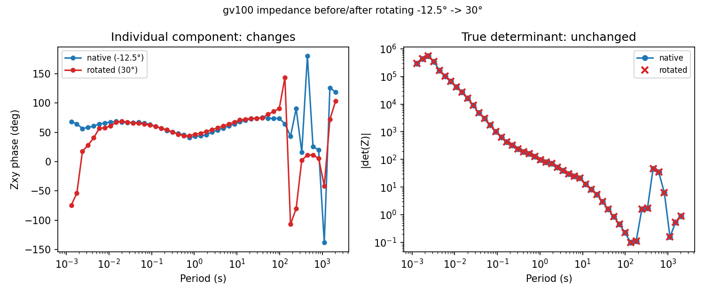

.. _user_guide_emtf_rotation:

Rotation and Covariance
=======================

.. currentmodule:: pycsamt.emtf

:meth:`EMTF.rotate <pycsamt.emtf.document.EMTF.rotate>` (backed by
:func:`~pycsamt.emtf.orientation.rotate_emtf` and
:func:`~pycsamt.emtf.orientation.rotate_transfer_function`) implements
the general EMTF matrix rotation
:math:`TF' = V \cdot TF \cdot U^{\mathsf T}`, with
:func:`~pycsamt.emtf.orientation.rotate_covariance` applying the
matching transform to inverse-signal and residual covariance factors
when they are present. Rotation is deliberately kept out of every
format reader/writer covered elsewhere in this section: it operates
only on the format-neutral :class:`~pycsamt.emtf.transfer.TransferFunction`
and :class:`EMTF` objects, and it never touches
:class:`~pycsamt.metadata.channels.SiteLayout` -- the physical channel
geometry stays exactly as recorded, while
:class:`~pycsamt.metadata.orientation.OrientationMeta` (see
:doc:`../metadata/channels_and_orientation`) is what actually changes.
``EMTF``, ``EMTFRotationError``, and the warning classes below all
import from the top level; the two matrix-construction functions do
too -- ``from pycsamt.emtf import (EMTF, EMTFRotationError,
horizontal_rotation_matrix, horizontal_inverse_rotation_matrix)``.

Rotation Matrices
-----------------

:func:`~pycsamt.emtf.orientation.horizontal_rotation_matrix` builds
the two-channel rotation used at every period. An identity case and a
90-degree case are both exactly analytically checkable:

.. code-block:: pycon

   >>> import numpy as np
   >>> from pycsamt.emtf import horizontal_rotation_matrix, horizontal_inverse_rotation_matrix

   >>> identity = horizontal_rotation_matrix(0.0, 90.0, 0.0)
   >>> print(np.round(identity, 12))
   [[1. 0.]
    [0. 1.]]

   >>> ninety = horizontal_rotation_matrix(0.0, 90.0, 90.0)
   >>> print(np.round(ninety, 12))
   [[ 0.  1.]
    [-1.  0.]]

Rotating a pair of channels already at ``(0°, 90°)`` to a target of
``0°`` is the identity, as expected; rotating the same pair to a
``90°`` target swaps and sign-flips the axes, also exactly as
expected for a coordinate rotation.
:func:`~pycsamt.emtf.orientation.horizontal_inverse_rotation_matrix`
is the matching inverse, verified by composing the two:

.. code-block:: pycon

   >>> minv = horizontal_inverse_rotation_matrix(0.0, 90.0, 30.0)
   >>> mfwd = horizontal_rotation_matrix(0.0, 90.0, 30.0)
   >>> print(np.allclose(mfwd @ minv, np.eye(2), atol=1e-10))
   True

Orientation Must Be Unambiguous First
-------------------------------------

Rotation refuses to guess a starting orientation. The real gv100
station (public-domain USGS data,
https://doi.org/10.5066/P9GZ9Z56, already used throughout
:doc:`../metadata/index`) has ``orientation.mode`` unset, exactly as
found in :doc:`edi_interop`, and calling
:meth:`~pycsamt.emtf.document.EMTF.rotate` on it directly fails
immediately rather than silently assuming a frame:

.. code-block:: pycon

   >>> from pathlib import Path
   >>> from pycsamt.emtf import EMTF, EMTFRotationError

   >>> tf_gv = EMTF.from_edi(Path("data/gv_data/gv_final_edi/gv100.edi"))
   >>> print(tf_gv.orientation.mode)
   None
   >>> try:
   ...     tf_gv.rotate(0.0)
   ... except EMTFRotationError as exc:
   ...     print(type(exc).__name__, exc)
   EMTFRotationError transfer-function orientation is ambiguous; provide source_angles or enable use_legacy_edi_rotation

The real fix is to supply the actual starting azimuth explicitly. The
station's own :class:`~pycsamt.metadata.channels.SiteLayout`, already
used in :doc:`../metadata/channels_and_orientation`, already records
it -- ``Hx`` sits at :math:`-12.5^\circ`:

.. code-block:: pycon

   >>> import warnings

   >>> hx = tf_gv.site_layout.get_channel("Hx")
   >>> print(hx.orientation)
   -12.5

   >>> with warnings.catch_warnings(record=True) as caught:
   ...     warnings.simplefilter("always")
   ...     rotated = tf_gv.rotate(0.0, source_angles=hx.orientation)
   ...     print(len(caught), caught[0].category.__name__)
   2 ApproximateVarianceRotationWarning
   >>> print(rotated.orientation.mode, rotated.orientation.angle_to_geographic_north)
   orthogonal 0.0

Approximate Variance vs. Exact Covariance
-----------------------------------------

The two warnings above are not incidental -- they are the direct
consequence of gv100 carrying only a bare ``VAR`` estimate (see
:doc:`document`), one warning each for impedance and tipper. Without
both ``INVSIGCOV`` and ``RESIDCOV``, ``VAR`` cannot be rotated
exactly, and ``variance_policy`` controls what happens instead. The
default, ``"drop"``, discards it rather than publish a number that
looks precise but is not:

.. code-block:: pycon

   >>> print(rotated.impedance.get_estimate("variance"))
   None

``"independent"`` rotates it anyway, under an explicit
independent-component approximation, still with a warning:

.. code-block:: pycon

   >>> with warnings.catch_warnings(record=True) as caught:
   ...     warnings.simplefilter("always")
   ...     rotated_indep = tf_gv.rotate(0.0, source_angles=-12.5, variance_policy="independent")
   ...     print(len(caught))
   2
   >>> print(rotated_indep.impedance.get_estimate("variance").data.shape)
   (48, 2, 2)

and ``"raise"`` refuses outright instead of approximating:

.. code-block:: pycon

   >>> try:
   ...     tf_gv.rotate(0.0, source_angles=-12.5, variance_policy="raise")
   ... except EMTFRotationError as exc:
   ...     print(type(exc).__name__, exc)
   EMTFRotationError VAR cannot be rotated exactly without both INVSIGCOV and RESIDCOV

The real ``spectra01`` station recovered in :doc:`spectra` is the
clean contrast: because :func:`~pycsamt.emtf.converters.spectra.spectra_to_emtf`
attaches full ``INVSIGCOV``/``RESIDCOV`` alongside ``VAR``, the exact
path applies automatically and rotation produces **zero** warnings:

.. code-block:: pycon

   >>> doc_spectra = EMTF.from_edi("data/MT/SPECTRA/spectra01.edi")
   >>> with warnings.catch_warnings(record=True) as caught:
   ...     warnings.simplefilter("always")
   ...     rotated_spectra = doc_spectra.rotate(0.0, source_angles=0.0)
   ...     print(len(caught))
   0
   >>> print(rotated_spectra.impedance.get_estimate("variance") is not None)
   True
   >>> print(rotated_spectra.impedance.get_estimate("inverse_signal_covariance") is not None)
   True

``INVSIGCOV``/``RESIDCOV`` are rotated exactly with
:func:`~pycsamt.emtf.orientation.rotate_covariance`, and ``VAR`` is
then *recomputed* from their rotated diagonals rather than rotated
directly -- the statistically correct result, not an approximation of
one.

The True Determinant Is Rotation-Invariant
------------------------------------------

Individual matrix components change under rotation, but the true
:math:`2\times2` determinant of the impedance tensor does not -- a
standard MT identity, and one that holds exactly here too, checked
directly with :func:`numpy.linalg.det` on real data before and after
the rotation performed above:

.. code-block:: pycon

   >>> det_before = np.abs(np.linalg.det(tf_gv.impedance.data))
   >>> det_after = np.abs(np.linalg.det(rotated.impedance.data))
   >>> print(np.allclose(det_before, det_after, rtol=1e-10))
   True

.. code-block:: python

   import matplotlib.pyplot as plt

   periods = tf_gv.impedance.periods
   zxy_before = tf_gv.impedance.data[:, 0, 1]
   zxy_after = rotated.impedance.data[:, 0, 1]

   fig, (ax1, ax2) = plt.subplots(1, 2, figsize=(10, 4.2))
   ax1.semilogx(periods, np.degrees(np.angle(zxy_before)), "o-", color="#1f77b4", ms=4, label="native (-12.5°)")
   ax1.semilogx(periods, np.degrees(np.angle(zxy_after)), "o-", color="#d62728", ms=4, label="rotated (30°)")
   ax1.set_xlabel("Period (s)")
   ax1.set_ylabel("Zxy phase (deg)")
   ax1.set_title("Individual component: changes")
   ax1.legend(fontsize=8)

   ax2.loglog(periods, det_before, "o-", color="#1f77b4", ms=5, label="native")
   ax2.loglog(periods, det_after, "x", color="#d62728", ms=7, mew=2, label="rotated")
   ax2.set_xlabel("Period (s)")
   ax2.set_ylabel("|det(Z)|")
   ax2.set_title("True determinant: unchanged")
   ax2.legend(fontsize=8)
   fig.suptitle("gv100 impedance before/after rotating -12.5° -> 30°", fontsize=10)
   fig.tight_layout()

   ``Zxy`` visibly changes under rotation, most obviously in the noisy
   long-period range already seen in :doc:`document`. ``|det(Z)|``
   overlaps exactly at every single period, including that same noisy
   range -- the determinant does not care which orthogonal frame the
   matrix happens to be expressed in.

.. note::

   :meth:`pycsamt.core.base.MTBase.determinant_z` and
   :meth:`~pycsamt.core.base.MTBase.rho_phase_from_det`, inherited by
   every :class:`~pycsamt.emtf.transfer.TransferFunction`, compute the
   same invariant shown above directly --
   ``Z_det = sqrt(Zxx Zyy - Zxy Zyx)`` -- as a convenience, without
   requiring a manual :func:`numpy.linalg.det` call. Building this
   exact example is what surfaced a real bug in that formula (it
   previously omitted the ``Zxx Zyy`` term, so it was only invariant
   for a zero-diagonal tensor); it has since been corrected, and the
   check above now holds for ``determinant_z`` too, verified on this
   same real gv100 rotation.

Identity, Round Trip, and the Untouched Site Layout
---------------------------------------------------

Rotating to the frame a document is already in is the identity --
:attr:`~pycsamt.emtf.orientation.RotationMatrices.is_identity` short-circuits
internally, and the returned data matches exactly:

.. code-block:: pycon

   >>> identity_doc = tf_gv.rotate(-12.5, source_angles=-12.5)
   >>> print(np.allclose(identity_doc.z, tf_gv.z, equal_nan=True))
   True

Rotating forward and then back reproduces the original values within
floating-point tolerance, as a genuine two-step transform (not a
special-cased no-op this time):

.. code-block:: pycon

   >>> forward = tf_gv.rotate(0.0, source_angles=-12.5)
   >>> back = forward.rotate(-12.5, source_angles=0.0)
   >>> print(np.allclose(back.z, tf_gv.z, atol=1e-6))
   True

By default :meth:`~pycsamt.emtf.document.EMTF.rotate` returns a deep
copy -- ``identity_doc.site_layout`` above is a *different*, though
numerically identical, object from ``tf_gv.site_layout``.
``inplace=True`` mutates and returns the same document, and in that
mode the original ``SiteLayout`` object itself is preserved, not just
its values, because the physical channel geometry must never be
replaced by rotation:

.. code-block:: pycon

   >>> original_layout = tf_gv.site_layout
   >>> result_inplace = tf_gv.rotate(0.0, source_angles=-12.5, inplace=True)
   >>> print(result_inplace is tf_gv)
   True
   >>> print(result_inplace.site_layout is original_layout)
   True

Legacy EDI Rotation and Rotating Back to Site Layout
----------------------------------------------------

When a document's orientation is ambiguous but its EDI-derived
``rotation_info``/``extra`` still carries a historical ``ZROT``
vector -- true for the WILLY L18 line used throughout this section --
``use_legacy_edi_rotation=True`` opts into treating that vector as an
orthogonal source frame, with an explicit warning marking it as an
assumption rather than a certainty:

.. code-block:: pycon

   >>> tf_willy = EMTF.from_edi(Path("data/AMT/WILLY_DATA/L18PLT/18-001A.edi"))
   >>> with warnings.catch_warnings(record=True) as caught:
   ...     warnings.simplefilter("always")
   ...     rotated_legacy = tf_willy.rotate(30.0, use_legacy_edi_rotation=True)
   ...     for w in caught:
   ...         print(w.category.__name__)
   LegacyRotationAssumptionWarning
   ApproximateVarianceRotationWarning
   >>> print(rotated_legacy.orientation.mode, rotated_legacy.orientation.angle_to_geographic_north)
   orthogonal 30.0

Every rotation appends to ``orientation.rotation_info`` rather than
overwriting it, so the history of what happened to a document remains
readable later:

.. code-block:: pycon

   >>> print(rotated_legacy.orientation.rotation_info)
   EDI ZROT is constant at 0 deg relative to HEAD.COORDSYS='Geomagnetic North'; it was not promoted to an angle_to_geographic_north because historical EDI rotation metadata can be ambiguous.
   pyCSAMT rotated transfer functions to an orthogonal frame at 30 degrees clockwise from geographic north

``target="sitelayout"`` rotates back to the original physical channel
frame instead of an arbitrary orthogonal azimuth, appending one more
line to that same history:

.. code-block:: pycon

   >>> back_to_layout = rotated_legacy.rotate(target="sitelayout")
   >>> print(back_to_layout.orientation.mode)
   sitelayout
   >>> print(back_to_layout.orientation.rotation_info)
   EDI ZROT is constant at 0 deg relative to HEAD.COORDSYS='Geomagnetic North'; it was not promoted to an angle_to_geographic_north because historical EDI rotation metadata can be ambiguous.
   pyCSAMT rotated transfer functions to an orthogonal frame at 30 degrees clockwise from geographic north
   pyCSAMT rotated transfer functions to original site layout

Choosing the Right Option
-------------------------

.. list-table::
   :header-rows: 1
   :widths: 32 30 38

   * - Need
     - Option
     - Notes
   * - Rotate a whole document
     - :meth:`EMTF.rotate <pycsamt.emtf.document.EMTF.rotate>`
     - Thin wrapper over :func:`~pycsamt.emtf.orientation.rotate_emtf`.
   * - Rotate one transfer function
     - :func:`~pycsamt.emtf.orientation.rotate_transfer_function`
     - Same engine, used internally by ``EMTF.rotate``.
   * - Starting orientation is ambiguous
     - ``source_angles=`` or ``use_legacy_edi_rotation=True``
     - The latter warns; it is an assumption, not a certainty.
   * - ``VAR`` without full covariance
     - ``variance_policy="drop"/"independent"/"fcu"/"raise"``
     - ``"drop"`` is the default; prefer full covariance when available (:doc:`spectra`).
   * - A rotation-invariant scalar check
     - :func:`numpy.linalg.det`, or :meth:`~pycsamt.core.base.MTBase.determinant_z`
     - Both give the true determinant -- see the note above.

Next Steps
----------

This closes the current pass through :doc:`index`. From here:

* :doc:`../metadata/channels_and_orientation` covers
  ``OrientationMeta``/``SiteLayout`` as metadata objects in their own
  right, independent of the rotation engine that changes one and
  never the other;
* :doc:`spectra` covers how full covariance is recovered in the first
  place, which is what makes the exact rotation path in this page
  possible;
* :doc:`document` and :doc:`edi_interop` cover the ``EMTF`` container
  and EDI adapter these examples load from.
