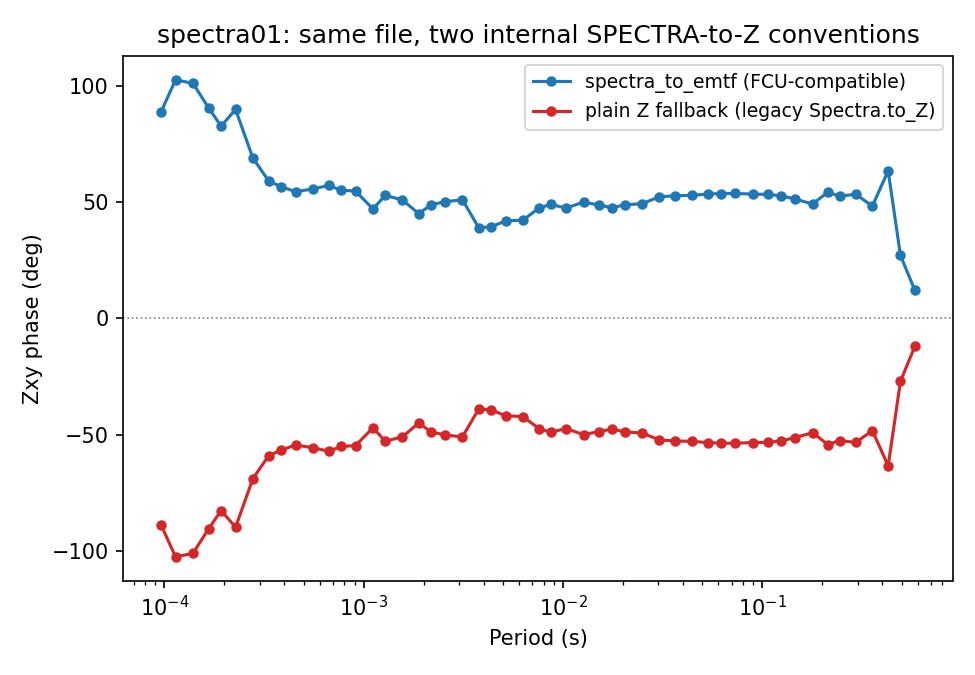

.. _user_guide_emtf_spectra:

EDI SPECTRA Recovery
====================

.. currentmodule:: pycsamt.emtf

The historical SEG ``SPECTRA`` section stores a Hermitian cross-power
matrix at every frequency -- far more information than the impedance
and error values in a standard EDI ``Z``/``ZVAR`` block.
:func:`spectra_to_emtf` and :func:`recover_spectra_transfer_functions`
recover transfer functions *and* the two covariance factors needed
for statistically correct rotation directly from those cross-power
matrices, following the same equations EMTF FCU v4.1 uses for
single-station and remote-reference processing. :meth:`EMTF.from_edi
<pycsamt.emtf.document.EMTF.from_edi>` prefers this recovery over the
plain impedance/tipper blocks whenever a file has a usable ``SPECTRA``
section, and this page shows exactly why that default matters, not
just what it returns. Everything imports from the top level --
``from pycsamt.emtf import EMTF, spectra_to_emtf`` -- except
:class:`~pycsamt.emtf.converters.spectra.SpectraChannelMap` and
:func:`~pycsamt.emtf.converters.spectra.resolve_spectra_channels`,
which are not re-exported at the package level and are used here from
:mod:`pycsamt.emtf.converters.spectra` directly.

A Real Remote-Reference File
----------------------------

``data/MT/SPECTRA/spectra01.edi`` is a de-identified, sanitized real
field file kept in the repository specifically for SPECTRA examples
(only location/operator/hardware identifiers were replaced; every
numeric cross-power value is untouched). Its channel list carries two
separate horizontal-magnetic pairs -- one local, one remote --
which :func:`~pycsamt.emtf.converters.spectra.resolve_spectra_channels`
detects automatically:

.. code-block:: pycon

   >>> from pycsamt.seg.spectra import Spectra
   >>> from pycsamt.emtf.converters.spectra import resolve_spectra_channels

   >>> sp = Spectra.from_file("data/MT/SPECTRA/spectra01.edi")
   >>> channel_map = resolve_spectra_channels(sp)
   >>> print(channel_map)
   SpectraChannelMap(hx=0, hy=1, ex=3, ey=4, hz=2, rx=5, ry=6, channel_types=('HX', 'HY', 'HZ', 'EX', 'EY', 'HX', 'HY'))
   >>> print(channel_map.reference_type)
   remote_reference
   >>> print(channel_map.local_h, channel_map.remote_h, channel_map.outputs)
   (0, 1) (5, 6) (2, 3, 4)

No explicit ``RX``/``RY`` label is present in this file; a second
``HX``/``HY`` pair is enough on its own for
:attr:`~pycsamt.emtf.converters.spectra.SpectraChannelMap.reference_type`
to resolve to ``"remote_reference"`` rather than
``"single_station"`` -- exactly the historical convention EMTF FCU
itself follows, as the function's own docstring notes.

Recovering Transfer Functions and Full Covariance
-------------------------------------------------

:func:`~pycsamt.emtf.converters.spectra.recover_spectra_transfer_functions`
applies the FCU recovery equations to every frequency and returns a
:class:`~pycsamt.emtf.converters.spectra.SpectraRecoveryResult`:

.. code-block:: pycon

   >>> from pycsamt.emtf.converters.spectra import recover_spectra_transfer_functions

   >>> result = recover_spectra_transfer_functions(sp)
   >>> print(result.used_indices.size, result.skipped_indices.size)
   51 0
   >>> print(result.impedance.data.shape, result.tipper.data.shape)
   (51, 2, 2) (51, 1, 2)
   >>> print(sorted(result.impedance.estimates.keys()))
   ['inverse_signal_covariance', 'residual_covariance', 'variance']
   >>> print(result.impedance.estimates["inverse_signal_covariance"].data.shape)
   (51, 2, 2)
   >>> print(result.impedance.estimates["residual_covariance"].data.shape)
   (51, 2, 2)

All 51 frequencies were usable here (``skipped_indices`` is empty);
frequencies whose required cross-spectra are missing are skipped or
raise, controlled by ``missing_policy``. Both impedance *and* tipper
come back with all three estimate kinds attached --
:doc:`transfer_functions` covers ``variance``,
``inverse_signal_covariance``, and ``residual_covariance`` as
concepts; here they are real, non-trivial arrays recovered from
genuine cross-power data, not empty placeholders.

``spectra_to_emtf`` and ``EMTF.from_edi``'s Default Preference
--------------------------------------------------------------

:func:`spectra_to_emtf` wraps the recovery above into a full
:class:`~pycsamt.emtf.document.EMTF` document, reusing the same EDI
metadata mappings covered in :doc:`edi_interop` for everything that
is not scientific data:

.. code-block:: pycon

   >>> from pycsamt.emtf import spectra_to_emtf

   >>> doc = spectra_to_emtf("data/MT/SPECTRA/spectra01.edi")
   >>> print(doc.attrs["source_format"])
   edi_spectra
   >>> print(doc.processing.remote_reference.reference_type)
   Remote Reference
   >>> print(doc.metadata["edi_spectra"]["full_covariance_recovered"])
   True
   >>> print(doc.metadata["edi_spectra"]["covariance_algorithm"])
   EMTF_FCU_v4.1

:meth:`EMTF.from_edi <pycsamt.emtf.document.EMTF.from_edi>` reaches
this exact path automatically, with no extra argument, whenever a
usable ``SPECTRA`` section is present:

.. code-block:: pycon

   >>> from pycsamt.emtf import EMTF

   >>> doc2 = EMTF.from_edi("data/MT/SPECTRA/spectra01.edi")
   >>> print(doc2.attrs["source_format"])
   edi_spectra

Why the Preferred Path Matters: a Real Sign Difference
------------------------------------------------------

Passing ``prefer_spectra=False`` forces the historical plain-block
path instead -- the same code path :doc:`edi_interop` describes for
an ordinary EDI file. This particular file has no literal ``Z`` block
at all, so pycsamt synthesizes one from the same SPECTRA data through
a *different* internal method,
:meth:`Spectra.to_Z() <pycsamt.seg.spectra.Spectra.to_Z>`:

.. code-block:: pycon

   >>> doc_plain = EMTF.from_edi("data/MT/SPECTRA/spectra01.edi", prefer_spectra=False)
   >>> print(sorted(doc_plain.impedance.estimates.keys()))
   []

That fallback already loses something real -- zero estimates, not
even a plain variance, because the internal call underneath uses
``estimate_error=False``. It also does not just lose precision; it
uses a genuinely different sign convention. The magnitudes still
agree:

.. code-block:: pycon

   >>> import numpy as np

   >>> print(np.allclose(np.abs(doc2.z), np.abs(doc_plain.z), rtol=0.05))
   True

but the imaginary part does not -- every value from the two paths is
an exact complex conjugate of the other:

.. code-block:: pycon

   >>> phase_spectra = np.degrees(np.angle(doc2.z[:, 0, 1]))
   >>> phase_plain = np.degrees(np.angle(doc_plain.z[:, 0, 1]))
   >>> print(np.allclose(phase_spectra, -phase_plain))
   True

od.
   :width: 80%
   :align: center

   The same real file's ``Zxy`` phase, computed two ways. The
   FCU-compatible recovery (blue) stays in the physically expected
   quadrant for this component; the legacy fallback (red) is its
   exact mirror image at every single period.

This is not a coincidence, and it is fully explained by two named,
tested :class:`~pycsamt.seg.spectra.Spectra` views: ``fcu_cross_spectra``
(the packed SEG/FCU convention that
``recover_spectra_transfer_functions`` requires) and the legacy ``S``
view that :meth:`~pycsamt.seg.spectra.Spectra.to_Z` uses, which are
exact complex conjugates of each other for this file:

.. code-block:: pycon

   >>> print(np.allclose(sp.fcu_cross_spectra, np.conjugate(sp.S)))
   True

This is precisely the risk the recovery function's own module
docstring warns about: reinterpreting the legacy convention as an FCU
archive "can conjugate the recovered transfer function." Both
conventions are internally consistent and deliberately tested against
each other; the point is that they are not interchangeable, and
``EMTF.from_edi``'s default of ``prefer_spectra=True`` exists
specifically so that a caller gets the FCU-compatible, fully
covariance-attached recovery without having to know this distinction
exists.

Choosing the Right Function
---------------------------

.. list-table::
   :header-rows: 1
   :widths: 32 32 36

   * - Need
     - Function
     - Notes
   * - Full document from a SPECTRA-bearing EDI
     - :func:`spectra_to_emtf` / :meth:`EMTF.from_edi <pycsamt.emtf.document.EMTF.from_edi>`
     - The latter dispatches here automatically when SPECTRA is usable.
   * - Just the recovered TFs and covariance, no document
     - :func:`~pycsamt.emtf.converters.spectra.recover_spectra_transfer_functions`
     - Returns a ``SpectraRecoveryResult``, not an ``EMTF``.
   * - Which channels are local/remote/output
     - :func:`~pycsamt.emtf.converters.spectra.resolve_spectra_channels`
     - Detects a second ``HX``/``HY`` pair as remote automatically.
   * - Force the legacy, lower-information path
     - ``EMTF.from_edi(..., prefer_spectra=False)``
     - Loses covariance and may use a different sign convention -- see above.

Next Steps
----------

* :doc:`edi_interop` covers the plain EDI adapter this page
  contrasts against, and the metadata mappings ``spectra_to_emtf``
  reuses;
* :doc:`transfer_functions` covers what ``variance``,
  ``inverse_signal_covariance``, and ``residual_covariance`` mean as
  general concepts;
* :doc:`rotation` covers how these full-covariance estimates
  transform once a rotation is applied.
