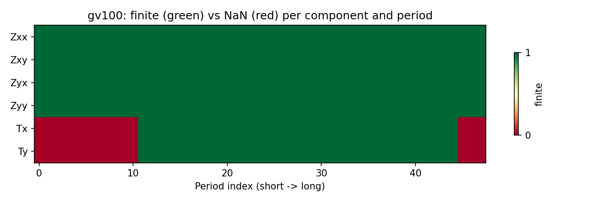

.. _user_guide_emtf_transfer_functions:

Transfer Functions and Estimates
================================

.. currentmodule:: pycsamt.emtf

:class:`TransferFunction` stores one electromagnetic transfer function
as a matrix -- shape ``(n_period, n_output_channels, n_input_channels)``
-- with its axes tied to named channels rather than hard-coded
``Zxx``/``Zxy``/``Zyx``/``Zyy`` components.
:class:`StatisticalEstimate` attaches variance or covariance to that
matrix in the form it was actually supplied, instead of coercing every
kind of uncertainty into the legacy ``z_err`` standard-error model.
Both are pure scientific objects: no EDI section, no XML element, is
ever stored inside them. 

Matrix Shape and Validation
---------------------------

:class:`TransferFunction` accepts scalar, 1-D, 2-D, or 3-D data and
normalizes all of them to the canonical 3-D shape, using the declared
channel counts to decide what a lower-dimensional array must mean:

.. code-block:: pycon

   >>> from pycsamt.emtf import TransferFunction

   >>> tf = TransferFunction(
   ...     name="z", data=[[1.0, 2.0], [3.0, 4.0]],
   ...     input_channels=("Hx", "Hy"), output_channels=("Ex", "Ey"),
   ... )
   >>> print(tf.shape)
   (1, 2, 2)
   >>> print(tf.data.dtype)
   complex128
   >>> print(tf.data[0])
   [[1.+0.j 2.+0.j]
    [3.+0.j 4.+0.j]]

A bare 2-D array is treated as *one* period's matrix and promoted to
``(1, n_output, n_input)`` -- real, plain floats are silently upcast
to complex because ``"z"`` normalizes to the ``impedance`` datatype,
whose declared ``data_kind`` is ``"complex"`` (more on that below). A
shape that does not match the declared channels raises immediately
with the exact mismatch, not a generic broadcasting error:

.. code-block:: pycon

   >>> try:
   ...     TransferFunction(
   ...         name="impedance", data=[[1, 2], [3, 4], [5, 6]],
   ...         input_channels=("Hx",), output_channels=("Ex", "Ey"),
   ...     )
   ... except ValueError as exc:
   ...     print(type(exc).__name__, exc)
   ValueError 2-D data are interpreted as one TF matrix; expected (2, 1), got (3, 2)

   >>> try:
   ...     TransferFunction(
   ...         name="impedance", data=[[1, 2], [3, 4]],
   ...         input_channels=("Hx", "Hx"), output_channels=("Ex", "Ey"),
   ...     )
   ... except ValueError as exc:
   ...     print(type(exc).__name__, exc)
   ValueError duplicate channel name: 'Hx'

A scalar quantity -- no meaningful input/output channels, like phase
tensor skew -- uses empty channel tuples, and a 1-D array is then
promoted to ``(n_period, 1, 1)`` instead of a matrix:

.. code-block:: pycon

   >>> skew = TransferFunction(
   ...     name="impedance_skew", data=[0.1, 0.2, 0.3],
   ...     input_channels=(), output_channels=(),
   ... )
   >>> print(skew.shape, skew.n_periods)
   (3, 1, 1) 3

Name Normalization and Units
----------------------------

The ``name`` passed to the constructor does not have to be the exact
tag: ``"z"`` above normalized to ``"impedance"`` because the datatype
registry (covered in full later on this page) resolves it. Once
resolved, the definition also fills in ``units`` automatically when
none was supplied, and enforces the declared numeric kind:

.. code-block:: pycon

   >>> print(tf.name, tf.units)
   impedance [mV/km]/[nT]

   >>> try:
   ...     TransferFunction(
   ...         name="impedance_skew", data=[0.1 + 0.5j, 0.2, 0.3],
   ...         input_channels=(), output_channels=(),
   ...     )
   ... except TypeError as exc:
   ...     print(type(exc).__name__, exc)
   TypeError impedance_skew is defined as real but complex data with non-zero imaginary values were supplied

   >>> zero_imag = TransferFunction(
   ...     name="impedance_skew", data=[0.1 + 0j, 0.2 + 0j, 0.3 + 0j],
   ...     input_channels=(), output_channels=(),
   ... )
   >>> print(zero_imag.data.dtype, zero_imag.data.ravel())
   float64 [0.1 0.2 0.3]

A complex array with a genuinely non-zero imaginary part is rejected
for a ``"real"``-kind type -- that data almost certainly represents a
mistake, not a real quantity, and pycsamt refuses to discard
information silently. A complex array whose imaginary part happens to
be exactly zero is accepted and quietly narrowed to real, since no
information is actually lost.

The Missing-Value Policy
------------------------

:doc:`document` already showed that a real EDI-derived tipper can
contain genuine ``NaN`` entries, not zeros, wherever the source
station's response was not estimated. That pattern is visible across
every component at once by comparing the real gv100 impedance and
tipper together:

.. code-block:: python

   import numpy as np
   import matplotlib.pyplot as plt

   z_valid = np.isfinite(imp.data.real) & np.isfinite(imp.data.imag)
   t_valid = np.isfinite(tip.data.real) & np.isfinite(tip.data.imag)

   rows, labels = [], []
   for i, name in enumerate(["Zxx", "Zxy", "Zyx", "Zyy"]):
       r, c = divmod(i, 2)
       rows.append(z_valid[:, r, c])
       labels.append(name)
   for j, name in enumerate(["Tx", "Ty"]):
       rows.append(t_valid[:, 0, j])
       labels.append(name)
   grid = np.array(rows, dtype=float)

   fig, ax = plt.subplots(figsize=(9, 3))
   im = ax.imshow(grid, aspect="auto", cmap="RdYlGn", vmin=0, vmax=1, interpolation="none")
   ax.set_yticks(range(len(labels)))
   ax.set_yticklabels(labels)
   ax.set_xlabel("Period index (short -> long)")
   ax.set_title("gv100: finite (green) vs NaN (red) per component and period")
   fig.colorbar(im, ax=ax, ticks=[0, 1], label="finite", shrink=0.6)
   fig.tight_layout()

   All four real gv100 impedance components are finite at every
   period. Tipper (``Tx``/``Ty``) is genuinely missing -- not
   zero -- at 14 of 48 periods, split between the shortest and
   longest ends of the band.

Nothing in :class:`TransferFunction` fills, interpolates, or masks
these gaps -- it stores exactly the array it was given. Any downstream
code (plotting, inversion, QC) has to decide deliberately what to do
with a ``NaN``; :doc:`../metadata/processing_and_quality`'s
:class:`~pycsamt.metadata.quality.DataQuality` is the tool that turns
this same pattern into a coverage percentage and a quality flag.

Statistical Estimates
---------------------

:class:`StatisticalEstimate` attaches to a specific
:class:`TransferFunction` through :meth:`~TransferFunction.add_estimate`,
which validates that the estimate's period axis actually matches the
parent matrix before accepting it:

.. code-block:: pycon

   >>> import numpy as np
   >>> from pycsamt.emtf import StatisticalEstimate

   >>> periods = np.array([1.0, 10.0, 100.0])
   >>> z = np.ones((3, 2, 2), dtype=complex)
   >>> tf3 = TransferFunction(
   ...     name="impedance", data=z,
   ...     input_channels=("Hx", "Hy"), output_channels=("Ex", "Ey"),
   ...     periods=periods,
   ... )
   >>> var = StatisticalEstimate(name="var", data=np.ones((3, 2, 2)), kind="variance")
   >>> tf3.add_estimate(var)
   TransferFunction(name='impedance', data=ndarray(shape=(3, 2, 2), dtype=complex128), input_channels=tuple(['Hx', 'Hy']), output_channels=tuple(['Ex', 'Ey']), units='[mV/km]/[nT]', periods=ndarray(shape=(3,), dtype=float64), estimates=dict(len=1, keys=[variance]), attrs=dict(len=0, keys=[]))

   >>> print(tf3.get_estimate("VAR") is tf3.get_estimate("variance"))
   True

Like :meth:`~pycsamt.emtf.document.EMTF.add_transfer_function`,
``add_estimate`` returns ``self`` and echoes the whole
:class:`TransferFunction` repr when called bare, for the same
chaining reason discussed in :doc:`document`.
:meth:`~TransferFunction.get_estimate` matches on the stored
``.name`` (``"VAR"``) or the semantic ``.kind`` (``"variance"``)
interchangeably.

Attempting to attach a second estimate under the same key, or one
whose period axis does not match, both fail with a specific message
rather than corrupting the existing set:

.. code-block:: pycon

   >>> var2 = StatisticalEstimate(name="var", data=np.ones((3, 2, 2)) * 2, kind="variance")
   >>> try:
   ...     tf3.add_estimate(var2)
   ... except ValueError as exc:
   ...     print(type(exc).__name__, exc)
   ValueError estimate already exists: variance

   >>> _ = tf3.add_estimate(var2, replace=True)
   >>> print(tf3.get_estimate("variance").data[0, 0, 0])
   2.0

   >>> bad_est = StatisticalEstimate(name="bad", data=np.ones((5, 2, 2)), kind="variance")
   >>> try:
   ...     tf3.add_estimate(bad_est, key="bad")
   ... except ValueError as exc:
   ...     print(type(exc).__name__, exc)
   ValueError estimate period axis does not match TF data: 5 != 3

   >>> print(tf3.get_estimate("does-not-exist"))
   None

The Datatype Registry
---------------------

:class:`DataTypeDefinition` describes one EMTF data type: its short
FCU-style code (``"Z"``), semantic tag (``"impedance"``), numeric
kind, channel families, units, and whether it is a *primary*
(measured/estimated directly) or *derived* (computed from another
type) quantity. :func:`list_emtf_datatypes` filters the registry by
that distinction:

.. code-block:: pycon

   >>> from pycsamt.emtf import get_emtf_datatype, list_emtf_datatypes

   >>> z_def = get_emtf_datatype("Z")
   >>> print(z_def.is_primary, z_def.is_derived)
   True False

   >>> rho_def = get_emtf_datatype("RHO")
   >>> print(rho_def.is_primary, rho_def.is_derived, rho_def.derived_from)
   False True impedance

   >>> print(sorted(list_emtf_datatypes(intention="primary").keys()))
   ['impedance', 'interstation_impedance', 'interstation_transfer_functions', 'off_diagonal_impedance', 'tipper']
   >>> print(len(list_emtf_datatypes(intention="derived")))
   15

The primary set is deliberately small -- just impedance, tipper, and
interstation variants -- while the fifteen derived entries cover phase
tensor, apparent resistivity/phase, determinant and effective
impedance, strike/skew/ellipticity, and induction-arrow quantities,
each recording exactly which primary type it derives from.

``aliases`` exist because the 2020 EMTF paper and EMTF FCU v4.1 do not
always agree on short names -- interstation impedance and interstation
transfer functions are the clearest real example, registered under
``"ZI"``/``"TI"`` but historically also known as ``"Q"``/``"P"``:

.. code-block:: pycon

   >>> zi = get_emtf_datatype("Q")
   >>> print(zi.name, zi.tag, zi.aliases)
   ZI interstation_impedance ('Q',)

   >>> ti = get_emtf_datatype("interstation_transfer_functions")
   >>> print(ti.name, ti.tag, ti.aliases)
   TI interstation_transfer_functions ('P',)

Both lookups above -- one starting from the historical alias, one
from the semantic tag -- reach the same
:class:`DataTypeDefinition`, which is exactly how ``"Z"`` and
``"impedance"`` reached the same object in :doc:`document`.

Registering a Custom Datatype
-----------------------------

:func:`register_emtf_datatype` extends the registry without modifying
pycsamt itself -- the mechanism the committed :mod:`pycsamt.airborne`
package (see the top-level user guide) would use to register an
admittance-style quantity that has no equivalent in ground MT:

.. code-block:: pycon

   >>> from pycsamt.emtf import DataTypeDefinition, register_emtf_datatype

   >>> admittance_def = DataTypeDefinition(
   ...     name="Y", tag="admittance", data_kind="complex",
   ...     input_kind="E", output_kind="H",
   ...     units="[nT]/[mV/km]", intention="derived",
   ...     description="Airborne-style admittance (inverse impedance convention)",
   ...     derived_from="impedance",
   ... )
   >>> register_emtf_datatype(admittance_def)
   DataTypeDefinition(name='Y', tag='admittance', data_kind='complex', input_kind='E', output_kind='H', units='[nT]/[mV/km]', intention='derived', description='Airborne-style admittance (inverse impedance ...', ...)

   >>> periods_y = np.array([25.0, 385.0])
   >>> y = np.ones((2, 2, 2), dtype=complex) * 0.01
   >>> tf_y = TransferFunction(
   ...     name="Y", data=y,
   ...     input_channels=("Ex", "Ey"), output_channels=("Hx", "Hy"),
   ...     periods=periods_y,
   ... )
   >>> from pycsamt.emtf import EMTF
   >>> doc = EMTF()
   >>> _ = doc.add_transfer_function(tf_y)
   >>> print(sorted(doc.transfer_functions.keys()))
   ['admittance']
   >>> print(doc.get_transfer_function("Y") is tf_y)
   True

   >>> try:
   ...     register_emtf_datatype(admittance_def)
   ... except ValueError as exc:
   ...     print(type(exc).__name__, exc)
   ValueError EMTF data type already registered: admittance

The registration itself is process-global -- once ``"admittance"`` is
registered, any :class:`TransferFunction` named ``"Y"`` or
``"admittance"`` resolves to it for the rest of the process, which is
exactly what lets ``get_transfer_function("Y")`` find ``tf_y`` above.
Registering the same tag twice fails unless ``overwrite=True`` is
passed explicitly, so a project cannot accidentally redefine a type
another part of the same process already depends on.

Choosing the Right Object
-------------------------

.. list-table::
   :header-rows: 1
   :widths: 32 30 38

   * - Need
     - Object/function
     - Notes
   * - One matrix-valued transfer function
     - :class:`TransferFunction`
     - Shape normalized from scalar/1-D/2-D/3-D input automatically.
   * - Variance or covariance attached to a TF
     - :class:`StatisticalEstimate` / :meth:`~TransferFunction.add_estimate`
     - Stored as supplied; never coerced into the legacy ``z_err`` model.
   * - Look up what a short code or tag means
     - :func:`get_emtf_datatype`
     - Matches tag, primary code, or any registered alias.
   * - List primary or derived types
     - :func:`list_emtf_datatypes`
     - ``intention="primary"`` / ``"derived"`` filters the result.
   * - Add a project-specific data type
     - :func:`register_emtf_datatype`
     - Global for the process; requires ``overwrite=True`` to redefine.

Next Steps
----------

* :doc:`document` covers the ``EMTF`` container these transfer
  functions attach to;
* :doc:`edi_interop` covers how a real EDI file's ``Z``/``TIP``
  blocks become ``TransferFunction`` objects in the first place;
* :doc:`rotation` covers how a ``TransferFunction`` and its attached
  estimates transform together under rotation.
