.. _emtools_advanced:

Advanced EM Tools
=================

:mod:`pycsamt.emtools.advanced` contains pyCSAMT's advanced
MT/AMT/CSAMT visual diagnostics. These functions are not data loaders
and they are not inversion engines. They are figure-producing analysis
tools that expose tensor behaviour, dimensionality, distortion,
depth sensitivity, survey coherence, and station-to-station structure
in ways that are difficult to see from ordinary apparent-resistivity
and phase curves alone.

The module is intentionally built on the same public data boundary used
throughout :mod:`pycsamt.emtools`: every function accepts path-like
inputs, EDI-like objects, or :class:`~pycsamt.site.base.Sites`
containers and normalizes them with
:func:`pycsamt.emtools._core.ensure_sites`. This means the examples
below work with a survey directory, a list of EDI files, or a
pre-loaded ``Sites`` object.

When To Use This Module
-----------------------

Use the advanced tools after basic loading and QC, when the next
question is interpretive:

- Does the response behave like 1-D, 2-D, or 3-D structure?
- Are distortion indicators localized by station, period, or component?
- Which periods are likely probing the same depth interval?
- Do neighboring stations have coherent transfer-function behaviour?
- Is a proposed strike direction stable across period and method?
- Are tensor invariants, Bode consistency, or phase-tensor summaries
  telling the same story as ordinary ``rho`` and ``phase`` plots?

The functions return :class:`matplotlib.figure.Figure` objects. They do
not write files by default, so scripts can save the result explicitly.

.. code-block:: python
   :linenos:

   from pathlib import Path

   from pycsamt.emtools import ensure_sites
   from pycsamt.emtools.advanced import plot_survey_fingerprint

   sites = ensure_sites(
       "data/AMT/WILLY_DATA/L18PLT",
       recursive=True,
       strict=False,
       on_dup="replace",
       verbose=0,
   )

   fig = plot_survey_fingerprint(sites, recursive=False)
   Path("results").mkdir(exist_ok=True)
   fig.savefig("results/l18_survey_fingerprint.png", dpi=200)

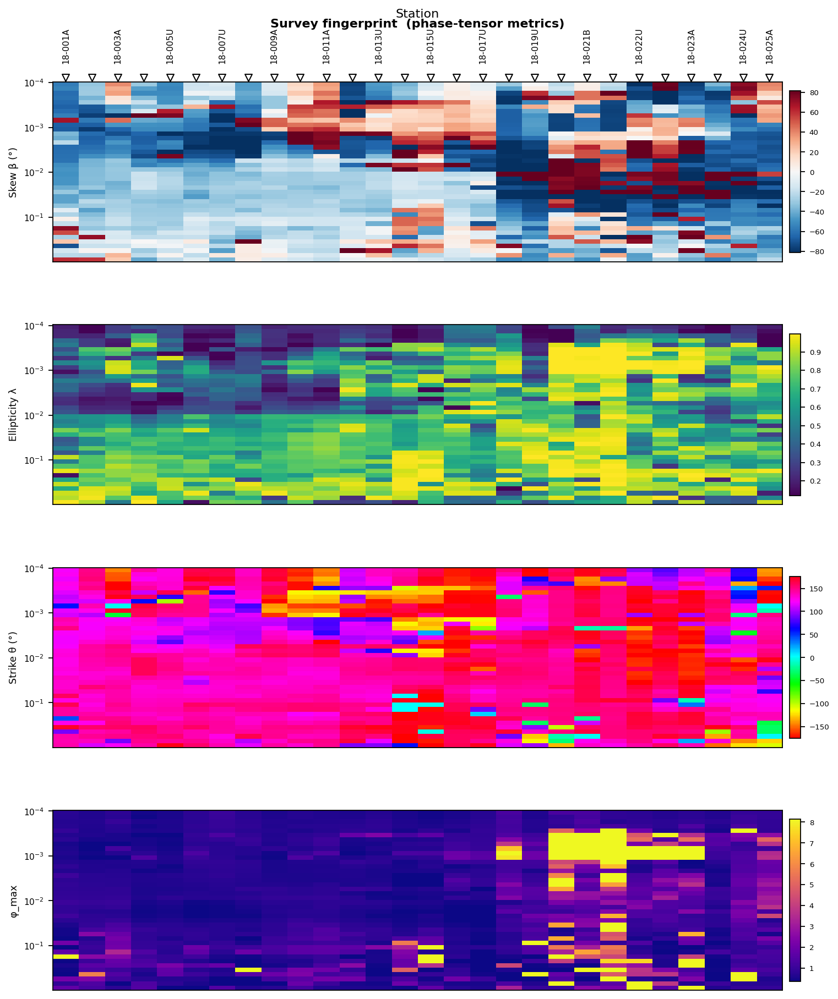

Line 4 imports one advanced plotting function. Lines 6-12 normalize a
real survey-line directory into ``Sites``. Line 14 passes the already
loaded object into the plotting function, so the survey is not parsed a
second time. Lines 15-16 save the returned Matplotlib figure.

Implementation Pattern
----------------------

The advanced functions follow a shared implementation pattern:

1. Normalize user input with ``ensure_sites``.
2. Iterate over stations with ``_iter_items`` and stable station names
   from ``_name``.
3. Extract impedance and frequency arrays with ``_get_z_block`` and,
   where needed, tipper arrays with ``_get_t_block``.
4. Compute a diagnostic quantity such as rotated impedance, Bostick
   depth, phase-tensor skew, ellipticity, apparent anisotropy, or
   station-to-station correlation.
5. Render the diagnostic into Matplotlib axes.
6. Return the ``Figure`` without saving it.

Most functions expose the same input-control keywords:

``recursive``
    Whether path-like directory inputs should be searched recursively.

``on_dup``
    Duplicate station policy passed to ``ensure_sites``. Use
    ``"replace"`` for exploratory work and ``"raise"`` for strict
    production checks.

``strict``
    If ``True``, fail when no valid site can be resolved.

``verbose``
    Forwarded to the loading/coercion layer.

``axes`` or ``ax``
    Optional Matplotlib axes supplied by the caller. Use these when
    embedding advanced diagnostics into a larger dashboard or report
    figure.

Functional Groups
-----------------

.. list-table::
   :header-rows: 1
   :widths: 24 34 42

   * - Group
     - Functions
     - Main purpose
   * - Single-station tensor diagnostics
     - ``plot_impedance_mohr_circles``, ``plot_zt_argand``,
       ``plot_rho_phase_bode``, ``plot_apparent_resistivity_polar``,
       ``plot_pt_period_clock``
     - Inspect how one station changes with rotation, period, component,
       apparent resistivity, phase, and phase-tensor geometry.
   * - Dimensionality and distortion
     - ``plot_dimensionality_ternary``, ``plot_distortion_radar``
     - Summarize whether responses look 1-D, 2-D, 3-D, distorted, or
       unstable across period and station.
   * - Pseudosection and survey summaries
     - ``plot_sensitivity_depth_section``,
       ``plot_apparent_anisotropy_section``,
       ``plot_dimensionality_depth_profile``,
       ``plot_z_invariants_section``,
       ``plot_survey_fingerprint``,
       ``plot_mt_composite_section``, ``plot_snr_section``
     - Convert station-period arrays into profile-style figures that
       expose depth sensitivity, anisotropy, invariants, SNR, and
       multi-metric survey structure.
   * - Strike and coherence
     - ``plot_strike_stability_bands``,
       ``plot_tf_coherence_network``
     - Test strike stability across methods and visualize whether
       stations share coherent transfer-function curves.

Single-Station Tensor Diagnostics
---------------------------------

These functions are best used on one station at a time, or on a
survey-median summary, when you want to understand tensor behaviour
before interpreting a full profile.

All five diagnostics in this block start from the complex impedance
tensor

.. math::

   \mathbf{Z}(f)
   =
   \begin{bmatrix}
   Z_{xx}(f) & Z_{xy}(f) \\
   Z_{yx}(f) & Z_{yy}(f)
   \end{bmatrix}.

When a function studies rotation, pyCSAMT uses

.. math::

   \mathbf{Z}_\theta(f)
   =
   \mathbf{R}(\theta)\,
   \mathbf{Z}(f)\,
   \mathbf{R}(\theta)^T,
   \qquad
   \mathbf{R}(\theta)
   =
   \begin{bmatrix}
   \cos\theta & \sin\theta \\
   -\sin\theta & \cos\theta
   \end{bmatrix}.

Mohr circles ask how the tensor changes under every rotation.  Argand
diagrams ask how the complex value itself moves with period.  Bode plots
ask whether phase is consistent with the resistivity slope.  Polar
diagrams ask how resistivity changes with rotation direction.  The
phase-tensor clock asks whether tensor orientation and ellipticity remain
stable with period.

.. code-block:: python
   :linenos:

   from pycsamt.emtools.advanced import (
       plot_impedance_mohr_circles,
       plot_zt_argand,
       plot_rho_phase_bode,
       plot_apparent_resistivity_polar,
       plot_pt_period_clock,
   )

   fig = plot_impedance_mohr_circles(sites, station="18-001A")
   fig = plot_zt_argand(sites, station="18-001A", components=("xy", "yx"))
   fig = plot_rho_phase_bode(sites, station="18-001A", component="xy")
   fig = plot_apparent_resistivity_polar(sites, station="18-001A")
   fig = plot_pt_period_clock(sites, n_rings=6)

.. grid:: 1 1 2 3
   :gutter: 2

   .. grid-item::

      .. image:: ../../images/user_guide/emtools/user-guide-emtools-advanced-02-01.png
         :width: 100%

   .. grid-item::

      .. image:: ../../images/user_guide/emtools/user-guide-emtools-advanced-02-02.png
         :width: 100%

   .. grid-item::

      .. image:: ../../images/user_guide/emtools/user-guide-emtools-advanced-02-03.png
         :width: 100%

   .. grid-item::

      .. image:: ../../images/user_guide/emtools/user-guide-emtools-advanced-02-04.png
         :width: 100%

   .. grid-item::

      .. image:: ../../images/user_guide/emtools/user-guide-emtools-advanced-02-05.png
         :width: 100%

Mohr circles rotate the impedance tensor through all angles and show
whether the rotated trajectories collapse to points, pass through the
origin, or remain offset. Argand trajectories keep the complex
impedance itself in view and use period as the trajectory parameter.
Bode plots compare observed phase against the phase implied by local
``log(rho_a)`` slope. Polar apparent-resistivity plots show how
``rho_a`` varies with rotation angle. The phase-tensor period clock
compresses period-dependent phase-tensor ellipse shape and orientation
into concentric rings.

Read this grid left to right as a station-level audit.  If the Mohr
circles are offset, the Argand curves loop sharply, the Bode phase
separates from the observed phase, and the polar petals rotate with
period, then the station is giving several independent warnings that a
simple 1-D/2-D interpretation is fragile.

Dimensionality And Distortion
-----------------------------

The dimensionality functions summarize broad structural behaviour
across many station-period cells.

.. code-block:: python
   :linenos:

   from pycsamt.emtools.advanced import (
       plot_dimensionality_ternary,
       plot_distortion_radar,
   )

   fig = plot_dimensionality_ternary(
       sites,
       beta_thresh=5.0,
       ellipt_thresh=0.1,
   )

   fig = plot_distortion_radar(
       sites,
       max_stations=8,
       period_range=(1e-3, 10.0),
   )

.. grid:: 1 1 2 2
   :gutter: 2

   .. grid-item::

      .. image:: ../../images/user_guide/emtools/user-guide-emtools-advanced-03-01.png
         :width: 100%

   .. grid-item::

      .. image:: ../../images/user_guide/emtools/user-guide-emtools-advanced-03-02.png
         :width: 100%

The ternary plot maps each station-period cell into continuous 1-D,
2-D, and 3-D memberships, rather than forcing a hard class too early.
The radar plot compares several distortion proxies per station, making
it useful for choosing stations that need closer review before
rotation, static-shift correction, or inversion.

Pseudosections And Survey Summaries
-----------------------------------

The survey-level functions are the most useful when preparing a
processing report or deciding whether a line is ready for inversion.

.. code-block:: python
   :linenos:

   from pycsamt.emtools.advanced import (
       plot_sensitivity_depth_section,
       plot_apparent_anisotropy_section,
       plot_dimensionality_depth_profile,
       plot_z_invariants_section,
       plot_survey_fingerprint,
       plot_mt_composite_section,
       plot_snr_section,
   )

   fig = plot_sensitivity_depth_section(sites, component="xy")
   fig = plot_apparent_anisotropy_section(sites, show_pt_arrows=True)
   fig = plot_dimensionality_depth_profile(sites)
   fig = plot_z_invariants_section(sites)
   fig = plot_survey_fingerprint(sites)
   fig = plot_mt_composite_section(sites, component="xy")
   fig = plot_snr_section(sites, components=("xy",))

.. grid:: 1 1 2 3
   :gutter: 2

   .. grid-item::

      .. image:: ../../images/user_guide/emtools/user-guide-emtools-advanced-04-01.png
         :width: 100%

   .. grid-item::

      .. image:: ../../images/user_guide/emtools/user-guide-emtools-advanced-04-02.png
         :width: 100%

   .. grid-item::

      .. image:: ../../images/user_guide/emtools/user-guide-emtools-advanced-04-03.png
         :width: 100%

   .. grid-item::

      .. image:: ../../images/user_guide/emtools/user-guide-emtools-advanced-04-04.png
         :width: 100%

   .. grid-item::

      .. image:: ../../images/user_guide/emtools/user-guide-emtools-advanced-04-05.png
         :width: 100%

   .. grid-item::

      .. image:: ../../images/user_guide/emtools/user-guide-emtools-advanced-04-06.png
         :width: 100%

   .. grid-item::

      .. image:: ../../images/user_guide/emtools/user-guide-emtools-advanced-04-07.png
         :width: 100%

These plots are profile-oriented. They place station along the
horizontal axis and period, pseudo-depth, or metric rows along the
vertical axis. Use them to find period bands with poor coverage,
stations with local distortion, broad regions of anisotropy, or
features that persist across independent diagnostics.

Strike Stability And Coherence
------------------------------

Strike and coherence checks are useful late in QC, when the question is
whether a chosen structural direction or station grouping is stable
enough to justify downstream modelling decisions.

.. code-block:: python
   :linenos:

   from pycsamt.emtools.advanced import (
       plot_strike_stability_bands,
       plot_tf_coherence_network,
   )

   fig = plot_strike_stability_bands(
       sites,
       methods=("pt", "swift", "bahr"),
       period_range=(1e-3, 10.0),
   )

   fig = plot_tf_coherence_network(
       sites,
       component="xy",
       threshold=0.90,
       max_edges=100,
   )

.. grid:: 1 1 2 2
   :gutter: 2

   .. grid-item::

      .. image:: ../../images/user_guide/emtools/user-guide-emtools-advanced-05-01.png
         :width: 100%

   .. grid-item::

      .. image:: ../../images/user_guide/emtools/user-guide-emtools-advanced-05-02.png
         :width: 100%

``plot_strike_stability_bands`` compares strike estimates across
methods and periods. ``plot_tf_coherence_network`` places stations at
their coordinates and connects station pairs whose transfer-function
curves are highly correlated.

Detailed Function Guide
-----------------------

This section is the dense practical guide for each function. It explains
what the function computes, which parameters matter most, what code to
write, and how to interpret the output.

Impedance Mohr Circles
~~~~~~~~~~~~~~~~~~~~~~

Function
    :func:`pycsamt.emtools.advanced.plot_impedance_mohr_circles`

Purpose
    Diagnose rotational behaviour of the full impedance tensor at one
    station. This is useful before assuming that a station can be treated
    as 1-D or 2-D.

Implementation
    For each selected period, the function rotates the 2 x 2 impedance tensor
    through ``n_theta`` angles using ``Z_rot = R @ Z @ R.T``. It then traces
    two selected tensor components as closed curves in separate real and
    imaginary panels.

    For component pair :math:`a,b`, the real-panel trajectory is

    .. math::

       \theta \mapsto
       \left(\Re Z_{\theta,a}, \Re Z_{\theta,b}\right),

    and the imaginary-panel trajectory is

    .. math::

       \theta \mapsto
       \left(\Im Z_{\theta,a}, \Im Z_{\theta,b}\right).

    Each selected period therefore gives one closed curve.  Period color
    coding shows whether the rotational behaviour is shallow-only, deep-only,
    or persistent across the sounding.

Key parameters
    ``station`` selects the station; ``periods`` gives exact target periods;
    ``n_periods`` chooses log-spaced periods automatically; ``components``
    chooses the tensor entries plotted against each other.

.. code-block:: python
   :linenos:

   from pycsamt.emtools.advanced import plot_impedance_mohr_circles

   fig = plot_impedance_mohr_circles(
       sites,
       station="18-001A",
       n_periods=8,
       n_theta=360,
       components=("xx", "xy"),
       recursive=False,
   )
   fig.savefig(out / "mohr_circles_18-001A.png", dpi=200)

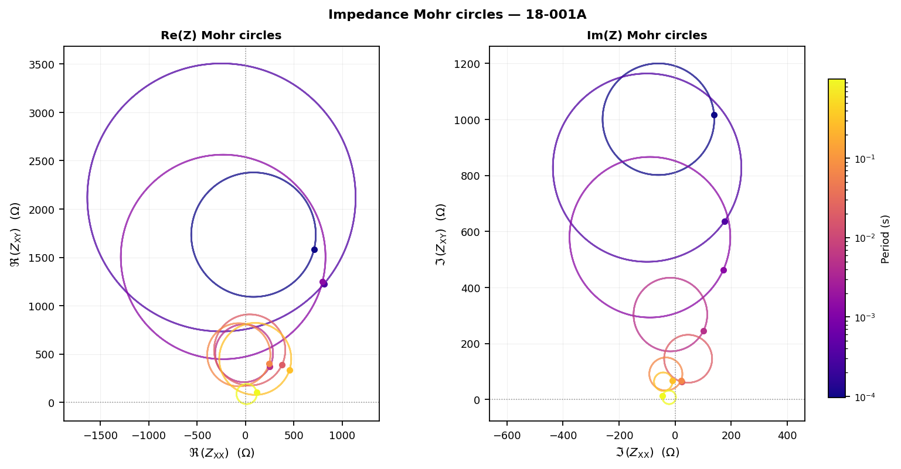

Interpretation
    A 1-D response collapses toward points. A 2-D response produces circles
    that pass through the origin. A 3-D response produces circles offset from
    the origin. Strongly period-dependent offsets are a warning that simple
    dimensional assumptions should be checked with phase tensor and skew tools.

Argand Trajectories
~~~~~~~~~~~~~~~~~~~

Function
    :func:`pycsamt.emtools.advanced.plot_zt_argand`

Purpose
    Show impedance components directly in the complex plane, using period as
    the trajectory coordinate.

Implementation
    The function extracts each requested component, sorts samples by period,
    plots ``Re(Z_ij)`` against ``Im(Z_ij)``, color-codes by period, and adds
    arrows in the direction of increasing period.

    For component :math:`Z_{ij}`, the plotted trajectory is

    .. math::

       \gamma_{ij}(T)
       =
       \left(
       \Re Z_{ij}(T),
       \Im Z_{ij}(T)
       \right).

    With ``normalize=True``, the component is divided by a robust amplitude
    scale before plotting, so the diagram emphasizes trajectory shape rather
    than absolute impedance magnitude.

Key parameters
    ``components`` controls the tensor entries; ``period_range`` isolates a
    band; ``normalize=True`` removes amplitude and emphasizes trajectory
    shape.

.. code-block:: python
   :linenos:

   from pycsamt.emtools.advanced import plot_zt_argand

   fig = plot_zt_argand(
       sites,
       station="18-001A",
       components=("xy", "yx"),
       period_range=(1e-3, 10.0),
       normalize=False,
       recursive=False,
   )
   fig.savefig(out / "argand_18-001A.png", dpi=200)

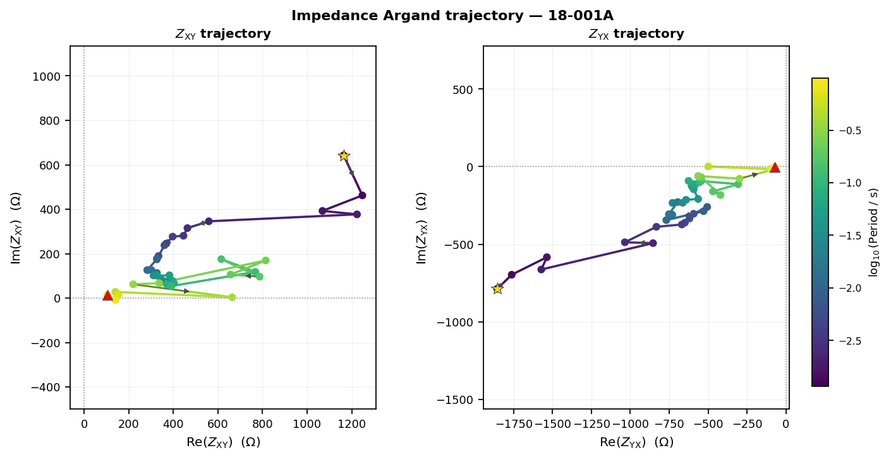

Interpretation
    Smooth, simple trajectories are easier to reconcile with layered
    structure. Loops, sharp bends, or large differences between ``Zxy`` and
    ``Zyx`` indicate lateral complexity, distortion, or component-specific
    problems.

Bode Rho-Phase Consistency
~~~~~~~~~~~~~~~~~~~~~~~~~~

Function
    :func:`pycsamt.emtools.advanced.plot_rho_phase_bode`

Purpose
    Test whether observed phase is consistent with the local slope of
    apparent resistivity under a minimum-phase assumption.

Implementation
    The function computes an approximate Bode phase,

    .. math::

       \phi_{Bode}(T) \approx 45^\circ
       \left(1 + {d\log\rho_a \over d\log T}\right),

    and compares it to the observed phase.

    In the code, the derivative is estimated on the sampled curve
    :math:`\log_{10}\rho_a` versus :math:`\log_{10}T`:

    .. math::

       s(T)
       =
       {d\log_{10}\rho_a \over d\log_{10}T},
       \qquad
       \phi_\mathrm{Bode}(T)
       =
       45^\circ(1+s(T)).

    The shaded area in the plot is the discrepancy between
    :math:`\phi_\mathrm{obs}` and :math:`\phi_\mathrm{Bode}`.

Key parameters
    ``component`` chooses ``"xy"`` or ``"yx"``; ``smooth_window`` applies a
    centered moving average before the derivative is estimated.

.. code-block:: python
   :linenos:

   from pycsamt.emtools.advanced import plot_rho_phase_bode

   fig = plot_rho_phase_bode(
       sites,
       station="18-001A",
       component="xy",
       smooth_window=1,
       recursive=False,
   )
   fig.savefig(out / "bode_consistency_18-001A.png", dpi=200)

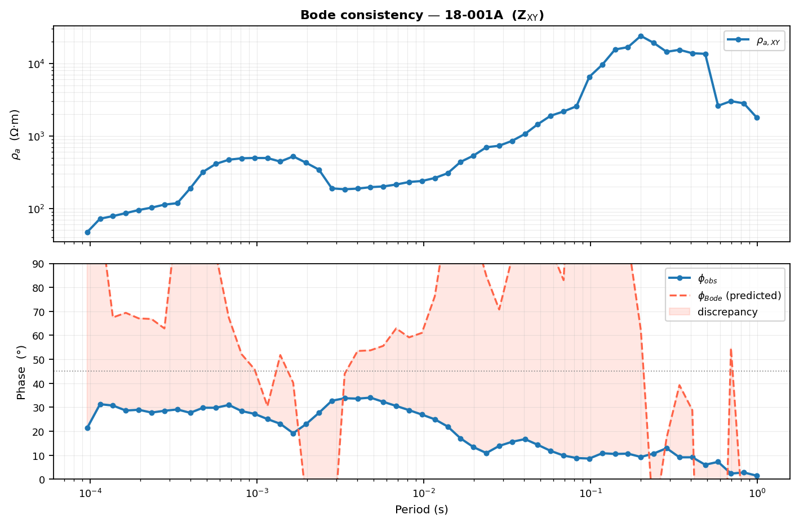

Interpretation
    If observed and predicted phase track one another, the response is more
    consistent with minimum-phase behaviour. Persistent separation can indicate
    galvanic distortion, source effects, or a response that is too complex for
    a simple layered model.

Apparent-Resistivity Polar Diagram
~~~~~~~~~~~~~~~~~~~~~~~~~~~~~~~~~~

Function
    :func:`pycsamt.emtools.advanced.plot_apparent_resistivity_polar`

Purpose
    Inspect directional dependence of apparent resistivity as the impedance
    tensor is rotated.

Implementation
    For selected periods, the tensor is rotated through 360 degrees and
    ``rho_a_xy(theta)`` is computed at each angle. Each period becomes one
    polar petal.

    The petal radius is

    .. math::

       r_\rho(\theta, f)
       =
       \rho_{a,xy}(\theta, f)
       =
       {0.2 \over f}
       |Z_{\theta,xy}(f)|^2.

    With ``normalize=True``, each period is scaled by its own maximum:

    .. math::

       \tilde{r}_\rho(\theta, f)
       =
       {r_\rho(\theta, f) \over \max_\theta r_\rho(\theta, f)}.

    This lets the user compare directional shape across periods even when
    absolute apparent resistivity changes strongly.

Key parameters
    ``n_periods`` controls the number of petals; ``normalize=True`` emphasizes
    petal shape rather than amplitude; ``period_range`` restricts periods.

.. code-block:: python
   :linenos:

   from pycsamt.emtools.advanced import plot_apparent_resistivity_polar

   fig = plot_apparent_resistivity_polar(
       sites,
       station="18-001A",
       n_periods=8,
       normalize=True,
       recursive=False,
   )
   fig.savefig(out / "rho_polar_18-001A.png", dpi=200)

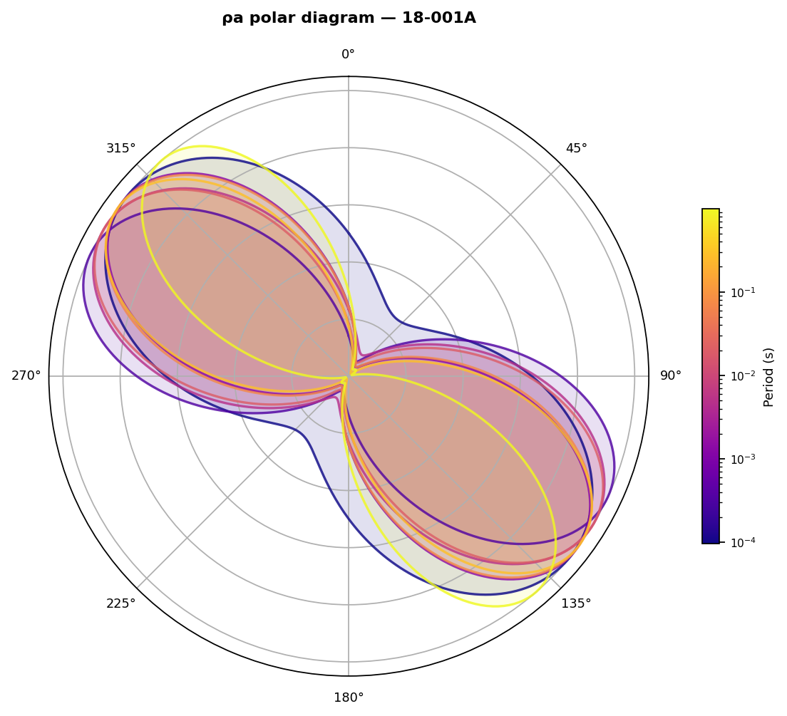

Interpretation
    Circular petals indicate weak directional dependence. Elongated petals
    indicate anisotropy or 2-D behaviour. Petals whose orientation rotates
    with period suggest depth-dependent structure or distortion.

Phase-Tensor Period Clock
~~~~~~~~~~~~~~~~~~~~~~~~~

Function
    :func:`pycsamt.emtools.advanced.plot_pt_period_clock`

Purpose
    Compress phase-tensor strike and ellipticity across period into one
    radial figure.

Implementation
    The function builds the phase-tensor table, chooses log-spaced period
    rings, and draws an ellipse on each ring. If ``station`` is omitted, it
    uses survey-median values.

    The phase tensor is

    .. math::

       \boldsymbol{\Phi}(f)
       =
       \Re(\mathbf{Z}(f))^{-1}
       \Im(\mathbf{Z}(f)).

    Each ring uses the median phase-tensor strike
    :math:`\theta_\Phi` and ellipticity :math:`e_\Phi` in that period
    neighborhood.  The ellipse is rotated by :math:`\theta_\Phi`; its
    minor axis is shortened as ellipticity grows.

Key parameters
    ``station`` switches between station-specific and survey-median mode;
    ``n_rings`` controls period sampling; ``period_range`` clips the depth
    window.

.. code-block:: python
   :linenos:

   from pycsamt.emtools.advanced import plot_pt_period_clock

   fig = plot_pt_period_clock(
       sites,
       station="18-001A",
       n_rings=7,
       period_range=(1e-3, 10.0),
       recursive=False,
   )
   fig.savefig(out / "pt_clock_18-001A.png", dpi=200)

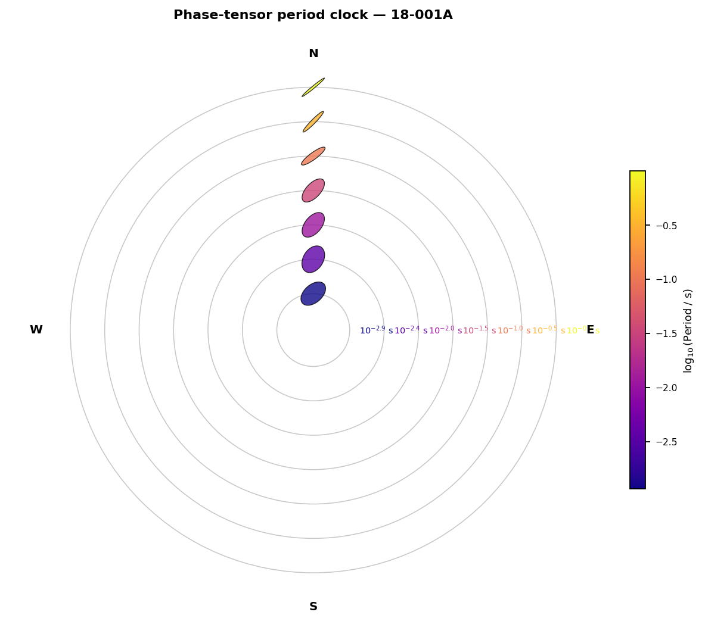

Interpretation
    Stable ellipse orientation suggests a persistent structural direction.
    Rotation with period suggests depth-dependent strike or 3-D structure.
    Strong elongation indicates phase-tensor anisotropy.

Dimensionality Ternary
~~~~~~~~~~~~~~~~~~~~~~

Function
    :func:`pycsamt.emtools.advanced.plot_dimensionality_ternary`

Purpose
    Display station-period cells as continuous 1-D, 2-D, and 3-D memberships
    instead of forcing a hard class too early.

Implementation
    The function derives phase-tensor skew and ellipticity from
    :func:`pycsamt.emtools.tensor.build_phase_tensor_table`. Skew controls
    3-D membership, while ellipticity helps separate 1-D and 2-D behaviour
    when skew is low.

    The soft memberships are

    .. math::

       u_{3D}
       =
       \operatorname{clip}
       \left({|\beta| \over \beta_\mathrm{th}},0,1\right),

    .. math::

       u_{1D}
       =
       (1-u_{3D})
       \operatorname{clip}
       \left(1-{e \over e_\mathrm{th}},0,1\right),
       \qquad
       u_{2D}=1-u_{1D}-u_{3D}.

    Here :math:`\beta` is phase-tensor skew, :math:`e` is ellipticity,
    and the thresholds are ``beta_thresh`` and ``ellipt_thresh``.  The
    plotted ternary point is the barycentric coordinate
    :math:`(u_{1D},u_{2D},u_{3D})`.

Key parameters
    ``beta_thresh`` controls how quickly skew maps to 3-D membership;
    ``ellipt_thresh`` controls ellipticity sensitivity; ``period_range``
    selects the band.

.. code-block:: python
   :linenos:

   from pycsamt.emtools.advanced import plot_dimensionality_ternary

   fig = plot_dimensionality_ternary(
       sites,
       beta_thresh=5.0,
       ellipt_thresh=0.1,
       period_range=(1e-3, 10.0),
       recursive=False,
   )
   fig.savefig(out / "dimensionality_ternary.png", dpi=200)

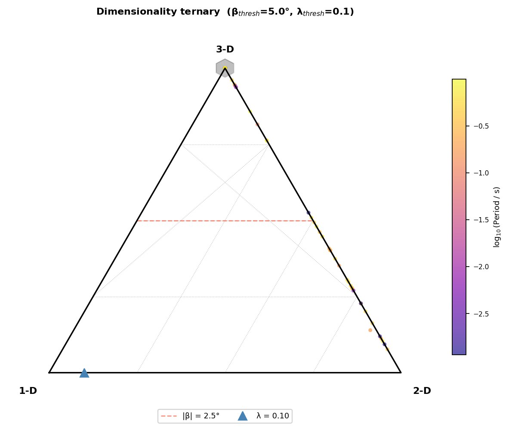

Interpretation
    A cloud near the 1-D corner supports simple layered assumptions. A cloud
    along the 2-D edge suggests strike analysis may be meaningful. A cloud near
    the 3-D corner warns against simple 1-D or 2-D inversion assumptions.

Distortion Radar
~~~~~~~~~~~~~~~~

Function
    :func:`pycsamt.emtools.advanced.plot_distortion_radar`

Purpose
    Compare several distortion proxies at selected stations.

Implementation
    Each station is summarized by multiple normalized proxies, including
    Swift-style behaviour, Bahr-style behaviour, phase asymmetry, absolute
    skew, ellipticity-related behaviour, and strike instability. Each station
    becomes one polygon.

    Two of the radar axes are

    .. math::

       \nu =
       {|Z_{xx}+Z_{yy}|
       \over
       |Z_{xy}-Z_{yx}|+\varepsilon},
       \qquad
       \eta =
       {|Z_{xy}+Z_{yx}|
       \over
       |Z_{xy}-Z_{yx}|+\varepsilon}.

    They are converted to bounded scores with
    :math:`s=\nu/(1+\nu)` or :math:`s=\eta/(1+\eta)`.  Phase asymmetry is
    summarized from :math:`|\phi_{xy}+\phi_{yx}-180^\circ|/90^\circ`,
    while strike instability comes from the interquartile range of
    phase-tensor strike angles in the selected band.

Key parameters
    ``stations`` selects named stations; ``max_stations`` limits automatic
    selection; ``period_range`` controls the summary band.

.. code-block:: python
   :linenos:

   from pycsamt.emtools.advanced import plot_distortion_radar

   fig = plot_distortion_radar(
       sites,
       max_stations=8,
       period_range=(1e-3, 10.0),
       recursive=False,
   )
   fig.savefig(out / "distortion_radar.png", dpi=200)

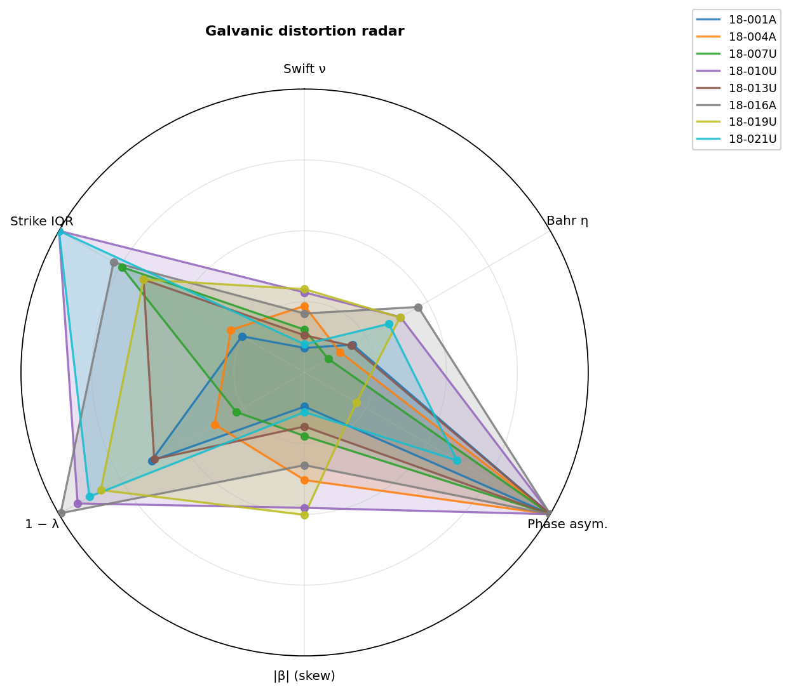

Interpretation
    Compact polygons suggest lower distortion. Large polygons or stations
    with very different shapes deserve closer station-level review before
    inversion.

Sensitivity-Depth Section
~~~~~~~~~~~~~~~~~~~~~~~~~

Function
    :func:`pycsamt.emtools.advanced.plot_sensitivity_depth_section`

Purpose
    Show where each station-period datum is sensitive in pseudo-depth space.

Implementation
    For each valid apparent-resistivity datum, the function computes Bostick
    depth,

    .. math::

       d_B = \sqrt{\rho_a / (\mu_0 2 \pi f)},

    then draws a vertical bar centered at that depth. Color encodes
    ``rho_a`` and bar height approximates the sensitivity window from local
    ``d log rho_a / d log T``.

    The local slope is

    .. math::

       q(T)
       =
       {d\log_{10}\rho_a \over d\log_{10}T}.

    Large changes in this slope imply a broader or less stable pseudo-depth
    contribution, so read the section as sensitivity coverage rather than as
    a resolved layer boundary.

Key parameters
    ``component`` selects ``"xy"`` or ``"yx"``; ``depth_unit`` selects
    ``"km"`` or ``"m"``; ``depth_max`` clips the view; ``rho_lim`` fixes
    color limits across surveys.

.. code-block:: python
   :linenos:

   from pycsamt.emtools.advanced import plot_sensitivity_depth_section

   fig = plot_sensitivity_depth_section(
       sites,
       component="xy",
       depth_unit="km",
       depth_max=5.0,
       recursive=False,
   )
   fig.savefig(out / "sensitivity_depth_xy.png", dpi=200)

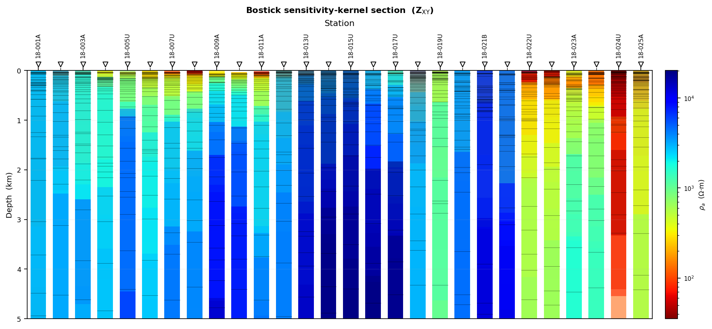

Interpretation
    Dense overlapping bars indicate stronger depth coverage. Gaps indicate
    weak coverage. Very broad windows mean lower vertical resolution.

Apparent-Anisotropy Section
~~~~~~~~~~~~~~~~~~~~~~~~~~~

Function
    :func:`pycsamt.emtools.advanced.plot_apparent_anisotropy_section`

Purpose
    Compare the two off-diagonal apparent-resistivity modes along the profile.

Implementation
    The plotted value is ``log10(rho_xy / rho_yx)``. Warm cells mean
    ``rho_xy`` is larger; cool cells mean ``rho_yx`` is larger.

    The displayed proxy is

    .. math::

       A_\rho
       =
       \log_{10}
       \left({\rho_{xy}\over\rho_{yx}}\right).

    Thus :math:`A_\rho=0` means the two off-diagonal modes agree,
    :math:`A_\rho=1` means :math:`\rho_{xy}` is ten times
    :math:`\rho_{yx}`, and :math:`A_\rho=-1` means the reverse.

Key parameters
    ``show_pt_arrows=True`` overlays phase-tensor principal-axis directions;
    ``arrow_every`` thins the arrows; ``vmax`` sets symmetric color limits.

.. code-block:: python
   :linenos:

   from pycsamt.emtools.advanced import plot_apparent_anisotropy_section

   fig = plot_apparent_anisotropy_section(
       sites,
       period_range=(1e-3, 10.0),
       show_pt_arrows=True,
       arrow_every=3,
       vmax=1.0,
       recursive=False,
   )
   fig.savefig(out / "apparent_anisotropy.png", dpi=200)

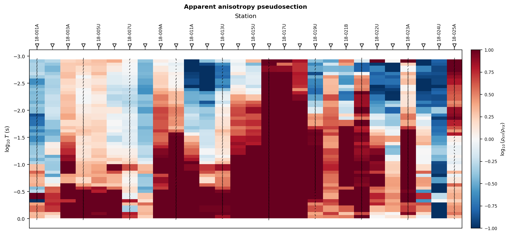

Interpretation
    Coherent warm or cool bands can indicate profile-scale anisotropy or
    structural directionality. Isolated station anomalies often point to local
    distortion or station problems.

Dimensionality-Depth Profile
~~~~~~~~~~~~~~~~~~~~~~~~~~~~

Function
    :func:`pycsamt.emtools.advanced.plot_dimensionality_depth_profile`

Purpose
    Place dimensionality membership into pseudo-depth space.

Implementation
    Phase-tensor skew and ellipticity are converted into 3-D membership. Each
    period sample is placed at Bostick depth using the selected impedance
    component.

    The color value is

    .. math::

       u_{3D}
       =
       \operatorname{clip}
       \left({|\beta| \over \beta_\mathrm{th}},0,1\right),

    the same 3-D membership used by the ternary plot.  The vertical
    coordinate is pseudo-depth, so clusters of high :math:`u_{3D}` mark
    depth intervals where simple dimensional assumptions are least reliable.

Key parameters
    ``component`` controls the apparent resistivity used for depth;
    ``beta_thresh`` and ``ellipt_thresh`` control membership sensitivity;
    ``depth_max`` clips the displayed pseudo-depth range.

.. code-block:: python
   :linenos:

   from pycsamt.emtools.advanced import plot_dimensionality_depth_profile

   fig = plot_dimensionality_depth_profile(
       sites,
       component="xy",
       beta_thresh=5.0,
       ellipt_thresh=0.1,
       depth_max=5.0,
       recursive=False,
   )
   fig.savefig(out / "dimensionality_depth.png", dpi=200)

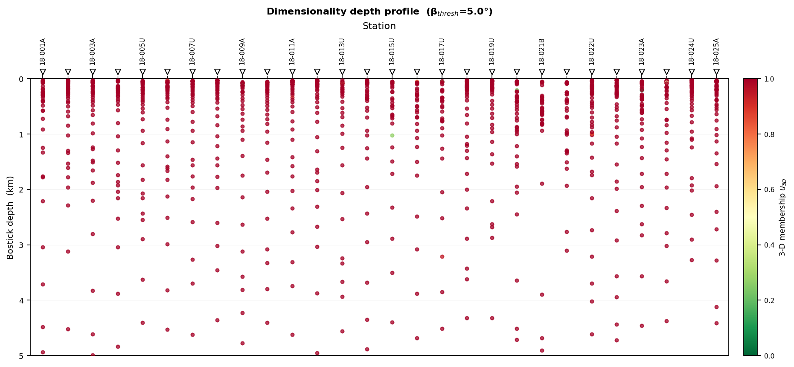

Interpretation
    High 3-D membership at depth warns against simple inversion assumptions in
    that interval. Shallow isolated anomalies should be compared with
    static-shift and QC outputs.

Z Rotation-Invariants Section
~~~~~~~~~~~~~~~~~~~~~~~~~~~~~

Function
    :func:`pycsamt.emtools.advanced.plot_z_invariants_section`

Purpose
    Inspect impedance quantities that are less dependent on coordinate
    rotation than raw components.

Implementation
    The four panels are Swift ``nu``, Bahr ``mu``, ``sqrt(abs(det Z))``, and
    an anisotropy proxy based on trace magnitude relative to the difference
    between off-diagonal magnitudes.

    The determinant panel uses

    .. math::

       |\det\mathbf{Z}|^{1/2}
       =
       |Z_{xx}Z_{yy}-Z_{xy}Z_{yx}|^{1/2}.

    The trace-difference proxy uses

    .. math::

       \chi
       =
       {|Z_{xx}+Z_{yy}|
       \over
       ||Z_{xy}|-|Z_{yx}||+\varepsilon}.

    These panels are more robust than single raw tensor components, but
    high values should still be treated as prompts for closer review rather
    than standalone geological labels.

Key parameters
    ``period_range`` isolates a band; ``station_order`` preserves profile
    order; ``axes`` embeds the four panels in a custom figure.

.. code-block:: python
   :linenos:

   from pycsamt.emtools.advanced import plot_z_invariants_section

   fig = plot_z_invariants_section(
       sites,
       period_range=(1e-3, 10.0),
       recursive=False,
   )
   fig.savefig(out / "z_invariants.png", dpi=200)

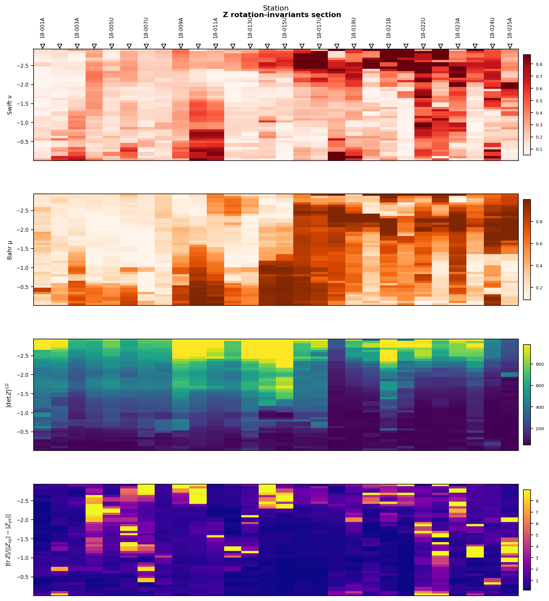

Interpretation
    Low Swift and Bahr values are more compatible with 2-D assumptions. High
    persistent values warn of distortion or 3-D structure. The determinant
    panel gives a useful mode-independent amplitude proxy.

Survey Fingerprint
~~~~~~~~~~~~~~~~~~

Function
    :func:`pycsamt.emtools.advanced.plot_survey_fingerprint`

Purpose
    Put multiple phase-tensor metrics for the entire survey on one compact
    page.

Implementation
    Each panel is a station-by-log-period image. Default quantities include
    skew, ellipticity, strike angle, and maximum phase. Optional quantities
    include minimum phase and absolute skew.

    The fingerprint is useful because all panels share the same grid
    :math:`(s,\log_{10}T)`.  A feature visible in only one metric may be
    metric-specific; a feature that aligns across skew, ellipticity, strike,
    and phase is harder to dismiss.

Key parameters
    ``quantities`` selects metrics; ``cell_aspect`` changes cell proportions;
    ``station_order`` fixes station sequence.

.. code-block:: python
   :linenos:

   from pycsamt.emtools.advanced import plot_survey_fingerprint

   fig = plot_survey_fingerprint(
       sites,
       quantities=["skew", "ellipt", "theta", "s1", "beta"],
       period_range=(1e-3, 10.0),
       recursive=False,
   )
   fig.savefig(out / "survey_fingerprint.png", dpi=200)

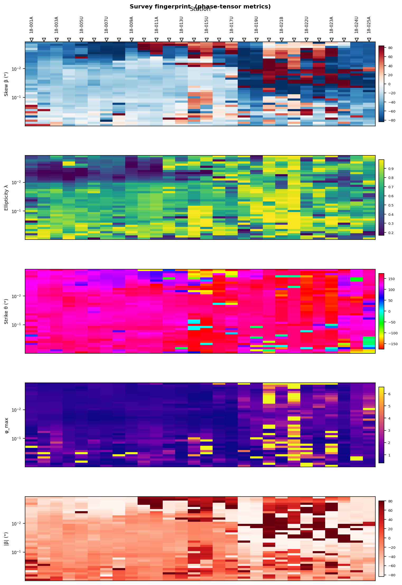

Interpretation
    Use this as a review dashboard. Look for bands that align across metrics:
    high skew with high ellipticity, abrupt strike changes, or stations that
    stand apart from their neighbors.

MT Composite Section
~~~~~~~~~~~~~~~~~~~~

Function
    :func:`pycsamt.emtools.advanced.plot_mt_composite_section`

Purpose
    Align several common MT diagnostics on a shared station-period grid.

Implementation
    The function can display apparent resistivity, phase, absolute skew,
    strike, and SNR. Apparent resistivity is displayed in log10 space.

    The default rows combine

    .. math::

       \log_{10}\rho_a,\quad
       \phi,\quad
       |\beta|,\quad
       \theta_\Phi,\quad
       \mathrm{SNR}

    on the same station-period grid.  This lets you reject a tempting
    resistivity feature if it occurs exactly where skew is high or SNR is
    weak.

Key parameters
    ``component`` chooses ``"xy"`` or ``"yx"`` for rho, phase, and SNR;
    ``quantities`` controls rows.

.. code-block:: python
   :linenos:

   from pycsamt.emtools.advanced import plot_mt_composite_section

   fig = plot_mt_composite_section(
       sites,
       component="xy",
       quantities=["rho", "phase", "skew", "theta", "snr"],
       period_range=(1e-3, 10.0),
       recursive=False,
   )
   fig.savefig(out / "mt_composite_xy.png", dpi=200)

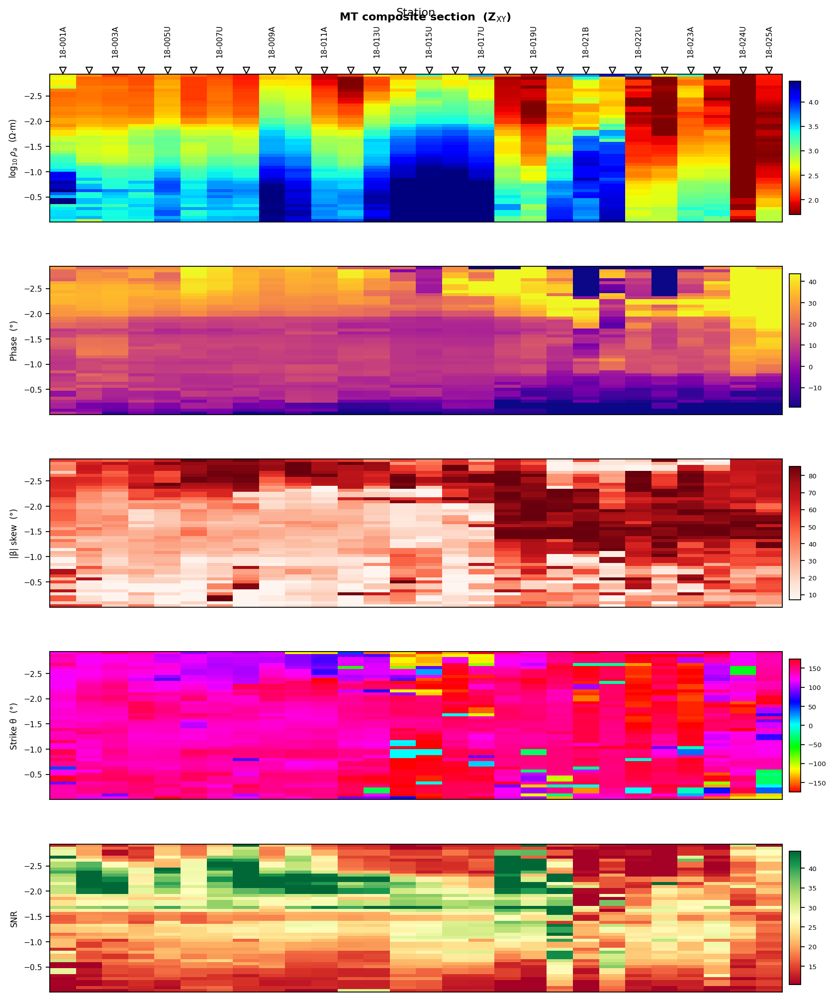

Interpretation
    This is a compact report figure. It helps catch suspicious interpretations
    because rho, phase, skew, strike, and SNR are viewed on the same grid.

SNR Section
~~~~~~~~~~~

Function
    :func:`pycsamt.emtools.advanced.plot_snr_section`

Purpose
    Display signal-to-noise ratio by station, period, and component.

Implementation
    SNR is computed as ``abs(Z) / abs(Z_err)`` when impedance errors are
    available. Each selected component gets its own panel. A contour marks
    ``snr_thresh``.

    For component :math:`Z_{ij}`, the plotted quantity is

    .. math::

       \mathrm{SNR}_{ij}
       =
       {|Z_{ij}| \over |\sigma_{Z_{ij}}|+\varepsilon}.

    When no impedance-error array is available, the function fills the
    corresponding cells with ``NaN`` rather than inventing a confidence
    estimate.

Key parameters
    ``components`` usually includes ``("xy", "yx")``; ``snr_thresh`` sets the
    review threshold; ``vmax`` clips high-SNR cells so structure near the
    threshold remains visible.

.. code-block:: python
   :linenos:

   from pycsamt.emtools.advanced import plot_snr_section

   fig = plot_snr_section(
       sites,
       components=("xy", "yx"),
       snr_thresh=3.0,
       vmax=10.0,
       recursive=False,
   )
   fig.savefig(out / "snr_section.png", dpi=200)

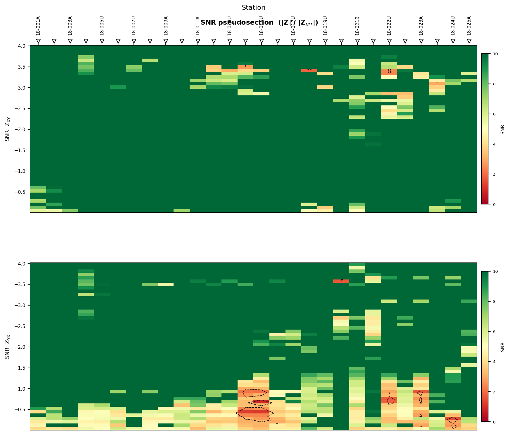

Interpretation
    Cells below the threshold contour should be treated cautiously. If an
    entire frequency band has poor SNR, avoid over-interpreting that band.

Strike-Stability Bands
~~~~~~~~~~~~~~~~~~~~~~

Function
    :func:`pycsamt.emtools.advanced.plot_strike_stability_bands`

Purpose
    Compare strike estimates across period and method.

Implementation
    The function computes or collects multiple strike indicators and plots
    period-dependent bands so method agreement and period stability are visible
    together.

    Strike is axial, so agreement is evaluated with wrapped angular
    differences:

    .. math::

       \Delta\theta
       =
       ((\theta_1-\theta_2+90^\circ)\bmod 180^\circ)-90^\circ.

    The consensus band marks periods where methods fall within
    ``agreement_tol`` degrees on this axial scale.

Key parameters
    ``methods`` chooses strike estimators; ``period_range`` isolates a band.
    Use this after basic phase-tensor and dimensionality checks.

.. code-block:: python
   :linenos:

   from pycsamt.emtools.advanced import plot_strike_stability_bands

   fig = plot_strike_stability_bands(
       sites,
       methods=("pt", "swift", "bahr"),
       period_range=(1e-3, 10.0),
       recursive=False,
   )
   fig.savefig(out / "strike_stability.png", dpi=200)

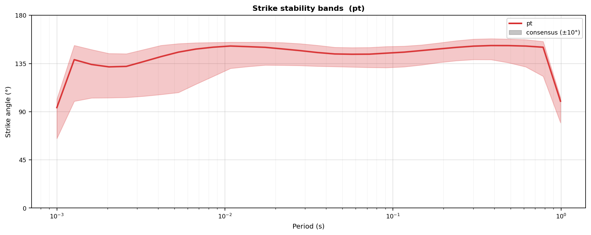

Interpretation
    Stable overlapping bands support a consistent strike direction. Wide bands
    or disagreement between methods suggest 3-D structure, distortion, or an
    unsuitable period band.

Transfer-Function Coherence Network
~~~~~~~~~~~~~~~~~~~~~~~~~~~~~~~~~~~

Function
    :func:`pycsamt.emtools.advanced.plot_tf_coherence_network`

Purpose
    Visualize station-to-station similarity using transfer-function curves.

Implementation
    Stations are placed at their coordinates. The function interpolates
    log-apparent-resistivity curves onto a common period grid, computes
    Pearson correlation for station pairs, and draws edges for correlations
    above ``threshold``.

    For station :math:`s`, let :math:`\mathbf{r}_s` be the interpolated
    :math:`\log_{10}\rho_a(T)` vector.  An edge is drawn when

    .. math::

       \operatorname{corr}(\mathbf{r}_s,\mathbf{r}_t) \ge \tau,

    where :math:`\tau` is ``threshold``.  The network compares curve shape
    over the selected band, not a single period sample.

Key parameters
    ``component`` chooses the mode; ``threshold`` sets minimum correlation;
    ``max_edges`` prevents unreadable graphs; ``node_c_by`` colors nodes by a
    station summary metric such as skew, ellipticity, or resistivity.

.. code-block:: python
   :linenos:

   from pycsamt.emtools.advanced import plot_tf_coherence_network

   fig = plot_tf_coherence_network(
       sites,
       component="xy",
       period_range=(1e-3, 10.0),
       threshold=0.90,
       max_edges=120,
       node_c_by="skew",
       recursive=False,
   )
   fig.savefig(out / "tf_coherence_network.png", dpi=200)

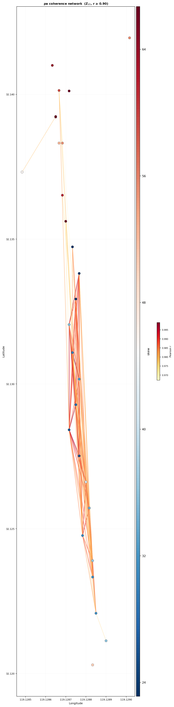

Interpretation
    Connected stations have similar response curves in the selected band.
    Isolated stations may be outliers, locally distorted, poorly located, or
    geologically distinct. This function requires finite station coordinates.

Embedding Advanced Plots
~~~~~~~~~~~~~~~~~~~~~~~~

Most functions accept ``ax`` or ``axes`` so you can assemble multi-panel report
figures.

.. code-block:: python
   :linenos:

   import matplotlib.pyplot as plt

   from pycsamt.emtools.advanced import plot_rho_phase_bode, plot_snr_section

   fig, axes = plt.subplots(3, 1, figsize=(9, 10))

   plot_rho_phase_bode(
       sites,
       station="18-001A",
       component="xy",
       axes=axes[:2],
       recursive=False,
   )

   plot_snr_section(
       sites,
       components=("xy",),
       axes=[axes[2]],
       recursive=False,
   )

   fig.savefig(out / "advanced_report_panel.png", dpi=200)

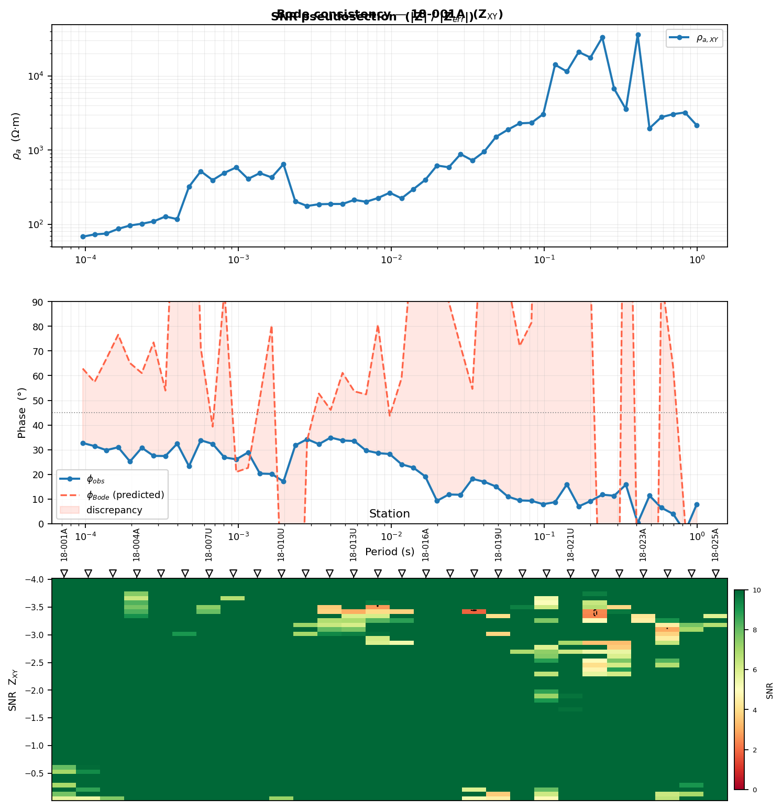

If you supply axes, the count must match the function. For example,
``plot_rho_phase_bode`` needs two axes, and
``plot_z_invariants_section`` needs four.

Failure Modes And Checks
~~~~~~~~~~~~~~~~~~~~~~~~

No impedance data
    Check that files contain valid Z blocks and that ``ensure_sites`` did not
    skip all stations.

No phase-tensor data
    Phase-tensor diagnostics require finite impedance components.

No coordinates
    ``plot_tf_coherence_network`` requires finite station coordinates.

Crowded labels
    Increase ``figsize``, pass a station subset, or save at higher DPI.

Weak period bands
    Compare advanced plots with QC and SNR figures. A coherent-looking
    pattern in a low-SNR band is weak evidence.

Worked Example
--------------

The full Sphinx-gallery example runs the advanced functions on the
repository's **L18PLT** example survey
(``data/AMT/WILLY_DATA/L18PLT``). It starts with single-station tensor
diagnostics, then moves through dimensionality, distortion,
pseudosections, survey fingerprints, SNR, strike stability, and the
transfer-function coherence network.

Open the rendered gallery page here:
:ref:`sphx_glr_examples_emtools_plot_advanced.py`.
