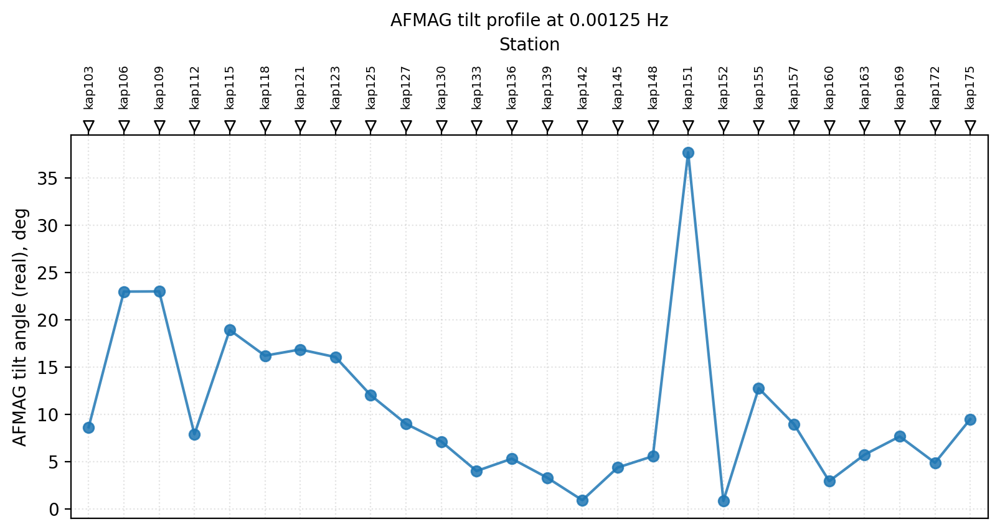
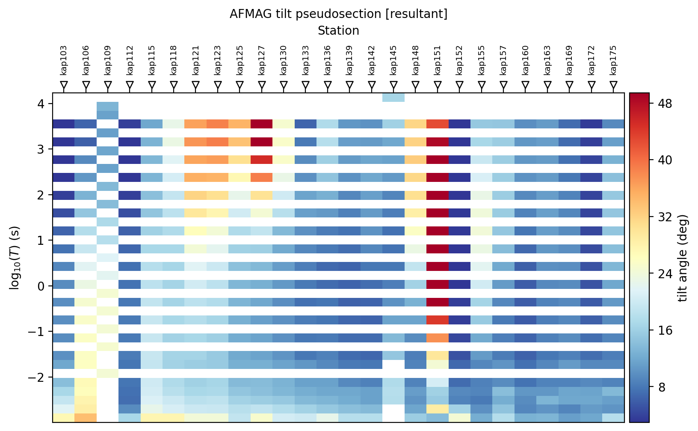
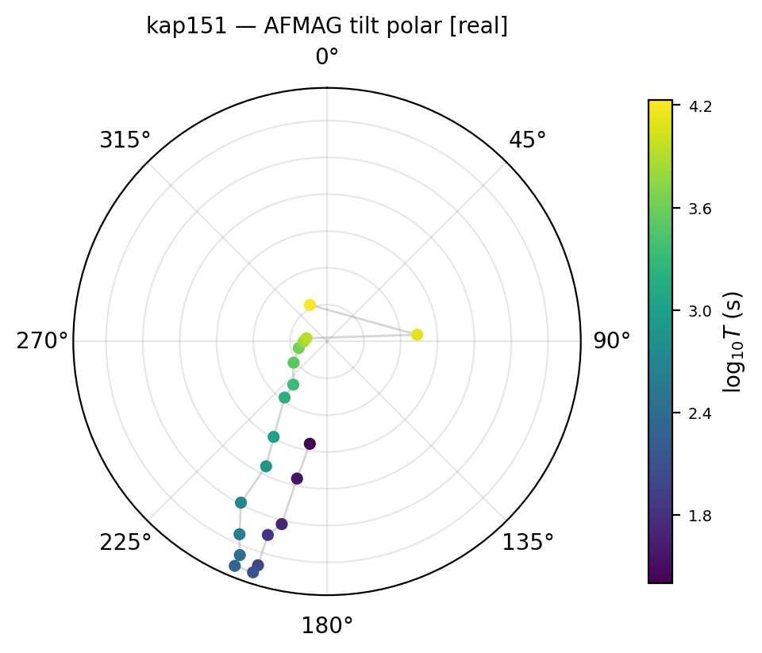
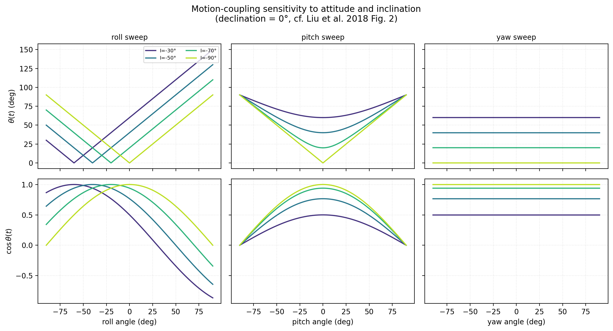
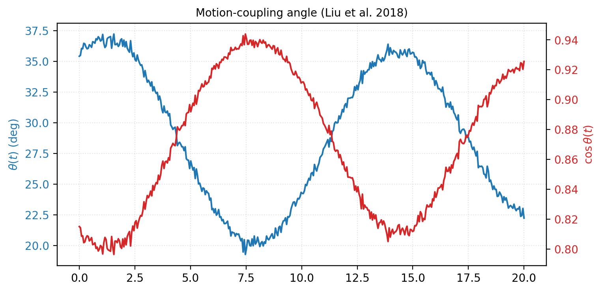
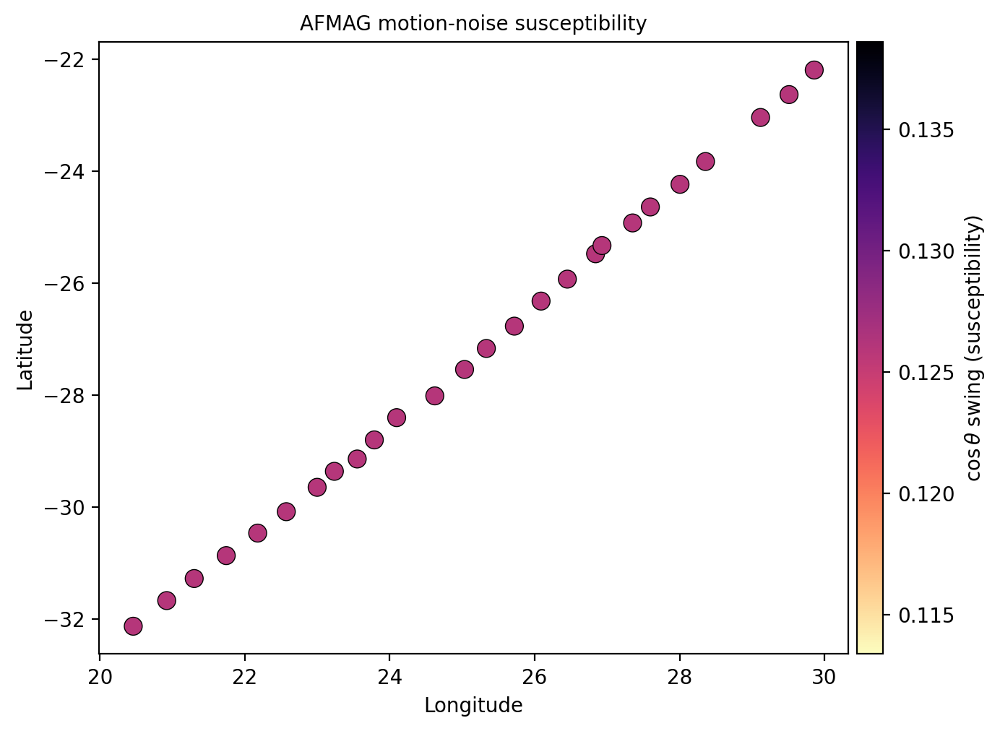
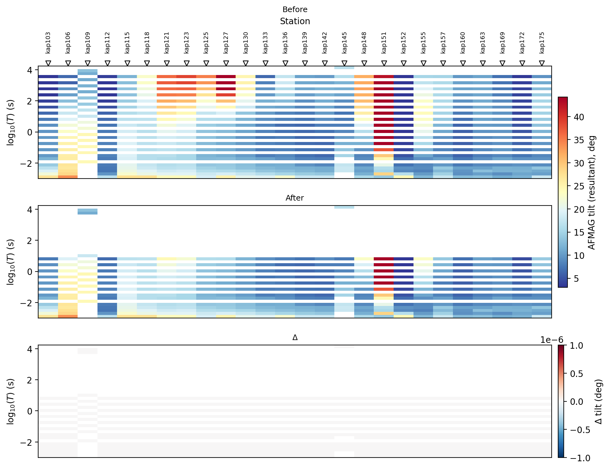

.. _emtools_afmag:

AFMAG Tilt-Angle Diagnostics And Motion-Coupling Physics
==========================================================

AFMAG (audio-frequency magnetics) is a passive electromagnetic method
with no electric-field channel [Ward1959]_.  Where a full MT survey
records the horizontal electric and magnetic fields to build an
impedance tensor, AFMAG systems -- whether the historical two-coil
comparator or a modern tensor system such as ZTEM/AirMt -- work from
magnetic-field components alone.  The historical readout is a scalar
"tilt angle" describing how far the resultant magnetic-field
polarization ellipse departs from horizontal; the modern readout is a
full interstation magnetic transfer function.  Both are, in the
transfer-function language pyCSAMT already uses everywhere else, the
same object as the :term:`tipper`,

.. math::

   H_z(f) = T_x(f)\,H_x(f) + T_y(f)\,H_y(f),

with :math:`T_x` and :math:`T_y` the complex, frequency-dependent
tipper components.  ``pycsamt.emtools.afmag`` is therefore built
entirely on :attr:`Site.tipper <pycsamt.site.base.Site.tipper>`, the
same array every other tipper tool in :mod:`pycsamt.emtools` reads --
see :ref:`emtools_tf` -- and never touches ``Site.z``.

This page covers two genuinely different pieces of work that share one
module:

.. list-table::
   :header-rows: 1
   :widths: 30 32 38

   * - Piece
     - Main tools
     - Purpose
   * - Tilt-angle diagnostics
     - ``afmag_tilt_angles``, ``plot_afmag_tilt_profile``,
       ``plot_afmag_tilt_psection``, ``plot_afmag_tilt_polar``
     - Read a classical AFMAG tilt angle out of already-assembled
       tipper data.
   * - Motion-coupling physics and QC
     - ``euler_rotation_matrix``, ``motion_coupling_cosine``,
       ``motion_susceptibility_table``,
       ``flag_motion_susceptible_band``
     - Simulate and flag the platform-attitude noise described by
       [Liu2018]_, using raw attitude and geomagnetic geometry rather
       than tipper data.

All public functions used below are exported from ``pycsamt.emtools``.

Use A Dataset With Tipper
--------------------------

There is no bundled AFMAG survey in pyCSAMT -- ``data/AFMAG/`` contains
only the [Liu2018]_ reference paper, not a sample delivery, because no
AFMAG vendor has supplied one (see the project's airborne-EM roadmap
for that decision).  The examples on this page instead reuse the
bundled KAP03 long-period MT profile, the same 26-station survey used
throughout :ref:`emtools_tf`, purely as a source of a genuine complex
``(Tx, Ty)`` tipper.  **KAP03 is a ground MT survey, not an airborne
AFMAG survey** -- it is reused here only because AFMAG's tilt angle and
the MT tipper are mathematically the same quantity, so KAP03's real
tipper is a legitimate, reproducible input for exercising the tilt-angle
transformation.  Nothing about attitude, altitude, or flight geometry
in the figures below is real; that part is demonstrated separately,
below, with an explicitly synthetic attitude time series.

.. code-block:: pycon

   >>> from pathlib import Path
   >>> from pycsamt.emtools import ensure_sites
   >>> edi_dir = Path("data/MT/kap03lmt_edis")
   >>> sites = ensure_sites(edi_dir, recursive=True, strict=False)
   >>> print(len(sites), "stations")
   26 stations

What The Tilt Angle Represents
-------------------------------

Ward's original AFMAG comparator reported an in-phase and a quadrature
tilt reading from two crossed receiver coils [Ward1959]_.  In tipper
terms, treating the resultant horizontal-to-vertical ratio as a small
angle,

.. math::

   \theta_\mathrm{tilt}(f) = \arctan\bigl|\mathbf{T}_c(f)\bigr|,
   \qquad
   \bigl|\mathbf{T}_c(f)\bigr| = \sqrt{T_{x,c}(f)^2 + T_{y,c}(f)^2},

where :math:`c` selects the real (in-phase), imaginary (quadrature),
or complex-magnitude component of the tipper -- exactly the same
component split :ref:`emtools_tf` uses for induction arrows.  Using
:math:`\arctan` rather than the ratio itself keeps the reported angle
bounded as :math:`|\mathbf{T}_c|` grows, and reduces to the classical
small-angle reading (:math:`\theta \approx |\mathbf{T}_c|` in radians)
whenever the ratio is genuinely small, which is the normal case.
``afmag_tilt_angles`` returns this quantity, in degrees, for every
station and frequency, as a tidy table -- the same
``sites``-in/``DataFrame``-out shape as
:func:`~pycsamt.emtools.spectra.psd_table` and
:func:`~pycsamt.emtools.spectra.coherence_table`:

.. code-block:: pycon

   >>> from pycsamt.emtools import afmag_tilt_angles
   >>> table = afmag_tilt_angles(sites)
   >>> table.shape
   (518, 8)
   >>> list(table.columns)
   ['station', 'freq', 'period', 'tilt_real_deg', 'tilt_real_azimuth_deg', 'tilt_imag_deg', 'tilt_imag_azimuth_deg', 'tilt_resultant_deg']

Each row is one station-frequency sample.  ``tilt_real_deg`` and
``tilt_imag_deg`` are the in-phase and quadrature readings; the
``_azimuth_deg`` columns record the same real/imaginary induction-arrow
direction :ref:`emtools_tf` already plots, now labelled for AFMAG's amplitude
reading rather than a map direction; ``tilt_resultant_deg`` folds real
and imaginary magnitude together, :math:`\arctan\sqrt{|T_x|^2+|T_y|^2}`,
and is the best single column for "how anomalous is this station",
independent of phase.

Tilt-Angle Profile
--------------------

The classic AFMAG field product is a profile of tilt angle along one
flight line.  ``plot_afmag_tilt_profile`` reproduces that view for a
``Sites`` collection, at one reference period:

.. code-block:: pycon

   >>> from pycsamt.emtools import plot_afmag_tilt_profile
   >>> ax = plot_afmag_tilt_profile(sites, component="real", period_s=650.0)
   >>> ax.figure.savefig("afmag_tilt_profile.png", dpi=200, bbox_inches="tight")

One station stands out immediately: ``kap151`` reaches roughly
:math:`38^\circ`, well over four times the survey median, while its
neighbours ``kap148`` and ``kap152`` sit near :math:`5^\circ`-6\ :math:`^\circ`.

.. code-block:: pycon

   >>> sub = table[table["station"] == "kap151"]
   >>> row = sub.iloc[(sub["freq"] - 1 / 650.0).abs().argmin()]
   >>> print("kap151 tilt (real):", round(row["tilt_real_deg"], 1), "deg at", row["period"], "s")
   kap151 tilt (real): 37.7 deg at 800.0 s
   >>> sub2 = table[table["station"] == "kap103"]
   >>> row2 = sub2.iloc[(sub2["freq"] - 1 / 650.0).abs().argmin()]
   >>> print("kap103 tilt (real):", round(row2["tilt_real_deg"], 1), "deg")
   kap103 tilt (real): 8.6 deg

This is not a coincidental pick: ``kap151`` is the same station flagged
independently on :ref:`emtools_tf`, where its ``Tx`` hodogram traces a large,
coherent loop reaching well outside the unit circle.  A single AFMAG
tilt profile and a full-tensor tipper hodogram are answering related
but different questions -- amplitude-only versus complex-plane shape --
and here they agree: this is a genuinely strong, coherent response, not
scatter that happens to average to a large angle.

Tilt-Angle Pseudosection
---------------------------

A profile at one period hides how the anomaly evolves with depth.
``plot_afmag_tilt_psection`` images the resultant tilt over station and
log-period at once, the same station-x-period layout
:func:`~pycsamt.emtools.tf.plot_induction_section` already uses for the
tipper:

.. code-block:: pycon

   >>> from pycsamt.emtools import plot_afmag_tilt_psection
   >>> ax = plot_afmag_tilt_psection(sites, component="resultant")
   >>> ax.figure.savefig("afmag_tilt_psection.png", dpi=200, bbox_inches="tight")

``kap151`` is again the standout, but the section adds information the
single-period profile could not: its elevated tilt persists across
almost the entire sampled period range, not just at :math:`650`
seconds, and a second, weaker cluster (``kap121``-``kap127``) is
elevated mainly at short-to-mid period.  A station that stays anomalous
from the shortest to the longest period sampled -- as ``kap151`` does
here -- points to a different kind of feature than one that is only
strong in a narrow window, and is worth a closer, station-level look
before drawing conclusions from the profile alone.

Single-Station Tilt Polar View
---------------------------------

``plot_afmag_tilt_polar`` is the AFMAG-labelled counterpart of
:func:`~pycsamt.emtools.tf.plot_tipper_polar`: one scatter point per
frequency, radius is the :math:`\arctan`-tilt magnitude, angle is the
induction-arrow azimuth, colour is :math:`\log_{10}(\text{period})`.

.. code-block:: pycon

   >>> from pycsamt.emtools import plot_afmag_tilt_polar
   >>> ax = plot_afmag_tilt_polar(sites, station="kap151", component="real")
   >>> ax.figure.savefig("afmag_tilt_polar.png", dpi=200, bbox_inches="tight")

The points trace a coherent path from short period (dark, near
:math:`180^\circ`-:math:`225^\circ`) through mid period and back toward
long period (bright yellow, near :math:`90^\circ`) rather than
scattering randomly across the disk.  A smooth path like this is the
polar-view equivalent of the coherent hodogram loop noted on
:ref:`emtools_tf`: evidence that ``kap151``'s response evolves systematically
with period, which is exactly what should make a single-period profile
value like the :math:`38^\circ` reading above trustworthy rather than
a one-off outlier.

Motion-Induced Noise: The Rotation-Matrix Method
---------------------------------------------------

Airborne AFMAG data are collected on a moving platform, and the
receiver coil's own attitude changes constantly relative to the local
geomagnetic field.  That changing attitude alone -- with no subsurface
signal involved at all -- induces a voltage in the coil, because the
magnetic flux through it changes as the coil tilts.  This
:term:`motion-induced noise` can be one to two orders of magnitude
larger than the natural-source signal at low frequency, which is
exactly the frequency range AFMAG depends on [Liu2018]_.

Liu et al. (2018) introduce a rotation-matrix method to simulate this
noise directly from the coil's measured attitude, so it can be
subtracted from the raw signal.  Two Cartesian frames are involved: a
fixed local frame :math:`L` (east, north, up) and a frame :math:`S`
attached to the coil, which coincide when the coil is level.  A
standard aerospace "airline convention" Tait-Bryan rotation -- yaw
:math:`\psi` about :math:`Z_S`, then pitch :math:`\theta` about the
once-rotated :math:`Y_S'`, then roll :math:`\phi` about the
twice-rotated :math:`X_S''` -- carries a vector from :math:`S` into
:math:`L`:

.. math::

   R_{LS}(\psi,\theta,\phi) = R_z(\psi)\,R_y(\theta)\,R_x(\phi).

``euler_rotation_matrix`` builds :math:`R_{LS}` directly from this
definition.  It is a genuine rotation for any input angle -- orthogonal
with determinant :math:`+1` -- and reduces to the identity at zero
attitude:

.. code-block:: pycon

   >>> from pycsamt.emtools import euler_rotation_matrix
   >>> import numpy as np
   >>> R = euler_rotation_matrix(0.0, 0.0, 0.0)
   >>> np.round(R, 6)
   array([[ 1.,  0.,  0.],
          [ 0.,  1.,  0.],
          [-0.,  0.,  1.]])

For a single z-axis coil, the sensor's own normal is
:math:`N_S=(0,0,1)^T`, so its direction in the fixed frame is simply
the third column of :math:`R_{LS}`, computed by
``coil_normal_direction``.  The local geomagnetic field direction
follows from its inclination :math:`I` (dip below horizontal, positive
downward) and declination :math:`D` (bearing from geographic north
toward east),

.. math::

   \hat{B}_E = \bigl(\cos I \sin D,\ \cos I \cos D,\ -\sin I\bigr),

built by ``geomagnetic_field_direction``.  KAP03 sits at roughly
:math:`-22^\circ` to :math:`-32^\circ` latitude (southern Africa);
:math:`I=-62^\circ`, :math:`D=-20^\circ` below are representative
round values for that region, not an IGRF lookup for a specific station
and epoch -- for real survey work, obtain the true local
inclination/declination from a proper geomagnetic reference model
instead.

.. code-block:: pycon

   >>> from pycsamt.emtools import geomagnetic_field_direction
   >>> b = geomagnetic_field_direction(-62.0, -20.0)
   >>> np.round(b, 4)
   array([-0.1606,  0.4412,  0.8829])

The negative inclination correctly points the field mostly *upward*
(the positive "up" component), matching the real Southern-Hemisphere
sense of the geomagnetic field.  The angle between the field and the
coil normal, and its cosine, are the quantities that actually drive the
noise:

.. math::

   \cos\theta(t) = \hat{B}_E \cdot N_L(t),
   \qquad
   V(t) \propto -\,\frac{d\bigl(\cos\theta(t)\bigr)}{dt},

computed by ``motion_coupling_cosine``/``motion_coupling_angle`` and
``simulate_motion_induced_voltage`` respectively.

Liu et al. (2018) characterize this coupling before ever touching real
data, by sweeping :math:`\theta(t)` and :math:`\cos\theta(t)` over
roll, pitch, and yaw at several inclinations, at zero declination
(their Fig. 2).  That sweep is itself synthetic -- it is testing the
*model*, not measuring anything -- so it is entirely reproducible from
the functions above with no time series at all:

.. code-block:: pycon

   >>> import matplotlib.pyplot as plt
   >>> angles = np.linspace(-90.0, 90.0, 181)
   >>> zeros = np.zeros_like(angles)
   >>> fig, axes = plt.subplots(2, 3, figsize=(12.0, 6.5), sharex="col", sharey="row")
   >>> for inc in (-30.0, -50.0, -70.0, -90.0):
   ...     theta_roll = motion_coupling_angle(zeros, zeros, angles, inc, 0.0)
   ...     theta_pitch = motion_coupling_angle(zeros, angles, zeros, inc, 0.0)
   ...     theta_yaw = motion_coupling_angle(angles, zeros, zeros, inc, 0.0)
   ...     _ = axes[0, 0].plot(angles, theta_roll, label=f"I={inc:g}°")
   ...     _ = axes[0, 1].plot(angles, theta_pitch)
   ...     _ = axes[0, 2].plot(angles, theta_yaw)
   >>> print("yaw-sweep theta is constant at I=-90:", theta_yaw.std() < 1e-9)
   yaw-sweep theta is constant at I=-90: True

Three behaviours match Liu et al. (2018)'s own description exactly.
**Roll** (left column): :math:`\theta(t)` is piecewise linear in roll,
and changing inclination shifts the V-shaped curve sideways without
changing its slope -- the paper's own "sharp turns of the curve...
decided by the definition of Eq. 7" for the acute-angle bound.
**Pitch** (middle column): the curves are smoothly concave, and
inclination sets the floor value at zero pitch -- both amplitude *and*
shape now depend on inclination, because pitch's rotation axis is not
perpendicular to the coil plane the way roll's and yaw's are. **Yaw**
(right column): every curve is perfectly flat -- yaw has *no* effect on
:math:`\theta(t)` at zero pitch/roll, confirmed numerically above, and
only the inclination sets each line's height. This is the same
zero-yaw-sensitivity property the module's own test suite checks for a
z-axis coil, because a yaw rotation is a rotation about the coil's own
normal, which cannot change the angle between that normal and anything
else.

With the model itself characterized, one illustrative attitude segment
shows what a single short flight interval looks like in practice --
an explicit random seed, no real INS data is bundled with pyCSAMT --
with a slow platform oscillation at the small-angle amplitudes
Liu et al. (2018) themselves used for their own literature comparison
("angular range of 10 degrees"):

.. code-block:: pycon

   >>> from pycsamt.emtools import plot_motion_coupling
   >>> rng = np.random.default_rng(42)
   >>> t = np.linspace(0.0, 20.0, 400)
   >>> yaw = 15.0 * np.sin(0.15 * t) + rng.normal(0.0, 0.5, t.size)
   >>> pitch = 5.0 * np.sin(0.31 * t + 0.6) + rng.normal(0.0, 0.3, t.size)
   >>> roll = 8.0 * np.sin(0.47 * t + 1.1) + rng.normal(0.0, 0.3, t.size)
   >>> ax = plot_motion_coupling(yaw, pitch, roll, -62.0, -20.0, x=t, xlabel="time (s)")
   >>> ax.figure.savefig("afmag_motion_coupling.png", dpi=200, bbox_inches="tight")

:math:`\theta(t)` (blue, left axis) and :math:`\cos\theta(t)` (red,
right axis) move in lockstep but in opposite directions, exactly as
their definition requires: whenever the coil normal swings further
from the field direction, :math:`\theta` grows and :math:`\cos\theta`
shrinks. Because :func:`simulate_motion_induced_voltage` differentiates
:math:`\cos\theta(t)`, the *slope* of the red curve -- not its absolute
level -- is what actually predicts the noise voltage: the noise is
largest exactly where the red curve crosses its midline fastest, near
:math:`t\approx4` and :math:`t\approx11` seconds above, and smallest
near the peaks and troughs, where the curve momentarily flattens. This
is the mechanism behind Liu et al. (2018)'s own reported result: the
predicted noise tracks the *rate* of attitude change, not the raw
attitude angle itself.

Motion-Coupling Susceptibility
---------------------------------

Full time-domain correction needs a real attitude and voltage time
series, which no bundled dataset carries -- see
:ref:`afmag-common-pitfalls` below.  What the physics above *does*
give, without any time series at all, is a purely geometric answer to
"how exposed is this survey's low-frequency band to motion noise, given
a typical amount of platform wobble and this region's geomagnetic
geometry".  ``motion_susceptibility_table`` sweeps a nominal
attitude-amplitude envelope through ``motion_coupling_cosine`` and
reports the resulting :math:`\cos\theta` swing per station:

.. code-block:: pycon

   >>> from pycsamt.emtools import motion_susceptibility_table
   >>> sus = motion_susceptibility_table(
   ...     sites,
   ...     inclination=-62.0,
   ...     declination=-20.0,
   ...     roll_amplitude_deg=8.0,
   ...     pitch_amplitude_deg=5.0,
   ... )
   >>> sus["susceptibility_score"].unique()
   array([0.12598292])

Every station reports the *same* score here -- a direct consequence of
the model, not a plotting artefact: the score depends only on the
shared inclination, declination, and attitude amplitude passed in, none
of which vary by station in this call. A real survey with per-line
attitude logs and a spatially varying geomagnetic field would show
real station-to-station variation instead.
``plot_motion_susceptibility_map`` places the score at each station's
real coordinates, which is still useful even when the colour itself is
uniform, because it shows exactly which part of the survey the score
applies to:

.. code-block:: pycon

   >>> from pycsamt.emtools import plot_motion_susceptibility_map
   >>> ax = plot_motion_susceptibility_map(
   ...     sites,
   ...     inclination=-62.0,
   ...     declination=-20.0,
   ...     roll_amplitude_deg=8.0,
   ...     pitch_amplitude_deg=5.0,
   ... )
   >>> ax.figure.savefig("afmag_susceptibility_map.png", dpi=200, bbox_inches="tight")

The map reproduces KAP03's real southwest-northeast line across
southern Africa, confirming the station geometry is genuine even though
the colour scale itself carries no per-station information for this
particular, geometry-only call.

Flagging A Motion-Susceptible Band
--------------------------------------

``flag_motion_susceptible_band`` is the one mutating,
``Sites``-in/``Sites``-out function in this module.  When a station's
susceptibility score exceeds a threshold, it masks (or drops) tipper
values in a chosen frequency band -- the same
``ensure_sites``/mutation contract as
:func:`~pycsamt.emtools.remove_noise.notch_powerline`.  This is a QC
gate, not a noise-removal algorithm: it flags a plausibly contaminated
band for review, rather than attempting the paper's literal
time-domain subtraction against data that was never a time series to
begin with.

KAP03's own real sampling is concentrated below about :math:`0.1`\ Hz,
with almost nothing near the historical AFMAG comparator band this
function defaults to (:math:`150`-:math:`510`\ Hz) -- another reminder
that this is a ground MT survey being reused for its tipper geometry,
not a real AFMAG delivery.  The example below instead targets KAP03's
own short-period band, :math:`0.005`-:math:`0.04`\ Hz (the same
:math:`25`-:math:`200` second band used for the short-period induction
rose on :ref:`emtools_tf`), with a threshold just below the
:math:`0.126` score computed above so the flag actually triggers:

.. code-block:: pycon

   >>> from pycsamt.emtools import flag_motion_susceptible_band, plot_afmag_correction_comparison
   >>> corrected = flag_motion_susceptible_band(
   ...     sites,
   ...     inclination=-62.0,
   ...     declination=-20.0,
   ...     roll_amplitude_deg=8.0,
   ...     pitch_amplitude_deg=5.0,
   ...     threshold=0.1,
   ...     band_hz=(0.005, 0.04),
   ... )
   >>> before_n = table["tilt_real_deg"].notna().sum()
   >>> after_n = afmag_tilt_angles(corrected)["tilt_real_deg"].notna().sum()
   >>> print("finite tilt values -- before:", before_n, " after:", after_n)
   finite tilt values -- before: 517  after: 336
   >>> fig = plot_afmag_correction_comparison(
   ...     sites,
   ...     inclination=-62.0,
   ...     declination=-20.0,
   ...     roll_amplitude_deg=8.0,
   ...     pitch_amplitude_deg=5.0,
   ...     threshold=0.1,
   ...     band_hz=(0.005, 0.04),
   ... )
   >>> fig.savefig("afmag_correction_comparison.png", dpi=200, bbox_inches="tight")

181 station-frequency values were masked. In the "After" panel, a
horizontal gap opens across every station between roughly
:math:`\log_{10}(T)=1.4` and :math:`2.3` -- the :math:`25`-:math:`200`
second band just flagged -- while everything above and below it,
including ``kap151``'s anomaly, is untouched; the "Delta" panel is
correspondingly blank everywhere except numerical noise at the
:math:`10^{-6}` level. That the anomaly survives outside the flagged
band, and only the targeted band changes, is exactly the intended
behaviour of a QC gate: it should never quietly alter data outside the
region it was told to flag.

.. _afmag-common-pitfalls:

Common Pitfalls
-------------------

Do not treat KAP03's tilt-angle figures on this page as a real AFMAG
survey result.  They demonstrate the tilt-angle *transformation*
correctly, on real tipper data, but the underlying survey is ground MT,
not airborne AFMAG.

Do not fabricate precision for geomagnetic inclination/declination.
The values used above are representative round numbers for the
region, clearly not an IGRF lookup; a real survey should use its own
site- and epoch-correct values.

Do not expect ``flag_motion_susceptible_band``'s default
:math:`150`-:math:`510`\ Hz band to do anything useful on a dataset
whose real frequency coverage does not reach it -- check with
:func:`~pycsamt.emtools.afmag.afmag_tilt_angles`'s own ``freq`` column
before assuming a call silently failed.

Do not expect this module to perform the paper's literal time-domain
noise subtraction. ``euler_rotation_matrix`` through
``simulate_motion_induced_voltage`` are the reusable physics for
whoever has a real attitude and voltage time series (for example a
future native AFMAG/ZTEM decoder under :mod:`pycsamt.airborne`); a
frequency-domain ``Sites`` object has no time axis to run that
subtraction on, so ``flag_motion_susceptible_band`` offers the
QC-gate alternative instead.

Do not expect a tilt-angle-derived apparent resistivity or conductivity
from this module.  Unlike full MT, nothing in Ward (1959) or
Liu et al. (2018) provides a simple closed form for that conversion, so
none is invented here.

Recommended Workflow
------------------------

A complete AFMAG diagnostic pass reads the tilt profile, checks its
period behaviour, reads one station's polar view, characterizes the
motion-coupling physics (both the sensitivity grid and one illustrative
segment), maps susceptibility, and finally checks a flagged-band
comparison -- each already shown individually above.  The dropdown
below is that same sequence as one self-contained script, reproducing
every figure on this page end to end on KAP03:

.. code-dropdown:: ../../../scripts/generate_user_guide_emtools_afmag_figures.py
   :language: python
   :pyobject: run_afmag_workflow
   :linenos:
   :title: View the executed workflow source code

Read the page in that order: the profile and pseudosection identify
which station and period range are anomalous (``kap151``, essentially
every period); the polar view checks whether that anomaly is a coherent
physical response or scatter (coherent, here); the sensitivity grid and
illustrative segment characterize the motion-coupling physics itself,
independent of any survey; the susceptibility map ties that physics to
KAP03's own geometry; and the correction comparison confirms that
flagging a motion-susceptible band changes only the targeted band,
leaving the real anomaly at ``kap151`` untouched.

References
-------------

The AFMAG tilt-angle concept follows [Ward1959]_.  The motion-coupling
rotation-matrix method, its Euler-angle convention, and the reported
small-angle test amplitude used in the synthetic example above all
follow [Liu2018]_.  The KAP03 survey used throughout this page for its
real tipper geometry is the same profile documented in :ref:`emtools_tf`.
