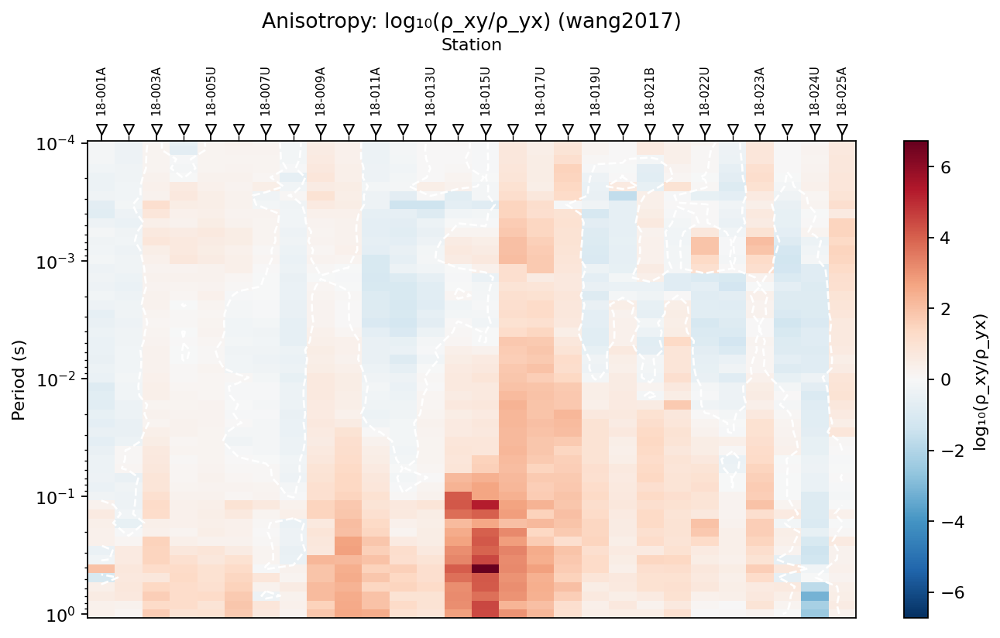
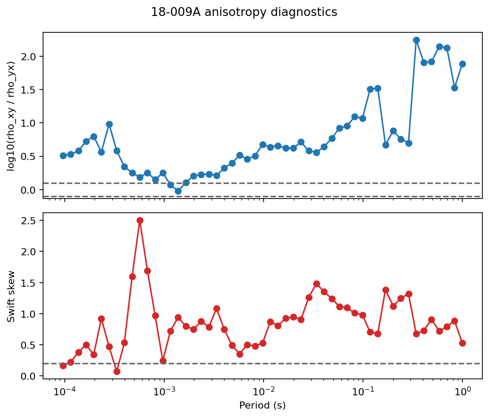
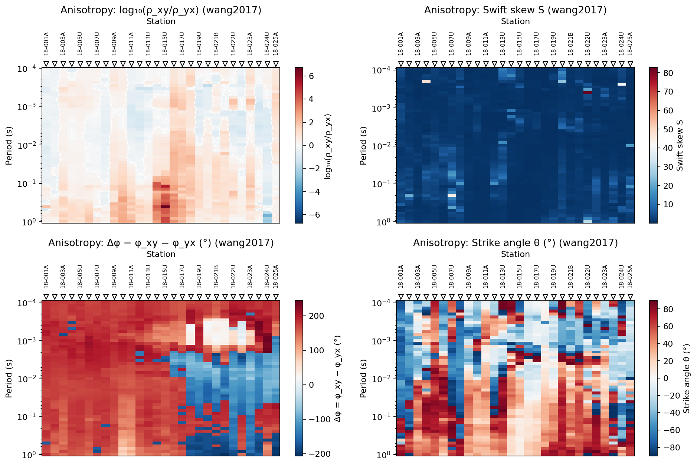
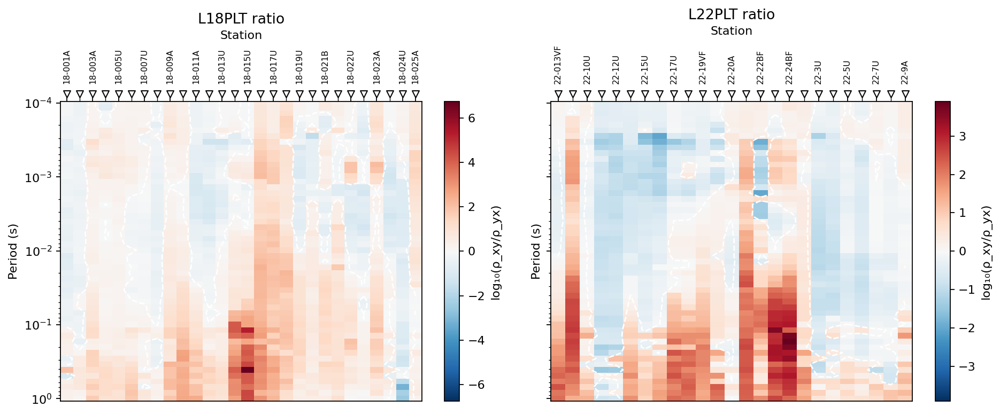
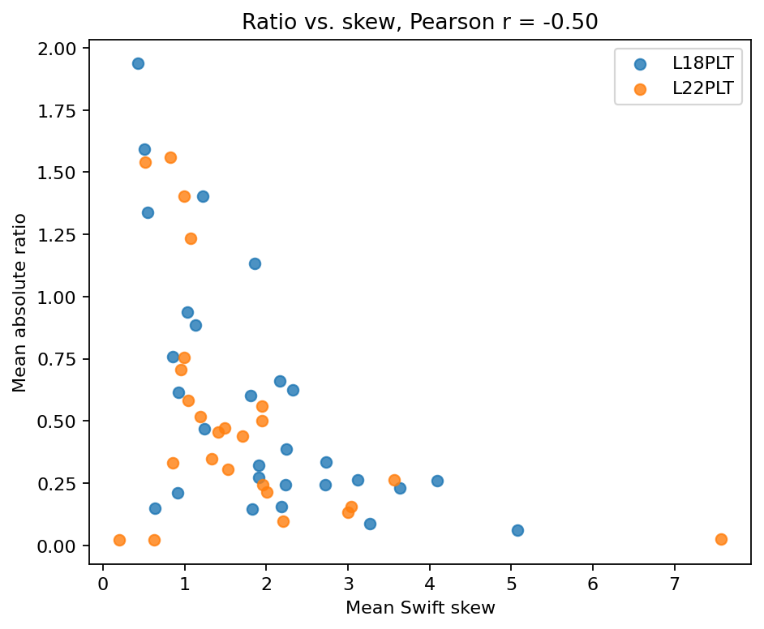
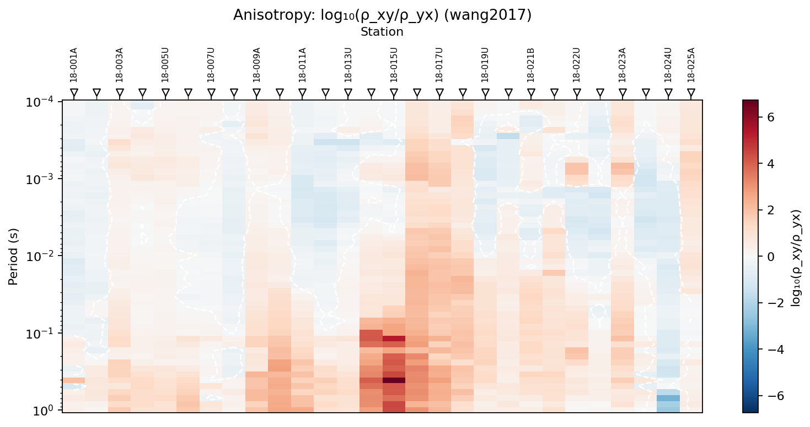

.. _emtools_anisotropy:

Anisotropy Diagnostics
======================

``pycsamt.emtools.anisotropy`` is the user-facing workflow for checking
whether a CSAMT/AMT impedance tensor behaves like an isotropic 1-D/2-D
earth, or whether the two off-diagonal modes and the tensor diagonal
terms suggest axial anisotropy or 3-D structure.

The module follows the axial-anisotropy diagnostic idea described by
Wang and Tan (2017) for CSAMT data. In a practical field workflow, the
method answers three concrete questions:

- do :math:`Z_{xy}` and :math:`Z_{yx}` imply similar apparent
  resistivities?
- do the tensor diagonal terms create a large Swift skew?
- are the suspicious responses isolated single-frequency spikes, or
  coherent station-period patterns?

This page explains how to use the three workflow functions in the user
guide context. Full callable signatures are intentionally left to the
:doc:`API reference <../../api/emtools>`.

Why This Matters
----------------

In ideal 1-D MT/CSAMT, the off-diagonal impedance modes carry the useful
response and the diagonal terms are close to zero. Real survey data are
messier. Galvanic distortion, 3-D bodies, local conductors, acquisition
noise, and genuine electrical anisotropy can all make the tensor depart
from that ideal form.

The anisotropy module does not prove a geological model by itself. It is
a diagnostic layer. Use it after loading and quality control, before
trusting a 1-D inversion, and alongside phase-tensor, strike, static
shift, and map views.

The Core Quantities
-------------------

For each station and frequency, the implementation reads the full
impedance tensor:

.. math::

   Z =
   \begin{bmatrix}
   Z_{xx} & Z_{xy} \\
   Z_{yx} & Z_{yy}
   \end{bmatrix}

The two Cagniard apparent resistivities are computed from the
off-diagonal modes using the practical-unit convention used by EDI
impedance values in pyCSAMT:

.. math::

   \rho_{xy} = 0.2 {|Z_{xy}|^2 \over f}
   \qquad
   \rho_{yx} = 0.2 {|Z_{yx}|^2 \over f}

where ``f`` is frequency in hertz. This practical-unit formula is the
one used by the code. It is different from the SI expression
:math:`|Z|^2 / (\omega\mu_0)`, which applies when impedance is stored in
SI ohms.

The main ratio metric is:

.. math::

   \Lambda = \log_{10}\left({\rho_{xy} \over \rho_{yx}}\right)

Interpret it as a signed mode contrast:

- ``ratio_log10 = 0`` means both modes have the same apparent
  resistivity.
- ``ratio_log10 = 0.1`` means :math:`\rho_{xy}` is about 1.26 times
  :math:`\rho_{yx}`.
- ``ratio_log10 = 0.3`` means a factor of about 2.
- negative values mean :math:`\rho_{yx}` is larger than
  :math:`\rho_{xy}`.

The module also computes Swift skew:

.. math::

   S = {|Z_{xx} - Z_{yy}| \over |Z_{xy} + Z_{yx}|}

and a per-frequency Swift strike angle. The skew is useful because it
uses the diagonal tensor terms, while the ratio uses the off-diagonal
modes. Those two indicators are related, but they are not redundant.

Data Contract
-------------

The functions accept the same flexible ``sites`` input as the rest of
``emtools``:

- a directory containing EDI files,
- one EDI-like object,
- a ``Sites`` container,
- an iterable of site-like objects.

Internally, the module calls ``ensure_sites``. That means duplicate-file,
recursive-loading, strict-mode, and verbosity behavior is consistent
with the rest of the pyCSAMT user guide.

Use dense CSAMT/AMT frequency coverage when possible. Sparse
long-period natural-source MT can still be passed to the functions, but
the station-period patterns are usually less stable and less diagnostic.

Workflow Overview
-----------------

The usual workflow is:

1. Load a survey line.
2. Compute the per-frequency detail table.
3. Collapse it to a per-station summary.
4. Plot one or more station x period pseudo-sections.
5. Interpret broad patterns before isolated extreme pixels.

.. code-block:: python
   :linenos:

   from pathlib import Path

   from pycsamt.emtools.anisotropy import (
       analyze_anisotropy,
       anisotropy_table,
       plot_anisotropy,
   )

   edi_dir = Path("data/AMT/WILLY_DATA/L18PLT")

   detail = analyze_anisotropy(edi_dir)
   summary = anisotropy_table(edi_dir)
   ax = plot_anisotropy(edi_dir, metric="ratio_log10")

Lines 8-12 are the complete workflow. The same ``edi_dir`` is accepted
by all three functions because each function delegates loading to the
shared site loader.

Per-Frequency Detail
--------------------

Use ``analyze_anisotropy`` when you need the raw station-frequency
diagnostics. It returns one row for each station and frequency.

.. code-block:: python
   :linenos:

   from pathlib import Path

   from pycsamt.emtools.anisotropy import analyze_anisotropy

   edi_dir = Path("data/AMT/WILLY_DATA/L18PLT")

   detail = analyze_anisotropy(
       edi_dir,
       ratio_threshold=0.1,
       skew_threshold=0.2,
       recursive=True,
       on_dup="replace",
       strict=False,
       verbose=0,
   )

   cols = [
       "station",
       "freq_hz",
       "period_s",
       "rho_xy_ohmm",
       "rho_yx_ohmm",
       "ratio_log10",
       "swift_skew",
       "strike_deg",
   ]

   print(detail[cols].head())
   detail.to_csv("l18plt_anisotropy_detail.csv", index=False)

.. code-block:: text

      station  freq_hz  period_s  ...  ratio_log10  swift_skew  strike_deg
   0  18-001A  10400.0  0.000096  ...    -0.107418    4.293444  -77.840209
   1  18-001A   8707.0  0.000115  ...    -0.124451    4.021890  -76.385301
   2  18-001A   7289.0  0.000137  ...    -0.145718    3.846208  -75.453650
   3  18-001A   6102.0  0.000164  ...    -0.247039    2.369018  -67.350131
   4  18-001A   5108.0  0.000196  ...    -0.397532    1.729795  -60.108794

   [5 rows x 8 columns]

The important output columns are:

- ``station``: station name resolved from the loaded site.
- ``freq_hz`` and ``period_s``: frequency and inverse frequency.
- ``rho_xy_ohmm`` and ``rho_yx_ohmm``: practical-unit apparent
  resistivities from the two off-diagonal modes.
- ``phi_xy_deg`` and ``phi_yx_deg``: phase of the two off-diagonal
  modes.
- ``ratio_log10``: :math:`\log_{10}(\rho_{xy}/\rho_{yx})`.
- ``phase_diff_deg``: ``phi_xy_deg - phi_yx_deg``.
- ``swift_skew``: Swift skew from the full tensor.
- ``strike_deg``: Swift strike angle in degrees.

The threshold arguments are accepted here for workflow consistency, but
the detail table itself does not add a Boolean flag. The thresholds are
used when the detail table is collapsed by ``anisotropy_table``.

Single-Station Inspection
-------------------------

Before interpreting a pseudo-section, inspect one or two stations as
curves. This makes it easier to distinguish coherent frequency trends
from isolated spikes.

.. code-block:: python
   :linenos:

   import matplotlib.pyplot as plt

   from pycsamt.emtools.anisotropy import (
       ANISO_RATIO_THRESH,
       SWIFT_SKEW_THRESH,
       analyze_anisotropy,
   )

   detail = analyze_anisotropy("data/AMT/WILLY_DATA/L18PLT")

   station = "18-009A"
   one = detail.loc[detail["station"] == station].sort_values("period_s")

   fig, (ax_ratio, ax_skew) = plt.subplots(
       2,
       1,
       figsize=(7, 6),
       sharex=True,
   )

   ax_ratio.semilogx(one["period_s"], one["ratio_log10"], "o-")
   ax_ratio.axhline(ANISO_RATIO_THRESH, color="0.4", linestyle="--")
   ax_ratio.axhline(-ANISO_RATIO_THRESH, color="0.4", linestyle="--")
   ax_ratio.set_ylabel("log10(rho_xy / rho_yx)")

   ax_skew.semilogx(one["period_s"], one["swift_skew"], "o-", color="C3")
   ax_skew.axhline(SWIFT_SKEW_THRESH, color="0.4", linestyle="--")
   ax_skew.set_xlabel("Period (s)")
   ax_skew.set_ylabel("Swift skew")

   fig.suptitle(f"{station} anisotropy diagnostics")
   fig.tight_layout()

Line 12 selects one station. Lines 21-23 draw the ratio threshold band,
and line 26 draws the Swift skew threshold. If both curves stay above
their thresholds over many neighboring periods, the station deserves
more attention than a station with one isolated outlier.

Per-Station Summary
-------------------

Use ``anisotropy_table`` when you want one row per station. It calls
``analyze_anisotropy`` internally, then groups by station.

.. code-block:: python
   :linenos:

   from pycsamt.emtools.anisotropy import anisotropy_table

   table = anisotropy_table(
       "data/AMT/WILLY_DATA/L18PLT",
       ratio_threshold=0.1,
       skew_threshold=0.2,
   )

   ranked = (
       table.assign(abs_mean_ratio=table["mean_ratio_log10"].abs())
       .sort_values(
           ["anisotropy_flag", "abs_mean_ratio", "mean_swift_skew"],
           ascending=[False, False, False],
       )
   )

   print(
       ranked[
           [
               "station",
               "n_freq",
               "mean_ratio_log10",
               "max_abs_ratio_log10",
               "mean_swift_skew",
               "median_strike_deg",
               "anisotropy_flag",
           ]
       ].head(10)
   )

.. code-block:: text

       station  n_freq  ...  median_strike_deg  anisotropy_flag
   15  18-016A      53  ...          -7.682709             True
   16  18-017U      53  ...          -3.811541             True
   14  18-015U      53  ...           8.230015             True
   17  18-018A      53  ...          13.908826             True
   13  18-014A      53  ...          27.482707             True
   9   18-010U      53  ...          24.372200             True
   24  18-023A      53  ...          21.460012             True
   8   18-009A      53  ...          24.360106             True
   26  18-024U      53  ...         -29.242651             True
   27  18-025A      53  ...         -20.822334             True

   [10 rows x 7 columns]

The summary columns are:

- ``n_freq``: number of frequencies contributing to the station.
- ``mean_ratio_log10``: signed average ratio over frequency.
- ``max_abs_ratio_log10``: largest absolute ratio over frequency.
- ``mean_phase_diff_deg``: average phase difference between modes.
- ``mean_swift_skew``: average Swift skew.
- ``median_strike_deg``: median Swift strike estimate.
- ``anisotropy_flag``: ``True`` when the station exceeds either default
  criterion.

The default criteria are:

.. code-block:: text
   :linenos:

   abs(mean_ratio_log10) > 0.1
   mean_swift_skew > 0.2

That flag is useful for screening, but it should not be your final
interpretation. In real field lines, many stations can be flagged. The
relative ranking and the station-period shape are usually more
informative than the binary column alone.

Pseudo-Section Plotting
-----------------------

Use ``plot_anisotropy`` to map one metric onto station x period space.
This is the main visual diagnostic because it shows whether a response
is spatially and spectrally coherent.

.. code-block:: python
   :linenos:

   import matplotlib.pyplot as plt

   from pycsamt.emtools.anisotropy import plot_anisotropy

   edi_dir = "data/AMT/WILLY_DATA/L18PLT"

   fig, axes = plt.subplots(2, 2, figsize=(12, 8), sharex=True)

   plot_anisotropy(edi_dir, metric="ratio_log10", ax=axes[0, 0])
   plot_anisotropy(edi_dir, metric="swift_skew", ax=axes[0, 1])
   plot_anisotropy(edi_dir, metric="phase_diff_deg", ax=axes[1, 0])
   plot_anisotropy(edi_dir, metric="strike_deg", ax=axes[1, 1])

   fig.tight_layout()
   fig.savefig("l18plt_anisotropy_metrics.png", dpi=200)

Available plot metrics are:

.. list-table::
   :header-rows: 1
   :widths: 25 75

   * - Metric
     - Meaning
   * - ``ratio_log10``
     - Signed :math:`\log_{10}(\rho_{xy}/\rho_{yx})`; the default and
       usually the first plot to inspect.
   * - ``swift_skew``
     - Full-tensor skew; useful for 3-D behavior and diagonal-term
       effects.
   * - ``phase_diff_deg``
     - Difference between the two off-diagonal phases.
   * - ``strike_deg``
     - Swift strike angle estimate in degrees.

For ``ratio_log10``, the plotting function uses a diverging color range
centered around zero and can draw a white zero contour. For other
metrics, the color range follows the finite values in the grid.

Comparing Neighboring Lines
---------------------------

The plotting function accepts an existing Matplotlib axis. That makes it
easy to compare neighboring survey lines with the same metric.

.. code-block:: python
   :linenos:

   import matplotlib.pyplot as plt

   from pycsamt.emtools.anisotropy import anisotropy_table, plot_anisotropy

   l18 = "data/AMT/WILLY_DATA/L18PLT"
   l22 = "data/AMT/WILLY_DATA/L22PLT"

   fig, (ax18, ax22) = plt.subplots(1, 2, figsize=(12, 5), sharey=True)

   plot_anisotropy(l18, metric="ratio_log10", ax=ax18)
   ax18.set_title("L18PLT ratio")

   plot_anisotropy(l22, metric="ratio_log10", ax=ax22)
   ax22.set_title("L22PLT ratio")

   t18 = anisotropy_table(l18)
   t22 = anisotropy_table(l22)

   print("L18 mean |ratio|:", t18["mean_ratio_log10"].abs().mean())
   print("L22 mean |ratio|:", t22["mean_ratio_log10"].abs().mean())

   fig.tight_layout()

.. code-block:: text

   L18 mean |ratio|: 0.5836353106929171
   L22 mean |ratio|: 0.5153467627986273

This comparison is useful for sanity checking. Neighboring lines do not
need to match exactly, but a line with a completely different pattern
should be checked for loading, station ordering, coordinate, or tensor
quality issues before the difference is interpreted geologically.

Ratio And Skew Are Complementary
--------------------------------

Because the ratio and skew emphasize different tensor information, they
can disagree. The following example quantifies the relationship across
two lines.

.. code-block:: python
   :linenos:

   import pandas as pd
   import matplotlib.pyplot as plt

   from pycsamt.emtools.anisotropy import anisotropy_table

   t18 = anisotropy_table("data/AMT/WILLY_DATA/L18PLT").assign(line="L18PLT")
   t22 = anisotropy_table("data/AMT/WILLY_DATA/L22PLT").assign(line="L22PLT")
   both = pd.concat([t18, t22], ignore_index=True)

   both["abs_ratio"] = both["mean_ratio_log10"].abs()
   corr = both["abs_ratio"].corr(both["mean_swift_skew"])

   fig, ax = plt.subplots(figsize=(6, 5))
   for line, group in both.groupby("line"):
       ax.scatter(
           group["mean_swift_skew"],
           group["abs_ratio"],
           label=line,
           alpha=0.8,
       )

   ax.set_xlabel("Mean Swift skew")
   ax.set_ylabel("Mean absolute ratio")
   ax.set_title(f"Ratio vs. skew, Pearson r = {corr:.2f}")
   ax.legend()
   fig.tight_layout()

If the two metrics correlate strongly, they are telling a similar story.
If they do not, inspect both views. A station can have a strong
:math:`\rho_{xy}/\rho_{yx}` contrast with modest skew, or large skew
with a modest mean ratio.

Reading The Results
-------------------

Use the following interpretation pattern:

- Start with ``ratio_log10``. Look for broad positive or negative zones
  that persist over multiple stations and periods.
- Check ``swift_skew``. Treat broad skew highs as important, but be
  cautious with single-pixel extremes.
- Check ``phase_diff_deg`` if the apparent resistivity ratio is strong;
  phase disagreement can help separate stable tensor behavior from
  amplitude-only effects.
- Use ``strike_deg`` as a directional clue, not as a unique structural
  solution. Strike estimates have ambiguity and can be unstable where
  the tensor is noisy.
- Compare neighboring lines before making a geological statement from
  one profile.

Common Failure Modes
--------------------

Empty output
   No valid impedance tensor was found. Check that the input path points
   to EDI files and that the files contain usable ``Z`` data.

All stations flagged
   This can happen in real field data. Raise the thresholds only if you
   have a survey-specific reason. More often, keep the defaults and use
   rankings plus pseudo-sections for interpretation.

Huge isolated Swift skew
   Swift skew divides by ``abs(Zxy + Zyx)``. If that denominator passes
   near zero at one frequency, a very large value can appear without a
   corresponding geological anomaly. Look for neighboring-period
   support.

Unstable strike
   Strike is derived from tensor rotation. It is sensitive to noisy
   diagonal terms and carries the usual EM strike ambiguity. Interpret
   stable bands, not isolated values.

Sparse long-period data
   The method is most useful with dense CSAMT/AMT frequency sweeps. With
   sparse natural-source MT, use the output as a rough diagnostic only.

Saving A Reproducible Diagnostic Bundle
---------------------------------------

For reports, save both tables and the key figure. That gives reviewers
the station-level ranking and the raw station-frequency values behind
the plot.

.. code-block:: python
   :linenos:

   from pathlib import Path

   import matplotlib.pyplot as plt

   from pycsamt.emtools.anisotropy import (
       analyze_anisotropy,
       anisotropy_table,
       plot_anisotropy,
   )

   survey = Path("data/AMT/WILLY_DATA/L18PLT")
   out = Path("outputs/anisotropy_l18plt")
   out.mkdir(parents=True, exist_ok=True)

   detail = analyze_anisotropy(survey)
   table = anisotropy_table(survey)

   detail.to_csv(out / "anisotropy_detail.csv", index=False)
   table.to_csv(out / "anisotropy_table.csv", index=False)

   fig, ax = plt.subplots(figsize=(10, 5))
   plot_anisotropy(survey, metric="ratio_log10", ax=ax)
   fig.tight_layout()
   fig.savefig(out / "ratio_log10_pseudosection.png", dpi=200)

Line 15 preserves the detailed station-frequency data. Line 16
preserves the station summary. Lines 21-23 save the main pseudo-section
used in interpretation.

Worked Example
--------------

The gallery example uses **L18PLT** and **L22PLT**, two real AMT/CSAMT
survey lines bundled in ``data/AMT/WILLY_DATA/``. It moves from a single
station curve, to station rankings, to pseudo-sections, and finally to a
two-line comparison showing that ratio and skew can carry different
information.

Open the rendered example here:
:ref:`sphx_glr_examples_emtools_plot_anisotropy.py`.
