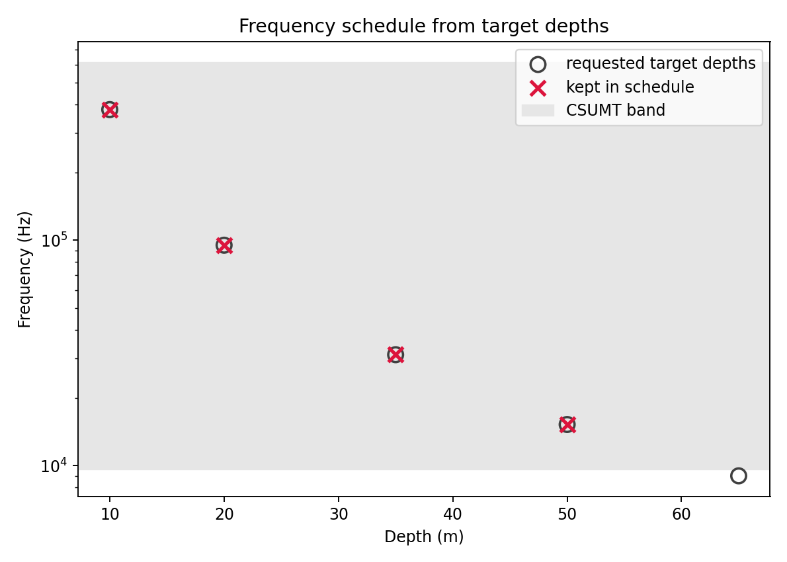
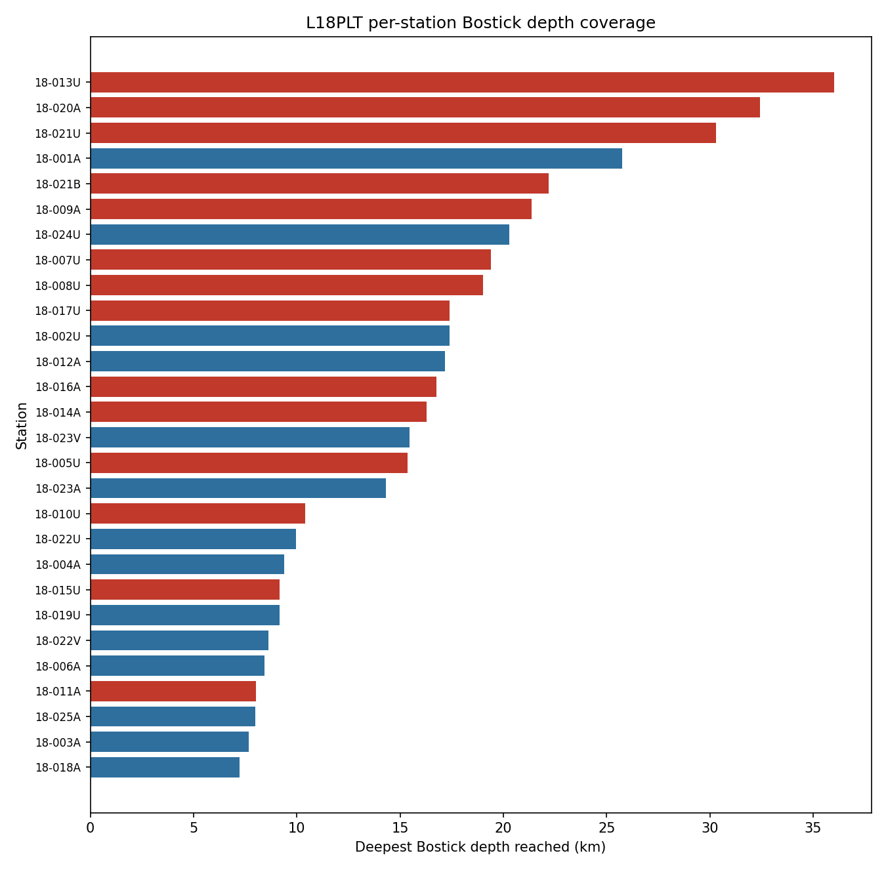
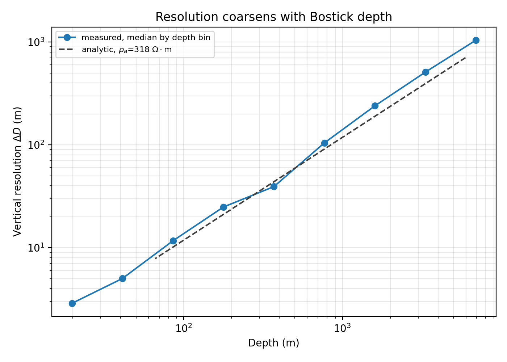

.. _emtools_csumt:

CSUMT Bostick Depth And Survey Design
=====================================

Controlled-Source Ultra-Audio Magnetotellurics ( :term:`CSUMT` ) is
a controlled-source electromagnetic method that works in the
ultra-audio frequency band, typically higher than conventional AMT/MT.
Instead of waiting for natural source fields, the survey uses a
transmitter to inject a known signal and receivers measure the
horizontal electric and magnetic fields along a line.  The measured
field ratios are converted to :term:`impedance tensor`, then to
:term:`apparent resistivity` and :term:`phase`, just as in other
magnetotelluric workflows.

The important practical consequence is depth.  High frequencies give
good near-surface resolution but they do not penetrate as deeply as
lower-frequency AMT/MT signals.  A CSUMT design therefore starts with a
simple question: for the expected resistivity, can the transmitter band
reach the target depth?  This page answers that question with
:term:`Bostick depth` estimates and quick vertical-resolution checks.

``pycsamt.emtools.csumt`` provides two related workflows:

- plan a controlled-source survey from target depths and an estimated
  background resistivity;
- transform measured impedance data into quick Bostick depth and
  vertical-resolution diagnostics.

The module is intentionally lightweight. It does not run an inversion
and it does not estimate a layered earth model. It gives you fast,
transparent quantities that are useful before field acquisition and
during early quality control of CSAMT/AMT lines.

Use these outputs as planning and quality-control diagnostics, not as a
final geological model.  A Bostick depth is a one-dimensional transform
of apparent resistivity at one frequency; it helps you see the depth
scale implied by the data, but it cannot replace a constrained 1-D, 2-D,
or 3-D inversion when absolute layer geometry matters.

Full callable signatures live in the :doc:`API reference <../../api/emtools>`.
This page focuses on practical use, interpretation, and reproducible
examples.

The Bostick Transform
---------------------

The central approximation is:

.. math::

   D(f) = 356 \sqrt{\rho_a(f) / f}

where:

- ``D`` is Bostick depth in metres,
- ``rho_a`` is apparent resistivity in ohm-m,
- ``f`` is frequency in hertz.

The constant ``356`` comes from the :term:`skin depth` relation
``503 * sqrt(rho / f)`` divided by ``sqrt(2)``. Lower frequencies probe
deeper. Higher apparent resistivity also pushes the estimated depth
deeper.

For measured EDI data, pyCSAMT first computes a determinant-style
apparent resistivity from the two off-diagonal impedance modes:

.. math::

   \rho_a =
   \sqrt{
   \left(0.2 {|Z_{xy}|^2 \over f}\right)
   \left(0.2 {|Z_{yx}|^2 \over f}\right)
   }

That practical-unit formula matches the EDI impedance convention used
elsewhere in ``emtools``.

When To Use This Page
---------------------

Use the planning side when you need to answer questions like:

- what transmitter frequencies are needed for 10 m, 25 m, and 50 m
  targets?
- does the CSUMT frequency band reach the required depth for the
  expected resistivity?
- how much vertical resolution is lost between adjacent frequencies?

Use the measured-data side when you need to answer questions like:

- which stations reach the deepest Bostick depths?
- where does the line have poor vertical resolution?
- do neighboring lines show similar depth-coverage patterns?
- are absolute depth numbers plausible enough to guide inversion setup?

Planning With No EDI Data
-------------------------

The planning helpers need only resistivity and frequency or target
depth. The default CSUMT band used by the module is

.. math::

   f_{min} = 9.6\times10^3\ \mathrm{Hz},
   \qquad
   f_{max} = 614.4\times10^3\ \mathrm{Hz}.

The first step is usually to plot the Bostick relation for plausible
background resistivities.

.. code-block:: pycon

   >>> import matplotlib.pyplot as plt
   >>> import numpy as np
   >>> from pycsamt.emtools.csumt import (
   ...     F_MAX_CSUMT,
   ...     F_MIN_CSUMT,
   ...     bostick_depth_from_rho,
   ... )
   >>> F_MIN_CSUMT, F_MAX_CSUMT
   (9600.0, 614400.0)
   >>> freq = np.logspace(2, 6, 200)
   >>> resistivities = [30.0, 100.0, 300.0, 1000.0]
   >>> fig, ax = plt.subplots(figsize=(7, 5))
   >>> for rho in resistivities:
   ...     depth = bostick_depth_from_rho(rho, freq)
   ...     _ = ax.loglog(freq, depth, label=f"rho={rho:g} ohm.m")
   ...
   >>> _ = ax.axvspan(F_MIN_CSUMT, F_MAX_CSUMT, color="0.9", zorder=0)
   >>> _ = ax.set_xlabel("Frequency (Hz)")
   >>> _ = ax.set_ylabel("Bostick depth (m)")
   >>> _ = ax.legend()
   >>> fig.tight_layout()

.. image:: ../../images/user_guide/emtools/user-guide-emtools-csumt-01.png
   :width: 100%

``F_MIN_CSUMT`` and ``F_MAX_CSUMT`` are the pure planning constants
imported alongside ``bostick_depth_from_rho``, and the shaded
``axvspan`` marks that same band directly on the curves, so it is
visually obvious which depths each resistivity assumption can actually
reach with this instrument band -- higher background resistivity always
pushes the reachable depth deeper at a fixed frequency.

Inverting Depth To Frequency
----------------------------

Survey design often starts from target depths. ``frequency_for_depth``
inverts the Bostick formula:

.. math::

   f = \rho \left(356 / D\right)^2

.. code-block:: pycon

   >>> from pycsamt.emtools.csumt import frequency_for_depth
   >>> rho_estimate = 300.0
   >>> targets_m = np.array([5.0, 10.0, 20.0, 35.0, 50.0, 75.0])
   >>> freq_hz = frequency_for_depth(targets_m, rho_estimate)
   >>> in_band = (freq_hz >= F_MIN_CSUMT) & (freq_hz <= F_MAX_CSUMT)
   >>> for depth, freq, keep in zip(targets_m, freq_hz, in_band):
   ...     status = "inside CSUMT band" if keep else "outside CSUMT band"
   ...     print(f"{depth:5.1f} m -> {freq:9.1f} Hz  {status}")
   ...
     5.0 m -> 1520832.0 Hz  outside CSUMT band
    10.0 m ->  380208.0 Hz  inside CSUMT band
    20.0 m ->   95052.0 Hz  inside CSUMT band
    35.0 m ->   31037.4 Hz  inside CSUMT band
    50.0 m ->   15208.3 Hz  inside CSUMT band
    75.0 m ->    6759.3 Hz  outside CSUMT band

``frequency_for_depth`` is the key conversion; the ``in_band`` mask
alongside it is the practical check that matters -- does the requested
target depth actually map into the transmitter band? Here the shallowest
(5 m) and deepest (75 m) targets both fall outside it, for opposite
reasons: 5 m demands a frequency above ``F_MAX_CSUMT``, and 75 m demands
one below ``F_MIN_CSUMT``.

Designing A Frequency Schedule
------------------------------

``frequency_schedule`` converts target depths into transmitter
frequencies, removes depths that map outside the allowed band, and can
optionally add intermediate frequencies. It first maps each requested
depth :math:`D_i` to a candidate frequency,

.. math::

   f_i = \rho_c \left({356 \over D_i}\right)^2,

then keeps only candidates inside the allowed transmitter band,

.. math::

   \mathcal{F}_{keep} =
   \{f_i: f_{min} \le f_i \le f_{max}\}.

If ``min_resolution_m`` is given, extra log-spaced frequencies are
inserted afterward wherever :math:`\Delta D(f_k, f_{k+1})` between
surviving neighbours would otherwise exceed that spacing.

.. code-block:: pycon

   >>> from pycsamt.emtools.csumt import frequency_schedule
   >>> rho_estimate = 300.0
   >>> targets_m = np.array([10.0, 20.0, 35.0, 50.0, 65.0])
   >>> schedule_hz = frequency_schedule(targets_m, rho_estimate)
   >>> padded_hz = frequency_schedule(
   ...     targets_m, rho_estimate, min_resolution_m=5.0,
   ... )
   >>> schedule_khz = frequency_schedule(
   ...     targets_m, rho_estimate, min_resolution_m=5.0, as_khz=True,
   ... )
   >>> len(targets_m), len(schedule_hz), len(padded_hz)
   (5, 4, 11)
   >>> schedule_khz
   array([ 15.20832   ,  19.29075455,  24.46905452,  31.03738776,
           41.05860467,  54.31542857,  71.85255818,  95.052     ,
          150.88564479, 239.51603127, 380.208     ])
   >>> ax = plot_frequency_schedule(targets_m, rho_estimate)

:func:`~pycsamt.emtools.csumt.plot_frequency_schedule` makes that
dropped target visible directly: every requested depth is drawn as an
open circle at its raw frequency, the CSUMT band is shaded, and only
the four targets whose raw frequency actually lands inside the band get
a crimson cross -- the 65 m target sits below ``F_MIN_CSUMT`` and is
left unmarked, exactly matching ``schedule_hz``'s dropped count above.

The important behaviour is the gap between the first two counts:
``frequency_schedule`` silently drops targets whose frequency falls
outside ``f_min``/``f_max`` -- it does not warn -- so always compare the
number of requested target depths with the number of returned
frequencies. ``min_resolution_m=5.0`` then pads those 4 surviving
frequencies out to 11 by inserting log-spaced intermediate frequencies
wherever the resolution gap between neighbours would otherwise exceed
5 m; ``as_khz=True`` only changes the output units.

Resolution Between Two Frequencies
----------------------------------

``vertical_resolution_pair`` estimates the depth gap between two
adjacent frequencies for a fixed resistivity:

.. math::

   \Delta D =
   356\sqrt{\rho}
   \left(
   {1 \over \sqrt{f_{lo}}} -
   {1 \over \sqrt{f_{hi}}}
   \right)

where ``f_lo`` is the lower frequency and therefore the deeper point.

.. code-block:: pycon

   >>> from pycsamt.emtools.csumt import vertical_resolution_pair
   >>> adjacent_pairs = [
   ...     (9600.0, 19200.0),
   ...     (19200.0, 38400.0),
   ...     (38400.0, 76800.0),
   ... ]
   >>> for f_lo, f_hi in adjacent_pairs:
   ...     delta_m = vertical_resolution_pair(rho_estimate, f_lo, f_hi)
   ...     print(f"{f_lo:8.0f}-{f_hi:8.0f} Hz: {delta_m:6.2f} m")
   ...
       9600-   19200 Hz:  18.43 m
      19200-   38400 Hz:  13.03 m
      38400-   76800 Hz:   9.22 m

This is a planning calculation. It assumes the same background
resistivity for both frequencies. Use it to design spacing before
acquisition, or to compare measured resolution against an idealized
background.

Measured Data Workflow
----------------------

The sites-based functions accept the usual ``emtools`` input:

- a directory containing EDI files,
- one EDI-like object,
- a ``Sites`` container,
- an iterable of site-like objects.

Internally they call ``ensure_sites``, so ``recursive``, ``on_dup``,
``strict``, and ``verbose`` behave consistently with the rest of the
user guide.

The measured workflow is:

1. compute one Bostick-depth row per station and frequency;
2. compute adjacent-frequency vertical resolution;
3. collapse each station to a coverage table;
4. plot a station x period depth pseudo-section.

.. code-block:: pycon

   >>> from pathlib import Path
   >>> from pycsamt.emtools.csumt import (
   ...     bostick_depth,
   ...     depth_coverage_table,
   ...     plot_depth_section,
   ...     vertical_resolution,
   ... )
   >>> edi_dir = Path("data/AMT/WILLY_DATA/L18PLT")
   >>> depth = bostick_depth(edi_dir)
   >>> resolution = vertical_resolution(edi_dir)
   >>> coverage = depth_coverage_table(edi_dir)
   >>> len(depth), len(resolution), len(coverage)
   (1484, 1456, 28)
   >>> ax = plot_depth_section(edi_dir)

.. image:: ../../images/user_guide/emtools/user-guide-emtools-csumt-05.png
   :width: 100%

The same input path is accepted by all four functions -- one directory
becomes a 1484-row per-frequency depth table, a 1456-row adjacent-pair
resolution table (one row fewer per station than ``depth``, since each
station contributes ``n_freq - 1`` pairs), a 28-row per-station coverage
summary, and one pseudo-section.

Bostick Depth Table
-------------------

Use ``bostick_depth`` when you want the raw station-frequency transform.

.. code-block:: pycon

   >>> depth = bostick_depth(
   ...     "data/AMT/WILLY_DATA/L18PLT",
   ...     recursive=True,
   ...     on_dup="replace",
   ...     strict=False,
   ...     verbose=0,
   ... )
   >>> depth.head()
      station  freq_hz  period_s  rho_a_ohmm    depth_m
   0  18-001A  10400.0  0.000096   76.998314  30.631900
   1  18-001A   8707.0  0.000115   84.263304  35.021518
   2  18-001A   7289.0  0.000137   88.743760  39.281217
   3  18-001A   6102.0  0.000164  115.297433  48.935465
   4  18-001A   5108.0  0.000196  152.193125  61.450026
   >>> depth.to_csv("l18plt_bostick_depth.csv", index=False)

The output columns are:

- ``station``: station name.
- ``freq_hz``: measured frequency.
- ``period_s``: inverse frequency.
- ``rho_a_ohmm``: geometric-mean apparent resistivity from ``Zxy`` and
  ``Zyx``.
- ``depth_m``: Bostick depth in metres.

One Station Curve
-----------------

A single-station curve is the easiest way to understand the transform
before reading the full section.

.. code-block:: pycon

   >>> station = "18-001A"
   >>> one = depth.loc[depth["station"] == station].sort_values("period_s")
   >>> fig, ax = plt.subplots(figsize=(7, 4.5))
   >>> _ = ax.loglog(one["period_s"], one["depth_m"], "o-")
   >>> _ = ax.set_xlabel("Period (s)")
   >>> _ = ax.set_ylabel("Bostick depth (m)")
   >>> _ = ax.set_title(f"{station} depth vs. period")
   >>> _ = ax.grid(True, which="both", alpha=0.3)
   >>> fig.tight_layout()

.. image:: ../../images/user_guide/emtools/user-guide-emtools-csumt-07.png
   :width: 100%

Depth should generally increase with period, but it does not need to be
perfectly smooth. Each point uses the apparent resistivity measured at
that frequency. A noisy resistivity value can move one depth estimate
above or below its neighbors.

Measured Vertical Resolution
----------------------------

Use ``vertical_resolution`` to compute the depth gap between adjacent
frequencies at each station.

.. code-block:: pycon

   >>> from pycsamt.emtools.csumt import vertical_resolution
   >>> measured = vertical_resolution("data/AMT/WILLY_DATA/L18PLT")
   >>> fixed_rho = vertical_resolution(
   ...     "data/AMT/WILLY_DATA/L18PLT",
   ...     rho_override=300.0,
   ... )
   >>> measured.head()
      station  freq_lo_hz  freq_hi_hz  ...    depth_hi_m  delta_depth_m   rho_a_ohmm
   0  18-001A       1.008       1.204  ...  15344.900917   -1741.179129  1814.534975
   1  18-001A       1.204       1.438  ...  11898.474477    3446.426441  1895.605946
   2  18-001A       1.438       1.718  ...  11376.860958     521.613519  1678.822421
   3  18-001A       1.718       2.052  ...  20671.989002   -9295.128044  3484.215253
   4  18-001A       2.052       2.451  ...  13906.815678    6765.173324  5087.100314
   [5 rows x 7 columns]
   >>> fixed_rho.head()
      station  freq_lo_hz  freq_hi_hz  ...   depth_hi_m  delta_depth_m  rho_a_ohmm
   0  18-001A       1.008       1.204  ...  5619.496200     522.087278       300.0
   1  18-001A       1.204       1.438  ...  5141.989463     477.506737       300.0
   2  18-001A       1.438       1.718  ...  4704.343719     437.645744       300.0
   3  18-001A       1.718       2.052  ...  4304.492417     399.851302       300.0
   4  18-001A       2.052       2.451  ...  3938.573638     365.918779       300.0
   [5 rows x 7 columns]

The measured output columns are:

- ``station``: station name.
- ``freq_lo_hz`` and ``freq_hi_hz``: adjacent frequency pair, sorted
  ascending.
- ``depth_lo_m`` and ``depth_hi_m``: Bostick depths at the pair.
- ``delta_depth_m``: ``depth_lo_m - depth_hi_m``.
- ``rho_a_ohmm``: geometric-mean apparent resistivity used for the pair.

When ``rho_override`` is omitted, each pair uses measured apparent
resistivity. When ``rho_override`` is set, the calculation uses a fixed
background resistivity everywhere. That is useful for comparing field
data against an idealized survey-design assumption.

Depth Coverage Table
--------------------

Use ``depth_coverage_table`` when you want one row per station.

.. code-block:: pycon

   >>> from pycsamt.emtools.csumt import depth_coverage_table
   >>> coverage = depth_coverage_table("data/AMT/WILLY_DATA/L18PLT")
   >>> ranked = coverage.sort_values("depth_max_m", ascending=False)
   >>> ranked[[
   ...     "station", "n_freq", "freq_min_hz", "freq_max_hz",
   ...     "depth_min_m", "depth_max_m", "median_resolution_m",
   ... ]].head(10)
       station  n_freq  ...   depth_max_m  median_resolution_m
   12  18-013U      53  ...  36009.355793            64.592879
   19  18-020A      53  ...  32408.420051            75.994660
   20  18-021U      53  ...  30301.925460            79.090618
   0   18-001A      53  ...  25738.828561            48.506018
   21  18-021B      53  ...  22190.349906            52.988073
   8   18-009A      53  ...  21357.805389            67.062557
   26  18-024U      53  ...  20271.948048            12.972740
   6   18-007U      53  ...  19380.271567            50.198288
   7   18-008U      53  ...  19024.796081            50.476517
   16  18-017U      53  ...  17389.552044            48.953237
   [10 rows x 7 columns]

The output columns are:

- ``n_freq``: number of measured frequencies.
- ``freq_min_hz`` and ``freq_max_hz``: frequency range for the station.
- ``depth_min_m`` and ``depth_max_m``: shallowest and deepest Bostick
  depths estimated at the station.
- ``mean_resolution_m`` and ``median_resolution_m``: adjacent-frequency
  depth gaps summarized for the station.

The deepest station is not automatically the best station. Very high
apparent resistivity at low frequency can create a large Bostick depth.
Use the table as a ranking and a quality-control clue, then inspect the
curves and pseudo-section.

For each station :math:`s`, the table is the reduction

.. math::

   D_{min,s} = \min_j D_{s,j}, \qquad
   D_{max,s} = \max_j D_{s,j},

with resolution summaries taken from the adjacent-frequency gaps
:math:`\Delta D_{s,j}`.  This is why two stations with the same
frequency schedule can still have different depth coverage: the
resistivity term in :math:`D_{s,j}=356\sqrt{\rho_{a,s,j}/f_{s,j}}`
changes from station to station.

Ranking every station this way, rather than reading the top-10 table
alone, makes the full spread across the line visible at once:

.. code-block:: pycon

   >>> from pycsamt.emtools.csumt import plot_depth_coverage_ranking
   >>> ax = plot_depth_coverage_ranking(
   ...     "data/AMT/WILLY_DATA/L18PLT",
   ...     title="L18PLT per-station Bostick depth coverage",
   ... )

Bars are coloured by whether a station's ``median_resolution_m`` is
coarser (red) or at-or-finer (blue) than the survey-wide median, so a
station that only reaches deep with coarse resolution -- like
``18-021U``, third-deepest but with the widest resolution gap in the
top ten -- reads differently from a comparably deep station with fine
resolution, like ``18-001A`` right below it.

Depth Pseudo-Section
--------------------

``plot_depth_section`` colors station x period cells by Bostick depth.

.. code-block:: pycon

   >>> fig, ax = plt.subplots(figsize=(10, 5))
   >>> _ = plot_depth_section(
   ...     edi_dir,
   ...     log_color=True,
   ...     sort_by="name",
   ...     period_axis=True,
   ...     ax=ax,
   ... )
   >>> fig.tight_layout()
   >>> fig.savefig("l18plt_bostick_depth_section.png", dpi=200)

.. image:: ../../images/user_guide/emtools/user-guide-emtools-csumt-10.png
   :width: 100%

Useful plotting options:

- ``log_color=True`` colors by ``log10(depth_m)``. This is the default
  and is usually easier to read when depths span orders of magnitude.
- ``sort_by="name"`` sorts stations by station name. ``"lon"`` and
  ``"lat"`` are also supported when coordinates are available.
- ``period_axis=True`` uses period on the y-axis. Set it to ``False``
  for frequency.
- ``ax=...`` lets you place several lines in one figure.

Mathematically, the pseudo-section is only a gridded display of the
table produced by ``bostick_depth``:

.. math::

   G_{k,s} = D(f_k, s)
   = 356\sqrt{\rho_a(f_k, s) \over f_k}.

When ``log_color=True``, the displayed color value is
:math:`\log_{10}(G_{k,s})`.  That logarithmic color scale prevents a
few very deep estimates from hiding the shallow CSUMT/AMT structure.

Resolution Coarsening With Depth
--------------------------------

The fixed-resistivity formula says vertical resolution should become
coarser as the sampled depth increases.  The measured-data check below
bins adjacent-frequency gaps by their midpoint depth and compares the
median measured gap with the analytical curve for the line's median
apparent resistivity.

.. code-block:: pycon

   >>> from pycsamt.emtools.csumt import bostick_depth_from_rho
   >>> survey = "data/AMT/WILLY_DATA/L18PLT"
   >>> depth = bostick_depth(survey)
   >>> resolution = vertical_resolution(survey)
   >>> resolution["mid_depth"] = (
   ...     0.5 * (resolution["depth_lo_m"] + resolution["depth_hi_m"]).abs()
   ... )
   >>> bins = np.logspace(0.5, 4, 12)
   >>> centers = np.sqrt(bins[:-1] * bins[1:])
   >>> bin_idx = np.digitize(resolution["mid_depth"], bins)
   >>> binned = (
   ...     resolution.groupby(bin_idx)["delta_depth_m"]
   ...     .apply(lambda s: np.median(np.abs(s)))
   ...     .loc[lambda s: (s.index >= 1) & (s.index <= len(centers))]
   ... )
   >>> rho_med = float(depth["rho_a_ohmm"].median())
   >>> f_sweep = np.logspace(
   ...     np.log10(depth["freq_hz"].min()),
   ...     np.log10(depth["freq_hz"].max()),
   ...     40,
   ... )
   >>> analytic_depth = []
   >>> analytic_resolution = []
   >>> for f_lo, f_hi in zip(f_sweep[:-1], f_sweep[1:]):
   ...     analytic_depth.append(
   ...         np.sqrt(
   ...             bostick_depth_from_rho(rho_med, f_lo)
   ...             * bostick_depth_from_rho(rho_med, f_hi)
   ...         )
   ...     )
   ...     analytic_resolution.append(
   ...         vertical_resolution_pair(rho_med, f_lo, f_hi)
   ...     )
   ...
   >>> fig, ax = plt.subplots(figsize=(7, 5))
   >>> _ = ax.loglog(centers[binned.index - 1], binned, "o-")
   >>> _ = ax.loglog(analytic_depth, analytic_resolution, "--", color="0.3")
   >>> _ = ax.set_xlabel("Depth (m)")
   >>> _ = ax.set_ylabel("Vertical resolution (m)")
   >>> fig.tight_layout()

For a measured adjacent pair, the midpoint depth used for binning is

.. math::

   D_{mid,j} = {1 \over 2}|D(f_j) + D(f_{j+1})|,

and each bin reports

.. math::

   \widetilde{\Delta D}_b =
   \operatorname{median}_{j\in B_b}
   \left(|D(f_j)-D(f_{j+1})|\right).

The comparison is useful because it separates a normal consequence of
log-frequency sampling from true data irregularity.  If the measured
curve follows the analytical trend, the resolution loss is mostly
geometric.  If it departs strongly, the apparent-resistivity structure
is controlling the depth estimates.

Comparing Neighboring Lines
---------------------------

Use a shared y-axis to compare two survey lines with the same depth
color scale logic.

.. code-block:: pycon

   >>> l18 = "data/AMT/WILLY_DATA/L18PLT"
   >>> l22 = "data/AMT/WILLY_DATA/L22PLT"
   >>> fig, (ax18, ax22) = plt.subplots(1, 2, figsize=(12, 5), sharey=True)
   >>> _ = plot_depth_section(l18, ax=ax18)
   >>> _ = ax18.set_title("L18PLT")
   >>> _ = plot_depth_section(l22, ax=ax22)
   >>> _ = ax22.set_title("L22PLT")
   >>> fig.tight_layout()
   >>> c18 = depth_coverage_table(l18)
   >>> c22 = depth_coverage_table(l22)
   >>> c18["depth_max_m"].mean()
   16171.310165020153
   >>> c22["depth_max_m"].mean()
   18017.082535636182

.. image:: ../../images/user_guide/emtools/user-guide-emtools-csumt-11.png
   :width: 100%

Neighboring lines should not be identical, but a severe mismatch is a
reason to check station ordering, coordinate metadata, outlier
resistivity values, and EDI quality before interpreting the difference
as geology.

Reading The Results
-------------------

Use these rules of thumb:

- Treat Bostick depth as a fast transform, not as an inversion result.
- Prefer broad station-period patterns over one-frequency extremes.
- Check ``rho_a_ohmm`` when ``depth_m`` looks surprisingly large.
- Compare measured vertical resolution with a fixed ``rho_override`` if
  you need to separate survey-design spacing from resistivity effects.
- Use neighboring lines as sanity checks before making absolute depth
  claims.

Common Failure Modes
--------------------

Empty tables
   No valid impedance tensors were loaded. Check the EDI path and make
   sure files contain usable ``Z`` data.

Unreachable target depths
   ``frequency_schedule`` drops target depths that map outside the
   requested frequency band. Compare input target count with output
   schedule count.

Very large depth estimates
   Bostick depth grows with apparent resistivity and decreases with
   frequency. High-resistivity, low-frequency outliers can produce large
   depths that should be treated as qualitative indicators.

Negative or surprising resolution gaps
   With measured data, adjacent depths are computed from adjacent
   measured resistivities. Noise or strong resistivity variation can
   make the sequence less smooth than the analytical fixed-resistivity
   formula.

Saving A Reproducible Bundle
----------------------------

For reporting, save the planning assumptions, measured tables, and key
figure together.

.. code-block:: pycon

   >>> survey = Path("data/AMT/WILLY_DATA/L18PLT")
   >>> out = Path("outputs/csumt_l18plt")
   >>> out.mkdir(parents=True, exist_ok=True)
   >>> targets_m = np.array([10.0, 20.0, 35.0, 50.0])
   >>> schedule = frequency_schedule(targets_m, rho_estimate=300.0)
   >>> np.savetxt(out / "planned_frequency_schedule_hz.txt", schedule)
   >>> bostick_depth(survey).to_csv(out / "bostick_depth.csv", index=False)
   >>> vertical_resolution(survey).to_csv(
   ...     out / "vertical_resolution.csv", index=False,
   ... )
   >>> depth_coverage_table(survey).to_csv(
   ...     out / "depth_coverage.csv", index=False,
   ... )
   >>> fig, ax = plt.subplots(figsize=(10, 5))
   >>> _ = plot_depth_section(survey, ax=ax)
   >>> fig.tight_layout()
   >>> fig.savefig(out / "bostick_depth_section.png", dpi=200)

.. image:: ../../images/user_guide/emtools/user-guide-emtools-csumt-12.png
   :width: 100%

``schedule`` preserves the design assumptions, the three ``to_csv``
calls save the measured data products behind every table in this page,
and the saved figure is the same depth pseudo-section used throughout
-- together they let a reviewer retrace any claim back to the row that
produced it.

Worked Example
--------------

The gallery example applies the Bostick transform to **L18PLT** and
**L22PLT** from ``data/AMT/WILLY_DATA/``. It starts with the pure
planning equations, then moves to measured station curves, station
coverage, pseudo-sections, and a two-line comparison.

Open the rendered example here:
:ref:`sphx_glr_examples_emtools_plot_csumt.py`.
