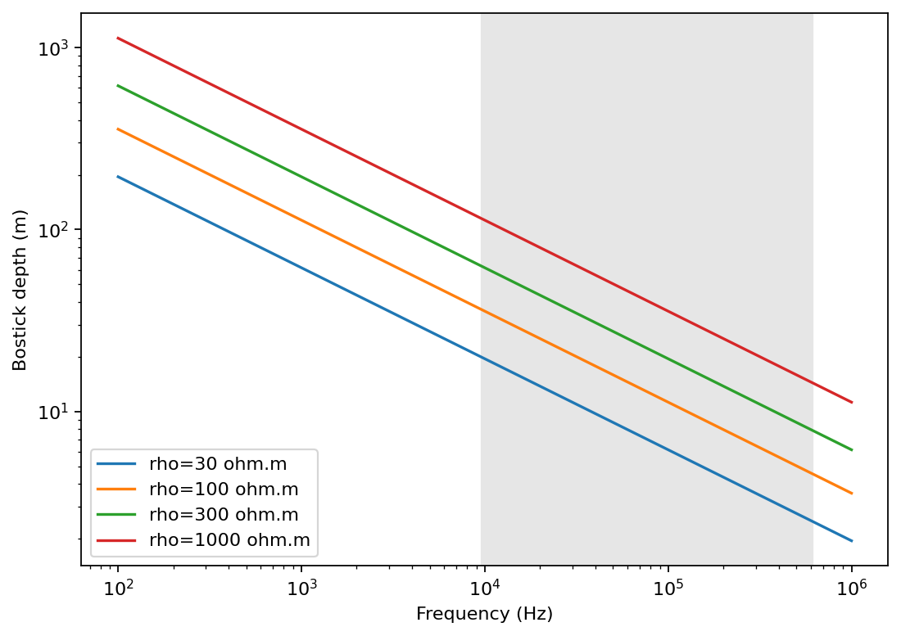
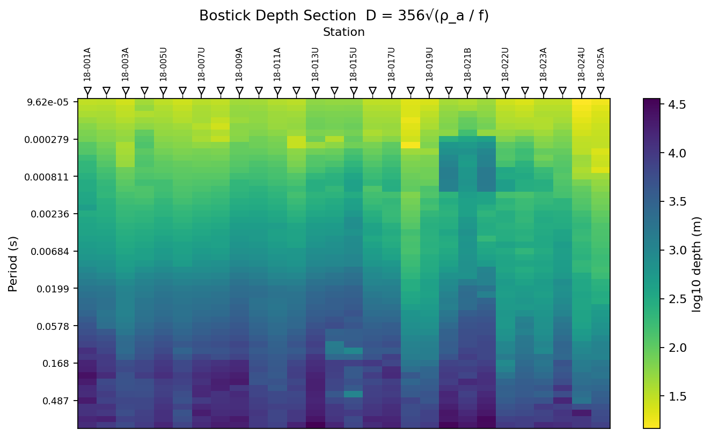
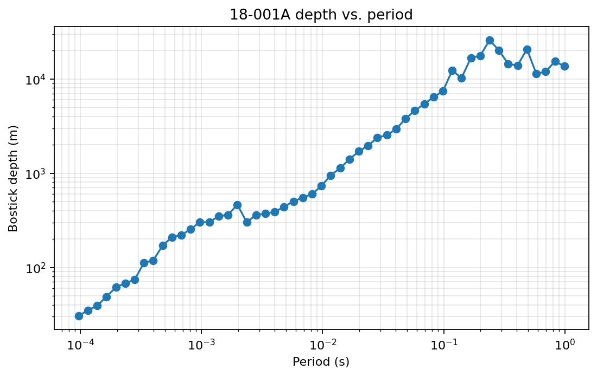
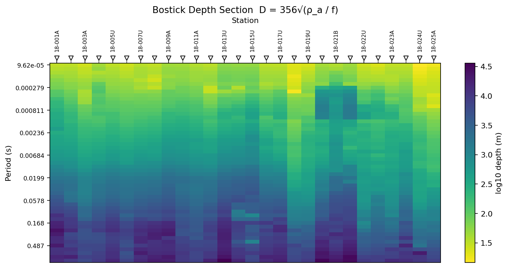
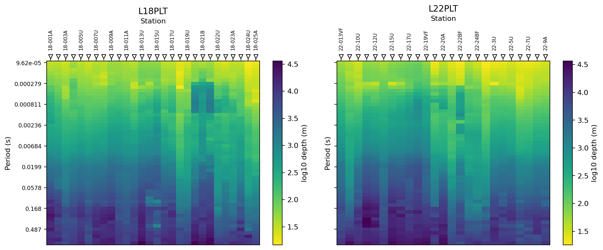

.. _emtools_csumt:

CSUMT Bostick Depth And Survey Design
=====================================

``pycsamt.emtools.csumt`` provides two related workflows:

- plan a controlled-source survey from target depths and an estimated
  background resistivity;
- transform measured impedance data into quick Bostick depth and
  vertical-resolution diagnostics.

The module is intentionally lightweight. It does not run an inversion
and it does not estimate a layered earth model. It gives you fast,
transparent quantities that are useful before field acquisition and
during early quality control of CSAMT/AMT lines.

Full callable signatures live in the :doc:`API reference <../../api/emtools>`.
This page focuses on practical use, interpretation, and reproducible
examples.

The Bostick Transform
---------------------

The central approximation is:

.. math::

   D(f) = 356 \sqrt{\rho_a(f) / f}

where:

- ``D`` is Bostick depth in metres,
- ``rho_a`` is apparent resistivity in ohm-m,
- ``f`` is frequency in hertz.

The constant ``356`` comes from the skin-depth relation
``503 * sqrt(rho / f)`` divided by ``sqrt(2)``. Lower frequencies probe
deeper. Higher apparent resistivity also pushes the estimated depth
deeper.

For measured EDI data, pyCSAMT first computes a determinant-style
apparent resistivity from the two off-diagonal impedance modes:

.. math::

   \rho_a =
   \sqrt{
   \left(0.2 {|Z_{xy}|^2 \over f}\right)
   \left(0.2 {|Z_{yx}|^2 \over f}\right)
   }

That practical-unit formula matches the EDI impedance convention used
elsewhere in ``emtools``.

When To Use This Page
---------------------

Use the planning side when you need to answer questions like:

- what transmitter frequencies are needed for 10 m, 25 m, and 50 m
  targets?
- does the CSUMT frequency band reach the required depth for the
  expected resistivity?
- how much vertical resolution is lost between adjacent frequencies?

Use the measured-data side when you need to answer questions like:

- which stations reach the deepest Bostick depths?
- where does the line have poor vertical resolution?
- do neighboring lines show similar depth-coverage patterns?
- are absolute depth numbers plausible enough to guide inversion setup?

Planning With No EDI Data
-------------------------

The planning helpers need only resistivity and frequency or target
depth. The default CSUMT band used by the module is:

.. code-block:: text
   :linenos:

   f_min = 9.6e3 Hz
   f_max = 614.4e3 Hz

The first step is usually to plot the Bostick relation for plausible
background resistivities.

.. code-block:: python
   :linenos:

   import matplotlib.pyplot as plt
   import numpy as np

   from pycsamt.emtools.csumt import (
       F_MAX_CSUMT,
       F_MIN_CSUMT,
       bostick_depth_from_rho,
   )

   freq = np.logspace(2, 6, 200)
   resistivities = [30.0, 100.0, 300.0, 1000.0]

   fig, ax = plt.subplots(figsize=(7, 5))
   for rho in resistivities:
       depth = bostick_depth_from_rho(rho, freq)
       ax.loglog(freq, depth, label=f"rho={rho:g} ohm.m")

   ax.axvspan(F_MIN_CSUMT, F_MAX_CSUMT, color="0.9", zorder=0)
   ax.set_xlabel("Frequency (Hz)")
   ax.set_ylabel("Bostick depth (m)")
   ax.legend()
   fig.tight_layout()

Lines 5-9 import only the pure planning pieces. Line 16 evaluates the
Bostick depth for each resistivity. Line 19 shades the default CSUMT
band so you can see which depths are reachable by the instrument band.

Inverting Depth To Frequency
----------------------------

Survey design often starts from target depths. ``frequency_for_depth``
inverts the Bostick formula:

.. math::

   f = \rho \left(356 / D\right)^2

.. code-block:: python
   :linenos:

   import numpy as np

   from pycsamt.emtools.csumt import (
       F_MAX_CSUMT,
       F_MIN_CSUMT,
       frequency_for_depth,
   )

   rho_estimate = 300.0
   targets_m = np.array([5.0, 10.0, 20.0, 35.0, 50.0, 75.0])

   freq_hz = frequency_for_depth(targets_m, rho_estimate)
   in_band = (freq_hz >= F_MIN_CSUMT) & (freq_hz <= F_MAX_CSUMT)

   for depth, freq, keep in zip(targets_m, freq_hz, in_band):
       status = "inside CSUMT band" if keep else "outside CSUMT band"
       print(f"{depth:5.1f} m -> {freq:9.1f} Hz  {status}")

.. code-block:: text

     5.0 m -> 1520832.0 Hz  outside CSUMT band
    10.0 m ->  380208.0 Hz  inside CSUMT band
    20.0 m ->   95052.0 Hz  inside CSUMT band
    35.0 m ->   31037.4 Hz  inside CSUMT band
    50.0 m ->   15208.3 Hz  inside CSUMT band
    75.0 m ->    6759.3 Hz  outside CSUMT band

Line 12 is the key conversion. Lines 13-17 force the practical check:
does the requested target depth actually map into the transmitter band?

Designing A Frequency Schedule
------------------------------

``frequency_schedule`` converts target depths into transmitter
frequencies, removes depths that map outside the allowed band, and can
optionally add intermediate frequencies.

.. code-block:: python
   :linenos:

   import numpy as np

   from pycsamt.emtools.csumt import frequency_schedule

   rho_estimate = 300.0
   targets_m = np.array([10.0, 20.0, 35.0, 50.0, 65.0])

   schedule_hz = frequency_schedule(targets_m, rho_estimate)
   padded_hz = frequency_schedule(
       targets_m,
       rho_estimate,
       min_resolution_m=5.0,
   )
   schedule_khz = frequency_schedule(
       targets_m,
       rho_estimate,
       min_resolution_m=5.0,
       as_khz=True,
   )

   print("requested targets:", len(targets_m))
   print("kept frequencies:", len(schedule_hz))
   print("padded frequencies:", len(padded_hz))
   print("padded schedule in kHz:", schedule_khz)

.. code-block:: text

   requested targets: 5
   kept frequencies: 4
   padded frequencies: 11
   padded schedule in kHz: [ 15.20832     19.29075455  24.46905452  31.03738776  41.05860467
     54.31542857  71.85255818  95.052      150.88564479 239.51603127
    380.208     ]

The important behavior is line 8: targets outside ``f_min`` and
``f_max`` are dropped from the result. The function returns the schedule;
it does not warn if a target is unreachable. Always compare the number
of requested target depths with the number of returned frequencies.

``min_resolution_m`` inserts log-spaced frequencies between adjacent
schedule frequencies when their vertical resolution gap is too large.
``as_khz=True`` only changes the units of the returned array.

Resolution Between Two Frequencies
----------------------------------

``vertical_resolution_pair`` estimates the depth gap between two
adjacent frequencies for a fixed resistivity:

.. math::

   \Delta D =
   356\sqrt{\rho}
   \left(
   {1 \over \sqrt{f_{lo}}} -
   {1 \over \sqrt{f_{hi}}}
   \right)

where ``f_lo`` is the lower frequency and therefore the deeper point.

.. code-block:: python
   :linenos:

   from pycsamt.emtools.csumt import vertical_resolution_pair

   rho_estimate = 300.0
   adjacent_pairs = [
       (9600.0, 19200.0),
       (19200.0, 38400.0),
       (38400.0, 76800.0),
   ]

   for f_lo, f_hi in adjacent_pairs:
       delta_m = vertical_resolution_pair(rho_estimate, f_lo, f_hi)
       print(f"{f_lo:8.0f}-{f_hi:8.0f} Hz: {delta_m:6.2f} m")

.. code-block:: text

       9600-   19200 Hz:  18.43 m
      19200-   38400 Hz:  13.03 m
      38400-   76800 Hz:   9.22 m

This is a planning calculation. It assumes the same background
resistivity for both frequencies. Use it to design spacing before
acquisition, or to compare measured resolution against an idealized
background.

Measured Data Workflow
----------------------

The sites-based functions accept the usual ``emtools`` input:

- a directory containing EDI files,
- one EDI-like object,
- a ``Sites`` container,
- an iterable of site-like objects.

Internally they call ``ensure_sites``, so ``recursive``, ``on_dup``,
``strict``, and ``verbose`` behave consistently with the rest of the
user guide.

The measured workflow is:

1. compute one Bostick-depth row per station and frequency;
2. compute adjacent-frequency vertical resolution;
3. collapse each station to a coverage table;
4. plot a station x period depth pseudo-section.

.. code-block:: python
   :linenos:

   from pathlib import Path

   from pycsamt.emtools.csumt import (
       bostick_depth,
       depth_coverage_table,
       plot_depth_section,
       vertical_resolution,
   )

   edi_dir = Path("data/AMT/WILLY_DATA/L18PLT")

   depth = bostick_depth(edi_dir)
   resolution = vertical_resolution(edi_dir)
   coverage = depth_coverage_table(edi_dir)
   ax = plot_depth_section(edi_dir)

Lines 11-14 are the measured-data workflow. The same input path is
accepted by each function.

Bostick Depth Table
-------------------

Use ``bostick_depth`` when you want the raw station-frequency transform.

.. code-block:: python
   :linenos:

   from pycsamt.emtools.csumt import bostick_depth

   depth = bostick_depth(
       "data/AMT/WILLY_DATA/L18PLT",
       recursive=True,
       on_dup="replace",
       strict=False,
       verbose=0,
   )

   print(depth.head())
   depth.to_csv("l18plt_bostick_depth.csv", index=False)

.. code-block:: text

      station  freq_hz  period_s  rho_a_ohmm    depth_m
   0  18-001A  10400.0  0.000096   76.998314  30.631900
   1  18-001A   8707.0  0.000115   84.263304  35.021518
   2  18-001A   7289.0  0.000137   88.743760  39.281217
   3  18-001A   6102.0  0.000164  115.297433  48.935465
   4  18-001A   5108.0  0.000196  152.193125  61.450026

The output columns are:

- ``station``: station name.
- ``freq_hz``: measured frequency.
- ``period_s``: inverse frequency.
- ``rho_a_ohmm``: geometric-mean apparent resistivity from ``Zxy`` and
  ``Zyx``.
- ``depth_m``: Bostick depth in metres.

One Station Curve
-----------------

A single-station curve is the easiest way to understand the transform
before reading the full section.

.. code-block:: python
   :linenos:

   import matplotlib.pyplot as plt

   from pycsamt.emtools.csumt import bostick_depth

   depth = bostick_depth("data/AMT/WILLY_DATA/L18PLT")

   station = "18-001A"
   one = depth.loc[depth["station"] == station].sort_values("period_s")

   fig, ax = plt.subplots(figsize=(7, 4.5))
   ax.loglog(one["period_s"], one["depth_m"], "o-")
   ax.set_xlabel("Period (s)")
   ax.set_ylabel("Bostick depth (m)")
   ax.set_title(f"{station} depth vs. period")
   ax.grid(True, which="both", alpha=0.3)
   fig.tight_layout()

Depth should generally increase with period, but it does not need to be
perfectly smooth. Each point uses the apparent resistivity measured at
that frequency. A noisy resistivity value can move one depth estimate
above or below its neighbors.

Measured Vertical Resolution
----------------------------

Use ``vertical_resolution`` to compute the depth gap between adjacent
frequencies at each station.

.. code-block:: python
   :linenos:

   from pycsamt.emtools.csumt import vertical_resolution

   measured = vertical_resolution("data/AMT/WILLY_DATA/L18PLT")
   fixed_rho = vertical_resolution(
       "data/AMT/WILLY_DATA/L18PLT",
       rho_override=300.0,
   )

   print(measured.head())
   print(fixed_rho.head())

.. code-block:: text

      station  freq_lo_hz  freq_hi_hz  ...    depth_hi_m  delta_depth_m   rho_a_ohmm
   0  18-001A       1.008       1.204  ...  15344.900917   -1741.179129  1814.534975
   1  18-001A       1.204       1.438  ...  11898.474477    3446.426441  1895.605946
   2  18-001A       1.438       1.718  ...  11376.860958     521.613519  1678.822421
   3  18-001A       1.718       2.052  ...  20671.989002   -9295.128044  3484.215253
   4  18-001A       2.052       2.451  ...  13906.815678    6765.173324  5087.100314

   [5 rows x 7 columns]
      station  freq_lo_hz  freq_hi_hz  ...   depth_hi_m  delta_depth_m  rho_a_ohmm
   0  18-001A       1.008       1.204  ...  5619.496200     522.087278       300.0
   1  18-001A       1.204       1.438  ...  5141.989463     477.506737       300.0
   2  18-001A       1.438       1.718  ...  4704.343719     437.645744       300.0
   3  18-001A       1.718       2.052  ...  4304.492417     399.851302       300.0
   4  18-001A       2.052       2.451  ...  3938.573638     365.918779       300.0

   [5 rows x 7 columns]

The measured output columns are:

- ``station``: station name.
- ``freq_lo_hz`` and ``freq_hi_hz``: adjacent frequency pair, sorted
  ascending.
- ``depth_lo_m`` and ``depth_hi_m``: Bostick depths at the pair.
- ``delta_depth_m``: ``depth_lo_m - depth_hi_m``.
- ``rho_a_ohmm``: geometric-mean apparent resistivity used for the pair.

When ``rho_override`` is omitted, each pair uses measured apparent
resistivity. When ``rho_override`` is set, the calculation uses a fixed
background resistivity everywhere. That is useful for comparing field
data against an idealized survey-design assumption.

Depth Coverage Table
--------------------

Use ``depth_coverage_table`` when you want one row per station.

.. code-block:: python
   :linenos:

   from pycsamt.emtools.csumt import depth_coverage_table

   coverage = depth_coverage_table("data/AMT/WILLY_DATA/L18PLT")

   ranked = coverage.sort_values("depth_max_m", ascending=False)

   print(
       ranked[
           [
               "station",
               "n_freq",
               "freq_min_hz",
               "freq_max_hz",
               "depth_min_m",
               "depth_max_m",
               "median_resolution_m",
           ]
       ].head(10)
   )

.. code-block:: text

       station  n_freq  ...   depth_max_m  median_resolution_m
   12  18-013U      53  ...  36009.355793            64.592879
   19  18-020A      53  ...  32408.420051            75.994660
   21  18-021U      53  ...  30301.925460            79.090618
   0   18-001A      53  ...  25738.828561            48.506018
   20  18-021B      53  ...  22190.349906            52.988073
   8   18-009A      53  ...  21357.805389            67.062557
   26  18-024U      53  ...  20271.948048            12.972740
   6   18-007U      53  ...  19380.271567            50.198288
   7   18-008U      53  ...  19024.796081            50.476517
   16  18-017U      53  ...  17389.552044            48.953237

   [10 rows x 7 columns]

The output columns are:

- ``n_freq``: number of measured frequencies.
- ``freq_min_hz`` and ``freq_max_hz``: frequency range for the station.
- ``depth_min_m`` and ``depth_max_m``: shallowest and deepest Bostick
  depths estimated at the station.
- ``mean_resolution_m`` and ``median_resolution_m``: adjacent-frequency
  depth gaps summarized for the station.

The deepest station is not automatically the best station. Very high
apparent resistivity at low frequency can create a large Bostick depth.
Use the table as a ranking and a quality-control clue, then inspect the
curves and pseudo-section.

Depth Pseudo-Section
--------------------

``plot_depth_section`` colors station x period cells by Bostick depth.

.. code-block:: python
   :linenos:

   import matplotlib.pyplot as plt

   from pycsamt.emtools.csumt import plot_depth_section

   edi_dir = "data/AMT/WILLY_DATA/L18PLT"

   fig, ax = plt.subplots(figsize=(10, 5))
   plot_depth_section(
       edi_dir,
       log_color=True,
       sort_by="name",
       period_axis=True,
       ax=ax,
   )
   fig.tight_layout()
   fig.savefig("l18plt_bostick_depth_section.png", dpi=200)

Useful plotting options:

- ``log_color=True`` colors by ``log10(depth_m)``. This is the default
  and is usually easier to read when depths span orders of magnitude.
- ``sort_by="name"`` sorts stations by station name. ``"lon"`` and
  ``"lat"`` are also supported when coordinates are available.
- ``period_axis=True`` uses period on the y-axis. Set it to ``False``
  for frequency.
- ``ax=...`` lets you place several lines in one figure.

Comparing Neighboring Lines
---------------------------

Use a shared y-axis to compare two survey lines with the same depth
color scale logic.

.. code-block:: python
   :linenos:

   import matplotlib.pyplot as plt

   from pycsamt.emtools.csumt import depth_coverage_table, plot_depth_section

   l18 = "data/AMT/WILLY_DATA/L18PLT"
   l22 = "data/AMT/WILLY_DATA/L22PLT"

   fig, (ax18, ax22) = plt.subplots(1, 2, figsize=(12, 5), sharey=True)

   plot_depth_section(l18, ax=ax18)
   ax18.set_title("L18PLT")

   plot_depth_section(l22, ax=ax22)
   ax22.set_title("L22PLT")

   c18 = depth_coverage_table(l18)
   c22 = depth_coverage_table(l22)

   print("L18 mean max depth:", c18["depth_max_m"].mean())
   print("L22 mean max depth:", c22["depth_max_m"].mean())

   fig.tight_layout()

.. code-block:: text

   L18 mean max depth: 16171.310165020153
   L22 mean max depth: 18017.08253563618

Neighboring lines should not be identical, but a severe mismatch is a
reason to check station ordering, coordinate metadata, outlier
resistivity values, and EDI quality before interpreting the difference
as geology.

Reading The Results
-------------------

Use these rules of thumb:

- Treat Bostick depth as a fast transform, not as an inversion result.
- Prefer broad station-period patterns over one-frequency extremes.
- Check ``rho_a_ohmm`` when ``depth_m`` looks surprisingly large.
- Compare measured vertical resolution with a fixed ``rho_override`` if
  you need to separate survey-design spacing from resistivity effects.
- Use neighboring lines as sanity checks before making absolute depth
  claims.

Common Failure Modes
--------------------

Empty tables
   No valid impedance tensors were loaded. Check the EDI path and make
   sure files contain usable ``Z`` data.

Unreachable target depths
   ``frequency_schedule`` drops target depths that map outside the
   requested frequency band. Compare input target count with output
   schedule count.

Very large depth estimates
   Bostick depth grows with apparent resistivity and decreases with
   frequency. High-resistivity, low-frequency outliers can produce large
   depths that should be treated as qualitative indicators.

Negative or surprising resolution gaps
   With measured data, adjacent depths are computed from adjacent
   measured resistivities. Noise or strong resistivity variation can
   make the sequence less smooth than the analytical fixed-resistivity
   formula.

Saving A Reproducible Bundle
----------------------------

For reporting, save the planning assumptions, measured tables, and key
figure together.

.. code-block:: python
   :linenos:

   from pathlib import Path

   import matplotlib.pyplot as plt
   import numpy as np

   from pycsamt.emtools.csumt import (
       bostick_depth,
       depth_coverage_table,
       frequency_schedule,
       plot_depth_section,
       vertical_resolution,
   )

   survey = Path("data/AMT/WILLY_DATA/L18PLT")
   out = Path("outputs/csumt_l18plt")
   out.mkdir(parents=True, exist_ok=True)

   targets_m = np.array([10.0, 20.0, 35.0, 50.0])
   schedule = frequency_schedule(targets_m, rho_estimate=300.0)

   np.savetxt(out / "planned_frequency_schedule_hz.txt", schedule)
   bostick_depth(survey).to_csv(out / "bostick_depth.csv", index=False)
   vertical_resolution(survey).to_csv(out / "vertical_resolution.csv", index=False)
   depth_coverage_table(survey).to_csv(out / "depth_coverage.csv", index=False)

   fig, ax = plt.subplots(figsize=(10, 5))
   plot_depth_section(survey, ax=ax)
   fig.tight_layout()
   fig.savefig(out / "bostick_depth_section.png", dpi=200)

.. image:: ../../images/user_guide/emtools/user-guide-emtools-csumt-12.png
   :width: 100%

Lines 19-21 preserve the design assumptions. Lines 22-24 save the
measured data products. Lines 26-29 save the figure used in the report.

Worked Example
--------------

The gallery example applies the Bostick transform to **L18PLT** and
**L22PLT** from ``data/AMT/WILLY_DATA/``. It starts with the pure
planning equations, then moves to measured station curves, station
coverage, pseudo-sections, and a two-line comparison.

Open the rendered example here:
:ref:`sphx_glr_examples_emtools_plot_csumt.py`.
