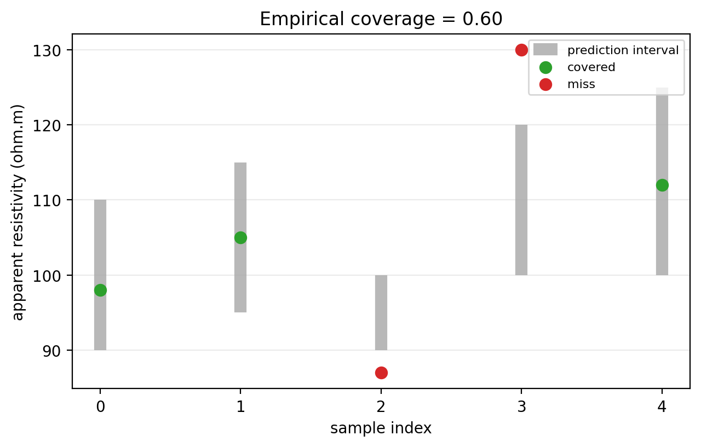
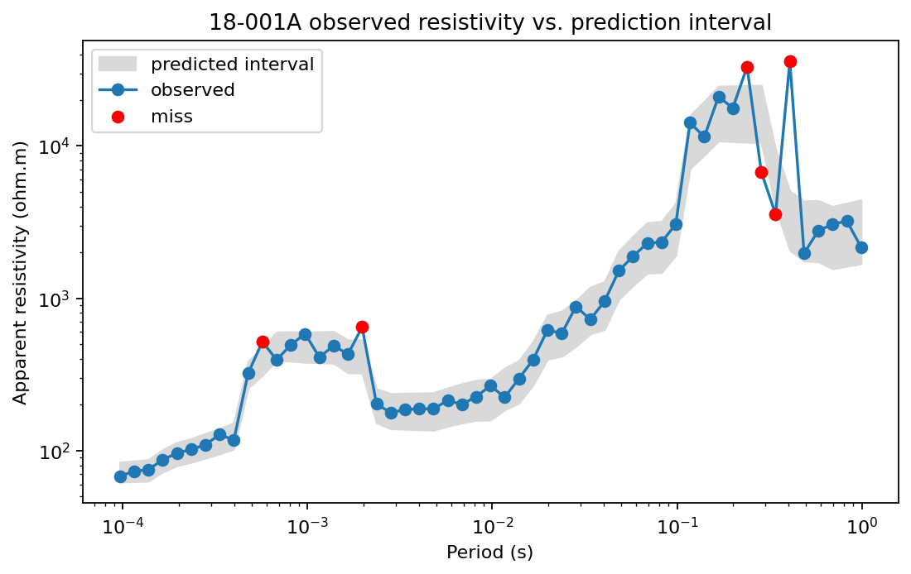
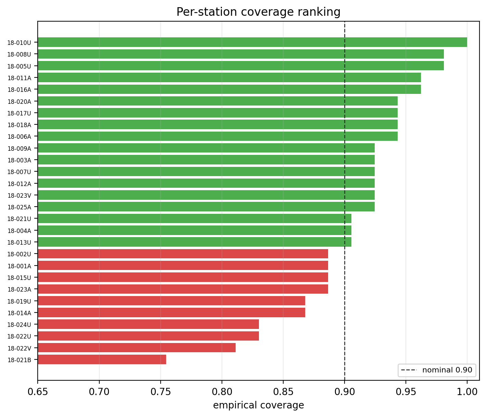
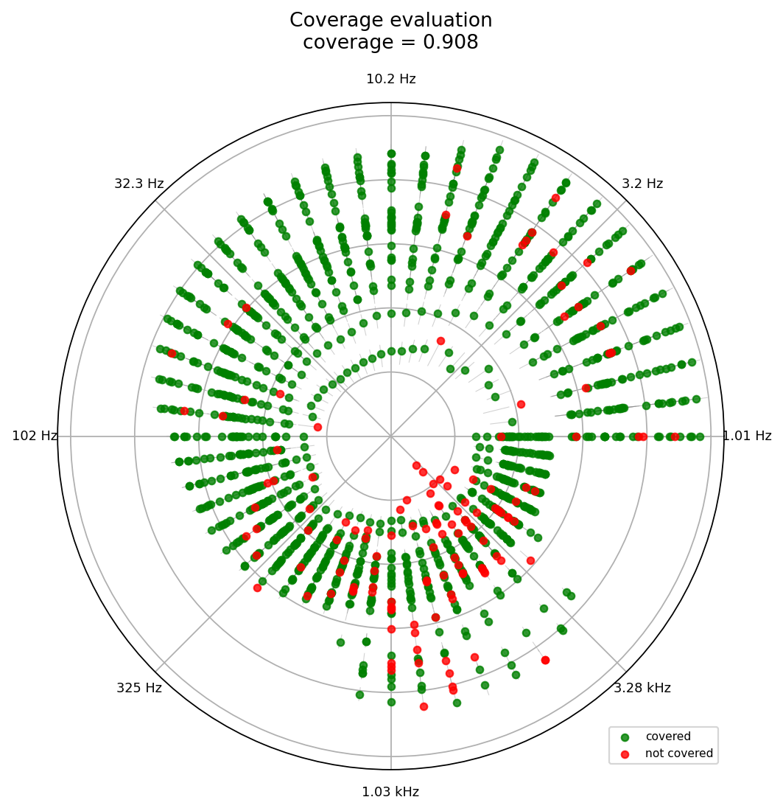
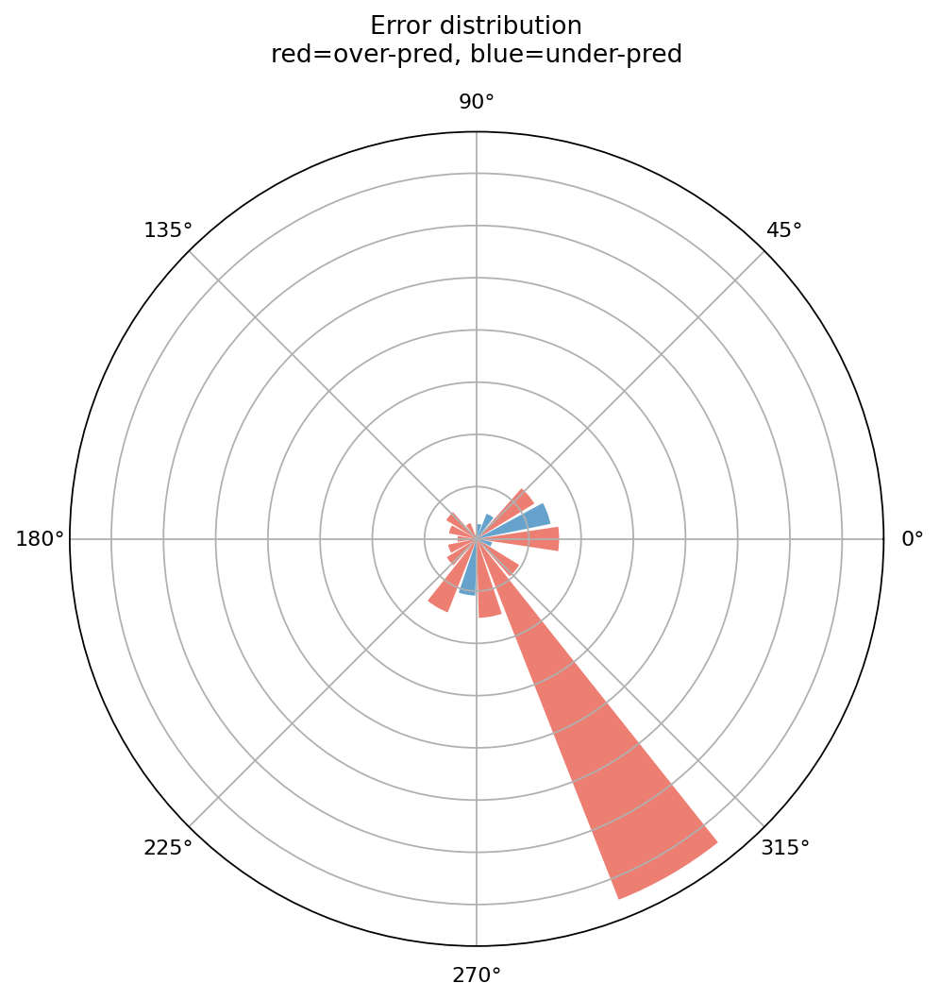
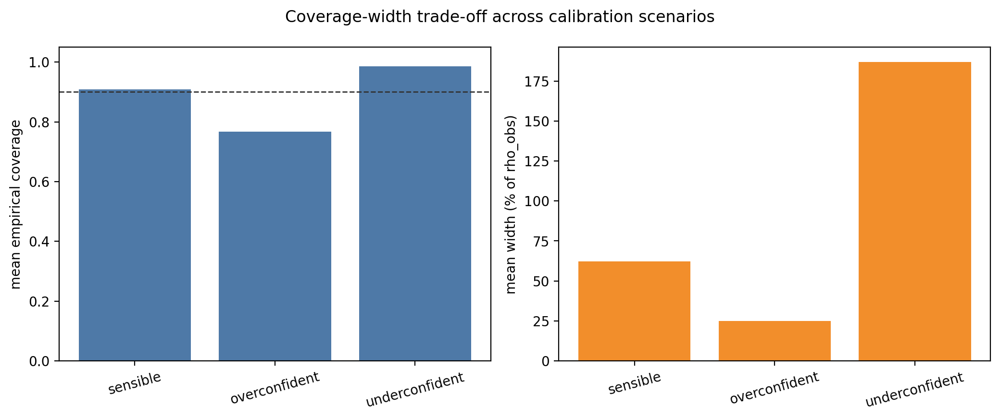

.. _emtools_diag:

Polar Uncertainty Diagnostics
=============================

``pycsamt.emtools.diag`` evaluates predicted uncertainty intervals
against observed CSAMT/AMT apparent resistivity. It adapts the
``k-diagram`` polar uncertainty ideas to electromagnetic soundings:
coverage, relative interval width, and relative prediction error.

This module is different from most ``emtools`` pages. It cannot work
from observed EDI data alone. You must provide a prediction to evaluate:

- lower and upper apparent-resistivity bounds, ``q_lo`` and ``q_hi``;
- optionally, a point prediction ``model_rho`` for relative-error plots.

Full callable signatures live in the :doc:`API reference <../../api/emtools>`.
This user-guide page focuses on the workflow, data shapes, returned
tables, plots, and interpretation.

What The Diagnostics Measure
----------------------------

For each station and frequency, the module computes observed apparent
resistivity from one off-diagonal impedance component:

.. math::

   \rho_{a,obs} = 0.2 {|Z_{pq}|^2 \over f}

where ``pq`` is ``xy`` by default and ``f`` is frequency in hertz. This
is the same practical-unit EDI convention used by the other
``emtools`` resistivity diagnostics.

Given predicted bounds :math:`[L_j, U_j]`, coverage is:

.. math::

   c_j =
   \begin{cases}
   1, & L_j \le \rho_{a,obs,j} \le U_j \\
   0, & \text{otherwise}
   \end{cases}

The empirical coverage of a station is the mean of those binary values.
For a nominal 90 percent interval, a station with empirical coverage
above ``0.9`` is flagged as calibrated by the default rule.

For station :math:`s`, with :math:`n_s` evaluated frequencies, this is

.. math::

   \widehat{P}_s =
   {1 \over n_s}\sum_{j=1}^{n_s} c_{s,j},
   \qquad
   calibrated_s =
   \mathbf{1}\{\widehat{P}_s \ge p_{nom}\}.

Here :math:`p_{nom}` is the requested nominal coverage probability,
for example :math:`0.90` for a 90 percent interval.

The module also reports relative interval width:

.. math::

   width_j =
   100 {U_j - L_j \over \rho_{a,obs,j}}

and relative point-prediction error:

.. math::

   error_j =
   100 {\rho_{a,pred,j} - \rho_{a,obs,j} \over \rho_{a,obs,j}}

Coverage tells you whether observations fall inside predicted
intervals. Width tells you whether that coverage was useful or merely
overly cautious. Error tells you where a point prediction systematically
over- or under-predicts the observed sounding.

Inputs You Must Provide
-----------------------

The observed data input is the usual ``emtools`` ``sites`` argument:

- a directory containing EDI files,
- one EDI-like object,
- a ``Sites`` container,
- an iterable of site-like objects.

The prediction inputs can be shaped in three ways:

.. list-table::
   :header-rows: 1
   :widths: 30 70

   * - Input shape
     - Meaning
   * - scalar
     - Broadcast one value to every station and frequency.
   * - one array
     - Reuse the same per-frequency array for each station.
   * - ``dict[str, array]``
     - Use station-specific arrays keyed by station name.

For real work, the dictionary form is usually best. Each array must be
aligned with that station's frequency array. When a station key is
missing from the dictionary, that station is skipped.

That alignment is literal. For station :math:`s`, the vectors

.. math::

   \mathbf{f}_s = (f_{s,1}, \ldots, f_{s,n_s}),\quad
   \mathbf{L}_s = (L_{s,1}, \ldots, L_{s,n_s}),\quad
   \mathbf{U}_s = (U_{s,1}, \ldots, U_{s,n_s})

must describe the same ordered samples. If :math:`L_{s,j}` and
:math:`U_{s,j}` are shifted relative to :math:`f_{s,j}`, the coverage
score becomes a number with no physical meaning.

Pure Coverage Score
-------------------

``coverage_score`` is the pure arithmetic helper. It does not load EDI
files. Use it when you already have observed values and interval bounds.

.. code-block:: python
   :linenos:

   import numpy as np

   from pycsamt.emtools.diag import coverage_score

   rho_obs = np.array([98.0, 105.0, 87.0, 130.0, 112.0])
   q_lo = np.array([90.0, 95.0, 90.0, 100.0, 100.0])
   q_hi = np.array([110.0, 115.0, 100.0, 120.0, 125.0])

   score = coverage_score(rho_obs, q_lo, q_hi)
   print(f"empirical coverage = {score:.2f}")

.. code-block:: text

   empirical coverage = 0.60

Line 9 computes the fraction of observations that fall inside their
interval. In this toy example, values below ``q_lo`` or above ``q_hi``
count as misses.

Building Example Bounds
-----------------------

The rest of the workflow needs prediction intervals. The example below
builds a simple baseline from real L18PLT observations: a rolling median
in log-resistivity space becomes the center line, and the interval width
grows toward longer periods.

This is not a forecasting model. It is a transparent way to demonstrate
the diagnostics using real observed EDI data.

.. code-block:: python
   :linenos:

   import numpy as np

   from pycsamt.emtools.diag import rho_coverage

   survey = "data/AMT/WILLY_DATA/L18PLT"

   raw = rho_coverage(
       survey,
       q_lo=0.0,
       q_hi=np.inf,
       rho_comp="xy",
   )

   q_lo = {}
   q_hi = {}
   model = {}

   log_period = np.log10(raw["period_s"])
   p_min = log_period.min()
   p_max = log_period.max()

   for station, group in raw.groupby("station", sort=False):
       group = group.reset_index(drop=True)
       smooth = (
           np.log10(group["rho_obs"])
           .rolling(5, center=True, min_periods=1)
           .median()
       )
       center = 10.0 ** smooth.to_numpy()
       t = (np.log10(group["period_s"]) - p_min) / (p_max - p_min + 1e-12)
       half_width = 0.15 + 0.30 * t

       q_lo[station] = center * (1.0 - half_width)
       q_hi[station] = center * (1.0 + half_width)
       model[station] = center

Lines 7-12 use ``rho_coverage`` with infinite bounds as a convenient
way to extract observed apparent resistivity. Lines 31-33 build
station-specific lower bounds, upper bounds, and point predictions.

In mathematical form, the center line is a rolling median in
log-resistivity,

.. math::

   m_j =
   10^{\operatorname{median}_{k\in W_j}
   \left(\log_{10}\rho_{a,obs,k}\right)},

where :math:`W_j` is the local smoothing window. The half-width is made
larger at longer periods,

.. math::

   h_j =
   0.15 + 0.30\,
   {\log_{10}T_j-\min(\log_{10}T)
   \over
   \max(\log_{10}T)-\min(\log_{10}T)},

and the interval is then

.. math::

   L_j = m_j(1-h_j), \qquad U_j = m_j(1+h_j).

This is deliberately transparent: the diagnostics are being tested
against a smooth baseline, not hidden behind a separate inversion or
machine-learning model.

Per-Frequency Coverage
----------------------

Use ``rho_coverage`` when you need one row per station and frequency.

.. code-block:: python
   :linenos:

   from pycsamt.emtools.diag import rho_coverage

   detail = rho_coverage(
       "data/AMT/WILLY_DATA/L18PLT",
       q_lo=q_lo,
       q_hi=q_hi,
       rho_comp="xy",
       recursive=True,
       on_dup="replace",
       strict=False,
       verbose=0,
   )

   print(detail.head())
   detail.to_csv("l18plt_coverage_detail.csv", index=False)

.. code-block:: text

      station  freq_hz  period_s  ...        q_hi  covered  width_pct
   0  18-001A  10400.0  0.000096  ...   83.967382     True  32.193022
   1  18-001A   8707.0  0.000115  ...   85.549285     True  31.582076
   2  18-001A   7289.0  0.000137  ...   87.159020     True  32.307651
   3  18-001A   6102.0  0.000164  ...  101.271129     True  33.461671
   4  18-001A   5108.0  0.000196  ...  112.968367     True  34.616073

   [5 rows x 8 columns]

The output columns are:

- ``station``: station name.
- ``freq_hz`` and ``period_s``: frequency and inverse frequency.
- ``rho_obs``: observed apparent resistivity from ``Zxy`` or ``Zyx``.
- ``q_lo`` and ``q_hi``: prediction interval bounds.
- ``covered``: ``True`` when ``q_lo <= rho_obs <= q_hi``.
- ``width_pct``: interval width as a percentage of ``rho_obs``.

The most common mistake is misalignment. If your ``q_lo`` and ``q_hi``
arrays are not ordered the same way as the station's frequency array,
coverage will be meaningless even though the code can still run.

Single-Station Inspection
-------------------------

Before trusting summary statistics, inspect one station's observed
curve against its bounds.

.. code-block:: python
   :linenos:

   import matplotlib.pyplot as plt

   station = "18-001A"
   one = detail.loc[detail["station"] == station].sort_values("period_s")

   fig, ax = plt.subplots(figsize=(7, 4.5))
   ax.fill_between(
       one["period_s"],
       one["q_lo"],
       one["q_hi"],
       color="0.85",
       label="predicted interval",
   )
   ax.loglog(one["period_s"], one["rho_obs"], "o-", label="observed")
   ax.scatter(
       one.loc[~one["covered"], "period_s"],
       one.loc[~one["covered"], "rho_obs"],
       color="red",
       zorder=4,
       label="miss",
   )
   ax.set_xlabel("Period (s)")
   ax.set_ylabel("Apparent resistivity (ohm.m)")
   ax.set_title(f"{station} observed resistivity vs. prediction interval")
   ax.legend()
   fig.tight_layout()

Red points are misses. A few isolated misses may be acceptable. A whole
frequency band outside the interval usually means the model is biased or
the interval width is too narrow in that part of the spectrum.

Per-Station Coverage Table
--------------------------

Use ``coverage_table`` to summarize each station.

.. code-block:: python
   :linenos:

   from pycsamt.emtools.diag import coverage_table

   table = coverage_table(
       "data/AMT/WILLY_DATA/L18PLT",
       q_lo=q_lo,
       q_hi=q_hi,
       rho_comp="xy",
       nominal=0.9,
   )

   ranked = table.sort_values("empirical_cov")
   print(ranked.head(10))

.. code-block:: text

       station  n_freq  empirical_cov  mean_width_pct  calibrated_flag
   20  18-021B      53       0.754717       61.136034            False
   23  18-022V      53       0.811321       61.889193            False
   26  18-024U      53       0.830189       62.828105            False
   22  18-022U      53       0.830189       61.305808            False
   13  18-014A      53       0.867925       66.977547            False
   18  18-019U      53       0.867925       62.615552            False
   14  18-015U      53       0.886792       62.958395            False
   0   18-001A      53       0.886792       63.019031            False
   24  18-023A      53       0.886792       61.066131            False
   1   18-002U      53       0.886792       63.691545            False

The output columns are:

- ``station``: station name.
- ``n_freq``: number of evaluated frequencies.
- ``empirical_cov``: fraction of covered frequencies.
- ``mean_width_pct``: mean interval width as percent of observed
  resistivity.
- ``calibrated_flag``: ``True`` when ``empirical_cov >= nominal``.

A station can be calibrated because the model is genuinely good, or
because the intervals are very wide. Always read ``empirical_cov`` with
``mean_width_pct``.

Coverage Visualization
----------------------

``plot_polar_coverage`` maps frequency to polar angle and observed
resistivity to radius. Green points are covered. Red points are misses.
Thin radial segments show the prediction interval.

With logarithmic radius, the polar coordinates are

.. math::

   \theta_j =
   2\pi\,
   {\log_{10}f_j-\min(\log_{10}f)
   \over
   \max(\log_{10}f)-\min(\log_{10}f)},
   \qquad
   r_j = \log_{10}\rho_{a,obs,j}.

The radial segment spans :math:`\log_{10}L_j` to
:math:`\log_{10}U_j`, so equal resistivity ratios occupy comparable
visual distance.

.. code-block:: python
   :linenos:

   import matplotlib.pyplot as plt

   from pycsamt.emtools.diag import plot_polar_coverage

   fig, ax = plt.subplots(
       subplot_kw={"projection": "polar"},
       figsize=(7, 7),
   )
   plot_polar_coverage(
       "data/AMT/WILLY_DATA/L18PLT",
       q_lo=q_lo,
       q_hi=q_hi,
       rho_comp="xy",
       n_freq_ticks=8,
       ax=ax,
   )
   fig.tight_layout()

This plot is useful when you want to know whether misses cluster in a
specific part of the frequency band. A red wedge suggests a systematic
frequency-dependent calibration problem. Scattered red points suggest
local noise or station-specific departures.

Width Drift
-----------

``plot_width_drift`` bins relative interval width by frequency band.
It answers a different question from coverage: how expensive was the
coverage in interval width?

For a frequency bin :math:`B_b`, the plotted mean width is

.. math::

   \overline{w}_b =
   {1 \over |B_b|}
   \sum_{j\in B_b}
   100 {U_j-L_j \over \rho_{a,obs,j}}.

.. code-block:: python
   :linenos:

   import matplotlib.pyplot as plt

   from pycsamt.emtools.diag import plot_width_drift

   fig, ax_cart = plt.subplots(figsize=(8, 4))
   plot_width_drift(
       "data/AMT/WILLY_DATA/L18PLT",
       q_lo=q_lo,
       q_hi=q_hi,
       n_bands=8,
       polar=False,
       ax=ax_cart,
   )

   fig2, ax2 = plt.subplots(
       subplot_kw={"projection": "polar"},
       figsize=(6, 6),
   )
   plot_width_drift(
       "data/AMT/WILLY_DATA/L18PLT",
       q_lo=q_lo,
       q_hi=q_hi,
       n_bands=8,
       polar=True,
       ax=ax2,
   )

.. grid:: 1 1 2 2
   :gutter: 2

   .. grid-item::

      .. image:: ../../images/user_guide/emtools/user-guide-emtools-diag-07-01.png
         :width: 100%

   .. grid-item::

      .. image:: ../../images/user_guide/emtools/user-guide-emtools-diag-07-02.png
         :width: 100%

If widths grow toward lower frequencies, uncertainty is increasing with
longer periods and, approximately, with greater investigation depth. If
widths are huge everywhere, high coverage may not be very informative.

Point-Prediction Error
----------------------

Use ``rho_error_stats`` and ``plot_polar_errors`` when you have a point
prediction, not only interval bounds.

The signed error keeps the bias direction:

.. math::

   e_j =
   100{\rho_{a,pred,j}-\rho_{a,obs,j} \over \rho_{a,obs,j}}.

In the polar summary, samples are grouped into frequency sectors
:math:`B_b`. The bar height is

.. math::

   H_b = {1 \over |B_b|}\sum_{j\in B_b}|e_j|,

while the color follows the sign of

.. math::

   \overline{e}_b = {1 \over |B_b|}\sum_{j\in B_b}e_j.

.. code-block:: python
   :linenos:

   from pycsamt.emtools.diag import rho_error_stats, plot_polar_errors

   errors = rho_error_stats(
       "data/AMT/WILLY_DATA/L18PLT",
       model_rho=model,
       rho_comp="xy",
   )

   print(errors[["station", "freq_hz", "rel_err_pct", "abs_err_pct"]].head())

   ax = plot_polar_errors(
       "data/AMT/WILLY_DATA/L18PLT",
       model_rho=model,
       rho_comp="xy",
       n_bins=18,
   )

.. code-block:: text

      station  freq_hz   rel_err_pct   abs_err_pct
   0  18-001A  10400.0  7.310073e+00  7.310073e+00
   1  18-001A   8707.0  1.375503e+00  1.375503e+00
   2  18-001A   7289.0 -1.893832e-14  1.893832e-14
   3  18-001A   6102.0  1.638024e-14  1.638024e-14
   4  18-001A   5108.0  0.000000e+00  0.000000e+00

The output columns are:

- ``rho_obs``: observed apparent resistivity.
- ``rho_pred``: predicted apparent resistivity.
- ``rel_err_pct``: signed relative error.
- ``abs_err_pct``: absolute relative error.

The polar error plot uses red bars for over-prediction and blue bars for
under-prediction. Bar height is mean absolute relative error in each
frequency sector.

Comparing Calibration Scenarios
-------------------------------

A useful diagnostic exercise is to compare sensible, overconfident, and
underconfident intervals.

.. code-block:: python
   :linenos:

   import pandas as pd

   from pycsamt.emtools.diag import coverage_table

   scenarios = {
       "sensible": 1.0,
       "overconfident": 0.4,
       "underconfident": 3.0,
   }

   rows = []
   for name, multiplier in scenarios.items():
       lo_s = {}
       hi_s = {}
       for station in q_lo:
           center = model[station]
           lo_s[station] = center - (center - q_lo[station]) * multiplier
           hi_s[station] = center + (q_hi[station] - center) * multiplier
       t = coverage_table(
           "data/AMT/WILLY_DATA/L18PLT",
           q_lo=lo_s,
           q_hi=hi_s,
       )
       rows.append(
           {
               "scenario": name,
               "mean_coverage": t["empirical_cov"].mean(),
               "mean_width_pct": t["mean_width_pct"].mean(),
               "n_calibrated": int(t["calibrated_flag"].sum()),
           }
       )

   comparison = pd.DataFrame(rows)
   print(comparison)

.. code-block:: text

            scenario  mean_coverage  mean_width_pct  n_calibrated
   0        sensible       0.908356       62.287196            18
   1   overconfident       0.766846       24.914878             0
   2  underconfident       0.986523      186.861587            28

Read this table as a trade-off. Overconfident intervals should have low
coverage and narrow width. Underconfident intervals should have high
coverage and wide intervals. A useful model is the one that reaches the
target coverage without making the intervals unnecessarily wide.

Lines 15-19 scale the interval half-width around the same point
prediction. That keeps the comparison fair: only the uncertainty width
changes, not the model center.

The scaled bounds are

.. math::

   L_j^{(\alpha)} = m_j - \alpha(m_j-L_j),
   \qquad
   U_j^{(\alpha)} = m_j + \alpha(U_j-m_j),

where :math:`m_j` is the point prediction and :math:`\alpha` is the
scenario multiplier. Values :math:`\alpha<1` make the model more
confident; values :math:`\alpha>1` make it more conservative.

Reading The Results
-------------------

Use this interpretation order:

- Check ``coverage_table`` first for station-level calibration.
- Read ``mean_width_pct`` beside ``empirical_cov``.
- Use ``plot_polar_coverage`` to locate frequency bands where misses
  cluster.
- Use ``plot_width_drift`` to see whether the model becomes less
  certain at longer periods.
- Use ``plot_polar_errors`` to identify over- or under-prediction
  sectors when a point prediction is available.

Common Failure Modes
--------------------

Missing prediction keys
   If ``q_lo`` or ``q_hi`` is a dictionary and a station key is absent,
   that station is skipped. Check the station names in your prediction
   output.

Mismatched array length
   Prediction arrays must align with the loaded station frequency array.
   Build bounds from the same station order and frequency order used by
   pyCSAMT.

Intervals with high coverage but huge width
   This is underconfidence. The model is technically calibrated but not
   very useful.

Intervals with narrow width and low coverage
   This is overconfidence. The model misses too many observations for
   the claimed interval.

Scalar bounds
   Scalars are accepted for quick tests, but they are rarely meaningful
   for real apparent-resistivity uncertainty because resistivity varies
   strongly across frequency and station.

Saving A Reproducible Diagnostic Bundle
---------------------------------------

Save the detailed coverage table, station summary, error table, and
figures together.

.. code-block:: python
   :linenos:

   from pathlib import Path

   import matplotlib.pyplot as plt

   from pycsamt.emtools.diag import (
       coverage_table,
       plot_polar_coverage,
       plot_width_drift,
       rho_coverage,
       rho_error_stats,
   )

   survey = "data/AMT/WILLY_DATA/L18PLT"
   out = Path("outputs/diag_l18plt")
   out.mkdir(parents=True, exist_ok=True)

   detail = rho_coverage(survey, q_lo=q_lo, q_hi=q_hi)
   table = coverage_table(survey, q_lo=q_lo, q_hi=q_hi)
   errors = rho_error_stats(survey, model_rho=model)

   detail.to_csv(out / "coverage_detail.csv", index=False)
   table.to_csv(out / "coverage_table.csv", index=False)
   errors.to_csv(out / "relative_errors.csv", index=False)

   fig1, ax1 = plt.subplots(subplot_kw={"projection": "polar"}, figsize=(7, 7))
   plot_polar_coverage(survey, q_lo=q_lo, q_hi=q_hi, ax=ax1)
   fig1.savefig(out / "polar_coverage.png", dpi=200)

   fig2, ax2 = plt.subplots(figsize=(8, 4))
   plot_width_drift(survey, q_lo=q_lo, q_hi=q_hi, ax=ax2)
   fig2.savefig(out / "width_drift.png", dpi=200)

.. grid:: 1 1 2 2
   :gutter: 2

   .. grid-item::

      .. image:: ../../images/user_guide/emtools/user-guide-emtools-diag-10-01.png
         :width: 100%

   .. grid-item::

      .. image:: ../../images/user_guide/emtools/user-guide-emtools-diag-10-02.png
         :width: 100%

Worked Example
--------------

The gallery example uses **L18PLT** from ``data/AMT/WILLY_DATA/`` and
builds synthetic prediction intervals around real observed apparent
resistivity. It demonstrates one-station inspection, per-station
coverage ranking, polar coverage, width drift, polar errors, and a
calibration scenario comparison.

Open the rendered example here:
:ref:`sphx_glr_examples_emtools_plot_diag.py`.
