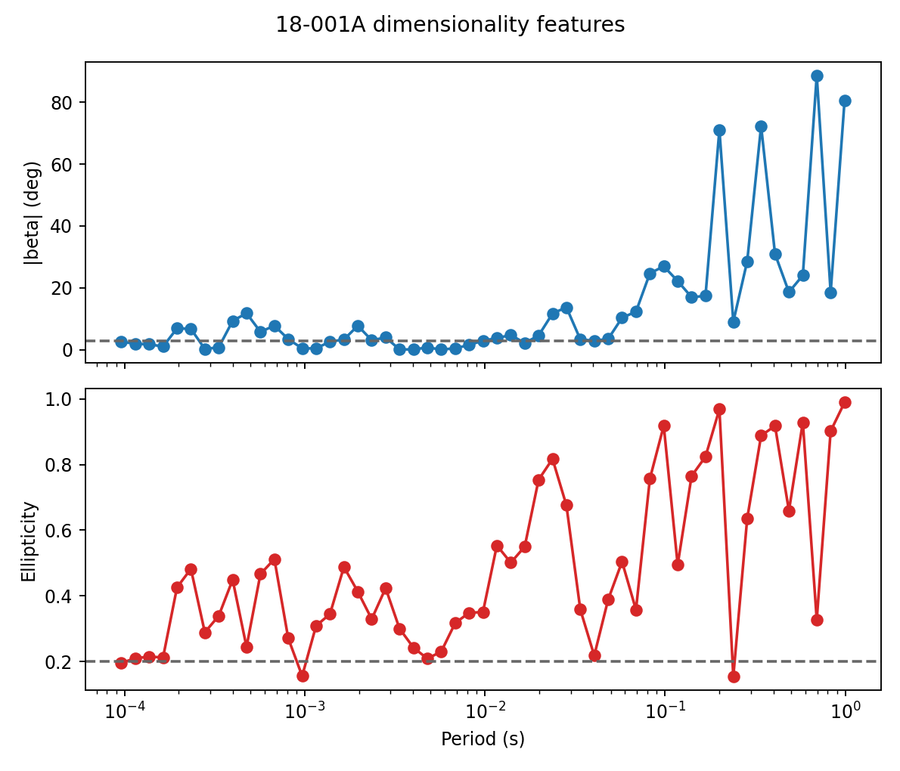
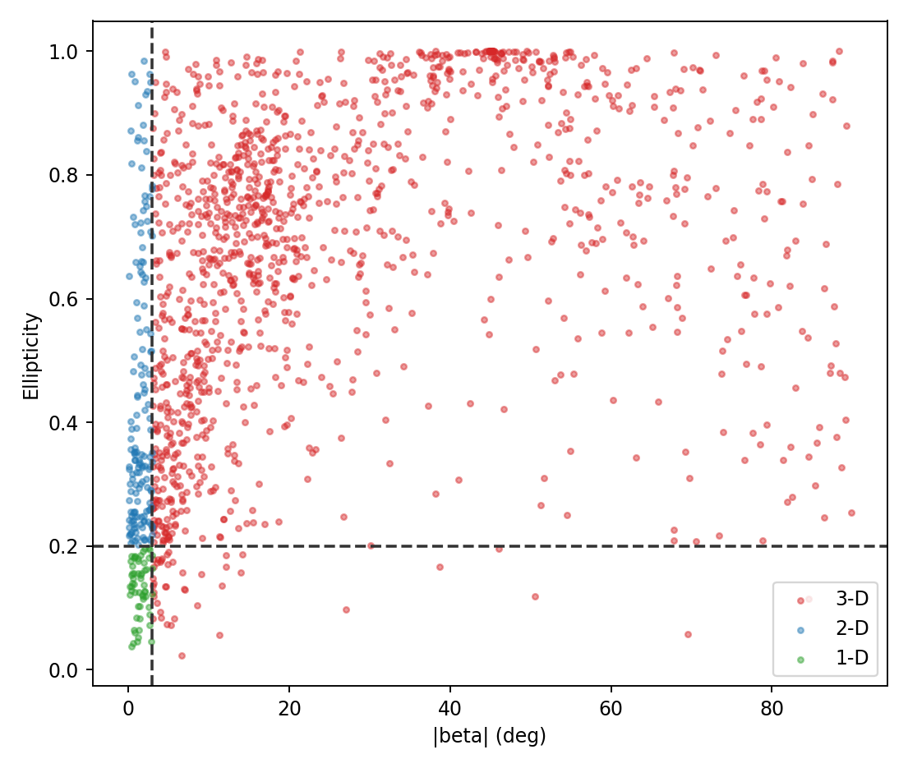
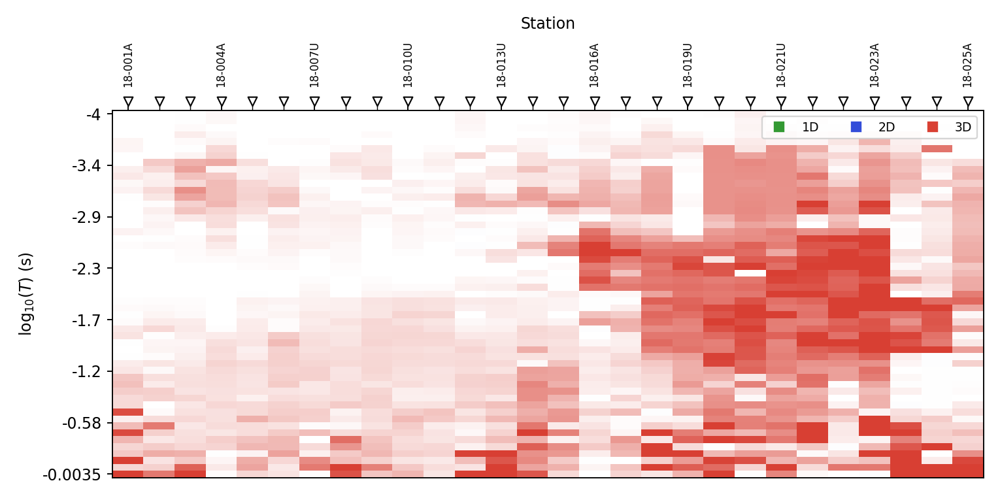
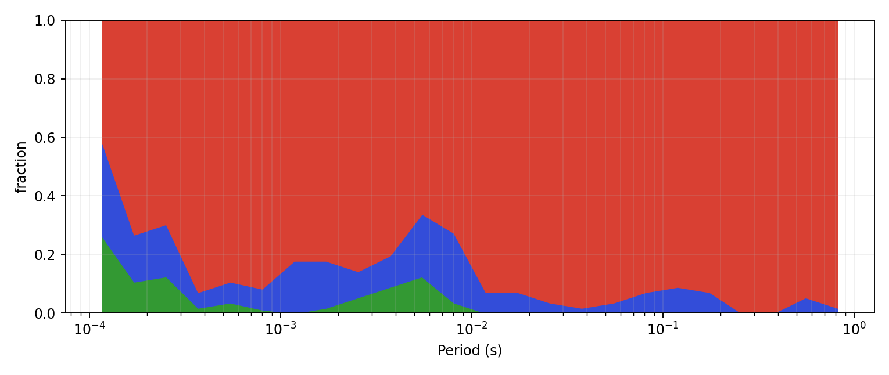
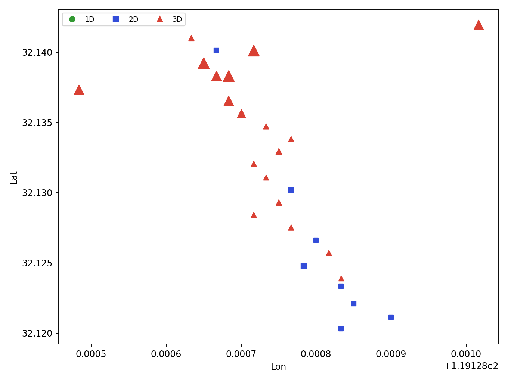
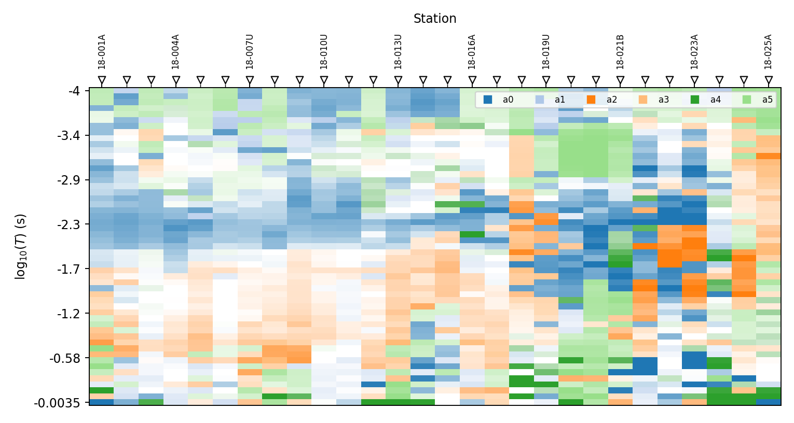

.. _emtools_dimensionality:

Dimensionality Assessment
=========================

``pycsamt.emtools.dimensionality`` asks a practical question before
interpretation or inversion: does each station-frequency sample behave
like :term:`1D`, :term:`2-D`, or :term:`3D` electromagnetic structure?

The module provides two complementary routes:

- a rule-based classifier using phase-tensor skew and ellipticity;
- a sparse dictionary workflow that learns patterns from several
  impedance and phase-tensor features.

It also provides helper workflows for 2-D inversion preparation:
masking 3-D samples, rotating data to strike, antisymmetrizing the
off-diagonal impedance tensor, and writing a pre-2D assessment table.

Full callable signatures live in the :doc:`API reference <../../api/emtools>`.
This page focuses on workflow, outputs, interpretation, and concrete
line-numbered examples.

Why Dimensionality Comes First
------------------------------

A 1-D inversion assumes horizontally layered structure. A 2-D inversion
assumes a dominant strike direction and negligible variation along that
strike. Real CSAMT/AMT data can violate both assumptions because of
local conductors, galvanic distortion, 3-D bodies, station effects, or
complex geology.

Dimensionality diagnostics do not replace inversion. They tell you how
much caution to use before choosing an inversion strategy, period band,
strike rotation, or masking rule.

Core Features
-------------

``phase_features_table`` builds one row per station and frequency. The
features combine phase-tensor quantities with determinant-style
impedance quantities:

.. list-table::
   :header-rows: 1
   :widths: 25 75

   * - Column
     - Meaning
   * - ``station``
     - Station name.
   * - ``freq``
     - Frequency in hertz.
   * - ``period``
     - Period in seconds.
   * - ``beta_abs``
     - Absolute phase-tensor skew angle, in degrees.
   * - ``ellipt_abs``
     - Absolute phase-tensor ellipticity.
   * - ``logrho_det``
     - ``log10`` determinant-style apparent resistivity.
   * - ``phi_det``
     - Determinant impedance phase, in degrees.
   * - ``tip_amp``
     - Tipper amplitude when tipper data are available; otherwise
       ``NaN``.

The determinant-style apparent resistivity and phase use the same
practical EDI unit convention used elsewhere in ``emtools`` (see
:ref:`emtools_csumt`):

.. math::

   \rho_{a,\det} =
   \sqrt{
   \left(0.2 {|Z_{xy}|^2 \over f}\right)
   \left(0.2 {|Z_{yx}|^2 \over f}\right)
   },
   \qquad
   \phi_{\det} = \arg\bigl[\det(Z)\bigr]
   = \arg\bigl(Z_{xx}Z_{yy} - Z_{xy}Z_{yx}\bigr),

with ``logrho_det`` storing :math:`\log_{10}\rho_{a,\det}` and
``phi_det`` storing :math:`\phi_{\det}` in degrees.

Rule-Based Labels
-----------------

The default rule uses two thresholds, ``skew_th = 3.0`` degrees and
``ellipt_th = 0.2``, applied to :math:`\beta=\text{beta\_abs}` and
:math:`\varepsilon=\text{ellipt\_abs}` from the feature table:

.. math::

   \dim =
   \begin{cases}
   0\ (\text{1-D}), & \beta \le \tau_\beta
      \ \text{and}\ \varepsilon \le \tau_\varepsilon, \\
   1\ (\text{2-D}), & \beta \le \tau_\beta
      \ \text{and}\ \varepsilon > \tau_\varepsilon, \\
   2\ (\text{3-D}), & \text{otherwise},
   \end{cases}

where :math:`\tau_\beta` is ``skew_th`` and :math:`\tau_\varepsilon` is
``ellipt_th``. In other words, high phase-tensor skew alone is enough
to push a sample into the 3-D class regardless of ellipticity; only
once skew is low does ellipticity separate 1-D from 2-D.

Build The Feature Table
-----------------------

Start with the raw feature table before interpreting any labels.

.. code-block:: pycon

   >>> from pathlib import Path
   >>> from pycsamt.emtools.dimensionality import phase_features_table
   >>> edi_dir = Path("data/AMT/WILLY_DATA/L18PLT")
   >>> features = phase_features_table(
   ...     edi_dir,
   ...     recursive=True,
   ...     on_dup="replace",
   ...     strict=False,
   ...     verbose=0,
   ...     api=True,
   ... ).to_pandas()
   >>> len(features), features["station"].nunique()
   (1484, 28)
   >>> cols = [
   ...     "station", "freq", "period", "beta_abs", "ellipt_abs",
   ...     "logrho_det", "phi_det", "tip_amp",
   ... ]
   >>> features[cols].head()
      station     freq    period  ...  logrho_det    phi_det  tip_amp
   0  18-001A  10400.0  0.000096  ...    1.886481  63.023441      NaN
   1  18-001A   8707.0  0.000115  ...    1.925638  61.655406      NaN
   2  18-001A   7289.0  0.000137  ...    1.948138  59.889966      NaN
   3  18-001A   6102.0  0.000164  ...    2.061820  58.836496      NaN
   4  18-001A   5108.0  0.000196  ...    2.182395  51.323119      NaN
   [5 rows x 8 columns]

``phase_features_table`` loads the EDI directory through the shared
``ensure_sites`` machinery, one row per station-frequency sample across
the real 28-station line. Passing ``api=True`` and chaining
``.to_pandas()`` makes the return type explicit and independent of the
caller's global API-view setting -- every example on this page follows
that same pattern for the table-returning functions.

Inspect One Station
-------------------

A single-station view makes the thresholds tangible.

.. code-block:: pycon

   >>> import matplotlib.pyplot as plt
   >>> skew_th = 3.0
   >>> ellipt_th = 0.2
   >>> station = "18-001A"
   >>> one = features.loc[features["station"] == station].sort_values("period")
   >>> fig, (ax_beta, ax_ellipt) = plt.subplots(2, 1, figsize=(7, 6), sharex=True)
   >>> _ = ax_beta.semilogx(one["period"], one["beta_abs"], "o-")
   >>> _ = ax_beta.axhline(skew_th, color="0.4", linestyle="--")
   >>> _ = ax_beta.set_ylabel("|beta| (deg)")
   >>> _ = ax_ellipt.semilogx(one["period"], one["ellipt_abs"], "o-", color="C3")
   >>> _ = ax_ellipt.axhline(ellipt_th, color="0.4", linestyle="--")
   >>> _ = ax_ellipt.set_xlabel("Period (s)")
   >>> _ = ax_ellipt.set_ylabel("Ellipticity")
   >>> _ = fig.suptitle(f"{station} dimensionality features")
   >>> fig.tight_layout()

If ``beta_abs`` stays above the skew threshold over most periods, the
station will be classified mostly 3-D regardless of ellipticity. If
``beta_abs`` is low, ellipticity separates 1-D from 2-D behavior.

Classify The Survey
-------------------

Use ``classify_dimensionality`` to add the ``dim`` label to the feature
table.

.. code-block:: pycon

   >>> import pandas as pd
   >>> from pycsamt.emtools.dimensionality import classify_dimensionality
   >>> dim = classify_dimensionality(
   ...     "data/AMT/WILLY_DATA/L18PLT",
   ...     skew_th=3.0,
   ...     ellipt_th=0.2,
   ...     api=True,
   ... ).to_pandas()
   >>> counts = (
   ...     dim.groupby("station")["dim"]
   ...     .value_counts(normalize=True)
   ...     .rename("fraction")
   ...     .reset_index()
   ... )
   >>> label = {0: "1D", 1: "2D", 2: "3D"}
   >>> counts["label"] = counts["dim"].map(label)
   >>> counts.head(12)
       station  dim  fraction label
   0   18-001A    2  0.660377    3D
   1   18-001A    1  0.301887    2D
   2   18-001A    0  0.037736    1D
   3   18-002U    2  0.754717    3D
   4   18-002U    1  0.132075    2D
   5   18-002U    0  0.113208    1D
   6   18-003A    2  0.905660    3D
   7   18-003A    1  0.075472    2D
   8   18-003A    0  0.018868    1D
   9   18-004A    2  0.811321    3D
   10  18-004A    1  0.132075    2D
   11  18-004A    0  0.056604    1D
   >>> dim["dim"].value_counts(normalize=True).sort_index()
   dim
   0    0.039084
   1    0.104447
   2    0.856469
   Name: proportion, dtype: float64

``classify_dimensionality`` applies the default rule; the per-station
``value_counts`` show whether a station is mostly 1-D/2-D or mostly
3-D, and the survey-wide breakdown confirms the same pattern holds
broadly: roughly 86 percent of L18PLT's station-period samples read as
3-D under these thresholds.

Read The Rule In Feature Space
------------------------------

The clearest way to understand the rule is to plot ``beta_abs`` against
``ellipt_abs``.

.. code-block:: pycon

   >>> colors = {0: "tab:green", 1: "tab:blue", 2: "tab:red"}
   >>> labels = {0: "1-D", 1: "2-D", 2: "3-D"}
   >>> fig, ax = plt.subplots(figsize=(6.5, 5.5))
   >>> for cls in (2, 1, 0):
   ...     sub = dim.loc[dim["dim"] == cls]
   ...     _ = ax.scatter(
   ...         sub["beta_abs"], sub["ellipt_abs"],
   ...         s=8, alpha=0.45, color=colors[cls], label=labels[cls],
   ...     )
   ...
   >>> _ = ax.axvline(skew_th, color="0.2", linestyle="--")
   >>> _ = ax.axhline(ellipt_th, color="0.2", linestyle="--")
   >>> _ = ax.set_xlabel("|beta| (deg)")
   >>> _ = ax.set_ylabel("Ellipticity")
   >>> _ = ax.legend()
   >>> fig.tight_layout()

The vertical line is the 3-D boundary. The horizontal line separates
1-D and 2-D only on the low-skew side of the plot.

Threshold Sensitivity
---------------------

Do not tune thresholds blindly. Sweep them and report how the
dimensionality fractions change.

.. code-block:: pycon

   >>> import numpy as np
   >>> beta = features["beta_abs"].to_numpy()
   >>> ellipt = features["ellipt_abs"].to_numpy()
   >>> skew_thresholds = np.array([1, 2, 3, 5, 8, 12, 18, 25, 35, 50])
   >>> rows = []
   >>> for skew_th in skew_thresholds:
   ...     low_skew = beta <= skew_th
   ...     frac_1d = np.mean(low_skew & (ellipt <= ellipt_th))
   ...     frac_2d = np.mean(low_skew & (ellipt > ellipt_th))
   ...     frac_3d = 1.0 - frac_1d - frac_2d
   ...     rows.append(
   ...         {
   ...             "skew_th": skew_th,
   ...             "frac_1d": frac_1d,
   ...             "frac_2d": frac_2d,
   ...             "frac_3d": frac_3d,
   ...         }
   ...     )
   ...
   >>> sensitivity = pd.DataFrame(rows)
   >>> sensitivity
      skew_th   frac_1d   frac_2d   frac_3d
   0        1  0.014151  0.035040  0.950809
   1        2  0.028302  0.071429  0.900270
   2        3  0.039084  0.104447  0.856469
   3        5  0.053908  0.182615  0.763477
   4        8  0.058625  0.268194  0.673181
   5       12  0.061321  0.364555  0.574124
   6       18  0.064016  0.510108  0.425876
   7       25  0.064016  0.595013  0.340970
   8       35  0.064690  0.671833  0.263477
   9       50  0.066038  0.766173  0.167790

The row at ``skew_th=3`` reproduces the same 3-D fraction (0.856) as
the survey-wide breakdown above, since it is the same default
threshold. If the 3-D fraction stays high over a wide threshold range,
the result is probably a property of the data. Here it does: even at
``skew_th=18`` -- six times the default -- 3-D still accounts for
roughly 43 percent of the survey, so this line's high 3-D fraction is
not an artifact of a strict threshold.

Plot The Dimensionality Grid
----------------------------

``plot_dim_confidence_grid`` maps class labels onto station x period
space. Color shows the class; opacity shows how far each sample sits
from the nearest threshold it could have crossed:

.. math::

   m =
   \begin{cases}
   \min(\text{skew\_th}-\beta_{\mathrm{abs}},\ \
        \text{ellipt\_th}-\varepsilon_{\mathrm{abs}}), & \dim = 0
        \ (\text{1-D}), \\[4pt]
   \min(\text{skew\_th}-\beta_{\mathrm{abs}},\ \
        \varepsilon_{\mathrm{abs}}-\text{ellipt\_th}), & \dim = 1
        \ (\text{2-D}), \\[4pt]
   \beta_{\mathrm{abs}}-\text{skew\_th}, & \dim = 2\ (\text{3-D}),
   \end{cases}

clipped at ``0`` and then robustly rescaled to ``[0, 1]`` by its 5th and
95th percentiles across the survey. A 1-D sample is only shown as
confident if it clears *both* the skew and ellipticity boundaries by a
margin; a 2-D sample must clear the skew boundary but stay clear of the
ellipticity one from the other side; a 3-D sample only needs to be
comfortably past the skew threshold, since ellipticity plays no role
once skew alone has already pushed a sample to 3-D. A cell near full
opacity is not merely on the correct side of a threshold — it is far
from the boundary that could have flipped its label.

.. code-block:: pycon

   >>> from pycsamt.emtools.dimensionality import plot_dim_confidence_grid
   >>> fig, ax = plt.subplots(figsize=(9, 4.5))
   >>> _ = plot_dim_confidence_grid(
   ...     "data/AMT/WILLY_DATA/L18PLT",
   ...     skew_th=3.0,
   ...     ellipt_th=0.2,
   ...     ax=ax,
   ... )
   >>> fig.tight_layout()

This plot is best for pattern recognition. Look for coherent regions by
station and period, not isolated cells.

Plot Period-Band Occupancy
--------------------------

``plot_dim_occupancy_area`` collapses station detail into period-band
fractions.

.. code-block:: pycon

   >>> from pycsamt.emtools.dimensionality import plot_dim_occupancy_area
   >>> fig, ax = plt.subplots(figsize=(9, 3.8))
   >>> _ = plot_dim_occupancy_area(
   ...     "data/AMT/WILLY_DATA/L18PLT",
   ...     skew_th=3.0,
   ...     ellipt_th=0.2,
   ...     n_bands=24,
   ...     ax=ax,
   ... )
   >>> fig.tight_layout()

Use this when you need to say whether 3-D behavior is concentrated at
short periods, long periods, or spread across the whole band.

Map Dimensionality At One Period
--------------------------------

``plot_dim_map`` chooses the nearest available period for each station
and maps the dimensionality class in station coordinates.

.. code-block:: pycon

   >>> from pycsamt.emtools.dimensionality import plot_dim_map
   >>> fig, ax = plt.subplots(figsize=(8, 6))
   >>> _ = plot_dim_map(
   ...     "data/AMT/WILLY_DATA/L18PLT",
   ...     period=0.01,
   ...     skew_th=3.0,
   ...     ellipt_th=0.2,
   ...     ax=ax,
   ... )
   >>> fig.tight_layout()

Use this for spatial checks. A line-wide class change is different from
one station acting anomalously.

Pre-2D Inversion Assessment
---------------------------

``pre2d_inversion_assessment`` is the audit table to save before a 2-D
inversion. It combines dimensionality fractions, strike estimates,
strike stability, rotation status, and Groom-Bailey status.

.. code-block:: pycon

   >>> from pycsamt.emtools.dimensionality import pre2d_inversion_assessment
   >>> assessment = pre2d_inversion_assessment(
   ...     "data/AMT/WILLY_DATA/L18PLT",
   ...     band=(0.001, 1.0),
   ...     skew_th=3.0,
   ...     ellipt_th=0.2,
   ...     rotation_applied=False,
   ...     rotation_method="consensus",
   ...     groom_bailey_attempted=False,
   ...     groom_bailey_applied=False,
   ...     groom_bailey_reason="Not attempted in this screening run.",
   ...     api=True,
   ... ).to_pandas()
   >>> assessment[[
   ...     "station", "frac_1d", "frac_2d", "frac_3d",
   ...     "strike_consensus_deg", "strike_consensus_iqr_deg",
   ...     "strike_curve_iqr_deg", "recommendation",
   ... ]].head()
      station   frac_1d  ...  strike_curve_iqr_deg               recommendation
   0  18-001A  0.000000  ...                  66.9  review_3d_effects_before_2d
   1  18-002U  0.076923  ...                  96.0  review_3d_effects_before_2d
   2  18-003A  0.025641  ...                  65.0  review_3d_effects_before_2d
   3  18-004A  0.076923  ...                  89.5  review_3d_effects_before_2d
   4  18-005U  0.025641  ...                  72.1  review_3d_effects_before_2d
   [5 rows x 8 columns]

Important columns include:

- ``period_min_s`` and ``period_max_s``: assessed period band.
- ``frac_1d``, ``frac_2d``, ``frac_3d``: dimensionality fractions.
- ``beta_abs_median`` and ``beta_abs_p95``: skew summary.
- ``ellipt_abs_median``: ellipticity summary.
- ``strike_sweep_deg``: impedance-sweep strike estimate.
- ``strike_pt_deg``: phase-tensor strike estimate.
- ``strike_consensus_deg`` and ``strike_consensus_iqr_deg``: combined
  strike and uncertainty.
- ``strike_curve_iqr_deg``: frequency-dependent strike stability.
- ``rotated_to_strike`` and ``rotation_angle_deg``: rotation audit.
- ``groom_bailey_attempted`` and ``groom_bailey_applied``: distortion
  correction audit.
- ``recommendation``: simple screening recommendation, from the rule

  .. math::

     \text{recommendation} =
     \begin{cases}
     \text{review\_3d\_effects\_before\_2d}, &
        \text{frac\_3d} > 0.5, \\
     \text{unstable\_strike\_review\_band}, &
        \text{strike\_consensus\_iqr\_deg} > 20^\circ, \\
     \text{acceptable\_for\_2d\_with\_documented\_rotation}, &
        \text{otherwise},
     \end{cases}

  checked in that order, so a station that is both mostly 3-D and
  strike-unstable is reported for its dimensionality problem first — the
  strike instability is still visible in ``strike_consensus_iqr_deg``
  itself, just not surfaced as the headline recommendation.

This table is useful in manuscripts and reports because it records not
only the selected strike, but also whether the assumptions behind a 2-D
workflow were checked.

Masking 3-D Samples
-------------------

``mask_by_dimensionality`` replaces samples outside the selected classes
with ``NaN`` in the impedance tensor and tipper when present.

.. code-block:: pycon

   >>> from pycsamt.emtools.dimensionality import mask_by_dimensionality
   >>> masked = mask_by_dimensionality(
   ...     "data/AMT/WILLY_DATA/L18PLT",
   ...     keep=(0, 1),
   ...     inplace=False,
   ... )

By default, ``keep=(0, 1)`` keeps 1-D and 2-D samples and masks 3-D
samples. Use this carefully: masking can remove large parts of a real
survey if the line is strongly 3-D -- exactly the situation on
L18PLT. The dimensionality counts already computed above say precisely
how much this default mask would remove here:

.. code-block:: pycon

   >>> kept = dim["dim"].isin([0, 1])
   >>> int(kept.sum()), len(dim), round(kept.mean(), 4)
   (213, 1484, 0.1435)

Only 14.35 percent of L18PLT's station-period samples are 1-D or 2-D
under the default thresholds, so ``keep=(0, 1)`` here would discard
the large majority of the survey -- a real instance of the "Masking
removes too much data" failure mode below, not a hypothetical one.
Widening the period band or accepting a documented rotation instead of
masking is usually the better choice for a line this heavily 3-D.

Projecting To A 2-D Tensor Form
-------------------------------

``project_to_2d`` rotates data to strike and optionally
antisymmetrizes the off-diagonal tensor terms.

.. code-block:: pycon

   >>> from pycsamt.emtools.dimensionality import project_to_2d
   >>> projected = project_to_2d(
   ...     "data/AMT/WILLY_DATA/L18PLT",
   ...     strike=None,
   ...     method="swift",
   ...     antisym=True,
   ...     inplace=False,
   ... )
   >>> len(list(projected))
   28

When ``strike=None``, pyCSAMT estimates strike before rotation. Pass an
explicit strike angle when you have already selected one from your
assessment table or a separate structural analysis.

Sparse Dictionary Workflow
--------------------------

The dictionary route learns patterns from four standardized features:
``beta_abs``, ``ellipt_abs``, ``logrho_det``, and ``tip_amp`` -- the
same columns built by ``phase_features_table`` above. It is
unsupervised. It does not know geology. Each feature is first
z-scored across the whole survey, :math:`x' = (x - \mu)/\sigma`, so that
skew in degrees, ellipticity, log-resistivity, and tipper amplitude all
compete on the same footing regardless of their native units. The
model then learns a small set of :math:`k` atoms via :term:`dictionary
learning` (``n_atoms``, default ``6``) — feature-space directions that
repeated patterns in the survey tend to align with — and represents
every standardized sample :math:`z` as a sparse combination of them by
:term:`sparse coding`, solving a Lasso-style problem:

.. math::

   \hat{a} = \arg\min_{a}\ \tfrac12\lVert z - D a \rVert_2^2
   + \lambda \lVert a \rVert_1,

where ``lam`` is :math:`\lambda`. The :math:`\ell_1` penalty is what
makes the code sparse: most atoms end up with a coefficient of exactly
``0`` for a given sample, and only the few atoms that actually explain
that sample's feature pattern get a nonzero weight — visible in the
``a0``...``a5`` columns of the example below. This is solved by ISTA
(iterative soft-thresholding), alternating a gradient step against the
residual with a shrinkage step that zeros out small coefficients,
repeated ``code_iter`` times per sample. Fitting the dictionary itself
(``learn_dim_dictionary``) alternates this coding step over every
sample with a dictionary update — re-solving :math:`D` in closed form
from the current codes (the MOD rule, ``D = X A^\top (A A^\top)^{-1}``,
followed by rescaling every atom back to unit norm) — for ``n_iter``
rounds.

Once fit, each atom is itself labelled 1-D/2-D/3-D by applying fixed
thresholds to its own standardized loadings — ``0.35`` on the atom's
``beta_abs`` component and ``0.15`` on its ``ellipt_abs`` component,
the same three-way logic as the rule-based classifier but evaluated in
standardized units rather than degrees, since an atom has no native
units of its own. A sample is then assigned the label of whichever
atom dominates its code,

.. math::

   \mathrm{dim\_pred} = \mathrm{label}\Bigl(\arg\max_j |\hat{a}_j|\Bigr),

so ``encode_dimensionality`` labels a sample by which single learned
pattern explains it most strongly, not by a vote across all of them.

.. code-block:: pycon

   >>> pd.set_option("display.max_columns", None)
   >>> pd.set_option("display.width", 120)
   >>> from pycsamt.emtools.dimensionality import (
   ...     encode_dimensionality,
   ...     learn_dim_dictionary,
   ... )
   >>> model = learn_dim_dictionary(
   ...     "data/AMT/WILLY_DATA/L18PLT",
   ...     n_atoms=6,
   ...     lam=0.05,
   ...     n_iter=40,
   ...     code_iter=50,
   ... )
   >>> encoded = encode_dimensionality(
   ...     "data/AMT/WILLY_DATA/L18PLT",
   ...     model,
   ...     lam=0.05,
   ...     code_iter=50,
   ...     api=True,
   ... ).to_pandas()
   >>> encoded.filter(regex="station|period|dim_pred|^a").head()
      station    period        a0        a1        a2   a3   a4        a5  dim_pred
   0  18-001A  0.000096  0.792681 -0.814458  0.009989  0.0  0.0 -0.962689         2
   1  18-001A  0.000115  0.814154 -0.755835  0.000000  0.0 -0.0 -0.929701         2
   2  18-001A  0.000137  0.837414 -0.734864  0.000000  0.0 -0.0 -0.896495         2
   3  18-001A  0.000164  0.984748 -0.694957  0.000000  0.0 -0.0 -0.704885         2
   4  18-001A  0.000196  0.571910 -0.155617  0.000000  0.0 -0.0 -0.638730         2

The model dictionary contains:

- ``D``: learned atom matrix.
- ``A``: sparse code matrix for the training samples.
- ``mu`` and ``sd``: feature standardization values.
- ``feat``: feature names.
- ``meta``: sample metadata such as station names and periods.

The encoded table keeps the feature columns and adds:

- ``a0``, ``a1``, ...: sparse atom coefficients.
- ``dim_pred``: dictionary-derived dimensionality label.

Compare Rule Labels And Dictionary Labels
-----------------------------------------

The dictionary workflow is most useful as an independent check, not as a
replacement for the rule.

.. code-block:: pycon

   >>> survey = "data/AMT/WILLY_DATA/L18PLT"
   >>> rule = classify_dimensionality(survey, api=True).to_pandas()
   >>> model = learn_dim_dictionary(survey, n_atoms=6)
   >>> encoded = encode_dimensionality(survey, model, api=True).to_pandas()
   >>> compare = rule[["station", "period", "dim"]].merge(
   ...     encoded[["station", "period", "dim_pred"]],
   ...     on=["station", "period"],
   ...     how="inner",
   ... )
   >>> agreement = (compare["dim"] == compare["dim_pred"]).mean()
   >>> print(f"rule/dictionary agreement = {agreement:.2%}")
   rule/dictionary agreement = 63.75%

Agreement near 100 percent means the learned atoms reproduce the rule.
Lower agreement means the data-driven features are separating samples
differently — and some disagreement is expected by construction here,
since the atom labels are thresholded in standardized units while
``classify_dimensionality`` uses ``skew_th``/``ellipt_th`` in raw
degrees and ellipticity. Low agreement is a prompt to look at which
samples disagree, not proof that either labeling is wrong.

Dictionary Masking And Atom Plots
---------------------------------

``mask_by_dictionary`` applies the same idea as ``mask_by_dimensionality``
but uses ``dim_pred`` from the learned dictionary. ``plot_atom_psection``
shows which learned atom dominates each station-period cell, and shades
each cell by how much of that sample's code the dominant atom actually
accounts for:

.. math::

   \mathrm{energy} =
   \begin{cases}
   \sum_j |a_j| & \text{energy="l1"}, \\
   \max_j |a_j| & \text{energy="max"}, \\
   \sqrt{\sum_j a_j^2} & \text{energy="l2" (default)},
   \end{cases}

robustly rescaled to ``[0, 1]`` the same way the confidence grid above
is. A cell can have a clear dominant atom yet low total energy — a weak,
barely-nonzero code — so treat pale cells as ambiguous even where the
color looks decisive.

.. code-block:: pycon

   >>> from pycsamt.emtools.dimensionality import (
   ...     mask_by_dictionary,
   ...     plot_atom_psection,
   ... )
   >>> masked = mask_by_dictionary(survey, model, keep=(0, 1), inplace=False)
   >>> fig, ax = plt.subplots(figsize=(9, 4.8))
   >>> _ = plot_atom_psection(survey, model, energy="l2", ax=ax)
   >>> fig.tight_layout()

Use the atom pseudo-section to check whether one learned pattern is
localized in a period band or station group. A model that produces
random-looking atom occupancy is not a useful diagnostic.

Reading The Results
-------------------

Use this interpretation order:

- Inspect ``beta_abs`` and ``ellipt_abs`` before accepting labels.
- Report the thresholds used for rule-based classification.
- Sweep thresholds when the conclusion depends on the default values.
- Treat broad station-period patterns as stronger evidence than isolated
  cells.
- Save ``pre2d_inversion_assessment`` before a 2-D inversion.
- Use dictionary labels as an independent check, not as a black-box
  replacement for the phase-tensor rule.

Common Failure Modes
--------------------

Mostly 3-D classifications
   This may be a real survey property, especially in complex geology.
   Do a threshold sweep before changing thresholds to get the result you
   hoped for.

No tipper data
   ``tip_amp`` becomes ``NaN``. The dictionary workflow replaces missing
   values during standardization, but you should still record that
   tipper information was absent.

Unstable strike
   A wide ``strike_consensus_iqr_deg`` or ``strike_curve_iqr_deg`` means
   strike is not stable across methods or period. Review the band before
   rotating to 2-D.

Masking removes too much data
   If most samples are 3-D, ``keep=(0, 1)`` may leave too little for a
   stable inversion. Consider changing the period band rather than
   masking blindly.

Dictionary disagreement
   Rule and dictionary labels can disagree because they use different
   information. Inspect atom occupancy and feature distributions before
   using dictionary masks operationally.

Saving A Reproducible Bundle
----------------------------

For reporting, save the raw features, rule labels, pre-2D assessment,
and dictionary encoding.

.. code-block:: pycon

   >>> from pathlib import Path
   >>> from pycsamt.emtools.dimensionality import (
   ...     classify_dimensionality,
   ...     encode_dimensionality,
   ...     learn_dim_dictionary,
   ...     phase_features_table,
   ...     plot_dim_confidence_grid,
   ...     pre2d_inversion_assessment,
   ... )
   >>> out = Path("outputs/dimensionality_l18plt")
   >>> out.mkdir(parents=True, exist_ok=True)
   >>> features = phase_features_table(survey, api=True).to_pandas()
   >>> rule = classify_dimensionality(survey, api=True).to_pandas()
   >>> assessment = pre2d_inversion_assessment(
   ...     survey, band=(0.001, 1.0), api=True,
   ... ).to_pandas()
   >>> model = learn_dim_dictionary(survey, n_atoms=6)
   >>> encoded = encode_dimensionality(survey, model, api=True).to_pandas()
   >>> features.to_csv(out / "phase_features.csv", index=False)
   >>> rule.to_csv(out / "rule_dimensionality.csv", index=False)
   >>> assessment.to_csv(out / "pre2d_assessment.csv", index=False)
   >>> encoded.to_csv(out / "dictionary_encoding.csv", index=False)
   >>> fig, ax = plt.subplots(figsize=(9, 4.5))
   >>> _ = plot_dim_confidence_grid(survey, ax=ax)
   >>> fig.tight_layout()
   >>> fig.savefig(out / "dimensionality_confidence_grid.png", dpi=200)

.. image:: ../../images/user_guide/emtools/user-guide-emtools-dimensionality-15.png
   :width: 100%

Worked Example
--------------

The gallery example uses **L18PLT** from ``data/AMT/WILLY_DATA/``. It
starts from one-station skew and ellipticity curves, shows the
rule-based feature-space partition, sweeps thresholds, plots the
pseudo-section and occupancy views, checks 2-D projection, and compares
rule-based labels with dictionary-learned labels.

Open the rendered example here:
:ref:`sphx_glr_examples_emtools_plot_dimensionality.py`.
