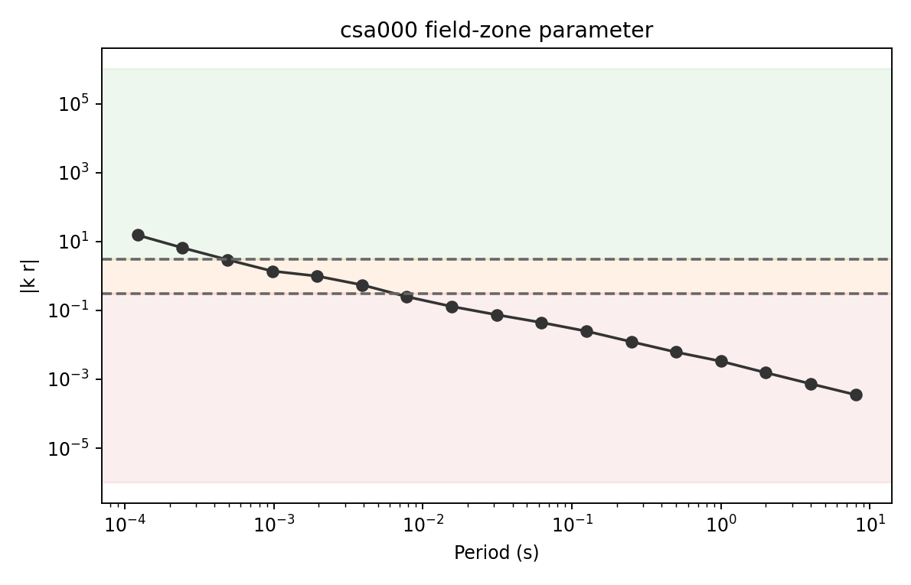
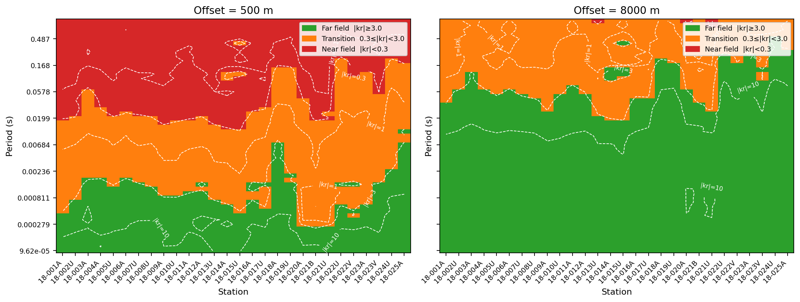
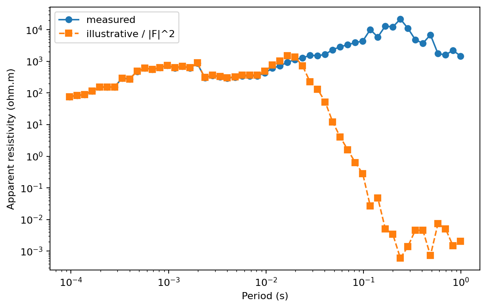
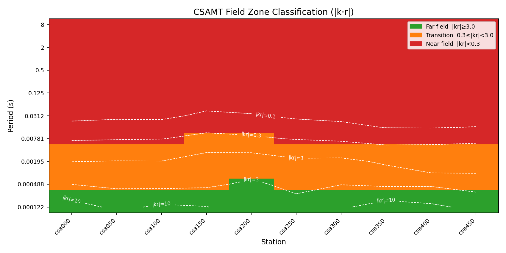

.. _emtools_fieldzone:

CSAMT Field-Zone Classification
===============================

``pycsamt.emtools.fieldzone`` checks whether a controlled-source AMT
measurement is far enough from the transmitter to behave like a
plane-wave MT response.  This matters because the usual apparent
resistivity formula assumes far-field behavior.  If the receiver is in
the near or transition zone, apparent resistivity can be biased by the
source geometry rather than only by subsurface structure.

This page is specific to controlled-source work. Natural-source AMT/MT
does not have a transmitter offset, so the field-zone workflow needs
either a real source-receiver distance or an explicit assumed distance
for sensitivity testing.

In other words, the method is not a generic data-quality score.  It asks
a narrower physical question: at this frequency, resistivity level, and
source-receiver distance, is the receiver many diffusion lengths away
from the source, or is it still seeing the transmitter geometry directly?

Full callable signatures live in the :doc:`API reference <../../api/emtools>`.
This page focuses on the workflow, outputs, examples, and interpretation.

The Field-Zone Parameter
------------------------

The core quantity is the dimensionless distance:

.. math::

   |k r| = {r \over \delta_B}.

where ``r`` is the source-receiver offset in metres and
``delta_B`` is the Bostick depth approximation:

.. math::

   \delta_B = 356 \sqrt{\rho_a \over f}.

Here :math:`f` is frequency in hertz, :math:`\rho_a` is apparent
resistivity in ohm metres, and :math:`\delta_B` is in metres.  The
constant ``356`` is the Bostick depth coefficient used by this module;
it is the skin-depth scale divided by :math:`\sqrt{2}`.  Thus
:math:`|kr|` is best read as source offset measured in Bostick-depth
units.

The measured apparent resistivity is computed from the two off-diagonal
impedance modes using the practical EDI convention used in pyCSAMT:

.. math::

   \rho_{xy} = 0.2 {|Z_{xy}|^2 \over f},
   \qquad
   \rho_{yx} = 0.2 {|Z_{yx}|^2 \over f},

.. math::

   \rho_a =
   \sqrt{\rho_{xy}\rho_{yx}}.

The geometric mean keeps the field-zone diagnostic from depending on
only one transverse mode.  If one mode is noisy or locally distorted, the
classification can still be affected, so treat the resulting ``zone`` as
a geometry-and-response diagnostic rather than a replacement for
ordinary impedance quality control.

Higher frequencies and larger offsets increase ``|k r|`` and push the
measurement toward the far field. Larger apparent resistivity increases
``delta_B`` and can push the same offset back toward transition or near
field.

For fixed :math:`r`, the scaling is

.. math::

   |kr| \propto r\sqrt{f \over \rho_a}.

This compact relationship explains the main pattern in field-zone
plots: short periods usually move downward toward far-field behavior,
whereas long periods and high-resistivity intervals tend to move toward
transition or near-field behavior.

Zone Rules
----------

The default classification thresholds are:

.. code-block:: text
   :linenos:

   far_threshold = 3.0
   near_threshold = 0.3

The labels are assigned as:

.. math::

   \mathrm{zone}(|kr|)
   =
   \begin{cases}
   \text{far},        & |kr| \ge \tau_f, \\
   \text{transition}, & \tau_n \le |kr| < \tau_f, \\
   \text{near},       & |kr| < \tau_n,
   \end{cases}

where :math:`\tau_f` is ``far_threshold`` and :math:`\tau_n` is
``near_threshold``.

Interpret the zones as:

.. list-table::
   :header-rows: 1
   :widths: 25 75

   * - Zone
     - Practical meaning
   * - ``far``
     - Plane-wave approximation is usually acceptable.
   * - ``transition``
     - Source geometry may influence the response; inspect before
       inversion.
   * - ``near``
     - Plane-wave apparent resistivity is not trustworthy without
       controlled-source correction or exclusion.

Offset Inputs
-------------

The field-zone functions need ``source_offset`` in metres. You can pass
it in three ways:

.. list-table::
   :header-rows: 1
   :widths: 30 70

   * - Input
     - Meaning
   * - ``source_offset=2000.0``
     - Use one offset for every station.
   * - ``source_offset={"18-001A": 1800.0, ...}``
     - Use station-specific offsets.
   * - ``source_offset=None``
     - Try to read offset-like attributes from each station object.

When ``source_offset`` is a dictionary, missing stations are skipped
unless the station object itself has an offset attribute. For real
CSAMT, prefer station-specific offsets from survey geometry.

Classify Field Zones
--------------------

Use ``classify_field_zones`` for the main per-station, per-frequency
table.

.. code-block:: python
   :linenos:

   from pathlib import Path

   from pycsamt.emtools.fieldzone import classify_field_zones

   edi_dir = Path("data/AMT/WILLY_DATA/L18PLT")

   zones = classify_field_zones(
       edi_dir,
       source_offset=2000.0,
       far_threshold=3.0,
       near_threshold=0.3,
       recursive=True,
       on_dup="replace",
       strict=False,
       verbose=0,
   )

   print(zones.head())
   zones.to_csv("l18plt_field_zones.csv", index=False)

.. code-block:: text

      station  freq_hz  period_s  ...  delta_bostick_m         kr  zone
   0  18-001A  10400.0  0.000096  ...        30.631900  65.291412   far
   1  18-001A   8707.0  0.000115  ...        35.021518  57.107747   far
   2  18-001A   7289.0  0.000137  ...        39.281217  50.914919   far
   3  18-001A   6102.0  0.000164  ...        48.935465  40.870155   far
   4  18-001A   5108.0  0.000196  ...        61.450026  32.546772   far

   [5 rows x 8 columns]

The output columns are:

- ``station``: station name.
- ``freq_hz`` and ``period_s``: measured frequency and period.
- ``offset_m``: source-receiver offset used for the calculation.
- ``rho_a_ohmm``: determinant-style apparent resistivity.
- ``delta_bostick_m``: Bostick depth approximation.
- ``kr``: dimensionless ``|k r|``.
- ``zone``: ``far``, ``transition``, or ``near``.

The table is tidy: every row is one station-frequency sample.  That
shape is intentional because it lets you merge the result with QC,
static-shift, skew, or inversion masks before deciding which periods to
keep.

Single-Station Curve
--------------------

Inspecting ``kr`` against period makes the classification easy to see.

.. code-block:: python
   :linenos:

   import matplotlib.pyplot as plt

   from pycsamt.emtools.fieldzone import classify_field_zones

   zones = classify_field_zones(
       "data/AMT/WILLY_DATA/L18PLT",
       source_offset=2000.0,
   )

   station = "18-001A"
   one = zones.loc[zones["station"] == station].sort_values("period_s")

   fig, ax = plt.subplots(figsize=(7, 4.5))
   ax.axhspan(3.0, 1e6, color="tab:green", alpha=0.08)
   ax.axhspan(0.3, 3.0, color="tab:orange", alpha=0.10)
   ax.axhspan(1e-6, 0.3, color="tab:red", alpha=0.08)
   ax.loglog(one["period_s"], one["kr"], "o-", color="0.2")
   ax.axhline(3.0, color="0.4", linestyle="--")
   ax.axhline(0.3, color="0.4", linestyle="--")
   ax.set_xlabel("Period (s)")
   ax.set_ylabel("|k r|")
   ax.set_title(f"{station} field-zone parameter")
   fig.tight_layout()

The shaded regions show the far, transition, and near zones. Long
periods often move toward smaller ``kr`` because Bostick depth increases
as frequency decreases.

Near-Field Factor
-----------------

``near_field_factor`` computes a continuous correction factor for the
equatorial horizontal electric dipole approximation:

.. math::

   F(p) = 1 - {3 \over p^2} + {3 \over p^3}

where ``p = k r`` is complex. The returned ``nf_factor`` is ``abs(F)``.
When it is close to ``1``, the response is far-field-like. Large
departures indicate near-field bias. Apparent resistivity bias scales
approximately with ``abs(F)^2``.

The complex wavenumber used for this factor is

.. math::

   k =
   {1+i \over \sqrt{2}}
   \sqrt{\omega\mu_0 \over \rho_a},
   \qquad
   \omega = 2\pi f,

so

.. math::

   p = k r.

The classification parameter uses only the magnitude scale
:math:`|kr|`, while ``nf_factor`` keeps the phase of the diffusive
wavenumber.  That is why the two outputs are complementary: ``zone`` is
easy to threshold and map; ``nf_factor`` shows how quickly the
near-field expression departs from the far-field limit.

.. code-block:: python
   :linenos:

   from pycsamt.emtools.fieldzone import classify_field_zones, near_field_factor

   survey = "data/AMT/WILLY_DATA/L18PLT"
   offset_m = 2000.0

   zones = classify_field_zones(survey, offset_m)
   factors = near_field_factor(survey, offset_m)

   merged = zones.merge(
       factors[["station", "freq_hz", "nf_factor"]],
       on=["station", "freq_hz"],
       how="inner",
   )

   print(
       merged.groupby("zone")["nf_factor"]
       .agg(["count", "mean", "median", "max"])
   )

.. code-block:: text

               count        mean      median           max
   zone
   far           785    0.994097    0.998870      0.999999
   near          220  960.277733  350.731935  16818.234683
   transition    479   13.091904    2.114809     86.107095

This cross-check is useful because ``zone`` is threshold-based, while
``nf_factor`` is continuous. In a good classification, far-zone samples
should cluster near ``nf_factor = 1`` and near-zone samples should show
larger departures.

Plot Field Zones
----------------

``plot_field_zones`` maps zone labels onto station x period space and
can overlay ``|k r|`` contours.

The plotted image is a matrix

.. math::

   Z_{ij}
   =
   \mathrm{zone}\left(|kr|_{ij}\right),

where :math:`i` indexes period or frequency and :math:`j` indexes
station.  Dashed contours are drawn from the continuous
:math:`|kr|_{ij}` grid, so the colors show the thresholded decision and
the contours show how close each area is to a boundary.

.. code-block:: python
   :linenos:

   import matplotlib.pyplot as plt

   from pycsamt.emtools.fieldzone import plot_field_zones

   fig, ax = plt.subplots(figsize=(10, 5))
   plot_field_zones(
       "data/AMT/WILLY_DATA/L18PLT",
       source_offset=2000.0,
       far_threshold=3.0,
       near_threshold=0.3,
       contour_kr=True,
       kr_levels=(0.1, 0.3, 1.0, 3.0, 10.0),
       sort_by="name",
       period_axis=True,
       ax=ax,
   )
   fig.tight_layout()

.. image:: ../../images/user_guide/emtools/user-guide-emtools-fieldzone-04.png
   :width: 100%

Use this as the main survey view. A broad red or orange band at long
periods means those periods should be excluded, corrected, or treated
with caution before plane-wave inversion.

Station-Specific Offsets
------------------------

Real CSAMT geometry often varies by station. Pass a dictionary when
each station has its own source-receiver distance.

.. code-block:: python
   :linenos:

   from pycsamt.emtools.fieldzone import classify_field_zones

   offsets_m = {
       "18-001A": 1800.0,
       "18-002U": 1950.0,
       "18-003A": 2100.0,
   }

   zones = classify_field_zones(
       "data/AMT/WILLY_DATA/L18PLT",
       source_offset=offsets_m,
       verbose=1,
   )

   print(zones["station"].unique())

.. code-block:: text

   ['18-001A' '18-002U' '18-003A']

Only stations with offsets are classified. With ``verbose=1``, missing
offsets produce warnings from the classifier. In production workflows,
build this dictionary from the transmitter and receiver coordinates.

Offset Sensitivity
------------------

If the source offset is uncertain, run a sensitivity sweep. The same
observed impedances can move between far and near zones solely because
the assumed offset changes.

For an assumed offset :math:`r_m`, the zone fraction is

.. math::

   P_z(r_m)
   =
   {1 \over N}
   \sum_{s,f}
   \mathbf{1}\left[
   \mathrm{zone}_{s,f}(r_m) = z
   \right],

where :math:`N` is the number of classified station-frequency samples.
This is a simple summary, but it is very effective at exposing whether a
processing conclusion depends on an assumed transmitter distance.

.. code-block:: python
   :linenos:

   import pandas as pd

   from pycsamt.emtools.fieldzone import classify_field_zones

   survey = "data/AMT/WILLY_DATA/L18PLT"
   offsets = [500.0, 2000.0, 8000.0]

   rows = []
   for offset in offsets:
       zones = classify_field_zones(survey, source_offset=offset)
       fractions = zones["zone"].value_counts(normalize=True)
       rows.append(
           {
               "offset_m": offset,
               "far": fractions.get("far", 0.0),
               "transition": fractions.get("transition", 0.0),
               "near": fractions.get("near", 0.0),
           }
       )

   sensitivity = pd.DataFrame(rows)
   print(sensitivity)

.. code-block:: text

      offset_m       far  transition      near
   0     500.0  0.258760    0.386792  0.354447
   1    2000.0  0.528976    0.322776  0.148248
   2    8000.0  0.714286    0.283019  0.002695

Report this table when offset is assumed rather than measured. It makes
the geometry dependence visible instead of hiding it inside one plot.

Comparing Offsets Side By Side
------------------------------

The plotting function accepts ``ax`` so several assumed offsets can be
compared in one figure.

.. code-block:: python
   :linenos:

   import matplotlib.pyplot as plt

   from pycsamt.emtools.fieldzone import plot_field_zones

   survey = "data/AMT/WILLY_DATA/L18PLT"

   fig, (ax_near, ax_far) = plt.subplots(1, 2, figsize=(13, 5), sharey=True)
   plot_field_zones(survey, source_offset=500.0, ax=ax_near)
   ax_near.set_title("Offset = 500 m")

   plot_field_zones(survey, source_offset=8000.0, ax=ax_far)
   ax_far.set_title("Offset = 8000 m")

   fig.tight_layout()

This comparison is especially useful for design studies: if the target
period band is near or transition at the planned offset, move the
source, change the frequency band, or plan controlled-source
corrections.

Illustrative Near-Field Correction
----------------------------------

The near-field factor can show how strongly a sounding might be biased.
The example below divides apparent resistivity by ``nf_factor ** 2`` as
an illustrative correction. Use the appropriate controlled-source
convention and survey geometry before applying this in production.

The illustrative curve is

.. math::

   \rho_a^\mathrm{illustrative}
   =
   {\rho_a^\mathrm{measured} \over |F(p)|^2}.

This follows the module's equatorial HED approximation, where the field
amplitude bias enters apparent resistivity as a squared factor.  It is a
diagnostic visualization, not a universal correction recipe for every
CSAMT transmitter layout.

.. code-block:: python
   :linenos:

   import matplotlib.pyplot as plt

   from pycsamt.emtools.fieldzone import classify_field_zones, near_field_factor

   survey = "data/AMT/WILLY_DATA/L18PLT"
   station = "18-001A"
   offset_m = 2000.0

   zones = classify_field_zones(survey, offset_m)
   factors = near_field_factor(survey, offset_m)
   merged = zones.merge(
       factors[["station", "freq_hz", "nf_factor"]],
       on=["station", "freq_hz"],
       how="inner",
   )
   one = merged.loc[merged["station"] == station].sort_values("period_s")
   corrected = one["rho_a_ohmm"] / (one["nf_factor"] ** 2)

   fig, ax = plt.subplots(figsize=(7, 4.5))
   ax.loglog(one["period_s"], one["rho_a_ohmm"], "o-", label="measured")
   ax.loglog(one["period_s"], corrected, "s--", label="illustrative / |F|^2")
   ax.set_xlabel("Period (s)")
   ax.set_ylabel("Apparent resistivity (ohm.m)")
   ax.legend()
   fig.tight_layout()

Where ``nf_factor`` is near ``1``, the curves overlap. Where
``nf_factor`` is large, the plane-wave apparent resistivity is strongly
affected by near-field behavior.

Reading The Results
-------------------

Use this interpretation order:

- Confirm the source offset is real and in metres.
- Inspect ``kr`` and ``zone`` before using long-period CSAMT data in a
  plane-wave inversion.
- Treat ``transition`` samples as conditional, not automatically safe.
- Use ``near_field_factor`` to quantify how severe the departure from
  far-field behavior may be.
- Run offset sensitivity when the source geometry is assumed or
  uncertain.
- Prefer station-specific offsets when transmitter-receiver geometry is
  available.

Common Failure Modes
--------------------

Empty output
   No valid impedance tensors were loaded, or no source offset could be
   resolved for any station.

Natural-source data without offsets
   AMT/MT data do not carry a transmitter offset. You can run
   sensitivity examples with assumed offsets, but do not present those
   numbers as measured survey geometry.

Wrong offset units
   Offsets must be metres. Passing kilometres without conversion will
   severely misclassify the field zone.

One offset for a whole survey
   This is acceptable for illustration or a constant-offset acquisition,
   but station-specific geometry is safer for real CSAMT.

Far-zone label at noisy frequencies
   Field-zone classification only checks source geometry and apparent
   resistivity. It does not replace quality control.

Saving A Reproducible Bundle
----------------------------

For reports, save the classification table, near-field factor table,
offset-sensitivity summary, and field-zone pseudo-section.

.. code-block:: python
   :linenos:

   from pathlib import Path

   import matplotlib.pyplot as plt
   import pandas as pd

   from pycsamt.emtools.fieldzone import (
       classify_field_zones,
       near_field_factor,
       plot_field_zones,
   )

   survey = "data/AMT/WILLY_DATA/L18PLT"
   offset_m = 2000.0
   out = Path("outputs/fieldzone_l18plt")
   out.mkdir(parents=True, exist_ok=True)

   zones = classify_field_zones(survey, offset_m)
   factors = near_field_factor(survey, offset_m)
   zones.to_csv(out / "field_zones.csv", index=False)
   factors.to_csv(out / "near_field_factor.csv", index=False)

   rows = []
   for offset in [500.0, 2000.0, 8000.0]:
       z = classify_field_zones(survey, offset)
       fractions = z["zone"].value_counts(normalize=True)
       rows.append(
           {
               "offset_m": offset,
               "far": fractions.get("far", 0.0),
               "transition": fractions.get("transition", 0.0),
               "near": fractions.get("near", 0.0),
           }
       )
   pd.DataFrame(rows).to_csv(out / "offset_sensitivity.csv", index=False)

   fig, ax = plt.subplots(figsize=(10, 5))
   plot_field_zones(survey, offset_m, ax=ax)
   fig.tight_layout()
   fig.savefig(out / "field_zone_pseudosection.png", dpi=200)

Worked Example
--------------

The gallery example uses **L18PLT** from ``data/AMT/WILLY_DATA/`` and
representative assumed offsets because the bundled line is natural-source
AMT and does not record transmitter geometry. It demonstrates the
``|k r|`` relationship, one-station curves, near-field factor
cross-checks, pseudo-sections, offset sensitivity, and an illustrative
near-field correction.

Open the rendered example here:
:ref:`sphx_glr_examples_emtools_plot_fieldzone.py`.
