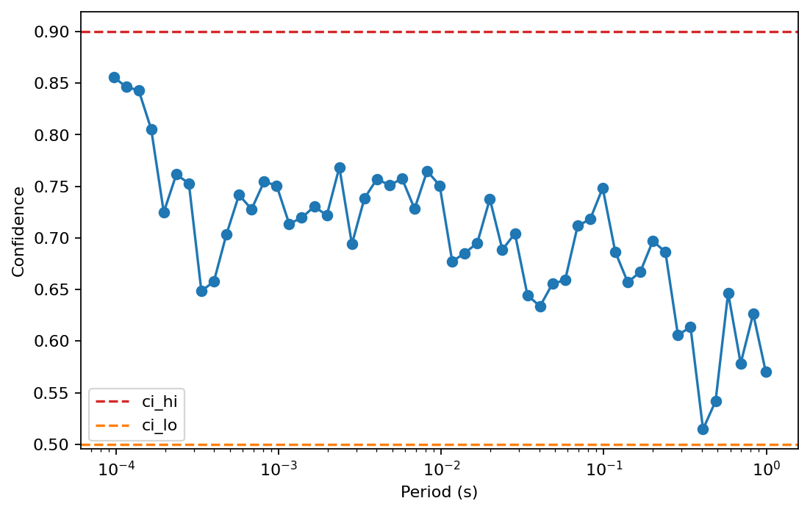
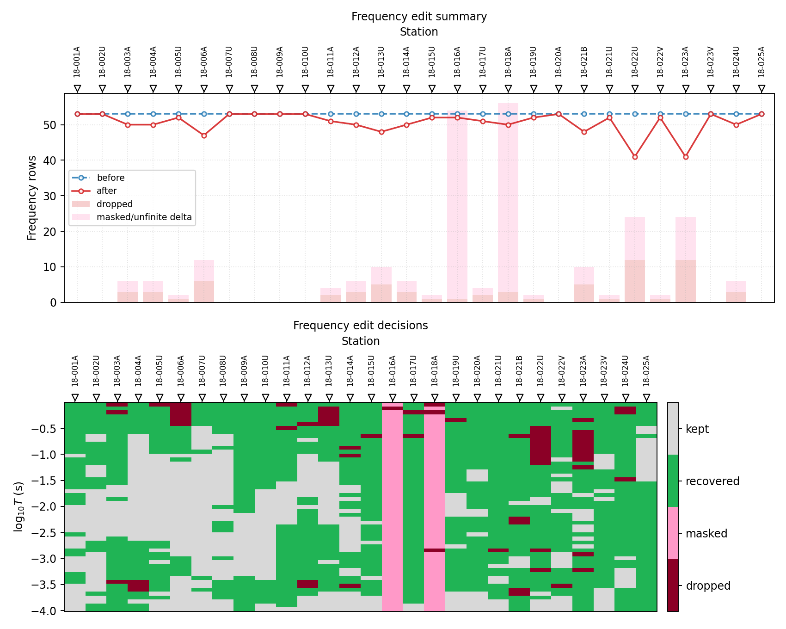
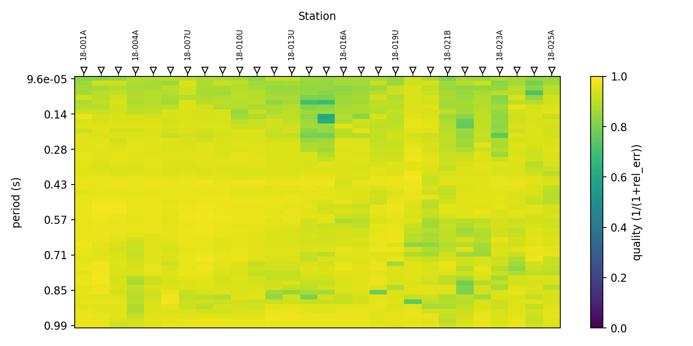
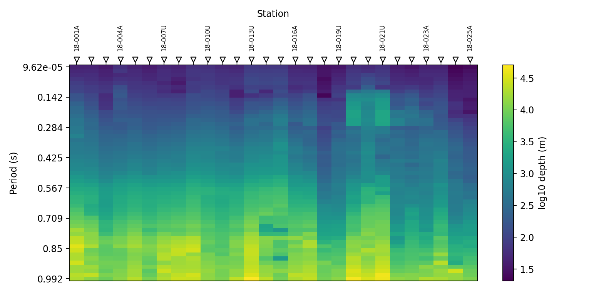
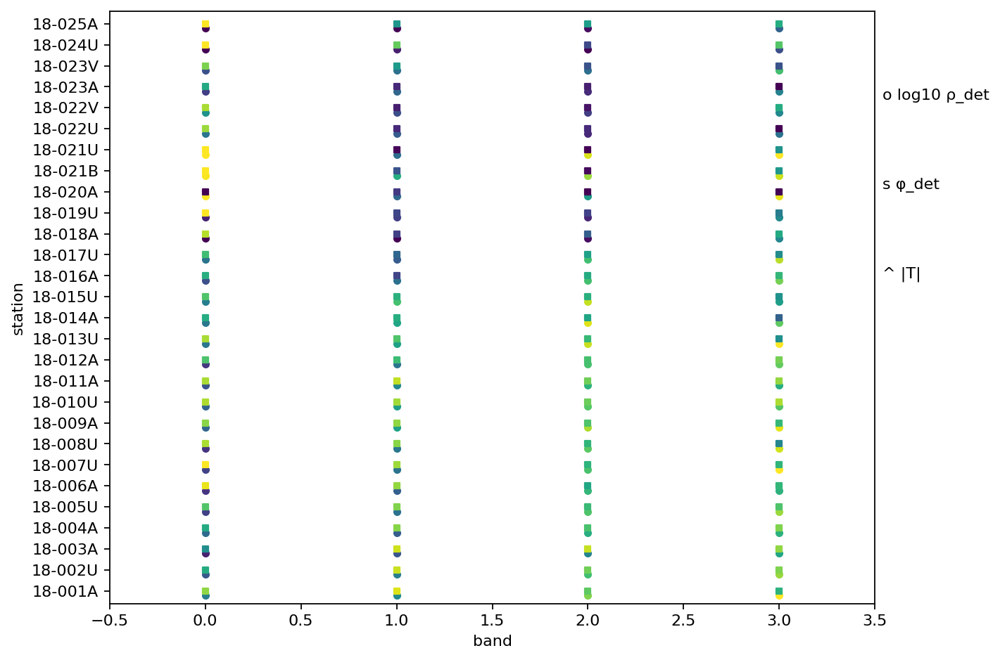

.. _emtools_frequency:

Frequency Editing, Resampling, And QC
=====================================

``pycsamt.emtools.frequency`` is the user-guide hub for operations that
change, evaluate, or visualize the frequency axis. It is used before
inversion, before section plotting, after quality control, and whenever
multiple stations need to share a consistent frequency grid.

The module covers four practical jobs:

- selecting a usable frequency band;
- dropping, masking, or recovering low-confidence rows;
- regridding, decimating, smoothing, and aligning station grids;
- plotting frequency coverage, apparent depth, and band-level summary
  diagnostics.

Full callable signatures live in the :doc:`API reference <../../api/emtools>`.
This page focuses on how to use the workflows safely, how to read their
tables, and how to avoid common frequency-axis traps.

Why Frequency Editing Matters
-----------------------------

CSAMT/AMT/MT processing is rarely limited by one bad station value. More
often, a workflow succeeds or fails because the frequency axis is
inconsistent, too noisy at the band edges, or incompatible across
stations. A 2-D inversion, pseudo-section, or model-comparison workflow
needs clear decisions about:

- which band is physically meaningful;
- which frequency rows are trusted;
- whether bad rows are removed or kept as missing values;
- whether stations should be interpolated to a shared grid;
- whether smoothing or decimation is acceptable for the next step.

The frequency module makes those decisions explicit and auditable.

Data Contract
-------------

All editing functions accept the usual ``emtools`` input:

- a directory containing EDI files,
- one EDI-like object,
- a ``Sites`` container,
- an iterable of site-like objects.

Internally the functions call ``ensure_sites``. The familiar
``recursive``, ``on_dup``, ``strict``, and ``verbose`` arguments behave
the same way as in the rest of the user guide.

Most editing functions default to ``inplace=False``. Keep that default
while exploring. Switch to ``inplace=True`` only when you intentionally
want to mutate the input object.

Selecting A Band
----------------

Use ``select_band`` when you already know the frequency limits.

.. code-block:: python
   :linenos:

   from pathlib import Path

   from pycsamt.emtools.frequency import select_band

   edi_dir = Path("data/AMT/WILLY_DATA/L18PLT")

   mid_band = select_band(
       edi_dir,
       fmin=10.0,
       fmax=1000.0,
       inplace=False,
   )

``fmin`` and ``fmax`` are in hertz. The convenience argument
``band_hz=(10.0, 1000.0)`` is also accepted. If both forms are provided,
explicit ``fmin`` and ``fmax`` take precedence.

Use ``keep`` when you want specific frequencies rather than a continuous
band.

.. code-block:: python
   :linenos:

   from pycsamt.emtools.frequency import select_band

   selected = select_band(
       "data/AMT/WILLY_DATA/L18PLT",
       keep=[10.0, 100.0, 1000.0],
   )

Band selection removes rows outside the chosen band. It changes the
frequency grid length.

Removing Duplicate Frequencies
------------------------------

Use ``drop_duplicates`` when a station has repeated or unsorted
frequency rows.

.. code-block:: python
   :linenos:

   from pycsamt.emtools.frequency import drop_duplicates

   cleaned = drop_duplicates(
       "data/AMT/WILLY_DATA/L18PLT",
       tol=1e-10,
       inplace=False,
   )

The function keeps the first occurrence of each frequency within the
tolerance and applies the same row selection to impedance and tipper
blocks when present.

Frequency Confidence
--------------------

Confidence-based editing uses ``frequency_confidence_table`` from the
QC workflow. The frequency module computes that table internally, but
you should inspect it before editing.

.. code-block:: python
   :linenos:

   import matplotlib.pyplot as plt

   from pycsamt.emtools.qc import frequency_confidence_table

   survey = "data/AMT/WILLY_DATA/L18PLT"
   confidence = frequency_confidence_table(survey)

   print(confidence[["station", "frequency_hz", "confidence", "flags"]].head())
   print(confidence["confidence"].describe())

   station = "18-001A"
   one = confidence.loc[confidence["station"] == station].sort_values("period_s")

   fig, ax = plt.subplots(figsize=(7, 4.5))
   ax.semilogx(one["period_s"], one["confidence"], "o-")
   ax.axhline(0.90, color="tab:red", linestyle="--", label="ci_hi")
   ax.axhline(0.50, color="tab:orange", linestyle="--", label="ci_lo")
   ax.set_xlabel("Period (s)")
   ax.set_ylabel("Confidence")
   ax.legend()
   fig.tight_layout()

.. code-block:: text

      station  ...                                              flags
   0  18-001A  ...  recoverable,high_error,offdiag_mismatch,diagon...
   1  18-001A  ...  reject,high_error,offdiag_mismatch,diagonal_le...
   2  18-001A  ...  reject,high_error,offdiag_mismatch,diagonal_le...
   3  18-001A  ...  reject,high_error,offdiag_mismatch,diagonal_le...
   4  18-001A  ...  reject,high_error,offdiag_mismatch,diagonal_le...

   [5 rows x 4 columns]
   count    1484.000000
   mean        0.658116
   std         0.096143
   min         0.417464
   25%         0.586675
   50%         0.654938
   75%         0.736039
   max         0.863041
   Name: confidence, dtype: float64

The key lesson is simple: do not choose ``ci_hi`` or ``threshold`` before
looking at the confidence distribution. If no row reaches ``ci_hi``,
recovery has no trusted rows to interpolate from.

Drop Or Mask Low-Confidence Rows
--------------------------------

Dropping removes rows from the frequency grid. Masking keeps the grid
but replaces low-confidence tensor rows with ``NaN``.

.. code-block:: python
   :linenos:

   from pycsamt.emtools.frequency import (
       drop_low_confidence_frequencies,
       mask_low_confidence_frequencies,
   )

   survey = "data/AMT/WILLY_DATA/L18PLT"

   dropped = drop_low_confidence_frequencies(
       survey,
       threshold=0.50,
       also="both",
       inplace=False,
   )

   masked = mask_low_confidence_frequencies(
       survey,
       threshold=0.50,
       also="both",
       inplace=False,
   )

Use ``drop`` when downstream code cannot handle missing rows. Use
``mask`` when preserving the original frequency grid matters, for
example when comparing before and after processing.

The ``also`` argument controls which blocks are edited:

.. list-table::
   :header-rows: 1
   :widths: 25 75

   * - Value
     - Meaning
   * - ``"z"``
     - Edit impedance only.
   * - ``"tipper"``
     - Edit tipper only.
   * - ``"both"``
     - Edit impedance and tipper when present.

Recover Low-Confidence Rows
---------------------------

``recover_low_confidence_frequencies`` treats rows in
``[ci_lo, ci_hi)`` as recoverable and interpolates them from trusted
rows whose confidence is at least ``ci_hi``. Rows below ``ci_lo`` are
handled by ``reject``.

.. code-block:: python
   :linenos:

   from pycsamt.emtools.frequency import recover_low_confidence_frequencies

   recovered = recover_low_confidence_frequencies(
       "data/AMT/WILLY_DATA/L18PLT",
       ci_hi=0.72,
       ci_lo=0.50,
       interpolation="linear",
       reject="drop",
       also="both",
       inplace=False,
   )

Valid interpolation modes are ``"linear"`` and ``"nearest"``. Valid
``reject`` modes are:

.. list-table::
   :header-rows: 1
   :widths: 25 75

   * - Reject mode
     - Meaning
   * - ``"drop"``
     - Remove rows below ``ci_lo``.
   * - ``"mask"``
     - Keep rows below ``ci_lo`` but set them to ``NaN``.
   * - ``"keep"``
     - Leave rejected rows unchanged.

Recovery is interpolation, not magic. At band edges, interpolation can
behave like holding the nearest trusted value. Always inspect the result
when many rows are recovered.

High-Level Editing Workflow
---------------------------

Use ``edit_frequencies_by_confidence`` when you want the edited sites,
a station-level report, and a row-level decision table in one object.

.. code-block:: python
   :linenos:

   from pycsamt.emtools.frequency import edit_frequencies_by_confidence

   result = edit_frequencies_by_confidence(
       "data/AMT/WILLY_DATA/L18PLT",
       mode="recover",
       ci_hi=0.72,
       ci_lo=0.50,
       reject="drop",
       interpolation="linear",
       api=False,
   )

   print(result.summary())
   print(result.report.head())
   print(result.decisions.head())

.. code-block:: text

   FrequencyEditResult(mode='recover', method='composite', dropped=73, masked=102, recovered=867)
      station  n_freq_before  ...  n_masked_or_unfinite  confidence_delta
   0  18-001A             53  ...                     0          0.027413
   1  18-002U             53  ...                     0         -0.038885
   2  18-003A             53  ...                     3          0.061644
   3  18-004A             53  ...                     3         -0.026442
   4  18-005U             53  ...                     1          0.026781

   [5 rows x 18 columns]
      station  frequency_hz  period_s  ...  present_after  finite_after action
   0  18-001A       10400.0  0.000096  ...           True          True   kept
   1  18-001A        8707.0  0.000115  ...           True          True   kept
   2  18-001A        7289.0  0.000137  ...           True          True   kept
   3  18-001A        6102.0  0.000164  ...           True          True   kept
   4  18-001A        5108.0  0.000196  ...           True          True   kept

   [5 rows x 10 columns]

``result`` is a ``FrequencyEditResult`` with:

- ``sites``: edited sites.
- ``report``: station-level before/after table.
- ``decisions``: one row per original station-frequency row.
- ``n_dropped``, ``n_masked``, ``n_recovered``: convenience counts.
- ``mode``, ``method``, ``ci_hi``, ``ci_lo``, ``reject``,
  ``interpolation``: edit metadata.

For in-memory objects, pass an independent ``before_sites`` when you
need an untouched baseline for reporting. Some lower-level editors may
mutate wrapped impedance objects while constructing edited outputs.

Station-Level Report
--------------------

``frequency_edit_report`` compares before and after sites.

.. code-block:: python
   :linenos:

   from pycsamt.emtools.frequency import (
       edit_frequencies_by_confidence,
       frequency_edit_report,
   )

   survey = "data/AMT/WILLY_DATA/L18PLT"
   result = edit_frequencies_by_confidence(
       survey,
       mode="drop",
       threshold=0.50,
       api=False,
   )

   report = frequency_edit_report(
       survey,
       result.sites,
       ci_hi=0.90,
       ci_lo=0.50,
   )

   print(
       report[
           [
               "station",
               "n_freq_before",
               "n_freq_after",
               "n_dropped",
               "n_finite_before",
               "n_finite_after",
               "confidence_median_before",
               "confidence_median_after",
           ]
       ].head()
   )

.. code-block:: text

      station  n_freq_before  ...  confidence_median_before  confidence_median_after
   0  18-001A             53  ...                  0.711753                 0.711753
   1  18-002U             53  ...                  0.749480                 0.749480
   2  18-003A             53  ...                  0.666613                 0.671639
   3  18-004A             53  ...                  0.735994                 0.743510
   4  18-005U             53  ...                  0.728841                 0.733250

   [5 rows x 8 columns]

Important report columns include:

- ``n_freq_before`` and ``n_freq_after``: grid size change.
- ``n_finite_before`` and ``n_finite_after``: finite tensor row counts.
- ``frac_finite_before`` and ``frac_finite_after``: finite row fraction.
- ``safe_fraction_*``: fraction at or above ``ci_hi``.
- ``recoverable_fraction_*``: fraction in ``[ci_lo, ci_hi)``.
- ``reject_fraction_*``: fraction below ``ci_lo``.
- ``n_dropped``: number of removed frequency rows.
- ``n_masked_or_unfinite``: finite rows lost to masking or missing data.
- ``confidence_delta``: median confidence change.

Decision Table
--------------

``frequency_edit_decision_table`` records one row per original
station-frequency sample.

.. code-block:: python
   :linenos:

   from pycsamt.emtools.frequency import (
       edit_frequencies_by_confidence,
       frequency_edit_decision_table,
   )

   survey = "data/AMT/WILLY_DATA/L18PLT"
   result = edit_frequencies_by_confidence(
       survey,
       mode="recover",
       ci_hi=0.72,
       ci_lo=0.50,
       reject="drop",
       api=False,
   )

   decisions = frequency_edit_decision_table(
       survey,
       result.sites,
       ci_hi=0.72,
       ci_lo=0.50,
   )

   print(decisions["action"].value_counts())

.. code-block:: text

   action
   recovered    867
   kept         442
   masked       102
   dropped       73
   Name: count, dtype: int64

Actions are:

- ``kept``: row survived unchanged.
- ``dropped``: row is absent after editing.
- ``masked``: row remains but is no longer finite.
- ``recovered``: row was filled or changed by recovery.

Plot Edit Results
-----------------

Use the summary plot for station-level effects and the decision plot for
row-level actions.

.. code-block:: python
   :linenos:

   import matplotlib.pyplot as plt

   from pycsamt.emtools.frequency import (
       edit_frequencies_by_confidence,
       plot_frequency_edit_decisions,
       plot_frequency_edit_summary,
   )

   survey = "data/AMT/WILLY_DATA/L18PLT"
   result = edit_frequencies_by_confidence(
       survey,
       mode="recover",
       ci_hi=0.72,
       ci_lo=0.50,
       reject="drop",
       api=False,
   )

   fig, (ax_summary, ax_decisions) = plt.subplots(2, 1, figsize=(10, 8))
   plot_frequency_edit_summary(survey, result.sites, ci_hi=0.72, ci_lo=0.50, ax=ax_summary)
   plot_frequency_edit_decisions(survey, result.sites, ci_hi=0.72, ci_lo=0.50, ax=ax_decisions)
   fig.tight_layout()

If the decision plot is dominated by ``recovered`` or ``masked`` colors,
the edit is not conservative and should be justified.

Regrid To A Target Grid
-----------------------

Use ``regrid_to`` when you already have the target frequencies.

.. code-block:: python
   :linenos:

   import numpy as np

   from pycsamt.emtools.frequency import regrid_to

   target_freq = np.array([1.0, 3.0, 10.0, 30.0, 100.0, 300.0, 1000.0])

   regridded = regrid_to(
       "data/AMT/WILLY_DATA/L18PLT",
       target_freq,
       method="linear",
       inplace=False,
   )

``method`` controls interpolation behavior. The implementation supports
nearest-neighbor and log-frequency interpolation paths used by the
module's helpers. Use a target grid that is meaningful for your
inversion or comparison, not merely convenient.

Build A Log-Spaced Grid
-----------------------

Use ``regrid_logspace`` to generate a grid automatically.

.. code-block:: python
   :linenos:

   from pycsamt.emtools.frequency import regrid_logspace

   regular = regrid_logspace(
       "data/AMT/WILLY_DATA/L18PLT",
       fmin=1.0,
       fmax=10000.0,
       per_decade=6,
       method="linear",
       inplace=False,
   )

``band_hz=(lo, hi)`` is accepted as an alias for ``fmin`` and ``fmax``.
``n_per_decade`` is accepted as an alias for ``per_decade`` when
``per_decade`` is left at its default.

Decimation And Moving Average Smoothing
---------------------------------------

Use ``decimate_step`` to keep every ``step`` row. Use ``smooth_mavg`` to
apply a moving average along frequency.

.. code-block:: python
   :linenos:

   from pycsamt.emtools.frequency import decimate_step, smooth_mavg

   decimated = decimate_step(
       "data/AMT/WILLY_DATA/L18PLT",
       step=2,
       inplace=False,
   )

   smoothed = smooth_mavg(
       "data/AMT/WILLY_DATA/L18PLT",
       k=3,
       on="z",
       inplace=False,
   )

Smoothing changes the measured tensor values. Use it as a processing
choice, not as a plotting convenience, and report the window size.

Align Station Grids
-------------------

Use ``align_grid`` when stations need a common grid.

.. code-block:: python
   :linenos:

   from pycsamt.emtools.frequency import align_grid

   union_aligned = align_grid(
       "data/AMT/WILLY_DATA/L18PLT",
       mode="union",
       method="nearest",
   )

   intersection_aligned = align_grid(
       "data/AMT/WILLY_DATA/L18PLT",
       mode="intersection",
       method="nearest",
   )

   ref_aligned = align_grid(
       "data/AMT/WILLY_DATA/L18PLT",
       mode="ref",
       ref_station="18-001A",
       method="nearest",
   )

The modes are:

.. list-table::
   :header-rows: 1
   :widths: 25 75

   * - Mode
     - Meaning
   * - ``union``
     - Use all frequencies present in any station.
   * - ``intersection``
     - Use only frequencies present in every station.
   * - ``ref``
     - Use the grid from ``ref_station``.

``intersection`` can be empty or nearly empty for independently
processed data because frequencies may not match bit-for-bit. If the
intersection is empty, the function returns the input sites unchanged.

Coverage And Quality Heatmap
----------------------------

``plot_coverage_quality_heatmap`` shows which station-frequency cells
exist and how reliable they are according to relative impedance error.

.. code-block:: python
   :linenos:

   import matplotlib.pyplot as plt

   from pycsamt.emtools.frequency import plot_coverage_quality_heatmap

   fig, ax = plt.subplots(figsize=(9, 4.5))
   plot_coverage_quality_heatmap(
       "data/AMT/WILLY_DATA/L18PLT",
       axis="period",
       ax=ax,
   )
   fig.tight_layout()

The color is ``1 / (1 + relative_error)``. Values closer to ``1`` are
higher quality. Missing cells indicate no frequency row on the union
grid for that station.

Apparent Depth Pseudo-Section
-----------------------------

``plot_apparent_depth_psection`` converts determinant apparent
resistivity and frequency into a skin-depth-style apparent depth:

.. math::

   depth \approx 503 \sqrt{\rho / f}

.. code-block:: python
   :linenos:

   import matplotlib.pyplot as plt

   from pycsamt.emtools.frequency import plot_apparent_depth_psection

   fig, ax = plt.subplots(figsize=(9, 4.5))
   plot_apparent_depth_psection(
       "data/AMT/WILLY_DATA/L18PLT",
       axis_y="period",
       agg="median",
       log_color=True,
       ax=ax,
   )
   fig.tight_layout()

This is a diagnostic visualization, not an inversion result. Use it to
see how apparent depth varies across stations and periods.

Band Microstrips
----------------

``plot_band_microstrips`` collapses periods into bands and plots three
summary metrics per station and band:

- median ``log10`` determinant apparent resistivity;
- median determinant phase;
- median tipper amplitude when available.

.. code-block:: python
   :linenos:

   import matplotlib.pyplot as plt

   from pycsamt.emtools.frequency import plot_band_microstrips

   bands = [
       (1e-4, 1e-3),
       (1e-3, 1e-2),
       (1e-2, 1e-1),
       (1e-1, 1.0),
   ]

   fig, ax = plt.subplots(figsize=(9, 6))
   plot_band_microstrips(
       "data/AMT/WILLY_DATA/L18PLT",
       bands=bands,
       ax=ax,
   )
   fig.tight_layout()

Use microstrips for compact survey summaries. They are not a substitute
for full curves when a band contains strong internal variation.

Recommended Processing Pattern
------------------------------

A conservative frequency workflow looks like this:

1. Inspect the native frequency range and confidence table.
2. Select a physically meaningful band.
3. Decide whether bad rows should be dropped, masked, or recovered.
4. Save the edit report and decision table.
5. Regrid or align only when the next workflow requires it.
6. Plot coverage and apparent depth after editing.
7. Keep the original data available for audit.

.. code-block:: python
   :linenos:

   from pathlib import Path

   import matplotlib.pyplot as plt

   from pycsamt.emtools.frequency import (
       edit_frequencies_by_confidence,
       plot_apparent_depth_psection,
       plot_coverage_quality_heatmap,
       regrid_logspace,
       select_band,
   )

   survey = "data/AMT/WILLY_DATA/L18PLT"
   out = Path("outputs/frequency_l18plt")
   out.mkdir(parents=True, exist_ok=True)

   banded = select_band(survey, fmin=10.0, fmax=1000.0)
   result = edit_frequencies_by_confidence(
       banded,
       mode="recover",
       before_sites=banded,
       ci_hi=0.72,
       ci_lo=0.50,
       reject="drop",
       api=False,
   )
   regular = regrid_logspace(result.sites, fmin=10.0, fmax=1000.0, per_decade=6)

   result.report.to_csv(out / "frequency_edit_report.csv", index=False)
   result.decisions.to_csv(out / "frequency_edit_decisions.csv", index=False)

   fig1, ax1 = plt.subplots(figsize=(9, 4.5))
   plot_coverage_quality_heatmap(regular, ax=ax1)
   fig1.savefig(out / "coverage_quality_heatmap.png", dpi=200)

   fig2, ax2 = plt.subplots(figsize=(9, 4.5))
   plot_apparent_depth_psection(regular, ax=ax2)
   fig2.savefig(out / "apparent_depth_psection.png", dpi=200)

.. grid:: 1 1 2 2
   :gutter: 2

   .. grid-item::

      .. image:: ../../images/user_guide/emtools/user-guide-emtools-frequency-18-01.png
         :width: 100%

   .. grid-item::

      .. image:: ../../images/user_guide/emtools/user-guide-emtools-frequency-18-02.png
         :width: 100%

Common Failure Modes
--------------------

Using default ``ci_hi`` without checking confidence
   Recovery needs trusted rows at or above ``ci_hi``. If the survey
   confidence never reaches that value, recovery cannot behave as
   expected.

Dropping rows before checking downstream needs
   Dropping shortens the grid. If the next step expects aligned grids,
   masking may be safer.

Masking rows before plotting finite-only workflows
   Some workflows ignore or fail on ``NaN`` rows. Save a decision table
   so missing values are explainable.

Regridding too early
   Interpolation can hide native acquisition problems. Inspect native
   confidence first.

Empty intersection alignment
   Independently processed stations may have no exact shared frequency.
   Use ``union`` or a reference station when appropriate.

Smoothing as hidden preprocessing
   Moving averages change tensor values. Report the window and apply it
   intentionally.

Worked Example
--------------

The gallery example uses **L18PLT** from ``data/AMT/WILLY_DATA/`` and
brings in **KAP03** for heterogeneous-grid alignment. It demonstrates
band selection, confidence editing, recovery, reports, decision plots,
regridding, decimation, smoothing, grid alignment, coverage heatmaps,
apparent-depth pseudo-sections, and band microstrips.

Open the rendered example here:
:ref:`sphx_glr_examples_emtools_plot_frequency.py`.
