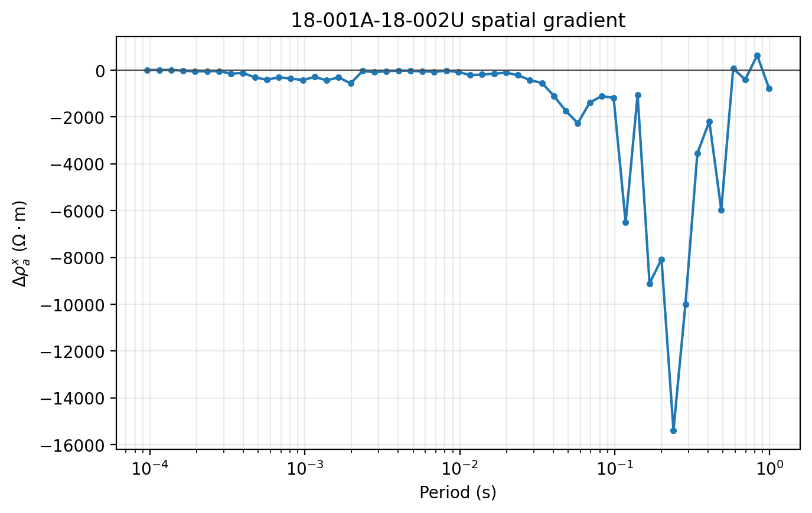
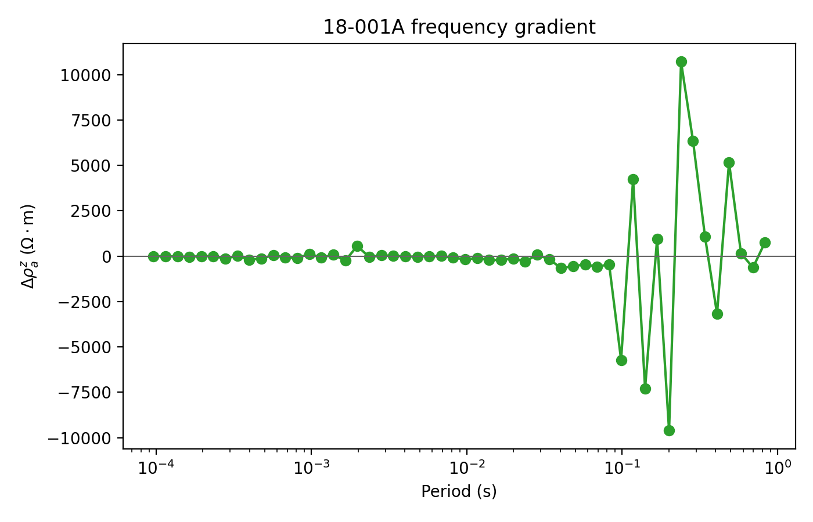
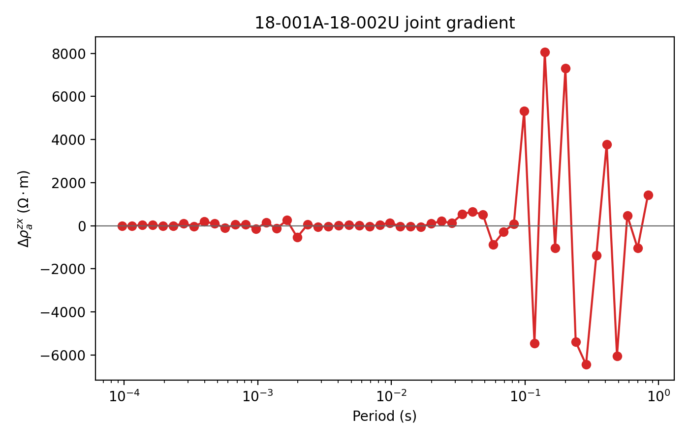
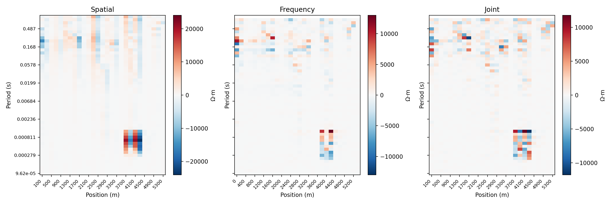
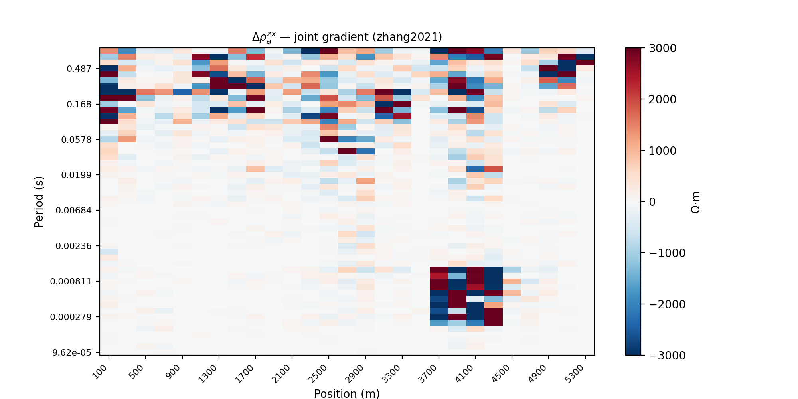
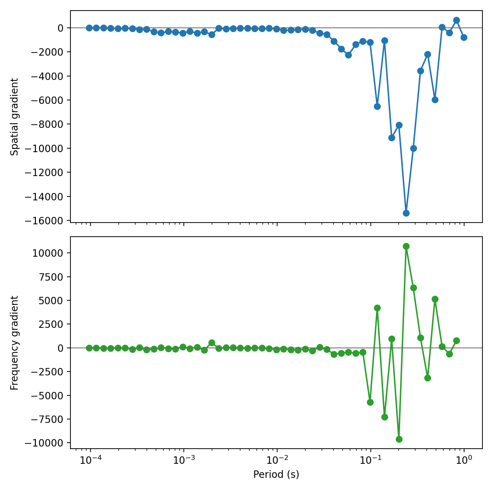
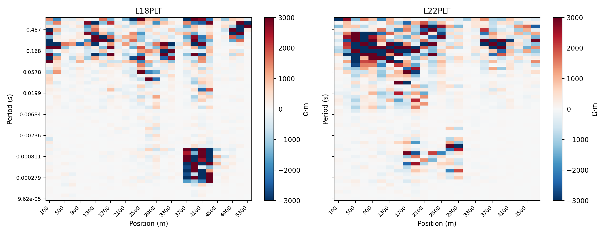
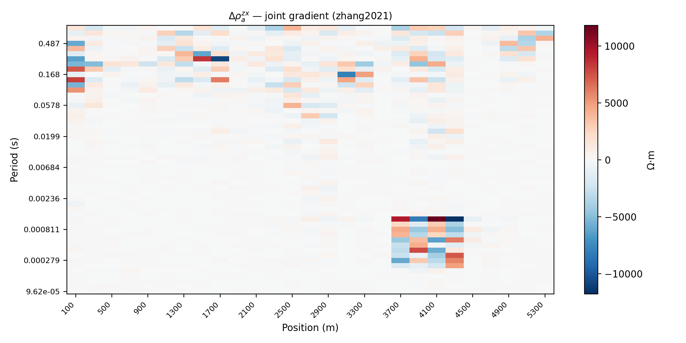

.. _emtools_gradient_imaging:

Gradient-Based Pseudo-Sections
==============================

``pycsamt.emtools.gradient_imaging`` builds CSAMT/AMT apparent
resistivity pseudo-sections from gradients rather than from
resistivity values alone.  The goal is boundary emphasis: highlight
where apparent resistivity changes laterally, vertically, or in both
directions at once.

The implementation follows the gradient apparent-resistivity ideas of
Zhang, Farquharson, and Liu (2021). It is useful when a normal
``rho_a`` pseudo-section carries broad background variation that makes
target boundaries difficult to see.

Full callable signatures live in the :doc:`API reference <../../api/emtools>`.
This page explains the quantities, returned tables, plotting workflow,
component choices, and interpretation checks.

Why Use Gradients
-----------------

A plain apparent-resistivity pseudo-section answers:

   "How resistive is this station-frequency sample?"

A gradient pseudo-section answers a different question:

   "Where does apparent resistivity change sharply?"

That difference matters in CSAMT/AMT interpretation. Boundary-like
features can be clearer in derivatives than in raw values, especially
when the background has broad smooth variation.

The method starts from a sampled apparent-resistivity surface
:math:`\rho_a(x,T)`, where :math:`x` is station position and
:math:`T=1/f` is period.  The implemented quantities are finite
differences on that sampled surface.  They are not a substitute for an
inversion model, but they are a useful way to make station-period
boundaries visible before or alongside inversion.

The Three Quantities
--------------------

The module computes apparent resistivity from impedance first. By
default it uses the determinant-style geometric mean:

.. math::

   \rho_{xy} =
   0.2 {|Z_{xy}|^2 \over f},
   \qquad
   \rho_{yx} =
   0.2 {|Z_{yx}|^2 \over f},

.. math::

   \rho_a =
   \sqrt{\rho_{xy}\rho_{yx}}.

You can also use one component only with ``comp="xy"`` or ``comp="yx"``.

The depth column is an apparent skin-depth scale,

.. math::

   \delta = 503 \sqrt{\rho_a \over f},

reported in metres.  It should be read as an approximate plotting depth,
not as an inversion depth.

The three gradient products are:

.. list-table::
   :header-rows: 1
   :widths: 25 75

   * - Quantity
     - Meaning
   * - ``spatial``
     - Along-line station-to-station difference,
       :math:`\Delta\rho_a^x`.
   * - ``frequency``
     - Adjacent-frequency difference at each station,
       :math:`\Delta\rho_a^z`.
   * - ``joint``
     - Frequency difference of the spatial gradient,
       :math:`\Delta\rho_a^{zx}`.

The joint gradient is often the most useful image because it responds
where the apparent resistivity changes both laterally and with
frequency. Smooth background variation tends to be reduced.

Station Position And Spacing
----------------------------

The gradient tables need station order and station spacing. pyCSAMT uses
station position metadata when available. If no usable coordinates are
available, it falls back to regular spacing with ``spacing_m=200.0``.

Always report the spacing assumption when using fallback spacing. The
gradient values are apparent-resistivity differences, but the x-axis
and pair spacing still affect interpretation of lateral scale.

For adjacent stations :math:`j-1` and :math:`j`, the midpoint and spacing
stored in the tables are

.. math::

   x_{j-1/2} = {x_{j-1}+x_j \over 2},
   \qquad
   \Delta x_j = x_j - x_{j-1}.

The current tables report finite differences in ohm metres.  If you
need a normalized lateral derivative, divide
``delta_rho_x`` or ``delta_rho_zx`` by ``dx_m`` in your own workflow and
state the resulting units.

Spatial Gradient
----------------

``rho_spatial_gradient`` compares adjacent stations at the same
frequency.

.. math::

   \Delta\rho_a^x(j, f)
   =
   \rho_a(x_j, f) - \rho_a(x_{j-1}, f).

The value is assigned to the midpoint between the two stations.  Its
sign is directional: positive means apparent resistivity increases to
the right along the sorted line, while negative means it decreases.

.. code-block:: python
   :linenos:

   from pycsamt.emtools.gradient_imaging import rho_spatial_gradient
   spatial = rho_spatial_gradient(
       "data/AMT/WILLY_DATA/L18PLT",
       spacing_m=200.0,
       comp="det",
   )
   print(spatial.head())
   spatial.to_csv("l18plt_spatial_gradient.csv", index=False)

.. code-block:: text

     station_a station_b    x_m  ...       depth_m   rho_a_ohmm  delta_rho_x
   0   18-001A   18-002U  100.0  ...  16441.550076  1076.986058  -789.812389
   1   18-001A   18-002U  100.0  ...  23164.458570  2553.493898   633.104370
   2   18-001A   18-002U  100.0  ...  15708.445184  1402.456235  -407.796992
   3   18-001A   18-002U  100.0  ...  16229.672127  1788.573047    68.027386
   4   18-001A   18-002U  100.0  ...  22026.195330  3934.779127 -5968.395877
   [5 rows x 9 columns]

The output columns are:

- ``station_a`` and ``station_b``: adjacent station pair.
- ``x_m``: midpoint position of the pair.
- ``dx_m``: station spacing for the pair.
- ``freq_hz`` and ``period_s``: frequency and period.
- ``depth_m``: skin-depth-style apparent depth at the pair.
- ``rho_a_ohmm``: mean apparent resistivity of the station pair.
- ``delta_rho_x``: lateral apparent-resistivity difference.

Positive ``delta_rho_x`` means the right station has higher apparent
resistivity than the left station at that frequency. Negative values
mean the opposite.

Frequency Gradient
------------------

``rho_frequency_gradient`` compares adjacent frequencies at each
station.

.. math::

   \Delta\rho_a^z(j, f_k)
   =
   \rho_a(x_j, f_k) - \rho_a(x_j, f_{k-1}).

The implementation uses the sorted frequency grid and assigns the result
to the upper frequency :math:`f_k`.  Because frequency and depth are
linked only approximately, this is a frequency-direction contrast, not a
true derivative with respect to physical depth.

.. code-block:: pycon

   >>> from pycsamt.emtools.gradient_imaging import rho_frequency_gradient
   >>> vertical = rho_frequency_gradient(
   ...     "data/AMT/WILLY_DATA/L18PLT",
   ...     spacing_m=200.0,
   ...     comp="det",
   ... )
   >>> one = vertical.loc[vertical["station"] == "18-001A"].sort_values("period_s")
   >>> print(one[["period_s", "rho_a_ohmm", "delta_rho_z"]].head())
      period_s  rho_a_ohmm  delta_rho_z
   51  0.000096   80.630809    -7.264990
   50  0.000115   86.503532    -4.480456
   49  0.000137  102.020596   -26.553673
   48  0.000164  133.745279   -36.895692
   47  0.000196  154.026762    -3.667275

The output columns are:

- ``station``: station name.
- ``x_m``: station position.
- ``freq_hz`` and ``period_s``: upper frequency of the adjacent pair.
- ``depth_m``: apparent depth at the mean resistivity of the pair.
- ``rho_a_ohmm``: mean apparent resistivity of the two frequencies.
- ``delta_rho_z``: frequency-direction apparent-resistivity difference.

This quantity is a proxy for vertical or depth-related changes because
different frequencies sample different investigation depths.

Joint Gradient
--------------

``rho_joint_gradient`` computes the frequency difference of the spatial
gradient.

.. math::

   \Delta\rho_a^{zx}(j, f_k)
   =
   \Delta\rho_a^x(j, f_k)
   -
   \Delta\rho_a^x(j, f_{k-1})

Expanded:

.. math::

   \Delta\rho_a^{zx}(j, f_k)
   =
   [\rho_a(j, f_k) - \rho_a(j-1, f_k)]
   -
   [\rho_a(j, f_{k-1}) - \rho_a(j-1, f_{k-1})]

This is a mixed finite difference on the station-frequency grid:

.. math::

   \Delta\rho_a^{zx}
   =
   \Delta_f\left(\Delta_x\rho_a\right).

.. code-block:: python
   :linenos:

   from pycsamt.emtools.gradient_imaging import rho_joint_gradient
   joint = rho_joint_gradient(
       "data/AMT/WILLY_DATA/L18PLT",
       spacing_m=200.0,
       comp="det",
   )
   print(joint.head())
   joint.to_csv("l18plt_joint_gradient.csv", index=False)

.. code-block:: text

     station_a station_b    x_m  ...  period_s       depth_m  delta_rho_zx
   0   18-001A   18-002U  100.0  ...  0.830565  19740.513225   1422.916759
   1   18-001A   18-002U  100.0  ...  0.695410  18387.618571  -1040.901362
   2   18-001A   18-002U  100.0  ...  0.582072  15731.499213    475.824378
   3   18-001A   18-002U  100.0  ...  0.487329  14850.211800  -6036.423263
   4   18-001A   18-002U  100.0  ...  0.407997  16531.998598   3783.198291
   [5 rows x 8 columns]

The output columns are:

- ``station_a`` and ``station_b``: adjacent station pair.
- ``x_m``: midpoint position of the pair.
- ``dx_m``: station spacing for the pair.
- ``freq_hz`` and ``period_s``: upper frequency of the adjacent
  frequency pair.
- ``depth_m``: apparent depth from the median resistivity of the four
  surrounding station-frequency cells.
- ``delta_rho_zx``: joint frequency-spatial gradient.

Joint gradients are strongest when lateral contrast changes with
frequency. That is why they are useful for boundary delineation.

Plot Gradient Sections
----------------------

``plot_gradient_section`` is the main visualization helper. It accepts
``quantity="spatial"``, ``"frequency"``, or ``"joint"``.

The plotted grid is assembled as

.. math::

   G_{i,j} = q(T_i, x_j),

where :math:`q` is one of
:math:`\Delta\rho_a^x`, :math:`\Delta\rho_a^z`, or
:math:`\Delta\rho_a^{zx}`.  A diverging color map centered at zero is
used because zero means "no local change" for the selected finite
difference, while the sign tells the direction of the contrast.

.. code-block:: python
   :linenos:

   import matplotlib.pyplot as plt

   from pycsamt.emtools.gradient_imaging import plot_gradient_section

   survey = "data/AMT/WILLY_DATA/L18PLT"

   fig, axes = plt.subplots(1, 3, figsize=(15, 5), sharey=True)
   plot_gradient_section(survey, quantity="spatial", ax=axes[0])
   axes[0].set_title("Spatial")

   plot_gradient_section(survey, quantity="frequency", ax=axes[1])
   axes[1].set_title("Frequency")

   plot_gradient_section(survey, quantity="joint", ax=axes[2])
   axes[2].set_title("Joint")

   fig.tight_layout()

The color map is centered at zero by default. Positive and negative
gradients are both meaningful: they indicate opposite directions of
apparent-resistivity change.

Use ``vlim`` when comparing several lines or components so the color
scale is consistent.

.. code-block:: python
   :linenos:

   from pycsamt.emtools.gradient_imaging import plot_gradient_section

   ax = plot_gradient_section(
       "data/AMT/WILLY_DATA/L18PLT",
       quantity="joint",
       comp="det",
       vlim=(-3000.0, 3000.0),
   )

Choosing The Impedance Component
--------------------------------

All gradient functions accept:

.. list-table::
   :header-rows: 1
   :widths: 25 75

   * - ``comp``
     - Meaning
   * - ``"det"``
     - Geometric mean of ``xy`` and ``yx`` apparent resistivities.
   * - ``"xy"``
     - Use only ``Zxy``.
   * - ``"yx"``
     - Use only ``Zyx``.

The default ``"det"`` is usually more stable because it combines both
off-diagonal modes. Component-specific plots are still important when
the two modes disagree.

.. code-block:: python
   :linenos:

   import pandas as pd
   from pycsamt.emtools.gradient_imaging import rho_joint_gradient
   survey = "data/AMT/WILLY_DATA/L18PLT"
   rows = []
   for comp in ("det", "xy", "yx"):
       table = rho_joint_gradient(survey, comp=comp)
       rows.append(
           {
               "component": comp,
               "std": table["delta_rho_zx"].std(),
               "max_abs": table["delta_rho_zx"].abs().max(),
           }
       )
   component_sensitivity = pd.DataFrame(rows)
   print(component_sensitivity)

.. code-block:: text

     component          std        max_abs
   0       det  1319.337312   11797.378008
   1        xy  2582.458888   32488.264297
   2        yx  9287.900947  175431.466235

Report the component whenever you show a gradient section.

Single-Pair And Single-Station Curves
-------------------------------------

Before interpreting a full pseudo-section, inspect a station pair or
station curve.

.. code-block:: python
   :linenos:

   import matplotlib.pyplot as plt

   from pycsamt.emtools.gradient_imaging import (
       rho_frequency_gradient,
       rho_spatial_gradient,
   )

   survey = "data/AMT/WILLY_DATA/L18PLT"

   spatial = rho_spatial_gradient(survey)
   pair = spatial.loc[spatial["station_a"] == "18-001A"].sort_values("period_s")

   frequency = rho_frequency_gradient(survey)
   station = frequency.loc[frequency["station"] == "18-001A"].sort_values("period_s")

   fig, (ax_pair, ax_station) = plt.subplots(2, 1, figsize=(7, 7), sharex=True)
   ax_pair.semilogx(pair["period_s"], pair["delta_rho_x"], "o-")
   ax_pair.axhline(0.0, color="0.4", linewidth=0.8)
   ax_pair.set_ylabel("Spatial gradient")

   ax_station.semilogx(station["period_s"], station["delta_rho_z"], "o-", color="C2")
   ax_station.axhline(0.0, color="0.4", linewidth=0.8)
   ax_station.set_xlabel("Period (s)")
   ax_station.set_ylabel("Frequency gradient")

   fig.tight_layout()

This makes it easier to tell whether a pseudo-section hotspot comes
from one extreme station pair, one frequency jump, or a coherent region.

Does The Joint Gradient Suppress Background?
--------------------------------------------

One practical check is to compare the spread of the spatial and joint
gradients. A joint gradient that is quieter in background areas should
often have a narrower distribution, while preserving strong localized
values.

The reported ratio is

.. math::

   R =
   {\operatorname{std}(\Delta\rho_a^{zx})
   \over
   \operatorname{std}(\Delta\rho_a^x)}.

Values below one mean the joint gradient is globally narrower than the
spatial gradient.  That supports, but does not prove, the idea that
background variation has been reduced.

.. code-block:: python
   :linenos:

   from pycsamt.emtools.gradient_imaging import (
       rho_joint_gradient,
       rho_spatial_gradient,
   )
   survey = "data/AMT/WILLY_DATA/L18PLT"
   spatial = rho_spatial_gradient(survey)
   joint = rho_joint_gradient(survey)
   spatial_std = spatial["delta_rho_x"].std()
   joint_std = joint["delta_rho_zx"].std()
   print(f"spatial std = {spatial_std:.1f} ohm.m")
   print(f"joint std   = {joint_std:.1f} ohm.m")
   print(f"ratio       = {joint_std / spatial_std:.2f}")

.. code-block:: text

   spatial std = 2659.9 ohm.m
   joint std   = 1319.3 ohm.m
   ratio       = 0.50

This is not a proof of geological correctness, but it is a useful
sanity check before relying on the joint image.

Compare Neighboring Lines
-------------------------

Use the same ``quantity``, ``comp``, and ``vlim`` when comparing lines.

.. code-block:: python
   :linenos:

   import matplotlib.pyplot as plt

   from pycsamt.emtools.gradient_imaging import plot_gradient_section

   l18 = "data/AMT/WILLY_DATA/L18PLT"
   l22 = "data/AMT/WILLY_DATA/L22PLT"

   fig, (ax18, ax22) = plt.subplots(1, 2, figsize=(13, 5), sharey=True)
   plot_gradient_section(l18, quantity="joint", comp="det", vlim=(-3000, 3000), ax=ax18)
   ax18.set_title("L18PLT")

   plot_gradient_section(l22, quantity="joint", comp="det", vlim=(-3000, 3000), ax=ax22)
   ax22.set_title("L22PLT")

   fig.tight_layout()

Line-to-line similarity is a useful processing sanity check. Differences
can still be geological, but first confirm the same band, component, and
color scale were used.

Reading The Results
-------------------

Use this interpretation order:

- Start with ``comp="det"`` for a stable overview.
- Check ``xy`` and ``yx`` separately when off-diagonal modes disagree.
- Use the spatial gradient for lateral station-to-station contrasts.
- Use the frequency gradient for single-station vertical changes.
- Use the joint gradient for features that are both lateral and
  depth-dependent.
- Prefer coherent station-period regions over isolated extreme cells.
- Compare neighboring lines with the same ``vlim`` before making a
  structural interpretation.

Common Failure Modes
--------------------

Missing or irregular station positions
   The module falls back to ``spacing_m``. Report the assumed spacing
   when coordinates are unavailable.

Component-driven artifacts
   ``xy`` and ``yx`` can behave very differently. Always record
   ``comp`` and inspect determinant vs component-specific results.

Over-reading sign
   Positive and negative gradients indicate direction of change. A
   boundary can appear as adjacent positive and negative lobes.

Noisy frequency rows
   Gradients amplify row-to-row changes. Run frequency QC before
   interpreting subtle gradient features.

Color-scale mismatch
   Automatic color limits can make two lines look more different or
   more similar than they are. Use fixed ``vlim`` for comparisons.

Saving A Reproducible Bundle
----------------------------

Save the three gradient tables and the main pseudo-section.

.. code-block:: python
   :linenos:

   from pathlib import Path

   import matplotlib.pyplot as plt

   from pycsamt.emtools.gradient_imaging import (
       plot_gradient_section,
       rho_frequency_gradient,
       rho_joint_gradient,
       rho_spatial_gradient,
   )

   survey = "data/AMT/WILLY_DATA/L18PLT"
   out = Path("outputs/gradient_l18plt")
   out.mkdir(parents=True, exist_ok=True)

   spatial = rho_spatial_gradient(survey, comp="det")
   frequency = rho_frequency_gradient(survey, comp="det")
   joint = rho_joint_gradient(survey, comp="det")

   spatial.to_csv(out / "spatial_gradient.csv", index=False)
   frequency.to_csv(out / "frequency_gradient.csv", index=False)
   joint.to_csv(out / "joint_gradient.csv", index=False)

   fig, ax = plt.subplots(figsize=(10, 5))
   plot_gradient_section(survey, quantity="joint", comp="det", ax=ax)
   fig.tight_layout()
   fig.savefig(out / "joint_gradient_section.png", dpi=200)

Worked Example
--------------

The gallery example uses **L18PLT** and compares it with neighboring
**L22PLT** from ``data/AMT/WILLY_DATA/``. It demonstrates one station
pair, one station frequency-gradient curve, the joint gradient, all
three pseudo-sections, background-suppression checks, component
sensitivity, and line-to-line comparison.

Open the rendered example here:
:ref:`sphx_glr_examples_emtools_plot_gradient_imaging.py`.
