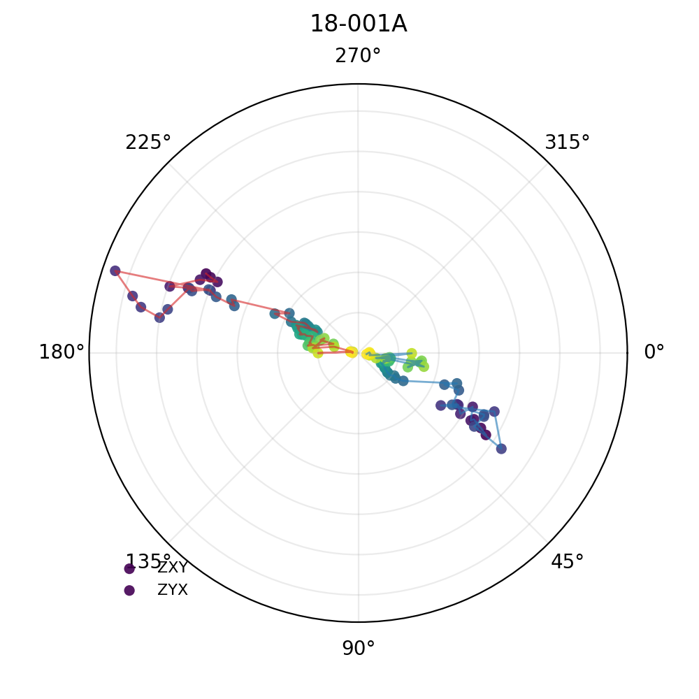
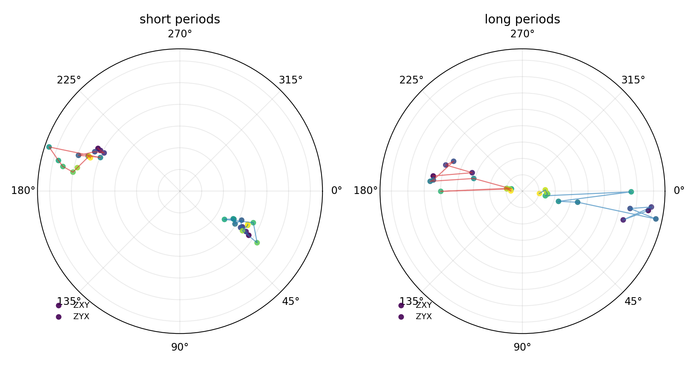
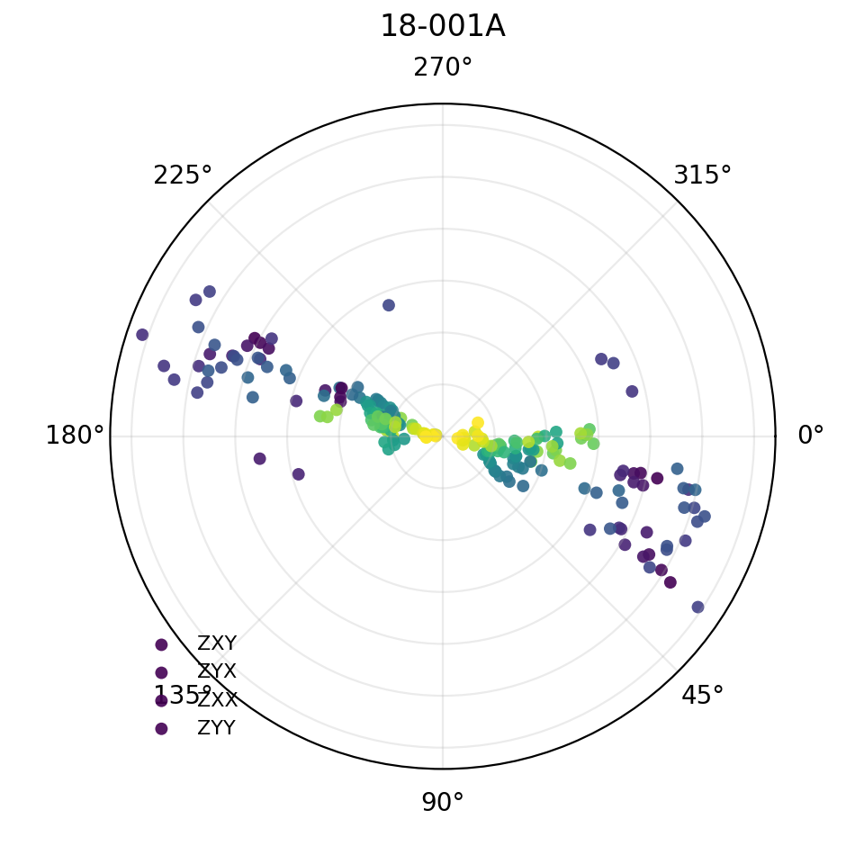
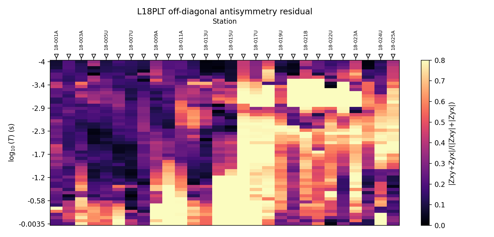
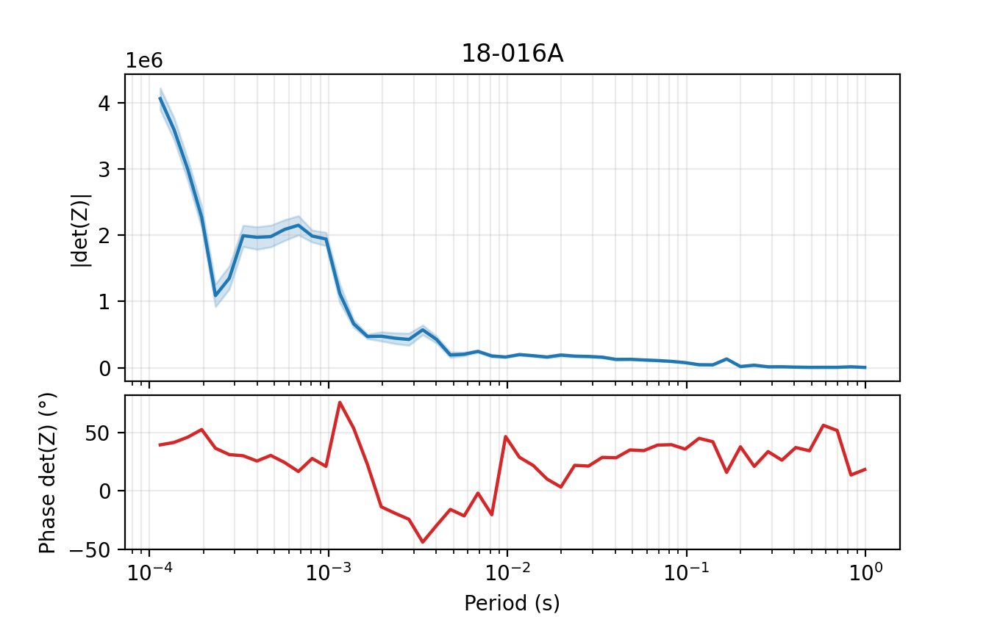
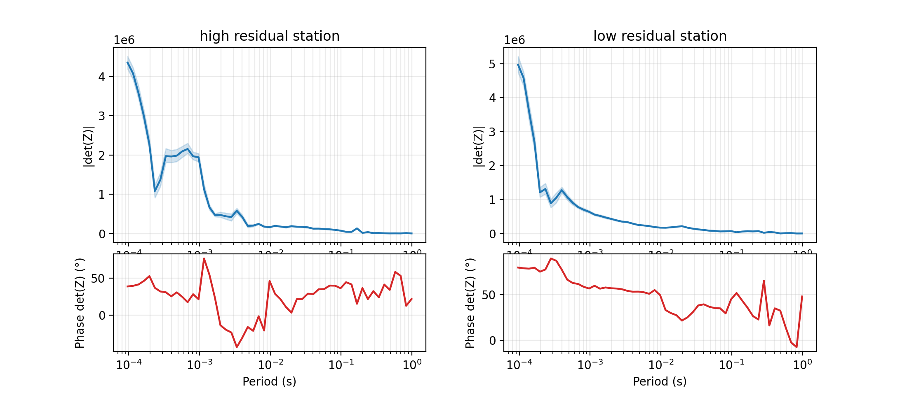
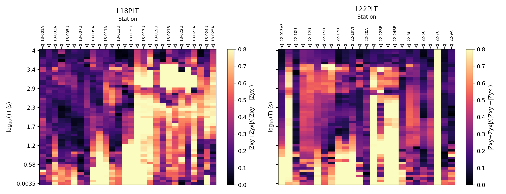

.. _emtools_impedance:

Impedance-Tensor Diagnostics
============================

``pycsamt.emtools.impedance`` gives direct views of the complex
impedance tensor before it is reduced to apparent resistivity, phase,
phase-tensor attributes, dimensionality classes, or inversion input.
Use this page when you want to look at the tensor itself and ask:

* do ``Zxy`` and ``Zyx`` behave like an approximately antisymmetric
  1-D/2-D response?
* are diagonal terms small compared with off-diagonal terms?
* does one station have a different complex trajectory from its
  neighbours?
* is the determinant response stable enough to trust as a compact
  rotationally invariant summary?

Full callable signatures live in the :doc:`API reference <../../api/emtools>`.
This page focuses on interpretation, concrete workflows, and code.

What The Module Uses
--------------------

All public functions normalize their input through ``ensure_sites``.
That means the same call can accept a directory of EDI files, an
existing ``Sites`` object, an ``EDICollection``, or EDI-like objects.
Each station must expose a complex impedance array shaped
``(n_frequency, 2, 2)`` and a frequency array.

The tensor components are indexed as:

.. math::

   Z =
   \begin{bmatrix}
   Z_{xx} & Z_{xy} \\
   Z_{yx} & Z_{yy}
   \end{bmatrix}.

The tensor connects horizontal electric and magnetic fields by

.. math::

   \begin{bmatrix} E_x \\ E_y \end{bmatrix}
   =
   \begin{bmatrix}
   Z_{xx} & Z_{xy} \\
   Z_{yx} & Z_{yy}
   \end{bmatrix}
   \begin{bmatrix} H_x \\ H_y \end{bmatrix}.

Each entry is complex: :math:`Z_{ij}=a_{ij}+i b_{ij}`.  Its magnitude
and phase are

.. math::

   |Z_{ij}| = \sqrt{a_{ij}^2+b_{ij}^2},
   \qquad
   \phi_{ij} = \operatorname{atan2}(b_{ij}, a_{ij}).

The familiar apparent resistivity is derived from the same component:

.. math::

   \rho_{a,ij}(f) =
   \frac{|Z_{ij}(f)|^2}{5f},

using pyCSAMT's practical EDI convention for :math:`Z`. The diagnostics
on this page use ``Z`` directly. That is important: apparent
resistivity and phase are derived products, while the phasor wheel,
antisymmetry residual, and determinant track keep the complex tensor
visible.

Load A Survey Once
------------------

Use ``ensure_sites`` first when you are building a notebook or script.
That makes the rest of the code explicit and avoids reloading files for
each plot.

.. code-block:: python
   :linenos:

   from pathlib import Path

   from pycsamt.emtools import ensure_sites

   edi_dir = Path("data/AMT/WILLY_DATA/L18PLT")
   survey = ensure_sites(
       edi_dir,
       recursive=True,
       on_dup="replace",
       strict=True,
       verbose=1,
   )

``strict=True`` is useful in documentation, tests, and reproducible
analysis because it fails early when no valid sites are found. In an
interactive exploratory session you may prefer ``strict=False`` so an
empty or partly broken directory can still be inspected.

Choose The Right Diagnostic
---------------------------

The three public views answer different questions.

.. list-table::
   :header-rows: 1
   :widths: 24 38 38

   * - View
     - Best Question
     - Main Output
   * - phasor wheel
     - How do selected complex tensor components move with period at
       one station?
     - A polar Argand-style plot for one station.
   * - antisymmetry residual
     - Where along the line do ``Zxy`` and ``Zyx`` stop cancelling as a
       1-D/2-D response would suggest?
     - A station-period pseudo-section.
   * - determinant track
     - Is a compact rotationally invariant station response stable, and
       how wide is its uncertainty band?
     - Magnitude and phase curves versus period.

The views are complementary. The phasor wheel is local and visual, the
residual pseudo-section is survey-wide, and the determinant track is a
station-level summary.

The Phasor Wheel
----------------

``plot_phasor_wheel`` draws selected impedance components as complex
phasors. For each frequency sample, the component phase becomes the
polar angle and the component magnitude becomes the radius. Colour
encodes log-period, so a station becomes a period-ordered complex
trajectory.
For component :math:`Z_c(f_k)`, the plotted polar coordinate is

.. math::

   \theta_k = \arg Z_c(f_k),
   \qquad
   r_k =
   \begin{cases}
   |Z_c(f_k)|, & \text{if } \texttt{radius="abs"},\\
   |Z_c(f_k)| / Q_{0.95}(|Z_c|), & \text{if } \texttt{radius="norm"}.
   \end{cases}

The colour coordinate is a normalized log-period value,

.. math::

   q_k =
   \frac{\log_{10} T_k - \min(\log_{10} T)}
        {\max(\log_{10} T) - \min(\log_{10} T)},
   \qquad
   T_k = \frac{1}{f_k}.

Thus the wheel is not a phase-tensor plot and not a rose diagram.  It is
the complex impedance itself, drawn as a path through period.

.. code-block:: python
   :linenos:

   import matplotlib.pyplot as plt

   from pycsamt.emtools import ensure_sites
   from pycsamt.emtools.impedance import plot_phasor_wheel

   survey = ensure_sites("data/AMT/WILLY_DATA/L18PLT", strict=True)

   ax = plot_phasor_wheel(
       survey,
       station="18-001A",
       components=("xy", "yx"),
       radius="abs",
       connect=True,
       figsize=(5.0, 5.0),
   )

   ax.figure.savefig("phasor_wheel_18-001A.png", dpi=200)
   plt.close(ax.figure)

Read this plot as a direct complex-plane diagnostic. If ``Zxy`` and
``Zyx`` are close to a clean 1-D/2-D off-diagonal pair, their phasors
should be broadly opposite in phase, because the ideal relation is
``Zxy ~= -Zyx``. If the two arcs bend into different sectors, cross,
or change separation with period, the station is telling you that one
simple dimensional picture is probably not enough.

Use Period Bands
----------------

The ``pband`` argument selects a period interval in seconds. This is a
simple way to ask whether shallow and deeper parts of the sounding have
different tensor behaviour.

.. code-block:: python
   :linenos:

   import matplotlib.pyplot as plt

   from pycsamt.emtools import ensure_sites
   from pycsamt.emtools.impedance import plot_phasor_wheel

   survey = ensure_sites("data/AMT/WILLY_DATA/L18PLT", strict=True)
   station = "18-001A"

   fig, axes = plt.subplots(
       1,
       2,
       figsize=(9.5, 5.0),
       subplot_kw={"polar": True},
   )

   plot_phasor_wheel(
       survey,
       station=station,
       pband=(9e-5, 1e-3),
       ax=axes[0],
   )
   axes[0].set_title("short periods")

   plot_phasor_wheel(
       survey,
       station=station,
       pband=(1e-1, 1.0),
       ax=axes[1],
   )
   axes[1].set_title("long periods")

   fig.tight_layout()
   fig.savefig("phasor_period_bands_18-001A.png", dpi=200)
   plt.close(fig)

If the short-period and long-period arcs have the same shape but
different radii, the main change is magnitude. If they rotate into
different angular sectors or the ``xy`` and ``yx`` relation changes,
the complex response itself is changing with period.
In mathematical terms, ``pband=(T_1,T_2)`` applies the mask

.. math::

   T_1 \le T_k \le T_2 .

Comparing two period bands therefore asks whether
:math:`\arg Z_{ij}(T)` and :math:`|Z_{ij}(T)|` remain coherent across
scale. A static multiplier changes :math:`|Z|` but leaves
:math:`\arg Z` unchanged; a change in angular sector points to a change
in inductive response, coordinate frame, or noise regime.

Include The Diagonal Terms
--------------------------

For a simple 1-D earth, the diagonal tensor components are ideally
zero. For a 2-D earth in the correct strike coordinate system, the
off-diagonal terms dominate. In field data, ``Zxx`` and ``Zyy`` rarely
vanish exactly, but their size relative to ``Zxy`` and ``Zyx`` is still
informative.
A compact way to summarize the same idea is the diagonal energy ratio

.. math::

   \eta_{\mathrm{diag}}(f)
   =
   \frac{|Z_{xx}(f)|^2 + |Z_{yy}(f)|^2}
        {|Z_{xy}(f)|^2 + |Z_{yx}(f)|^2 + \epsilon}.

Small :math:`\eta_{\mathrm{diag}}` is compatible with a coordinate frame
where the off-diagonal modes dominate. Large values do not identify a
single cause by themselves: they may reflect 3-D structure, a poor
strike rotation, galvanic distortion, or data-quality problems.

.. code-block:: python
   :linenos:

   from pycsamt.emtools import ensure_sites
   from pycsamt.emtools.impedance import plot_phasor_wheel

   survey = ensure_sites("data/AMT/WILLY_DATA/L18PLT", strict=True)

   ax = plot_phasor_wheel(
       survey,
       station="18-001A",
       components=("xy", "yx", "xx", "yy"),
       radius="norm",
       connect=False,
       ms=2.5,
   )

   ax.figure.savefig("phasor_all_components_18-001A.png", dpi=200)

``radius="norm"`` scales each component radius by a robust component
magnitude, which helps when one component would otherwise dominate the
display. Use ``radius="abs"`` when you need the physical size relation
to remain visible.

Compute Component Magnitudes
----------------------------

The plot is useful, but a station report should also write the numbers.
The lower-level helper ``_get_z_block`` returns the validated tensor and
frequency arrays used by the plotting functions.

.. code-block:: python
   :linenos:

   import numpy as np

   from pycsamt.emtools import ensure_sites
   from pycsamt.emtools._core import _get_z_block, _iter_items, _name

   survey = ensure_sites("data/AMT/WILLY_DATA/L18PLT", strict=True)

   rows = []
   for index, site in enumerate(_iter_items(survey)):
       _, z, freq = _get_z_block(site)
       if z is None:
           continue

       rows.append(
           {
               "station": _name(site, index),
               "mean_abs_zxx": float(np.nanmean(np.abs(z[:, 0, 0]))),
               "mean_abs_zxy": float(np.nanmean(np.abs(z[:, 0, 1]))),
               "mean_abs_zyx": float(np.nanmean(np.abs(z[:, 1, 0]))),
               "mean_abs_zyy": float(np.nanmean(np.abs(z[:, 1, 1]))),
           }
       )

   for row in rows[:5]:
       print(row)

.. code-block:: text

   {'station': '18-001A', 'mean_abs_zxx': 446.87532535812795, 'mean_abs_zxy': 808.4345401982367, 'mean_abs_zyx': 1145.0965447882752, 'mean_abs_zyy': 557.6049786167763}
   {'station': '18-002U', 'mean_abs_zxx': 133.0926461161051, 'mean_abs_zxy': 620.1474584088546, 'mean_abs_zyx': 859.6134726088661, 'mean_abs_zyy': 257.84731425866534}
   {'station': '18-003A', 'mean_abs_zxx': 109.30601909208245, 'mean_abs_zxy': 610.4449839811526, 'mean_abs_zyx': 388.2097256381032, 'mean_abs_zyy': 106.6560768811014}
   {'station': '18-004A', 'mean_abs_zxx': 252.91269027986166, 'mean_abs_zxy': 839.1242870947025, 'mean_abs_zyx': 681.5954183841726, 'mean_abs_zyy': 300.46444606989644}
   {'station': '18-005U', 'mean_abs_zxx': 202.61429236412803, 'mean_abs_zxy': 811.4948595592589, 'mean_abs_zyx': 563.3054411247073, 'mean_abs_zyy': 261.3767440473993}

This is not meant to replace phase-tensor dimensionality or skew
analysis. It is a quick tensor sanity check: if the diagonal terms are
large at a station, look at dimensionality, distortion, static shift,
and strike diagnostics before treating that station as simple 2-D
input.

Off-Diagonal Antisymmetry
-------------------------

``plot_offdiag_antisym_residual`` maps how far the off-diagonal
components depart from the ideal cancellation relation:

.. math::

   r =
   {|Z_{xy} + Z_{yx}| \over |Z_{xy}| + |Z_{yx}| + \epsilon}.

The implementation clips the result to ``0 <= r <= 1``. Values near zero
mean the off-diagonal terms cancel well. Larger values mean the two
off-diagonal terms are less antisymmetric.
The normalization is deliberate.  If both off-diagonal amplitudes are
large, :math:`|Z_{xy}+Z_{yx}|` alone can look large even when the
relative cancellation is good.  Dividing by
:math:`|Z_{xy}|+|Z_{yx}|` makes the residual dimensionless and bounded.
Two limiting cases are useful:

.. math::

   Z_{yx} = -Z_{xy}
   \quad \Rightarrow \quad r = 0,

.. math::

   Z_{yx} = Z_{xy}
   \quad \Rightarrow \quad r \approx 1 .

The first case is the ideal antisymmetric off-diagonal pair. The second
case means the two terms reinforce rather than cancel, which is not the
expected 1-D/2-D off-diagonal structure.

.. code-block:: python
   :linenos:

   import matplotlib.pyplot as plt

   from pycsamt.emtools import ensure_sites
   from pycsamt.emtools.impedance import plot_offdiag_antisym_residual

   survey = ensure_sites("data/AMT/WILLY_DATA/L18PLT", strict=True)

   fig, ax = plt.subplots(figsize=(10.0, 4.8))
   plot_offdiag_antisym_residual(
       survey,
       vlim=0.8,
       cmap="magma",
       ax=ax,
   )
   ax.set_title("L18PLT off-diagonal antisymmetry residual")

   fig.tight_layout()
   fig.savefig("offdiag_antisymmetry_l18plt.png", dpi=200)
   plt.close(fig)

The horizontal axis is station order. The vertical axis is
``log10(period)``. Warm columns mark stations or period bands where
``Zxy`` and ``Zyx`` fail to cancel. That does not prove a particular
geology by itself, but it is a strong cue to compare against
phase-tensor skew, anisotropy ratio, induction arrows, and nearby
lines.

Rank Stations By Residual
-------------------------

The pseudo-section shows the pattern. A table names the stations.

.. code-block:: python
   :linenos:

   import numpy as np
   import pandas as pd

   from pycsamt.emtools import ensure_sites
   from pycsamt.emtools._core import _get_z_block, _iter_items, _name

   survey = ensure_sites("data/AMT/WILLY_DATA/L18PLT", strict=True)

   rows = []
   for index, site in enumerate(_iter_items(survey)):
       _, z, freq = _get_z_block(site)
       if z is None:
           continue

       xy = np.abs(z[:, 0, 1])
       yx = np.abs(z[:, 1, 0])
       residual = np.abs(z[:, 0, 1] + z[:, 1, 0]) / (xy + yx + 1e-24)
       residual = np.clip(residual, 0.0, 1.0)

       rows.append(
           {
               "station": _name(site, index),
               "mean_residual": float(np.nanmean(residual)),
               "p90_residual": float(np.nanpercentile(residual, 90)),
               "max_residual": float(np.nanmax(residual)),
               "n_frequency": int(np.isfinite(residual).sum()),
           }
       )

   ranking = (
       pd.DataFrame(rows)
       .sort_values("mean_residual", ascending=False)
       .reset_index(drop=True)
   )

   print(ranking.head(10))
   ranking.to_csv("impedance_antisymmetry_ranking.csv", index=False)

.. code-block:: text

      station  mean_residual  p90_residual  max_residual  n_frequency
   0  18-016A       0.786452      0.942456      0.958245           53
   1  18-018A       0.749186      0.961107      0.998407           53
   2  18-017U       0.715415      0.877221      0.920305           53
   3  18-023A       0.640977      0.860594      0.957943           53
   4  18-021B       0.623736      0.964924      0.990659           53
   5  18-021U       0.556974      0.968757      0.980216           53
   6  18-022U       0.538863      0.873291      0.963180           53
   7  18-024U       0.526460      0.811147      0.961759           53
   8  18-015U       0.500570      0.984507      0.999133           53
   9  18-025A       0.498164      0.782128      0.842395           53

Use ``mean_residual`` for a broad station ranking. Use
``p90_residual`` when you want to highlight stations with a persistent
high-residual tail. Use ``max_residual`` only as a trigger for manual
inspection because one bad frequency can dominate it.

Compare With Anisotropy Or Skew
-------------------------------

The antisymmetry residual is related to, but not identical with,
diagonal skew or apparent anisotropy. The best practice is to compare
metrics instead of assuming they flag the same stations.
For example, the residual above is an off-diagonal cancellation measure,
whereas a Swift-style skew compares diagonal and off-diagonal energy:

.. math::

   \kappa_{\mathrm{Swift}}
   =
   \frac{|Z_{xx}+Z_{yy}|}
        {|Z_{xy}-Z_{yx}|+\epsilon}.

An apparent anisotropy ratio instead compares the two off-diagonal
apparent resistivities:

.. math::

   \Lambda =
   \log_{10}
   \left(
   \frac{\rho_{a,xy}}{\rho_{a,yx}}
   \right)
   =
   2\log_{10}
   \left(
   \frac{|Z_{xy}|}{|Z_{yx}|}
   \right).

These quantities can move together, but they do not have to. A station
can have small diagonal terms and still poor off-diagonal cancellation;
another can have strong diagonal terms while :math:`Z_{xy}` and
:math:`Z_{yx}` remain nearly antisymmetric.

.. code-block:: python
   :linenos:

   import numpy as np
   import pandas as pd

   from pycsamt.emtools import anisotropy_table, ensure_sites
   from pycsamt.emtools._core import _get_z_block, _iter_items, _name

   survey = ensure_sites("data/AMT/WILLY_DATA/L18PLT", strict=True)

   residual_rows = []
   for index, site in enumerate(_iter_items(survey)):
       _, z, freq = _get_z_block(site)
       if z is None:
           continue

       xy = np.abs(z[:, 0, 1])
       yx = np.abs(z[:, 1, 0])
       residual = np.abs(z[:, 0, 1] + z[:, 1, 0]) / (xy + yx + 1e-24)
       residual_rows.append(
           {
               "station": _name(site, index),
               "antisym_mean": float(np.nanmean(np.clip(residual, 0.0, 1.0))),
           }
       )

   residual_df = pd.DataFrame(residual_rows).set_index("station")
   aniso_df = anisotropy_table(survey).set_index("station")

   merged = residual_df.join(
       aniso_df[["mean_swift_skew", "mean_ratio_log10"]],
       how="inner",
   )
   merged["abs_ratio_log10"] = merged["mean_ratio_log10"].abs()

   print(merged.corr(numeric_only=True))

.. code-block:: text

                     antisym_mean  ...  abs_ratio_log10
   antisym_mean          1.000000  ...         0.719606
   mean_swift_skew      -0.592220  ...        -0.613406
   mean_ratio_log10      0.631375  ...         0.886388
   abs_ratio_log10       0.719606  ...         1.000000

   [4 rows x 4 columns]

When correlations are strong, the diagnostics are probably responding
to a shared tensor feature. When they disagree, inspect the stations
manually. A station can have a high skew because of diagonal terms but
still have off-diagonal components that nearly cancel.

Determinant Track
-----------------

``plot_determinant_track`` summarizes a station with the determinant of
the full impedance tensor:

.. math::

   \det(Z) = Z_{xx} Z_{yy} - Z_{xy} Z_{yx}.

The determinant is useful because it is invariant under a rotation of
the horizontal coordinate frame.  If

.. math::

   R(\alpha) =
   \begin{bmatrix}
   \cos\alpha & \sin\alpha \\
   -\sin\alpha & \cos\alpha
   \end{bmatrix},
   \qquad
   Z' = R(\alpha) Z R(\alpha)^T,

then

.. math::

   \det(Z') =
   \det(R)\det(Z)\det(R^T)
   =
   \det(Z),

because :math:`\det(R)=1`.  This does not make the determinant immune to
noise or distortion, but it does make it a compact station-level summary
that does not depend on choosing a strike angle first.

The plot has two panels: ``|det(Z)|`` and determinant phase versus
period. If impedance errors are available as ``z_err``, pyCSAMT draws a
Monte Carlo uncertainty band for the determinant magnitude.

.. code-block:: python
   :linenos:

   import matplotlib.pyplot as plt

   from pycsamt.emtools import ensure_sites
   from pycsamt.emtools.impedance import plot_determinant_track

   survey = ensure_sites("data/AMT/WILLY_DATA/L18PLT", strict=True)

   fig = plot_determinant_track(
       survey,
       station="18-016A",
       pband=(1e-4, 1.0),
       pcts=(10.0, 50.0, 90.0),
       n_draws=300,
       figsize=(6.8, 4.2),
   )

   fig.savefig("determinant_track_18-016A.png", dpi=200)
   plt.close(fig)

The default percentile band is the 10th to 90th percentile interval.
Increase ``n_draws`` when you need a smoother band. Keep ``seed`` fixed
only if you call the lower-level determinant helper directly and need
bit-for-bit reproducibility in a report.

Compare Two Stations
--------------------

The determinant track is most useful when compared across stations with
contrasting tensor diagnostics.

.. code-block:: python
   :linenos:

   import matplotlib.pyplot as plt

   from pycsamt.emtools import ensure_sites
   from pycsamt.emtools.impedance import plot_determinant_track

   survey = ensure_sites("data/AMT/WILLY_DATA/L18PLT", strict=True)

   fig = plt.figure(figsize=(11.0, 4.8))
   grid = fig.add_gridspec(
       2,
       2,
       height_ratios=(2, 1),
       hspace=0.08,
       wspace=0.25,
   )

   left_axes = (fig.add_subplot(grid[0, 0]), fig.add_subplot(grid[1, 0]))
   right_axes = (fig.add_subplot(grid[0, 1]), fig.add_subplot(grid[1, 1]))

   plot_determinant_track(survey, station="18-016A", axes=left_axes)
   plot_determinant_track(survey, station="18-007U", axes=right_axes)

   left_axes[0].set_title("high residual station")
   right_axes[0].set_title("low residual station")

   fig.savefig("determinant_station_comparison.png", dpi=200)
   plt.close(fig)

Look for differences in curve smoothness, phase wrapping, band width,
and period-local instability. A wide uncertainty band does not
automatically make the station unusable, but it should lower your
confidence in interpretations that depend on small determinant
features.

Measure Determinant Band Width
------------------------------

For reports, compute a simple relative band-width number instead of
judging the shaded region by eye.
The Monte Carlo helper samples each complex tensor component as

.. math::

   Z^{(m)}_{ij}(f_k)
   =
   Z_{ij}(f_k)
   +
   \epsilon^{(m)}_{ij}(f_k),
   \qquad
   \epsilon^{(m)}_{ij}
   \sim
   \mathcal{CN}(0,\sigma_{ij}^2),

where :math:`\sigma_{ij}` comes from ``z_err``.  For each draw,

.. math::

   D^{(m)}(f_k)
   =
   Z^{(m)}_{xx}Z^{(m)}_{yy}
   -
   Z^{(m)}_{xy}Z^{(m)}_{yx}.

The plotted magnitude is the median of :math:`|D^{(m)}|`, and the band
is the requested percentile interval. The relative width used below is

.. math::

   W_{\mathrm{rel}}(f_k)
   =
   \frac{D_{hi}(f_k)-D_{lo}(f_k)}
        {|D|_{\mathrm{median}}(f_k)+\epsilon}.

This gives a scale-free number: 0.2 is a narrow band relative to the
determinant magnitude, while 1.0 means the uncertainty span is about as
large as the reported magnitude itself.

.. code-block:: python
   :linenos:

   import numpy as np
   import pandas as pd

   from pycsamt.emtools import ensure_sites
   from pycsamt.emtools._core import _get_z_block, _iter_items, _name
   from pycsamt.emtools.impedance import _det_ci

   survey = ensure_sites("data/AMT/WILLY_DATA/L18PLT", strict=True)

   rows = []
   for index, site in enumerate(_iter_items(survey)):
       _, z, freq, z_err = _get_z_block(site, with_errors=True)
       if z is None:
           continue

       mag, phase, band = _det_ci(
           z,
           freq,
           z_err,
           pcts=(10.0, 50.0, 90.0),
           n_draws=300,
           seed=0,
       )
       relative_width = (band[:, 1] - band[:, 0]) / (mag + 1e-24)

       rows.append(
           {
               "station": _name(site, index),
               "median_det_abs": float(np.nanmedian(mag)),
               "median_relative_band_width": float(
                   np.nanmedian(relative_width)
               ),
               "max_relative_band_width": float(np.nanmax(relative_width)),
           }
       )

   det_quality = (
       pd.DataFrame(rows)
       .sort_values("median_relative_band_width", ascending=False)
       .reset_index(drop=True)
   )

   print(det_quality.head(10))
   det_quality.to_csv("determinant_band_width.csv", index=False)

.. code-block:: text

      station  median_det_abs  median_relative_band_width  max_relative_band_width
   0  18-021U   138059.459579                    1.244798                 1.558835
   1  18-020A    58591.215698                    0.981629                 1.719329
   2  18-021B   304870.766789                    0.675971                 1.572428
   3  18-022V    54687.185702                    0.414231                 1.390426
   4  18-018A    12533.221781                    0.286987                 1.416562
   5  18-022U    59346.090486                    0.272911                 1.511982
   6  18-025A    22893.891856                    0.259362                 1.010240
   7  18-013U   409823.995492                    0.242223                 1.320911
   8  18-024U    37132.445937                    0.241634                 0.978317
   9  18-023A    57853.829945                    0.223259                 1.416815

The private helper ``_det_ci`` is used here because it exposes the
computed arrays behind the public plot. For stable production code,
prefer the public plotting function unless you need these exact numbers.

Compare Neighbouring Lines
--------------------------

A warm residual column is more meaningful when the same style of
feature appears on neighbouring survey lines or when it lines up with
known geology. Use the same colour limit when comparing lines.

.. code-block:: python
   :linenos:

   import matplotlib.pyplot as plt

   from pycsamt.emtools import ensure_sites
   from pycsamt.emtools.impedance import plot_offdiag_antisym_residual

   line18 = ensure_sites("data/AMT/WILLY_DATA/L18PLT", strict=True)
   line22 = ensure_sites("data/AMT/WILLY_DATA/L22PLT", strict=True)

   fig, axes = plt.subplots(1, 2, figsize=(13.0, 5.0), sharey=True)

   plot_offdiag_antisym_residual(line18, vlim=0.8, ax=axes[0])
   axes[0].set_title("L18PLT")

   plot_offdiag_antisym_residual(line22, vlim=0.8, ax=axes[1])
   axes[1].set_title("L22PLT")

   fig.tight_layout()
   fig.savefig("antisymmetry_line_comparison.png", dpi=200)
   plt.close(fig)

If one line is uniformly warmer, check acquisition quality, processing
settings, coordinate orientation, and frequency coverage before making
a geological claim. If a localized warm zone repeats across lines, it
is more likely to represent real structure or a persistent distortion
effect.

Common Interpretation Checks
----------------------------

Use these checks before promoting an impedance diagnostic into an
interpretation:

``Zxy`` and ``Zyx`` do not cancel
    Compare against phase-tensor skew, Swift skew, anisotropy ratio, and
    induction arrows. The residual is a warning flag, not a complete
    dimensionality classifier.

Diagonal components are large
    Inspect whether the coordinate frame is appropriate. If a 2-D
    strike rotation is justified, rotate before concluding that the
    response is strongly 3-D.

Only one frequency is anomalous
    Treat it as a possible processing or data-quality issue. Cross-check
    with QC and frequency-editing tools.

The determinant band is wide
    Check whether ``z_err`` is realistic and whether the station has
    noisy or sparse frequency samples.

The phasor wheel is hard to read
    Use ``pband`` to split the period range and ``components`` to reduce
    clutter. Use ``radius="norm"`` when component magnitudes differ too
    much for one display.

Saving A Reproducible Bundle
----------------------------

The following script writes the main impedance outputs for one survey:
one residual pseudo-section, one station ranking, one phasor wheel, and
one determinant track.

.. code-block:: python
   :linenos:

   from pathlib import Path

   import matplotlib.pyplot as plt
   import numpy as np
   import pandas as pd

   from pycsamt.emtools import ensure_sites
   from pycsamt.emtools._core import _get_z_block, _iter_items, _name
   from pycsamt.emtools.impedance import (
       plot_determinant_track,
       plot_offdiag_antisym_residual,
       plot_phasor_wheel,
   )

   out = Path("impedance_report_l18plt")
   out.mkdir(parents=True, exist_ok=True)

   survey = ensure_sites("data/AMT/WILLY_DATA/L18PLT", strict=True)

   fig, ax = plt.subplots(figsize=(10.0, 4.8))
   plot_offdiag_antisym_residual(survey, vlim=0.8, ax=ax)
   fig.tight_layout()
   fig.savefig(out / "antisymmetry_residual.png", dpi=200)
   plt.close(fig)

   rows = []
   for index, site in enumerate(_iter_items(survey)):
       _, z, freq = _get_z_block(site)
       if z is None:
           continue
       xy = np.abs(z[:, 0, 1])
       yx = np.abs(z[:, 1, 0])
       residual = np.clip(
           np.abs(z[:, 0, 1] + z[:, 1, 0]) / (xy + yx + 1e-24),
           0.0,
           1.0,
       )
       rows.append(
           {
               "station": _name(site, index),
               "mean_residual": float(np.nanmean(residual)),
               "p90_residual": float(np.nanpercentile(residual, 90)),
           }
       )

   ranking = pd.DataFrame(rows).sort_values(
       "mean_residual",
       ascending=False,
   )
   ranking.to_csv(out / "antisymmetry_ranking.csv", index=False)

   station = ranking.iloc[0]["station"]

   ax = plot_phasor_wheel(
       survey,
       station=station,
       components=("xy", "yx", "xx", "yy"),
       radius="norm",
   )
   ax.figure.savefig(out / f"phasor_{station}.png", dpi=200)
   plt.close(ax.figure)

   fig = plot_determinant_track(survey, station=station, n_draws=300)
   fig.savefig(out / f"determinant_{station}.png", dpi=200)
   plt.close(fig)

.. grid:: 1 1 2 3
   :gutter: 2

   .. grid-item::

      .. image:: ../../images/user_guide/emtools/user-guide-emtools-impedance-13-01.png
         :width: 100%

   .. grid-item::

      .. image:: ../../images/user_guide/emtools/user-guide-emtools-impedance-13-02.png
         :width: 100%

   .. grid-item::

      .. image:: ../../images/user_guide/emtools/user-guide-emtools-impedance-13-03.png
         :width: 100%

Worked Example
--------------

The gallery example applies the same ideas to bundled WILLY survey
lines and connects the impedance views with anisotropy rankings.

Open the rendered gallery page here:
:ref:`sphx_glr_examples_emtools_plot_impedance.py`.
