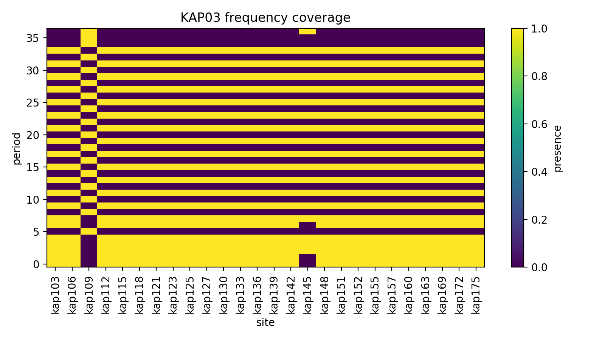
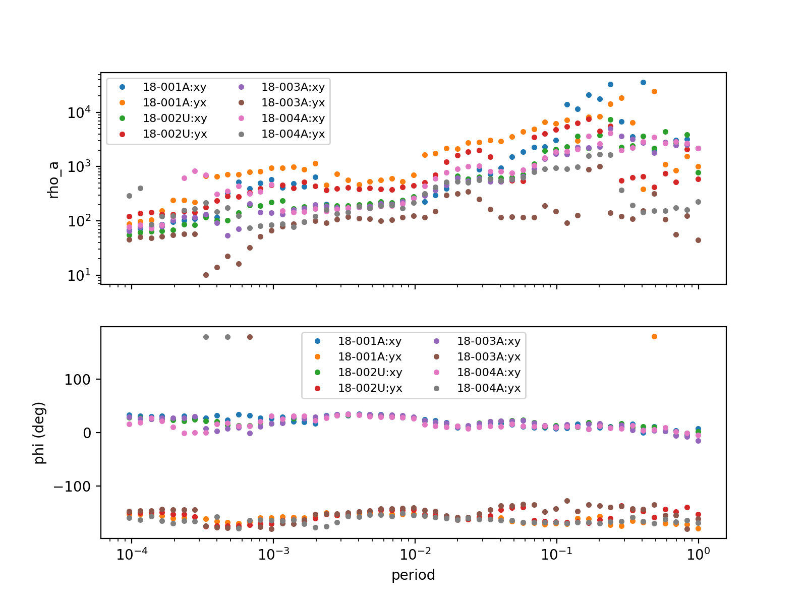
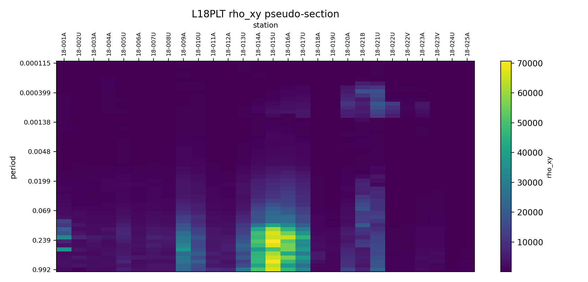
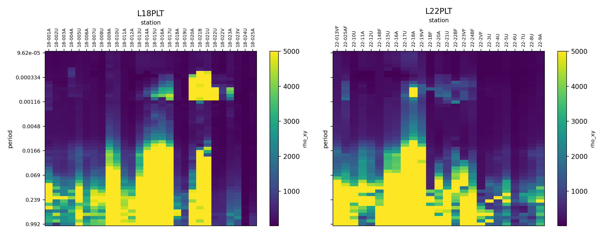
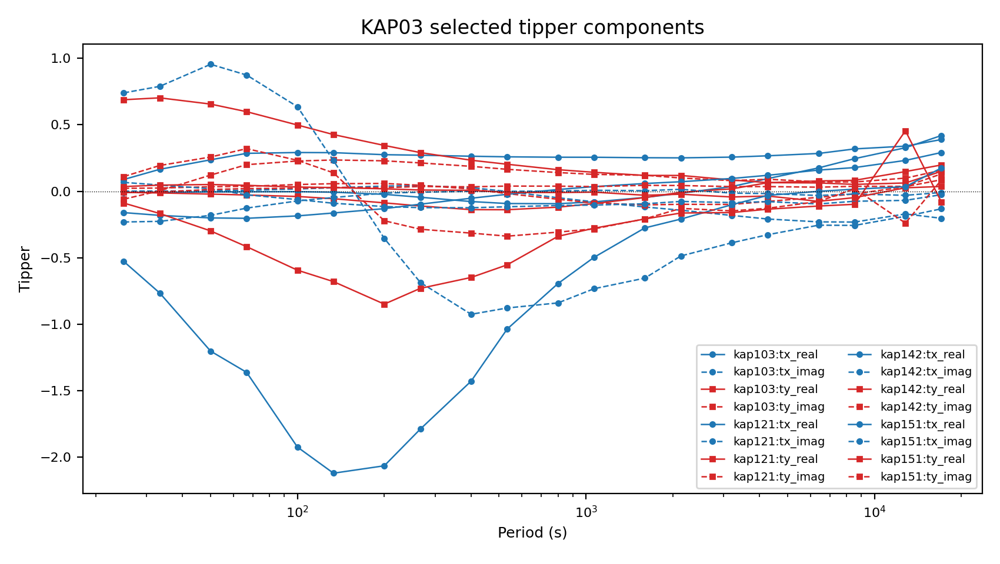
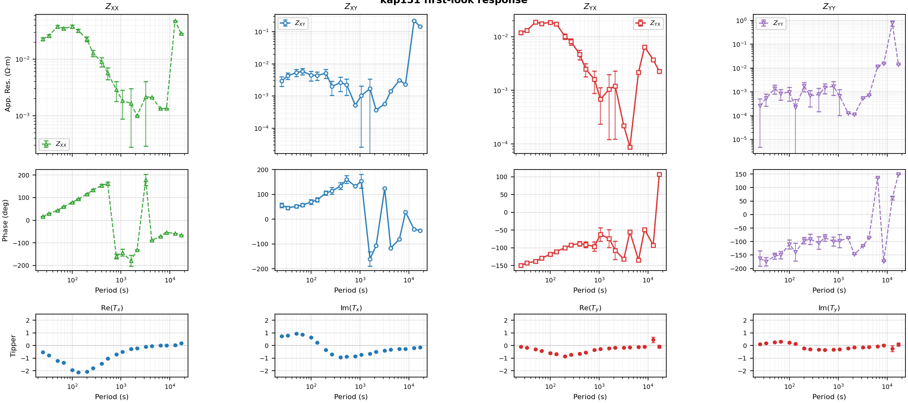
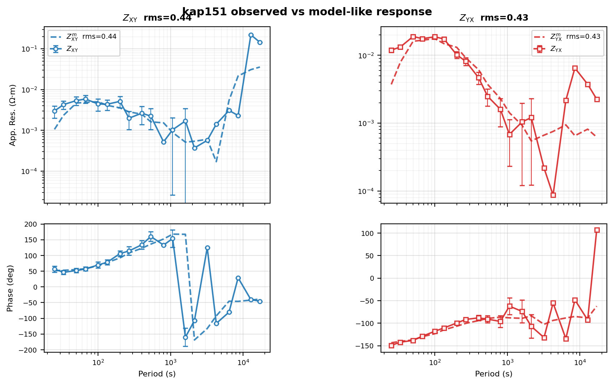

.. _emtools_inspect:

First-Look Survey Inspection
============================

``pycsamt.emtools.inspect`` is the first module to use after loading a
survey. It answers practical questions before you run deeper
diagnostics, static-shift correction, dimensionality analysis, or
inversion:

* which stations loaded correctly?
* which stations have impedance and tipper data?
* do all stations share the same frequency grid?
* are the apparent-resistivity and phase curves sensible?
* where are the first obvious pseudo-section anomalies?
* which single station deserves a full response plot?

Full callable signatures live in the :doc:`API reference <../../api/emtools>`.
This page explains the workflow and gives concrete code patterns.

Why Inspect First
-----------------

Inspection is not interpretation yet. It is the quality gate between
"the files loaded" and "the data are ready for scientific decisions".
The inspection tools are intentionally plain: tables, coverage masks,
simple curves, pseudo-sections, tipper components, and one complete
station dashboard.

Run this stage before:

* deciding which frequency band to keep;
* comparing survey lines;
* trusting tipper-based induction arrows;
* building phase-tensor or dimensionality products;
* fitting a model response to observed data.

Load The Survey
---------------

The inspection functions all call ``ensure_sites`` internally, but it is
still useful to normalize once at the top of a script.

.. code-block:: python
   :linenos:

   from pathlib import Path

   from pycsamt.emtools import ensure_sites

   edi_dir = Path("data/AMT/WILLY_DATA/L18PLT")
   survey = ensure_sites(
       edi_dir,
       recursive=True,
       on_dup="replace",
       strict=True,
       verbose=1,
   )

Use ``strict=True`` when a missing or empty dataset should stop the
workflow. For exploratory notebooks, ``strict=False`` can be more
convenient because the plotting functions will draw "no data" messages
instead of failing immediately.

The Inspection Workflow
-----------------------

The module is easiest to use as a sequence.

.. list-table::
   :header-rows: 1
   :widths: 25 40 35

   * - Step
     - Question
     - Tool
   * - inventory
     - What stations, period ranges, coordinates, and tippers exist?
     - ``sites_summary``
   * - required sections
     - Which stations are missing ``mt`` or ``tipper``?
     - ``list_missing_sections``
   * - frequency grid
     - Do stations share the same frequency samples?
     - ``frequency_coverage`` and ``plot_coverage``
   * - quick curves
     - Are rho/phase curves plausible?
     - ``plot_rhoa_phi``
   * - survey image
     - Where are station-period anomalies?
     - ``pseudosection``
   * - tipper check
     - Is real tipper present and stable?
     - ``plot_tipper_components``
   * - station dashboard
     - What does one station look like in full?
     - ``plot_station_response``

Per-Site Summary
----------------

``sites_summary`` returns one row per station. By default it reports
station name, number of frequency samples, whether tipper data are
present, period range, and coordinates.

.. code-block:: python
   :linenos:

   import pandas as pd

   from pycsamt.emtools import ensure_sites, sites_summary

   survey = ensure_sites("data/AMT/WILLY_DATA/L18PLT", strict=True)

   summary = sites_summary(survey, api=False)
   print(summary.head())

   overview = {
       "n_sites": len(summary),
       "has_any_tipper": bool(summary["has_tipper"].any()),
       "n_freq_values": sorted(summary["n_freq"].unique()),
       "period_min": float(summary["period_min"].min()),
       "period_max": float(summary["period_max"].max()),
   }
   print(pd.Series(overview))

.. code-block:: text

      station  n_freq  has_tipper  period_min  period_max        lat         lon
   0  18-001A      53       False    0.000096    0.992063  32.120300  119.128833
   1  18-002U      53       False    0.000096    0.992063  32.121133  119.128900
   2  18-003A      53       False    0.000096    0.992063  32.122083  119.128850
   3  18-004A      53       False    0.000096    0.992063  32.123333  119.128833
   4  18-005U      53       False    0.000096    0.992063  32.123900  119.128833
   n_sites                 28
   has_any_tipper       False
   n_freq_values         [53]
   period_min        0.000096
   period_max        0.992063
   dtype: object

Read this table before plotting anything. A survey with mixed
``n_freq`` values needs frequency-grid attention. A survey with
``has_tipper=False`` everywhere should not be sent into tipper or
induction-arrow interpretation.

Choose Summary Columns
----------------------

The ``fields`` argument lets you keep the inventory narrow when you are
printing reports or comparing several lines.

.. code-block:: python
   :linenos:

   from pycsamt.emtools import sites_summary

   compact = sites_summary(
       "data/AMT/WILLY_DATA/L18PLT",
       fields=(
           "station",
           "n_freq",
           "period_min",
           "period_max",
           "has_tipper",
       ),
       api=False,
   )

   print(compact.to_string(index=False))

.. code-block:: text

   station  n_freq  period_min  period_max  has_tipper
   18-001A      53    0.000096    0.992063       False
   18-002U      53    0.000096    0.992063       False
   18-003A      53    0.000096    0.992063       False
   18-004A      53    0.000096    0.992063       False
   18-005U      53    0.000096    0.992063       False
   18-006A      53    0.000096    0.992063       False
   18-007U      53    0.000096    0.992063       False
   18-008U      53    0.000096    0.992063       False
   18-009A      53    0.000096    0.992063       False
   18-010U      53    0.000096    0.992063       False
   18-011A      53    0.000096    0.992063       False
   18-012A      53    0.000096    0.992063       False
   18-013U      53    0.000096    0.992063       False
   18-014A      53    0.000096    0.992063       False
   18-015U      53    0.000096    0.992063       False
   18-016A      53    0.000096    0.992063       False
   18-017U      53    0.000096    0.992063       False
   18-018A      53    0.000096    0.992063       False
   18-019U      53    0.000096    0.992063       False
   18-020A      53    0.000096    0.992063       False
   18-021B      53    0.000096    0.992063       False
   18-021U      53    0.000096    0.992063       False
   18-022U      53    0.000096    0.992063       False
   18-022V      53    0.000096    0.992063       False
   18-023A      53    0.000096    0.992063       False
   18-023V      53    0.000096    0.992063       False
   18-024U      53    0.000096    0.992063       False
   18-025A      53    0.000096    0.992063       False

The returned object may be an API-aware frame when the package API-view
mode is enabled. Passing ``api=False`` gives a plain pandas
``DataFrame`` for ordinary scripts.

Missing Sections
----------------

``list_missing_sections`` checks whether each station has required data
sections. The most common checks are ``"mt"`` for impedance and
``"tipper"`` for transfer-function data.

.. code-block:: python
   :linenos:

   from pycsamt.emtools import ensure_sites, list_missing_sections

   survey = ensure_sites("data/AMT/WILLY_DATA/L18PLT", strict=True)

   missing = list_missing_sections(
       survey,
       require=("mt", "tipper"),
   )

   for station, sections in missing.items():
       print(f"{station}: missing {', '.join(sections)}")

.. code-block:: text

   18-001A: missing tipper
   18-002U: missing tipper
   18-003A: missing tipper
   18-004A: missing tipper
   18-005U: missing tipper
   18-006A: missing tipper
   18-007U: missing tipper
   18-008U: missing tipper
   18-009A: missing tipper
   18-010U: missing tipper
   18-011A: missing tipper
   18-012A: missing tipper
   18-013U: missing tipper
   18-014A: missing tipper
   18-015U: missing tipper
   18-016A: missing tipper
   18-017U: missing tipper
   18-018A: missing tipper
   18-019U: missing tipper
   18-020A: missing tipper
   18-021B: missing tipper
   18-021U: missing tipper
   18-022U: missing tipper
   18-022V: missing tipper
   18-023A: missing tipper
   18-023V: missing tipper
   18-024U: missing tipper
   18-025A: missing tipper

This function uses the same internal extraction helpers as the plotting
tools. That matters because real EDI/Site objects can expose placeholder
attributes even when a section was not actually parsed.

Check Tipper Availability Explicitly
------------------------------------

AMT/CSAMT lines often have no tipper. MT surveys often do. Make that
difference explicit before writing code that assumes tipper exists.

.. code-block:: python
   :linenos:

   from pycsamt.emtools import list_missing_sections

   amt_missing = list_missing_sections(
       "data/AMT/WILLY_DATA/L18PLT",
       require=("tipper",),
   )
   mt_missing = list_missing_sections(
       "data/MT/kap03lmt_edis",
       require=("tipper",),
   )

   print(f"L18PLT stations missing tipper: {len(amt_missing)}")
   print(f"KAP03 stations missing tipper: {len(mt_missing)}")

.. code-block:: text

   L18PLT stations missing tipper: 28
   KAP03 stations missing tipper: 0

If every station is missing tipper, that is not necessarily a failure.
It simply means you should stay with impedance-based inspection and use
the transfer-function tools only on surveys that contain vertical-field
data.

Frequency Coverage Tables
-------------------------

``frequency_coverage`` has three modes.

.. code-block:: python
   :linenos:

   import numpy as np

   from pycsamt.emtools import ensure_sites, frequency_coverage

   survey = ensure_sites("data/MT/kap03lmt_edis", strict=True)

   per_site = frequency_coverage(survey, mode="per-site")
   union = frequency_coverage(survey, mode="union")
   intersection = frequency_coverage(survey, mode="intersection")

   print(f"stations: {len(per_site)}")
   print(f"union frequency count: {union.size}")
   print(f"common frequency count: {intersection.size}")

   for station, freq in per_site.items():
       missing_from_union = np.setdiff1d(union, freq)
       if missing_from_union.size:
           print(station, "missing", missing_from_union.size, "samples")

.. code-block:: text

   stations: 26
   union frequency count: 37
   common frequency count: 0
   kap103 missing 17 samples
   kap106 missing 17 samples
   kap109 missing 20 samples
   kap112 missing 17 samples
   kap115 missing 17 samples
   kap118 missing 17 samples
   kap121 missing 17 samples
   kap123 missing 17 samples
   kap125 missing 17 samples
   kap127 missing 17 samples
   kap130 missing 17 samples
   kap133 missing 17 samples
   kap136 missing 17 samples
   kap139 missing 17 samples
   kap142 missing 17 samples
   kap145 missing 19 samples
   kap148 missing 17 samples
   kap151 missing 17 samples
   kap152 missing 17 samples
   kap155 missing 17 samples
   kap157 missing 17 samples
   kap160 missing 17 samples
   kap163 missing 17 samples
   kap169 missing 17 samples
   kap172 missing 17 samples
   kap175 missing 17 samples

Use ``mode="per-site"`` when you need station names. Use ``"union"``
to know the full survey frequency grid. Use ``"intersection"`` to know
which frequencies are shared by every station.

Plot Frequency Coverage
-----------------------

``plot_coverage`` converts the frequency dictionary into a station by
frequency presence mask.

.. code-block:: python
   :linenos:

   import matplotlib.pyplot as plt

   from pycsamt.emtools import ensure_sites, plot_coverage

   survey = ensure_sites("data/MT/kap03lmt_edis", strict=True)

   fig, ax = plt.subplots(figsize=(8.0, 4.5))
   plot_coverage(
       survey,
       axis="period",
       ax=ax,
   )
   ax.set_title("KAP03 frequency coverage")

   fig.tight_layout()
   fig.savefig("kap03_frequency_coverage.png", dpi=200)
   plt.close(fig)

The colour value is presence, not data quality. A fully covered cell
only means the sample exists. Use QC, error, confidence, and frequency
editing tools to decide whether the sample is reliable.

Quick Rho And Phase Curves
--------------------------

``plot_rhoa_phi`` plots apparent resistivity and phase for one or more
stations. It accepts components such as ``"xy"``, ``"yx"``, ``"xx"``,
and ``"yy"`` when those columns exist in the station dataframe.

.. code-block:: python
   :linenos:

   import matplotlib.pyplot as plt

   from pycsamt.emtools import ensure_sites, plot_rhoa_phi
   from pycsamt.emtools._core import _iter_items

   survey = ensure_sites("data/AMT/WILLY_DATA/L18PLT", strict=True)

   subset_paths = [site.edi.path for site in list(_iter_items(survey))[:4]]
   subset = ensure_sites(subset_paths, strict=True)

   ax_rho, ax_phase = plot_rhoa_phi(
       subset,
       components=("xy", "yx"),
       axis="period",
       errorbar=True,
       figsize=(8.0, 6.0),
   )

   ax_rho.figure.savefig("l18plt_rho_phase_subset.png", dpi=200)
   plt.close(ax_rho.figure)

Do not plot every station at once unless the survey is tiny. The
function will draw the data, but the legend can become unreadable. Use
small station subsets for first inspection, then switch to
``plot_station_response`` for a station-level deep view.

Pseudo-Sections
---------------

``pseudosection`` creates a period by station image from a dataframe
quantity such as ``"rho_xy"``, ``"rho_yx"``, ``"phi_xy"``, or
``"phi_yx"``. Values are pivoted by station and period, with median
aggregation for duplicate cells.

.. code-block:: python
   :linenos:

   import matplotlib.pyplot as plt

   from pycsamt.emtools import ensure_sites, pseudosection

   survey = ensure_sites("data/AMT/WILLY_DATA/L18PLT", strict=True)

   fig, ax = plt.subplots(figsize=(10.0, 4.8))
   pseudosection(
       survey,
       quantity="rho_xy",
       period_range=(1e-4, 1.0),
       ax=ax,
       topo=False,
   )
   ax.set_title("L18PLT rho_xy pseudo-section")

   fig.tight_layout()
   fig.savefig("l18plt_rho_xy_pseudosection.png", dpi=200)
   plt.close(fig)

The x-axis is station order. The y-axis is period. Short periods are
drawn at the top because the image uses the common MT pseudo-section
convention: shallow-sensitive samples above deeper-sensitive samples.

Control The Pseudo-Section Scale
--------------------------------

Use fixed ``vmin`` and ``vmax`` when comparing two lines. Otherwise a
line with a narrow value range can look as dramatic as a line with a
much stronger anomaly.

.. code-block:: python
   :linenos:

   import matplotlib.pyplot as plt

   from pycsamt.emtools import ensure_sites, pseudosection

   line18 = ensure_sites("data/AMT/WILLY_DATA/L18PLT", strict=True)
   line22 = ensure_sites("data/AMT/WILLY_DATA/L22PLT", strict=True)

   fig, axes = plt.subplots(1, 2, figsize=(13.0, 5.0), sharey=True)

   pseudosection(line18, quantity="rho_xy", vmin=10.0, vmax=5000.0, ax=axes[0])
   axes[0].set_title("L18PLT")

   pseudosection(line22, quantity="rho_xy", vmin=10.0, vmax=5000.0, ax=axes[1])
   axes[1].set_title("L22PLT")

   fig.tight_layout()
   fig.savefig("rho_xy_line_comparison.png", dpi=200)
   plt.close(fig)

If topography is configured globally, ``pseudosection`` can draw an
optional topography strip. Pass ``topo=False`` when you want a compact
data-only panel.

Tipper Components
-----------------

``plot_tipper_components`` draws real and imaginary parts of ``Tx`` and
``Ty`` versus period or frequency. Use it only after confirming that
the survey actually contains tipper data.

.. code-block:: python
   :linenos:

   import matplotlib.pyplot as plt

   from pycsamt.emtools import ensure_sites, plot_tipper_components
   from pycsamt.emtools._core import _iter_items, _name

   survey = ensure_sites("data/MT/kap03lmt_edis", strict=True)

   station_names = ["kap103", "kap121", "kap142", "kap151"]
   subset_paths = [
       site.edi.path
       for index, site in enumerate(_iter_items(survey))
       if _name(site, index) in station_names
   ]
   subset = ensure_sites(subset_paths, strict=True)

   fig, ax = plt.subplots(figsize=(8.5, 4.8))
   plot_tipper_components(
       subset,
       kind=("real", "imag"),
       axis="period",
       ax=ax,
   )
   ax.set_title("KAP03 selected tipper components")

   fig.tight_layout()
   fig.savefig("kap03_tipper_components.png", dpi=200)
   plt.close(fig)

The horizontal zero line is important. Sign changes, isolated spikes,
or one station separating strongly from the others are good reasons to
inspect induction arrows, tipper hodograms, and station metadata.

Full Station Response
---------------------

``plot_station_response`` is the richest first-look figure. It shows
apparent resistivity, phase, and, when available, the four tipper
sub-panels for one station.

.. code-block:: python
   :linenos:

   import matplotlib.pyplot as plt

   from pycsamt.emtools import ensure_sites, plot_station_response

   survey = ensure_sites("data/MT/kap03lmt_edis", strict=True)

   fig = plot_station_response(
       survey,
       station="kap151",
       components=("xx", "xy", "yx", "yy"),
       period_range=(1e-2, 2e4),
       show_tipper=True,
       show_error_bars=True,
       rho_lim=None,
       phase_lim=None,
       tipper_lim=(-2.5, 2.5),
       title="kap151 first-look response",
   )

   fig.savefig("kap151_station_response.png", dpi=200)
   plt.close(fig)

The first row is apparent resistivity on log-log axes. The second row
is phase on a log-period x-axis. The optional third row shows
``Re(Tx)``, ``Im(Tx)``, ``Re(Ty)``, and ``Im(Ty)``. If no tipper exists
or ``show_tipper=False``, the figure uses only the impedance rows.

Overlay A Model Response
------------------------

When ``sites_model`` is supplied, the station response overlays a
second dataset as dashed curves. If observed and model resistivity are
both available, the function appends an RMS value to component titles.
The RMS is computed in ``log10(rho)`` space.

.. code-block:: python
   :linenos:

   import matplotlib.pyplot as plt

   from pycsamt.emtools import ensure_sites, plot_station_response, smooth_mavg

   observed = ensure_sites("data/MT/kap03lmt_edis", strict=True)

   # For demonstration only: a smoothed copy behaves like a model response.
   # In production, pass forward-model or inversion-response EDI data here.
   model_like = smooth_mavg(observed, k=5)

   fig = plot_station_response(
       observed,
       station="kap151",
       sites_model=model_like,
       components=("xy", "yx"),
       period_range=(1e-2, 2e4),
       show_rms=True,
       show_tipper=False,
       figsize=(8.5, 5.2),
       title="kap151 observed vs model-like response",
   )

   fig.savefig("kap151_response_with_model_overlay.png", dpi=200, bbox_inches="tight")
   plt.close(fig)

Use this view after inversion or forward modelling to check whether the
model misses a whole component, a period band, or only local points. A
single RMS number is useful, but the curve shape tells you why the RMS
is high or low.

Build A First-Look Report Bundle
--------------------------------

The following script writes a compact first-look bundle for a survey:
summary table, missing-section table, frequency coverage, rho/phase
curves for a few stations, one pseudo-section, and one station
response.

.. code-block:: python
   :linenos:

   from pathlib import Path

   import matplotlib.pyplot as plt
   import pandas as pd

   from pycsamt.emtools import (
       ensure_sites,
       list_missing_sections,
       plot_coverage,
       plot_rhoa_phi,
       plot_station_response,
       pseudosection,
       sites_summary,
   )
   from pycsamt.emtools._core import _iter_items, _name

   out = Path("inspect_report_l18plt")
   out.mkdir(parents=True, exist_ok=True)

   survey = ensure_sites("data/AMT/WILLY_DATA/L18PLT", strict=True)

   summary = sites_summary(survey, api=False)
   summary.to_csv(out / "sites_summary.csv", index=False)

   missing = list_missing_sections(survey, require=("mt", "tipper"))
   missing_rows = [
       {"station": station, "missing": ",".join(sections)}
       for station, sections in missing.items()
   ]
   pd.DataFrame(missing_rows).to_csv(out / "missing_sections.csv", index=False)

   fig, ax = plt.subplots(figsize=(8.0, 4.5))
   plot_coverage(survey, ax=ax)
   fig.tight_layout()
   fig.savefig(out / "frequency_coverage.png", dpi=200)
   plt.close(fig)

   subset_names = list(summary["station"].head(4))
   subset_paths = [
       site.edi.path
       for index, site in enumerate(_iter_items(survey))
       if _name(site, index) in subset_names
   ]
   subset = ensure_sites(subset_paths, strict=True)

   ax_rho, ax_phase = plot_rhoa_phi(subset, components=("xy", "yx"))
   ax_rho.figure.savefig(out / "rho_phase_subset.png", dpi=200)
   plt.close(ax_rho.figure)

   fig, ax = plt.subplots(figsize=(10.0, 4.8))
   pseudosection(survey, quantity="rho_xy", ax=ax, topo=False)
   fig.tight_layout()
   fig.savefig(out / "rho_xy_pseudosection.png", dpi=200)
   plt.close(fig)

   first_station = str(summary["station"].iloc[0])
   fig = plot_station_response(
       survey,
       station=first_station,
       components=("xy", "yx"),
       show_tipper=False,
   )
   fig.savefig(out / f"station_response_{first_station}.png", dpi=200, bbox_inches="tight")
   plt.close(fig)

.. grid:: 1 1 2 2
   :gutter: 2

   .. grid-item::

      .. image:: ../../images/user_guide/emtools/user-guide-emtools-inspect-14-01.png
         :width: 100%

   .. grid-item::

      .. image:: ../../images/user_guide/emtools/user-guide-emtools-inspect-14-02.png
         :width: 100%

   .. grid-item::

      .. image:: ../../images/user_guide/emtools/user-guide-emtools-inspect-14-03.png
         :width: 100%

   .. grid-item::

      .. image:: ../../images/user_guide/emtools/user-guide-emtools-inspect-14-04.png
         :width: 100%

Reading The Inspection Results
------------------------------

Treat these outputs as a triage board:

``n_freq`` differs between stations
    Align or edit the frequency grid before making survey-wide
    pseudo-sections or station statistics that assume common samples.

All stations are missing tipper
    Skip tipper diagnostics for that survey. This can be normal for
    AMT/CSAMT lines.

Only some stations are missing tipper
    Keep those stations out of tipper maps or split the analysis into
    tipper-capable and impedance-only subsets.

Rho/phase curves are wildly separated
    Check station metadata, static shift, data quality, and whether a
    few stations dominate the line.

Pseudo-section anomalies appear only at one frequency
    Inspect frequency confidence and errors before interpreting that
    feature geologically.

Station response shows diagonal terms comparable to off-diagonals
    Follow up with impedance, tensor, dimensionality, and strike tools.

Worked Example
--------------

The gallery example below uses the bundled AMT and MT datasets to show
the same first-look workflow end to end.

.. literalinclude:: ../../../examples/emtools/plot_inspect.py
   :language: python
   :linenos:
