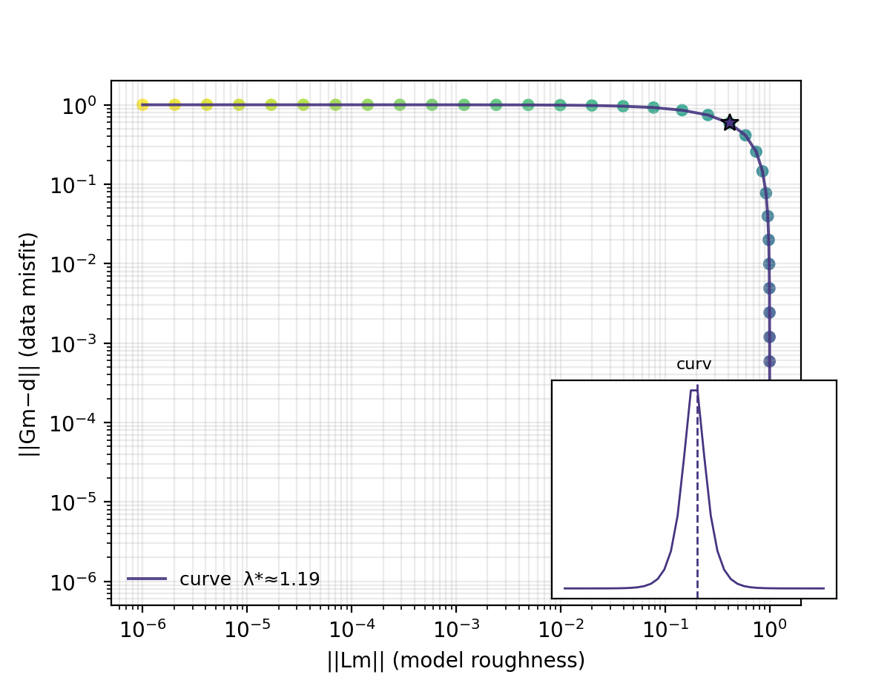
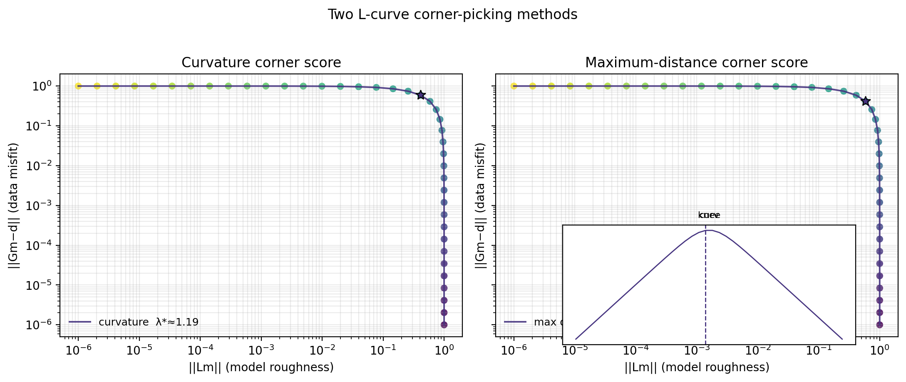
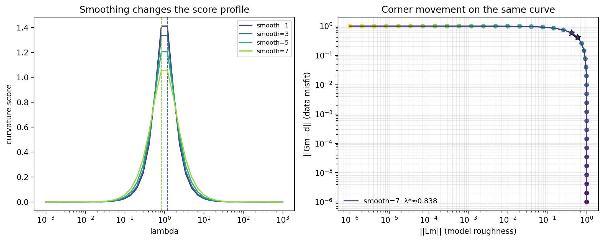
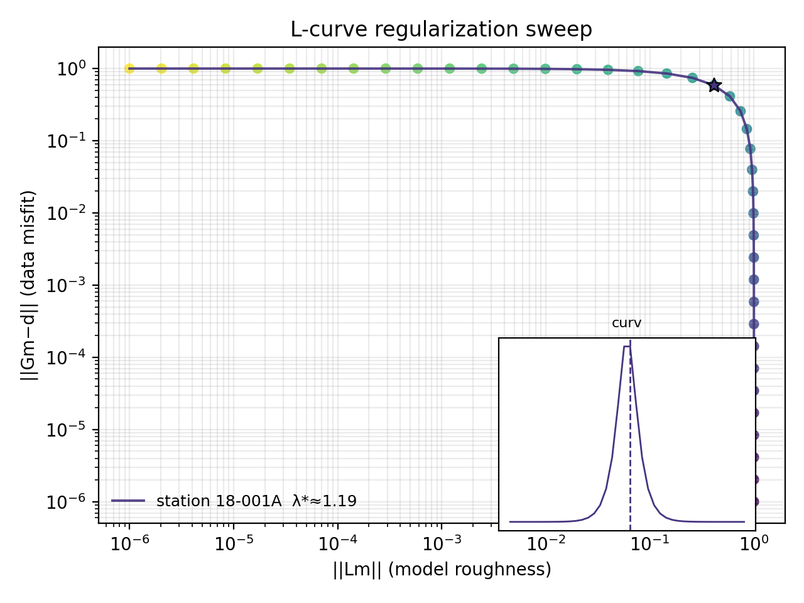
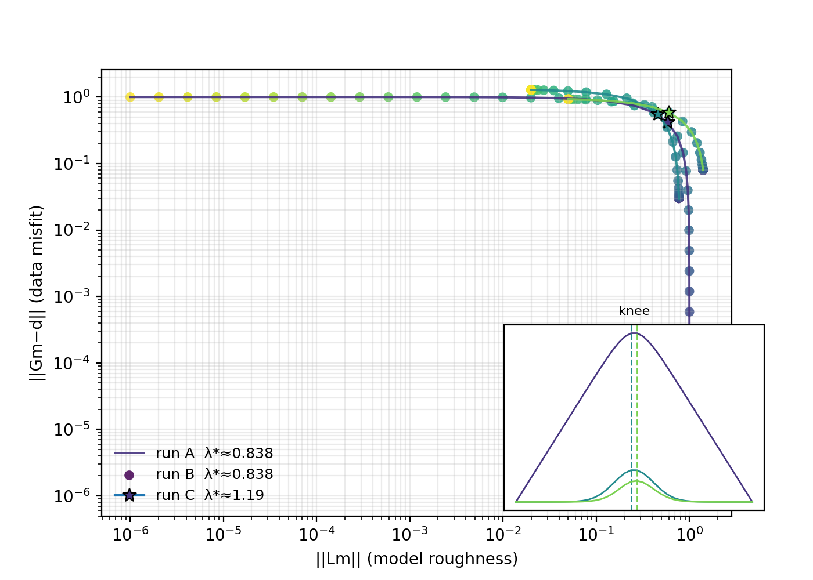
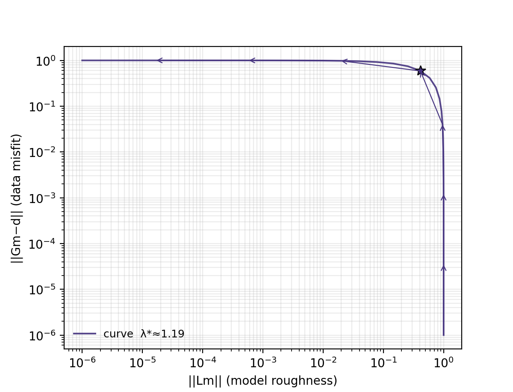
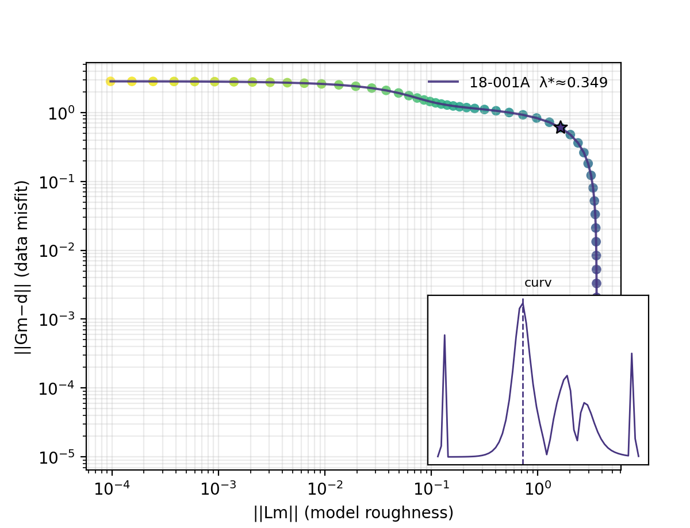
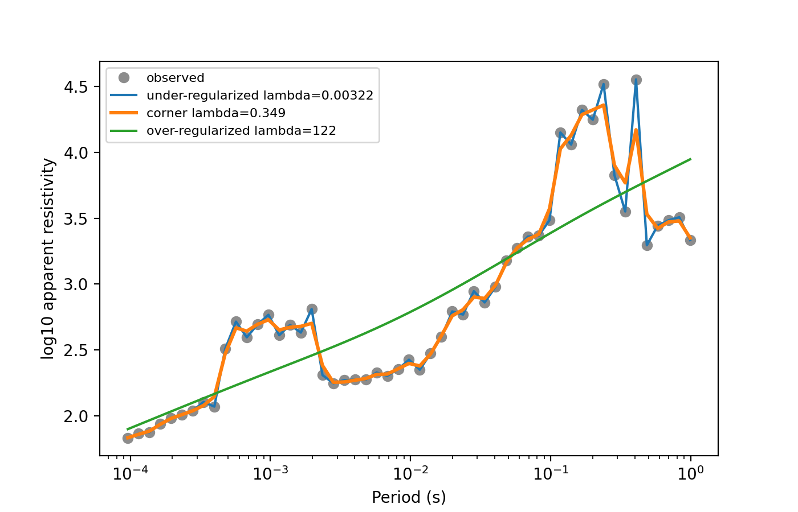
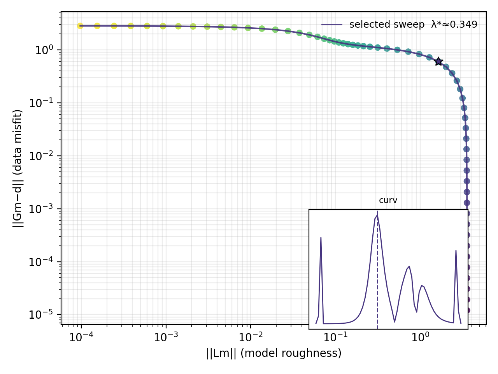

.. _emtools_lcurve:

L-Curve Regularization Selection
================================

``pycsamt.emtools.lcurve`` helps choose a regularization parameter from
a sweep of candidate models. Unlike most ``emtools`` pages, this module
does not require EDI files or ``Sites`` objects. It only needs three
arrays from a regularized inversion or smoothing experiment:

* data misfit, for example ``||Gm - d||``;
* model roughness, for example ``||Lm||``;
* optional regularization values, usually named ``lambda``.

Full callable signatures live in the :doc:`API reference <../../api/emtools>`.
This page explains how to prepare the arrays, find the corner, plot the
curve, compare methods, and turn the result into a reproducible report.

What The L-Curve Means
----------------------

Regularization is a trade-off. A small regularization parameter usually
fits the data more closely but allows a rough model. A large
regularization parameter usually makes the model smoother but increases
the data misfit.

In a standard Tikhonov problem the model :math:`m_\lambda` is obtained
by minimizing

.. math::

   \Phi_\lambda(m)
   =
   \|Gm - d\|_2^2
   +
   \lambda^2\|Lm\|_2^2,

where :math:`G` is the forward operator, :math:`d` is the data vector,
:math:`L` is the roughness or damping operator, and :math:`\lambda`
controls how much roughness is penalized.  The L-curve is built after
solving this problem for many candidate values of :math:`\lambda`.

The L-curve plots these two quantities against each other:

.. math::

   x(\lambda) = \|Lm_\lambda\|_2,
   \qquad
   y(\lambda) = \|Gm_\lambda - d\|_2.

The useful value is often near the "corner" of the curve: the point
where adding more smoothness begins to cost noticeably more data fit.
That value is not magic, but it is a defensible starting point when you
need to choose a regularization level from a sweep.

Inputs Expected By The Module
-----------------------------

``lcurve_table`` and ``plot_lcurve`` expect positive, finite arrays.
Internally, non-finite and non-positive values are filtered out before
log-scale calculations. The shortest valid array length controls the
number of rows used.

The scoring is done in log-log space,

.. math::

   X_i = \log_{10} x_i,
   \qquad
   Y_i = \log_{10} y_i,

because the trade-off is usually multiplicative: a useful corner often
means "this much extra smoothness costs this many times more misfit",
not a fixed additive change in raw units.

.. code-block:: python
   :linenos:

   import numpy as np

   lambdas = np.logspace(-3, 3, 60)
   roughness = 1.0 / (1.0 + lambdas**2)
   misfit = lambdas**2 / (1.0 + lambdas**2)

   # All three arrays should describe the same sweep order.
   assert misfit.shape == roughness.shape == lambdas.shape
   assert np.all(misfit > 0.0)
   assert np.all(roughness > 0.0)

The module does not compute the inversion itself. It only analyzes the
numbers produced by your inversion, forward-model sweep, or smoothing
experiment.

A Minimal Synthetic Example
---------------------------

Start with a curve whose corner is easy to see. This is useful for
checking that the mechanics are clear before using real inversion
output.

.. code-block:: python
   :linenos:

   import numpy as np

   from pycsamt.emtools import lcurve_table, plot_lcurve

   lambdas = np.logspace(-3, 3, 40)

   # Small lambda: rough model, low misfit.
   # Large lambda: smooth model, higher misfit.
   roughness = 1.0 / (1.0 + lambdas**2)
   misfit = lambdas**2 / (1.0 + lambdas**2)

   table = lcurve_table(misfit, roughness, lambdas)
   corner_idx = table.attrs["corner_idx"]

   print(table.iloc[corner_idx])
   print("lambda* =", table["lam"].iloc[corner_idx])

   ax = plot_lcurve(misfit, roughness, lambdas)
   ax.figure.savefig("synthetic_lcurve.png", dpi=200)

.. code-block:: text

   rough     0.412354
   misfit    0.587646
   lam       1.193777
   curv      1.333709
   slope    -0.711581
   Name: 20, dtype: float64
   lambda* = 1.1937766417144369

The returned table has columns ``rough``, ``misfit``, ``lam``, ``curv``,
and ``slope``. The selected row is stored separately as
``table.attrs["corner_idx"]`` so the table itself remains ordinary
pandas data.

Read The Table
--------------

The table is the most important output because it lets you inspect the
corner selection numerically.

.. code-block:: python
   :linenos:

   from pycsamt.emtools import lcurve_table
   table = lcurve_table(
       misfit,
       roughness,
       lambdas,
       method="curvature",
       smooth=3,
       skip=1,
   )
   corner = table.attrs["corner_idx"]
   row = table.iloc[corner]
   print(f"corner index: {corner}")
   print(f"lambda*: {row['lam']:.4g}")
   print(f"misfit: {row['misfit']:.4g}")
   print(f"roughness: {row['rough']:.4g}")
   print(f"corner score: {row['curv']:.4g}")
   print(f"local slope: {row['slope']:.4g}")

.. code-block:: text

   corner index: 20
   lambda*: 1.194
   misfit: 0.5876
   roughness: 0.4124
   corner score: 1.334
   local slope: -0.7116

``curv`` is the corner score. With ``method="curvature"``, it is the
numerical curvature of the log-log curve. With ``method="maxdist"``, it
is the perpendicular distance from the line connecting the first and
last log-log points.

For the curvature method, the score is the discrete version of

.. math::

   \kappa(t)
   =
   {|X'(t)Y''(t) - Y'(t)X''(t)|
   \over
   \left(X'(t)^2 + Y'(t)^2\right)^{3/2}},

where :math:`t` is the ordered sweep index.  The selected corner is the
valid point with largest :math:`\kappa`.

Use A Dictionary Result
-----------------------

For small helper functions or serialization, ``return_dict=True`` gives
arrays plus the selected corner index.

.. code-block:: pycon

   >>> from pycsamt.emtools import lcurve_table
   >>> result = lcurve_table(
   ...     misfit,
   ...     roughness,
   ...     lambdas,
   ...     method="maxdist",
   ...     return_dict=True,
   ... )
   >>> corner = result["corner"]
   >>> lambda_star = result["lam"][corner]
   >>> print(lambda_star)
   0.8376776400682924

The dictionary keys are ``rough``, ``misfit``, ``lam``, ``curv``,
``slope``, and ``corner``.

Sorting And Sweep Order
-----------------------

The curve can be sorted by roughness, by lambda, or automatically.
The default ``sort="auto"`` sorts by lambda when the lambda array is
monotonic; otherwise it sorts by roughness.

.. code-block:: python
   :linenos:

   from pycsamt.emtools import lcurve_table

   by_lambda = lcurve_table(
       misfit,
       roughness,
       lambdas,
       sort="lambda",
   )

   by_roughness = lcurve_table(
       misfit,
       roughness,
       lambdas,
       sort="x",
   )

Use ``sort="lambda"`` when you want to preserve the physical sweep
direction. Use ``sort="x"`` when the lambda values are missing,
duplicated, or not meaningful and the curve should simply be ordered
from low to high roughness.

Corner Methods
--------------

Two corner-picking methods are available.

.. list-table::
   :header-rows: 1
   :widths: 25 40 35

   * - Method
     - How It Scores Points
     - When To Prefer It
   * - ``"curvature"``
     - Computes numerical curvature of the log-log curve.
     - Smooth, well-sampled curves.
   * - ``"maxdist"``
     - Finds the point farthest from the line joining the two endpoints.
     - Noisy curves, short sweeps, or uncertain smoothing.

.. code-block:: python
   :linenos:

   from pycsamt.emtools import lcurve_table
   curvature = lcurve_table(
       misfit,
       roughness,
       lambdas,
       method="curvature",
       smooth=3,
   )
   maxdist = lcurve_table(
       misfit,
       roughness,
       lambdas,
       method="maxdist",
   )
   j_curv = curvature.attrs["corner_idx"]
   j_dist = maxdist.attrs["corner_idx"]
   print("curvature lambda*:", curvature["lam"].iloc[j_curv])
   print("maxdist lambda*:", maxdist["lam"].iloc[j_dist])

.. code-block:: text

   curvature lambda*: 1.1937766417144369
   maxdist lambda*: 0.8376776400682924

If the two methods choose similar values, the corner is probably stable.
If they disagree strongly, inspect the curve and consider widening the
lambda sweep.

The max-distance method works directly on the chord between the first
and last log-log points.  If
:math:`\mathbf{p}_0=(X_0,Y_0)` and
:math:`\mathbf{p}_1=(X_n,Y_n)`, the score for point
:math:`\mathbf{p}_i=(X_i,Y_i)` is

.. math::

   d_i
   =
   {|
   (Y_n-Y_0)(X_i-X_0)
   -
   (X_n-X_0)(Y_i-Y_0)
   |
   \over
   \sqrt{(X_n-X_0)^2 + (Y_n-Y_0)^2}}.

This score is less sensitive to local numerical derivatives, which is
why it is often a good cross-check for noisy or sparsely sampled
sweeps.

Smoothing And Endpoint Skipping
-------------------------------

The ``smooth`` argument affects the curvature method by applying a
moving average in log-log space before differentiating. The ``skip``
argument prevents the first and last points from being selected as the
corner.

.. code-block:: python
   :linenos:

   from pycsamt.emtools import lcurve_table
   for smooth in (1, 3, 5, 7):
       table = lcurve_table(
           misfit,
           roughness,
           lambdas,
           method="curvature",
           smooth=smooth,
           skip=2,
       )
       j = table.attrs["corner_idx"]
       print(f"smooth={smooth}: lambda*={table['lam'].iloc[j]:.4g}")

.. code-block:: text

   smooth=1: lambda*=1.194
   smooth=3: lambda*=1.194
   smooth=5: lambda*=0.8377
   smooth=7: lambda*=0.8377

Be cautious with heavy smoothing. It can move the curvature maximum
away from the visual corner, especially for short curves. ``maxdist`` is
often a useful cross-check because it does not use numerical
derivatives.

With ``smooth > 1``, pyCSAMT applies a moving average to
:math:`X_i=\log_{10}x_i` and :math:`Y_i=\log_{10}y_i` before computing
derivatives:

.. math::

   \bar{X}_i
   =
   {1 \over w}
   \sum_{k=i-h}^{i+h} X_k,
   \qquad
   h = {w-1 \over 2}.

The same operation is applied to :math:`Y_i`.  Smoothing is useful when
the score curve is jagged, but it changes the curve being
differentiated, so the selected :math:`\lambda^\ast` should still be
checked against the plotted model.

Plot A Single Curve
-------------------

``plot_lcurve`` draws roughness on the x-axis and misfit on the y-axis,
both in log scale. The selected corner is marked with a star by
default.

.. code-block:: python
   :linenos:

   import matplotlib.pyplot as plt

   from pycsamt.emtools import plot_lcurve

   fig, ax = plt.subplots(figsize=(6.4, 4.8))

   plot_lcurve(
       misfit,
       roughness,
       lambdas,
       labels=["station 18-001A"],
       method="curvature",
       smooth=3,
       show_inset=True,
       ax=ax,
   )

   ax.set_title("L-curve regularization sweep")
   fig.tight_layout()
   fig.savefig("lcurve_18-001A.png", dpi=200)
   plt.close(fig)

The inset shows the corner score. For ``method="curvature"`` the inset
title is ``curv``. For ``method="maxdist"`` it is ``knee``.

Plot Multiple Curves
--------------------

Pass lists of misfit, roughness, and lambda arrays to compare several
stations, inversion targets, or model parameterizations.

.. code-block:: python
   :linenos:

   import matplotlib.pyplot as plt

   from pycsamt.emtools import plot_lcurve

   curves_misfit = [
       misfit,
       misfit * 1.25 + 0.03,
       misfit * 0.85 + 0.08,
   ]
   curves_roughness = [
       roughness,
       roughness * 0.75 + 0.02,
       roughness * 1.35 + 0.05,
   ]
   curves_lambda = [lambdas, lambdas, lambdas]

   fig, ax = plt.subplots(figsize=(7.0, 5.0))
   plot_lcurve(
       curves_misfit,
       curves_roughness,
       curves_lambda,
       labels=["run A", "run B", "run C"],
       method="maxdist",
       show_inset=True,
       ax=ax,
   )
   fig.savefig("lcurve_multi_run.png", dpi=200)
   plt.close(fig)

The plot uses one shared inset for all curves, so the corner scores can
be compared in the same small panel. The legend reports the selected
``lambda*`` for each curve when lambda values are supplied.

Show Sweep Direction
--------------------

``arrow_every`` draws arrows along the curve. This is helpful when you
want readers to see how increasing lambda moves through the trade-off.

.. code-block:: python
   :linenos:

   from pycsamt.emtools import plot_lcurve

   ax = plot_lcurve(
       misfit,
       roughness,
       lambdas,
       arrow_every=5,
       show_points=False,
       show_inset=False,
   )
   ax.figure.savefig("lcurve_with_lambda_direction.png", dpi=200)

Use arrows when teaching or reviewing a sweep. For compact reports,
points plus the corner marker are usually enough.

Use L-Curve With A Real Smoothing Sweep
---------------------------------------

The example below builds a small Tikhonov smoothing problem from one
station's apparent resistivity. It is not a full inversion; it is a
transparent way to produce real misfit and roughness arrays.

The model vector is the smoothed
:math:`\log_{10}\rho_a(T)` curve.  The second-difference operator is

.. math::

   (Dm)_i = m_i - 2m_{i+1} + m_{i+2},

so :math:`\|Dm\|_2` penalizes curvature in the sounding rather than its
absolute level.  For this simple smoothing problem, the normal equation
is

.. math::

   (I + \lambda^2 D^T D)m_\lambda = d.

.. code-block:: python
   :linenos:

   import numpy as np

   from pycsamt.emtools import ensure_sites, lcurve_table, plot_lcurve
   from pycsamt.emtools._core import _get_z_block, _iter_items, _name

   survey = ensure_sites("data/AMT/WILLY_DATA/L18PLT", strict=True)

   def second_difference(n):
       operator = np.zeros((n - 2, n))
       for i in range(n - 2):
           operator[i, i] = 1.0
           operator[i, i + 1] = -2.0
           operator[i, i + 2] = 1.0
       return operator

   def station_log10_rho_xy(sites, station):
       for index, site in enumerate(_iter_items(sites)):
           if _name(site, index) != station:
               continue
           _, z, freq = _get_z_block(site)
           rho_xy = 0.2 * np.abs(z[:, 0, 1]) ** 2 / freq
           return np.log10(rho_xy), freq
       raise KeyError(station)

   def smoothing_sweep(data, lambdas):
       n = data.size
       identity = np.eye(n)
       rough_operator = second_difference(n)
       regularizer = rough_operator.T @ rough_operator

       misfits = []
       roughness = []
       models = []

       for lam in lambdas:
           model = np.linalg.solve(
               identity + lam**2 * regularizer,
               data,
           )
           misfits.append(np.linalg.norm(model - data))
           roughness.append(np.linalg.norm(rough_operator @ model))
           models.append(model)

       return np.array(misfits), np.array(roughness), np.array(models)

   lambdas = np.logspace(-3, 3, 60)
   data, freq = station_log10_rho_xy(survey, "18-001A")
   misfit, roughness, models = smoothing_sweep(data, lambdas)

   table = lcurve_table(misfit, roughness, lambdas)
   corner = table.attrs["corner_idx"]
   print("lambda* =", table["lam"].iloc[corner])

   ax = plot_lcurve(misfit, roughness, lambdas, labels=["18-001A"])
   ax.figure.savefig("lcurve_real_station.png", dpi=200)

.. code-block:: text

   lambda* = 0.34863652276780877

This code makes the L-curve inputs explicit. ``misfit`` measures how far
the smoothed model is from the observed log-resistivity curve.
``roughness`` measures how curved the smoothed model remains after
applying the second-difference operator.

The important part is not that this is a full inversion; it is that the
arrays passed to ``lcurve_table`` come from a real regularized solve.  In
production you would replace this small smoothing system with the
misfit and roughness reported by your inversion engine.

Inspect What Lambda Does
------------------------

After choosing a corner, plot the model at the corner against clearly
under- and over-regularized choices. This is the best sanity check.

For a small :math:`\lambda`, the term
:math:`\|Gm-d\|_2^2` dominates and the model follows the data closely.
For a large :math:`\lambda`, the roughness penalty dominates and the
model approaches the smoothest curve allowed by :math:`L`.  The corner
is useful only if the model at :math:`\lambda^\ast` is a credible
compromise between those two behaviors.

.. code-block:: python
   :linenos:

   import matplotlib.pyplot as plt

   period = 1.0 / freq
   corner = table.attrs["corner_idx"]
   under = 5
   over = 50

   fig, ax = plt.subplots(figsize=(7.0, 4.5))

   ax.semilogx(period, data, "o", color="0.55", label="observed")
   ax.semilogx(
       period,
       models[under],
       "-",
       label=f"under-regularized lambda={lambdas[under]:.3g}",
   )
   ax.semilogx(
       period,
       models[corner],
       "-",
       linewidth=2.2,
       label=f"corner lambda={lambdas[corner]:.3g}",
   )
   ax.semilogx(
       period,
       models[over],
       "-",
       label=f"over-regularized lambda={lambdas[over]:.3g}",
   )

   ax.set_xlabel("Period (s)")
   ax.set_ylabel("log10 apparent resistivity")
   ax.legend(fontsize=8)
   fig.savefig("regularization_levels.png", dpi=200)
   plt.close(fig)

The under-regularized model should usually track too much local noise.
The over-regularized model should usually be too smooth. The corner
model should sit between them.

Common Failure Modes
--------------------

Corner at the first or last lambda
    The sweep probably does not bracket the useful region. Extend the
    lambda range and rerun the sweep. Increasing ``skip`` can hide the
    endpoint, but it cannot fix a badly chosen sweep.

Misfit or roughness contains zeros
    Log-scale L-curve scoring requires positive values. The module
    filters non-positive values, but you should still investigate why
    they occurred.

Curvature and max-distance disagree
    The curve may be noisy, too short, too heavily smoothed, or not
    truly L-shaped. Plot both methods and inspect the model curves at
    both selected lambdas.

Multiple curves have very different scales
    That can be normal when stations or inversions differ strongly.
    Compare selected lambdas and model behavior, not only absolute
    misfit and roughness values.

The curve is nearly a straight line
    There may not be a meaningful trade-off in the swept range. Try a
    wider lambda interval or revisit the definition of misfit and
    roughness.

Save A Reproducible L-Curve Bundle
----------------------------------

This script writes the table, selected corner, plot, and a short text
summary for one sweep.

.. code-block:: python
   :linenos:

   from pathlib import Path

   import matplotlib.pyplot as plt

   from pycsamt.emtools import lcurve_table, plot_lcurve

   out = Path("lcurve_report")
   out.mkdir(parents=True, exist_ok=True)

   table = lcurve_table(
       misfit,
       roughness,
       lambdas,
       method="curvature",
       smooth=3,
       skip=1,
   )
   corner = table.attrs["corner_idx"]
   table.to_csv(out / "lcurve_table.csv", index=False)

   corner_row = table.iloc[corner]
   with (out / "corner.txt").open("w", encoding="utf-8") as stream:
       stream.write(f"corner_index: {corner}\n")
       stream.write(f"lambda_star: {corner_row['lam']:.8g}\n")
       stream.write(f"misfit: {corner_row['misfit']:.8g}\n")
       stream.write(f"roughness: {corner_row['rough']:.8g}\n")
       stream.write(f"score: {corner_row['curv']:.8g}\n")

   fig, ax = plt.subplots(figsize=(6.4, 4.8))
   plot_lcurve(
       misfit,
       roughness,
       lambdas,
       labels=["selected sweep"],
       method="curvature",
       smooth=3,
       ax=ax,
   )
   fig.tight_layout()
   fig.savefig(out / "lcurve.png", dpi=200)
   plt.close(fig)

Worked Example
--------------

The gallery example builds a real regularization sweep from
bundled apparent-resistivity data and compares corner-picking methods.

Open the rendered gallery page here:
:ref:`sphx_glr_examples_emtools_plot_lcurve.py`.
