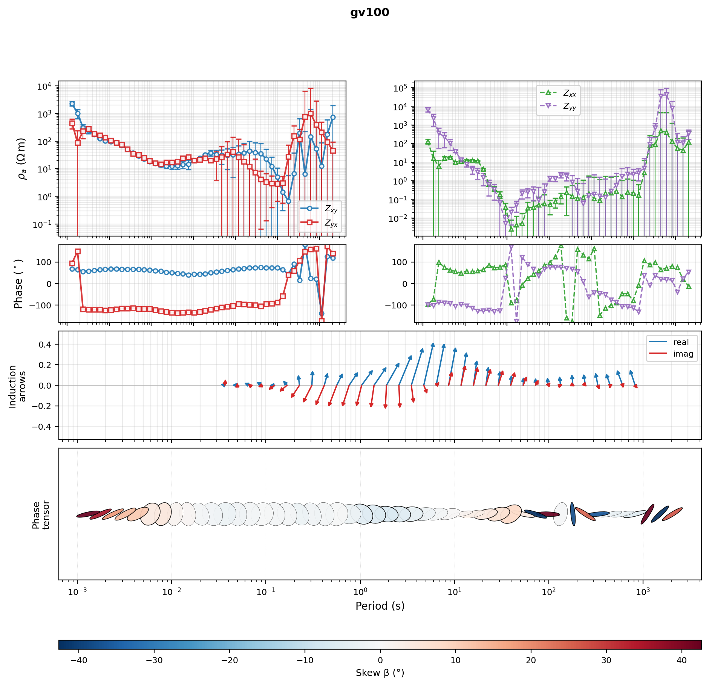
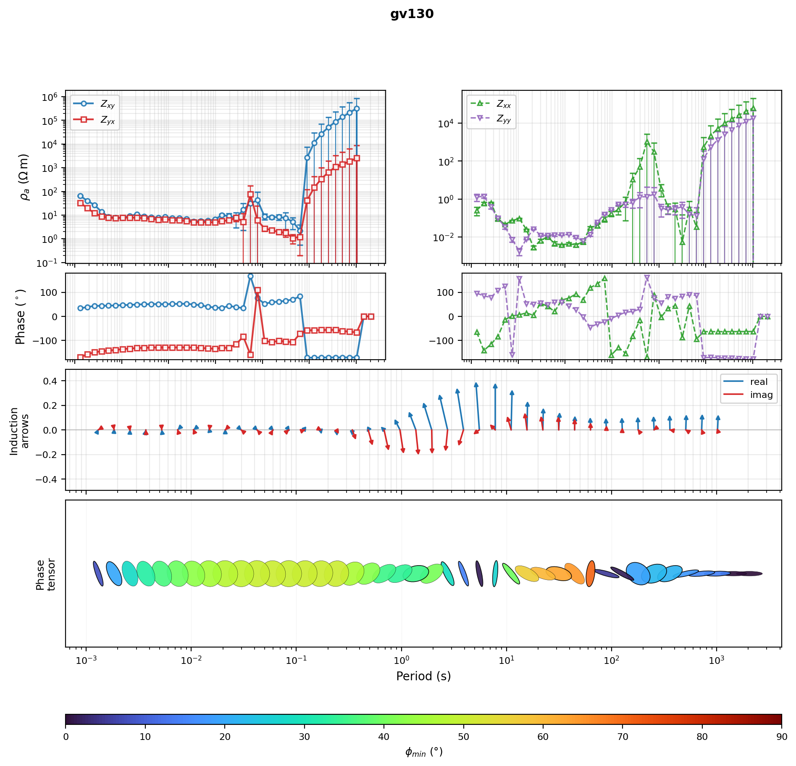

.. _emtools_plot:

Multi-Station Diagnostic Panels
===============================

``pycsamt.emtools.plot`` is the multi-station plotting layer for
:term:`impedance tensor` and :term:`tipper` response diagnostics. It is
the place to go when one station at a time is too narrow, but a map or
pseudo-section is too compressed. Its sibling module,
``pycsamt.emtools.overview``, covers the opposite case -- one station,
every diagnostic at once -- and is documented on this page too, since
both re-export through the same top-level ``pycsamt.emtools`` namespace
and cover the same site-level visualisation job.

The page covers six common plotting jobs:

* compact :term:`apparent resistivity` and :term:`phase` panels for many
  stations;
* raw full-tensor station groups;
* response plus tipper :term:`quality control` panels;
* before/after comparison figures;
* measured-versus-predicted fit grids with per-component
  :term:`RMS misfit` labels;
* a single-station "full response" overview combining impedance,
  induction arrows, and :term:`phase tensor` ellipses in one figure.

Full callable signatures live in the :doc:`API reference <../../api/emtools>`.
This page explains when to use each figure, which arguments matter, and
how to build reproducible plotting scripts.

Where This Module Fits
----------------------

Use ``pycsamt.emtools.plot`` after loading and inspecting data. It does
not replace the first-look inventory tools in ``inspect`` or the
specialized tensor/impedance diagnostics. Instead, it gives dense
station-group figures for QC, comparison, and reporting.

.. list-table::
   :header-rows: 1
   :widths: 26 39 35

   * - Function
     - Best Use
     - Figure Shape
   * - ``plot_sites_panels``
     - Quick rho/phase panels for selected stations.
     - One station per small two-row group.
   * - ``plot_raw_sites_1d``
     - Full-tensor raw-data review.
     - One station group, one column per component.
   * - ``plot_response_tipper``
     - Joint impedance and tipper QC.
     - Rho/phase rows plus Tx/Ty rows.
   * - ``plot_sites_compare``
     - Raw vs processed or before vs after.
     - Paired columns per station.
   * - ``plot_sites_fit_grid``
     - Observed vs predicted inversion-response review.
     - Component columns with RMS labels.
   * - ``plot_response_overview``
     - One station, every diagnostic at once.
     - Rho/phase columns plus induction-arrow and phase-tensor-ellipse
       rows.

All functions accept a path, ``Sites`` object, collection, or compatible
iterable. Internally they normalize inputs with ``ensure_sites`` unless
a function has a special duplicate-preservation mode.

Load Once, Plot Many
--------------------

Normalize a survey once and pass the resulting object into every plot
that follows; this keeps scripts fast and puts loading failures in one
obvious place rather than scattered across each figure call.
``sites_summary`` is a cheap way to confirm what actually loaded before
spending time on figures -- here it doubles as evidence for a claim made
throughout this page: **L18PLT** (an :term:`AMT` line) carries no
:term:`tipper`, while **KAP03** (an :term:`MT` line, loaded alongside
it) does.

.. code-block:: pycon

   >>> from pathlib import Path
   >>> from pycsamt.emtools import ensure_sites, sites_summary
   >>> survey = ensure_sites(
   ...     Path("data/AMT/WILLY_DATA/L18PLT"),
   ...     recursive=True,
   ...     on_dup="replace",
   ...     strict=True,
   ...     verbose=1,
   ... )
   >>> kap = ensure_sites("data/MT/kap03lmt_edis", strict=True)
   >>> stations = ["18-001A", "18-007U", "18-016A", "18-018A"]
   >>> summary = sites_summary(survey)
   >>> print(len(summary), "stations,", "tipper present:", bool(summary["has_tipper"].any()))
   28 stations, tipper present: False
   >>> summary.head(3)
      station  n_freq  has_tipper  period_min  period_max        lat         lon
   0  18-001A      53       False    0.000096    0.992063  32.120300  119.128833
   1  18-002U      53       False    0.000096    0.992063  32.121133  119.128900
   2  18-003A      53       False    0.000096    0.992063  32.122083  119.128850

Use a short station list for most figures. The functions can plot many
stations, but readability falls quickly once every panel carries
multiple components and legends.

Quick Station Panels
--------------------

``plot_sites_panels`` is the simplest overview. Each station gets two
stacked panels: :term:`apparent resistivity` or impedance magnitude on
top, :term:`phase` below. The default components are ``"xy"`` and
``"yx"`` -- the :term:`off-diagonal component` pair that normally
carries the primary :term:`TE mode`/:term:`TM mode` information for a
1-D or 2-D earth. Apparent resistivity itself is the standard
half-space-equivalent quantity,

.. math::

   \rho_a = 0.2\,\frac{|Z|^2}{f},

with :math:`Z` in field units and :math:`f` in hertz; every rho panel on
this page plots :math:`\log_{10}\rho_a` against period or frequency.

.. code-block:: pycon

   >>> import matplotlib.pyplot as plt
   >>> from pycsamt.emtools import plot_sites_panels
   >>> fig = plot_sites_panels(
   ...     survey,
   ...     stations=["18-001A", "18-007U", "18-016A", "18-018A"],
   ...     components=("xy", "yx"),
   ...     quantity="rhoa",
   ...     x_axis="period",
   ...     ncols=4,
   ...     show_error_bars=True,
   ...     show_legend=True,
   ... )
   >>> [fig.axes[i].get_title() for i in range(0, 8, 2)]
   ['18-001A', '18-007U', '18-016A', '18-018A']
   >>> fig.savefig("l18plt_station_panels.png", dpi=200)
   >>> plt.close(fig)

.. image:: ../../images/user_guide/emtools/user-guide-emtools-plot-02.png
   :width: 100%

Four stations fill the requested four-column grid exactly, one rho/phase
pair of axes each, and ``fig.axes[0::2]`` (the top, rho, axis of each
pair) carries the station name as its title -- confirmed above rather
than assumed. Use this figure when you want a quick visual sweep of
several stations, not a full tensor or tipper review; for those, reach
for ``plot_raw_sites_1d`` or ``plot_response_tipper`` instead.

Choose Rho Or Impedance Magnitude
---------------------------------

Most field reports use apparent resistivity, but sometimes you need to
inspect the :term:`impedance tensor` directly. Set
``quantity="impedance"`` to plot :math:`\log_{10}|Z|` instead of
:math:`\log_{10}\rho_a` -- useful for tensor debugging, instrument
checks, or comparison with diagnostics that work in :math:`Z`-space
rather than resistivity-space.

.. code-block:: pycon

   >>> fig = plot_sites_panels(
   ...     "data/AMT/WILLY_DATA/L18PLT",
   ...     stations=["18-001A", "18-016A"],
   ...     components=("xx", "xy", "yx", "yy"),
   ...     quantity="impedance",
   ...     phase_range=(-180.0, 180.0),
   ...     ncols=2,
   ...     show_legend=True,
   ... )
   >>> fig.axes[0].get_ylabel()
   '$\\log_{10}|Z|$'
   >>> fig.savefig("impedance_magnitude_panels.png", dpi=200)

.. image:: ../../images/user_guide/emtools/user-guide-emtools-plot-03.png
   :width: 100%

The y-axis label switches automatically with ``quantity``, so a reader
can tell which space a saved figure used without checking the call that
produced it. Keep ``quantity="rhoa"`` for ordinary geophysical response
plots and switch to ``"impedance"`` only when the tensor itself, not its
resistivity-equivalent, is the object under review.

Phase Range And X Axis
----------------------

The high-level panel function exposes ``x_axis`` and ``phase_range``
directly rather than requiring you to unwrap phase or convert period to
frequency by hand.

.. code-block:: pycon

   >>> fig = plot_sites_panels(
   ...     "data/AMT/WILLY_DATA/L18PLT",
   ...     stations=["18-001A", "18-007U"],
   ...     components=("xy", "yx"),
   ...     x_axis="frequency",
   ...     phase_range=(0.0, 360.0),
   ...     ylim_phase=(0.0, 360.0),
   ...     ncols=2,
   ... )
   >>> fig.axes[1].get_ylim()
   (0.0, 360.0)
   >>> fig.savefig("frequency_axis_phase_0_360.png", dpi=200)

.. image:: ../../images/user_guide/emtools/user-guide-emtools-plot-04.png
   :width: 100%

The phase axis limits read back exactly as requested, confirming
``ylim_phase`` overrides the wrapping range rather than merely
suggesting it. Use ``phase_range=None`` to show raw, unwrapped phase.
Use an explicit range whenever several stations must share one display
convention for comparison.

Raw Full-Tensor Panels
----------------------

``plot_raw_sites_1d`` is built for raw or nearly raw response review.
Each station is a group, each selected component is a column, and each
component column stacks apparent resistivity above phase.

.. code-block:: pycon

   >>> from pycsamt.emtools import plot_raw_sites_1d
   >>> fig = plot_raw_sites_1d(
   ...     survey,
   ...     stations=["18-001A", "18-007U", "18-016A"],
   ...     components=("xx", "xy", "yx", "yy"),
   ...     raw=True,
   ...     force_style=False,
   ...     ncols_groups=3,
   ...     show_error_bars=True,
   ...     show_component_legend=True,
   ... )
   >>> len(fig.axes)
   24
   >>> fig.savefig("raw_full_tensor_panels.png", dpi=200)
   >>> plt.close(fig)

.. image:: ../../images/user_guide/emtools/user-guide-emtools-plot-05.png
   :width: 100%

Three stations times four components times two rows (rho, phase) is the
24 axes reported above. With ``raw=True`` the function uses the
package's plain diagnostic style -- black by default -- so nothing about
the display implies interpretation before you have even looked at it.

Force Component Colours
-----------------------

After the raw diagnostic pass, set ``force_style=True`` (with
``raw=True`` left on) to restore the usual per-component colours while
keeping the identical layout.

.. code-block:: pycon

   >>> fig = plot_raw_sites_1d(
   ...     "data/AMT/WILLY_DATA/L18PLT",
   ...     stations=["18-001A", "18-007U", "18-016A"],
   ...     components=("xy", "yx"),
   ...     raw=True,
   ...     force_style=True,
   ...     ncols_groups=3,
   ... )
   >>> fig.savefig("raw_panels_component_colours.png", dpi=200)

.. image:: ../../images/user_guide/emtools/user-guide-emtools-plot-06.png
   :width: 100%

This makes a good second view: look for obvious raw-data problems in
plain black first, then re-render with component colours once you want
to compare :term:`TE mode`/:term:`TM mode` behaviour at a glance.

Shared Labels Or Axis Labels
----------------------------

``plot_raw_sites_1d`` can lay out its station and axis labels two ways.
``label_mode="shared"`` draws the station name and axis labels once per
group, as ``fig.text`` calls that float above and beside the whole
group; ``label_mode="axis"`` instead sets each panel's own
``Axes.set_ylabel`` and leaves no group-level figure text at all. The
difference is visible directly in the object graph, not just the
rendered figure:

.. code-block:: pycon

   >>> fig_shared = plot_raw_sites_1d(
   ...     "data/AMT/WILLY_DATA/L18PLT",
   ...     stations=["18-001A"],
   ...     components=("xx", "xy", "yx", "yy"),
   ...     label_mode="shared",
   ...     show_component_legend=False,
   ...     ncols_groups=1,
   ...     figsize_scale=(8.0, 4.0),
   ... )
   >>> fig_shared.subplots_adjust(left=0.20)
   >>> sorted(t.get_text() for t in fig_shared.texts)
   ['$\\log_{10}T$ (s)', '$\\log_{10}\\rho_a$ ($\\Omega\\,\\mathrm{m}$)', '18-001A', 'Phase ($^\\circ$)']
   >>> fig_shared.savefig("raw_shared_labels.png", dpi=200)

   >>> fig_axis = plot_raw_sites_1d(
   ...     "data/AMT/WILLY_DATA/L18PLT",
   ...     stations=["18-001A"],
   ...     components=("xx", "xy"),
   ...     label_mode="axis",
   ...     show_component_legend=False,
   ...     ncols_groups=1,
   ...     figsize_scale=(6.0, 4.0),
   ... )
   >>> [t.get_text() for t in fig_axis.texts]
   []
   >>> [ax.get_ylabel() for ax in fig_axis.axes if ax.get_ylabel()]
   ['$\\log_{10}\\rho_a$ ($\\Omega\\,\\mathrm{m}$)', 'Phase ($^\\circ$)']
   >>> fig_axis.savefig("raw_axis_labels.png", dpi=200)

.. grid:: 1 1 2 2
   :gutter: 2

   .. grid-item::

      .. image:: ../../images/user_guide/emtools/user-guide-emtools-plot-07-01.png
         :width: 100%

   .. grid-item::

      .. image:: ../../images/user_guide/emtools/user-guide-emtools-plot-07-02.png
         :width: 100%

``fig_shared.texts`` carries four entries -- the station name plus rho,
phase, and period-axis labels -- while ``fig_axis.texts`` is empty
because the same information lives on the axes themselves instead.
``label_mode="shared"`` is the more compact choice for dense reports;
``label_mode="axis"`` is sometimes easier while debugging a single
group, since every label belongs to a concrete ``Axes`` you can query or
move independently.

Use Display Control
-------------------

``plot_raw_sites_1d`` and ``plot_response_tipper`` read display policy
from ``PYCSAMT_CONTROL`` unless you pass a specific control object. This
is how one script changes x-axis convention, phase wrapping, and rho
display consistently across every figure it produces.

.. code-block:: pycon

   >>> from pycsamt.api.control import PYCSAMT_CONTROL
   >>> with PYCSAMT_CONTROL.context(
   ...     x__view="frequency",
   ...     rho__view="linear",
   ...     phase__range=(0.0, 360.0),
   ... ):
   ...     fig = plot_raw_sites_1d(
   ...         "data/AMT/WILLY_DATA/L18PLT",
   ...         stations=["18-001A"],
   ...         components=("xy", "yx"),
   ...         label_mode="axis",
   ...         force_style=True,
   ...         show_component_legend=False,
   ...         ncols_groups=1,
   ...         figsize_scale=(6.0, 4.0),
   ...     )
   ...
   >>> fig.axes[0].get_ylabel()
   '$\\rho_a$ ($\\Omega\\,\\mathrm{m}$)'
   >>> fig.axes[2].get_ylim()
   (0.0, 360.0)
   >>> fig.savefig("raw_panels_frequency_linear_rho.png", dpi=200)
   >>> plt.close(fig)

.. image:: ../../images/user_guide/emtools/user-guide-emtools-plot-08.png
   :width: 100%

The rho label switches from ``$\log_{10}\rho_a$`` to a plain linear
``$\rho_a$``, and the phase axis limits read back exactly ``(0.0,
360.0)`` -- both driven entirely by the active control, with no other
argument touched. Use this pattern whenever one report needs a
consistent, non-default display style; it is more reliable than editing
labels or axis limits after the fact on each figure separately.

Response Plus Tipper
--------------------

``plot_response_tipper`` adds :term:`tipper` rows to the impedance
response layout. It needs a survey that actually carries vertical-field
data, so this and the next example switch to **KAP03**
(``data/MT/kap03lmt_edis``) -- confirmed below to carry tipper on every
station, unlike L18PLT.

.. code-block:: pycon

   >>> from pycsamt.emtools import plot_response_tipper
   >>> kap_summary = sites_summary(kap)
   >>> bool(kap_summary["has_tipper"].all())
   True
   >>> fig = plot_response_tipper(
   ...     kap,
   ...     stations=["kap103", "kap142", "kap151"],
   ...     components=("xy", "yx"),
   ...     tipper_components=("tx", "ty"),
   ...     tipper_span_group=True,
   ...     ylim_tipper=(-2.5, 2.5),
   ...     ncols_groups=3,
   ... )
   >>> fig.savefig("kap03_response_tipper.png", dpi=200)
   >>> plt.close(fig)

.. image:: ../../images/user_guide/emtools/user-guide-emtools-plot-09.png
   :width: 100%

With ``tipper_span_group=True`` each tipper row spans the whole station
group, which usually reads best when there are only two impedance
components and tipper should register as a station-level property
rather than a per-component one. Running this same function against an
AMT/CSAMT line with no tipper would still render -- it would just have
nothing meaningful to draw in the :math:`T_x`/:math:`T_y` rows, which is
why the ``has_tipper`` check above matters before you invest in the
figure.

Compact Tipper Rows
-------------------

Set ``tipper_span_group=False`` for a compact, repeated layout where the
tipper rows sit directly under each component column instead of
spanning the group.

.. code-block:: pycon

   >>> fig = plot_response_tipper(
   ...     "data/MT/kap03lmt_edis",
   ...     stations=["kap151"],
   ...     components=("xx", "xy", "yx", "yy"),
   ...     tipper_components=("tx", "ty"),
   ...     tipper_span_group=False,
   ...     show_tipper_error_bars=False,
   ...     show_component_legend=False,
   ...     ncols_groups=1,
   ...     figsize_scale=(7.2, 5.6),
   ...     shared_x_label_pad=0.11,
   ... )
   >>> fig.savefig("kap151_response_tipper_compact.png", dpi=200, bbox_inches="tight")

.. image:: ../../images/user_guide/emtools/user-guide-emtools-plot-10.png
   :width: 100%

Use the compact layout for one or two stations where every tensor
component matters. Use the spanning layout from the previous section
when comparing several stations and fewer, larger axes read better than
many small ones.

Before And After Comparison
---------------------------

``plot_sites_compare`` pairs stations from two datasets column by
column. The usual use is raw versus processed, before versus after a
:term:`static shift` correction, or original versus smoothed. There is
no real post-processing run bundled with these docs, so a light
frequency-domain moving average stands in honestly for "after": real
numbers from a real, if simple, transform rather than anything
fabricated.

.. code-block:: pycon

   >>> from pycsamt.emtools import plot_sites_compare, smooth_mavg
   >>> raw = survey
   >>> smoothed = smooth_mavg(raw, k=5)
   >>> fig = plot_sites_compare(
   ...     raw,
   ...     smoothed,
   ...     stations=["18-001A", "18-007U", "18-016A"],
   ...     components=("xy", "yx"),
   ...     labels=("raw", "smoothed k=5"),
   ...     quantity="rhoa",
   ...     x_axis="period",
   ...     ncols_groups=3,
   ...     show_legend=True,
   ... )
   >>> [ax.get_title() for ax in fig.axes if ax.get_title()]
   ['18-001A', '18-007U', '18-016A']
   >>> fig.savefig("raw_vs_smoothed_compare.png", dpi=200)
   >>> plt.close(fig)

.. image:: ../../images/user_guide/emtools/user-guide-emtools-plot-11.png
   :width: 100%

The title lives once per station group, spanning the raw/after column
pair, which is exactly the three stations requested above. The function
pairs stations by name; if the second dataset were missing a station,
the corresponding after-column would simply come back blank rather than
raising an error.

Compare Impedance Instead Of Rho
--------------------------------

The comparison view also accepts ``quantity="impedance"``. This matters
whenever a processing step changes the complex :term:`impedance tensor`
directly and you want to see that change without it being partly hidden
behind the apparent-resistivity conversion.

.. code-block:: pycon

   >>> processed = smooth_mavg(raw, k=3)
   >>> fig = plot_sites_compare(
   ...     raw,
   ...     processed,
   ...     stations=["18-001A", "18-016A"],
   ...     components=("xx", "xy", "yx", "yy"),
   ...     quantity="impedance",
   ...     phase_range=(-180.0, 180.0),
   ...     labels=("raw", "processed"),
   ...     ncols_groups=2,
   ... )
   >>> fig.savefig("impedance_before_after.png", dpi=200)

.. image:: ../../images/user_guide/emtools/user-guide-emtools-plot-12.png
   :width: 100%

Use fixed ``ylim_rhoa``/``ylim_phase`` whenever a before/after
comparison needs the same visual scale across several separately saved
figures -- otherwise auto-scaling can make two genuinely similar curves
look artificially different, or vice versa.

Measured Versus Predicted Fit Grid
----------------------------------

``plot_sites_fit_grid`` is built for inversion QC: it pairs measured and
predicted stations by name, aligns predicted values onto the measured
frequency grid, plots both curves, and annotates each component panel
with its own :term:`RMS misfit`. Writing the per-datum log-space
residual as :math:`r_i = \log_{10}\rho_a^{\mathrm{meas}} -
\log_{10}\rho_a^{\mathrm{pred}}` (or the equivalent in
:math:`\log_{10}|Z|` when ``quantity="impedance"``) and its display-space
error as :math:`\sigma_i`, the annotated value is

.. math::

   \mathrm{RMS} = \sqrt{\frac{1}{N}\sum_{i=1}^{N}
       \left(\frac{r_i}{\sigma_i}\right)^2}

when errors are available, falling back to the unweighted root-mean
square of :math:`r_i` when they are not. This is the same
error-normalized misfit used throughout pyCSAMT's inversion tooling: a
value near 1 means the fit is consistent with the assigned uncertainty,
while a much larger value means the "prediction" departs from the data
by more than its own error bars would allow.

.. code-block:: pycon

   >>> from pycsamt.emtools import plot_sites_fit_grid
   >>> measured = survey
   >>> predicted = smooth_mavg(measured, k=5)
   >>> fig = plot_sites_fit_grid(
   ...     measured,
   ...     predicted,
   ...     stations=["18-001A", "18-016A"],
   ...     components=("xy", "yx"),
   ...     quantity="rhoa",
   ...     phase_range=(-180.0, 180.0),
   ...     ncols_groups=2,
   ...     show_mode_legend=True,
   ... )
   >>> sorted(t.get_text() for ax in fig.axes for t in ax.texts if "rms" in t.get_text())
   ['ZXY  rms=3.65', 'ZXY  rms=5.49', 'ZYX  rms=3.48', 'ZYX  rms=4.49']
   >>> fig.savefig("measured_vs_predicted_fit_grid.png", dpi=200)
   >>> plt.close(fig)

.. image:: ../../images/user_guide/emtools/user-guide-emtools-plot-13.png
   :width: 100%

Every panel comes back with an RMS well above 1, from 3.48 to 5.49
across the two stations and two components requested. That is expected,
not a bug in the demonstration: a five-point moving average was never
fit *to* this survey's error bars in the first place, so it lands
several times outside them even though the raw curve shapes agree
closely by eye. A real inversion response, fit to those same
uncertainties, would be expected to land close to :math:`\mathrm{RMS}
\approx 1` instead. Treat this section's numbers as a demonstration of
the metric, not a QC result to reproduce.

Understand TE And TM Fit Colours
--------------------------------

The fit grid uses separate fit colours for :term:`TE mode`-like and
:term:`TM mode`-like components:

* ``xx`` and ``xy`` use the TE fit colour;
* ``yx`` and ``yy`` use the TM fit colour.

.. code-block:: pycon

   >>> fig = plot_sites_fit_grid(
   ...     measured,
   ...     predicted,
   ...     stations=["18-001A"],
   ...     components=("xx", "xy", "yx", "yy"),
   ...     color_fit_te="#2ca02c",
   ...     color_fit_tm="#d62728",
   ...     lw_fit=2.2,
   ...     ls_fit="-",
   ...     ncols_groups=1,
   ...     figsize_scale=(8.0, 4.0),
   ...     show_mode_legend=False,
   ... )
   >>> fig.savefig("fit_grid_custom_fit_colours.png", dpi=200, bbox_inches="tight")

.. image:: ../../images/user_guide/emtools/user-guide-emtools-plot-14.png
   :width: 100%

Use custom fit colours when assembling figures for publication or when
the package defaults conflict with another report's existing colour
convention.

Full-Response Station Overview
-------------------------------

Every figure so far puts several *stations* side by side. Sometimes the
opposite view is what a report needs: one station, but the complete
picture -- apparent resistivity and phase for all four impedance
components, induction arrows, and :term:`phase tensor` ellipses, all
sharing one period axis. ``plot_response_overview`` (in the sibling
``pycsamt.emtools.overview`` module, re-exported from
``pycsamt.emtools``) builds exactly that: the classic MT "full response"
quicklook, reworked to read display convention from
``PYCSAMT_CONTROL``/``PYCSAMT_STYLE`` like every other function on this
page rather than hard-coding colours or axis choices.

The example switches datasets one more time, to the Gabbs Valley USGS MT
survey bundled at ``data/gv_data`` -- three real stations (``gv100``,
``gv130``, ``gv163``) that, unlike L18PLT, carry a full :math:`2\times 2`
:term:`impedance tensor` (:math:`Z_{xx}` and :math:`Z_{yy}` included, not
just the off-diagonal pair) as well as tipper, which this figure needs
to fill every row.

.. code-block:: pycon

   >>> from pycsamt.emtools import ensure_sites, sites_summary, plot_response_overview
   >>> gv = ensure_sites("data/gv_data/gv_final_edi", strict=True)
   >>> gv_summary = sites_summary(gv)
   >>> print(len(gv_summary), "stations,", "tipper present:", bool(gv_summary["has_tipper"].all()))
   3 stations, tipper present: True
   >>> fig = plot_response_overview(gv, station="gv100")
   >>> len(fig.axes)
   7
   >>> fig.axes[0].get_yscale(), fig.axes[0].get_xscale()
   ('log', 'log')
   >>> fig.axes[2].get_yscale()
   'linear'
   >>> fig.savefig("gv100_response_overview.png", dpi=200, bbox_inches="tight")

Seven axes come back for the default two-column layout: apparent
resistivity and phase for the off-diagonal (:math:`Z_{xy}`,
:math:`Z_{yx}`) pair on the left, the diagonal (:math:`Z_{xx}`,
:math:`Z_{yy}`) pair on the right, one induction-arrow row, one
phase-tensor-ellipse row, and the ellipse row's own colourbar axis. The
apparent-resistivity row confirms as genuinely log-log
(``get_yscale() == "log"`` over a log x-axis, not :math:`\log_{10}\rho_a`
values plotted on a linear axis) and the phase row as linear-over-log,
i.e. semilog -- both draw Matplotlib's own per-decade grid rather than
sparse gridlines over pre-logged numbers, matching the reference
quicklook convention this figure reproduces.

Reading the panels from top to bottom: the resistivity and phase curves
behave exactly as in the earlier sections, just with all four components
present at once -- :math:`Z_{xx}` and :math:`Z_{yy}` stay small relative
to the off-diagonal pair through the middle of the period range, as
expected for a survey without strong 3-D distortion there, then grow
noticeably at the longest periods where the error bars also widen -- a
data-quality effect documented in the survey's own USGS data release,
`Peacock et al. (2021) <https://doi.org/10.5066/P9GZ9Z56>`_, not a
plotting artefact. The induction-arrow row draws one arrow per period
for the real and imaginary tipper parts, in the same real/imag colour
pairing used by ``plot_response_tipper``'s :math:`T_x`/:math:`T_y` rows
earlier on this page; each arrow's vertical extent is the physically
meaningful part, while its slight horizontal fan is a schematic
separation between neighbouring periods, not a period shift. The bottom
row draws one phase-tensor ellipse per period, coloured by :term:`Skew`
by default: the pale, near-white ellipses through the middle of the
period range indicate low skew (consistent with the comparatively
regular, near-1-D-looking sounding curves above them), while the more
saturated red/blue ellipses at the shortest and longest periods flag the
same noisier bands already visible in the resistivity row.

A Full-Range Ellipse Colouring
-------------------------------

The default skew colouring is the more diagnostic choice -- it flags
departures from 1-D/2-D structure directly -- but some reports expect
the other common convention: colouring by :math:`\phi_{\min}` (the
:term:`phase tensor`'s minor-axis angle) over its natural
:math:`0^\circ`-:math:`90^\circ` range. Pass ``c_by="phimin_deg"`` with
an explicit ``clim`` to get it; note this is deliberately not the same
as ``c_by="phi_min"``, which colours by the raw phase-tensor singular
value (tan units) instead of its arctan in degrees and saturates near
one end of a 0-90 scale instead of using it fully.

.. code-block:: pycon

   >>> fig = plot_response_overview(
   ...     gv,
   ...     station="gv130",
   ...     c_by="phimin_deg",
   ...     clim=(0.0, 90.0),
   ...     cmap="turbo",
   ... )
   >>> cbar_ax = fig.axes[-1]
   >>> cbar_ax.get_xlabel()
   '$\\phi_{min}$ (°)'
   >>> cbar_ax.get_xlim()
   (0.0, 90.0)
   >>> fig.savefig("gv130_response_overview_phimin.png", dpi=200, bbox_inches="tight")

The colourbar now spans the full requested :math:`0^\circ`-:math:`90^\circ`
range and every ellipse gets a distinct hue rather than clustering near
one end -- exactly the "very saturated, easy to scan" look a
:math:`\phi_{\min}`-coloured strip is expected to have, and the reason
this convention, not skew, is the one to reach for when the ellipse row
needs to be readable at a glance rather than used as a 3-D-structure
flag. The colourbar itself lives in its own reserved row below the
ellipse strip by default (``cbar_orientation="horizontal"``); pass
``cbar_orientation="vertical"`` to restore a right-hand gutter column
instead. Either way the space is reserved in the layout up front, so the
arrow row above and the ellipse row stay pixel-aligned on the shared
period axis -- a colourbar attached the ordinary
``Figure.colorbar``-via-divider way would otherwise narrow just the
ellipse row after the fact, leaving a given period at a different pixel
column in each row.

Two more knobs are worth knowing about before reaching for this
function on a new survey. ``show_diag=False`` drops the
:math:`Z_{xx}`/:math:`Z_{yy}` column entirely, narrowing the figure to a
single column when a survey's diagonal terms are not of interest or are
too noisy to be useful; the arrow and ellipse rows then span that one
column instead of two. And ``x_view`` and ``log_log_rho`` control the
axis conventions independently of ``PYCSAMT_CONTROL``'s shared global
state -- ``x_view="log10_period"`` switches to the
:math:`\log_{10}T\,(\mathrm{s})` linear-axis convention used by
``plot_raw_sites_1d`` earlier on this page, and ``log_log_rho=False``
does the same for apparent resistivity, without needing a
``PYCSAMT_CONTROL.context(...)`` block for either.

Choosing The Right Figure
-------------------------

Here is a practical decision path:

``I only need a quick rho/phase overview``
    Use ``plot_sites_panels`` with ``components=("xy", "yx")`` and a
    short station list.

``I want a raw tensor QC view``
    Use ``plot_raw_sites_1d`` with all four components and
    ``raw=True``.

``The survey has tipper and I need to inspect it with response curves``
    Use ``plot_response_tipper``. Confirm tipper exists with
    ``sites_summary`` or ``list_missing_sections`` first, as done above.

``I processed the data and need before/after panels``
    Use ``plot_sites_compare`` with the original and processed
    ``Sites`` objects.

``I have model predictions or inversion responses``
    Use ``plot_sites_fit_grid`` and read the RMS labels component by
    component.

``I need the complete picture for one station -- full tensor, arrows, and ellipses``
    Use ``plot_response_overview``. Confirm the station carries a full
    :math:`2\times 2` tensor and tipper first, the same way
    ``sites_summary`` confirmed it for **gv100** above.

Common Pitfalls
---------------

Too many stations in one figure
    Start with four to six stations. If you need every station, create
    multiple figures by station group.

Comparing figures with auto-scaled axes
    Use fixed ``ylim_rhoa`` and ``ylim_phase`` when the visual
    comparison matters.

Using tipper plots on AMT lines with no tipper
    The figure can still render, but it will not add useful
    interpretation. Check ``sites_summary`` first, as this page does.

Treating a smoothed dataset as a real prediction
    A smoothed copy is useful for demonstrating the plotting API, but
    it is not a forward-model response -- the inflated RMS values above
    are the direct consequence of that gap.

Ignoring display control
    If a report switches between period and frequency axes, or between
    linear and log rho displays, use ``PYCSAMT_CONTROL.context`` so all
    plots share the same convention, rather than editing axes after the
    fact.

Save A Multi-Figure Plot Bundle
-------------------------------

The following script writes the core report figures for one line in a
single pass: a station-panel grid, raw full-tensor panels, a
raw-vs-smoothed comparison, and a measured-vs-predicted fit grid, all
from the same survey and station subset used throughout this page.

.. code-dropdown:: ../../../scripts/generate_user_guide_emtools_plot_figures.py
   :language: python
   :pyobject: make_plot_report_bundle
   :linenos:
   :title: View the executed report-bundle source code

.. grid:: 1 1 2 2
   :gutter: 2

   .. grid-item::

      .. image:: ../../images/user_guide/emtools/user-guide-emtools-plot-15-01.png
         :width: 100%

   .. grid-item::

      .. image:: ../../images/user_guide/emtools/user-guide-emtools-plot-15-02.png
         :width: 100%

   .. grid-item::

      .. image:: ../../images/user_guide/emtools/user-guide-emtools-plot-15-03.png
         :width: 100%

   .. grid-item::

      .. image:: ../../images/user_guide/emtools/user-guide-emtools-plot-15-04.png
         :width: 100%

Each of the four panels above comes from one of the functions covered
earlier on this page, run back to back against the same four-station
subset -- a convenient single script to keep on hand once a survey has
a settled station list and you just want the standard report figures
regenerated.

Worked Example
--------------

The gallery example demonstrates the same plotting layer on bundled AMT
and MT surveys, including a tipper-capable MT line and display-control
overrides.

Open the rendered gallery page here:
:ref:`sphx_glr_examples_emtools_plot_plot.py`.
