.. _emtools_plot:

Multi-Station Diagnostic Panels
===============================

``pycsamt.emtools.plot`` is the multi-station plotting layer for
response diagnostics. It is the place to go when one station at a time
is too narrow, but a map or pseudo-section is too compressed.

The module covers five common plotting jobs:

* compact apparent-resistivity and phase panels for many stations;
* raw full-tensor station groups;
* response plus tipper quality-control panels;
* before/after comparison figures;
* measured-versus-predicted fit grids with per-component RMS labels.

Full callable signatures live in the :doc:`API reference <../../api/emtools>`.
This page explains when to use each figure, which arguments matter, and
how to build reproducible plotting scripts.

Where This Module Fits
----------------------

Use ``pycsamt.emtools.plot`` after loading and inspecting data. It does
not replace the first-look inventory tools in ``inspect`` or the
specialized tensor/impedance diagnostics. Instead, it gives dense
station-group figures for QC, comparison, and reporting.

.. list-table::
   :header-rows: 1
   :widths: 26 39 35

   * - Function
     - Best Use
     - Figure Shape
   * - ``plot_sites_panels``
     - Quick rho/phase panels for selected stations.
     - One station per small two-row group.
   * - ``plot_raw_sites_1d``
     - Full-tensor raw-data review.
     - One station group, one column per component.
   * - ``plot_response_tipper``
     - Joint impedance and tipper QC.
     - Rho/phase rows plus Tx/Ty rows.
   * - ``plot_sites_compare``
     - Raw vs processed or before vs after.
     - Paired columns per station.
   * - ``plot_sites_fit_grid``
     - Observed vs predicted inversion-response review.
     - Component columns with RMS labels.

All functions accept a path, ``Sites`` object, collection, or compatible
iterable. Internally they normalize inputs with ``ensure_sites`` unless
a function has a special duplicate-preservation mode.

Load Once, Plot Many
--------------------

Normalize the survey once, then pass the resulting object into each
plot. This makes scripts faster and keeps failure points obvious.

.. code-block:: python
   :linenos:

   from pathlib import Path

   from pycsamt.emtools import ensure_sites

   survey = ensure_sites(
       Path("data/AMT/WILLY_DATA/L18PLT"),
       recursive=True,
       on_dup="replace",
       strict=True,
       verbose=1,
   )

   stations = ["18-001A", "18-007U", "18-016A", "18-018A"]

Use a short station list for most figures. The functions can plot many
stations, but readability falls quickly when every panel has multiple
components and legends.

Quick Station Panels
--------------------

``plot_sites_panels`` is the simplest overview. Each station gets two
stacked panels: apparent resistivity or impedance magnitude on top, and
phase below. The default components are ``"xy"`` and ``"yx"``.

.. code-block:: python
   :linenos:

   import matplotlib.pyplot as plt

   from pycsamt.emtools import ensure_sites, plot_sites_panels

   survey = ensure_sites("data/AMT/WILLY_DATA/L18PLT", strict=True)

   fig = plot_sites_panels(
       survey,
       stations=["18-001A", "18-007U", "18-016A", "18-018A"],
       components=("xy", "yx"),
       quantity="rhoa",
       x_axis="period",
       ncols=4,
       show_error_bars=True,
       show_legend=True,
   )

   fig.savefig("l18plt_station_panels.png", dpi=200)
   plt.close(fig)

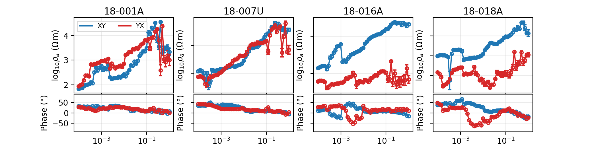

Use this when you want a quick visual sweep of several stations. It is
not meant to show every tensor component or tipper row. For that, use
``plot_raw_sites_1d`` or ``plot_response_tipper``.

Choose Rho Or Impedance Magnitude
---------------------------------

Most field reports use apparent resistivity, but sometimes you need to
look directly at impedance magnitude. Set ``quantity="impedance"`` to
plot ``log10(abs(Z))`` instead of ``log10(rho_a)``.

.. code-block:: python
   :linenos:

   from pycsamt.emtools import plot_sites_panels

   fig = plot_sites_panels(
       "data/AMT/WILLY_DATA/L18PLT",
       stations=["18-001A", "18-016A"],
       components=("xx", "xy", "yx", "yy"),
       quantity="impedance",
       phase_range=(-180.0, 180.0),
       ncols=2,
       show_legend=True,
   )

   fig.savefig("impedance_magnitude_panels.png", dpi=200)

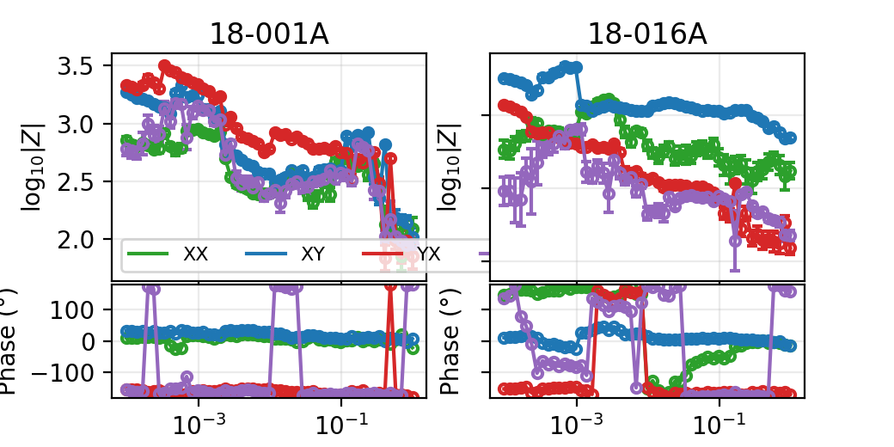

Use ``quantity="impedance"`` for tensor debugging, instrument checks,
or comparison with diagnostics that work directly with ``Z``. Use
``quantity="rhoa"`` for ordinary geophysical response plots.

Phase Range And X Axis
----------------------

The high-level panel function has explicit ``x_axis`` and
``phase_range`` arguments.

.. code-block:: python
   :linenos:

   from pycsamt.emtools import plot_sites_panels

   fig = plot_sites_panels(
       "data/AMT/WILLY_DATA/L18PLT",
       stations=["18-001A", "18-007U"],
       components=("xy", "yx"),
       x_axis="frequency",
       phase_range=(0.0, 360.0),
       ylim_phase=(0.0, 360.0),
       ncols=2,
   )

   fig.savefig("frequency_axis_phase_0_360.png", dpi=200)

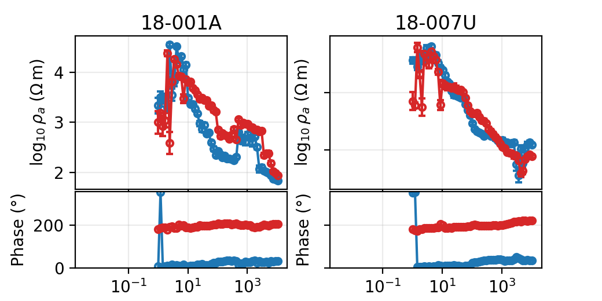

Use ``phase_range=None`` when you want to show the raw phase values
without wrapping. Use an explicit range when comparing stations whose
phase should share a common display convention.

Raw Full-Tensor Panels
----------------------

``plot_raw_sites_1d`` is designed for raw or nearly raw response review.
Each station is a group. Each selected component becomes a column. Each
component column contains rho above phase.

.. code-block:: python
   :linenos:

   import matplotlib.pyplot as plt

   from pycsamt.emtools import ensure_sites, plot_raw_sites_1d

   survey = ensure_sites("data/AMT/WILLY_DATA/L18PLT", strict=True)

   fig = plot_raw_sites_1d(
       survey,
       stations=["18-001A", "18-007U", "18-016A"],
       components=("xx", "xy", "yx", "yy"),
       raw=True,
       force_style=False,
       ncols_groups=3,
       show_error_bars=True,
       show_component_legend=True,
   )

   fig.savefig("raw_full_tensor_panels.png", dpi=200)
   plt.close(fig)

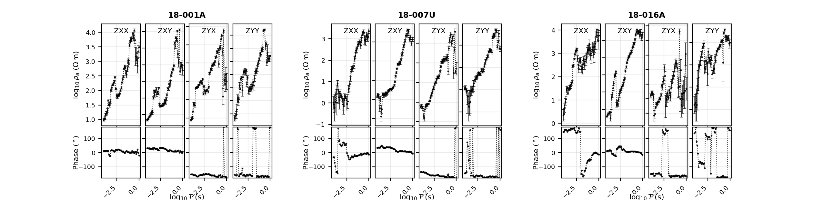

With ``raw=True`` the function uses the package raw-data style, which
is deliberately plain. In tests this style is black by default. That is
useful for first QC because the display does not imply interpretation
by colour.

Force Component Colours
-----------------------

After the raw diagnostic pass, use ``force_style=True`` to restore the
usual component colours while keeping the same layout.

.. code-block:: python
   :linenos:

   from pycsamt.emtools import plot_raw_sites_1d

   fig = plot_raw_sites_1d(
       "data/AMT/WILLY_DATA/L18PLT",
       stations=["18-001A", "18-007U", "18-016A"],
       components=("xy", "yx"),
       raw=True,
       force_style=True,
       ncols_groups=3,
   )

   fig.savefig("raw_panels_component_colours.png", dpi=200)

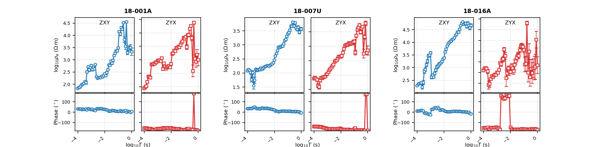

This is a good second view: first look for obvious raw-data problems in
plain black, then re-render with component colours when you want to
compare modes quickly.

Shared Labels Or Axis Labels
----------------------------

``plot_raw_sites_1d`` can use shared group labels or repeated axis
labels. Shared labels are more compact for dense reports. Axis labels
are sometimes easier during debugging.

.. code-block:: python
   :linenos:

   from pycsamt.emtools import plot_raw_sites_1d

   fig_shared = plot_raw_sites_1d(
       "data/AMT/WILLY_DATA/L18PLT",
       stations=["18-001A"],
       components=("xx", "xy", "yx", "yy"),
       label_mode="shared",
       show_component_legend=False,
       ncols_groups=1,
       figsize_scale=(8.0, 4.0),
   )
   fig_shared.subplots_adjust(left=0.20)
   fig_shared.savefig("raw_shared_labels.png", dpi=200)

   fig_axis = plot_raw_sites_1d(
       "data/AMT/WILLY_DATA/L18PLT",
       stations=["18-001A"],
       components=("xx", "xy"),
       label_mode="axis",
       show_component_legend=False,
       ncols_groups=1,
       figsize_scale=(6.0, 4.0),
   )
   fig_axis.savefig("raw_axis_labels.png", dpi=200)

.. grid:: 1 1 2 2
   :gutter: 2

   .. grid-item::

      .. image:: ../../images/user_guide/emtools/user-guide-emtools-plot-07-01.png
         :width: 100%

   .. grid-item::

      .. image:: ../../images/user_guide/emtools/user-guide-emtools-plot-07-02.png
         :width: 100%

``label_mode="shared"`` puts station and axis labels at the group
level. ``label_mode="axis"`` repeats labels on axes and rotates bottom
ticks more aggressively.

Use Display Control
-------------------

``plot_raw_sites_1d`` and ``plot_response_tipper`` read display policy
from ``PYCSAMT_CONTROL`` unless you pass a specific control object. This
is how you change x-axis convention, phase wrapping, and rho display
consistently.

.. code-block:: python
   :linenos:

   import matplotlib.pyplot as plt

   from pycsamt.api.control import PYCSAMT_CONTROL
   from pycsamt.emtools import plot_raw_sites_1d

   with PYCSAMT_CONTROL.context(
       x__view="frequency",
       rho__view="linear",
       phase__range=(0.0, 360.0),
   ):
       fig = plot_raw_sites_1d(
           "data/AMT/WILLY_DATA/L18PLT",
           stations=["18-001A"],
           components=("xy", "yx"),
           label_mode="axis",
           force_style=True,
           show_component_legend=False,
           ncols_groups=1,
           figsize_scale=(6.0, 4.0),
       )

   fig.savefig("raw_panels_frequency_linear_rho.png", dpi=200)
   plt.close(fig)

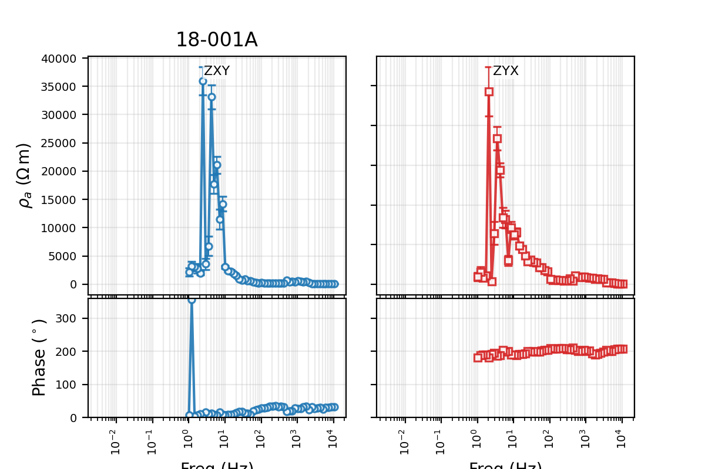

Use this pattern when one report needs a consistent non-default display
style. It is better than editing labels or axes after the fact.

Response Plus Tipper
--------------------

``plot_response_tipper`` adds tipper rows to the impedance response
layout. Use it for MT surveys that actually contain vertical-field
data. It is not useful for AMT/CSAMT lines where all stations lack
tipper.

.. code-block:: python
   :linenos:

   import matplotlib.pyplot as plt

   from pycsamt.emtools import ensure_sites, plot_response_tipper

   survey = ensure_sites("data/MT/kap03lmt_edis", strict=True)

   fig = plot_response_tipper(
       survey,
       stations=["kap103", "kap142", "kap151"],
       components=("xy", "yx"),
       tipper_components=("tx", "ty"),
       tipper_span_group=True,
       ylim_tipper=(-2.5, 2.5),
       ncols_groups=3,
   )

   fig.savefig("kap03_response_tipper.png", dpi=200)
   plt.close(fig)

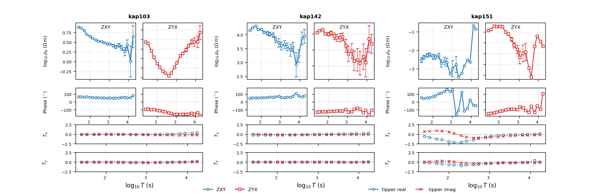

When ``tipper_span_group=True``, each tipper row spans the station
group. This is often the clearest layout when you have only two
impedance components and want tipper to read as a station-level
property.

Compact Tipper Rows
-------------------

Set ``tipper_span_group=False`` when you prefer a compact repeated
layout where the tipper rows sit under each component column.

.. code-block:: python
   :linenos:

   from pycsamt.emtools import plot_response_tipper

   fig = plot_response_tipper(
       "data/MT/kap03lmt_edis",
       stations=["kap151"],
       components=("xx", "xy", "yx", "yy"),
       tipper_components=("tx", "ty"),
       tipper_span_group=False,
       show_tipper_error_bars=False,
       show_component_legend=False,
       ncols_groups=1,
       figsize_scale=(7.2, 5.6),
       shared_x_label_pad=0.11,
   )

   fig.savefig("kap151_response_tipper_compact.png", dpi=200, bbox_inches="tight")

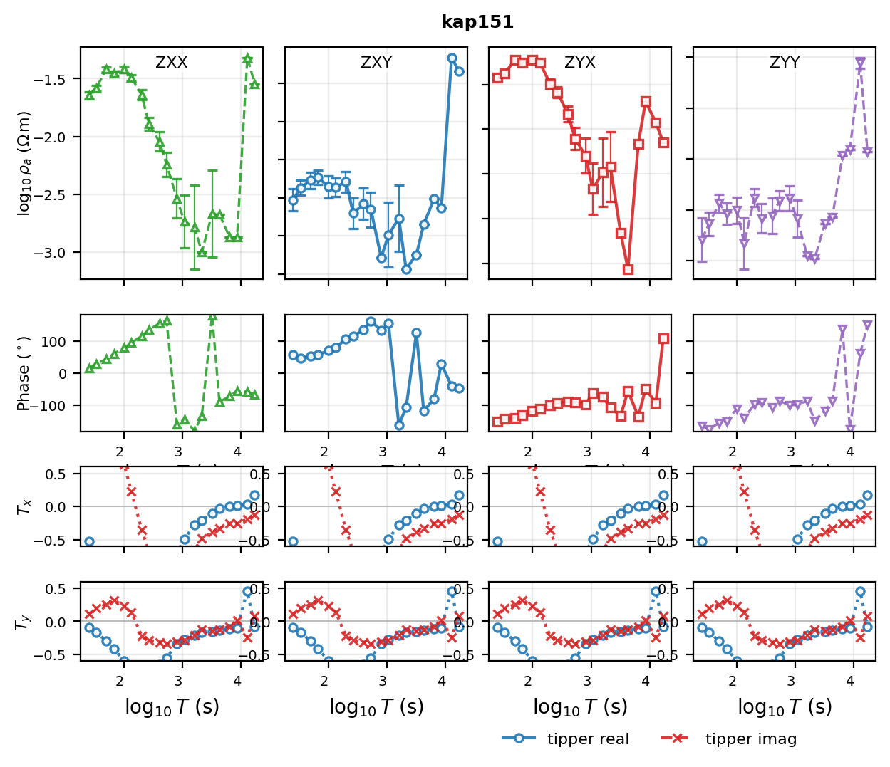

Use the compact layout for one or two stations. Use the spanning layout
when comparing several stations and you want fewer small axes.

Before And After Comparison
---------------------------

``plot_sites_compare`` pairs stations from two datasets. The usual use
is raw versus processed, before versus after static-shift correction, or
original versus smoothed.

.. code-block:: python
   :linenos:

   import matplotlib.pyplot as plt

   from pycsamt.emtools import ensure_sites, plot_sites_compare, smooth_mavg

   raw = ensure_sites("data/AMT/WILLY_DATA/L18PLT", strict=True)
   smoothed = smooth_mavg(raw, k=5)

   fig = plot_sites_compare(
       raw,
       smoothed,
       stations=["18-001A", "18-007U", "18-016A"],
       components=("xy", "yx"),
       labels=("raw", "smoothed k=5"),
       quantity="rhoa",
       x_axis="period",
       ncols_groups=3,
       show_legend=True,
   )

   fig.savefig("raw_vs_smoothed_compare.png", dpi=200)
   plt.close(fig)

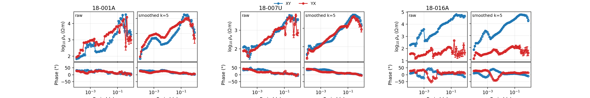

The function pairs stations by station name. If the second dataset is
missing a station, the corresponding after-column is blank.

Compare Impedance Instead Of Rho
--------------------------------

The comparison view can also use ``quantity="impedance"``. This is
helpful when a processing step changes the complex tensor directly and
you want to avoid hiding that change behind apparent-resistivity
conversion.

.. code-block:: python
   :linenos:

   from pycsamt.emtools import ensure_sites, plot_sites_compare, smooth_mavg

   raw = ensure_sites("data/AMT/WILLY_DATA/L18PLT", strict=True)
   processed = smooth_mavg(raw, k=3)

   fig = plot_sites_compare(
       raw,
       processed,
       stations=["18-001A", "18-016A"],
       components=("xx", "xy", "yx", "yy"),
       quantity="impedance",
       phase_range=(-180.0, 180.0),
       labels=("raw", "processed"),
       ncols_groups=2,
   )

   fig.savefig("impedance_before_after.png", dpi=200)

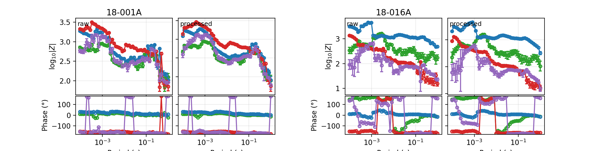

Use fixed ``ylim_rhoa`` and ``ylim_phase`` when the before/after
comparison needs exact visual scale matching across multiple figures.

Measured Versus Predicted Fit Grid
----------------------------------

``plot_sites_fit_grid`` is built for inversion QC. It pairs measured
and predicted stations by name, aligns predicted values onto measured
frequencies, plots both curves, and writes an RMS value in each
component panel.

.. code-block:: python
   :linenos:

   import matplotlib.pyplot as plt

   from pycsamt.emtools import ensure_sites, plot_sites_fit_grid, smooth_mavg

   measured = ensure_sites("data/AMT/WILLY_DATA/L18PLT", strict=True)

   # Demonstration only: a smoothed copy stands in for predicted data.
   # In production, pass forward-model or inversion-response EDI files.
   predicted = smooth_mavg(measured, k=5)

   fig = plot_sites_fit_grid(
       measured,
       predicted,
       stations=["18-001A", "18-016A"],
       components=("xy", "yx"),
       quantity="rhoa",
       phase_range=(-180.0, 180.0),
       ncols_groups=2,
       show_mode_legend=True,
   )

   fig.savefig("measured_vs_predicted_fit_grid.png", dpi=200)
   plt.close(fig)

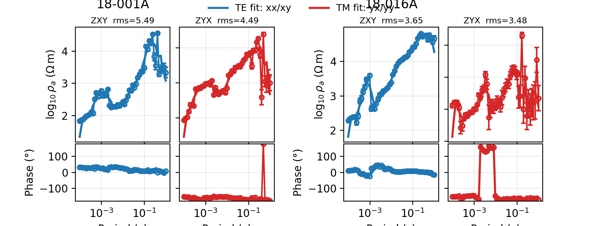

The RMS is computed from the measured-predicted residual. When measured
errors are available, the residual is weighted by the display-space
error estimate. That means an apparently small visual difference can
still produce a high RMS if the data errors are very small.

Understand TE And TM Fit Colours
--------------------------------

The fit grid uses separate fit colours for TE-like and TM-like
components:

* ``xx`` and ``xy`` use the TE fit colour;
* ``yx`` and ``yy`` use the TM fit colour.

.. code-block:: python
   :linenos:

   from pycsamt.emtools import ensure_sites, plot_sites_fit_grid, smooth_mavg

   measured = ensure_sites("data/AMT/WILLY_DATA/L18PLT", strict=True)
   predicted = smooth_mavg(measured, k=5)

   fig = plot_sites_fit_grid(
       measured,
       predicted,
       stations=["18-001A"],
       components=("xx", "xy", "yx", "yy"),
       color_fit_te="#2ca02c",
       color_fit_tm="#d62728",
       lw_fit=2.2,
       ls_fit="-",
       ncols_groups=1,
       figsize_scale=(8.0, 4.0),
       show_mode_legend=False,
   )

   fig.savefig("fit_grid_custom_fit_colours.png", dpi=200, bbox_inches="tight")

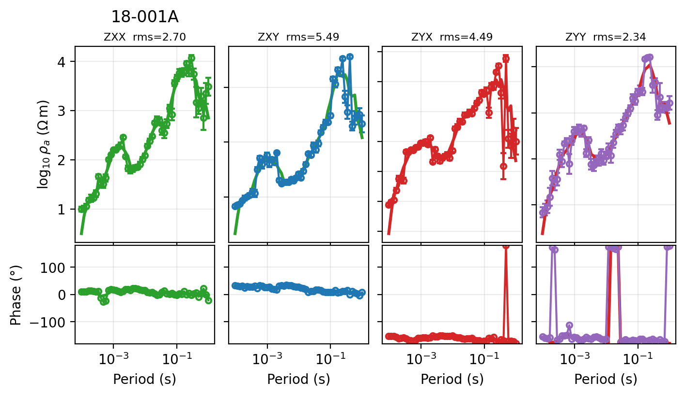

Use custom fit colours when assembling figures for publication or when
the default colours conflict with another report convention.

Choosing The Right Figure
-------------------------

Here is a practical decision path:

``I only need a quick rho/phase overview``
    Use ``plot_sites_panels`` with ``components=("xy", "yx")`` and a
    short station list.

``I want a raw tensor QC view``
    Use ``plot_raw_sites_1d`` with all four components and
    ``raw=True``.

``The survey has tipper and I need to inspect it with response curves``
    Use ``plot_response_tipper``. Confirm tipper exists with
    ``list_missing_sections`` or ``sites_summary`` first.

``I processed the data and need before/after panels``
    Use ``plot_sites_compare`` with the original and processed
    ``Sites`` objects.

``I have model predictions or inversion responses``
    Use ``plot_sites_fit_grid`` and read the RMS labels component by
    component.

Common Pitfalls
---------------

Too many stations in one figure
    Start with four to six stations. If you need every station, create
    multiple figures by station group.

Comparing figures with auto-scaled axes
    Use fixed ``ylim_rhoa`` and ``ylim_phase`` when the visual
    comparison matters.

Using tipper plots on AMT lines with no tipper
    The figure can still render, but it will not add useful
    interpretation. Check missing sections first.

Treating a smoothed dataset as a real prediction
    A smoothed copy is useful for demonstrating the plotting API, but
    it is not a forward-model response.

Ignoring display control
    If a report switches between period and frequency axes or between
    linear and log rho displays, use ``PYCSAMT_CONTROL.context`` so all
    plots share the same convention.

Save A Multi-Figure Plot Bundle
-------------------------------

The following script writes the core report figures for one line.

.. code-block:: python
   :linenos:

   from pathlib import Path

   import matplotlib.pyplot as plt

   from pycsamt.emtools import (
       ensure_sites,
       plot_raw_sites_1d,
       plot_sites_compare,
       plot_sites_fit_grid,
       plot_sites_panels,
       smooth_mavg,
   )

   out = Path("plot_report_l18plt")
   out.mkdir(parents=True, exist_ok=True)

   survey = ensure_sites("data/AMT/WILLY_DATA/L18PLT", strict=True)
   stations = ["18-001A", "18-007U", "18-016A", "18-018A"]
   processed = smooth_mavg(survey, k=5)

   fig = plot_sites_panels(
       survey,
       stations=stations,
       components=("xy", "yx"),
       ncols=4,
       show_legend=True,
   )
   fig.savefig(out / "station_panels.png", dpi=200)
   plt.close(fig)

   fig = plot_raw_sites_1d(
       survey,
       stations=stations[:3],
       components=("xx", "xy", "yx", "yy"),
       ncols_groups=3,
   )
   fig.savefig(out / "raw_full_tensor.png", dpi=200)
   plt.close(fig)

   fig = plot_sites_compare(
       survey,
       processed,
       stations=stations[:3],
       components=("xy", "yx"),
       labels=("raw", "smoothed"),
       ncols_groups=3,
   )
   fig.savefig(out / "raw_vs_smoothed.png", dpi=200)
   plt.close(fig)

   fig = plot_sites_fit_grid(
       survey,
       processed,
       stations=stations[:2],
       components=("xy", "yx"),
       ncols_groups=2,
   )
   fig.savefig(out / "fit_grid_smoothed_standin.png", dpi=200)
   plt.close(fig)

.. grid:: 1 1 2 2
   :gutter: 2

   .. grid-item::

      .. image:: ../../images/user_guide/emtools/user-guide-emtools-plot-15-01.png
         :width: 100%

   .. grid-item::

      .. image:: ../../images/user_guide/emtools/user-guide-emtools-plot-15-02.png
         :width: 100%

   .. grid-item::

      .. image:: ../../images/user_guide/emtools/user-guide-emtools-plot-15-03.png
         :width: 100%

   .. grid-item::

      .. image:: ../../images/user_guide/emtools/user-guide-emtools-plot-15-04.png
         :width: 100%

Worked Example
--------------

The gallery example demonstrates the same plotting layer on
bundled AMT and MT surveys, including a tipper-capable MT line and
display-control overrides.

Open the rendered gallery page here:
:ref:`sphx_glr_examples_emtools_plot_plot.py`.
