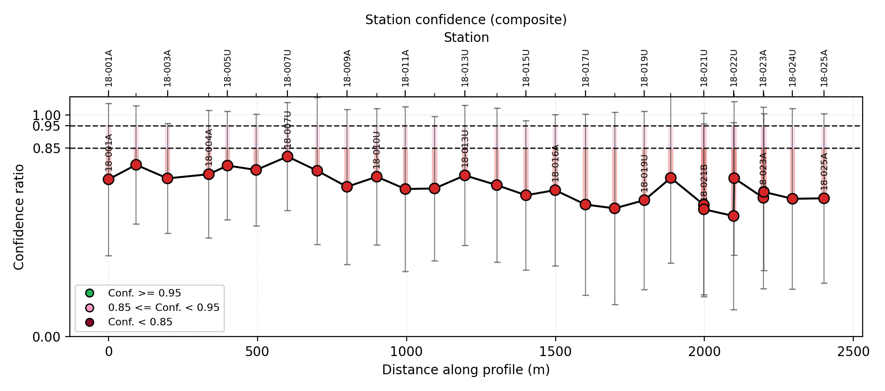
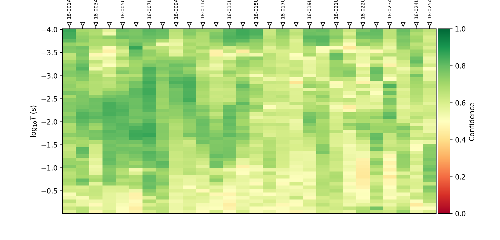
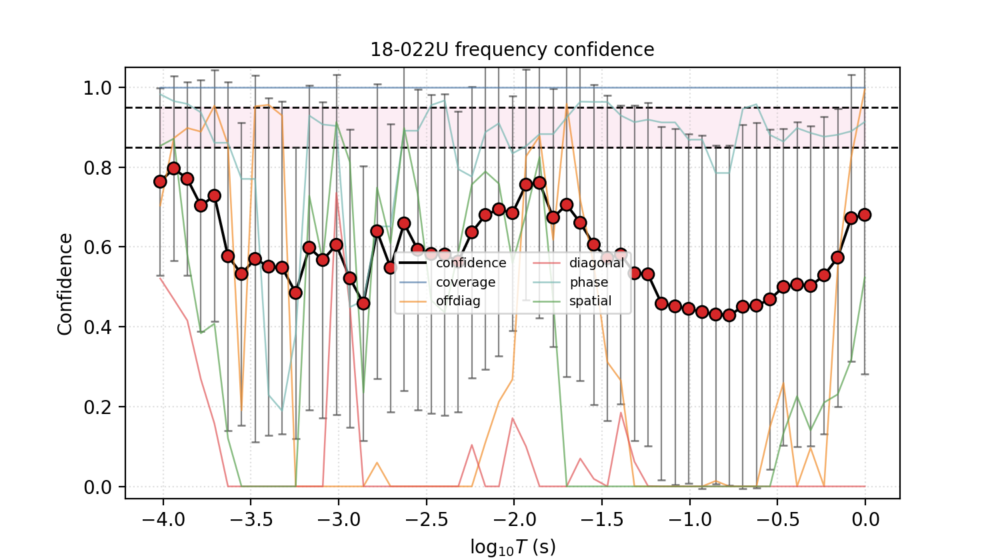
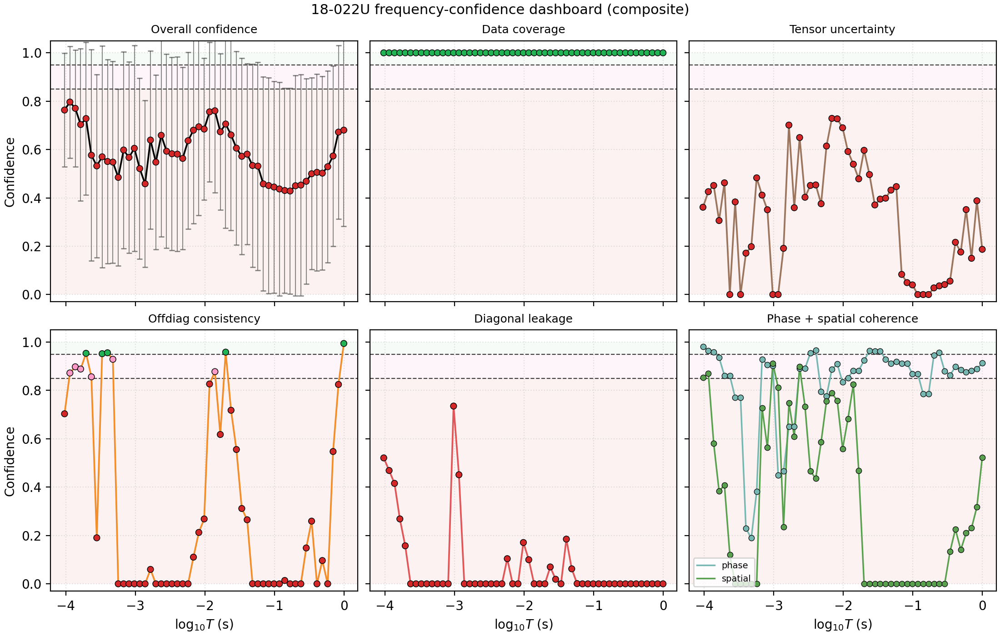
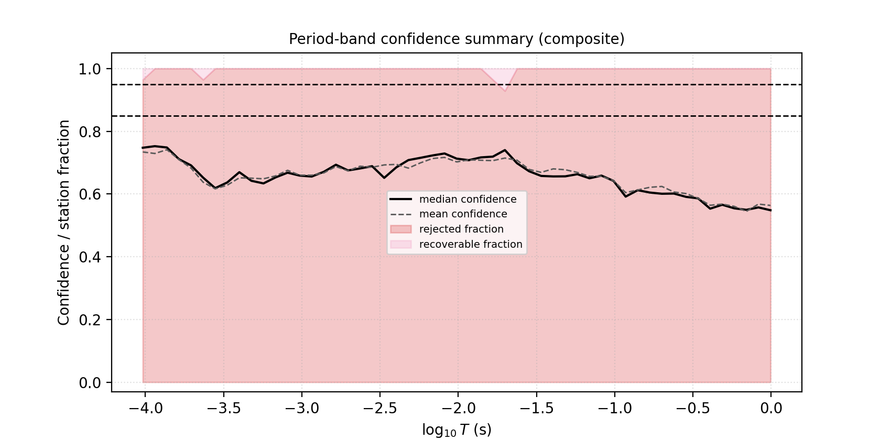
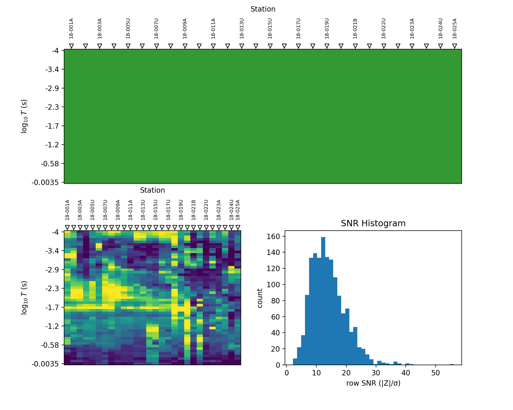
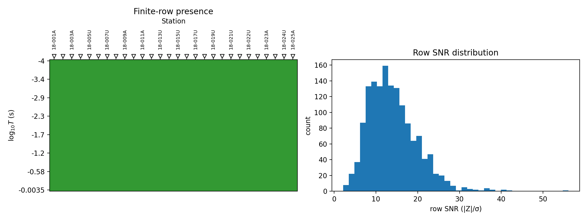
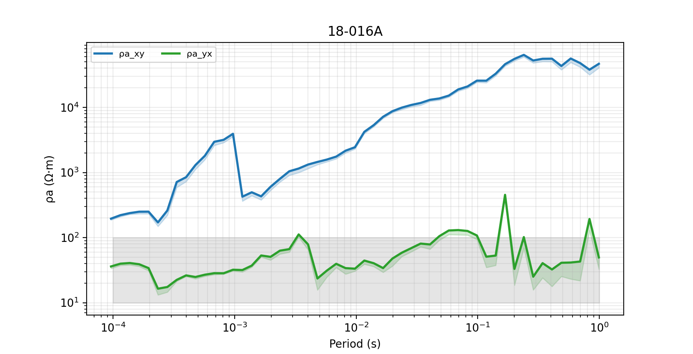
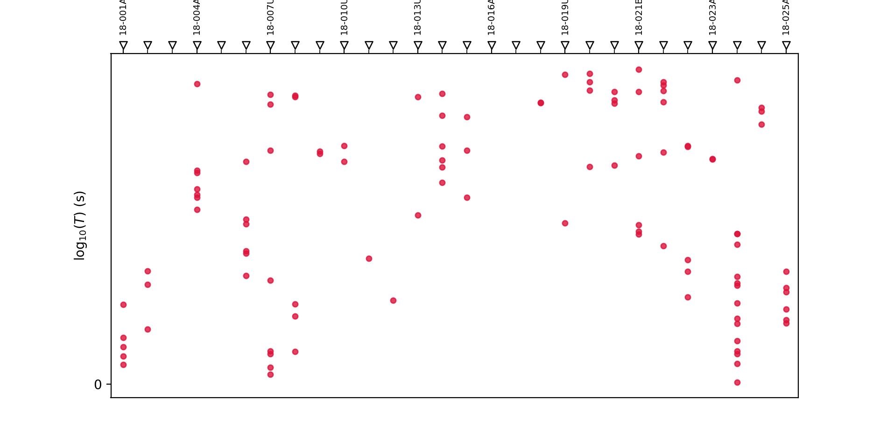

.. _emtools_qc:

Quality-Control Confidence Scoring
==================================

``pycsamt.emtools.qc`` turns transfer-function quality control into
tables and figures. It does two related jobs:

* summarize station-level data quality, coverage, SNR, tipper presence,
  and phase-tensor skew;
* compute confidence ratios from several finite, bounded scores so that
  stations and individual station-frequency samples can be ranked,
  plotted, masked, or down-weighted before inversion.

Full callable signatures live in the :doc:`API reference <../../api/emtools>`.
This page explains the confidence-ratio formulation, the table
workflow, the plotting workflow, and how confidence values should be
read in practice.

Why QC Is More Than Coverage
----------------------------

A station can be complete and still be questionable. ``frac_ok=1.0``
only says that impedance rows are finite. It does not say that the
off-diagonal modes agree, that diagonal leakage is small, that phase is
smooth, that uncertainty is low, or that the station is coherent with
its neighbours.

The QC module therefore separates three ideas:

``coverage``
    Are the required transfer-function rows finite?

``confidence``
    How trustworthy is a station or a station-frequency cell after
    combining coverage, uncertainty, tensor-shape, phase, and spatial
    criteria?

``flags``
    Which simple thresholds does a station or frequency cell fail?

Load A Survey
-------------

All QC functions accept the usual pyCSAMT inputs, but a reproducible
script should normalize once with ``ensure_sites``.

.. code-block:: python
   :linenos:

   from pathlib import Path

   from pycsamt.emtools import ensure_sites

   survey = ensure_sites(
       Path("data/AMT/WILLY_DATA/L18PLT"),
       recursive=True,
       on_dup="replace",
       strict=True,
       verbose=1,
   )

Use ``strict=True`` for reports and automated processing. Use
``strict=False`` in exploratory notebooks if you want empty plots to
render as "no data" messages.

The Confidence Ratio
--------------------

The composite confidence ratio is a weighted mean of available
component scores:

.. math::

   \mathrm{CR}_{i,f} =
   { \sum_k w_k s_{k,i,f}
     \mathbf{1}_{s_{k,i,f}\ \mathrm{finite}} \over
     \sum_k w_k
     \mathbf{1}_{s_{k,i,f}\ \mathrm{finite}} },
   \qquad 0 \le s_k \le 1.

Missing scores are ignored. Finite scores are clipped to ``[0, 1]``.
The default weights are:

.. list-table::
   :header-rows: 1
   :widths: 30 20 50

   * - Score
     - Weight
     - Meaning
   * - ``coverage``
     - ``0.35``
     - Finite impedance rows or components.
   * - ``uncertainty``
     - ``0.20``
     - Median relative impedance error.
   * - ``offdiag``
     - ``0.15``
     - Similarity of ``Zxy`` and ``Zyx`` amplitudes.
   * - ``diagonal``
     - ``0.10``
     - Penalty for diagonal leakage into off-diagonal response.
   * - ``phase``
     - ``0.10``
     - Penalty for abrupt off-diagonal phase jumps.
   * - ``spatial``
     - ``0.10``
     - Coherence with neighbouring stations.

The default confidence bands are:

* ``CR >= 0.95``: safe / retained;
* ``0.85 <= CR < 0.95``: recoverable or marginal;
* ``CR < 0.85``: reject, down-weight, or manually review.

Compute A Confidence Ratio Directly
-----------------------------------

Use ``confidence_ratio`` when you already have scores and want to apply
the same weighted formula used by the tables.

.. code-block:: python
   :linenos:

   from pycsamt.emtools.qc import confidence_ratio

   scores = {
       "coverage": 1.00,
       "uncertainty": 0.82,
       "offdiag": 0.76,
       "diagonal": 0.55,
       "phase": 0.90,
       "spatial": 0.88,
   }

   cr, cr_err = confidence_ratio(
       scores,
       n_freq=53,
       return_error=True,
   )

   print(f"CR={cr:.3f} +/- {cr_err:.3f}")

.. code-block:: text

   CR=0.861 +/- 0.141

``confidence_err`` is the spread of the available component scores. If
only one score is available, it falls back to
``sqrt(CR * (1 - CR) / n_freq)``.

Station QC Summary
------------------

``build_qc_table`` is the first station-level table. It reports the
number of frequencies, finite-row coverage, tipper availability, median
row SNR when ``z_err`` exists, period range, and optional phase-tensor
skew.

.. code-block:: python
   :linenos:

   from pycsamt.emtools import build_qc_table, ensure_sites

   survey = ensure_sites("data/AMT/WILLY_DATA/L18PLT", strict=True)

   qc = build_qc_table(
       survey,
       include_skew=True,
       api=False,
   )

   print(
       qc[
           [
               "station",
               "n_freq",
               "n_ok",
               "frac_ok",
               "n_tip",
               "snr_med",
               "pmin",
               "pmax",
               "skew_med",
           ]
       ].head()
   )

.. code-block:: text

      station  n_freq  n_ok  frac_ok  ...    snr_med      pmin      pmax   skew_med
   0  18-001A      53    53      1.0  ...  17.658396  0.000096  0.992063  50.326802
   1  18-002U      53    53      1.0  ...  16.687366  0.000096  0.992063  36.059416
   2  18-003A      53    53      1.0  ...  12.031672  0.000096  0.992063  31.245824
   3  18-004A      53    53      1.0  ...  10.430580  0.000096  0.992063  31.005169
   4  18-005U      53    53      1.0  ...  14.360341  0.000096  0.992063  36.404849

   [5 rows x 9 columns]

Read ``frac_ok`` as completeness, not as full confidence. Read
``snr_med`` as a row-level signal-to-error ratio when impedance error
tensors are available. Read ``skew_med`` as structural/tensor
complexity, not automatically as bad acquisition.

Station Flags
-------------

``qc_flags`` adds simple threshold labels to the station QC table.

.. code-block:: python
   :linenos:

   from pycsamt.emtools import qc_flags

   flags = qc_flags(
       "data/AMT/WILLY_DATA/L18PLT",
       min_frac_ok=0.60,
       min_snr_med=2.0,
       max_skew_med=6.0,
   )

   flagged = flags[flags["flags"] != ""]
   print(flagged[["station", "frac_ok", "snr_med", "skew_med", "flags"]])

.. code-block:: text

       station  frac_ok    snr_med   skew_med      flags
   0   18-001A      1.0  17.658396  50.326802  high_skew
   1   18-002U      1.0  16.687366  36.059416  high_skew
   2   18-003A      1.0  12.031672  31.245824  high_skew
   3   18-004A      1.0  10.430580  31.005169  high_skew
   4   18-005U      1.0  14.360341  36.404849  high_skew
   5   18-006A      1.0  13.272516  30.359830  high_skew
   6   18-007U      1.0  14.556106  34.174772  high_skew
   7   18-008U      1.0  15.890594  40.862593  high_skew
   8   18-009A      1.0  14.084767  25.288856  high_skew
   9   18-010U      1.0  13.677553  26.006304  high_skew
   10  18-011A      1.0  12.575896  27.534040  high_skew
   11  18-012A      1.0  12.873938  32.307319  high_skew
   12  18-013U      1.0  11.944265  29.705384  high_skew
   13  18-014A      1.0  14.847554  35.458520  high_skew
   14  18-015U      1.0  13.456819  22.459269  high_skew
   15  18-016A      1.0  14.746954  23.525350  high_skew
   16  18-017U      1.0  13.951389  22.912833  high_skew
   17  18-018A      1.0  19.352988  66.547818  high_skew
   18  18-019U      1.0  14.483638  61.945234  high_skew
   19  18-020A      1.0  18.506868  45.332864  high_skew
   20  18-021B      1.0   9.339868  52.388774  high_skew
   21  18-021U      1.0  14.119590  55.017266  high_skew
   22  18-022U      1.0   8.557456  65.349813  high_skew
   23  18-022V      1.0  11.268011  66.787861  high_skew
   24  18-023A      1.0   9.854384  67.022970  high_skew
   25  18-023V      1.0  12.137127  59.306877  high_skew
   26  18-024U      1.0   8.987776  63.853268  high_skew
   27  18-025A      1.0  11.770850  55.354566  high_skew

Possible station flags include ``low_coverage``, ``low_snr``, and
``high_skew``. A high-skew flag can be a real structural signal. It
does not mean the station should automatically be deleted.

Presence Confidence Versus Composite Confidence
-----------------------------------------------

``station_confidence_table`` has two modes. ``method="presence"`` is
coverage-only. ``method="composite"`` combines all available component
scores.

.. code-block:: python
   :linenos:

   from pycsamt.emtools import station_confidence_table

   presence = station_confidence_table(
       "data/AMT/WILLY_DATA/L18PLT",
       method="presence",
       api=False,
   )
   composite = station_confidence_table(
       "data/AMT/WILLY_DATA/L18PLT",
       method="composite",
       api=False,
   )

   print("presence range")
   print(presence["confidence"].min(), presence["confidence"].max())

   print("composite range")
   print(composite["confidence"].min(), composite["confidence"].max())

   ranked = composite.sort_values("confidence")
   print(ranked[["station", "confidence", "coverage", "uncertainty",
                 "offdiag", "diagonal", "phase", "spatial"]].head())

.. code-block:: text

   presence range
   1.0 1.0
   composite range
   0.5440199944767435 0.8119223880398303
       station  confidence  coverage  ...  diagonal     phase   spatial
   22  18-022U    0.544020       1.0  ...  0.000000  0.941638  0.000000
   21  18-021U    0.570986       1.0  ...  0.000000  0.938165  0.000000
   17  18-018A    0.578410       1.0  ...  0.086979  0.957546  0.000000
   16  18-017U    0.595479       1.0  ...  0.261699  0.969783  0.038160
   18  18-019U    0.615292       1.0  ...  0.000000  0.959348  0.541804

   [5 rows x 8 columns]

If presence confidence is high everywhere but composite confidence
varies, the survey is complete but not equally trustworthy everywhere.
That is common in real EM data.

Customize Confidence Weights
----------------------------

Use custom weights when a project has a clear processing policy. For
example, inversion preparation may emphasize uncertainty and coverage,
while structural interpretation may care more about off-diagonal and
spatial coherence.

.. code-block:: python
   :linenos:

   from pycsamt.emtools import station_confidence_table

   weights = {
       "coverage": 0.40,
       "uncertainty": 0.30,
       "offdiag": 0.10,
       "diagonal": 0.05,
       "phase": 0.05,
       "spatial": 0.10,
   }

   table = station_confidence_table(
       "data/AMT/WILLY_DATA/L18PLT",
       method="composite",
       weights=weights,
       relerr_threshold=0.25,
       offdiag_tolerance_log10=0.40,
       diagonal_leakage_max=0.40,
       phase_jump_tolerance_deg=90.0,
       spatial_tolerance_log10=0.60,
       api=False,
   )

   print(table.sort_values("confidence").head())

.. code-block:: text

       station  distance_m  confidence  ...  diagonal     phase   spatial
   22  18-022U      4400.0    0.630495  ...  0.000000  0.941638  0.000000
   21  18-021U      4200.0    0.659512  ...  0.000000  0.938165  0.000000
   17  18-018A      3400.0    0.666682  ...  0.201107  0.957546  0.000000
   16  18-017U      3200.0    0.672222  ...  0.353986  0.969783  0.038160
   14  18-015U      2800.0    0.708737  ...  0.514479  0.965328  0.575751

   [5 rows x 13 columns]

Changing thresholds changes the meaning of the scores. Record custom
weights and thresholds in reports so another user can reproduce your
confidence classes.

Frequency-Level Confidence
--------------------------

``frequency_confidence_table`` returns one row per station-frequency
sample. This is the table to use for period-band decisions, masks, and
inversion down-weighting.

.. code-block:: python
   :linenos:

   from pycsamt.emtools import frequency_confidence_table

   freq_qc = frequency_confidence_table(
       "data/AMT/WILLY_DATA/L18PLT",
       method="composite",
       ci_hi=0.95,
       ci_lo=0.85,
       api=False,
   )

   print(freq_qc.columns.tolist())
   print(freq_qc[["station", "frequency_hz", "period_s",
                  "confidence", "flags"]].head())

   rejected = freq_qc[freq_qc["flags"].str.contains("reject", na=False)]
   print("rejected cells:", len(rejected))

.. code-block:: text

   ['station', 'station_index', 'distance_m', 'frequency_hz', 'period_s', 'log10_period', 'confidence', 'confidence_err', 'method', 'n_components', 'coverage', 'uncertainty', 'offdiag', 'diagonal', 'phase', 'spatial', 'logrho_proxy', 'flags']
      station  ...                                              flags
   0  18-001A  ...  recoverable,high_error,offdiag_mismatch,diagon...
   1  18-001A  ...  reject,high_error,offdiag_mismatch,diagonal_le...
   2  18-001A  ...  reject,high_error,offdiag_mismatch,diagonal_le...
   3  18-001A  ...  reject,high_error,offdiag_mismatch,diagonal_le...
   4  18-001A  ...  reject,high_error,offdiag_mismatch,diagonal_le...

   [5 rows x 5 columns]
   rejected cells: 1479

Frequency flags can include ``reject``, ``recoverable``, ``missing``,
``high_error``, ``offdiag_mismatch``, ``diagonal_leakage``,
``phase_jump``, and ``spatial_outlier``.

Build A Mask From Confidence
----------------------------

The QC module does not force one masking policy. You can build one from
the confidence table.

.. code-block:: python
   :linenos:

   from pycsamt.emtools import frequency_confidence_table

   table = frequency_confidence_table(
       "data/AMT/WILLY_DATA/L18PLT",
       method="composite",
       ci_lo=0.85,
       api=False,
   )

   keep = table["confidence"] >= 0.85
   review = (table["confidence"] >= 0.70) & (table["confidence"] < 0.85)
   drop = table["confidence"] < 0.70

   print("keep:", int(keep.sum()))
   print("review:", int(review.sum()))
   print("drop:", int(drop.sum()))

.. code-block:: text

   keep: 5
   review: 528
   drop: 951

Use a review band instead of a hard delete when the flagged frequencies
line up with known structural complexity. Low confidence is a prompt
for inspection, not always proof of bad data.

Station Confidence Profile
--------------------------

``plot_confidence_profile`` plots station confidence along the line. It
uses green, pink, and red markers for safe, recoverable, and rejected
stations.

.. code-block:: python
   :linenos:

   import matplotlib.pyplot as plt

   from pycsamt.emtools import plot_confidence_profile

   fig, ax = plt.subplots(figsize=(9.5, 4.2))
   plot_confidence_profile(
       "data/AMT/WILLY_DATA/L18PLT",
       method="composite",
       ci_hi=0.95,
       ci_lo=0.85,
       shade_mode="score",
       station_label_step=2,
       show_errorbars=True,
       ax=ax,
   )

   fig.tight_layout()
   fig.savefig("confidence_profile_l18plt.png", dpi=200)
   plt.close(fig)

If no station coordinate metadata are available, distance falls back to
regular spacing controlled by ``spacing_m``.

Frequency Confidence Pseudo-Section
-----------------------------------

``plot_frequency_confidence_psection`` shows confidence by station and
period. It can plot any metric column from the frequency table, not only
``confidence``.

.. code-block:: python
   :linenos:

   import matplotlib.pyplot as plt

   from pycsamt.emtools import plot_frequency_confidence_psection

   fig, ax = plt.subplots(figsize=(10.0, 4.8))
   plot_frequency_confidence_psection(
       "data/AMT/WILLY_DATA/L18PLT",
       method="composite",
       metric="confidence",
       station_label_step=2,
       ax=ax,
   )

   fig.savefig("frequency_confidence_psection.png", dpi=200)
   plt.close(fig)

Change ``metric`` to ``"uncertainty"``, ``"offdiag"``,
``"diagonal"``, ``"phase"``, or ``"spatial"`` to see which component
is driving low confidence.

Single-Station Spectrum
-----------------------

``plot_station_confidence_spectrum`` overlays the overall confidence
curve and component scores for one station.

.. code-block:: python
   :linenos:

   import matplotlib.pyplot as plt

   from pycsamt.emtools import plot_station_confidence_spectrum

   fig, ax = plt.subplots(figsize=(7.5, 4.2))
   plot_station_confidence_spectrum(
       "data/AMT/WILLY_DATA/L18PLT",
       station="18-022U",
       method="composite",
       ax=ax,
   )

   fig.savefig("station_confidence_spectrum_18-022U.png", dpi=200)
   plt.close(fig)

Use this plot when you know a station is weak and want to see whether
the problem comes from uncertainty, diagonal leakage, off-diagonal
mismatch, phase jumps, or spatial incoherence.

Single-Station Dashboard
------------------------

``plot_station_confidence_dashboard`` breaks the same information into
separate panels. It is easier to read than the overlaid spectrum when
many score components overlap.

.. code-block:: python
   :linenos:

   import matplotlib.pyplot as plt

   from pycsamt.emtools import plot_station_confidence_dashboard

   fig = plot_station_confidence_dashboard(
       "data/AMT/WILLY_DATA/L18PLT",
       station="18-022U",
       method="composite",
       ci_hi=0.95,
       ci_lo=0.85,
       figsize=(11.0, 7.0),
   )

   fig.savefig("station_confidence_dashboard_18-022U.png", dpi=200)
   plt.close(fig)

Use dashboards for station-by-station review before deciding whether a
low-confidence station should be edited, down-weighted, or retained.

Period-Band Summary
-------------------

``plot_confidence_band_summary`` collapses the frequency table by
period. It plots median and mean confidence and shades the fraction of
stations in rejected or recoverable bands.

.. code-block:: python
   :linenos:

   import matplotlib.pyplot as plt

   from pycsamt.emtools import plot_confidence_band_summary

   fig, ax = plt.subplots(figsize=(8.5, 4.2))
   plot_confidence_band_summary(
       "data/AMT/WILLY_DATA/L18PLT",
       method="composite",
       ci_hi=0.95,
       ci_lo=0.85,
       ax=ax,
   )

   fig.savefig("confidence_band_summary.png", dpi=200)
   plt.close(fig)

This view is useful when deciding whether a whole period band should be
edited, down-weighted, or treated cautiously.

Coverage And SNR Quicklook
--------------------------

``plot_qc_quicklook`` combines three first-pass plots: a presence
pseudo-section, an SNR pseudo-section, and an SNR histogram.

.. code-block:: python
   :linenos:

   import matplotlib.pyplot as plt

   from pycsamt.emtools.qc import plot_qc_quicklook

   fig = plot_qc_quicklook(
       "data/AMT/WILLY_DATA/L18PLT",
       figsize=(10.0, 8.0),
   )

   fig.savefig("qc_quicklook_l18plt.png", dpi=200)
   plt.close(fig)

If the SNR histogram says error tensors are not available, the survey
can still be inspected, but uncertainty-based scores will be missing
from the composite confidence ratio.

Coverage Pseudo-Section And SNR Histogram
-----------------------------------------

For more control, call the helper plots separately.

.. code-block:: python
   :linenos:

   import matplotlib.pyplot as plt

   from pycsamt.emtools.qc import plot_coverage_psection, plot_snr_hist

   fig, axes = plt.subplots(1, 2, figsize=(12.0, 4.5))

   plot_coverage_psection(
       "data/AMT/WILLY_DATA/L18PLT",
       metric="presence",
       ax=axes[0],
   )
   axes[0].set_title("Finite-row presence")

   plot_snr_hist(
       "data/AMT/WILLY_DATA/L18PLT",
       bins=40,
       ax=axes[1],
   )
   axes[1].set_title("Row SNR distribution")

   fig.tight_layout()
   fig.savefig("coverage_and_snr.png", dpi=200)
   plt.close(fig)

``metric="presence"`` shows finite rows. ``metric="snr"`` colours by
row SNR when ``z_err`` exists. ``metric="offdiag"`` shows an
off-diagonal amplitude proxy.

Consistency Fan
---------------

``plot_consistency_fan`` propagates impedance errors through apparent
resistivity by Monte Carlo sampling. It can compare ``xy`` and ``yx``
apparent-resistivity bands for one station.

.. code-block:: python
   :linenos:

   import matplotlib.pyplot as plt
   import numpy as np

   from pycsamt.emtools.qc import overlay_noise_cone, plot_consistency_fan

   fig, ax = plt.subplots(figsize=(8.8, 4.5))
   plot_consistency_fan(
       "data/AMT/WILLY_DATA/L18PLT",
       station="18-016A",
       comps=("xy", "yx"),
       pcts=(10.0, 50.0, 90.0),
       n_draws=300,
       ax=ax,
   )
   ax.set_yscale("log")

   period = np.logspace(-4, 0, 30)
   overlay_noise_cone(
       ax,
       period,
       lo=np.full(period.size, 10.0),
       hi=np.full(period.size, 100.0),
       color="0.5",
       alpha=0.20,
   )

   fig.savefig("consistency_fan_18-016A.png", dpi=200)
   plt.close(fig)

The noise cone overlay is a visual reference band. It is not estimated
by the QC module. Supply project-specific lower and upper bounds when
you use it in a report.

XY/YX Crossover Map
-------------------

``plot_xyyx_crossover_map`` marks periods where ``rho_xy`` and
``rho_yx`` swap which one is larger. It is a cheap anisotropy and
mode-consistency diagnostic.

.. code-block:: python
   :linenos:

   import matplotlib.pyplot as plt

   from pycsamt.emtools.qc import (
       overlay_spectral_holes,
       plot_xyyx_crossover_map,
   )

   fig, ax = plt.subplots(figsize=(9.5, 4.8))
   plot_xyyx_crossover_map(
       "data/AMT/WILLY_DATA/L18PLT",
       ax=ax,
   )
   overlay_spectral_holes(
       ax,
       "data/AMT/WILLY_DATA/L18PLT",
       thresh_dec=0.30,
   )

   fig.savefig("xy_yx_crossover_map.png", dpi=200)
   plt.close(fig)

``overlay_spectral_holes`` shades large gaps in log-period sampling on
top of a pseudo-section-style axis. Lower ``thresh_dec`` only when you
intentionally want to reveal small grid spacing differences.

Propagation To Inversion
------------------------

For MARE2DEM exports created from EDI data, CR-derived uncertainty
propagation can be enabled with:

.. code-block:: python
   :linenos:

   from pycsamt.models.mare2dem.edi import make_mt_data_from_edi

   make_mt_data_from_edi(
       "data/AMT/WILLY_DATA/L18PLT",
       "mare2dem_data_with_confidence.emdata",
       confidence_weighting=True,
   )

The effective relative impedance error is inflated as confidence
decreases:

.. math::

   \epsilon_{Z,\mathrm{eff}} =
   \epsilon_Z
   \left[{1 \over \max(\mathrm{CR}, \mathrm{CR}_{\min})}\right]^p .

The defaults are ``CR_min=0.05`` and ``p=1``. The usual propagation is
then:

.. math::

   \sigma_{\rho_a,\mathrm{eff}} =
   2\rho_a\,\epsilon_{Z,\mathrm{eff}},
   \qquad
   \sigma_{\phi,\mathrm{eff}} =
   {180 \over \pi}\epsilon_{Z,\mathrm{eff}} .

Confidence weighting should increase uncertainty for low-confidence
data. It should not make any datum artificially more precise.

Build A QC Report Bundle
------------------------

The following script writes station tables, frequency tables, and the
main QC figures for one line.

.. code-block:: python
   :linenos:

   from pathlib import Path

   import matplotlib.pyplot as plt

   from pycsamt.emtools import (
       build_qc_table,
       ensure_sites,
       frequency_confidence_table,
       plot_confidence_band_summary,
       plot_confidence_profile,
       plot_frequency_confidence_psection,
       qc_flags,
       station_confidence_table,
   )
   from pycsamt.emtools.qc import plot_qc_quicklook

   out = Path("qc_report_l18plt")
   out.mkdir(parents=True, exist_ok=True)

   survey = ensure_sites("data/AMT/WILLY_DATA/L18PLT", strict=True)

   build_qc_table(survey, api=False).to_csv(
       out / "station_qc_summary.csv",
       index=False,
   )
   qc_flags(survey).to_csv(out / "station_qc_flags.csv", index=False)
   station_confidence_table(survey, method="composite", api=False).to_csv(
       out / "station_confidence.csv",
       index=False,
   )
   frequency_confidence_table(survey, method="composite", api=False).to_csv(
       out / "frequency_confidence.csv",
       index=False,
   )

   fig, ax = plt.subplots(figsize=(9.5, 4.2))
   plot_confidence_profile(survey, method="composite", ax=ax)
   fig.tight_layout()
   fig.savefig(out / "confidence_profile.png", dpi=200)
   plt.close(fig)

   fig, ax = plt.subplots(figsize=(10.0, 4.8))
   plot_frequency_confidence_psection(survey, method="composite", ax=ax)
   fig.savefig(out / "frequency_confidence_psection.png", dpi=200)
   plt.close(fig)

   fig, ax = plt.subplots(figsize=(8.5, 4.2))
   plot_confidence_band_summary(survey, method="composite", ax=ax)
   fig.savefig(out / "confidence_band_summary.png", dpi=200)
   plt.close(fig)

   fig = plot_qc_quicklook(survey)
   fig.savefig(out / "qc_quicklook.png", dpi=200)
   plt.close(fig)

.. grid:: 1 1 2 2
   :gutter: 2

   .. grid-item::

      .. image:: ../../images/user_guide/emtools/user-guide-emtools-qc-19-01.png
         :width: 100%

   .. grid-item::

      .. image:: ../../images/user_guide/emtools/user-guide-emtools-qc-19-02.png
         :width: 100%

   .. grid-item::

      .. image:: ../../images/user_guide/emtools/user-guide-emtools-qc-19-03.png
         :width: 100%

   .. grid-item::

      .. image:: ../../images/user_guide/emtools/user-guide-emtools-qc-19-04.png
         :width: 100%

Reading QC Results
------------------

Use QC scores as evidence, not as an automatic delete button.

``coverage`` is low
    The station or frequency is genuinely incomplete. Investigate
    loading, editing, or acquisition gaps.

``uncertainty`` is low
    Error tensors are large relative to impedance magnitude. This is a
    strong reason to down-weight or review.

``offdiag`` is low
    ``Zxy`` and ``Zyx`` amplitudes disagree beyond the selected
    tolerance. Compare with anisotropy, impedance, and tensor tools.

``diagonal`` is low
    Diagonal leakage is high. Check dimensionality and coordinate
    orientation before calling it acquisition noise.

``phase`` is low
    Off-diagonal phase changes abruptly with frequency. Check frequency
    editing and processing history.

``spatial`` is low
    The station differs from neighbouring stations at the same frequency
    or in median response. Check station metadata and local geology.

Worked Example
--------------

The gallery example applies the station, frequency, profile,
dashboard, quicklook, fan, crossover, and hole-overlay workflows to the
bundled L18PLT survey.

Open the rendered gallery page here:
:ref:`sphx_glr_examples_emtools_plot_qc.py`.
