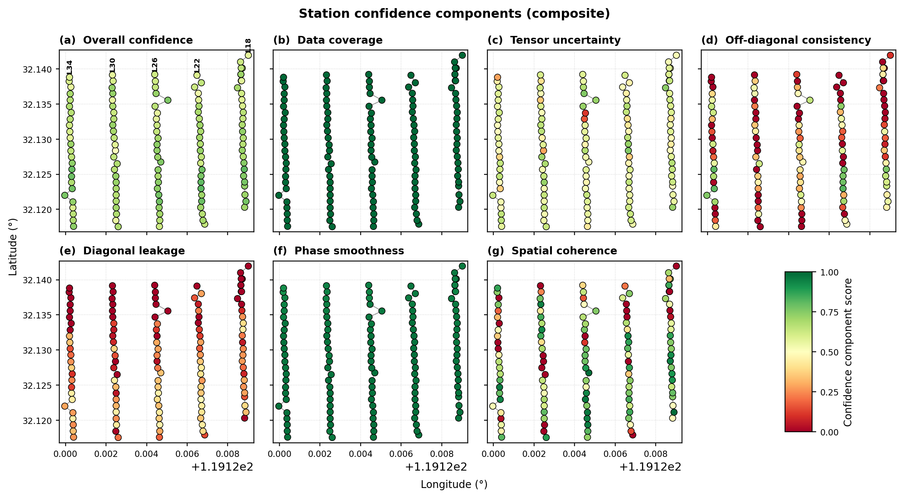
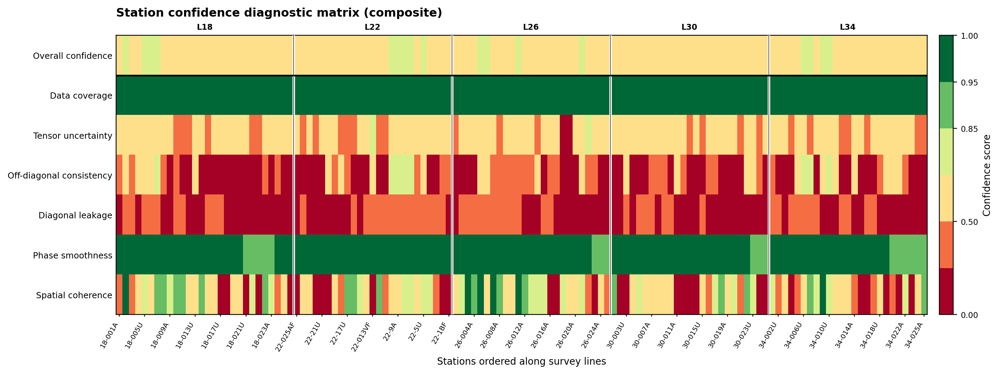
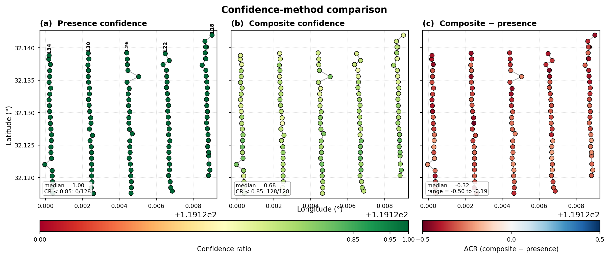
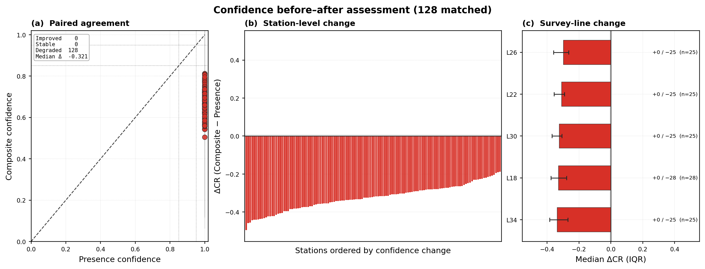
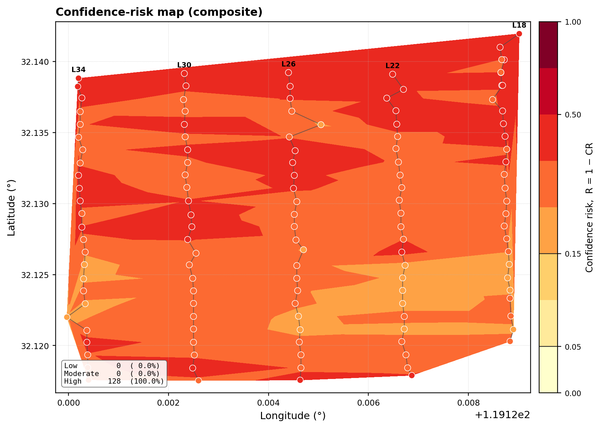
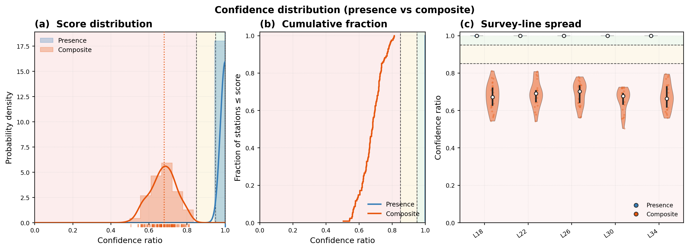
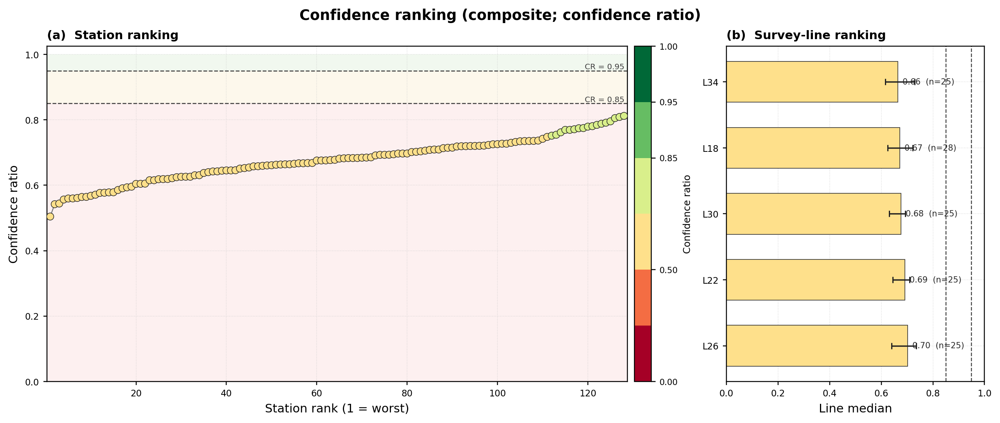
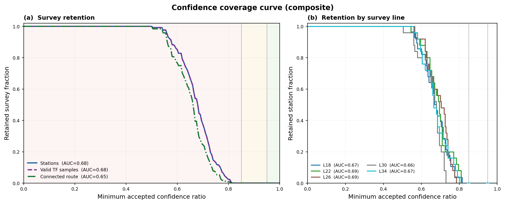

.. _emtools_qc:

Quality-Control Confidence Scoring
==================================

``pycsamt.emtools.qc`` turns transfer-function :term:`quality control`
into tables and figures. It does two related jobs:

* summarize station-level data quality, coverage, :term:`SNR`, tipper
  presence, and phase-tensor :term:`skew`;
* compute confidence ratios from several finite, bounded scores so that
  stations and individual station-frequency samples can be ranked,
  plotted, masked, or down-weighted before inversion.

Full callable signatures live in the :doc:`API reference <../../api/emtools>`.
This page explains the confidence-ratio formulation, the table
workflow, the plotting workflow, and how confidence values should be
read in practice. Every example below uses pyCSAMT's bundled
:term:`AMT` line, ``data/AMT/WILLY_DATA/L18PLT``, since all 28 stations
there carry real impedance-error tensors -- the ingredient several of
the component scores need.

Why QC Is More Than Coverage
----------------------------

A station can be complete and still be questionable. ``frac_ok=1.0``
only says that impedance rows are finite. It does not say that the
off-diagonal modes agree, that diagonal leakage is small, that phase is
smooth, that uncertainty is low, or that the station is coherent with
its neighbours.

The QC module therefore separates three ideas:

``coverage``
    Are the required transfer-function rows finite?

``confidence``
    How trustworthy is a station or a station-frequency cell after
    combining coverage, uncertainty, tensor-shape, phase, and spatial
    criteria?

``flags``
    Which simple thresholds does a station or frequency cell fail?

Load A Survey
-------------

All QC functions accept the usual pyCSAMT inputs, but a reproducible
script should normalize once with ``ensure_sites``.

.. code-block:: pycon

   >>> from pathlib import Path
   >>> from pycsamt.emtools import ensure_sites
   >>> survey = ensure_sites(
   ...     Path("data/AMT/WILLY_DATA/L18PLT"),
   ...     recursive=True,
   ...     on_dup="replace",
   ...     strict=True,
   ...     verbose=1,
   ... )

Use ``strict=True`` for reports and automated processing. Use
``strict=False`` in exploratory notebooks if you want empty plots to
render as "no data" messages.

The Confidence Ratio
--------------------

The composite confidence ratio is a weighted mean of available
component scores:

.. math::
   :label: eq-qc-composite-confidence

   \mathrm{CR}_{i,f} =
   \frac{\sum_{k\in\mathcal K} w_k s_{k,i,f}
     \mathbf{1}[s_{k,i,f}\ \mathrm{finite}]}
     {\sum_{k\in\mathcal K} w_k
     \mathbf{1}[s_{k,i,f}\ \mathrm{finite}]},
   \qquad 0 \le s_k \le 1.

Missing scores are ignored. Finite scores are clipped to ``[0, 1]``.
The default weights are:

.. list-table::
   :header-rows: 1
   :widths: 30 20 50

   * - Score
     - Weight
     - Meaning
   * - ``coverage``
     - ``0.35``
     - Finite impedance rows or components.
   * - ``uncertainty``
     - ``0.20``
     - Median relative impedance error.
   * - ``offdiag``
     - ``0.15``
     - Similarity of ``Zxy`` and ``Zyx`` amplitudes.
   * - ``diagonal``
     - ``0.10``
     - Penalty for diagonal leakage into off-diagonal response.
   * - ``phase``
     - ``0.10``
     - Penalty for abrupt off-diagonal phase jumps.
   * - ``spatial``
     - ``0.10``
     - Coherence with neighbouring stations.

Except for coverage, each component reduces the tensor to a
non-negative discrepancy :math:`m_k`, compares it with a positive
tolerance :math:`\tau_k`, and maps the result to a bounded trust score:

.. math::
   :label: eq-qc-linear-score

   s_k = \operatorname{clip}_{[0,1]}
   \left(1 - \frac{m_k}{\tau_k}\right).

A statistic of ``0`` scores a perfect ``1``; as :math:`m_k` grows toward
:math:`\tau_k` the score decays linearly to ``0`` and stays there beyond
it, so nothing is ever penalized twice or rewarded for being
implausibly clean. The coverage score is computed directly. For station
:math:`i` with :math:`N_i` frequencies and impedance tensor
:math:`Z_{i,f,ab}`, it is

.. math::
   :label: eq-qc-coverage-score

   s_{\mathrm{cov},i} = \frac{1}{N_i}
   \sum_f \mathbf{1}
   [Z_{i,f,xx},Z_{i,f,xy},Z_{i,f,yx},Z_{i,f,yy}\ \mathrm{finite}],

whereas a frequency cell uses the fraction of its four finite tensor
components. Thus station presence is deliberately strict: a row counts
only when the complete impedance tensor is finite.

The remaining discrepancies used in :eq:`eq-qc-linear-score` are

.. math::
   :label: eq-qc-component-discrepancies

   \begin{aligned}
   m_{\mathrm{unc}} &={\rm med}_{f,a,b}
      \frac{|Z_{{\rm err},i,f,ab}|}{|Z_{i,f,ab}|+\epsilon},\\
   m_{\mathrm{off}} &={\rm med}_{f}
      \left|\log_{10}\frac{|Z_{i,f,xy}|+\epsilon}
      {|Z_{i,f,yx}|+\epsilon}\right|,\\
   m_{\mathrm{diag}} &={\rm med}_{f}
      \frac{d_{i,f}}{d_{i,f}+o_{i,f}+\epsilon},\\
   d_{i,f} &={\rm med}(|Z_{i,f,xx}|,|Z_{i,f,yy}|),\qquad
   o_{i,f}={\rm med}(|Z_{i,f,xy}|,|Z_{i,f,yx}|),\\
   m_{\mathrm{phase}} &={\rm med}_{f,c\in\{xy,yx\}}
      |\Delta\,\operatorname{unwrap}(\arg Z_{i,f,c})|_{\rm deg}.
   \end{aligned}

Their tolerances are respectively ``relerr_threshold=0.20``,
``offdiag_tolerance_log10=0.35``, ``diagonal_leakage_max=0.35``, and
``phase_jump_tolerance_deg=90``. At the frequency level, the first three
statistics are evaluated on one row. The phase score uses the strongest
adjacent jump touching that row for each off-diagonal mode, followed by
the median across the available modes. The small :math:`\epsilon`
prevents division by zero and is numerical, not a tunable tolerance.

Spatial coherence first forms the log-response proxy

.. math::
   :label: eq-qc-spatial-proxy

   r_{i,f}=\frac{1}{2}\left[
   \log_{10}\left(\frac{|Z_{i,f,xy}|^2}{f}+\epsilon\right)+
   \log_{10}\left(\frac{|Z_{i,f,yx}|^2}{f}+\epsilon\right)\right].

At station level :math:`r_i={\rm med}_f(r_{i,f})`; at frequency level
:math:`r_{i,f}` is retained. The spatial discrepancy is

.. math::
   :label: eq-qc-spatial-score

   m_{\mathrm{sp},i,f}=
   \left|r_{i,f}-{\rm med}(r_{j,f}:j\in\mathcal N_i)\right|,
   \qquad \tau_{\mathrm{sp}}=0.60,

where :math:`\mathcal N_i` contains the immediately adjacent available
stations. The omitted physical constants cancel in this relative
logarithmic comparison; :math:`r` should therefore be read as a
resistivity-like proxy, not a reported apparent resistivity.

At station level the discrepancies summarize the frequency axis, which
is why ``station_confidence_table`` returns one score per station. At
frequency level the analogous local quantities are evaluated row by
row. Consequently, a coherent station aggregate can still contain weak
individual frequencies.

The default confidence bands are:

* ``CR >= 0.95``: safe under the default policy;
* ``0.85 <= CR < 0.95``: marginal or recoverable;
* ``CR < 0.85``: high-priority review or down-weighting candidate.

.. important::

   These are operational defaults, not universal geophysical laws. A low
   score can reflect genuine dimensionality or a sharp geological boundary.
   Inspect the component scores and response curves before deleting data.

Compute A Confidence Ratio Directly
-----------------------------------

Use ``confidence_ratio`` when you already have scores and want to apply
the same weighted formula used by the tables.

.. code-block:: pycon

   >>> from pycsamt.emtools.qc import confidence_ratio
   >>> scores = {
   ...     "coverage": 1.00,
   ...     "uncertainty": 0.82,
   ...     "offdiag": 0.76,
   ...     "diagonal": 0.55,
   ...     "phase": 0.90,
   ...     "spatial": 0.88,
   ... }
   >>> cr, cr_err = confidence_ratio(scores, n_freq=53, return_error=True)
   >>> print(f"CR={cr:.3f} +/- {cr_err:.3f}")
   CR=0.861 +/- 0.141

``confidence_err`` is not a formal statistical uncertainty on
:math:`\mathrm{CR}` -- it is a cheap, honest stand-in for one:

.. math::

   \sigma_{\mathrm{CR}} =
   \begin{cases}
   \mathrm{std}\bigl(\{s_k\}\bigr), & \text{two or more finite } s_k, \\[4pt]
   \sqrt{\mathrm{CR}\,(1 - \mathrm{CR}) / n_{\mathrm{freq}}}, & \text{otherwise.}
   \end{cases}

With six components on hand, as in the example above,
:math:`\sigma_{\mathrm{CR}}` is simply the population standard deviation
of ``{1.00, 0.82, 0.76, 0.55, 0.90, 0.88}``, which is exactly the
``0.141`` printed above -- the components disagree with each other, and
that disagreement *is* the reported uncertainty. When only one
component survives (most often ``coverage`` alone, when no error tensor
or neighbouring station exists to score against), there is nothing to
disagree with, so the formula falls back to the binomial-style standard
error :math:`\sqrt{\mathrm{CR}(1-\mathrm{CR})/n_{\mathrm{freq}}}` instead.

Station QC Summary
------------------

``build_qc_table`` is the first station-level table. It reports the
number of frequencies, finite-row coverage, tipper availability, median
row :term:`SNR` when ``z_err`` exists, period range, and optional
phase-tensor :term:`skew`.

.. code-block:: pycon

   >>> from pycsamt.emtools import build_qc_table, ensure_sites
   >>> survey = ensure_sites("data/AMT/WILLY_DATA/L18PLT", strict=True)
   >>> qc = build_qc_table(survey, include_skew=True, api=False)
   >>> qc[["station", "n_freq", "n_ok", "frac_ok", "n_tip", "snr_med", "pmin", "pmax", "skew_med"]].head()
      station  n_freq  n_ok  frac_ok  ...    snr_med      pmin      pmax   skew_med
   0  18-001A      53    53      1.0  ...  17.658396  0.000096  0.992063   4.809977
   1  18-002U      53    53      1.0  ...  16.687366  0.000096  0.992063   6.596544
   2  18-003A      53    53      1.0  ...  12.031672  0.000096  0.992063  11.018588
   3  18-004A      53    53      1.0  ...  10.430580  0.000096  0.992063  14.509282
   4  18-005U      53    53      1.0  ...  14.360341  0.000096  0.992063   9.171151
   <BLANKLINE>
   [5 rows x 9 columns]

Read ``frac_ok`` as completeness, not as full confidence. Read
``snr_med`` as a row-level signal-to-error ratio when impedance error
tensors are available. Read ``skew_med`` as structural/tensor
complexity, not automatically as bad acquisition -- it is the median
absolute :term:`phase tensor` asymmetry angle :math:`|\beta|` across a
station's frequencies, the same quantity the :term:`skew` glossary
entry defines.

Station Flags
-------------

``qc_flags`` adds simple threshold labels to the station QC table.

.. code-block:: pycon

   >>> from pycsamt.emtools import qc_flags
   >>> flags = qc_flags(
   ...     "data/AMT/WILLY_DATA/L18PLT",
   ...     min_frac_ok=0.60,
   ...     min_snr_med=2.0,
   ...     max_skew_med=6.0,
   ... )
   >>> flagged = flags[flags["flags"] != ""]
   >>> print(len(flagged), "of", len(flags), "stations flagged")
   27 of 28 stations flagged
   >>> flagged[["station", "frac_ok", "snr_med", "skew_med", "flags"]].head()
      station  frac_ok    snr_med   skew_med      flags
   1  18-002U      1.0  16.687366   6.596544  high_skew
   2  18-003A      1.0  12.031672  11.018588  high_skew
   3  18-004A      1.0  10.430580  14.509282  high_skew
   4  18-005U      1.0  14.360341   9.171151  high_skew
   5  18-006A      1.0  13.272516  12.375357  high_skew

Every station is fully covered (``frac_ok=1.0`` throughout) and every
station's median row SNR clears ``min_snr_med=2.0`` by a wide margin, so
``high_skew`` is the only flag this survey ever raises, and it raises it
for all but one station: only ``18-001A`` (``skew_med=4.81``) falls
under the default ``max_skew_med=6.0`` threshold, while the rest run
from ``6.60`` up past ``50`` degrees. That is not a data defect -- it is
a genuinely 2-D/3-D structural line, expressed through a threshold tuned
for near-1-D settings. Possible station flags include ``low_coverage``,
``low_snr``, and ``high_skew``. A high-skew flag can be a real
structural signal. It does not mean the station should automatically be
deleted.

Presence Confidence Versus Composite Confidence
-----------------------------------------------

``station_confidence_table`` has two modes. ``method="presence"`` is
coverage-only. ``method="composite"`` combines all available component
scores.

.. code-block:: pycon

   >>> from pycsamt.emtools import station_confidence_table
   >>> presence = station_confidence_table(
   ...     "data/AMT/WILLY_DATA/L18PLT",
   ...     method="presence",
   ...     api=False,
   ... )
   >>> composite = station_confidence_table(
   ...     "data/AMT/WILLY_DATA/L18PLT",
   ...     method="composite",
   ...     api=False,
   ... )
   >>> print("presence range", presence["confidence"].min(), presence["confidence"].max())
   presence range 1.0 1.0
   >>> print("composite range", composite["confidence"].min(), composite["confidence"].max())
   composite range 0.5440199944767435 0.8119223880398303
   >>> ranked = composite.sort_values("confidence")
   >>> ranked[["station", "confidence", "coverage", "uncertainty", "offdiag", "diagonal", "phase", "spatial"]].head()
       station  confidence  coverage  ...  diagonal     phase   spatial
   22  18-022U    0.544020       1.0  ...  0.000000  0.941638  0.000000
   21  18-021B    0.574114       1.0  ...  0.000000  0.937891  0.232771
   17  18-018A    0.578410       1.0  ...  0.086979  0.957546  0.000000
   20  18-021U    0.594344       1.0  ...  0.000000  0.938165  0.233576
   16  18-017U    0.595479       1.0  ...  0.261699  0.969783  0.038160
   <BLANKLINE>
   [5 rows x 8 columns]

Presence confidence is a flat ``1.0`` everywhere -- every row is
finite, so a coverage-only view has nothing left to say about this
particular survey. Composite confidence spreads from
:math:`\approx 0.54` to :math:`\approx 0.81` instead: the coverage-only
view was hiding real, measurable quality variation. If presence
confidence is high everywhere but composite confidence varies, the
survey is complete but not equally trustworthy everywhere. That is
common in real EM data.

Customize Confidence Weights
----------------------------

Use custom weights when a project has a clear processing policy. For
example, inversion preparation may emphasize uncertainty and coverage,
while structural interpretation may care more about off-diagonal and
spatial coherence.

.. code-block:: pycon

   >>> weights = {
   ...     "coverage": 0.40,
   ...     "uncertainty": 0.30,
   ...     "offdiag": 0.10,
   ...     "diagonal": 0.05,
   ...     "phase": 0.05,
   ...     "spatial": 0.10,
   ... }
   >>> table = station_confidence_table(
   ...     "data/AMT/WILLY_DATA/L18PLT",
   ...     method="composite",
   ...     weights=weights,
   ...     relerr_threshold=0.25,
   ...     offdiag_tolerance_log10=0.40,
   ...     diagonal_leakage_max=0.40,
   ...     phase_jump_tolerance_deg=90.0,
   ...     spatial_tolerance_log10=0.60,
   ...     api=False,
   ... )
   >>> table.sort_values("confidence")[["station", "distance_m", "confidence", "coverage", "uncertainty", "offdiag", "diagonal", "phase", "spatial"]].head()
       station  distance_m  confidence  ...  diagonal     phase   spatial
   22  18-022U      4400.0    0.630495  ...  0.000000  0.941638  0.000000
   21  18-021B      4200.0    0.658344  ...  0.000000  0.937891  0.232771
   17  18-018A      3400.0    0.666682  ...  0.201107  0.957546  0.000000
   16  18-017U      3200.0    0.672222  ...  0.353986  0.969783  0.038160
   20  18-021U      4000.0    0.682870  ...  0.000000  0.938165  0.233576
   <BLANKLINE>
   [5 rows x 9 columns]

The worst station is still ``18-022U`` under either weighting -- its
penalty is concentrated enough (zero ``diagonal`` and near-zero
``spatial``) that it stays worst regardless of emphasis. Changing
thresholds changes the meaning of the scores. Record custom weights and
thresholds in reports so another user can reproduce your confidence
classes.

Frequency-Level Confidence
--------------------------

``frequency_confidence_table`` returns one row per station-frequency
sample, scored with the same six formulas and the same
:math:`\mathrm{CR}_{i,f}` weighting as the station table above -- the
only change is that each :math:`m_k` is now evaluated at a single
frequency rather than medianed across the whole station. This is the
table to use for period-band decisions, masks, and inversion
down-weighting.

.. code-block:: pycon

   >>> from pycsamt.emtools import frequency_confidence_table
   >>> freq_qc = frequency_confidence_table(
   ...     "data/AMT/WILLY_DATA/L18PLT",
   ...     method="composite",
   ...     ci_hi=0.95,
   ...     ci_lo=0.85,
   ...     api=False,
   ... )
   >>> freq_qc.columns.tolist()
   ['station', 'station_index', 'distance_m', 'frequency_hz', 'period_s', 'log10_period', 'confidence', 'confidence_err', 'method', 'n_components', 'coverage', 'uncertainty', 'offdiag', 'diagonal', 'phase', 'spatial', 'logrho_proxy', 'flags']
   >>> freq_qc[["station", "frequency_hz", "period_s", "confidence", "flags"]].head()
      station  ...                                              flags
   0  18-001A  ...  recoverable,high_error,offdiag_mismatch,diagon...
   1  18-001A  ...  reject,high_error,offdiag_mismatch,diagonal_le...
   2  18-001A  ...  reject,high_error,offdiag_mismatch,diagonal_le...
   3  18-001A  ...  reject,high_error,offdiag_mismatch,diagonal_le...
   4  18-001A  ...  reject,high_error,offdiag_mismatch,diagonal_le...
   <BLANKLINE>
   [5 rows x 5 columns]
   >>> rejected = freq_qc[freq_qc["flags"].str.contains("reject", na=False)]
   >>> print("rejected cells:", len(rejected), "of", len(freq_qc))
   rejected cells: 1479 of 1484

Frequency flags can include ``reject``, ``recoverable``, ``missing``,
``high_error``, ``offdiag_mismatch``, ``diagonal_leakage``,
``phase_jump``, and ``spatial_outlier``. Nearly every one of this
survey's 1484 station-frequency cells reads ``reject`` at the frequency
level. The station-level composite range of 0.54--0.81 is also below
the default 0.85 boundary, but aggregation makes the station scores less
extreme than many individual cells. Use the frequency table when the
decision concerns a period band rather than a complete station.

Build A Mask From Confidence
----------------------------

The QC module does not force one masking policy. You can build one from
the confidence table.

.. code-block:: pycon

   >>> table = frequency_confidence_table(
   ...     "data/AMT/WILLY_DATA/L18PLT",
   ...     method="composite",
   ...     ci_lo=0.85,
   ...     api=False,
   ... )
   >>> keep = table["confidence"] >= 0.85
   >>> review = (table["confidence"] >= 0.70) & (table["confidence"] < 0.85)
   >>> drop = table["confidence"] < 0.70
   >>> print("keep:", int(keep.sum()))
   keep: 5
   >>> print("review:", int(review.sum()))
   review: 533
   >>> print("drop:", int(drop.sum()))
   drop: 946

Use a review band instead of a hard delete when the flagged frequencies
line up with known structural complexity. Low confidence is a prompt
for inspection, not always proof of bad data.

Survey-Scale Confidence Views
-----------------------------

The L18 examples above explain one profile. Spatial confidence figures
need more than one non-collinear line, so the examples in this section
use all five ``WILLY_DATA`` profiles (128 stations). Line membership is
derived from the station prefix only for display; it does not alter the
confidence calculation.

.. code-block:: pycon

   >>> from pycsamt.emtools import ensure_sites, station_confidence_table
   >>> all_lines = ensure_sites("data/AMT/WILLY_DATA", recursive=True)
   >>> all_table = station_confidence_table(
   ...     all_lines, method="composite", api=False,
   ... )
   >>> line_labels = {
   ...     str(station): f"L{str(station).split('-', 1)[0]}"
   ...     for station in all_table["station"]
   ... }
   >>> len(all_table), sorted(set(line_labels.values()))
   (128, ['L18', 'L22', 'L26', 'L30', 'L34'])

The complete, executable figure-generation script is available below.
It writes every image in this section and exports the confidence surface
as CSV and Surfer DSAA grid files.

.. code-dropdown:: ../../../scripts/generate_user_guide_emtools_qc_confidence_figures.py
   :language: python
   :linenos:
   :title: Generate all survey-scale confidence figures

Route, contour, and regular-grid maps
~~~~~~~~~~~~~~~~~~~~~~~~~~~~~~~~~~~~~

``plot_confidence_map`` uses measured longitude/latitude when available
and otherwise falls back to easting/northing. Route mode orders stations
from coordinate-derived chainage; it does not trust lexical station names.
Contour mode requires at least three non-collinear locations and is
restricted to the triangulated survey footprint.

.. code-block:: pycon

   >>> from pycsamt.emtools import plot_confidence_map
   >>> route_ax = plot_confidence_map(
   ...     "data/AMT/WILLY_DATA/L18PLT",
   ...     method="composite",
   ...     mode="route",
   ...     show_confidence_values=True,
   ...     confidence_value_step=2,
   ... )
   >>> contour_ax = plot_confidence_map(
   ...     all_lines,
   ...     method="composite",
   ...     mode="contour",
   ...     line_labels=line_labels,
   ...     boundary_levels=[0.50, 0.85, 0.90, 1.00],
   ...     show_contour_lines=False,
   ...     show_threshold_contours=True,
   ... )

.. grid:: 1 1 2 2
   :gutter: 2

   .. grid-item::

      .. figure:: ../../images/user_guide/emtools/confidence/confidence_route.png
         :width: 100%

         Composite confidence along the measured L18 route.

   .. grid-item::

      .. figure:: ../../images/user_guide/emtools/confidence/confidence_contour.png
         :width: 100%

         Five-line confidence surface with requested decision boundaries.

The route view reveals station-scale variability without implying
two-dimensional coverage. The multi-line contour is appropriate for a
spatial overview, but no 0.85, 0.90, or 1.00 isoline appears in this
dataset because the observed composite maximum is about 0.81. Omitting
an absent boundary is the scientifically correct result.

Ordinary labelled isolines can be added independently of the decision
boundaries. ``plot_confidence_grid_map`` instead evaluates the same
triangulated field on a regular :math:`n_x\times n_y` grid. Its masked
cells outside the convex hull remain blank and its arrays are available
as ``ax._pycsamt_grid_x``, ``ax._pycsamt_grid_y``, and
``ax._pycsamt_confidence_grid``.

.. code-block:: pycon

   >>> from pycsamt.emtools import plot_confidence_grid_map
   >>> isoline_ax = plot_confidence_map(
   ...     all_lines,
   ...     mode="contour",
   ...     line_labels=line_labels,
   ...     show_contour_lines=True,
   ...     contour_line_levels=[0.55, 0.60, 0.65, 0.70, 0.75, 0.80],
   ...     contour_line_colors="0.2",
   ...     contour_labels=True,
   ... )
   >>> grid_ax = plot_confidence_grid_map(
   ...     all_lines,
   ...     line_labels=line_labels,
   ...     grid_shape=(220, 180),
   ...     interpolation="linear",
   ... )

.. grid:: 1 1 2 2
   :gutter: 2

   .. grid-item::

      .. figure:: ../../images/user_guide/emtools/confidence/confidence_contour_lines.png
         :width: 100%

         Labelled confidence isolines within the acquisition footprint.

   .. grid-item::

      .. figure:: ../../images/user_guide/emtools/confidence/confidence_grid_map.png
         :width: 100%

         Regular 220 by 180 confidence grid; white cells are unsurveyed.

The stepped edges in the regular-grid figure are raster-cell boundaries,
not geological discontinuities. Use ``max_triangle_edge`` to suppress
triangles spanning an unjustified gap between lines. ``interpolation``
may be ``"linear"`` or ``"cubic"``; cubic interpolation is visually
smoother but should not be interpreted as new measurements.

For external mapping, ``export_confidence_map`` writes station values and
the regular field without coupling export to plotting:

.. code-block:: pycon

   >>> from pycsamt.emtools import export_confidence_map
   >>> outputs = export_confidence_map(
   ...     all_lines,
   ...     method="composite",
   ...     line_labels=line_labels,
   ...     csv_path="confidence_map.csv",
   ...     surfer_path="confidence_map.grd",
   ...     grid_shape=(200, 200),
   ... )
   >>> sorted(outputs)
   ['csv', 'surfer']

The Surfer file uses ASCII DSAA format. As with the plotted grid, cells
outside the convex hull are blank. Export CSV instead of a grid for a
single collinear profile.

Diagnosing which component controls confidence
~~~~~~~~~~~~~~~~~~~~~~~~~~~~~~~~~~~~~~~~~~~~~~~

``plot_confidence_component_map`` applies one fixed 0--1 scale to the
overall score and all six terms in :eq:`eq-qc-composite-confidence`.
This fixed normalization is essential: independently rescaling each
panel would make a weak component look artificially strong.

.. code-block:: pycon

   >>> from pycsamt.emtools import plot_confidence_component_map
   >>> component_fig = plot_confidence_component_map(
   ...     all_lines,
   ...     method="composite",
   ...     line_labels=line_labels,
   ...     ncols=4,
   ...     marker_size=32,
   ... )

   Overall confidence and the six component scores on shared coordinates.

Coverage and phase smoothness are consistently strong in WILLY_DATA,
whereas diagonal leakage, off-diagonal consistency, and spatial
coherence contain repeated low-score stations. The overall composite
therefore remains below the safe threshold even though the transfer
functions are complete. This is precisely the distinction between
presence and trustworthiness introduced above.

``plot_confidence_heatmap`` presents the same decomposition as a compact
station-by-component matrix. Gray cells mean that a component could not
be evaluated; they do not mean zero confidence.

.. code-block:: pycon

   >>> from pycsamt.emtools import plot_confidence_heatmap
   >>> heatmap_ax = plot_confidence_heatmap(
   ...     all_lines,
   ...     method="composite",
   ...     line_labels=line_labels,
   ...     station_order="route",
   ...     annotate=False,
   ...     station_label_step=4,
   ... )

   Confidence diagnostic matrix with stations grouped by survey line.

The dark-green coverage row confirms complete input, while coherent red
blocks in the tensor-shape and spatial rows identify systematic rather
than isolated penalties. Use cell annotations for small surveys; for 128
stations, thinning labels and suppressing values preserves the pattern.

Comparing methods and processing states
~~~~~~~~~~~~~~~~~~~~~~~~~~~~~~~~~~~~~~~

``plot_confidence_method_comparison`` matches station coordinates and
shows presence, composite, and their difference
:math:`\Delta\mathrm{CR}=\mathrm{CR}_{\rm composite}-
\mathrm{CR}_{\rm presence}`. The first two panels share 0--1 limits;
the difference panel is symmetric about zero.

.. code-block:: pycon

   >>> from pycsamt.emtools import plot_confidence_method_comparison
   >>> comparison_fig = plot_confidence_method_comparison(
   ...     all_lines,
   ...     line_labels=line_labels,
   ...     marker_size=34,
   ... )

   Presence, composite, and paired method difference at 128 stations.

Presence is 1.0 throughout because every impedance row is finite.
Composite confidence is lower by about 0.19--0.50 because it includes
the additional discrepancies in :eq:`eq-qc-component-discrepancies`.
This difference is not a processing loss; it is information that the
presence method does not attempt to represent.

For genuine processing audits, pass separate datasets to
``plot_confidence_before_after``. For matched station :math:`i`, the
reported change is

.. math::
   :label: eq-qc-before-after

   \Delta\mathrm{CR}_i =
   \mathrm{CR}_{i,\mathrm{after}}-\mathrm{CR}_{i,\mathrm{before}}.

Values larger than ``change_tolerance`` are improvements, values below
its negative are degradations, and smaller absolute changes are stable.
The default tolerance is 0.01.

.. code-block:: pycon

   >>> from pycsamt.emtools import plot_confidence_before_after
   >>> audit_fig = plot_confidence_before_after(
   ...     all_lines,
   ...     before_method="presence",
   ...     after_method="composite",
   ...     before_label="Presence",
   ...     after_label="Composite",
   ...     line_labels=line_labels,
   ...     show_station_labels=False,
   ... )

   Paired scoring audit, ordered station changes, and line-level median change.

This reproducible example audits two scoring methods on one dataset, so
all changes are negative by construction. In a processing workflow,
replace the first argument with the unprocessed survey and pass the
processed survey as ``after_sites`` while keeping both methods
``"composite"``. Unmatched station names are retained on the returned
figure for auditability and excluded from paired statistics.

Risk, distributions, and priorities
~~~~~~~~~~~~~~~~~~~~~~~~~~~~~~~~~~~~

Confidence risk is the complement of confidence,

.. math::
   :label: eq-qc-confidence-risk

   R_i = 1-\mathrm{CR}_i.

Consequently, the default CR limits 0.95 and 0.85 correspond to risk
limits 0.05 and 0.15. ``plot_confidence_risk_map`` reports low,
moderate, and high-risk station counts and does not invent a new quality
metric.

.. code-block:: pycon

   >>> from pycsamt.emtools import plot_confidence_risk_map
   >>> risk_ax = plot_confidence_risk_map(
   ...     all_lines,
   ...     line_labels=line_labels,
   ...     mode="contour",
   ... )

   Complementary confidence risk across WILLY_DATA.

All 128 composite scores are below 0.85, so every station belongs to the
default high-risk review class. The orange-to-red variation still ranks
relative risk within that class; it must not be read as evidence that
the interpolated space between lines was directly measured.

``plot_confidence_distribution`` combines density, empirical cumulative
fraction, and line-wise violin summaries. The empirical curve is exact;
the Gaussian density is a visualization whose bandwidth does not change
the underlying station scores.

.. code-block:: pycon

   >>> from pycsamt.emtools import plot_confidence_distribution
   >>> distribution_fig = plot_confidence_distribution(
   ...     all_lines,
   ...     method="both",
   ...     line_labels=line_labels,
   ...     bins=18,
   ... )

   Presence/composite density, cumulative fraction, and survey-line spread.

The spike at presence CR = 1.0 and the broad composite mode near
0.6--0.75 summarize the method difference compactly. The line violins
show that the composite spread is not controlled by a single profile.

``plot_confidence_rank`` turns the same values into an operational
priority list. Station rank is exact; the line panel uses the median and
interquartile range by default so an isolated extreme station does not
control an entire line's rank.

.. code-block:: pycon

   >>> from pycsamt.emtools import plot_confidence_rank
   >>> rank_fig = plot_confidence_rank(
   ...     all_lines,
   ...     method="composite",
   ...     line_labels=line_labels,
   ...     order="worst",
   ...     annotate_stations=False,
   ... )

   Worst-first station priorities and robust survey-line ranking.

The WILLY station curve rises from about 0.50 to 0.81. L34 has the
lowest line median and L26 the highest in this run, but their overlapping
IQRs caution against treating that ordering as a sharp statistical
separation.

Coverage retained as a threshold rises
~~~~~~~~~~~~~~~~~~~~~~~~~~~~~~~~~~~~~~~

``plot_confidence_coverage_curve`` asks an operational question: how
much survey remains when the minimum accepted CR is :math:`t`? The
station and valid-data retention functions are

.. math::
   :label: eq-qc-retention-curves

   C_{\rm st}(t)=\frac{1}{N}\sum_i\mathbf{1}[\mathrm{CR}_i\ge t],
   \qquad
   C_{\rm data}(t)=
   \frac{\sum_i n_{i,\rm ok}\mathbf{1}[\mathrm{CR}_i\ge t]}
        {\sum_i n_{i,\rm ok}}.

Connected-route retention sums only station-to-station segment lengths
whose two endpoints meet the threshold, divided by total route length.
It can therefore fall faster than station retention when accepted
stations become spatially fragmented. The reported AUC is
:math:`\int_0^1 C(t)\,dt`.

.. code-block:: pycon

   >>> from pycsamt.emtools import plot_confidence_coverage_curve
   >>> coverage_fig = plot_confidence_coverage_curve(
   ...     all_lines,
   ...     method="composite",
   ...     line_labels=line_labels,
   ... )

   Retained station, valid-data, and connected-route fractions versus CR.

Station and valid-data AUC are about 0.68, while connected-route AUC is
about 0.65. The earlier loss of route coverage means isolated weak
stations fragment otherwise retained line segments. All curves reach
zero before 0.85, consistent with the risk and ranking views.

Station Confidence Profile
--------------------------

``plot_confidence_profile`` plots station confidence along the line. It
uses green, pink, and red markers for safe, recoverable, and rejected
stations.

.. code-block:: pycon

   >>> import matplotlib.pyplot as plt
   >>> from pycsamt.emtools import plot_confidence_profile
   >>> fig, ax = plt.subplots(figsize=(9.5, 4.2))
   >>> _ = plot_confidence_profile(
   ...     "data/AMT/WILLY_DATA/L18PLT",
   ...     method="composite",
   ...     ci_hi=0.95,
   ...     ci_lo=0.85,
   ...     shade_mode="score",
   ...     station_label_step=2,
   ...     show_errorbars=True,
   ...     ax=ax,
   ... )
   >>> fig.tight_layout()
   >>> fig.savefig("confidence_profile_l18plt.png", dpi=200)
   >>> plt.close(fig)

.. image:: ../../images/user_guide/emtools/user-guide-emtools-qc-09.png
   :width: 100%

Every station is red because its composite score lies below the default
0.85 boundary; none is marginal and none is safe. The error bars are
component-score spread, as defined after
:eq:`eq-qc-composite-confidence`, not a confidence interval from repeat
measurements. L18 provides geographic coordinates, so pyCSAMT projects
their along-line separation into metres; the corrected route is about
2.4 km long, rather than the former 5 km display. ``spacing_m`` is used only
where coordinates are unavailable, or when ``force_spacing=True``.

Frequency Confidence Pseudo-Section
-----------------------------------

``plot_frequency_confidence_psection`` shows confidence by station and
period. It can plot any metric column from the frequency table, not only
``confidence``.

.. code-block:: pycon

   >>> from pycsamt.emtools import plot_frequency_confidence_psection
   >>> fig, ax = plt.subplots(figsize=(10.0, 4.8))
   >>> _ = plot_frequency_confidence_psection(
   ...     "data/AMT/WILLY_DATA/L18PLT",
   ...     method="composite",
   ...     metric="confidence",
   ...     station_label_step=2,
   ...     ax=ax,
   ... )
   >>> fig.savefig("frequency_confidence_psection.png", dpi=200)
   >>> plt.close(fig)

.. image:: ../../images/user_guide/emtools/user-guide-emtools-qc-10.png
   :width: 100%

Change ``metric`` to ``"uncertainty"``, ``"offdiag"``, ``"diagonal"``,
``"phase"``, or ``"spatial"`` to see which component is driving low
confidence at a given station and period, rather than only the combined
score.

Single-Station Spectrum
-----------------------

``plot_station_confidence_spectrum`` overlays the overall confidence
curve and component scores for one station.

.. code-block:: pycon

   >>> from pycsamt.emtools import plot_station_confidence_spectrum
   >>> fig, ax = plt.subplots(figsize=(7.5, 4.2))
   >>> _ = plot_station_confidence_spectrum(
   ...     "data/AMT/WILLY_DATA/L18PLT",
   ...     station="18-022U",
   ...     method="composite",
   ...     ax=ax,
   ... )
   >>> fig.savefig("station_confidence_spectrum_18-022U.png", dpi=200)
   >>> plt.close(fig)

.. image:: ../../images/user_guide/emtools/user-guide-emtools-qc-11.png
   :width: 100%

``18-022U`` is this survey's lowest-confidence station from the ranked
table above. Use this plot when you know a station is weak and want to
see whether the problem comes from uncertainty, diagonal leakage,
off-diagonal mismatch, phase jumps, or spatial incoherence, before
reaching for the dashboard's split-panel view.

Single-Station Dashboard
------------------------

``plot_station_confidence_dashboard`` breaks the same information into
separate panels. It is easier to read than the overlaid spectrum when
many score components overlap.

.. code-block:: pycon

   >>> from pycsamt.emtools import plot_station_confidence_dashboard
   >>> fig = plot_station_confidence_dashboard(
   ...     "data/AMT/WILLY_DATA/L18PLT",
   ...     station="18-022U",
   ...     method="composite",
   ...     ci_hi=0.95,
   ...     ci_lo=0.85,
   ...     figsize=(11.0, 7.0),
   ... )
   >>> fig.savefig("station_confidence_dashboard_18-022U.png", dpi=200)
   >>> plt.close(fig)

.. image:: ../../images/user_guide/emtools/user-guide-emtools-qc-12.png
   :width: 100%

Split into six panels, the story reads clearly: "Data coverage" stays a
flat, uninformative 1.0 throughout (top-middle), while "Offdiag
consistency", "Diagonal leakage", and "Phase + spatial coherence"
(bottom row) all repeatedly collapse toward zero -- the composite
penalty is concentrated in tensor-shape and spatial diagnostics, not
missing data. Use dashboards for station-by-station review before
deciding whether a low-confidence station should be edited,
down-weighted, or retained.

Period-Band Summary
-------------------

``plot_confidence_band_summary`` collapses the frequency table by
period. It plots median and mean confidence and shades the fraction of
stations in rejected or recoverable bands.

.. code-block:: pycon

   >>> from pycsamt.emtools import plot_confidence_band_summary
   >>> fig, ax = plt.subplots(figsize=(8.5, 4.2))
   >>> _ = plot_confidence_band_summary(
   ...     "data/AMT/WILLY_DATA/L18PLT",
   ...     method="composite",
   ...     ci_hi=0.95,
   ...     ci_lo=0.85,
   ...     ax=ax,
   ... )
   >>> fig.savefig("confidence_band_summary.png", dpi=200)
   >>> plt.close(fig)

.. image:: ../../images/user_guide/emtools/user-guide-emtools-qc-13.png
   :width: 100%

This view is useful when deciding whether a whole period band should be
edited, down-weighted, or treated cautiously -- it is also the figure
that makes the "1479 of 1484 rejected cells" number from the frequency
table above legible instead of abstract: the rejected-fraction shading
runs high across nearly the entire period range shown here.

Coverage And SNR Quicklook
--------------------------

``plot_qc_quicklook`` combines three first-pass plots: a presence
pseudo-section, an SNR pseudo-section, and an SNR histogram.

.. code-block:: pycon

   >>> from pycsamt.emtools.qc import plot_qc_quicklook
   >>> fig = plot_qc_quicklook(
   ...     "data/AMT/WILLY_DATA/L18PLT",
   ...     figsize=(10.0, 8.0),
   ... )
   >>> fig.savefig("qc_quicklook_l18plt.png", dpi=200)
   >>> plt.close(fig)

.. image:: ../../images/user_guide/emtools/user-guide-emtools-qc-14.png
   :width: 100%

The top panel is solid green: 100% row presence everywhere, the same
``frac_ok=1.0`` finding from the station table. The bottom-left SNR
pseudo-section is where the real texture is -- brighter (higher row
:term:`SNR`, :math:`|Z|/\sigma`) around the shorter periods and near a
few stations, fading elsewhere -- and the histogram on the right shows
the underlying distribution peaking in the low tens with a long tail. If
the SNR histogram says error tensors are not available, the survey can
still be inspected, but uncertainty-based scores will be missing from
the composite confidence ratio.

Coverage Pseudo-Section And SNR Histogram
-----------------------------------------

For more control, call the helper plots separately.

.. code-block:: pycon

   >>> from pycsamt.emtools.qc import plot_coverage_psection, plot_snr_hist
   >>> fig, axes = plt.subplots(1, 2, figsize=(12.0, 4.5))
   >>> _ = plot_coverage_psection(
   ...     "data/AMT/WILLY_DATA/L18PLT",
   ...     metric="presence",
   ...     ax=axes[0],
   ... )
   >>> _ = axes[0].set_title("Finite-row presence")
   >>> _ = plot_snr_hist(
   ...     "data/AMT/WILLY_DATA/L18PLT",
   ...     bins=40,
   ...     ax=axes[1],
   ... )
   >>> _ = axes[1].set_title("Row SNR distribution")
   >>> fig.tight_layout()
   >>> fig.savefig("coverage_and_snr.png", dpi=200)
   >>> plt.close(fig)

.. image:: ../../images/user_guide/emtools/user-guide-emtools-qc-15.png
   :width: 100%

``metric="presence"`` shows finite rows. ``metric="snr"`` colours by
row SNR when ``z_err`` exists. ``metric="offdiag"`` shows an
off-diagonal amplitude proxy.

Consistency Fan
---------------

Apparent resistivity is a nonlinear function of impedance, so a
symmetric error on :math:`Z` does not become a symmetric error on
:math:`\rho_a` -- the ``uncertainty`` score above summarizes that error
as one number, but it cannot show its shape. ``plot_consistency_fan``
shows the shape directly by Monte Carlo sampling: it draws
:math:`n_{\mathrm{draws}}` complex Gaussian perturbations with standard
deviation equal to the reported error,

.. math::

   Z^{(d)} = Z + E^{(d)}, \qquad
   E^{(d)} \sim \mathcal{CN}(0,\, |Z_{\mathrm{err}}|^2), \qquad
   d = 1, \dots, n_{\mathrm{draws}},

recomputes :math:`\rho_a^{(d)} = 0.2\,|Z^{(d)}|^2 / f` for each draw, and
plots the requested percentiles of the resulting distribution -- the
``10``/``50``/``90`` default draws a band around the median rather than
a single curve. It can compare ``xy`` and ``yx``
:term:`apparent resistivity` bands for one station, which is exactly
where the ``offdiag`` score above would flag a problem, but here you
see the two bands and can judge for yourself whether they merely
disagree or actually fail to overlap.

.. code-block:: pycon

   >>> import numpy as np
   >>> from pycsamt.emtools.qc import overlay_noise_cone, plot_consistency_fan
   >>> fig, ax = plt.subplots(figsize=(8.8, 4.5))
   >>> _ = plot_consistency_fan(
   ...     "data/AMT/WILLY_DATA/L18PLT",
   ...     station="18-016A",
   ...     comps=("xy", "yx"),
   ...     pcts=(10.0, 50.0, 90.0),
   ...     n_draws=300,
   ...     ax=ax,
   ... )
   >>> ax.set_yscale("log")
   >>> period = np.logspace(-4, 0, 30)
   >>> overlay_noise_cone(
   ...     ax,
   ...     period,
   ...     lo=np.full(period.size, 10.0),
   ...     hi=np.full(period.size, 100.0),
   ...     color="0.5",
   ...     alpha=0.20,
   ... )
   >>> fig.savefig("consistency_fan_18-016A.png", dpi=200)
   >>> plt.close(fig)

.. image:: ../../images/user_guide/emtools/user-guide-emtools-qc-16.png
   :width: 100%

``18-016A`` is the same station flagged elsewhere in this survey for
strong ratio anisotropy: on this log axis, :math:`\rho_{a,xy}` climbs
into the tens of thousands of :math:`\Omega\,\mathrm{m}` while
:math:`\rho_{a,yx}` stays two to three decades lower throughout, and the
shaded Monte Carlo bands around each curve are genuinely propagated
from the EDI's own error tensor rather than a linearized approximation.
The grey noise cone overlay is a visual reference band, not estimated
by the QC module -- it happens to bracket most of this station's real
:math:`\rho_{a,yx}` values here while sitting far below
:math:`\rho_{a,xy}`. Supply project-specific lower and upper bounds when
you use it in a report.

XY/YX Crossover Map
-------------------

Away from a 1-D earth, ``rho_xy`` and ``rho_yx`` need not agree, but
which one is larger should not flip back and forth erratically with
period. ``plot_xyyx_crossover_map`` tracks the sign of
:math:`d(f) = \rho_{a,xy}(f) - \rho_{a,yx}(f)` along each station's
sounding and marks every period where it changes,

.. math::

   \operatorname{sign}\bigl(d(f_j)\bigr) \ne
   \operatorname{sign}\bigl(d(f_{j+1})\bigr),

placing the marker at the log-period linearly interpolated between
:math:`f_j` and :math:`f_{j+1}`, weighted by how close each side came to
zero. A station with one or two crossovers across a smooth sounding is
unremarkable; a station peppered with them is a cheap, effective
anisotropy and mode-consistency diagnostic worth following up with the
consistency fan above.

.. code-block:: pycon

   >>> from pycsamt.emtools.qc import overlay_spectral_holes, plot_xyyx_crossover_map
   >>> fig, ax = plt.subplots(figsize=(9.5, 4.8))
   >>> _ = plot_xyyx_crossover_map(
   ...     "data/AMT/WILLY_DATA/L18PLT",
   ...     ax=ax,
   ... )
   >>> overlay_spectral_holes(
   ...     ax,
   ...     "data/AMT/WILLY_DATA/L18PLT",
   ...     thresh_dec=0.30,
   ... )
   >>> fig.savefig("xy_yx_crossover_map.png", dpi=200)
   >>> plt.close(fig)

.. image:: ../../images/user_guide/emtools/user-guide-emtools-qc-17.png
   :width: 100%

``overlay_spectral_holes`` shades large gaps in log-period sampling on
top of a pseudo-section-style axis. L18PLT's real frequency grid is
dense enough that the default 0.30-decade threshold finds nothing to
shade here -- an honest negative result rather than a broken overlay.
Lower ``thresh_dec`` only when you intentionally want to reveal small
grid-spacing differences instead.

Propagation To Inversion
------------------------

For :term:`MARE2DEM` exports created from :term:`EDI` data, CR-derived
uncertainty propagation can be enabled with:

.. code-block:: pycon

   >>> from pathlib import Path
   >>> from pycsamt.models.mare2dem.edi import make_mt_data_from_edi
   >>> out_path = Path("mare2dem_data_with_confidence.emdata")
   >>> emd = make_mt_data_from_edi(
   ...     survey,
   ...     out_path,
   ...     confidence_weighting=True,
   ... )
   >>> print(emd.n_mt_receivers, "receivers,", emd.n_mt_frequencies, "frequencies,", emd.n_data, "data")
   28 receivers, 53 frequencies, 5936 data

The effective relative impedance error is inflated as confidence
decreases:

.. math::

   \epsilon_{Z,\mathrm{eff}} =
   \epsilon_Z
   \left[{1 \over \max(\mathrm{CR}, \mathrm{CR}_{\min})}\right]^p .

The defaults are ``CR_min=0.05`` and ``p=1``. The usual propagation is
then:

.. math::

   \sigma_{\rho_a,\mathrm{eff}} =
   2\rho_a\,\epsilon_{Z,\mathrm{eff}},
   \qquad
   \sigma_{\phi,\mathrm{eff}} =
   {180 \over \pi}\epsilon_{Z,\mathrm{eff}} .

Confidence weighting should increase uncertainty for low-confidence
data. It should not make any datum artificially more precise.

Reading QC Results
------------------

Use QC scores as evidence, not as an automatic delete button.

``coverage`` is low
    The station or frequency is genuinely incomplete. Investigate
    loading, editing, or acquisition gaps.

``uncertainty`` is low
    Error tensors are large relative to impedance magnitude. This is a
    strong reason to down-weight or review.

``offdiag`` is low
    ``Zxy`` and ``Zyx`` amplitudes disagree beyond the selected
    tolerance. Compare with anisotropy, impedance, and tensor tools.

``diagonal`` is low
    Diagonal leakage is high. Check dimensionality and coordinate
    orientation before calling it acquisition noise.

``phase`` is low
    Off-diagonal phase changes abruptly with frequency. Check frequency
    editing and processing history.

``spatial`` is low
    The station differs from neighbouring stations at the same frequency
    or in median response. Check station metadata and local geology.

Worked Example
--------------

The gallery example applies the station, frequency, profile,
dashboard, quicklook, fan, crossover, and hole-overlay workflows to the
bundled L18PLT survey.

Open the rendered gallery page here:
:ref:`sphx_glr_examples_emtools_plot_qc.py`.
