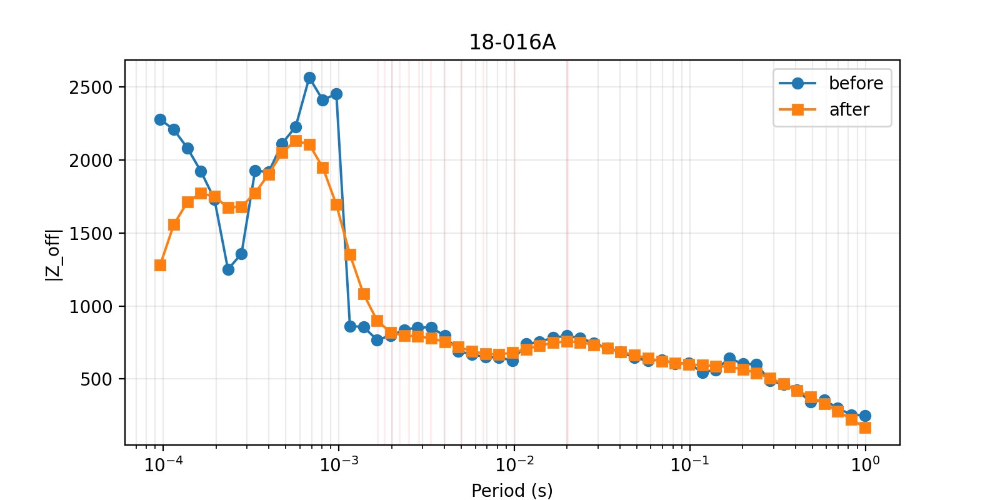

.. _emtools_remove_noise:

Noise Removal And Spatial Filtering
===================================

``pycsamt.emtools.remove_noise`` is the main post-estimation cleaning
module for CSAMT/AMT/MT transfer functions. It operates on impedance
and tipper arrays already stored in EDI or ``Sites`` objects. It does
not estimate transfer functions from time series, and it does not
perform true remote-reference processing internally. Use it after data
loading, and before inversion or final interpretation, when the survey
contains power-line harmonics, isolated frequency spikes, station-local
outliers, station-to-station jumps, or rows that should be filtered more
strongly because their confidence is low.

The module has many functions because noise is not one problem. A
single CSAMT line may need one or more of these treatments:

.. list-table::
   :header-rows: 1
   :widths: 23 38 39

   * - Step
     - Use when
     - Typical functions
   * - Diagnose noise
     - You need to see which stations and frequencies are weak before
       editing the survey.
     - ``snr_table``, ``emi_mitigation_report``
   * - Remove mains harmonics
     - Frequencies land near 50/60 Hz or harmonics.
     - ``notch_powerline``
   * - Smooth along frequency
     - Curves are locally jagged, but neighboring frequencies should be
       continuous.
     - ``smooth_logfreq``, ``smooth_rho_phase``
   * - Remove isolated outliers
     - A few rows or stations are inconsistent with their local
       neighbors.
     - ``hampel_filter_freq``, ``spatial_median_filter``,
       ``rpca_offdiag_denoise``
   * - Enforce impedance consistency
     - Off-diagonal components should be closer to an anti-symmetric
       1-D/2-D response.
     - ``enforce_offdiag_consistency``
   * - Mask or drop bad frequencies
     - Frequencies are globally weak or known to be contaminated.
     - ``mask_incoherent_freqs``, ``drop_freqs_manual``
   * - Stabilize station profiles
     - One station is shifted relative to its neighbors, or an EMAP
       style spatial average is appropriate.
     - ``correct_static_shift``, ``apply_emap_filter``,
       ``confidence_gated_emap_filter``
   * - Verify the correction
     - You need before/after figures for the report or paper.
     - ``emap_filter_report``, ``plot_emap_filter_profile``,
       ``plot_emap_filter_psection``, ``nr_qc_*`` plots

Full function signatures and parameter defaults are maintained in the
:doc:`API reference <../../api/emtools>`. This page focuses on practical
usage, decision making, and reproducible code.

Loading A Survey Safely
-----------------------

Noise removal functions accept the same inputs as most ``emtools``
workflows: a directory of EDI files, a single EDI path, an existing
``Sites`` object, or an iterable of station-like objects. For
repeatable processing, load once with ``ensure_sites`` and keep the raw
object unchanged while you test settings.

.. code-block:: python
   :linenos:

   from pathlib import Path

   from pycsamt.emtools import ensure_sites

   edi_dir = Path("data/AMT/WILLY_DATA/L18PLT")
   raw = ensure_sites(edi_dir, recursive=True, verbose=0)

   # Most remove_noise functions default to inplace=False. The returned
   # object is therefore the processed survey, while raw remains the
   # baseline for before/after QC.
   processed = raw

Use ``inplace=False`` during exploration. Switch to ``inplace=True`` only
inside a controlled pipeline where you no longer need the raw object in
memory.

SNR Diagnostics
---------------

The simplest diagnostic is ``snr_table``. It returns one row per station
and frequency. For each row, pyCSAMT computes an impedance-amplitude
signal-to-noise ratio from ``Z`` and ``Z_err``:

.. math::

   \mathrm{SNR}
   =
   \frac{\sqrt{\overline{|Z|^2}}}
        {\sqrt{\overline{|Z_{\mathrm{err}}|^2}}}

If the input EDI files do not contain impedance errors, the SNR values
are ``NaN``. That is useful information: it means later SNR-gated steps
cannot make a data-driven decision from error bars.

.. code-block:: python
   :linenos:

   from pycsamt.emtools import ensure_sites
   from pycsamt.emtools.remove_noise import snr_table

   sites = ensure_sites("data/AMT/WILLY_DATA/L18PLT", recursive=True)
   snr = snr_table(sites)

   print(snr.head())
   print(snr["snr"].describe())

   weak_rows = snr.loc[snr["snr"] < 3.0, ["station", "freq", "snr"]]
   weak_by_station = (
       weak_rows.groupby("station", as_index=False)
       .agg(n_weak=("freq", "size"), min_snr=("snr", "min"))
       .sort_values(["n_weak", "min_snr"], ascending=[False, True])
   )
   print(weak_by_station.head(10))

.. code-block:: text

   station     freq        snr
   0  18-001A  10400.0  24.379116
   1  18-001A   8707.0  21.511108
   2  18-001A   7289.0  21.241377
   3  18-001A   6102.0  15.230757
   4  18-001A   5108.0  13.140256
   count    1484.000000
   mean       14.064419
   std         5.878163
   min         2.187781
   25%         9.679665
   50%        13.271554
   75%        17.294278
   max        56.055512
   Name: snr, dtype: float64
      station  n_weak   min_snr
   2  18-024U       3  2.187781
   1  18-022U       1  2.388301
   0  18-018A       1  2.808353

Import ``snr_table`` from ``pycsamt.emtools.remove_noise`` when you are
documenting this module specifically. The top-level ``pycsamt.emtools``
namespace also exposes an ``snr_table`` name used by the spectra tools,
so the explicit module import avoids ambiguity.

Remote Reference And EMI Reporting
----------------------------------

The remove-noise layer works on estimated transfer functions. It cannot
create a remote-referenced impedance tensor unless remote-reference
processing was already performed by field software or an external
processor. What it can do is make the mitigation record explicit:
whether remote reference was attempted, whether it was available, which
power-line notch settings were used, and how many harmonic samples were
affected.

.. code-block:: python
   :linenos:

   from pycsamt.emtools import ensure_sites
   from pycsamt.emtools.remove_noise import emi_mitigation_report

   sites = ensure_sites("data/AMT/WILLY_DATA/L18PLT", recursive=True)

   emi = emi_mitigation_report(
       sites,
       remote_reference_attempted=False,
       remote_reference_reason=(
           "No independent remote-reference time series were acquired; "
           "post-estimation EMI mitigation was applied to the EDI transfer functions."
       ),
       mains_hz=50.0,
       n_harm=30,
       tol_hz=0.08,
       notch_mode="interp",
   )

   print(
       emi[
           [
               "station",
               "remote_reference_attempted",
               "remote_reference_available",
               "n_frequency",
               "harmonic_z_samples",
               "harmonic_tipper_samples",
               "applied_measures",
           ]
       ].head()
   )

.. code-block:: text

      station  ...                                   applied_measures
   0  18-001A  ...  notch_powerline(mode=interp, mains_hz=50, n_ha...
   1  18-002U  ...  notch_powerline(mode=interp, mains_hz=50, n_ha...
   2  18-003A  ...  notch_powerline(mode=interp, mains_hz=50, n_ha...
   3  18-004A  ...  notch_powerline(mode=interp, mains_hz=50, n_ha...
   4  18-005U  ...  notch_powerline(mode=interp, mains_hz=50, n_ha...

   [5 rows x 7 columns]

This report is especially useful in manuscripts and reproducibility
bundles because it states what was not done as clearly as what was done.
If remote-reference EDIs are supplied, load those files and set the
report fields accordingly.

Power-Line Notching
-------------------

``notch_powerline`` finds frequencies within ``tol_hz`` of
``mains_hz * k`` for harmonics ``k = 1 .. n_harm``. It can either set
those rows to ``NaN`` with ``mode="mask"`` or replace them by
interpolation from neighboring frequencies with ``mode="interp"``.

.. code-block:: python
   :linenos:

   from pycsamt.emtools import ensure_sites, notch_powerline

   sites = ensure_sites("data/AMT/WILLY_DATA/L18PLT", recursive=True)

   notched = notch_powerline(
       sites,
       mains_hz=50.0,
       n_harm=30,
       tol_hz=0.08,
       mode="interp",
       also="both",
       inplace=False,
   )

Use ``mode="mask"`` when you want contaminated rows to remain visibly
missing for later QC. Use ``mode="interp"`` when the downstream workflow
requires a complete frequency axis. Use ``also="z"`` for impedance only,
``also="tipper"`` for tipper only, or ``also="both"`` when both tensors
share the same contaminated frequencies.

Sparse logarithmic CSAMT grids often do not land exactly on 50/60 Hz
harmonics. In that case the function may make no changes at conservative
``tol_hz`` values. That is not a failure. It means the sampled
frequencies are not close enough to the harmonic rows you asked it to
treat.

Log-Frequency Smoothing
-----------------------

``smooth_logfreq`` applies a moving average directly to complex tensor
rows along the frequency axis. It is a local smoother. It does not assume
a global resistivity model; it only says that neighboring log-frequency
samples should be less jagged.

.. code-block:: python
   :linenos:

   from pycsamt.emtools import ensure_sites, smooth_logfreq

   sites = ensure_sites("data/AMT/WILLY_DATA/L18PLT", recursive=True)

   smoothed = smooth_logfreq(
       sites,
       win=5,
       kind="tri",
       also="both",
       gate_snr=2.5,
       inplace=False,
   )

``win`` is the number of frequency rows used by the moving window.
``kind="tri"`` gives the center row more weight than the edges;
``kind="box"`` gives every row equal weight. ``gate_snr`` limits
smoothing to rows that pass the chosen SNR logic inside the function.
Set ``gate_snr=None`` when you deliberately want every row smoothed.

Rho/Phase Trend Smoothing
-------------------------

``smooth_rho_phase`` is more interpretive. It converts impedance
components to apparent resistivity and phase, fits a polynomial trend in
log-frequency space, unwraps phase, then rebuilds complex impedance from
the smoothed curves.

.. code-block:: python
   :linenos:

   from pycsamt.emtools import ensure_sites, smooth_rho_phase

   sites = ensure_sites("data/AMT/WILLY_DATA/L18PLT", recursive=True)

   trend = smooth_rho_phase(
       sites,
       components="offdiag",
       degree=3,
       min_points=None,
       smooth_rho=True,
       smooth_phase=True,
       robust=True,
       robust_iters=3,
       blend=1.0,
       inplace=False,
   )

Choose ``smooth_logfreq`` for local jitter. Choose ``smooth_rho_phase``
when you expect a station curve to follow a smooth global trend.
``components`` can be ``"offdiag"``, ``"diagonal"``, ``"all"``, or an
explicit list such as ``("xy", "yx")``. ``blend`` lets you mix the
filtered value with the original value; for example ``blend=0.5`` moves
only halfway toward the fitted trend.

Outlier And Spatial Denoising
-----------------------------

Outlier removal can operate along one station's frequency curve, across
neighboring stations, or across the whole survey matrix.

.. code-block:: python
   :linenos:

   from pycsamt.emtools import (
       ensure_sites,
       hampel_filter_freq,
       rpca_offdiag_denoise,
       spatial_median_filter,
   )

   sites = ensure_sites("data/AMT/WILLY_DATA/L18PLT", recursive=True)

   # Per-station, along frequency. Best for isolated spikes in one curve.
   hampel = hampel_filter_freq(
       sites,
       win=3,
       nsig=3.0,
       on="z",
       inplace=False,
   )

   # Across station order. Best for a station that jumps relative to its
   # neighbors at the same frequency.
   spatial = spatial_median_filter(
       sites,
       half_window=2,
       lam=0.25,
       on="z",
       inplace=False,
   )

   # Survey-wide low-rank denoising of off-diagonal log magnitudes.
   # Best when the line has a common coherent trend plus sparse outliers.
   low_rank = rpca_offdiag_denoise(
       sites,
       rank=2,
       inplace=False,
   )

``hampel_filter_freq`` is conservative at typical ``nsig`` values. It
does not remove a station merely because the station is high amplitude;
it removes rows that are local outliers relative to the station's own
nearby frequencies. ``spatial_median_filter`` uses neighboring stations,
so it should be applied only when station order has spatial meaning.
``rpca_offdiag_denoise`` can be powerful, but a low-rank model may damp a
real station anomaly if that anomaly is not shared by the rest of the
line. Always inspect before/after curves when using it.

Off-Diagonal Consistency
------------------------

For a simple 1-D or approximately 2-D response, the off-diagonal
impedance terms often satisfy an anti-symmetric relationship:
``Zxy ~= -Zyx``. ``enforce_offdiag_consistency`` blends the observed
off-diagonal components toward that target.

.. code-block:: python
   :linenos:

   from pycsamt.emtools import ensure_sites, enforce_offdiag_consistency

   sites = ensure_sites("data/AMT/WILLY_DATA/L18PLT", recursive=True)

   consistent = enforce_offdiag_consistency(
       sites,
       mode="anti",
       lam=0.5,
       inplace=False,
   )

``lam=0`` leaves the data unchanged. ``lam=1`` fully replaces the
selected components by the consistency target. Intermediate values are
usually safer because real 3-D structure, galvanic distortion, and
measurement geometry can all create departures from the ideal
anti-symmetric relation.

Masking And Manual Frequency Drops
----------------------------------

``mask_incoherent_freqs`` uses the survey SNR table to identify
frequencies where too few stations pass an SNR threshold. It masks those
frequencies rather than pretending they are reliable.

.. code-block:: python
   :linenos:

   from pycsamt.emtools import (
       drop_freqs_manual,
       ensure_sites,
       mask_incoherent_freqs,
   )

   sites = ensure_sites("data/AMT/WILLY_DATA/L18PLT", recursive=True)

   masked = mask_incoherent_freqs(
       sites,
       snr_thresh=2.5,
       min_frac=0.4,
       inplace=False,
   )

   trimmed = drop_freqs_manual(
       sites,
       drop_freqs=[50.0, 60.0],
       tol_rel=0.005,
       inplace=False,
   )

Use ``mask_incoherent_freqs`` for a rule based on the data. Use
``drop_freqs_manual`` when the field log, instrument notes, or a
diagnostic figure identifies specific frequencies. Manual drops use a
relative tolerance, so give the sampled frequency value when possible.

Group-Trend Shrinkage
---------------------

``shrink_to_group_trend`` pulls station curves toward a group median
trend. By default it is gated to harmonic rows, which makes it a
targeted EMI treatment rather than a blanket smoothing operation.

.. code-block:: python
   :linenos:

   from pycsamt.emtools import ensure_sites, shrink_to_group_trend

   sites = ensure_sites("data/AMT/WILLY_DATA/L18PLT", recursive=True)

   harmonic_shrink = shrink_to_group_trend(
       sites,
       lam=0.25,
       gate_harm=True,
       mains_hz=50.0,
       n_harm=30,
       tol_hz=0.08,
       inplace=False,
   )

   all_rows_shrink = shrink_to_group_trend(
       sites,
       lam=0.25,
       gate_harm=False,
       inplace=False,
   )

Keep ``gate_harm=True`` when the problem is power-line contamination.
Use ``gate_harm=False`` only when you have decided that the entire line
should be pulled toward a common spatial trend.

Static Shift And EMAP Filters
-----------------------------

The module contains two related families of station-profile filters.
``correct_static_shift`` implements a Torres-Verdin and Bostick style
Hanning adaptive moving-average correction. ``apply_emap_filter`` is a
dispatcher for adaptive moving average (``"ama"``), fixed-length moving
average (``"flma"``), and trimmed moving average (``"tma"``).

.. code-block:: python
   :linenos:

   from pycsamt.emtools import (
       apply_emap_filter,
       correct_static_shift,
       ensure_sites,
   )

   sites = ensure_sites("data/AMT/WILLY_DATA/L18PLT", recursive=True)

   ama_static = correct_static_shift(
       sites,
       window_m=1500.0,
       comp="xy",
       inplace=False,
   )

   flma = apply_emap_filter(
       sites,
       method="flma",
       window=5,
       component="xy",
       inplace=False,
   )

   tma = apply_emap_filter(
       sites,
       method="tma",
       window=5,
       component="xy",
       inplace=False,
   )

These filters assume that station order and station spacing are
meaningful. They are most useful on survey lines where neighboring
stations should share a broad geoelectric trend and sudden
station-to-station jumps are likely to be static shift or local noise.
They are less appropriate when a sharp station-local feature is a known
target.

EMAP Reports And Plots
----------------------

Before using an EMAP-filtered survey downstream, summarize where the
filter changed the data.

.. code-block:: python
   :linenos:

   import matplotlib.pyplot as plt

   from pycsamt.emtools import (
       apply_emap_filter,
       emap_filter_report,
       ensure_sites,
       plot_emap_filter_profile,
       plot_emap_filter_psection,
   )

   sites = ensure_sites("data/AMT/WILLY_DATA/L18PLT", recursive=True)
   flma = apply_emap_filter(
       sites,
       method="flma",
       window=5,
       component="xy",
       inplace=False,
   )

   report = emap_filter_report(
       sites,
       flma,
       component="xy",
   )
   print(report.sort_values("rms_delta_log10_abs_z", ascending=False).head())

   fig, ax = plt.subplots(figsize=(8, 4))
   plot_emap_filter_profile(
       sites,
       flma,
       method="flma",
       component="xy",
       ax=ax,
   )
   fig.tight_layout()
   fig.savefig("emap_filter_profile_xy.png", dpi=200)
   plt.close(fig)

   fig = plot_emap_filter_psection(
       sites,
       flma,
       method="flma",
       component="xy",
   )
   fig.savefig("emap_filter_psection_xy.png", dpi=200)
   plt.close(fig)

.. code-block:: text

       station component  ...  median_delta_log10_abs_z  rms_delta_log10_abs_z
   18  18-019U        xy  ...                  0.415765               0.505929
   26  18-024U        xy  ...                  0.346431               0.401617
   22  18-022U        xy  ...                  0.360391               0.391346
   17  18-018A        xy  ...                  0.361853               0.377488
   23  18-022V        xy  ...                  0.300769               0.310826

   [5 rows x 5 columns]

.. grid:: 1 1 2 2
   :gutter: 2

   .. grid-item::

      .. image:: ../../images/user_guide/emtools/user-guide-emtools-remove-noise-12-01.png
         :width: 100%

   .. grid-item::

      .. image:: ../../images/user_guide/emtools/user-guide-emtools-remove-noise-12-02.png
         :width: 100%

``plot_emap_filter_profile`` is the quickest way to check one frequency
profile along the line. ``plot_emap_filter_psection`` shows the
before/after/delta pseudo-section across stations and periods. Use both:
one exposes station-to-station behavior clearly, and the other shows
whether corrections concentrate in a narrow period band.

Confidence-Gated EMAP Filtering
-------------------------------

``confidence_gated_emap_filter`` connects the noise-removal module to
the QC module. It builds a frequency confidence table, computes an EMAP
filtered candidate, then decides row by row how much filtered data to
use:

* confidence above ``ci_hi``: preserve the original row;
* confidence below ``ci_lo``: use the filtered row;
* confidence between the thresholds: blend original and filtered rows.

.. code-block:: python
   :linenos:

   from pycsamt.emtools import confidence_gated_emap_filter, ensure_sites

   sites = ensure_sites("data/AMT/WILLY_DATA/L18PLT", recursive=True)

   result = confidence_gated_emap_filter(
       sites,
       method="flma",
       window=5,
       ci_hi=0.90,
       ci_lo=0.50,
       component="xy",
   )

   print(result.summary())
   print(result.report.head())
   print(result.decisions.head())

   gated_sites = result.sites

.. code-block:: text

   EMAPFilterResult(method='flma', confidence='composite', preserved=0, blended=1411, filtered=73)
      station  n_freq  ...  median_confidence  median_delta_log10_abs_z
   0  18-001A      53  ...           0.711753                 -0.020918
   1  18-002U      53  ...           0.749480                  0.015749
   2  18-003A      53  ...           0.666613                  0.046988
   3  18-004A      53  ...           0.735994                  0.004156
   4  18-005U      53  ...           0.728841                 -0.025544

   [5 rows x 8 columns]
      station  frequency_hz  period_s  ...  blend_weight   action  delta_log10_abs_z
   0  18-001A       10400.0  0.000096  ...      0.109609  blended          -0.002075
   1  18-001A        8707.0  0.000115  ...      0.134217  blended          -0.001228
   2  18-001A        7289.0  0.000137  ...      0.142135  blended          -0.001559
   3  18-001A        6102.0  0.000164  ...      0.236784  blended          -0.006566
   4  18-001A        5108.0  0.000196  ...      0.437715  blended          -0.007875

   [5 rows x 8 columns]

The return value is an ``EMAPFilterResult``. It keeps the processed
``sites`` object, a station-level ``report``, a row-level ``decisions``
table, the EMAP method, and the confidence thresholds. The convenience
properties ``n_preserved``, ``n_blended``, and ``n_filtered`` are useful
for logging.

.. code-block:: python
   :linenos:

   from pycsamt.emtools import confidence_gated_emap_filter, ensure_sites

   sites = ensure_sites("data/AMT/WILLY_DATA/L18PLT", recursive=True)
   result = confidence_gated_emap_filter(sites, method="flma")

   print(result.n_preserved)
   print(result.n_blended)
   print(result.n_filtered)

   most_filtered = (
       result.report.sort_values(
           ["n_filtered", "median_confidence"],
           ascending=[False, True],
       )
       .loc[:, ["station", "n_preserved", "n_blended", "n_filtered", "median_confidence"]]
   )
   print(most_filtered.head(10))

.. code-block:: text

   0
   1411
   73
       station  n_preserved  n_blended  n_filtered  median_confidence
   22  18-022U            0         38          15           0.569810
   24  18-023A            0         41          12           0.612583
   5   18-006A            0         47           6           0.764254
   12  18-013U            0         48           5           0.669948
   20  18-021B            0         49           4           0.594338
   17  18-018A            0         50           3           0.585752
   26  18-024U            0         50           3           0.631934
   11  18-012A            0         50           3           0.651210
   2   18-003A            0         50           3           0.666613
   13  18-014A            0         50           3           0.699489

This is usually safer than applying the same spatial filter everywhere.
High-confidence rows remain close to the measurement, while low
confidence rows are allowed to borrow more from station-neighbor
structure.

Full Pipeline
-------------

``remove_noise_pipeline`` provides a compact chain for common cleaning:
power-line notching, frequency smoothing, and optional group-trend
shrinkage. It is convenient for batch processing, but you should still
run the individual diagnostics first so you know which part of the
pipeline is doing the work.

.. code-block:: python
   :linenos:

   from pathlib import Path

   from pycsamt.emtools import ensure_sites, remove_noise_pipeline

   sites = ensure_sites("data/AMT/WILLY_DATA/L18PLT", recursive=True)

   cleaned = remove_noise_pipeline(
       sites,
       mains_hz=50.0,
       n_harm=30,
       tol_hz=0.08,
       notch_mode="interp",
       smooth_win=5,
       smooth_kind="tri",
       gate_snr=2.5,
       group_shrink=False,
       inplace=False,
   )

   output_dir = Path("outputs/remove_noise")
   output_dir.mkdir(parents=True, exist_ok=True)

The exact keyword names are intentionally close to the lower-level
functions. Keep your pipeline call in a script or notebook with all
parameters written out. That makes the processing reproducible and
prevents hidden defaults from changing the interpretation later.

QC Figures For Noise Removal
----------------------------

The dedicated ``nr_qc_*`` figures compare a raw survey with a named
noise-removal method. They are designed to be used after a method is
chosen, not as a substitute for choosing the method carefully.

.. code-block:: python
   :linenos:

   import matplotlib.pyplot as plt

   from pycsamt.emtools import (
       ensure_sites,
       nr_qc_delta_offdiag_psection,
       nr_qc_harmonic_waterfall,
       nr_qc_snr_gain_profile,
       nr_qc_station_offdiag_curves,
   )

   sites = ensure_sites("data/AMT/WILLY_DATA/L18PLT", recursive=True)

   fig, ax = plt.subplots(figsize=(9, 5))
   nr_qc_delta_offdiag_psection(
       sites,
       method="pipeline",
       ax=ax,
   )
   fig.savefig("nr_qc_delta_offdiag_psection.png", dpi=200)
   plt.close(fig)

   fig, ax = plt.subplots(figsize=(8, 4))
   nr_qc_snr_gain_profile(
       sites,
       method="pipeline",
       ax=ax,
   )
   fig.tight_layout()
   fig.savefig("nr_qc_snr_gain_profile.png", dpi=200)
   plt.close(fig)

   fig, ax = plt.subplots(figsize=(9, 5))
   nr_qc_harmonic_waterfall(
       sites,
       method="notch",
       mains_hz=50.0,
       n_harm=5,
       tol_hz=25.0,
       ax=ax,
   )
   fig.savefig("nr_qc_harmonic_waterfall.png", dpi=200)
   plt.close(fig)

   fig, ax = plt.subplots(figsize=(8, 4))
   nr_qc_station_offdiag_curves(
       sites,
       method="pipeline",
       station="18-016A",
       ax=ax,
   )
   fig.tight_layout()
   fig.savefig("nr_qc_station_offdiag_curves_18-016A.png", dpi=200)
   plt.close(fig)

.. grid:: 1 1 2 2
   :gutter: 2

   .. grid-item::

      .. image:: ../../images/user_guide/emtools/user-guide-emtools-remove-noise-16-01.png
         :width: 100%

   .. grid-item::

      .. image:: ../../images/user_guide/emtools/user-guide-emtools-remove-noise-16-02.png
         :width: 100%

   .. grid-item::

      .. image:: ../../images/user_guide/emtools/user-guide-emtools-remove-noise-16-03.png
         :width: 100%

   .. grid-item::

      .. image:: ../../images/user_guide/emtools/user-guide-emtools-remove-noise-16-04.png
         :width: 100%

``nr_qc_delta_offdiag_psection`` shows where off-diagonal magnitude
changed in station-period space. ``nr_qc_snr_gain_profile`` summarizes
SNR gain by station. ``nr_qc_harmonic_waterfall`` is specific to
power-line harmonic reduction. ``nr_qc_station_offdiag_curves`` is the
plainest check: one station, before and after, on the same axes.

Choosing A Treatment
--------------------

Start with the least interpretive operation that addresses the observed
problem.

* If only known harmonic rows are contaminated, start with
  ``notch_powerline``.
* If curves are locally jagged but geologically plausible, try
  ``smooth_logfreq`` with a small window.
* If the whole curve should be smooth in apparent resistivity and phase,
  try ``smooth_rho_phase`` and inspect phase behavior.
* If one row is a spike, use ``hampel_filter_freq``.
* If one station differs from its neighbors at the same frequencies, use
  ``spatial_median_filter`` or an EMAP filter.
* If many stations share a coherent trend but a few observations depart
  from it, test ``rpca_offdiag_denoise`` carefully.
* If QC confidence is already available, prefer
  ``confidence_gated_emap_filter`` over applying one fixed-strength
  spatial filter everywhere.

Do not stack every function by default. Each step changes the transfer
function. A defensible workflow has a diagnostic reason for every
correction and a before/after figure showing the effect.

Reproducible Bundle
-------------------

A practical processing bundle usually contains four outputs:

.. code-block:: python
   :linenos:

   from pathlib import Path

   import matplotlib.pyplot as plt

   from pycsamt.emtools import (
       ensure_sites,
       nr_qc_station_offdiag_curves,
       remove_noise_pipeline,
   )
   from pycsamt.emtools.remove_noise import emi_mitigation_report, snr_table

   out = Path("outputs/remove_noise_l18plt")
   out.mkdir(parents=True, exist_ok=True)

   sites = ensure_sites("data/AMT/WILLY_DATA/L18PLT", recursive=True)

   snr_table(sites).to_csv(out / "snr_table_raw.csv", index=False)
   emi_mitigation_report(
       sites,
       remote_reference_attempted=False,
       mains_hz=50.0,
       n_harm=30,
       tol_hz=0.08,
       notch_mode="interp",
   ).to_csv(out / "emi_mitigation_report.csv", index=False)

   cleaned = remove_noise_pipeline(
       sites,
       mains_hz=50.0,
       notch_mode="interp",
       smooth_win=5,
       smooth_kind="tri",
       gate_snr=2.5,
       group_shrink=False,
       inplace=False,
   )

   fig, ax = plt.subplots(figsize=(8, 4))

   nr_qc_station_offdiag_curves(
       sites,
       method="pipeline",
       station="18-016A",
       ax=ax,
   )
   fig.savefig(out / "station_18-016A_pipeline_offdiag.png", dpi=200)
   plt.close(fig)

Keep the raw SNR table, EMI report, processing script, and representative
QC figures together. That gives reviewers enough information to
understand both the data quality and the editing decisions.

Worked Example
--------------

The example below uses the real L18PLT survey where possible and small
synthetic dense-frequency objects only where the real frequency grid
does not contain power-line harmonic rows. It demonstrates SNR
diagnostics, notching, smoothing, Hampel/spatial/RPCA denoising,
consistency enforcement, masking, group-trend shrinkage, EMAP filtering,
confidence-gated EMAP filtering, the full pipeline, and the dedicated QC
plots.

.. literalinclude:: ../../../examples/emtools/plot_remove_noise.py
   :language: python
   :linenos:
